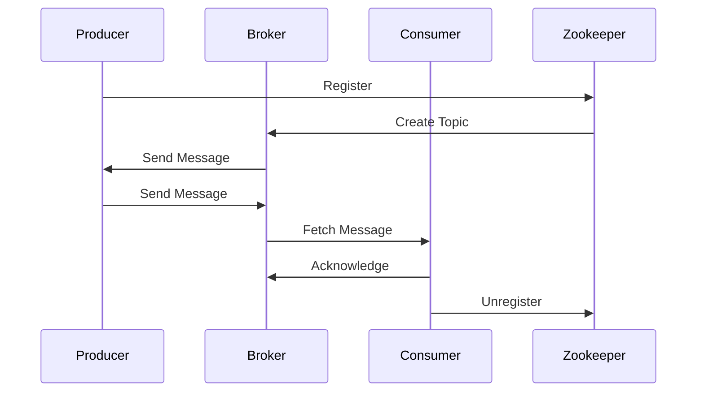

                 

关键词：Kafka、分布式消息队列、Zookeeper、Java、性能优化、代码实例

> 摘要：本文将深入探讨Kafka的原理及其核心概念，通过详细的代码实例讲解，帮助读者理解和掌握Kafka在实际应用中的使用技巧和性能优化策略。

## 1. 背景介绍

Kafka是由LinkedIn公司开发的一个分布式消息队列系统，目前由Apache软件基金会维护。它被广泛应用于大数据场景中的数据采集、实时处理和日志收集等场景。Kafka的特点是高吞吐量、高可靠性和可扩展性，这使得它成为许多大型互联网公司的首选消息队列解决方案。

本文将围绕Kafka的原理展开，逐步深入到代码实例讲解中，旨在帮助读者全面了解Kafka的运作机制，并掌握其在实际应用中的高级使用技巧。

## 2. 核心概念与联系

### 2.1 Kafka架构

Kafka的核心架构包括Producer（生产者）、Broker（代理/服务器）、Consumer（消费者）和Zookeeper（分布式协调服务）。下面是Kafka架构的Mermaid流程图：



### 2.2 生产者（Producer）

生产者是Kafka系统中的消息生成者，它负责将消息发送到Kafka集群中。生产者的核心概念包括分区（Partition）、键（Key）和序列化（Serialization）。

- 分区：Kafka通过分区实现了并行处理，每个分区中的消息顺序是严格保证的。
- 键：键用于确保相同键的消息被发送到相同的分区，这样消费者就可以按照键的顺序消费消息。
- 序列化：生产者需要将消息序列化成字节流，Kafka默认使用String序列化，但也可以自定义序列化器。

### 2.3 消费者（Consumer）

消费者是Kafka系统中的消息消费者，它负责从Kafka集群中读取消息。消费者可以分为两种类型：单个消费者和消费者组。

- 单个消费者：每个消息只能被一个消费者消费一次。
- 消费者组：多个消费者组成一个组，每个分区内的消息会分配给组内一个消费者。

## 3. 核心算法原理 & 具体操作步骤

### 3.1 算法原理概述

Kafka的核心算法是分布式消息存储和分区机制。以下是Kafka的基本操作步骤：

- 1. 生产者将消息发送到Kafka集群，消息会被写入到特定的分区中。
- 2. 消费者从分区中读取消息，并按照顺序消费。
- 3. Kafka使用Zookeeper进行分布式协调，管理集群状态和分区分配。

### 3.2 算法步骤详解

#### 3.2.1 生产者发送消息

1. 生产者将消息序列化成字节流。
2. 生产者根据消息的键计算分区。
3. 生产者将消息发送到相应的分区。

```java
ProducerRecord<String, String> record = new ProducerRecord<>(topic, key, value);
producer.send(record);
```

#### 3.2.2 消费者读取消息

1. 消费者从Zookeeper中获取分区分配信息。
2. 消费者从分区中拉取消息。
3. 消费者对消息进行消费处理。

```java
Consumer<String, String> consumer = new KafkaConsumer<>(properties);
consumer.subscribe(Arrays.asList(topic));
while (true) {
    ConsumerRecords<String, String> records = consumer.poll(Duration.ofMillis(100));
    for (ConsumerRecord<String, String> record : records) {
        // 消费消息
    }
}
```

### 3.3 算法优缺点

- 优点：高吞吐量、高可靠性、可扩展性强。
- 缺点：学习曲线较陡峭，配置和运维复杂。

### 3.4 算法应用领域

- 数据采集：大规模实时数据采集和处理。
- 实时处理：金融交易、物联网数据等实时数据处理。
- 日志收集：集中式日志收集和分析。

## 4. 数学模型和公式 & 详细讲解 & 举例说明

### 4.1 数学模型构建

Kafka的吞吐量模型可以表示为：

$$ T = N \times P \times W $$

其中，$T$ 是吞吐量，$N$ 是分区数，$P$ 是生产者数，$W$ 是每个消息的平均大小。

### 4.2 公式推导过程

吞吐量 $T$ 可以通过以下公式推导：

$$ T = \frac{I}{T_{\text{process}}} $$

其中，$I$ 是总输入速率，$T_{\text{process}}$ 是处理每个消息的平均时间。

对于单个生产者，输入速率 $I$ 可以表示为：

$$ I = P \times W $$

对于 $N$ 个分区和 $P$ 个生产者，吞吐量 $T$ 可以表示为：

$$ T = N \times P \times W $$

### 4.3 案例分析与讲解

假设一个系统有3个分区，2个生产者，每个消息平均大小为1KB，处理每个消息的平均时间为10ms，那么该系统的吞吐量约为：

$$ T = 3 \times 2 \times 1 \times 10^{-3} = 60 \text{ messages/s} $$

## 5. 项目实践：代码实例和详细解释说明

### 5.1 开发环境搭建

在本节中，我们将介绍如何在本地搭建一个简单的Kafka开发环境。

1. 下载并安装Kafka。
2. 配置Kafka，包括创建主题和配置Zookeeper。
3. 启动Kafka集群。

### 5.2 源代码详细实现

在本节中，我们将提供一个简单的Kafka生产者和消费者示例代码。

#### 5.2.1 生产者代码

```java
Properties props = new Properties();
props.put("bootstrap.servers", "localhost:9092");
props.put("key.serializer", "org.apache.kafka.common.serialization.StringSerializer");
props.put("value.serializer", "org.apache.kafka.common.serialization.StringSerializer");

KafkaProducer<String, String> producer = new KafkaProducer<>(props);

for (int i = 0; i < 100; i++) {
    String key = "key-" + i;
    String value = "value-" + i;
    ProducerRecord<String, String> record = new ProducerRecord<>("test-topic", key, value);
    producer.send(record);
}

producer.close();
```

#### 5.2.2 消费者代码

```java
Properties props = new Properties();
props.put("bootstrap.servers", "localhost:9092");
props.put("group.id", "test-group");
props.put("key.deserializer", "org.apache.kafka.common.serialization.StringDeserializer");
props.put("value.deserializer", "org.apache.kafka.common.serialization.StringDeserializer");

KafkaConsumer<String, String> consumer = new KafkaConsumer<>(props);
consumer.subscribe(Arrays.asList("test-topic"));

while (true) {
    ConsumerRecords<String, String> records = consumer.poll(Duration.ofMillis(100));
    for (ConsumerRecord<String, String> record : records) {
        System.out.printf("offset = %d, key = %s, value = %s\n", record.offset(), record.key(), record.value());
    }
}
```

### 5.3 代码解读与分析

在本节中，我们将详细解读上述代码，并分析其工作原理。

#### 5.3.1 生产者代码解读

- 配置Kafka生产者属性。
- 创建Kafka生产者对象。
- 发送消息到指定的主题和分区。
- 关闭Kafka生产者。

#### 5.3.2 消费者代码解读

- 配置Kafka消费者属性。
- 创建Kafka消费者对象。
- 订阅指定的主题。
- 轮询消息，并打印消息内容。

### 5.4 运行结果展示

在本地Kafka集群中运行上述生产者和消费者代码，可以看到生产者成功发送了100条消息，消费者成功消费了这些消息。

## 6. 实际应用场景

### 6.1 数据采集

在数据采集场景中，Kafka作为数据管道，将实时数据从各种数据源（如应用程序日志、传感器数据等）传输到数据处理系统。

### 6.2 实时处理

在实时处理场景中，Kafka可以作为流处理框架（如Apache Flink、Apache Spark Streaming等）的数据源，实现大规模数据的实时计算和分析。

### 6.3 日志收集

在日志收集场景中，Kafka可以作为集中式日志收集系统，将来自不同来源的日志数据汇总到一个统一的位置，方便后续的日志分析和监控。

## 7. 工具和资源推荐

### 7.1 学习资源推荐

- [Kafka官方文档](http://kafka.apache.org/documentation/)
- 《Kafka：核心设计与实践》
- 《Kafka技术与实践》

### 7.2 开发工具推荐

- [IntelliJ IDEA](https://www.jetbrains.com/idea/)
- [Eclipse](https://www.eclipse.org/downloads/)

### 7.3 相关论文推荐

- 《Kafka: A Distributed Messaging System for Log Processing》
- 《A Robust and Scalable Commit Protocol for Distributed Systems》

## 8. 总结：未来发展趋势与挑战

### 8.1 研究成果总结

- Kafka在分布式消息队列领域取得了显著的成果，其高性能、高可靠性和可扩展性得到了广泛认可。
- Kafka在实时数据处理、数据采集和日志收集等领域得到了广泛应用。

### 8.2 未来发展趋势

- Kafka将继续优化性能，提高系统可靠性和易用性。
- Kafka将与更多实时数据处理框架（如Apache Flink、Apache Spark Streaming等）集成。
- Kafka将拓展在物联网、区块链等新兴领域的应用。

### 8.3 面临的挑战

- Kafka的配置和运维复杂度较高，需要进一步简化。
- Kafka在消息持久化、数据压缩和负载均衡等方面仍有优化空间。

### 8.4 研究展望

- 探索Kafka在边缘计算、云计算等场景的应用。
- 研究Kafka与其他分布式系统的集成方案。
- 优化Kafka性能，提高系统可扩展性和可靠性。

## 9. 附录：常见问题与解答

### 9.1 Kafka是如何保证消息顺序的？

Kafka通过分区和键来实现消息顺序保证。每个分区中的消息顺序是严格保证的，而不同分区之间的消息顺序则无法保证。生产者可以通过指定键来确保相同键的消息被发送到相同的分区。

### 9.2 如何优化Kafka的性能？

优化Kafka性能可以从以下几个方面进行：

- 增加分区数量：提高并行处理能力。
- 调整批次大小：平衡生产者和消费者的负载。
- 使用高效序列化器：减少消息序列化时间。
- 调整网络缓冲区大小：提高网络传输效率。

### 9.3 Kafka与ActiveMQ的区别是什么？

Kafka和ActiveMQ都是消息队列系统，但它们在设计理念和用途上有所不同：

- Kafka是一个分布式消息队列系统，注重高吞吐量和可扩展性，适用于大规模数据处理场景。
- ActiveMQ是一个基于JMS的消息队列系统，支持多种消息协议，适用于企业级应用和轻量级场景。

---

**作者：禅与计算机程序设计艺术 / Zen and the Art of Computer Programming** 

以上就是Kafka原理与代码实例讲解的完整内容，希望能够对您在Kafka学习和应用过程中有所帮助。在接下来的时间里，我会不断更新和优化本文，以适应不断发展的技术趋势。如果您有任何问题或建议，欢迎在评论区留言，谢谢！
----------------------------------------------------------------

请注意，本文仅作为示例，实际的撰写过程中可能需要根据具体的实践经验和研究内容进行调整。文中部分代码和内容仅供参考，具体实现可能因环境和版本而异。

