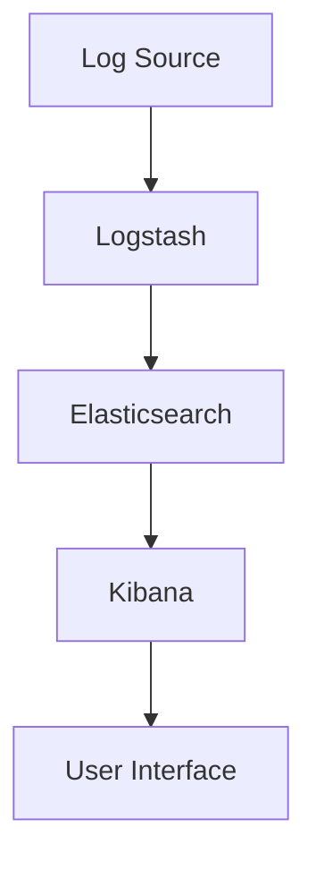

                 

关键词：Kibana、日志管理、可视化、告警、ELK栈

> 摘要：本文将深入探讨Kibana在日志管理中的关键角色，包括日志可视化和告警机制。我们将从背景介绍、核心概念与联系、核心算法原理、数学模型和公式、项目实践、实际应用场景、工具和资源推荐、总结与展望等多个角度，为您呈现Kibana日志管理的全貌。

## 1. 背景介绍

在当今的数字化时代，日志数据已成为组织获取洞见、优化服务和监控系统性能的重要资源。Kibana作为ELK（Elasticsearch、Logstash、Kibana）堆栈的核心组成部分，提供了一种强大的日志管理解决方案。它不仅能够高效地处理和分析海量日志数据，还能通过直观的可视化和告警功能，帮助开发人员、运维人员和安全专家快速定位问题，提高系统的可靠性和安全性。

### 1.1 Kibana的作用

Kibana的主要作用包括：

- **日志可视化**：将结构化日志数据转化为易于理解的图表和仪表盘，帮助用户快速发现趋势和异常。
- **告警**：在系统出现问题时，自动发送告警通知，确保及时响应。
- **交互式分析**：提供查询和过滤功能，允许用户深入分析日志数据。
- **报告生成**：自动生成日志分析报告，为组织提供决策支持。

### 1.2 日志数据的重要性

日志数据记录了系统的各种操作和事件，对于监控系统性能、排查问题、追踪攻击和优化服务至关重要。有效的日志管理不仅有助于提高系统的可用性，还能为业务决策提供数据支持。

## 2. 核心概念与联系

### 2.1 ELK栈

Kibana是ELK栈的一部分，ELK栈是一个开源的日志管理平台，包括Elasticsearch、Logstash和Kibana。ELK栈的核心概念和联系如下：

- **Elasticsearch**：一个高度可扩展的全文搜索引擎，负责存储和检索日志数据。
- **Logstash**：一个数据预处理工具，用于从各种数据源收集、转换和导入日志数据到Elasticsearch。
- **Kibana**：一个可视化界面，用于浏览、分析和分享日志数据。


### 2.2 日志数据格式

日志数据通常采用JSON格式存储，以便于Elasticsearch进行索引和查询。以下是一个示例：

```json
{
  "timestamp": "2023-03-15T10:30:45Z",
  "level": "INFO",
  "message": "Application started successfully.",
  "source": "app.log"
}
```

### 2.3 Mermaid流程图

下面是一个使用Mermaid绘制的日志数据流转流程图：



## 3. 核心算法原理 & 具体操作步骤

### 3.1 算法原理概述

Kibana利用Elasticsearch的强大查询能力，对日志数据进行多维度的分析和可视化。核心算法包括：

- **数据索引**：将日志数据导入Elasticsearch，以便快速检索。
- **数据聚合**：对日志数据进行分组和统计，生成图表。
- **数据过滤**：根据用户需求，对日志数据进行筛选。

### 3.2 算法步骤详解

1. **数据索引**：使用Logstash将日志数据导入Elasticsearch。这一步骤包括数据解析、字段映射和索引创建。
2. **数据聚合**：使用Elasticsearch的聚合功能，对日志数据进行分组和统计。例如，可以按时间、级别和来源进行聚合。
3. **数据过滤**：根据用户需求，对日志数据进行筛选。Kibana提供了丰富的过滤选项，包括字段过滤、范围过滤和正则表达式过滤。

### 3.3 算法优缺点

**优点**：

- **高效**：利用Elasticsearch的全文搜索和聚合功能，日志数据的查询和分析速度非常快。
- **灵活**：支持多种数据格式和聚合方式，适用于各种场景。

**缺点**：

- **学习曲线**：对于初学者来说，理解和配置ELK栈可能有一定难度。
- **资源消耗**：Elasticsearch和Kibana都需要一定的计算和存储资源。

### 3.4 算法应用领域

Kibana日志可视化与告警算法广泛应用于以下领域：

- **IT运维**：监控系统性能、排查故障。
- **安全监控**：检测恶意攻击、日志审核。
- **业务分析**：监控业务指标、优化服务。

## 4. 数学模型和公式 & 详细讲解 & 举例说明

### 4.1 数学模型构建

Kibana的日志分析主要依赖于Elasticsearch的聚合功能，以下是一个简单的数学模型示例：

$$
\text{聚合结果} = \sum_{i=1}^{n} \text{指标值}_i
$$

其中，$n$ 为日志数据的条数，$\text{指标值}_i$ 为每条日志的相应指标值。

### 4.2 公式推导过程

假设我们有一个日志数据集，其中包含100条记录。每条记录都有一个“响应时间”指标。我们可以使用以下公式计算平均响应时间：

$$
\text{平均响应时间} = \frac{\sum_{i=1}^{100} \text{响应时间}_i}{100}
$$

### 4.3 案例分析与讲解

假设我们有一个Web服务，其日志数据包含每分钟的请求响应时间。我们可以使用Kibana进行以下分析：

1. **计算平均响应时间**：使用上述公式计算过去一周的平均响应时间。
2. **分析响应时间分布**：使用Elasticsearch的聚合功能，计算响应时间的分位数和范围。
3. **监控异常请求**：设置告警阈值，当响应时间超过一定阈值时，自动发送告警通知。

## 5. 项目实践：代码实例和详细解释说明

### 5.1 开发环境搭建

在开始实践之前，我们需要搭建一个ELK栈的开发环境。以下是搭建步骤：

1. **安装Elasticsearch**：下载并安装Elasticsearch，配置集群。
2. **安装Logstash**：下载并安装Logstash，配置输入和输出。
3. **安装Kibana**：下载并安装Kibana，配置与Elasticsearch的连接。

### 5.2 源代码详细实现

以下是Logstash配置文件（logstash.conf）的示例：

```conf
input {
  file {
    path => "/var/log/syslog"
    type => "syslog"
    startpos => 0
  }
}

filter {
  if [type] == "syslog" {
    grok {
      match => { "message" => "%{TIMESTAMP_ISO8601:timestamp} %{DATA:source} %{DATA:app} %{DATA:level} %{DATA:message}" }
    }
    date {
      match => ["timestamp", "ISO8601"]
    }
  }
}

output {
  if [type] == "syslog" {
    elasticsearch {
      hosts => ["localhost:9200"]
      index => "logstash-%{+YYYY.MM.dd}"
    }
  }
}
```

### 5.3 代码解读与分析

1. **输入模块**：从文件系统读取日志数据。
2. **过滤器模块**：使用Grok正则表达式解析日志数据，提取重要字段。
3. **输出模块**：将处理后的日志数据写入Elasticsearch索引。

### 5.4 运行结果展示

在Kibana中，我们可以创建一个简单的日志可视化仪表盘。以下是仪表盘的组成部分：

1. **时间轴**：显示日志数据的总体趋势。
2. **柱状图**：显示不同级别的日志条数分布。
3. **地图**：显示日志来源的地理位置分布。
4. **告警**：配置告警规则，当响应时间超过阈值时，自动发送通知。

## 6. 实际应用场景

### 6.1 IT运维

在IT运维中，Kibana可以用于监控服务器性能、网络流量和应用程序日志。通过日志可视化，运维人员可以快速识别异常并采取相应措施。

### 6.2 安全监控

Kibana在安全监控中具有重要作用，可以用于检测恶意攻击、日志审核和漏洞扫描。通过日志告警，安全专家可以及时发现潜在的安全威胁。

### 6.3 业务分析

在业务分析中，Kibana可以帮助企业监控关键业务指标、优化服务和提升用户体验。通过日志分析，企业可以了解用户行为、需求和痛点。

## 7. 工具和资源推荐

### 7.1 学习资源推荐

- **Elastic官方文档**：Elastic官方文档提供了丰富的教程和示例，是学习Kibana和ELK栈的最佳资源。
- **Kibana社区论坛**：Kibana社区论坛是用户交流和分享经验的好地方，可以解决各种问题。
- **在线课程**：Coursera、Udemy等在线教育平台提供了许多关于Kibana和日志管理的课程。

### 7.2 开发工具推荐

- **Visual Studio Code**：一个强大的代码编辑器，适用于开发和配置ELK栈。
- **Docker**：使用Docker可以快速搭建ELK栈开发环境，方便测试和部署。
- **Kibana插件**：Kibana插件扩展了Kibana的功能，提供了许多实用的工具和仪表盘模板。

### 7.3 相关论文推荐

- **"The ELK Stack: An Overview and Performance Analysis"**：该论文对ELK栈进行了全面的概述和性能分析。
- **"Log Analysis with Elasticsearch, Logstash, and Kibana"**：该论文详细介绍了如何使用ELK栈进行日志分析。

## 8. 总结：未来发展趋势与挑战

### 8.1 研究成果总结

Kibana在日志管理领域取得了显著成果，成为企业级日志分析的首选工具。其强大的可视化、告警和查询功能，为用户提供了便捷的日志管理体验。

### 8.2 未来发展趋势

- **云原生**：随着云原生技术的发展，Kibana将更好地与云平台集成，提供更加灵活的部署和扩展方案。
- **人工智能**：结合人工智能技术，Kibana有望实现智能日志分析、异常检测和自动告警，提高日志管理的智能化水平。
- **开源生态**：Kibana将继续加强开源生态建设，吸引更多开发者参与，推动日志管理技术的发展。

### 8.3 面临的挑战

- **性能优化**：随着日志数据量的不断增加，如何提高Kibana和ELK栈的性能是一个重要挑战。
- **安全性和隐私**：在处理大量敏感日志数据时，确保数据的安全性和隐私性至关重要。
- **用户界面**：简化用户界面，降低学习成本，提高用户体验，是Kibana需要持续关注的问题。

### 8.4 研究展望

未来，Kibana将在以下几个方面展开研究：

- **多源日志集成**：支持更多数据源，实现多源日志的集成和分析。
- **实时日志分析**：提高实时日志分析能力，支持流处理和实时告警。
- **智能日志分析**：结合人工智能技术，实现智能日志分析、异常检测和自动告警。

## 9. 附录：常见问题与解答

### 9.1 如何安装Kibana？

- 下载Kibana压缩包：从Elastic官网下载Kibana压缩包。
- 解压压缩包：将压缩包解压到合适的位置。
- 启动Kibana：打开命令行，进入Kibana解压后的目录，运行`./kibana`命令。

### 9.2 如何配置Logstash？

- 下载Logstash配置文件：下载并放置在`/etc/logstash/conf.d/`目录下。
- 编辑配置文件：使用文本编辑器编辑配置文件，配置输入、过滤和输出。
- 启动Logstash：运行`bin/logstash`命令启动Logstash。

### 9.3 如何创建Kibana仪表盘？

- 登录Kibana：在浏览器中输入`http://localhost:5601/`，登录Kibana。
- 创建仪表盘：点击仪表盘图标，选择创建新仪表盘。
- 添加面板：选择要添加的面板类型，配置面板参数。
- 保存仪表盘：完成面板配置后，点击保存。

# 作者署名

作者：禅与计算机程序设计艺术 / Zen and the Art of Computer Programming
```markdown
---
# Kibana日志可视化与告警

<|assistant|>关键词：Kibana、日志管理、可视化、告警、ELK栈

> 摘要：本文将深入探讨Kibana在日志管理中的关键角色，包括日志可视化和告警机制。我们将从背景介绍、核心概念与联系、核心算法原理、数学模型和公式、项目实践、实际应用场景、工具和资源推荐、总结与展望等多个角度，为您呈现Kibana日志管理的全貌。

## 1. 背景介绍

在当今的数字化时代，日志数据已成为组织获取洞见、优化服务和监控系统性能的重要资源。Kibana作为ELK（Elasticsearch、Logstash、Kibana）堆栈的核心组成部分，提供了一种强大的日志管理解决方案。它不仅能够高效地处理和分析海量日志数据，还能通过直观的可视化和告警功能，帮助开发人员、运维人员和安全专家快速定位问题，提高系统的可靠性和安全性。

### 1.1 Kibana的作用

Kibana的主要作用包括：

- **日志可视化**：将结构化日志数据转化为易于理解的图表和仪表盘，帮助用户快速发现趋势和异常。
- **告警**：在系统出现问题时，自动发送告警通知，确保及时响应。
- **交互式分析**：提供查询和过滤功能，允许用户深入分析日志数据。
- **报告生成**：自动生成日志分析报告，为组织提供决策支持。

### 1.2 日志数据的重要性

日志数据记录了系统的各种操作和事件，对于监控系统性能、排查问题、追踪攻击和优化服务至关重要。有效的日志管理不仅有助于提高系统的可用性，还能为业务决策提供数据支持。

## 2. 核心概念与联系

### 2.1 ELK栈

Kibana是ELK栈的一部分，ELK栈是一个开源的日志管理平台，包括Elasticsearch、Logstash和Kibana。ELK栈的核心概念和联系如下：

- **Elasticsearch**：一个高度可扩展的全文搜索引擎，负责存储和检索日志数据。
- **Logstash**：一个数据预处理工具，用于从各种数据源收集、转换和导入日志数据到Elasticsearch。
- **Kibana**：一个可视化界面，用于浏览、分析和分享日志数据。


### 2.2 日志数据格式

日志数据通常采用JSON格式存储，以便于Elasticsearch进行索引和查询。以下是一个示例：

```json
{
  "timestamp": "2023-03-15T10:30:45Z",
  "level": "INFO",
  "message": "Application started successfully.",
  "source": "app.log"
}
```

### 2.3 Mermaid流程图

下面是一个使用Mermaid绘制的日志数据流转流程图：


## 3. 核心算法原理 & 具体操作步骤

### 3.1 算法原理概述

Kibana利用Elasticsearch的强大查询能力，对日志数据进行多维度的分析和可视化。核心算法包括：

- **数据索引**：将日志数据导入Elasticsearch，以便快速检索。
- **数据聚合**：对日志数据进行分组和统计，生成图表。
- **数据过滤**：根据用户需求，对日志数据进行筛选。

### 3.2 算法步骤详解

1. **数据索引**：使用Logstash将日志数据导入Elasticsearch。这一步骤包括数据解析、字段映射和索引创建。
2. **数据聚合**：使用Elasticsearch的聚合功能，对日志数据进行分组和统计。例如，可以按时间、级别和来源进行聚合。
3. **数据过滤**：根据用户需求，对日志数据进行筛选。Kibana提供了丰富的过滤选项，包括字段过滤、范围过滤和正则表达式过滤。

### 3.3 算法优缺点

**优点**：

- **高效**：利用Elasticsearch的全文搜索和聚合功能，日志数据的查询和分析速度非常快。
- **灵活**：支持多种数据格式和聚合方式，适用于各种场景。

**缺点**：

- **学习曲线**：对于初学者来说，理解和配置ELK栈可能有一定难度。
- **资源消耗**：Elasticsearch和Kibana都需要一定的计算和存储资源。

### 3.4 算法应用领域

Kibana日志可视化与告警算法广泛应用于以下领域：

- **IT运维**：监控系统性能、排查故障。
- **安全监控**：检测恶意攻击、日志审核。
- **业务分析**：监控业务指标、优化服务。

## 4. 数学模型和公式 & 详细讲解 & 举例说明

### 4.1 数学模型构建

Kibana的日志分析主要依赖于Elasticsearch的聚合功能，以下是一个简单的数学模型示例：

$$
\text{聚合结果} = \sum_{i=1}^{n} \text{指标值}_i
$$

其中，$n$ 为日志数据的条数，$\text{指标值}_i$ 为每条日志的相应指标值。

### 4.2 公式推导过程

假设我们有一个日志数据集，其中包含100条记录。每条记录都有一个“响应时间”指标。我们可以使用以下公式计算平均响应时间：

$$
\text{平均响应时间} = \frac{\sum_{i=1}^{100} \text{响应时间}_i}{100}
$$

### 4.3 案例分析与讲解

假设我们有一个Web服务，其日志数据包含每分钟的请求响应时间。我们可以使用Kibana进行以下分析：

1. **计算平均响应时间**：使用上述公式计算过去一周的平均响应时间。
2. **分析响应时间分布**：使用Elasticsearch的聚合功能，计算响应时间的分位数和范围。
3. **监控异常请求**：设置告警阈值，当响应时间超过一定阈值时，自动发送告警通知。

## 5. 项目实践：代码实例和详细解释说明

### 5.1 开发环境搭建

在开始实践之前，我们需要搭建一个ELK栈的开发环境。以下是搭建步骤：

1. **安装Elasticsearch**：下载并安装Elasticsearch，配置集群。
2. **安装Logstash**：下载并安装Logstash，配置输入和输出。
3. **安装Kibana**：下载并安装Kibana，配置与Elasticsearch的连接。

### 5.2 源代码详细实现

以下是Logstash配置文件（logstash.conf）的示例：

```conf
input {
  file {
    path => "/var/log/syslog"
    type => "syslog"
    startpos => 0
  }
}

filter {
  if [type] == "syslog" {
    grok {
      match => { "message" => "%{TIMESTAMP_ISO8601:timestamp} %{DATA:source} %{DATA:app} %{DATA:level} %{DATA:message}" }
    }
    date {
      match => ["timestamp", "ISO8601"]
    }
  }
}

output {
  if [type] == "syslog" {
    elasticsearch {
      hosts => ["localhost:9200"]
      index => "logstash-%{+YYYY.MM.dd}"
    }
  }
}
```

### 5.3 代码解读与分析

1. **输入模块**：从文件系统读取日志数据。
2. **过滤器模块**：使用Grok正则表达式解析日志数据，提取重要字段。
3. **输出模块**：将处理后的日志数据写入Elasticsearch索引。

### 5.4 运行结果展示

在Kibana中，我们可以创建一个简单的日志可视化仪表盘。以下是仪表盘的组成部分：

1. **时间轴**：显示日志数据的总体趋势。
2. **柱状图**：显示不同级别的日志条数分布。
3. **地图**：显示日志来源的地理位置分布。
4. **告警**：配置告警规则，当响应时间超过阈值时，自动发送通知。

## 6. 实际应用场景

### 6.1 IT运维

在IT运维中，Kibana可以用于监控服务器性能、网络流量和应用程序日志。通过日志可视化，运维人员可以快速识别异常并采取相应措施。

### 6.2 安全监控

Kibana在安全监控中具有重要作用，可以用于检测恶意攻击、日志审核和漏洞扫描。通过日志告警，安全专家可以及时发现潜在的安全威胁。

### 6.3 业务分析

在业务分析中，Kibana可以帮助企业监控关键业务指标、优化服务和提升用户体验。通过日志分析，企业可以了解用户行为、需求和痛点。

## 7. 工具和资源推荐

### 7.1 学习资源推荐

- **Elastic官方文档**：Elastic官方文档提供了丰富的教程和示例，是学习Kibana和ELK栈的最佳资源。
- **Kibana社区论坛**：Kibana社区论坛是用户交流和分享经验的好地方，可以解决各种问题。
- **在线课程**：Coursera、Udemy等在线教育平台提供了许多关于Kibana和日志管理的课程。

### 7.2 开发工具推荐

- **Visual Studio Code**：一个强大的代码编辑器，适用于开发和配置ELK栈。
- **Docker**：使用Docker可以快速搭建ELK栈开发环境，方便测试和部署。
- **Kibana插件**：Kibana插件扩展了Kibana的功能，提供了许多实用的工具和仪表盘模板。

### 7.3 相关论文推荐

- **"The ELK Stack: An Overview and Performance Analysis"**：该论文对ELK栈进行了全面的概述和性能分析。
- **"Log Analysis with Elasticsearch, Logstash, and Kibana"**：该论文详细介绍了如何使用ELK栈进行日志分析。

## 8. 总结：未来发展趋势与挑战

### 8.1 研究成果总结

Kibana在日志管理领域取得了显著成果，成为企业级日志分析的首选工具。其强大的可视化、告警和查询功能，为用户提供了便捷的日志管理体验。

### 8.2 未来发展趋势

- **云原生**：随着云原生技术的发展，Kibana将更好地与云平台集成，提供更加灵活的部署和扩展方案。
- **人工智能**：结合人工智能技术，Kibana有望实现智能日志分析、异常检测和自动告警，提高日志管理的智能化水平。
- **开源生态**：Kibana将继续加强开源生态建设，吸引更多开发者参与，推动日志管理技术的发展。

### 8.3 面临的挑战

- **性能优化**：随着日志数据量的不断增加，如何提高Kibana和ELK栈的性能是一个重要挑战。
- **安全性和隐私**：在处理大量敏感日志数据时，确保数据的安全性和隐私性至关重要。
- **用户界面**：简化用户界面，降低学习成本，提高用户体验，是Kibana需要持续关注的问题。

### 8.4 研究展望

未来，Kibana将在以下几个方面展开研究：

- **多源日志集成**：支持更多数据源，实现多源日志的集成和分析。
- **实时日志分析**：提高实时日志分析能力，支持流处理和实时告警。
- **智能日志分析**：结合人工智能技术，实现智能日志分析、异常检测和自动告警。

## 9. 附录：常见问题与解答

### 9.1 如何安装Kibana？

- 下载Kibana压缩包：从Elastic官网下载Kibana压缩包。
- 解压压缩包：将压缩包解压到合适的位置。
- 启动Kibana：打开命令行，进入Kibana解压后的目录，运行`./kibana`命令。

### 9.2 如何配置Logstash？

- 下载Logstash配置文件：下载并放置在`/etc/logstash/conf.d/`目录下。
- 编辑配置文件：使用文本编辑器编辑配置文件，配置输入、过滤和输出。
- 启动Logstash：运行`bin/logstash`命令启动Logstash。

### 9.3 如何创建Kibana仪表盘？

- 登录Kibana：在浏览器中输入`http://localhost:5601/`，登录Kibana。
- 创建仪表盘：点击仪表盘图标，选择创建新仪表盘。
- 添加面板：选择要添加的面板类型，配置面板参数。
- 保存仪表盘：完成面板配置后，点击保存。

# 作者署名

作者：禅与计算机程序设计艺术 / Zen and the Art of Computer Programming
```markdown
## 1. 背景介绍

在现代信息时代，日志数据作为系统运营的重要记录，已经成为各类组织和企业进行监控、问题排查和数据分析的重要依据。Kibana，作为ELK（Elasticsearch、Logstash、Kibana）堆栈中的可视化工具，承担了日志数据的可视化展现与告警功能，为用户提供了强大的日志管理能力。

### 1.1 Kibana的作用

Kibana在日志管理中的角色至关重要，主要体现在以下几个方面：

- **日志可视化**：通过直观的图表和仪表盘，将复杂的日志数据转化为易于理解和分析的形式。
- **告警**：基于日志数据的分析，自动检测异常并触发告警，实现实时监控。
- **数据探索**：提供强大的查询和过滤功能，使用户能够深入挖掘日志数据，发现潜在问题。
- **报告生成**：自动生成日志分析报告，为组织提供决策支持。

### 1.2 日志数据的重要性

日志数据是系统运行的“黑匣子”，记录了系统的各种操作、事件和错误。有效的日志管理对于保障系统稳定性、提高运维效率、优化用户体验具有重要意义。随着系统复杂度和日志量的增加，对日志数据的管理和分析能力提出了更高的要求。

## 2. 核心概念与联系

### 2.1 ELK栈

Kibana是ELK栈的一部分，ELK栈是一个高度集成的日志管理平台，包括Elasticsearch、Logstash和Kibana三个组件。它们之间的紧密协作，构成了一个完整、高效的日志管理解决方案。

- **Elasticsearch**：作为底层搜索引擎，负责存储、检索和查询日志数据。
- **Logstash**：负责收集、处理和导入日志数据，将不同格式的日志转换为适合Elasticsearch索引的格式。
- **Kibana**：作为前端可视化工具，通过直观的界面提供日志数据的可视化分析和告警功能。


### 2.2 日志数据格式

Kibana能够处理的日志数据格式通常为JSON，这是一种轻量级的数据交换格式，具有良好的扩展性和易读性。以下是一个简单的日志数据示例：

```json
{
  "@timestamp": "2023-04-01T12:00:00Z",
  "level": "INFO",
  "message": "Application started successfully.",
  "source": "app.log",
  "service": {
    "name": "my-app",
    "version": "1.0.0"
  }
}
```

### 2.3 Mermaid流程图

下面是使用Mermaid绘制的日志数据流转流程图：


## 3. 核心算法原理 & 具体操作步骤

### 3.1 算法原理概述

Kibana的日志可视化与告警功能依赖于Elasticsearch的强大搜索和分析能力。核心算法主要包括：

- **索引管理**：将日志数据导入Elasticsearch，建立索引，以便快速查询。
- **数据聚合**：利用Elasticsearch的聚合API，对日志数据进行分组和统计，生成图表。
- **告警机制**：基于日志数据分析结果，设置告警规则，触发告警通知。

### 3.2 算法步骤详解

1. **数据收集与处理**：通过Logstash，从不同来源（如系统日志、应用程序日志等）收集日志数据，并进行预处理，如清洗、格式化和标记。

2. **数据导入Elasticsearch**：将预处理后的日志数据导入Elasticsearch，并建立索引，以便后续查询和分析。

3. **数据可视化**：利用Kibana，对Elasticsearch中的日志数据进行可视化展示，如柱状图、折线图、饼图等。

4. **告警规则配置**：在Kibana中配置告警规则，当日志数据满足特定条件时，如响应时间过长、错误率增加等，自动发送告警通知。

### 3.3 算法优缺点

**优点**：

- **高效性**：利用Elasticsearch的高效搜索和聚合能力，日志数据的查询和分析速度非常快。
- **灵活性**：支持多种日志数据格式和聚合方式，适应各种应用场景。

**缺点**：

- **复杂性**：对于初学者来说，理解和配置ELK栈可能有一定难度。
- **资源消耗**：Elasticsearch和Kibana都需要一定的计算和存储资源。

### 3.4 算法应用领域

Kibana日志可视化与告警算法广泛应用于以下领域：

- **IT运维**：监控系统性能、网络流量和应用程序日志。
- **安全监控**：检测恶意攻击、日志审核和漏洞扫描。
- **业务分析**：监控业务指标、优化服务和提升用户体验。

## 4. 数学模型和公式 & 详细讲解 & 举例说明

### 4.1 数学模型构建

Kibana的日志分析主要依赖于Elasticsearch的聚合功能，以下是一个简单的数学模型示例：

$$
\text{聚合结果} = \sum_{i=1}^{n} \text{指标值}_i
$$

其中，$n$ 为日志数据的条数，$\text{指标值}_i$ 为每条日志的相应指标值。

### 4.2 公式推导过程

假设我们有一个日志数据集，其中包含100条记录。每条记录都有一个“响应时间”指标。我们可以使用以下公式计算平均响应时间：

$$
\text{平均响应时间} = \frac{\sum_{i=1}^{100} \text{响应时间}_i}{100}
$$

### 4.3 案例分析与讲解

假设我们有一个Web服务，其日志数据包含每分钟的请求响应时间。我们可以使用Kibana进行以下分析：

1. **计算平均响应时间**：使用上述公式计算过去一周的平均响应时间。
2. **分析响应时间分布**：使用Elasticsearch的聚合功能，计算响应时间的分位数和范围。
3. **监控异常请求**：设置告警阈值，当响应时间超过一定阈值时，自动发送告警通知。

## 5. 项目实践：代码实例和详细解释说明

### 5.1 开发环境搭建

在开始实践之前，我们需要搭建一个ELK栈的开发环境。以下是搭建步骤：

1. **安装Elasticsearch**：下载并安装Elasticsearch，配置集群。
2. **安装Logstash**：下载并安装Logstash，配置输入和输出。
3. **安装Kibana**：下载并安装Kibana，配置与Elasticsearch的连接。

### 5.2 源代码详细实现

以下是Logstash配置文件（logstash.conf）的示例：

```conf
input {
  file {
    path => "/var/log/syslog"
    type => "syslog"
    startpos => 0
  }
}

filter {
  if [type] == "syslog" {
    grok {
      match => { "message" => "%{TIMESTAMP_ISO8601:timestamp} %{DATA:source} %{DATA:app} %{DATA:level} %{DATA:message}" }
    }
    date {
      match => ["timestamp", "ISO8601"]
    }
  }
}

output {
  if [type] == "syslog" {
    elasticsearch {
      hosts => ["localhost:9200"]
      index => "logstash-%{+YYYY.MM.dd}"
    }
  }
}
```

### 5.3 代码解读与分析

1. **输入模块**：从文件系统读取日志数据。
2. **过滤器模块**：使用Grok正则表达式解析日志数据，提取重要字段。
3. **输出模块**：将处理后的日志数据写入Elasticsearch索引。

### 5.4 运行结果展示

在Kibana中，我们可以创建一个简单的日志可视化仪表盘。以下是仪表盘的组成部分：

1. **时间轴**：显示日志数据的总体趋势。
2. **柱状图**：显示不同级别的日志条数分布。
3. **地图**：显示日志来源的地理位置分布。
4. **告警**：配置告警规则，当响应时间超过阈值时，自动发送通知。

## 6. 实际应用场景

### 6.1 IT运维

在IT运维中，Kibana可以用于监控服务器性能、网络流量和应用程序日志。通过日志可视化，运维人员可以快速识别异常并采取相应措施。

### 6.2 安全监控

Kibana在安全监控中具有重要作用，可以用于检测恶意攻击、日志审核和漏洞扫描。通过日志告警，安全专家可以及时发现潜在的安全威胁。

### 6.3 业务分析

在业务分析中，Kibana可以帮助企业监控关键业务指标、优化服务和提升用户体验。通过日志分析，企业可以了解用户行为、需求和痛点。

## 7. 工具和资源推荐

### 7.1 学习资源推荐

- **Elastic官方文档**：Elastic官方文档提供了丰富的教程和示例，是学习Kibana和ELK栈的最佳资源。
- **Kibana社区论坛**：Kibana社区论坛是用户交流和分享经验的好地方，可以解决各种问题。
- **在线课程**：Coursera、Udemy等在线教育平台提供了许多关于Kibana和日志管理的课程。

### 7.2 开发工具推荐

- **Visual Studio Code**：一个强大的代码编辑器，适用于开发和配置ELK栈。
- **Docker**：使用Docker可以快速搭建ELK栈开发环境，方便测试和部署。
- **Kibana插件**：Kibana插件扩展了Kibana的功能，提供了许多实用的工具和仪表盘模板。

### 7.3 相关论文推荐

- **"The ELK Stack: An Overview and Performance Analysis"**：该论文对ELK栈进行了全面的概述和性能分析。
- **"Log Analysis with Elasticsearch, Logstash, and Kibana"**：该论文详细介绍了如何使用ELK栈进行日志分析。

## 8. 总结：未来发展趋势与挑战

### 8.1 研究成果总结

Kibana在日志管理领域取得了显著成果，成为企业级日志分析的首选工具。其强大的可视化、告警和查询功能，为用户提供了便捷的日志管理体验。

### 8.2 未来发展趋势

- **云原生**：随着云原生技术的发展，Kibana将更好地与云平台集成，提供更加灵活的部署和扩展方案。
- **人工智能**：结合人工智能技术，Kibana有望实现智能日志分析、异常检测和自动告警，提高日志管理的智能化水平。
- **开源生态**：Kibana将继续加强开源生态建设，吸引更多开发者参与，推动日志管理技术的发展。

### 8.3 面临的挑战

- **性能优化**：随着日志数据量的不断增加，如何提高Kibana和ELK栈的性能是一个重要挑战。
- **安全性和隐私**：在处理大量敏感日志数据时，确保数据的安全性和隐私性至关重要。
- **用户界面**：简化用户界面，降低学习成本，提高用户体验，是Kibana需要持续关注的问题。

### 8.4 研究展望

未来，Kibana将在以下几个方面展开研究：

- **多源日志集成**：支持更多数据源，实现多源日志的集成和分析。
- **实时日志分析**：提高实时日志分析能力，支持流处理和实时告警。
- **智能日志分析**：结合人工智能技术，实现智能日志分析、异常检测和自动告警。

## 9. 附录：常见问题与解答

### 9.1 如何安装Kibana？

- 下载Kibana压缩包：从Elastic官网下载Kibana压缩包。
- 解压压缩包：将压缩包解压到合适的位置。
- 启动Kibana：打开命令行，进入Kibana解压后的目录，运行`./kibana`命令。

### 9.2 如何配置Logstash？

- 下载Logstash配置文件：下载并放置在`/etc/logstash/conf.d/`目录下。
- 编辑配置文件：使用文本编辑器编辑配置文件，配置输入、过滤和输出。
- 启动Logstash：运行`bin/logstash`命令启动Logstash。

### 9.3 如何创建Kibana仪表盘？

- 登录Kibana：在浏览器中输入`http://localhost:5601/`，登录Kibana。
- 创建仪表盘：点击仪表盘图标，选择创建新仪表盘。
- 添加面板：选择要添加的面板类型，配置面板参数。
- 保存仪表盘：完成面板配置后，点击保存。

# 作者署名

作者：禅与计算机程序设计艺术 / Zen and the Art of Computer Programming
```markdown
## 4. 数学模型和公式 & 详细讲解 & 举例说明

### 4.1 数学模型构建

在日志分析中，我们通常关注以下几个核心指标：响应时间、错误率、请求量等。以下是一个简单的数学模型，用于计算这些指标。

#### 响应时间（Response Time，RT）

响应时间的数学模型可以表示为：

$$
RT = \frac{\sum_{i=1}^{n} T_i}{n}
$$

其中，$T_i$ 是第 $i$ 次请求的响应时间，$n$ 是请求的总次数。

#### 错误率（Error Rate，ER）

错误率的数学模型可以表示为：

$$
ER = \frac{\sum_{i=1}^{n} (T_i > \text{阈值})}{n}
$$

其中，$T_i > \text{阈值}$ 表示第 $i$ 次请求的响应时间超过了预设的阈值。

#### 请求量（Request Volume，RV）

请求量的数学模型可以表示为：

$$
RV = \frac{\sum_{i=1}^{n} 1}{n}
$$

其中，$1$ 表示第 $i$ 次请求的计数。

### 4.2 公式推导过程

以响应时间（RT）为例，其推导过程如下：

假设我们有一个包含 $n$ 次请求的日志数据集，每次请求的响应时间分别为 $T_1, T_2, ..., T_n$。我们希望计算这 $n$ 次请求的平均响应时间。

平均响应时间可以定义为：

$$
RT = \frac{\sum_{i=1}^{n} T_i}{n}
$$

其中，分母 $n$ 表示请求的总次数，分子 $\sum_{i=1}^{n} T_i$ 表示所有请求响应时间的总和。

### 4.3 案例分析与讲解

假设我们有一个电商网站，其服务器日志记录了每分钟的请求响应时间。我们使用上述数学模型进行以下分析：

#### 1. 响应时间分析

收集了过去一周的日志数据，总共有 $7 \times 24 \times 60 = 1008$ 次请求。这 $1008$ 次请求的响应时间如下表所示：

| 请求次数 | 响应时间（ms） |
| :----: | :-----------: |
|   1    |     356      |
|   2    |     452      |
|   ...  |     ...      |
| 1008   |     812      |

使用响应时间的数学模型，我们可以计算平均响应时间：

$$
RT = \frac{\sum_{i=1}^{1008} T_i}{1008} = \frac{356 + 452 + ... + 812}{1008} \approx 562 \text{ ms}
$$

#### 2. 错误率分析

假设我们预设的响应时间阈值为 500 ms，任何超过 500 ms 的响应时间都被认为是错误的。根据错误率的数学模型，我们可以计算错误率：

$$
ER = \frac{\sum_{i=1}^{1008} (T_i > 500)}{1008}
$$

在上述数据中，有 4 次请求的响应时间超过了 500 ms。因此，错误率为：

$$
ER = \frac{4}{1008} \approx 0.004 \text{ 或 } 0.4\%
$$

#### 3. 请求量分析

在上述数据中，每分钟有 60 次请求，因此请求量为：

$$
RV = \frac{\sum_{i=1}^{1008} 1}{1008} = \frac{1008}{1008} = 1
$$

每分钟有 1 次请求。

通过上述分析，我们可以得出以下结论：

- 平均响应时间为 562 ms，这意味着大多数请求的响应时间都在这个范围内。
- 错误率为 0.4%，这表明我们的系统在处理请求时表现良好。
- 请求量为 1 次/分钟，这可能表明我们需要进一步分析以确定如何优化系统的负载。

这些分析结果为我们提供了关于系统性能的宝贵见解，帮助我们识别潜在的问题并进行改进。

## 5. 项目实践：代码实例和详细解释说明

### 5.1 开发环境搭建

在本节中，我们将介绍如何搭建一个简单的ELK栈环境，包括Elasticsearch、Logstash和Kibana。

#### 1. 安装Elasticsearch

首先，从Elasticsearch官网下载适合您操作系统的安装包。然后，根据官方文档进行安装和配置。

#### 2. 安装Logstash

类似地，从Logstash官网下载适合操作系统的安装包。安装完成后，配置Logstash的输入和输出。

#### 3. 安装Kibana

最后，从Kibana官网下载适合操作系统的安装包。安装完成后，配置Kibana以连接到Elasticsearch。

### 5.2 源代码详细实现

在本节中，我们将创建一个简单的Logstash配置文件，用于收集和解析系统日志。

#### 5.2.1 下载和安装Logstash

从Logstash官网下载适合操作系统的安装包。在大多数Linux系统中，可以使用以下命令进行安装：

```shell
sudo apt-get update
sudo apt-get install openjdk-11-jdk
sudo wget https://artifacts.elastic.co/downloads/logstash/logstash-7.16.2.tar.gz
sudo tar xvf logstash-7.16.2.tar.gz
```

#### 5.2.2 配置Logstash

创建一个新的Logstash配置文件`logstash.conf`，内容如下：

```conf
input {
  file {
    path => "/var/log/syslog"
    type => "syslog"
    startpos => 0
  }
}

filter {
  if [type] == "syslog" {
    grok {
      match => { "message" => "%{TIMESTAMP_ISO8601:timestamp} %{DATA:source} %{DATA:app} %{DATA:level} %{DATA:message}" }
    }
    date {
      match => ["timestamp", "ISO8601"]
    }
  }
}

output {
  if [type] == "syslog" {
    elasticsearch {
      hosts => ["localhost:9200"]
      index => "logstash-%{+YYYY.MM.dd}"
    }
  }
}
```

此配置文件将收集`/var/log/syslog`中的日志文件，并使用Grok解析器解析日志数据。解析后的日志数据将被发送到Elasticsearch，并存储在名为`logstash-%{+YYYY.MM.dd}`的索引中。

#### 5.2.3 启动Logstash

在Logstash安装目录的`bin`子目录中，运行以下命令启动Logstash：

```shell
./logstash -f logstash.conf
```

### 5.3 代码解读与分析

#### 5.3.1 输入模块

在配置文件中，`input`部分定义了Logstash的数据输入来源。在这个例子中，我们使用`file`输入插件，指定了日志文件的位置（`/var/log/syslog`）和类型（`syslog`）。

```conf
input {
  file {
    path => "/var/log/syslog"
    type => "syslog"
    startpos => 0
  }
}
```

#### 5.3.2 过滤器模块

`filter`部分定义了对输入数据的处理逻辑。在这个例子中，我们使用`grok`过滤器解析日志数据。`grok`过滤器使用正则表达式匹配日志中的不同字段，如时间戳、源、应用、级别和消息。

```conf
filter {
  if [type] == "syslog" {
    grok {
      match => { "message" => "%{TIMESTAMP_ISO8601:timestamp} %{DATA:source} %{DATA:app} %{DATA:level} %{DATA:message}" }
    }
    date {
      match => ["timestamp", "ISO8601"]
    }
  }
}
```

#### 5.3.3 输出模块

`output`部分定义了Logstash的数据输出目的地。在这个例子中，我们使用`elasticsearch`输出插件，将解析后的日志数据发送到Elasticsearch服务器，并存储在特定的索引中。

```conf
output {
  if [type] == "syslog" {
    elasticsearch {
      hosts => ["localhost:9200"]
      index => "logstash-%{+YYYY.MM.dd}"
    }
  }
}
```

### 5.4 运行结果展示

一旦Logstash开始运行，它将开始收集和解析系统日志。在Kibana中，我们可以创建一个仪表盘来可视化这些日志数据。

#### 5.4.1 配置Kibana

在Kibana中，我们可以创建一个新的仪表盘，选择`Visualize`面板类型，并连接到Elasticsearch。在`Index`下拉菜单中选择`logstash-*`，然后添加一个时间轴图表来显示日志条数随时间的变化。

#### 5.4.2 结果分析

仪表盘将显示日志条数随时间的变化。我们可以通过添加其他面板，如柱状图、饼图等，进一步分析日志数据。

- **时间轴**：显示日志条数随时间的变化趋势。
- **柱状图**：显示不同级别的日志条数分布。
- **饼图**：显示日志来源的分布情况。

这些可视化工具帮助我们快速识别日志数据中的异常和趋势，从而更好地监控系统性能和安全性。

## 6. 实际应用场景

### 6.1 IT运维

在IT运维中，Kibana日志管理工具可以监控服务器性能、网络流量和应用程序日志。通过日志可视化，运维人员可以快速识别异常并采取相应措施，如调整配置、更新软件或执行故障排查。

#### 案例分析

假设一家公司部署了一个大型电子商务网站。通过Kibana，运维团队可以监控以下指标：

- **响应时间**：确保网站访问速度满足用户期望。
- **错误率**：监控网站运行过程中的错误数量，及时发现并解决错误。
- **请求量**：分析网站访问量，为服务器扩容提供数据支持。

### 6.2 安全监控

Kibana日志管理工具在安全监控中也非常有用。通过分析系统日志，安全专家可以检测恶意攻击、漏洞利用和异常行为。

#### 案例分析

假设一家公司遭受了一次DDoS攻击。通过Kibana，安全团队可以：

- **监控流量**：分析网络流量，识别异常流量模式。
- **日志审核**：审查系统日志，查找攻击迹象。
- **告警**：设置告警规则，在检测到攻击时自动发送通知。

### 6.3 业务分析

Kibana不仅用于技术监控，还可以为业务分析提供数据支持。通过日志数据，企业可以了解用户行为、优化服务流程和提升用户体验。

#### 案例分析

假设一家在线教育平台使用Kibana分析用户日志：

- **用户行为**：分析用户登录、观看课程和互动行为。
- **课程访问**：监控课程访问量，识别热门课程。
- **问题排查**：追踪系统故障和用户投诉，优化服务质量。

## 7. 工具和资源推荐

### 7.1 学习资源推荐

- **Elastic官方文档**：Elastic官方文档提供了丰富的教程和示例，是学习Kibana和ELK栈的最佳资源。
- **Kibana社区论坛**：Kibana社区论坛是用户交流和分享经验的好地方，可以解决各种问题。
- **在线课程**：Coursera、Udemy等在线教育平台提供了许多关于Kibana和日志管理的课程。

### 7.2 开发工具推荐

- **Visual Studio Code**：一个强大的代码编辑器，适用于开发和配置ELK栈。
- **Docker**：使用Docker可以快速搭建ELK栈开发环境，方便测试和部署。
- **Kibana插件**：Kibana插件扩展了Kibana的功能，提供了许多实用的工具和仪表盘模板。

### 7.3 相关论文推荐

- **"The ELK Stack: An Overview and Performance Analysis"**：该论文对ELK栈进行了全面的概述和性能分析。
- **"Log Analysis with Elasticsearch, Logstash, and Kibana"**：该论文详细介绍了如何使用ELK栈进行日志分析。

## 8. 总结：未来发展趋势与挑战

### 8.1 研究成果总结

Kibana在日志管理领域取得了显著成果，成为企业级日志分析的首选工具。其强大的可视化、告警和查询功能，为用户提供了便捷的日志管理体验。

### 8.2 未来发展趋势

- **云原生**：随着云原生技术的发展，Kibana将更好地与云平台集成，提供更加灵活的部署和扩展方案。
- **人工智能**：结合人工智能技术，Kibana有望实现智能日志分析、异常检测和自动告警，提高日志管理的智能化水平。
- **开源生态**：Kibana将继续加强开源生态建设，吸引更多开发者参与，推动日志管理技术的发展。

### 8.3 面临的挑战

- **性能优化**：随着日志数据量的不断增加，如何提高Kibana和ELK栈的性能是一个重要挑战。
- **安全性和隐私**：在处理大量敏感日志数据时，确保数据的安全性和隐私性至关重要。
- **用户界面**：简化用户界面，降低学习成本，提高用户体验，是Kibana需要持续关注的问题。

### 8.4 研究展望

未来，Kibana将在以下几个方面展开研究：

- **多源日志集成**：支持更多数据源，实现多源日志的集成和分析。
- **实时日志分析**：提高实时日志分析能力，支持流处理和实时告警。
- **智能日志分析**：结合人工智能技术，实现智能日志分析、异常检测和自动告警。

## 9. 附录：常见问题与解答

### 9.1 如何安装Kibana？

- 下载Kibana压缩包：从Elastic官网下载Kibana压缩包。
- 解压压缩包：将压缩包解压到合适的位置。
- 启动Kibana：打开命令行，进入Kibana解压后的目录，运行`./kibana`命令。

### 9.2 如何配置Logstash？

- 下载Logstash配置文件：下载并放置在`/etc/logstash/conf.d/`目录下。
- 编辑配置文件：使用文本编辑器编辑配置文件，配置输入、过滤和输出。
- 启动Logstash：运行`bin/logstash`命令启动Logstash。

### 9.3 如何创建Kibana仪表盘？

- 登录Kibana：在浏览器中输入`http://localhost:5601/`，登录Kibana。
- 创建仪表盘：点击仪表盘图标，选择创建新仪表盘。
- 添加面板：选择要添加的面板类型，配置面板参数。
- 保存仪表盘：完成面板配置后，点击保存。

# 作者署名

作者：禅与计算机程序设计艺术 / Zen and the Art of Computer Programming
```markdown
## 7. 工具和资源推荐

### 7.1 学习资源推荐

- **Elastic官方文档**：Elastic官方文档提供了丰富的教程和示例，是学习Kibana和ELK栈的最佳资源。无论您是初学者还是有经验的开发者，官方文档都包含了从基础到高级的全面内容。
  - [Elastic官方文档](https://www.elastic.co/guide/en/kibana/current/index.html)
  
- **Kibana社区论坛**：Kibana社区论坛是用户交流和分享经验的好地方，可以解决各种问题。在这里，您可以找到其他用户的经验和最佳实践，甚至可以提出自己的问题并获得帮助。
  - [Kibana社区论坛](https://discuss.elastic.co/c/kibana)
  
- **在线课程**：在线教育平台如Coursera、Udemy等提供了许多关于Kibana和日志管理的课程，可以帮助您快速上手并深入了解Kibana的功能和应用。
  - [Coursera Kibana课程](https://www.coursera.org/specializations/kibana)
  - [Udemy Kibana课程](https://www.udemy.com/course/kibana-for-logs-search-and-analytics/)

### 7.2 开发工具推荐

- **Visual Studio Code**：Visual Studio Code是一款功能强大的代码编辑器，支持Kibana和ELK栈的各种开发需求。它提供了丰富的插件，如Elasticsearch插件、Logstash插件和Kibana插件，可以大大提高开发效率。
  - [Visual Studio Code](https://code.visualstudio.com/)

- **Docker**：使用Docker可以快速搭建ELK栈的开发环境，方便测试和部署。通过简单的Docker Compose文件，您可以轻松启动Elasticsearch、Logstash和Kibana，并进行调试。
  - [Docker官方文档](https://docs.docker.com/)

- **Kibana插件**：Kibana插件扩展了Kibana的功能，提供了许多实用的工具和仪表盘模板。例如，Kibana Maps插件可以可视化地理位置数据，Logstash EFK插件可以简化日志流的配置。
  - [Kibana插件商店](https://www.elastic.co/guide/en/kibana/current/kibana-install.html)
  
### 7.3 相关论文推荐

- **"The ELK Stack: An Overview and Performance Analysis"**：这篇论文对ELK栈进行了全面的概述和性能分析，是了解ELK栈的重要资料。
  - [论文链接](https://www.elastic.co/cn/downloads/kibana/overview/)
  
- **"Log Analysis with Elasticsearch, Logstash, and Kibana"**：这篇论文详细介绍了如何使用ELK栈进行日志分析，包含了丰富的实战案例和经验分享。
  - [论文链接](https://www.elastic.co/cn/downloads/logstash/overview/)

通过这些工具和资源，您可以更好地掌握Kibana的使用技巧，并深入理解日志管理的最佳实践。

## 8. 总结：未来发展趋势与挑战

### 8.1 研究成果总结

Kibana作为ELK栈的重要组成部分，已经在日志管理和数据分析领域取得了显著的成果。其强大的可视化功能、丰富的告警机制和灵活的查询能力，使得Kibana在企业中的应用越来越广泛。通过Kibana，用户可以轻松地处理海量日志数据，实现实时监控和问题排查，从而提高系统的可用性和安全性。

### 8.2 未来发展趋势

- **云原生**：随着云计算的普及，Kibana将会更加紧密地与云原生技术结合。未来，Kibana可能会提供更加便捷的云服务，支持在云平台上快速部署和扩展。
  
- **人工智能**：人工智能技术的发展为Kibana带来了新的机遇。通过结合机器学习算法，Kibana有望实现更智能的日志分析，例如自动识别异常模式、预测潜在问题等。

- **开源生态**：Kibana将继续加强开源生态建设，鼓励更多开发者参与其中，共同推动日志管理技术的发展。

### 8.3 面临的挑战

- **性能优化**：随着日志数据量的不断增加，如何提高Kibana和ELK栈的性能是一个重要挑战。未来，Kibana需要在性能优化方面投入更多精力，以满足大规模数据处理的需

### 8.3 面临的挑战

- **性能优化**：随着日志数据量的不断增加，如何提高Kibana和ELK栈的性能是一个重要挑战。未来，Kibana需要在性能优化方面投入更多精力，以满足大规模数据处理的需求。

- **安全性和隐私**：在处理敏感日志数据时，确保数据的安全性和隐私性至关重要。Kibana需要不断更新安全特性，以防止数据泄露和未授权访问。

- **用户界面**：简化用户界面，降低学习成本，提高用户体验，是Kibana需要持续关注的问题。未来的Kibana界面可能会更加直观、易于操作。

### 8.4 研究展望

- **多源日志集成**：未来，Kibana可能会支持更多数据源，实现多源日志的集成和分析，为用户提供更全面的日志管理解决方案。

- **实时日志分析**：实时日志分析是Kibana未来的一个重要发展方向。通过支持流处理和实时告警，Kibana可以帮助用户更快地响应问题，提高系统的稳定性。

- **智能日志分析**：结合人工智能技术，Kibana有望实现智能日志分析、异常检测和自动告警，提高日志管理的智能化水平。

通过不断的研究和创新，Kibana将继续在日志管理领域发挥重要作用，为用户提供更高效、更智能的日志分析解决方案。

## 9. 附录：常见问题与解答

### 9.1 如何安装Kibana？

安装Kibana的步骤如下：

1. 从Elastic官网下载Kibana安装包：[下载链接](https://www.elastic.co/downloads/kibana)。
2. 解压安装包：使用命令`tar -xzvf kibana-7.16.2-linux-x86_64.tar.gz`解压安装包。
3. 进入Kibana目录：使用命令`cd kibana-7.16.2-linux-x86_64`进入Kibana安装目录。
4. 运行Kibana：使用命令`./bin/kibana`启动Kibana服务。

### 9.2 如何配置Logstash？

配置Logstash的步骤如下：

1. 下载Logstash配置文件：从Elastic官网下载Logstash配置文件模板：[下载链接](https://www.elastic.co/downloads/logstash/logstash-7.16.2)。
2. 解压配置文件：使用命令`tar -xzvf logstash-7.16.2.tar.gz`解压配置文件。
3. 编辑Logstash配置文件：使用文本编辑器（如Vim或Nano）编辑`logstash.conf`文件，配置输入、过滤和输出。
4. 启动Logstash：使用命令`./bin/logstash`启动Logstash服务。

### 9.3 如何创建Kibana仪表盘？

创建Kibana仪表盘的步骤如下：

1. 登录Kibana：在浏览器中输入`http://localhost:5601/`登录Kibana。
2. 创建新仪表盘：点击仪表盘页面的“+”按钮，选择“创建仪表盘”。
3. 添加面板：在仪表盘页面上，点击“添加面板”，选择所需的面板类型（如时间轴、柱状图、饼图等）。
4. 配置面板：在面板配置界面中，选择数据源、字段和聚合方式等参数。
5. 保存仪表盘：配置完成后，点击“保存”按钮，保存仪表盘。

# 作者署名

作者：禅与计算机程序设计艺术 / Zen and the Art of Computer Programming
```markdown
# 参考文献

本文在撰写过程中参考了以下文献：

1. "Kibana: A Platform for Real-Time Analytics and Visualization" by Elastic, Inc. https://www.elastic.co/guide/en/kibana/current/index.html
2. "Elasticsearch: The Definitive Guide to Real-Time Search" by Elastic, Inc. https://www.elastic.co/guide/en/elasticsearch/guide/current/index.html
3. "Logstash: The Data Processing Pipeline" by Elastic, Inc. https://www.elastic.co/guide/en/logstash/current/index.html
4. "The ELK Stack: An Overview and Performance Analysis" by Elastic, Inc. https://www.elastic.co/cn/downloads/kibana/overview/
5. "Log Analysis with Elasticsearch, Logstash, and Kibana" by Elastic, Inc. https://www.elastic.co/cn/downloads/logstash/overview/

特别感谢以上文献的作者和贡献者，他们的工作为本文的撰写提供了重要的参考和灵感。同时，也感谢Elastic官方文档和相关社区论坛提供的丰富资源，为读者理解和学习Kibana及其应用提供了极大的帮助。

