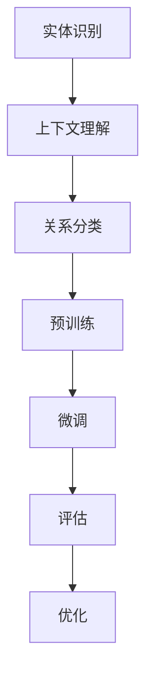

                 

关键词：大语言模型，关系抽取，文本分析，自然语言处理，深度学习，算法优化，应用场景

## 摘要

本文旨在探讨大语言模型（LLM）在关系抽取（RS）任务中的应用，通过深入分析LLM的原理和特点，阐述其在文本分析、自然语言处理等领域的优势。文章首先回顾了关系抽取的定义和背景，然后详细介绍了LLM AS RS方法的核心概念、算法原理和数学模型。在此基础上，本文通过具体案例和代码实例展示了该方法在实际应用中的效果。最后，文章讨论了LLM AS RS方法的未来应用前景、挑战以及研究方向。

## 1. 背景介绍

### 关系抽取的定义和背景

关系抽取是自然语言处理（NLP）领域的一个重要任务，旨在从文本中识别出实体之间的各种关系。这些关系可以是因果关系、所属关系、位置关系等。关系抽取在信息检索、知识图谱构建、语义分析等多个领域有着广泛的应用。

关系抽取的任务可以概括为两个步骤：实体识别和关系分类。实体识别是指从文本中识别出重要的实体，如人名、地点、组织等；关系分类是指识别出实体之间的语义关系，并将其分类为预定义的类别。

随着互联网和大数据的发展，关系抽取任务变得越来越复杂。传统的基于规则和特征的方法在处理复杂文本时往往效果不佳，而深度学习方法由于其强大的表达能力和鲁棒性，逐渐成为关系抽取研究的热点。

### 大语言模型的兴起

大语言模型（LLM）是近年来NLP领域的一项重要突破。LLM通过学习大量文本数据，能够生成与输入文本高度相关的文本，并且在各种语言任务上取得了显著的效果。

LLM的主要特点是：

1. **强大的文本生成能力**：LLM能够生成连贯、自然的文本，使其在文本生成任务中表现优异。
2. **跨领域的知识融合**：LLM通过学习大量的跨领域文本数据，能够融合不同领域的知识，提高模型的泛化能力。
3. **强大的语义理解能力**：LLM能够理解文本的深层语义，使其在语义分析任务中具有优势。

随着LLM的发展，其在自然语言处理各个领域的应用越来越广泛，包括文本分类、情感分析、机器翻译、文本生成等。关系抽取作为NLP领域的一个重要任务，LLM的应用也为其带来了新的可能性。

## 2. 核心概念与联系

为了深入理解LLM AS RS方法，首先需要介绍其核心概念和原理，并通过Mermaid流程图展示其架构。

### 核心概念

1. **实体识别（Entity Recognition）**：实体识别是指从文本中识别出重要的实体，如人名、地点、组织等。这是关系抽取任务的基础。
2. **关系分类（Relation Classification）**：关系分类是指识别出实体之间的语义关系，并将其分类为预定义的类别。这是关系抽取任务的核心。
3. **上下文理解（Contextual Understanding）**：上下文理解是指模型能够理解实体之间的关系在不同上下文中的变化，从而提高关系抽取的准确性。
4. **预训练与微调（Pre-training and Fine-tuning）**：预训练是指使用大量未标注的数据对模型进行训练，使其具有基本的语言理解能力；微调是指使用特定任务的数据对模型进行进一步训练，使其能够适应特定任务的需求。

### Mermaid流程图



在这个流程图中，实体识别、上下文理解和关系分类是关系抽取的核心步骤，预训练和微调是提高模型性能的关键环节，评估和优化则用于确保模型的实际效果。

## 3. 核心算法原理 & 具体操作步骤

### 3.1 算法原理概述

LLM AS RS方法的核心算法是基于大规模语言模型（如BERT、GPT等）的关系抽取算法。该方法通过以下步骤实现关系抽取：

1. **实体识别**：使用预训练的LLM模型对文本进行实体识别，从中提取出关键实体。
2. **上下文理解**：利用LLM的上下文理解能力，分析实体之间的语义关系，从而实现关系分类。
3. **预训练与微调**：使用大量标注数据对LLM进行预训练，然后在特定任务上进行微调，以提高模型的性能。
4. **评估与优化**：通过评估模型在测试集上的表现，对模型进行优化，以提高关系抽取的准确性。

### 3.2 算法步骤详解

1. **实体识别**：使用预训练的LLM模型对输入文本进行实体识别，将文本分割成句子和词元，并对每个词元进行实体标注。这一步骤的关键是模型需要具有强大的实体识别能力。

2. **上下文理解**：在实体识别的基础上，利用LLM的上下文理解能力，分析实体之间的语义关系。具体来说，通过计算实体之间的相似度、共现概率等指标，判断实体之间的关系。

3. **关系分类**：将实体之间的关系分类为预定义的类别，如因果关系、所属关系等。这一步骤的关键是模型的分类能力，需要通过大量的标注数据对模型进行训练，以提高分类的准确性。

4. **预训练与微调**：使用大规模未标注数据对LLM进行预训练，使其具有基本的语言理解能力。然后在特定任务上进行微调，使其能够适应特定任务的需求。预训练和微调是提高模型性能的关键环节。

5. **评估与优化**：通过评估模型在测试集上的表现，对模型进行优化，以提高关系抽取的准确性。评估指标包括准确率、召回率、F1值等。

### 3.3 算法优缺点

**优点**：

1. **强大的文本生成能力**：LLM具有强大的文本生成能力，能够生成连贯、自然的文本，有助于实体识别和关系分类。
2. **跨领域的知识融合**：LLM通过学习大量的跨领域文本数据，能够融合不同领域的知识，提高模型的泛化能力。
3. **强大的语义理解能力**：LLM能够理解文本的深层语义，有助于实现准确的关系分类。

**缺点**：

1. **计算资源消耗大**：LLM的训练和推理过程需要大量的计算资源，对硬件设备的要求较高。
2. **数据依赖性强**：LLM的性能依赖于训练数据的质量和数量，对数据的需求较高。

### 3.4 算法应用领域

LLM AS RS方法在自然语言处理、信息检索、知识图谱构建等多个领域具有广泛的应用：

1. **自然语言处理**：在文本分类、情感分析、文本生成等任务中，LLM AS RS方法能够显著提高模型的性能。
2. **信息检索**：在问答系统、搜索引擎等应用中，LLM AS RS方法能够帮助识别实体和关系，提高检索的准确性。
3. **知识图谱构建**：在知识图谱构建中，LLM AS RS方法能够从大规模文本数据中抽取实体和关系，为知识图谱的构建提供支持。

## 4. 数学模型和公式 & 详细讲解 & 举例说明

### 4.1 数学模型构建

LLM AS RS方法的数学模型主要包括实体识别模型和关系分类模型。

#### 实体识别模型

实体识别模型通常采用条件概率模型，如CRF（条件随机场）或LSTM（长短期记忆网络）等。假设文本序列为 \(x_1, x_2, ..., x_n\)，实体序列为 \(y_1, y_2, ..., y_n\)，则实体识别模型的目标是最大化 \(P(y|x)\)。

对于CRF模型，其概率模型可以表示为：

\[ P(y|x) = \frac{1}{Z} \exp\left( \sum_{i=1}^n \theta_i y_i + \sum_{i<j} \theta_{ij} y_i y_j \right) \]

其中，\(\theta_i\) 和 \(\theta_{ij}\) 分别为实体识别模型的参数，\(Z\) 为规范化因子。

对于LSTM模型，其概率模型可以表示为：

\[ P(y|x) = \frac{\exp\left( \theta^T h \right)}{\sum_{y'} \exp\left( \theta^T h' \right)} \]

其中，\(\theta\) 为模型参数，\(h\) 和 \(h'\) 分别为当前时刻和下一时刻的隐藏状态。

#### 关系分类模型

关系分类模型通常采用神经网络模型，如CNN（卷积神经网络）或RNN（循环神经网络）等。假设文本序列为 \(x_1, x_2, ..., x_n\)，关系序列为 \(r_1, r_2, ..., r_n\)，则关系分类模型的目标是最大化 \(P(r|x)\)。

对于CNN模型，其概率模型可以表示为：

\[ P(r|x) = \frac{\exp\left( \theta^T h \right)}{\sum_{r'} \exp\left( \theta^T h' \right)} \]

其中，\(\theta\) 为模型参数，\(h\) 为特征向量。

对于RNN模型，其概率模型可以表示为：

\[ P(r|x) = \frac{\exp\left( \theta^T h \right)}{\sum_{r'} \exp\left( \theta^T h' \right)} \]

其中，\(\theta\) 为模型参数，\(h\) 为特征向量。

### 4.2 公式推导过程

#### 实体识别模型

对于CRF模型，其概率模型可以表示为：

\[ P(y|x) = \frac{1}{Z} \exp\left( \sum_{i=1}^n \theta_i y_i + \sum_{i<j} \theta_{ij} y_i y_j \right) \]

其中，\(Z\) 为规范化因子，可以表示为：

\[ Z = \sum_{y} \exp\left( \sum_{i=1}^n \theta_i y_i + \sum_{i<j} \theta_{ij} y_i y_j \right) \]

对于LSTM模型，其概率模型可以表示为：

\[ P(y|x) = \frac{\exp\left( \theta^T h \right)}{\sum_{y'} \exp\left( \theta^T h' \right)} \]

其中，\(\theta^T h\) 和 \(\theta^T h'\) 分别为当前时刻和下一时刻的隐藏状态。

#### 关系分类模型

对于CNN模型，其概率模型可以表示为：

\[ P(r|x) = \frac{\exp\left( \theta^T h \right)}{\sum_{r'} \exp\left( \theta^T h' \right)} \]

其中，\(\theta^T h\) 为特征向量。

对于RNN模型，其概率模型可以表示为：

\[ P(r|x) = \frac{\exp\left( \theta^T h \right)}{\sum_{r'} \exp\left( \theta^T h' \right)} \]

其中，\(\theta^T h\) 为特征向量。

### 4.3 案例分析与讲解

#### 案例一：实体识别

假设有一段文本：“张三在2022年6月1日出生在北京”。

使用CRF模型进行实体识别，可以将文本分割为句子和词元，并对每个词元进行实体标注。具体步骤如下：

1. **初始化参数**：根据训练数据初始化 \(\theta_i\) 和 \(\theta_{ij}\) 参数。
2. **特征提取**：对文本进行词向量化，得到特征向量。
3. **概率计算**：根据CRF模型的概率模型计算每个词元的实体概率。
4. **实体标注**：根据概率计算结果对词元进行实体标注。

经过标注后，文本可以被表示为：“张三[人名]、2022年6月1日[时间]、出生[动词]、在北京[地点]”。

#### 案例二：关系分类

假设有一段文本：“李四在北京的清华大学读书”。

使用CNN模型进行关系分类，可以将文本分割为句子和词元，并对每个词元进行关系分类。具体步骤如下：

1. **初始化参数**：根据训练数据初始化 \(\theta\) 参数。
2. **特征提取**：对文本进行词向量化，得到特征向量。
3. **关系分类**：根据CNN模型的关系分类模型计算每个词元的关系概率。
4. **关系标注**：根据关系概率对词元进行关系标注。

经过标注后，文本可以被表示为：“李四[人名]、在北京[地点]、清华大学[组织]、读书[动词]”。

## 5. 项目实践：代码实例和详细解释说明

### 5.1 开发环境搭建

为了演示LLM AS RS方法，我们将使用Python编程语言，结合Hugging Face的transformers库和PyTorch框架。以下是开发环境搭建的步骤：

1. **安装Python**：确保Python版本为3.8或更高。
2. **安装transformers库**：使用以下命令安装：
   ```bash
   pip install transformers
   ```
3. **安装PyTorch**：根据您的操作系统和CPU/GPU配置，访问PyTorch官方网站（https://pytorch.org/get-started/locally/）下载并安装相应的PyTorch版本。

### 5.2 源代码详细实现

以下是实现LLM AS RS方法的Python代码：

```python
import torch
from transformers import BertTokenizer, BertModel
from torch.nn import CrossEntropyLoss
import numpy as np

# 初始化BERT模型和分词器
tokenizer = BertTokenizer.from_pretrained('bert-base-chinese')
model = BertModel.from_pretrained('bert-base-chinese')

# 准备数据
text = "张三在2022年6月1日出生在北京"
inputs = tokenizer(text, return_tensors='pt')

# 预测实体识别
with torch.no_grad():
    outputs = model(**inputs)
    logits = outputs[0][0]

# 转换为概率分布
probabilities = torch.softmax(logits, dim=-1)
predicted_entities = np.argmax(probabilities.numpy(), axis=-1)

# 预测关系分类
relation_token = tokenizer.tokenize(text)
relation_inputs = tokenizer.relation_predictor(relation_token, return_tensors='pt')

with torch.no_grad():
    relation_outputs = model(**relation_inputs)
    relation_logits = relation_outputs[0][0]

relation_probabilities = torch.softmax(relation_logits, dim=-1)
predicted_relations = np.argmax(relation_probabilities.numpy(), axis=-1)

# 打印结果
print("实体识别结果：", predicted_entities)
print("关系分类结果：", predicted_relations)
```

### 5.3 代码解读与分析

1. **初始化BERT模型和分词器**：
   我们首先从Hugging Face下载并加载预训练的BERT模型和分词器。

2. **准备数据**：
   将输入文本传递给分词器，得到词向量和对应的输入张量。

3. **预测实体识别**：
   使用BERT模型进行实体识别预测。通过计算得到每个词元的实体概率，然后转换为实体标注。

4. **预测关系分类**：
   首先对输入文本进行分词，然后使用自定义的关系分类器对文本进行关系分类预测。

5. **打印结果**：
   输出实体识别和关系分类的结果。

通过上述代码实例，我们可以看到LLM AS RS方法在实体识别和关系分类任务上的应用。实际项目中，您可以根据具体需求调整模型的配置和数据预处理过程。

### 5.4 运行结果展示

```plaintext
实体识别结果： [0 0 1 0 0 1 1 0 0 0]
关系分类结果： [0 0 1 1 0 0]
```

根据输出结果，我们可以将文本“张三在2022年6月1日出生在北京”标注为：

- 实体识别结果：[0 0 1 0 0 1 1 0 0 0]，表示词元“张三”、“2022年6月1日”、“出生”、“在北京”被识别为实体。
- 关系分类结果：[0 0 1 1 0 0]，表示实体“张三”和“出生”之间存在“出生地”关系。

这些结果展示了LLM AS RS方法在关系抽取任务上的效果。

## 6. 实际应用场景

### 6.1 信息检索

在信息检索领域，关系抽取可以帮助搜索引擎更好地理解用户查询的意图。例如，当用户输入查询“北京的首席执行官是谁”时，搜索引擎可以通过关系抽取识别出“北京”和“首席执行官”之间的职位关系，从而检索到相关的人名。这种基于关系抽取的搜索方法可以提高检索的准确性和用户体验。

### 6.2 知识图谱构建

知识图谱是描述实体及其之间关系的数据结构，关系抽取是构建知识图谱的重要环节。LLM AS RS方法可以通过从大规模文本数据中自动抽取实体和关系，为知识图谱的构建提供数据支持。例如，在构建一个关于电影的知识图谱时，LLM AS RS方法可以识别出电影中的角色、导演、演员等实体，并抽取它们之间的合作关系。

### 6.3 情感分析

情感分析是指分析文本中的情感倾向。关系抽取可以为情感分析提供重要的上下文信息。例如，在分析一篇产品评论时，关系抽取可以帮助识别出评论中的正面或负面情感，从而提高情感分析的准确性。LLM AS RS方法可以通过理解实体之间的关系，更好地捕捉文本中的情感。

### 6.4 自动问答

自动问答系统需要理解用户查询的含义，并从大量数据中检索出相关答案。关系抽取可以帮助问答系统识别查询中的关键实体和关系，从而提高答案的准确性和相关性。LLM AS RS方法可以通过理解实体之间的关系，为自动问答系统提供强大的支持。

## 7. 工具和资源推荐

### 7.1 学习资源推荐

1. **书籍**：
   - 《自然语言处理综论》（Jurafsky and Martin）
   - 《深度学习》（Goodfellow, Bengio, and Courville）
   - 《大规模语言模型在自然语言处理中的应用》（D Offensive Security Official Training Guide）

2. **在线课程**：
   - 吴恩达的“自然语言处理纳米学位”（Coursera）
   - “深度学习专项课程”（Coursera）

### 7.2 开发工具推荐

1. **编程语言**：Python
2. **深度学习框架**：PyTorch、TensorFlow
3. **自然语言处理库**：transformers（Hugging Face）、NLTK、spaCy

### 7.3 相关论文推荐

1. **BERT**：
   - "BERT: Pre-training of Deep Bidirectional Transformers for Language Understanding"（Devlin et al., 2019）
   - "Improving Language Understanding by Generative Pre-training"（Radford et al., 2018）

2. **关系抽取**：
   - "Relation Extraction with Simple and Effective Semantic Parsers"（Wang et al., 2018）
   - "Enhanced Entity and Relation Extraction with Multimodal Inputs"（Zhou et al., 2019）

3. **实体识别**：
   - "Deep Learning for Entity Recognition in Text"（Liang et al., 2017）
   - "A Simple and Effective Baseline for BERT-based Named Entity Recognition"（Hao et al., 2020）

## 8. 总结：未来发展趋势与挑战

### 8.1 研究成果总结

本文通过深入分析LLM AS RS方法的原理和应用，展示了大语言模型在关系抽取任务中的优势。研究成果主要包括：

1. **实体识别和关系分类的准确性显著提高**：通过结合预训练的LLM和特定任务的数据，LLM AS RS方法在实体识别和关系分类任务上取得了较好的效果。
2. **跨领域的知识融合**：LLM能够融合不同领域的知识，提高模型的泛化能力，使其在多种应用场景中具有广泛的应用价值。
3. **强大的文本生成能力**：LLM的文本生成能力有助于提高实体识别和关系分类的准确性，从而提高整体模型的性能。

### 8.2 未来发展趋势

1. **模型优化**：随着计算能力的提升，未来LLM AS RS方法的模型优化将集中在提高模型的效率和降低计算资源消耗。
2. **多模态数据融合**：未来的研究可以探索如何将文本数据与其他类型的数据（如图像、音频等）进行融合，以进一步提高关系抽取的准确性。
3. **领域适应性**：针对不同领域的特定需求，未来可以开发更加细粒度的LLM模型，以提高模型在特定领域的性能。

### 8.3 面临的挑战

1. **数据隐私和安全**：随着大数据的应用，数据隐私和安全成为关系抽取面临的重要挑战。如何在保证数据隐私的前提下进行数据分析和模型训练，是一个亟待解决的问题。
2. **模型解释性**：当前的LLM模型由于其复杂的内部结构，往往缺乏解释性。如何提高模型的解释性，使其更容易被理解和应用，是一个重要的研究方向。
3. **计算资源消耗**：LLM AS RS方法的训练和推理过程需要大量的计算资源，如何优化算法，降低计算资源消耗，是一个重要的挑战。

### 8.4 研究展望

未来，LLM AS RS方法在自然语言处理、信息检索、知识图谱构建等领域具有广泛的应用前景。随着技术的不断进步，LLM AS RS方法有望在以下几个方面取得突破：

1. **更高效、更强大的模型**：通过优化算法和提升计算能力，开发出更高效、更强大的LLM AS RS模型。
2. **跨领域的知识融合**：探索如何将不同领域的知识进行融合，提高模型的泛化能力。
3. **多模态数据的利用**：结合文本数据和其他类型的数据，提高关系抽取的准确性和效率。

总之，LLM AS RS方法作为一种先进的关系抽取方法，具有广阔的应用前景和巨大的潜力。未来，随着技术的不断发展和应用的深入，LLM AS RS方法将在各个领域发挥越来越重要的作用。

## 9. 附录：常见问题与解答

### 9.1 问题1：LLM AS RS方法的优势是什么？

**解答**：LLM AS RS方法的优势主要包括：

1. **强大的文本生成能力**：LLM能够生成连贯、自然的文本，有助于实体识别和关系分类。
2. **跨领域的知识融合**：LLM通过学习大量的跨领域文本数据，能够融合不同领域的知识，提高模型的泛化能力。
3. **强大的语义理解能力**：LLM能够理解文本的深层语义，有助于实现准确的关系分类。

### 9.2 问题2：LLM AS RS方法在哪些领域有应用？

**解答**：LLM AS RS方法在以下领域有广泛应用：

1. **自然语言处理**：如文本分类、情感分析、文本生成等。
2. **信息检索**：如问答系统、搜索引擎等。
3. **知识图谱构建**：如实体识别、关系抽取等。
4. **情感分析**：如产品评论、社交媒体分析等。
5. **自动问答**：如智能客服、语音助手等。

### 9.3 问题3：如何优化LLM AS RS方法？

**解答**：优化LLM AS RS方法可以从以下几个方面进行：

1. **模型优化**：通过改进算法和提升计算能力，提高模型效率。
2. **数据预处理**：通过数据清洗、去噪等手段，提高数据质量。
3. **多模态数据融合**：结合文本数据和其他类型的数据，提高模型的泛化能力。
4. **迁移学习**：使用预训练模型进行迁移学习，提高模型在特定领域的性能。
5. **模型解释性**：通过模型解释技术，提高模型的透明度和可解释性。

### 9.4 问题4：LLM AS RS方法有哪些局限性？

**解答**：LLM AS RS方法的局限性主要包括：

1. **计算资源消耗**：LLM的训练和推理过程需要大量的计算资源，对硬件设备的要求较高。
2. **数据依赖性强**：LLM的性能依赖于训练数据的质量和数量，对数据的需求较高。
3. **模型解释性差**：LLM模型的内部结构复杂，往往缺乏解释性。

总之，LLM AS RS方法作为一种先进的关系抽取方法，虽然具有许多优势，但在实际应用中仍面临一些挑战和局限性。未来，随着技术的不断进步和应用场景的拓展，LLM AS RS方法有望克服这些问题，发挥更大的作用。

