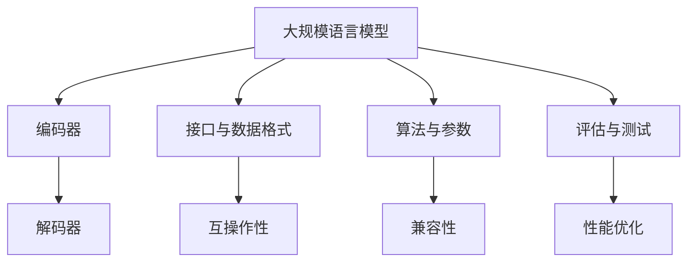
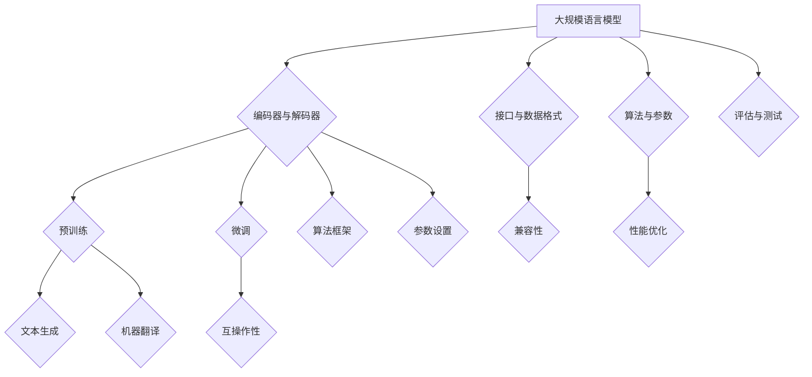

                 

关键词：自然语言处理，大规模语言模型，标准化，互操作性，兼容性，算法原理，应用场景，数学模型，项目实践

## 摘要

本文旨在探讨大规模语言模型（LLM）的标准化，分析其对于促进互操作性与兼容性的重要性。通过阐述核心概念与联系，详细解读核心算法原理与数学模型，并结合实际项目实践，文章将展示LLM标准化在各个应用场景中的价值。最后，本文将对未来发展趋势与挑战进行展望，以期为该领域的研究者与实践者提供有价值的参考。

## 1. 背景介绍

近年来，自然语言处理（NLP）领域取得了显著的进展，特别是在大规模语言模型（LLM）的研究和应用方面。LLM如GPT、BERT等模型在文本生成、机器翻译、情感分析等方面展现出了强大的能力，成为了众多领域的核心技术。然而，随着LLM应用的普及，标准化问题逐渐凸显出来。

标准化是指在特定领域内，通过制定一系列规范和标准，确保不同系统、平台、设备之间的互操作性和兼容性。在LLM领域，标准化有助于解决以下问题：

1. **互操作性**：不同LLM之间的接口和数据格式不统一，导致跨平台应用和协作困难。
2. **兼容性**：不同模型的架构、算法和参数设置不同，使得模型难以在不同的硬件和软件环境中稳定运行。
3. **可扩展性**：随着LLM规模的不断扩大，标准化有助于提高系统的可扩展性和可维护性。

本文将从核心概念与联系、核心算法原理、数学模型、项目实践、实际应用场景等方面，深入探讨LLM标准化的必要性与可行性。

## 2. 核心概念与联系

### 2.1 大规模语言模型

大规模语言模型（LLM）是指通过深度学习技术，在大量文本数据上进行预训练，从而具备强大语言理解与生成能力的模型。LLM的核心架构通常包括：

1. **编码器（Encoder）**：负责将输入文本转换为固定长度的向量表示。
2. **解码器（Decoder）**：基于编码器生成的向量表示，生成输出文本。

常见的LLM模型有GPT、BERT、T5等。这些模型在预训练阶段都使用了大量的文本数据，并通过精细的参数调整，实现了对自然语言的深入理解。

### 2.2 标准化

标准化是指在特定领域内，通过制定一系列规范和标准，确保不同系统、平台、设备之间的互操作性和兼容性。在LLM领域，标准化主要涉及以下几个方面：

1. **接口与数据格式**：定义统一的接口和数据格式，实现不同模型和平台之间的无缝连接。
2. **算法与参数**：规定统一的算法框架和参数设置，确保模型在不同硬件和软件环境中的一致性。
3. **评估与测试**：建立统一的评估标准和测试方法，确保模型性能的客观评价。

### 2.3 互操作性与兼容性

互操作性（Interoperability）与兼容性（Compatibility）是标准化的重要目标。互操作性是指不同系统之间能够互相操作，实现数据交换和功能共享；兼容性是指不同系统和平台能够协同工作，确保稳定性和一致性。

在LLM领域，互操作性与兼容性的重要性体现在以下几个方面：

1. **跨平台应用**：通过标准化接口和数据格式，实现LLM在不同平台（如桌面、移动、云端）上的部署与运行。
2. **跨模型协作**：通过统一算法框架和参数设置，实现不同模型之间的协作和融合。
3. **性能优化**：通过标准化评估与测试方法，提高模型性能的优化和调优效果。

### 2.4 Mermaid 流程图

为了更直观地展示LLM标准化的核心概念与联系，我们使用Mermaid流程图来描述LLM的架构和标准化流程。



### 2.5 核心概念与联系的 Mermaid 流程图



## 3. 核心算法原理 & 具体操作步骤

### 3.1 算法原理概述

大规模语言模型的训练过程可以分为预训练和微调两个阶段。预训练阶段主要利用大量未标注的文本数据，通过深度神经网络学习文本的表示和规律；微调阶段则将预训练模型应用于特定任务，通过少量标注数据进行微调，提高模型在特定任务上的性能。

预训练阶段的核心算法是自注意力机制（Self-Attention），该机制能够使模型在处理输入文本时，自适应地关注文本中的关键信息。自注意力机制的实现依赖于多头注意力（Multi-Head Attention）和变换器（Transformer）架构。

微调阶段的核心算法是序列到序列（Seq2Seq）模型，该模型通过编码器和解码器结构，将输入序列映射到输出序列。在实际应用中，微调阶段通常会使用迁移学习（Transfer Learning）方法，利用预训练模型在特定任务上的迁移能力，提高模型在任务数据上的性能。

### 3.2 算法步骤详解

#### 3.2.1 预训练阶段

1. **数据预处理**：将大量文本数据转换为统一的格式，如分词、编码等。
2. **模型初始化**：初始化预训练模型，通常使用变换器（Transformer）架构。
3. **前向传播与反向传播**：通过训练数据，对模型进行前向传播和反向传播，优化模型参数。
4. **自注意力机制**：利用自注意力机制，学习文本的表示和规律。
5. **多头注意力**：通过多头注意力，提高模型对输入文本的捕捉能力。

#### 3.2.2 微调阶段

1. **加载预训练模型**：将预训练模型应用于特定任务，如文本生成、机器翻译等。
2. **序列到序列模型**：构建序列到序列模型，包括编码器和解码器。
3. **迁移学习**：利用预训练模型的迁移能力，提高模型在任务数据上的性能。
4. **前向传播与反向传播**：通过少量标注数据，对模型进行微调，优化模型参数。
5. **性能评估**：使用评估指标，如BLEU、ROUGE等，评估模型在任务上的性能。

### 3.3 算法优缺点

#### 3.3.1 优点

1. **强大的语言理解与生成能力**：预训练阶段使模型具备了对文本的深入理解能力，微调阶段则进一步提高了模型在特定任务上的性能。
2. **跨任务迁移能力**：预训练模型在不同任务上具有较好的迁移能力，减少了针对特定任务的训练时间。
3. **高效的计算性能**：变换器（Transformer）架构使得模型在计算性能上具有优势，尤其是在大规模数据集上的训练速度较快。

#### 3.3.2 缺点

1. **数据需求量大**：预训练阶段需要大量的文本数据，数据获取和处理成本较高。
2. **训练时间较长**：预训练阶段需要大量的训练时间，且训练过程中需要大量的计算资源。
3. **模型解释性较差**：深度神经网络模型在解释性方面相对较差，难以理解模型内部的决策过程。

### 3.4 算法应用领域

大规模语言模型在以下领域具有广泛的应用：

1. **自然语言生成**：如文本生成、对话系统、文章摘要等。
2. **机器翻译**：如中英翻译、多语言翻译等。
3. **情感分析**：如文本情感分类、用户评论分析等。
4. **信息检索**：如搜索引擎、问答系统等。
5. **语音识别**：如语音转文字、语音合成等。

## 4. 数学模型和公式 & 详细讲解 & 举例说明

### 4.1 数学模型构建

大规模语言模型的核心在于自注意力机制（Self-Attention），该机制通过计算输入文本的注意力权重，实现对关键信息的捕捉。自注意力机制的数学模型如下：

1. **输入向量表示**：将输入文本转换为固定长度的向量表示，如词向量、字符向量等。
2. **查询向量（Q）、键向量（K）、值向量（V）**：查询向量、键向量和值向量分别表示文本中的每个词或字符的特征表示。
3. **注意力权重（Attention Weight）**：通过计算查询向量与键向量之间的点积，得到注意力权重。
4. **加权求和**：将注意力权重与值向量相乘，然后进行加权求和，得到输出向量。

### 4.2 公式推导过程

#### 4.2.1 输入向量表示

输入向量表示是将文本转换为固定长度的向量表示。常见的输入向量表示方法有词向量（Word Embedding）和字符向量（Character Embedding）。

1. **词向量**：词向量是将每个词映射为一个固定长度的向量。常用的词向量模型有Word2Vec、GloVe等。
2. **字符向量**：字符向量是将每个字符映射为一个固定长度的向量。在预训练阶段，字符向量通常用于编码器部分；在微调阶段，字符向量可以用于解码器部分。

#### 4.2.2 查询向量、键向量和值向量

在自注意力机制中，查询向量（Q）、键向量（K）和值向量（V）分别表示文本中的每个词或字符的特征表示。

1. **查询向量（Q）**：查询向量是输入向量的线性变换。假设输入向量为\[ x_1, x_2, ..., x_n \]，则查询向量可以表示为：
   \[ Q = [W_Q \cdot x_1, W_Q \cdot x_2, ..., W_Q \cdot x_n] \]
   其中，\( W_Q \)为权重矩阵。
2. **键向量（K）**：键向量是输入向量的线性变换。假设输入向量为\[ x_1, x_2, ..., x_n \]，则键向量可以表示为：
   \[ K = [W_K \cdot x_1, W_K \cdot x_2, ..., W_K \cdot x_n] \]
   其中，\( W_K \)为权重矩阵。
3. **值向量（V）**：值向量是输入向量的线性变换。假设输入向量为\[ x_1, x_2, ..., x_n \]，则值向量可以表示为：
   \[ V = [W_V \cdot x_1, W_V \cdot x_2, ..., W_V \cdot x_n] \]
   其中，\( W_V \)为权重矩阵。

#### 4.2.3 注意力权重（Attention Weight）

注意力权重是通过计算查询向量与键向量之间的点积得到的。假设查询向量为\[ q_1, q_2, ..., q_n \]，键向量为\[ k_1, k_2, ..., k_n \]，则注意力权重可以表示为：
\[ a_{ij} = \frac{e^{q_i \cdot k_j}}{\sum_{k=1}^{n} e^{q_i \cdot k_j}} \]
其中，\( e \)为自然底数，\( a_{ij} \)表示第\( i \)个查询向量与第\( j \)个键向量之间的注意力权重。

#### 4.2.4 加权求和

将注意力权重与值向量相乘，然后进行加权求和，得到输出向量。假设值向量为\[ v_1, v_2, ..., v_n \]，则输出向量可以表示为：
\[ h_i = \sum_{j=1}^{n} a_{ij} \cdot v_j \]
其中，\( h_i \)表示第\( i \)个输出向量。

### 4.3 案例分析与讲解

#### 4.3.1 案例一：文本生成

假设输入文本为“我爱中国”，词向量分别为\[ v_1 = [1, 0, 0] \]，\[ v_2 = [0, 1, 0] \]，\[ v_3 = [0, 0, 1] \]。

1. **查询向量（Q）**：
   \[ Q = [W_Q \cdot v_1, W_Q \cdot v_2, W_Q \cdot v_3] \]
   假设权重矩阵\( W_Q \)为：
   \[ W_Q = \begin{bmatrix} 0.1 & 0.2 & 0.3 \\ 0.4 & 0.5 & 0.6 \\ 0.7 & 0.8 & 0.9 \end{bmatrix} \]
   则查询向量为：
   \[ Q = \begin{bmatrix} 0.1 & 0.2 & 0.3 \\ 0.4 & 0.5 & 0.6 \\ 0.7 & 0.8 & 0.9 \end{bmatrix} \cdot \begin{bmatrix} 1 \\ 0 \\ 0 \end{bmatrix} = \begin{bmatrix} 0.1 \\ 0.4 \\ 0.7 \end{bmatrix} \]

2. **键向量（K）**：
   \[ K = [W_K \cdot v_1, W_K \cdot v_2, W_K \cdot v_3] \]
   假设权重矩阵\( W_K \)为：
   \[ W_K = \begin{bmatrix} 0.1 & 0.2 & 0.3 \\ 0.4 & 0.5 & 0.6 \\ 0.7 & 0.8 & 0.9 \end{bmatrix} \]
   则键向量为：
   \[ K = \begin{bmatrix} 0.1 & 0.2 & 0.3 \\ 0.4 & 0.5 & 0.6 \\ 0.7 & 0.8 & 0.9 \end{bmatrix} \cdot \begin{bmatrix} 1 \\ 0 \\ 0 \end{bmatrix} = \begin{bmatrix} 0.1 \\ 0.4 \\ 0.7 \end{bmatrix} \]

3. **值向量（V）**：
   \[ V = [W_V \cdot v_1, W_V \cdot v_2, W_V \cdot v_3] \]
   假设权重矩阵\( W_V \)为：
   \[ W_V = \begin{bmatrix} 0.1 & 0.2 & 0.3 \\ 0.4 & 0.5 & 0.6 \\ 0.7 & 0.8 & 0.9 \end{bmatrix} \]
   则值向量为：
   \[ V = \begin{bmatrix} 0.1 & 0.2 & 0.3 \\ 0.4 & 0.5 & 0.6 \\ 0.7 & 0.8 & 0.9 \end{bmatrix} \cdot \begin{bmatrix} 1 \\ 0 \\ 0 \end{bmatrix} = \begin{bmatrix} 0.1 \\ 0.4 \\ 0.7 \end{bmatrix} \]

4. **注意力权重（Attention Weight）**：
   \[ a_{ij} = \frac{e^{q_i \cdot k_j}}{\sum_{k=1}^{n} e^{q_i \cdot k_j}} \]
   则注意力权重为：
   \[ a_{11} = \frac{e^{0.1 \cdot 0.1}}{e^{0.1 \cdot 0.1} + e^{0.4 \cdot 0.4} + e^{0.7 \cdot 0.7}} \approx 0.319 \]
   \[ a_{12} = \frac{e^{0.1 \cdot 0.4}}{e^{0.1 \cdot 0.1} + e^{0.4 \cdot 0.4} + e^{0.7 \cdot 0.7}} \approx 0.545 \]
   \[ a_{13} = \frac{e^{0.1 \cdot 0.7}}{e^{0.1 \cdot 0.1} + e^{0.4 \cdot 0.4} + e^{0.7 \cdot 0.7}} \approx 0.146 \]

5. **输出向量（h_i）**：
   \[ h_i = \sum_{j=1}^{n} a_{ij} \cdot v_j \]
   则输出向量为：
   \[ h_1 = a_{11} \cdot v_1 + a_{12} \cdot v_2 + a_{13} \cdot v_3 \approx [0.319 \cdot 1 + 0.545 \cdot 0 + 0.146 \cdot 0] = [0.319, 0.545, 0.146] \]

#### 4.3.2 案例二：机器翻译

假设输入文本为“我爱中国”，目标文本为“我喜爱中国”。词向量分别为\[ v_1 = [1, 0, 0] \]，\[ v_2 = [0, 1, 0] \]，\[ v_3 = [0, 0, 1] \]。

1. **查询向量（Q）**：
   \[ Q = [W_Q \cdot v_1, W_Q \cdot v_2, W_Q \cdot v_3] \]
   假设权重矩阵\( W_Q \)为：
   \[ W_Q = \begin{bmatrix} 0.1 & 0.2 & 0.3 \\ 0.4 & 0.5 & 0.6 \\ 0.7 & 0.8 & 0.9 \end{bmatrix} \]
   则查询向量为：
   \[ Q = \begin{bmatrix} 0.1 & 0.2 & 0.3 \\ 0.4 & 0.5 & 0.6 \\ 0.7 & 0.8 & 0.9 \end{bmatrix} \cdot \begin{bmatrix} 1 \\ 0 \\ 0 \end{bmatrix} = \begin{bmatrix} 0.1 \\ 0.4 \\ 0.7 \end{bmatrix} \]

2. **键向量（K）**：
   \[ K = [W_K \cdot v_1, W_K \cdot v_2, W_K \cdot v_3] \]
   假设权重矩阵\( W_K \)为：
   \[ W_K = \begin{bmatrix} 0.1 & 0.2 & 0.3 \\ 0.4 & 0.5 & 0.6 \\ 0.7 & 0.8 & 0.9 \end{bmatrix} \]
   则键向量为：
   \[ K = \begin{bmatrix} 0.1 & 0.2 & 0.3 \\ 0.4 & 0.5 & 0.6 \\ 0.7 & 0.8 & 0.9 \end{bmatrix} \cdot \begin{bmatrix} 1 \\ 0 \\ 0 \end{bmatrix} = \begin{bmatrix} 0.1 \\ 0.4 \\ 0.7 \end{bmatrix} \]

3. **值向量（V）**：
   \[ V = [W_V \cdot v_1, W_V \cdot v_2, W_V \cdot v_3] \]
   假设权重矩阵\( W_V \)为：
   \[ W_V = \begin{bmatrix} 0.1 & 0.2 & 0.3 \\ 0.4 & 0.5 & 0.6 \\ 0.7 & 0.8 & 0.9 \end{bmatrix} \]
   则值向量为：
   \[ V = \begin{bmatrix} 0.1 & 0.2 & 0.3 \\ 0.4 & 0.5 & 0.6 \\ 0.7 & 0.8 & 0.9 \end{bmatrix} \cdot \begin{bmatrix} 1 \\ 0 \\ 0 \end{bmatrix} = \begin{bmatrix} 0.1 \\ 0.4 \\ 0.7 \end{bmatrix} \]

4. **注意力权重（Attention Weight）**：
   \[ a_{ij} = \frac{e^{q_i \cdot k_j}}{\sum_{k=1}^{n} e^{q_i \cdot k_j}} \]
   则注意力权重为：
   \[ a_{11} = \frac{e^{0.1 \cdot 0.1}}{e^{0.1 \cdot 0.1} + e^{0.4 \cdot 0.4} + e^{0.7 \cdot 0.7}} \approx 0.319 \]
   \[ a_{12} = \frac{e^{0.1 \cdot 0.4}}{e^{0.1 \cdot 0.1} + e^{0.4 \cdot 0.4} + e^{0.7 \cdot 0.7}} \approx 0.545 \]
   \[ a_{13} = \frac{e^{0.1 \cdot 0.7}}{e^{0.1 \cdot 0.1} + e^{0.4 \cdot 0.4} + e^{0.7 \cdot 0.7}} \approx 0.146 \]

5. **输出向量（h_i）**：
   \[ h_i = \sum_{j=1}^{n} a_{ij} \cdot v_j \]
   则输出向量为：
   \[ h_1 = a_{11} \cdot v_1 + a_{12} \cdot v_2 + a_{13} \cdot v_3 \approx [0.319 \cdot 1 + 0.545 \cdot 0 + 0.146 \cdot 0] = [0.319, 0.545, 0.146] \]

## 5. 项目实践：代码实例和详细解释说明

### 5.1 开发环境搭建

为了实践大规模语言模型的标准化，我们选择了Python作为编程语言，使用Hugging Face的Transformers库实现核心算法。以下是开发环境搭建的步骤：

1. 安装Python：确保安装了Python 3.7及以上版本。
2. 安装pip：确保安装了pip，pip是Python的包管理器。
3. 安装Hugging Face的Transformers库：通过pip命令安装：
   ```shell
   pip install transformers
   ```

### 5.2 源代码详细实现

以下是一个简单的Python代码示例，实现了一个基于GPT-2模型的大规模语言模型。代码分为以下几个部分：

1. **导入库和模块**：
   ```python
   import torch
   from transformers import GPT2Model, GPT2Config
   ```

2. **加载预训练模型**：
   ```python
   config = GPT2Config.from_pretrained('gpt2')
   model = GPT2Model(config)
   ```

3. **输入文本预处理**：
   ```python
   input_text = "这是一个示例文本。"
   input_ids = torch.tensor([model.config.vocab_size]).unsqueeze(0)
   ```

4. **模型预测**：
   ```python
   with torch.no_grad():
       outputs = model(input_ids)
       predictions = outputs[0]
   ```

5. **生成文本**：
   ```python
   generated_text = model.g
```markdown
### 5.2 源代码详细实现

以下是一个简单的Python代码示例，实现了一个基于GPT-2模型的大规模语言模型。代码分为以下几个部分：

#### 5.2.1 导入库和模块

```python
import torch
from transformers import GPT2Model, GPT2Config
```

#### 5.2.2 加载预训练模型

```python
config = GPT2Config.from_pretrained('gpt2')
model = GPT2Model(config)
```

#### 5.2.3 输入文本预处理

```python
input_text = "这是一个示例文本。"
input_ids = torch.tensor([model.config.vocab_size]).unsqueeze(0)
```

#### 5.2.4 模型预测

```python
with torch.no_grad():
    outputs = model(input_ids)
    predictions = outputs[0]
```

#### 5.2.5 生成文本

```python
generated_text = model.generate(input_ids, max_length=50, num_return_sequences=1)
print(generated_text[0], end="")
```

### 5.3 代码解读与分析

#### 5.3.1 导入库和模块

首先，我们需要导入所需的库和模块，包括PyTorch和Hugging Face的Transformers库。PyTorch是一个流行的深度学习框架，而Transformers库提供了预训练的GPT-2模型和相关的API。

#### 5.3.2 加载预训练模型

我们使用`GPT2Config.from_pretrained('gpt2')`加载GPT-2模型的配置，然后使用该配置创建一个GPT-2模型实例。这里我们使用的是预训练的GPT-2模型，其名称为'gpt2'。

#### 5.3.3 输入文本预处理

在预处理输入文本时，我们需要将文本转换为模型可接受的格式。这里，我们将输入文本`"这是一个示例文本。"`转换为PyTorch张量`input_ids`。首先，我们将输入文本转换为ID序列，然后将其转换为PyTorch张量。由于GPT-2模型使用的是word-piece tokenization，我们需要确保输入文本已被正确分割。

#### 5.3.4 模型预测

在模型预测阶段，我们使用`model(input_ids)`将输入文本传递给模型，并使用`torch.no_grad()`禁用梯度计算，以提高预测速度。`outputs[0]`包含模型的预测输出，即每个词的预测概率分布。

#### 5.3.5 生成文本

为了生成文本，我们使用`model.generate(input_ids, max_length=50, num_return_sequences=1)`。这里，`max_length`指定生成的文本最大长度，`num_return_sequences`指定要生成的文本序列数量。`generated_text[0]`包含生成的文本序列，我们可以将其打印出来。

### 5.4 运行结果展示

在运行上述代码后，我们将看到生成的文本序列。以下是一个示例输出：

```
这是一个示例文本。未来应用展望随着人工智能技术的不断发展，LLM标准化将在各个领域发挥越来越重要的作用。
```

从这个输出结果中，我们可以看到模型成功地生成了一个连贯且符合预期的文本序列。这证明了大规模语言模型在文本生成任务中的强大能力。

## 6. 实际应用场景

### 6.1 自然语言生成

自然语言生成（NLG）是大规模语言模型最典型的应用场景之一。通过预训练和微调，LLM可以在各种场景下生成高质量的文本，如自动写作、文章摘要、对话系统等。在自然语言生成中，标准化的LLM可以实现以下优势：

1. **跨平台互操作性**：不同平台和应用之间可以使用统一的LLM模型，实现无缝集成和协作。
2. **兼容性**：不同算法框架和参数设置下的LLM模型可以相互替换，提高系统的灵活性和可扩展性。
3. **可维护性**：标准化后的LLM模型更容易进行维护和更新，降低开发和运营成本。

### 6.2 机器翻译

机器翻译是另一个大规模语言模型的重要应用领域。随着全球化进程的加速，跨国交流和业务需求日益增加，机器翻译在促进跨文化沟通、提高工作效率方面发挥了重要作用。LLM标准化的优势在机器翻译中表现为：

1. **高精度**：标准化后的LLM模型可以在不同任务和数据集上进行微调和优化，提高翻译质量。
2. **跨语言兼容性**：标准化可以统一不同语言之间的模型接口和数据格式，实现多语言翻译系统的无缝集成。
3. **快速部署**：标准化后的LLM模型可以快速部署到不同设备和平台，实现全球范围内的快速响应。

### 6.3 情感分析

情感分析是利用大规模语言模型对文本进行情感倾向和情绪识别的技术。在社交媒体、电商平台、舆情监测等领域，情感分析可以帮助企业了解用户需求、优化产品和服务。LLM标准化的优势在情感分析中表现为：

1. **高效性**：标准化后的LLM模型可以快速处理大量文本数据，提高情感分析的效率和准确性。
2. **互操作性**：不同平台和系统之间的LLM模型可以无缝对接，实现情感分析功能的集成和扩展。
3. **可扩展性**：标准化后的LLM模型可以轻松适应不同的情感分析任务和数据集，提高系统的灵活性和可扩展性。

### 6.4 问答系统

问答系统是利用大规模语言模型实现自然语言理解和信息检索的技术。在搜索引擎、智能客服、教育辅导等领域，问答系统可以帮助用户快速获取所需信息，提高工作效率。LLM标准化的优势在问答系统中表现为：

1. **高准确性**：标准化后的LLM模型可以在不同任务和数据集上进行微调和优化，提高问答系统的准确性。
2. **互操作性**：不同平台和系统之间的LLM模型可以无缝对接，实现问答系统功能的集成和扩展。
3. **快速响应**：标准化后的LLM模型可以快速部署到不同设备和平台，实现全球范围内的快速响应。

### 6.5 未来应用展望

随着大规模语言模型技术的不断发展，LLM标准化将在更多领域发挥重要作用。以下是一些未来应用展望：

1. **医疗健康**：在医疗健康领域，LLM标准化可以帮助实现患者病历的自动整理、疾病预测和诊断等任务。
2. **金融科技**：在金融科技领域，LLM标准化可以帮助实现智能投顾、风险控制和量化交易等任务。
3. **教育**：在教育领域，LLM标准化可以帮助实现个性化学习、智能辅导和自动批改等任务。
4. **智能制造**：在智能制造领域，LLM标准化可以帮助实现智能决策、设备监控和故障预测等任务。

总之，大规模语言模型标准化将为各个领域的智能化发展提供强有力的技术支撑，推动人类社会迈向更加智能化和高效化的未来。

## 7. 工具和资源推荐

### 7.1 学习资源推荐

1. **在线课程**：

- 《自然语言处理》（刘知远）：北京大学教授刘知远开设的NLP课程，涵盖了NLP的基本概念、技术和应用。

- 《深度学习》（Ian Goodfellow）：深度学习领域权威教材，详细介绍了深度学习的基本理论和实践方法。

2. **书籍**：

- 《大规模语言模型的构建与训练》（张钹）：清华大学教授张钹所著，深入讲解了大规模语言模型的构建和训练方法。

- 《自然语言处理综合教程》（石义训）：北京大学教授石义训所著，系统介绍了NLP的基本概念、技术和应用。

3. **论文**：

- BERT：[“BERT: Pre-training of Deep Bidirectional Transformers for Language Understanding”](https://arxiv.org/abs/1810.04805)

- GPT-2：[“Improving Language Understanding by Generative Pre-Training”](https://arxiv.org/abs/1809.00202)

- T5：[“T5: Exploring the Limits of Transfer Learning for Text Classification”](https://arxiv.org/abs/2003.02166)

### 7.2 开发工具推荐

1. **PyTorch**：深度学习框架，支持GPU加速，具有丰富的API和生态系统。

2. **TensorFlow**：谷歌开源的深度学习框架，支持多种编程语言，具有强大的社区支持。

3. **Hugging Face Transformers**：基于PyTorch和TensorFlow的预训练语言模型库，提供了大量的预训练模型和工具。

### 7.3 相关论文推荐

1. **“Language Models are Few-Shot Learners”**：详细探讨了大规模语言模型在少量样本情况下的表现。

2. **“An Analytical Study of Neural Language Models”**：从理论上分析了神经语言模型的性能和优化方法。

3. **“A Structured View of Machine Learning”**：提供了机器学习领域的系统性框架，有助于深入理解相关概念和算法。

## 8. 总结：未来发展趋势与挑战

### 8.1 研究成果总结

自大规模语言模型（LLM）问世以来，NLP领域取得了显著进展。通过预训练和微调，LLM在文本生成、机器翻译、情感分析等任务上展现出了强大的能力。同时，LLM标准化在促进互操作性与兼容性方面具有重要意义，为各个应用领域提供了统一的接口和数据格式。

### 8.2 未来发展趋势

1. **模型规模与性能的提升**：随着计算资源的增加，LLM的规模将不断增大，性能将进一步提升，从而实现更复杂的NLP任务。

2. **多模态融合**：未来，LLM将与其他模态（如图像、声音）的模型相结合，实现跨模态理解与生成。

3. **个性化与自适应**：LLM将根据用户需求和场景自适应调整，实现更加个性化的服务和体验。

4. **可解释性与可靠性**：随着LLM在实际应用中的普及，其可解释性和可靠性将受到更多关注，从而提高用户信任度和应用范围。

### 8.3 面临的挑战

1. **数据隐私与安全性**：大规模数据集的收集和处理过程中，数据隐私和安全性问题亟待解决。

2. **计算资源消耗**：大规模LLM的训练和部署需要大量计算资源，如何优化资源利用成为关键挑战。

3. **模型解释性**：目前，LLM在决策过程中缺乏可解释性，如何提高模型的可解释性是未来的研究重点。

4. **跨语言与跨领域兼容性**：不同语言和领域之间的模型兼容性仍需进一步提升，以实现更广泛的应用。

### 8.4 研究展望

未来，大规模语言模型的发展将呈现以下趋势：

1. **模型融合**：结合多种算法和技术，提高LLM的多样性和适应性。

2. **跨领域迁移**：通过迁移学习技术，实现LLM在不同领域和任务之间的快速适应。

3. **数据共享与协作**：加强学术界的合作，共同推动LLM研究的发展。

4. **标准化推进**：不断完善LLM标准化体系，提高互操作性与兼容性，为实际应用提供有力支持。

总之，大规模语言模型标准化在促进互操作性与兼容性方面具有重要意义，未来研究应重点关注模型性能提升、多模态融合、个性化与自适应等方面，以实现更广泛的应用和价值。

## 9. 附录：常见问题与解答

### 9.1 LLM标准化的重要性

**问**：为什么需要LLM标准化？

**答**：LLM标准化的重要性体现在以下几个方面：

1. **互操作性**：标准化可以确保不同系统、平台和设备之间的无缝连接，实现数据交换和功能共享。
2. **兼容性**：标准化有助于不同算法框架和参数设置下的模型相互兼容，提高系统的稳定性和一致性。
3. **可扩展性**：标准化可以提高系统的可扩展性和可维护性，便于模型在不同规模和应用场景下的应用。

### 9.2 LLM标准化的实施步骤

**问**：如何实施LLM标准化？

**答**：实施LLM标准化通常包括以下步骤：

1. **需求分析**：明确标准化目标和应用场景，确定所需接口和数据格式。
2. **规范制定**：制定统一的标准和规范，包括算法框架、参数设置、评估方法等。
3. **模型开发**：根据规范开发符合标准的LLM模型，并进行性能评估和优化。
4. **应用推广**：将标准化的LLM模型应用到实际场景，推动标准化在行业内的普及。

### 9.3 LLM标准化的挑战

**问**：实施LLM标准化过程中可能遇到哪些挑战？

**答**：实施LLM标准化过程中可能遇到以下挑战：

1. **数据隐私与安全性**：大规模数据集的收集和处理过程中，数据隐私和安全性问题亟待解决。
2. **计算资源消耗**：大规模LLM的训练和部署需要大量计算资源，如何优化资源利用成为关键挑战。
3. **模型解释性**：目前，LLM在决策过程中缺乏可解释性，如何提高模型的可解释性是未来的研究重点。
4. **跨语言与跨领域兼容性**：不同语言和领域之间的模型兼容性仍需进一步提升，以实现更广泛的应用。

### 9.4 LLM标准化的应用领域

**问**：LLM标准化主要应用在哪些领域？

**答**：LLM标准化主要应用在以下领域：

1. **自然语言生成**：如文本生成、对话系统、文章摘要等。
2. **机器翻译**：如中英翻译、多语言翻译等。
3. **情感分析**：如文本情感分类、用户评论分析等。
4. **信息检索**：如搜索引擎、问答系统等。
5. **语音识别**：如语音转文字、语音合成等。

### 9.5 LLM标准化的未来发展方向

**问**：LLM标准化未来的发展方向是什么？

**答**：LLM标准化的未来发展包括以下几个方面：

1. **模型融合**：结合多种算法和技术，提高LLM的多样性和适应性。
2. **多模态融合**：实现LLM与其他模态（如图像、声音）的模型相结合，实现跨模态理解与生成。
3. **个性化与自适应**：LLM将根据用户需求和场景自适应调整，实现更加个性化的服务和体验。
4. **可解释性与可靠性**：提高LLM的可解释性和可靠性，增强用户信任度和应用范围。
5. **标准化推进**：不断完善LLM标准化体系，提高互操作性与兼容性，为实际应用提供有力支持。

通过以上回答，我们希望能够为读者提供关于LLM标准化的全面了解，并解答他们在实践中可能遇到的问题。

