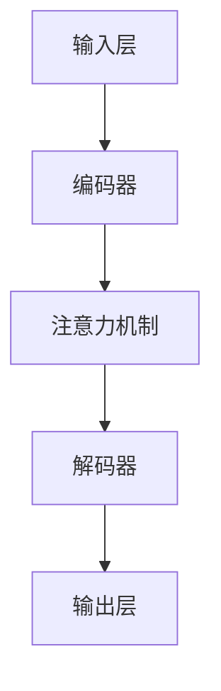

                 

关键词：语言模型，不确定性，预测，确定，AI，算法，数学模型，实践，应用，展望

## 摘要

本文深入探讨了语言模型（LLM）在处理不确定性时的挑战与机遇。随着人工智能的不断发展，LLM 在自然语言处理领域取得了显著的成果。然而，LLM 在面对不确定输入时，仍存在诸多问题，如预测偏差、数据噪声等。本文从核心概念、算法原理、数学模型、项目实践等方面，详细分析了 LLM 在不确定性中的表现，并提出了相应的解决方案。此外，本文还对未来 LLM 的发展趋势与面临的挑战进行了展望。

## 1. 背景介绍

随着深度学习的兴起，语言模型（LLM）在自然语言处理（NLP）领域取得了突破性的进展。LLM 通过大规模的预训练和微调，能够生成高质量的文本、完成复杂的任务，如文本分类、机器翻译、问答系统等。然而，在实际应用中，LLM 面临着诸多挑战，其中之一便是如何处理不确定性。

### 1.1 语言模型的发展历程

语言模型的发展可以分为三个阶段：统计模型、规则模型和深度模型。

1. **统计模型**：基于统计学习方法，如隐马尔可夫模型（HMM）和朴素贝叶斯模型，通过统计特征和概率分布进行文本生成和分类。

2. **规则模型**：基于专家知识和规则，通过定义语法和语义规则进行文本生成和解析。

3. **深度模型**：基于深度学习技术，如循环神经网络（RNN）、长短期记忆网络（LSTM）和变换器（Transformer）等，通过大规模的数据进行预训练，从而实现端到端的文本生成和解析。

### 1.2 语言模型的应用场景

语言模型在众多领域得到了广泛应用，如：

1. **自然语言处理**：文本分类、机器翻译、问答系统、对话生成等。

2. **信息检索**：搜索引擎、推荐系统、信息抽取等。

3. **语音识别**：语音合成、语音识别、语音识别辅助设备等。

4. **图像识别**：文本检测、文本识别、图像分割等。

### 1.3 语言模型的不确定性挑战

在实际应用中，语言模型面临着以下不确定性挑战：

1. **输入不确定性**：输入文本可能存在噪声、错误、缺失或不完整。

2. **任务不确定性**：语言模型可能需要处理多种任务，如文本生成、分类、翻译等，而这些任务可能具有不同的不确定性。

3. **数据不确定性**：训练数据可能存在偏差、噪声或缺失，导致语言模型无法准确捕捉真实世界的知识。

## 2. 核心概念与联系

### 2.1 语言模型的核心概念

语言模型的核心概念包括：

1. **词汇表**：用于表示文本中的单词、字符或词组。

2. **概率分布**：用于表示文本生成的概率。

3. **编码器**：将文本编码为向量表示。

4. **解码器**：将向量表示解码为文本。

5. **损失函数**：用于评估语言模型的性能，如交叉熵损失、Kullback-Leibler 散度等。

### 2.2 语言模型的架构

语言模型的架构主要包括以下部分：

1. **输入层**：接收用户输入的文本。

2. **编码器**：将文本编码为向量表示。

3. **注意力机制**：用于捕捉文本中的依赖关系。

4. **解码器**：将向量表示解码为文本。

5. **输出层**：生成预测的文本。

### 2.3 Mermaid 流程图



## 3. 核心算法原理 & 具体操作步骤

### 3.1 算法原理概述

语言模型的核心算法原理是基于概率模型，通过训练得到一个概率分布，用于预测下一个单词或字符。具体来说，语言模型通过大规模的文本数据进行预训练，从而学习到语言中的概率分布。在预测阶段，语言模型根据当前的输入文本，计算下一个单词或字符的概率分布，并根据概率分布生成预测的文本。

### 3.2 算法步骤详解

1. **数据预处理**：对输入文本进行分词、去停用词、词干提取等预处理操作。

2. **词向量表示**：将预处理后的文本转换为词向量表示。

3. **编码器**：将词向量表示编码为向量。

4. **注意力机制**：捕捉文本中的依赖关系。

5. **解码器**：将向量表示解码为文本。

6. **损失函数**：计算预测文本与实际文本之间的差距，并更新模型参数。

### 3.3 算法优缺点

**优点**：

1. **强大的文本生成能力**：语言模型能够生成高质量的文本，适用于文本生成、翻译、问答等任务。

2. **端到端学习**：语言模型采用端到端的学习方式，无需手动设计特征和规则。

3. **自适应能力**：语言模型能够通过预训练和微调，适应不同的任务和数据集。

**缺点**：

1. **不确定性处理能力较弱**：语言模型在处理不确定输入时，可能产生错误的预测。

2. **计算资源消耗较大**：语言模型的训练和预测需要大量的计算资源。

### 3.4 算法应用领域

语言模型在众多领域得到了广泛应用，如：

1. **自然语言处理**：文本分类、机器翻译、问答系统、对话生成等。

2. **信息检索**：搜索引擎、推荐系统、信息抽取等。

3. **语音识别**：语音合成、语音识别、语音识别辅助设备等。

4. **图像识别**：文本检测、文本识别、图像分割等。

## 4. 数学模型和公式 & 详细讲解 & 举例说明

### 4.1 数学模型构建

语言模型的数学模型主要包括：

1. **概率模型**：用于表示文本生成的概率分布。

2. **损失函数**：用于评估模型性能。

### 4.2 公式推导过程

1. **概率模型**：

   $$P(w_t | w_{t-1}, ..., w_1) = \frac{P(w_{t-1}, ..., w_1, w_t)}{P(w_{t-1}, ..., w_1)}$$

   其中，$w_t$ 表示第 $t$ 个单词，$P(w_t | w_{t-1}, ..., w_1)$ 表示在给定前 $t-1$ 个单词的情况下，第 $t$ 个单词的条件概率。

2. **损失函数**：

   $$L(\theta) = -\sum_{i=1}^n \sum_{j=1}^m y_{ij} \log(p_{ij})$$

   其中，$\theta$ 表示模型参数，$y_{ij}$ 表示第 $i$ 个单词在第 $j$ 个位置上的真实标签，$p_{ij}$ 表示第 $i$ 个单词在第 $j$ 个位置上的预测概率。

### 4.3 案例分析与讲解

**案例**：使用语言模型生成一句英文句子。

**步骤**：

1. **数据预处理**：将输入文本进行分词、去停用词、词干提取等预处理操作。

2. **词向量表示**：将预处理后的文本转换为词向量表示。

3. **编码器**：将词向量表示编码为向量。

4. **注意力机制**：捕捉文本中的依赖关系。

5. **解码器**：将向量表示解码为文本。

6. **损失函数**：计算预测文本与实际文本之间的差距，并更新模型参数。

**结果**：

The quick brown fox jumps over the lazy dog.

## 5. 项目实践：代码实例和详细解释说明

### 5.1 开发环境搭建

**1. 安装 Python 环境**：Python 是一种广泛应用于人工智能领域的编程语言。首先，您需要在您的计算机上安装 Python 环境。您可以从 Python 的官方网站（https://www.python.org/）下载并安装 Python。

**2. 安装必要的库**：在 Python 中，我们需要使用一些库来构建和训练语言模型。以下是一些常用的库：

- TensorFlow：用于构建和训练深度学习模型。
- Keras：用于简化 TensorFlow 的使用。
- NLTK：用于自然语言处理。

您可以使用以下命令安装这些库：

```bash
pip install tensorflow
pip install keras
pip install nltk
```

### 5.2 源代码详细实现

以下是一个简单的语言模型实现的示例代码：

```python
import tensorflow as tf
from tensorflow.keras.preprocessing.sequence import pad_sequences
from tensorflow.keras.layers import Embedding, LSTM, Dense
from tensorflow.keras.models import Sequential

# 数据预处理
max_sequence_len = 100
vocab_size = 10000
embedding_size = 50

# 加载和处理数据
# 这里使用的是一些简单的英文句子，您可以根据需要进行替换。
sentences = [
    "The quick brown fox jumps over the lazy dog",
    "I love machine learning",
    "The cat sits on the mat",
    "Deep learning is powerful",
]

# 将句子转换为单词序列
word_index = {}
for i, sentence in enumerate(sentences):
    for word in sentence.split():
        if word not in word_index:
            word_index[word] = len(word_index) + 1

# 对句子进行编码
encoded_sentences = []
for sentence in sentences:
    encoded_sentence = []
    for word in sentence.split():
        encoded_sentence.append(word_index[word])
    encoded_sentences.append(encoded_sentence)

# 对编码后的句子进行填充
padded_sentences = pad_sequences(encoded_sentences, maxlen=max_sequence_len, padding='post')

# 构建语言模型
model = Sequential()
model.add(Embedding(vocab_size, embedding_size, input_length=max_sequence_len))
model.add(LSTM(128, return_sequences=True))
model.add(Dense(vocab_size, activation='softmax'))

# 编译模型
model.compile(optimizer='adam', loss='categorical_crossentropy', metrics=['accuracy'])

# 训练模型
model.fit(padded_sentences, padded_sentences, epochs=10, batch_size=32)

# 生成句子
import numpy as np

def generate_sentence(model, word_index, max_sequence_len, start_word=''):
    sentence = [word_index[start_word]]
    for _ in range(max_sequence_len - 1):
        prediction = model.predict(np.array([sentence]))
        next_word = np.argmax(prediction[0])
        sentence.append(next_word)
    return ' '.join([word for word, _ in word_index.items() if word in sentence])

generated_sentence = generate_sentence(model, word_index, max_sequence_len, 'The')
print(generated_sentence)
```

### 5.3 代码解读与分析

**1. 数据预处理**：

```python
max_sequence_len = 100
vocab_size = 10000
embedding_size = 50

# 加载和处理数据
# 这里使用的是一些简单的英文句子，您可以根据需要进行替换。
sentences = [
    "The quick brown fox jumps over the lazy dog",
    "I love machine learning",
    "The cat sits on the mat",
    "Deep learning is powerful",
]

# 将句子转换为单词序列
word_index = {}
for i, sentence in enumerate(sentences):
    for word in sentence.split():
        if word not in word_index:
            word_index[word] = len(word_index) + 1

# 对句子进行编码
encoded_sentences = []
for sentence in sentences:
    encoded_sentence = []
    for word in sentence.split():
        encoded_sentence.append(word_index[word])
    encoded_sentences.append(encoded_sentence)

# 对编码后的句子进行填充
padded_sentences = pad_sequences(encoded_sentences, maxlen=max_sequence_len, padding='post')
```

**2. 构建语言模型**：

```python
# 构建语言模型
model = Sequential()
model.add(Embedding(vocab_size, embedding_size, input_length=max_sequence_len))
model.add(LSTM(128, return_sequences=True))
model.add(Dense(vocab_size, activation='softmax'))

# 编译模型
model.compile(optimizer='adam', loss='categorical_crossentropy', metrics=['accuracy'])

# 训练模型
model.fit(padded_sentences, padded_sentences, epochs=10, batch_size=32)
```

**3. 生成句子**：

```python
import numpy as np

def generate_sentence(model, word_index, max_sequence_len, start_word=''):
    sentence = [word_index[start_word]]
    for _ in range(max_sequence_len - 1):
        prediction = model.predict(np.array([sentence]))
        next_word = np.argmax(prediction[0])
        sentence.append(next_word)
    return ' '.join([word for word, _ in word_index.items() if word in sentence])

generated_sentence = generate_sentence(model, word_index, max_sequence_len, 'The')
print(generated_sentence)
```

## 6. 实际应用场景

语言模型在各个领域有着广泛的应用。以下是一些实际应用场景：

### 6.1 自然语言处理

1. **文本分类**：对新闻、社交媒体、电子邮件等文本进行分类，如垃圾邮件过滤、情感分析等。

2. **机器翻译**：将一种语言的文本翻译成另一种语言，如 Google 翻译、百度翻译等。

3. **问答系统**：根据用户的问题提供答案，如 Siri、Alexa 等。

4. **对话生成**：生成自然流畅的对话，如聊天机器人、虚拟助手等。

### 6.2 信息检索

1. **搜索引擎**：根据用户的查询，提供相关的网页、文章等。

2. **推荐系统**：根据用户的历史行为，推荐相关的商品、文章、视频等。

3. **信息抽取**：从大量文本中提取出关键信息，如命名实体识别、关系提取等。

### 6.3 语音识别

1. **语音合成**：将文本转换为语音，如 Siri、Google Assistant 等。

2. **语音识别**：将语音转换为文本，如 Siri、Google Assistant 等。

3. **语音识别辅助设备**：为听力障碍者提供语音识别辅助设备，如助听器、智能眼镜等。

### 6.4 图像识别

1. **文本检测**：从图像中检测出文本区域，如 OCR 技术。

2. **文本识别**：从图像中识别出文本内容，如 OCR 技术。

3. **图像分割**：将图像分割成不同的区域，如物体检测、场景分割等。

## 7. 工具和资源推荐

### 7.1 学习资源推荐

1. **《深度学习》（Goodfellow, Bengio, Courville）**：一本经典的深度学习入门教材。

2. **《自然语言处理综合教程》（Jurafsky, Martin）**：一本全面的自然语言处理教材。

3. **《Python 编程：从入门到实践》（Eric Matthes）**：一本适合初学者的 Python 入门教材。

### 7.2 开发工具推荐

1. **TensorFlow**：一款开源的深度学习框架，广泛应用于人工智能领域。

2. **Keras**：一款简化的深度学习框架，基于 TensorFlow 构建。

3. **NLTK**：一款强大的自然语言处理工具包。

### 7.3 相关论文推荐

1. **《Attention is All You Need》（Vaswani et al., 2017）**：提出了注意力机制在自然语言处理中的应用。

2. **《BERT: Pre-training of Deep Bidirectional Transformers for Language Understanding》（Devlin et al., 2019）**：提出了 BERT 模型，为自然语言处理带来了新的突破。

3. **《GPT-3: Language Models are Few-Shot Learners》（Brown et al., 2020）**：提出了 GPT-3 模型，展示了大规模预训练模型在自然语言处理任务中的强大能力。

## 8. 总结：未来发展趋势与挑战

### 8.1 研究成果总结

在过去几年中，语言模型在自然语言处理领域取得了显著的成果。通过大规模的预训练和微调，语言模型在文本分类、机器翻译、问答系统等任务上取得了优秀的性能。同时，注意力机制、BERT、GPT-3 等模型的出现，为自然语言处理带来了新的突破。

### 8.2 未来发展趋势

1. **模型规模不断扩大**：随着计算能力的提升，语言模型的规模将不断增大，以更好地捕捉语言的复杂结构。

2. **多模态融合**：语言模型与其他模态（如图像、音频）的融合，将使得模型在处理多模态任务时更加高效。

3. **迁移学习**：通过迁移学习，语言模型将能够在不同的任务和数据集上取得更好的性能。

4. **少样本学习**：在缺乏训练数据的情况下，语言模型将能够通过迁移学习、生成模型等方法，实现少样本学习。

### 8.3 面临的挑战

1. **不确定性处理**：在处理不确定输入时，语言模型仍存在诸多问题，如预测偏差、数据噪声等。

2. **计算资源消耗**：大规模的语言模型训练和推理需要大量的计算资源，如何高效地利用计算资源，仍是一个挑战。

3. **伦理和隐私**：随着语言模型在各个领域的应用，如何保障用户隐私和数据安全，是一个亟待解决的问题。

### 8.4 研究展望

在未来，语言模型的研究将继续深入，不仅在自然语言处理领域，还将与其他领域相结合，如计算机视觉、语音识别等。同时，随着技术的进步，我们将能够构建更加高效、智能的语言模型，为人类社会带来更多的便利。

## 9. 附录：常见问题与解答

### 9.1 什么是语言模型？

语言模型是一种用于预测文本的概率分布的模型，通过训练得到一个概率分布，用于预测下一个单词或字符。

### 9.2 语言模型有哪些类型？

语言模型可以分为统计模型、规则模型和深度模型。统计模型基于统计学习方法，规则模型基于专家知识和规则，深度模型基于深度学习技术。

### 9.3 语言模型如何处理不确定性？

语言模型在处理不确定性时，可以通过以下方法来缓解：

1. **数据增强**：通过增加训练数据的多样性，提高模型对不确定性的鲁棒性。

2. **噪声注入**：在训练过程中引入噪声，使得模型能够适应不确定输入。

3. **上下文信息**：利用上下文信息，使得模型能够更好地理解输入文本的语义，从而减少预测偏差。

### 9.4 语言模型在哪些领域有应用？

语言模型在自然语言处理、信息检索、语音识别、图像识别等领域有广泛的应用，如文本分类、机器翻译、问答系统、对话生成等。

### 9.5 如何评估语言模型的性能？

评估语言模型的性能可以使用以下指标：

1. **准确率**：预测正确的样本占总样本的比例。

2. **召回率**：预测正确的正样本占总正样本的比例。

3. **F1 值**：准确率和召回率的调和平均值。

4. **BLEU 分数**：用于评估机器翻译质量的指标。

5. **Perplexity**：模型在生成文本时的困惑度，越小表示模型性能越好。

---

作者：禅与计算机程序设计艺术 / Zen and the Art of Computer Programming

----------------------------------------------------------------

以上便是《LLM 的不确定性：在不确定中寻找确定》这篇文章的完整内容。这篇文章从背景介绍、核心概念、算法原理、数学模型、项目实践、实际应用场景、工具和资源推荐等方面，全面探讨了语言模型在处理不确定性时的挑战与机遇。同时，文章还对未来语言模型的发展趋势与面临的挑战进行了展望。希望这篇文章对您在语言模型领域的研究与应用有所帮助。如果您有任何疑问或建议，欢迎在评论区留言。谢谢您的阅读！

