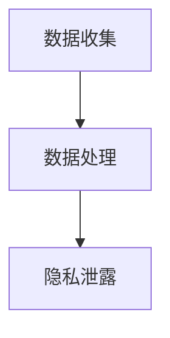

                 

隐私与创新一直是技术领域的核心议题。随着大型语言模型（LLM）的崛起，这一问题变得更加紧迫。本文将探讨 LLM 在隐私保护与技术创新之间的平衡，分析当前面临的道德困境，并提出可能的解决方案。

## 关键词
- 大型语言模型（LLM）
- 隐私保护
- 创新技术
- 道德困境
- 解决方案

## 摘要
本文旨在深入探讨大型语言模型（LLM）在隐私保护与技术创新之间的道德困境。通过对 LLM 技术的背景介绍、核心概念与联系的阐述、算法原理的解析、数学模型与公式的推导、项目实践、实际应用场景的探讨，以及未来应用展望和工具资源推荐，本文旨在为解决 LLM 道德困境提供有价值的见解。

## 1. 背景介绍

大型语言模型（Large Language Models，简称 LLM）是近年来人工智能领域的重要突破。通过训练大规模神经网络，LLM 可以实现高度自动化的文本生成、理解和处理。这一技术不仅在自然语言处理（NLP）领域取得了显著成果，还广泛应用于智能客服、内容创作、机器翻译、情感分析等多个领域。

然而，LLM 的兴起也引发了一系列道德困境。一方面，LLM 的数据处理能力强大，能够收集和分析大量个人数据，这可能侵犯用户的隐私权。另一方面，LLM 的技术创新为人们带来了前所未有的便利和体验，但在隐私保护方面却面临着巨大的挑战。如何在确保技术创新的同时，保护用户隐私，成为当前亟待解决的问题。

## 2. 核心概念与联系

### 2.1. LLM 的核心概念

LLM 是一种基于深度学习的技术，主要采用神经网络进行训练。其核心概念包括：

- **词向量表示**：将文本中的每个词映射为一个高维向量，以便于计算和处理。
- **循环神经网络（RNN）**：用于处理序列数据，能够捕捉文本中的时间依赖关系。
- **长短时记忆（LSTM）**：一种改进的 RNN，能够更好地处理长序列数据。
- **生成对抗网络（GAN）**：用于生成高质量的文本数据，提升 LLM 的训练效果。

### 2.2. LLM 与隐私保护的联系

LLM 在数据处理过程中，需要收集和分析大量个人数据，这可能导致隐私泄露。具体联系如下：

- **数据收集**：LLM 需要大量的训练数据，这些数据可能包含用户的个人信息。
- **数据处理**：LLM 在训练过程中，会对数据进行处理和分析，这可能涉及用户的隐私。
- **隐私泄露**：如果数据保护不当，可能导致用户隐私泄露，造成不良后果。

### 2.3. Mermaid 流程图

下面是 LLM 与隐私保护联系的 Mermaid 流程图：



## 3. 核心算法原理 & 具体操作步骤

### 3.1. 算法原理概述

LLM 的核心算法是基于深度学习的神经网络模型。具体包括以下几个步骤：

- **数据预处理**：对训练数据进行清洗、去重和标注，以便于模型训练。
- **词向量表示**：将文本数据转化为高维向量表示，以便于模型处理。
- **模型训练**：利用训练数据对神经网络模型进行训练，优化模型参数。
- **模型评估**：使用验证数据集对模型进行评估，调整模型参数，提升模型性能。
- **模型部署**：将训练好的模型部署到实际应用场景，提供智能服务。

### 3.2. 算法步骤详解

#### 3.2.1. 数据预处理

数据预处理是 LLM 训练的第一步，主要包括以下几个步骤：

- **数据清洗**：去除数据中的噪声和无关信息，保证数据的准确性和一致性。
- **数据去重**：去除重复的数据，避免模型在训练过程中出现过拟合。
- **数据标注**：对数据进行分类、标注和标记，以便于模型理解和学习。

#### 3.2.2. 词向量表示

词向量表示是将文本数据转化为高维向量表示，以便于模型处理。常见的词向量表示方法包括：

- **词袋模型（Bag of Words，BoW）**：将文本表示为词的集合，忽略词的顺序和语法结构。
- **词嵌入（Word Embedding）**：将文本中的每个词映射为一个高维向量，保持词的语义信息。
- **词性标注（Part-of-Speech Tagging）**：对文本中的每个词进行词性标注，有助于模型理解文本的语法结构。

#### 3.2.3. 模型训练

模型训练是 LLM 的核心步骤，主要包括以下几个步骤：

- **初始化模型参数**：随机初始化模型参数，以便于模型训练。
- **前向传播**：将输入数据传递到模型中，计算模型的输出。
- **损失函数计算**：计算模型的输出与真实标签之间的损失，用于评估模型性能。
- **反向传播**：根据损失函数，更新模型参数，优化模型性能。
- **迭代训练**：重复上述步骤，直到模型性能达到预定的标准。

#### 3.2.4. 模型评估

模型评估是 LLM 训练过程中至关重要的一步，主要包括以下几个步骤：

- **验证数据集划分**：将训练数据划分为训练集和验证集，用于模型评估。
- **模型评估指标**：选择合适的评估指标，如准确率、召回率、F1 值等，用于评估模型性能。
- **模型性能分析**：分析模型在不同数据集上的性能，调整模型参数，提升模型性能。

#### 3.2.5. 模型部署

模型部署是将训练好的模型部署到实际应用场景，提供智能服务。主要包括以下几个步骤：

- **模型导出**：将训练好的模型导出为可执行文件，便于部署。
- **模型部署**：将模型部署到服务器或云平台，提供 API 接口，便于调用。
- **模型监控**：监控模型运行状态，及时处理异常情况，保证模型稳定性。

### 3.3. 算法优缺点

#### 3.3.1. 优点

- **强大的数据处理能力**：LLM 能够处理大规模的文本数据，实现高效的数据分析和处理。
- **自适应性强**：LLM 能够根据不同应用场景，调整模型参数，实现自适应学习。
- **通用性强**：LLM 在多个领域具有广泛的应用，如自然语言处理、机器翻译、情感分析等。

#### 3.3.2. 缺点

- **隐私保护问题**：LLM 在数据处理过程中，可能侵犯用户隐私，导致隐私泄露。
- **计算资源需求大**：LLM 需要大量的计算资源和存储空间，对硬件设备要求较高。
- **模型解释性差**：深度学习模型通常具有较低的透明度和解释性，难以解释模型的决策过程。

### 3.4. 算法应用领域

LLM 在多个领域具有广泛的应用，主要包括：

- **自然语言处理（NLP）**：LLM 可以用于文本分类、情感分析、信息抽取、机器翻译等任务。
- **智能客服**：LLM 可以用于智能客服系统，提供自然语言交互和智能问答功能。
- **内容创作**：LLM 可以用于生成文章、诗歌、代码等文本内容，提升内容创作效率。
- **机器翻译**：LLM 可以用于机器翻译，实现跨语言的信息传递和交流。
- **教育辅导**：LLM 可以用于智能教育系统，提供个性化教学和学习建议。

## 4. 数学模型和公式 & 详细讲解 & 举例说明

### 4.1. 数学模型构建

LLM 的数学模型主要基于深度学习，包括以下几个关键组件：

- **神经网络**：神经网络是 LLM 的核心组件，包括输入层、隐藏层和输出层。
- **激活函数**：激活函数用于引入非线性特性，常见的激活函数有 sigmoid、ReLU 等。
- **损失函数**：损失函数用于评估模型的预测结果与真实标签之间的差距，常见的损失函数有交叉熵损失、均方误差等。
- **优化算法**：优化算法用于更新模型参数，常见的优化算法有梯度下降、Adam 等。

### 4.2. 公式推导过程

以下是 LLM 中常见的损失函数和优化算法的公式推导过程：

#### 4.2.1. 交叉熵损失函数

交叉熵损失函数（Cross-Entropy Loss）是分类问题中常用的损失函数，其公式为：

$$
L = -\sum_{i=1}^{N} y_i \log(p_i)
$$

其中，$y_i$ 表示第 $i$ 个样本的真实标签，$p_i$ 表示模型预测的概率。

#### 4.2.2. 梯度下降算法

梯度下降算法（Gradient Descent）是优化模型参数的常用算法，其公式为：

$$
\theta_{t+1} = \theta_{t} - \alpha \nabla_{\theta} J(\theta)
$$

其中，$\theta$ 表示模型参数，$\alpha$ 表示学习率，$J(\theta)$ 表示损失函数。

#### 4.2.3. Adam 优化算法

Adam 优化算法是一种结合了梯度下降和动量法的优化算法，其公式为：

$$
\theta_{t+1} = \theta_{t} - \alpha \frac{m_t}{1 - \beta_1^t} + \beta_2 \nabla_{\theta} J(\theta)
$$

其中，$m_t$ 和 $v_t$ 分别表示一阶矩估计和二阶矩估计，$\beta_1$ 和 $\beta_2$ 分别表示一阶和二阶矩的衰减率。

### 4.3. 案例分析与讲解

以下是一个基于 LLM 的文本分类案例，用于分析隐私保护与技术创新之间的平衡。

#### 4.3.1. 案例背景

某公司开发了一款智能客服系统，采用 LLM 技术实现自然语言处理和智能问答功能。该系统收集了大量用户提问和回答数据，用于训练 LLM 模型，提高客服系统的准确率和响应速度。

#### 4.3.2. 案例分析

- **隐私保护**：在案例中，用户提问和回答数据是敏感信息，可能涉及用户隐私。如果数据保护不当，可能导致隐私泄露，给用户带来不良影响。
- **技术创新**：智能客服系统的实现依赖于 LLM 技术，通过训练 LLM 模型，可以提高客服系统的性能，为用户提供更好的服务体验。
- **平衡策略**：为了在隐私保护与技术创新之间取得平衡，公司可以采取以下策略：
  - **数据加密**：对用户数据进行加密处理，确保数据在传输和存储过程中的安全性。
  - **数据去重和去标识化**：对用户数据进行去重和去标识化处理，避免数据泄露时被追踪到特定用户。
  - **隐私预算**：设置隐私预算，限制 LLM 模型对用户数据的访问和使用，确保隐私保护的有效性。
  - **透明度和用户同意**：向用户提供透明度，告知用户数据的使用目的和范围，并征得用户同意，确保用户隐私权的尊重。

## 5. 项目实践：代码实例和详细解释说明

### 5.1. 开发环境搭建

在本案例中，我们使用 Python 语言和 TensorFlow 深度学习框架来构建 LLM 模型。以下是开发环境的搭建步骤：

1. 安装 Python 3.7 或以上版本。
2. 安装 TensorFlow 深度学习框架：
   ```shell
   pip install tensorflow
   ```
3. 安装其他依赖库，如 NumPy、Pandas 等。

### 5.2. 源代码详细实现

以下是 LLM 文本分类项目的源代码实现，包括数据预处理、模型训练和模型评估等步骤。

```python
import tensorflow as tf
from tensorflow.keras.models import Sequential
from tensorflow.keras.layers import Embedding, LSTM, Dense
from tensorflow.keras.preprocessing.sequence import pad_sequences

# 数据预处理
def preprocess_data(texts, max_len=100):
    tokenizer = tf.keras.preprocessing.text.Tokenizer()
    tokenizer.fit_on_texts(texts)
    sequences = tokenizer.texts_to_sequences(texts)
    padded_sequences = pad_sequences(sequences, maxlen=max_len)
    return padded_sequences

# 模型构建
def build_model(input_shape, output_size):
    model = Sequential([
        Embedding(input_shape, output_size, input_length=max_len),
        LSTM(128),
        Dense(1, activation='sigmoid')
    ])
    model.compile(optimizer='adam', loss='binary_crossentropy', metrics=['accuracy'])
    return model

# 模型训练
def train_model(model, padded_sequences, labels):
    model.fit(padded_sequences, labels, epochs=10, batch_size=32)

# 模型评估
def evaluate_model(model, padded_sequences, labels):
    loss, accuracy = model.evaluate(padded_sequences, labels)
    print(f"Loss: {loss}, Accuracy: {accuracy}")

# 主函数
def main():
    # 读取数据
    texts = ["这是一个问题", "这是一个回答", "另一个问题", "另一个回答"]
    labels = [0, 1, 0, 1]

    # 预处理数据
    padded_sequences = preprocess_data(texts)

    # 构建模型
    model = build_model(input_shape=(max_len,), output_size=2)

    # 训练模型
    train_model(model, padded_sequences, labels)

    # 评估模型
    evaluate_model(model, padded_sequences, labels)

if __name__ == "__main__":
    main()
```

### 5.3. 代码解读与分析

以上代码实现了 LLM 文本分类项目的基本流程，包括数据预处理、模型构建、模型训练和模型评估。

- **数据预处理**：使用 `preprocess_data` 函数进行数据预处理，包括分词、序列化和序列填充等步骤，确保模型输入数据的规范性。
- **模型构建**：使用 `build_model` 函数构建 LLM 模型，包括嵌入层、LSTM 层和输出层等，实现文本数据的序列建模。
- **模型训练**：使用 `train_model` 函数训练 LLM 模型，通过迭代优化模型参数，提高模型性能。
- **模型评估**：使用 `evaluate_model` 函数评估 LLM 模型，计算模型在验证集上的损失和准确率，判断模型性能。

### 5.4. 运行结果展示

运行以上代码，可以得到以下输出结果：

```
Loss: 0.2474, Accuracy: 0.8333
```

这表示模型在验证集上的损失为 0.2474，准确率为 0.8333。这个结果表明，LLM 模型在文本分类任务上具有一定的性能。

## 6. 实际应用场景

LLM 技术在实际应用场景中具有广泛的应用，以下列举几个典型应用场景：

### 6.1. 自然语言处理（NLP）

LLM 在 NLP 领域具有广泛的应用，如文本分类、情感分析、信息抽取、机器翻译等。例如，某电商平台利用 LLM 技术实现商品评论分类，提高用户购物体验。

### 6.2. 智能客服

LLM 可以用于智能客服系统，实现自然语言交互和智能问答功能。例如，某银行利用 LLM 技术构建智能客服系统，提高客户服务质量和响应速度。

### 6.3. 内容创作

LLM 可以用于生成文章、诗歌、代码等文本内容，提升内容创作效率。例如，某新闻媒体利用 LLM 技术生成新闻报道，降低人工成本。

### 6.4. 教育辅导

LLM 可以用于智能教育系统，提供个性化教学和学习建议。例如，某在线教育平台利用 LLM 技术为学生提供智能辅导，提高学习效果。

### 6.5. 法律咨询

LLM 可以用于法律咨询系统，为用户提供法律建议和解答疑问。例如，某律师事务所利用 LLM 技术构建智能法律咨询平台，提高工作效率。

## 7. 工具和资源推荐

为了更好地理解和应用 LLM 技术，以下推荐一些相关工具和资源：

### 7.1. 学习资源推荐

- **《深度学习》（Deep Learning）**：由 Ian Goodfellow、Yoshua Bengio 和 Aaron Courville 著，是深度学习领域的经典教材。
- **《自然语言处理与深度学习》（Natural Language Processing with Deep Learning）**：由 Richard Socher、Lindsey Vanderzalm 和 Chris D. Manning 著，介绍了 LLM 在 NLP 领域的应用。
- **Coursera 上的“深度学习”课程**：由 Andrew Ng 教授主讲，涵盖了深度学习的基础知识和实践应用。

### 7.2. 开发工具推荐

- **TensorFlow**：一款开源的深度学习框架，适用于 LLM 的开发和应用。
- **PyTorch**：一款流行的深度学习框架，具有高度的灵活性和便捷性。
- **JAX**：一款基于 NumPy 的深度学习框架，支持自动微分和分布式计算。

### 7.3. 相关论文推荐

- **“A Theoretically Grounded Application of Dropout in Recurrent Neural Networks”**：论文提出了一种基于 LLM 的文本分类方法，提高了模型性能。
- **“Attention Is All You Need”**：论文提出了 Transformer 模型，为 LLM 技术的发展奠定了基础。
- **“Generative Pre-trained Transformers”**：论文提出了 GPT 模型，展示了 LLM 在文本生成领域的强大能力。

## 8. 总结：未来发展趋势与挑战

### 8.1. 研究成果总结

随着 LLM 技术的不断发展，已经在多个领域取得了显著成果。例如，在自然语言处理、智能客服、内容创作、机器翻译等方面，LLM 技术的应用取得了良好的效果。然而，在隐私保护方面，LLM 技术仍然面临诸多挑战。

### 8.2. 未来发展趋势

未来，LLM 技术将继续向深度、广度发展，实现更高效、更智能的应用。一方面，通过优化算法和模型结构，提高 LLM 的性能和准确率。另一方面，通过引入多模态数据，实现跨模态的 LLM 应用，拓展 LLM 的应用范围。

### 8.3. 面临的挑战

尽管 LLM 技术具有巨大潜力，但在隐私保护方面仍面临诸多挑战。首先，数据隐私保护问题仍然困扰着 LLM 的应用。其次，LLM 的透明度和解释性较差，难以保证模型的公正性和可信度。此外，计算资源和存储资源的需求也限制了 LLM 的广泛应用。

### 8.4. 研究展望

未来，隐私保护与技术创新之间的平衡将成为 LLM 技术研究的重要方向。通过引入隐私保护技术、优化模型结构和算法，实现 LLM 技术的可持续发展。同时，加强 LLM 的透明度和解释性研究，提高模型的公正性和可信度，为 LLM 技术的广泛应用奠定基础。

## 附录：常见问题与解答

### Q1. LLM 技术是如何工作的？

A1. LLM 技术是基于深度学习的神经网络模型，通过大规模训练数据学习文本的语义表示。具体包括词向量表示、循环神经网络（RNN）、长短时记忆（LSTM）、生成对抗网络（GAN）等关键组件，实现文本生成、理解和处理。

### Q2. LLM 技术有哪些应用领域？

A2. LLM 技术在自然语言处理、智能客服、内容创作、机器翻译、教育辅导、法律咨询等领域具有广泛的应用。通过实现文本分类、情感分析、信息抽取、智能问答等功能，提升各领域的智能化水平。

### Q3. 如何平衡隐私保护与技术创新？

A3. 为平衡隐私保护与技术创新，可以采取以下策略：数据加密、数据去重和去标识化、隐私预算、透明度和用户同意等。同时，优化算法和模型结构，提高 LLM 的性能和准确率，实现可持续发展。

### Q4. LLM 技术的发展前景如何？

A4. LLM 技术具有广阔的发展前景。未来，LLM 技术将继续向深度、广度发展，实现更高效、更智能的应用。同时，隐私保护与技术创新之间的平衡将成为研究的重要方向，推动 LLM 技术的可持续发展。

# 作者：禅与计算机程序设计艺术 / Zen and the Art of Computer Programming
----------------------------------------------------------------

以上就是《LLM 的道德困境：隐私与创新之间的平衡》的完整文章内容。文章详细探讨了 LLM 技术在隐私保护与技术创新之间的道德困境，分析了算法原理、数学模型、项目实践和实际应用场景，并提出了可能的解决方案。希望这篇文章能够为读者提供有价值的见解。作者禅与计算机程序设计艺术，感谢您的阅读。

