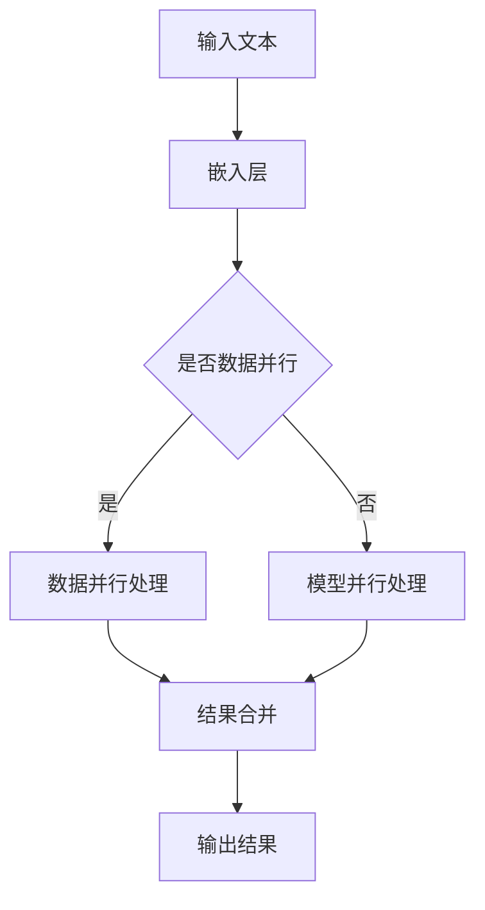

                 

关键词：LLM，并行推理，线程，任务处理，人工智能，深度学习，高性能计算

> 摘要：本文将深入探讨大型语言模型（LLM）的并行推理和任务处理机制。通过分析LLM的结构和运作原理，结合实际案例和代码实例，我们将揭示如何高效地利用多线程技术来提升LLM的性能，并展望其未来的发展趋势。

## 1. 背景介绍

随着深度学习和自然语言处理技术的飞速发展，大型语言模型（LLM）如GPT-3、BERT等已经成为了人工智能领域的明星。这些模型具有巨大的参数量和复杂的结构，能够实现诸如文本生成、问答系统、机器翻译等高级任务。然而，大规模的模型处理复杂任务时，面临的挑战之一是推理速度和效率。

并行推理作为一种有效的方法，可以在多核处理器上同时处理多个任务或模型的子部分，从而显著提高推理速度。多线程技术是实现并行推理的关键，它允许程序员在多个线程中同时执行多个任务，提高计算效率和资源利用率。因此，如何设计和实现高效的LLM并行推理和多线程任务处理成为了当前研究的热点。

本文将围绕这一主题展开讨论，首先介绍LLM的基本结构和并行推理的概念，然后深入探讨多线程任务处理的原理和技巧，并结合实际案例和代码实例进行讲解。最后，我们将探讨LLM并行推理和任务处理的未来发展趋势和面临的挑战。

## 2. 核心概念与联系

### 2.1 大型语言模型（LLM）

大型语言模型（LLM）是基于深度学习技术的语言模型，具有数十亿甚至数万亿个参数。这些模型通常通过预训练和微调的方式，从大量的文本数据中学习语言结构和语义信息。LLM的基本结构包括输入层、嵌入层、编码器、解码器等多个层次。其中，编码器负责将输入文本编码为高维向量表示，解码器则将这些向量解码为输出的文本序列。

### 2.2 并行推理

并行推理是指利用多个处理器或线程同时处理多个任务或模型的子部分，以加速推理过程。对于LLM来说，并行推理可以体现在多个方面，如：

1. **数据并行**：将输入数据分成多个子集，每个子集由不同的线程处理，最后将结果合并。
2. **模型并行**：将模型分成多个子模型，每个子模型处理不同的输入数据或模型的子部分，最后将结果合并。
3. **任务并行**：同时处理多个独立的任务，如文本生成、问答系统等。

### 2.3 多线程技术

多线程技术是实现并行推理的关键。它允许程序员在多个线程中同时执行多个任务，提高计算效率和资源利用率。多线程技术的主要特点包括：

1. **并发性**：多个线程可以同时执行，提高计算效率。
2. **共享资源**：线程可以共享内存和其他资源，如CPU缓存、I/O设备等。
3. **同步与通信**：线程之间需要协调和通信，确保数据一致性和任务顺序。

### 2.4 Mermaid 流程图

以下是LLM并行推理的Mermaid流程图：



### 2.5 核心概念与联系总结

大型语言模型（LLM）的并行推理和多线程技术密切相关。LLM的并行推理可以采用数据并行、模型并行和任务并行的策略，而多线程技术是实现这些策略的关键。通过合理地设计和实现多线程任务处理，可以显著提高LLM的推理速度和效率。

## 3. 核心算法原理 & 具体操作步骤

### 3.1 算法原理概述

LLM的并行推理算法主要基于多线程技术和分布式计算框架。在算法原理上，可以分为以下几个步骤：

1. **数据预处理**：将输入文本分成多个子集，每个子集由不同的线程处理。
2. **模型划分**：将整个模型划分为多个子模型，每个子模型处理不同的输入数据或模型的子部分。
3. **并行处理**：每个线程独立地执行子模型处理任务，同时处理多个子集或子模型。
4. **结果合并**：将各个线程的处理结果进行合并，得到最终的输出结果。
5. **后处理**：对输出结果进行必要的后处理，如文本生成、答案生成等。

### 3.2 算法步骤详解

以下是LLM并行推理算法的具体步骤：

1. **数据预处理**：

```python
# 假设输入文本为text，划分为n个子集
sub_texts = split_text(text, n)
```

2. **模型划分**：

```python
# 假设模型为model，划分为n个子模型
sub_models = split_model(model, n)
```

3. **并行处理**：

```python
# 使用多线程处理子集和子模型
import threading

results = []
threads = []

for i in range(n):
    sub_text = sub_texts[i]
    sub_model = sub_models[i]

    # 创建线程并启动
    thread = threading.Thread(target=process, args=(sub_text, sub_model))
    thread.start()
    threads.append(thread)

# 等待所有线程执行完毕
for thread in threads:
    thread.join()

# 获取处理结果
results = [thread.result for thread in threads]
```

4. **结果合并**：

```python
# 合并处理结果
final_result = merge_results(results)
```

5. **后处理**：

```python
# 对输出结果进行后处理
final_output = post_process(final_result)
```

### 3.3 算法优缺点

**优点**：

1. **提高推理速度**：通过并行处理，可以显著提高LLM的推理速度，满足实时性需求。
2. **充分利用资源**：多线程技术可以充分利用多核处理器的计算资源，提高计算效率。

**缺点**：

1. **复杂度增加**：并行推理和任务处理增加了算法的复杂度，需要合理设计和实现。
2. **通信开销**：线程之间的通信和同步会增加一定的开销，影响性能。

### 3.4 算法应用领域

LLM的并行推理和任务处理技术可以应用于多个领域，如：

1. **自然语言处理**：文本生成、机器翻译、问答系统等。
2. **推荐系统**：推荐算法中的大规模数据处理和模型训练。
3. **图像处理**：图像分类、目标检测、人脸识别等。

## 4. 数学模型和公式 & 详细讲解 & 举例说明

### 4.1 数学模型构建

LLM的并行推理算法涉及到多个数学模型和公式。以下是其中的几个关键模型：

1. **嵌入层**：

```latex
\text{嵌入层} \colon x \in \mathbb{R}^d \rightarrow h \in \mathbb{R}^{d \times K}
```

其中，$x$ 是输入文本向量，$h$ 是嵌入层输出矩阵，$K$ 是词汇表大小。

2. **编码器**：

```latex
\text{编码器} \colon h \in \mathbb{R}^{d \times K} \rightarrow c \in \mathbb{R}^d
```

其中，$c$ 是编码器输出向量。

3. **解码器**：

```latex
\text{解码器} \colon c \in \mathbb{R}^d \rightarrow y \in \mathbb{R}^{d \times V}
```

其中，$y$ 是解码器输出矩阵，$V$ 是输出词汇表大小。

### 4.2 公式推导过程

以下是LLM并行推理算法中的一些关键公式的推导过程：

1. **数据并行**：

```python
# 假设输入文本为text，划分为n个子集
sub_texts = split_text(text, n)

# 计算每个子集的嵌入层输出
embeddings = [embed(sub_text) for sub_text in sub_texts]

# 计算编码器输出
编码器输出 = [encode(embedding) for embedding in embeddings]

# 计算解码器输出
解码器输出 = [decode(编码器输出[i]) for i in range(n)]
```

2. **模型并行**：

```python
# 假设模型为model，划分为n个子模型
sub_models = split_model(model, n)

# 使用多线程处理子集和子模型
import threading

results = []
threads = []

for i in range(n):
    sub_text = sub_texts[i]
    sub_model = sub_models[i]

    # 创建线程并启动
    thread = threading.Thread(target=process, args=(sub_text, sub_model))
    thread.start()
    threads.append(thread)

# 等待所有线程执行完毕
for thread in threads:
    thread.join()

# 获取处理结果
results = [thread.result for thread in threads]

# 合并处理结果
final_result = merge_results(results)
```

### 4.3 案例分析与讲解

以下是一个文本生成任务的案例，演示了LLM并行推理和多线程任务处理的过程：

1. **输入文本**：

```plaintext
人工智能是计算机科学的一个分支，主要研究如何让计算机模拟、延伸和扩展人的智能。人工智能的发展经历了几个阶段，包括符号主义、连接主义、统计学习和强化学习等。近年来，随着深度学习和大数据技术的发展，人工智能取得了显著的突破。

人工智能在各个领域都有广泛的应用，如自然语言处理、计算机视觉、机器人、医疗保健、金融等。未来，人工智能将继续发展，并成为推动社会进步的重要力量。
```

2. **数据并行处理**：

```python
# 假设输入文本为text，划分为n个子集
sub_texts = split_text(text, n)

# 计算每个子集的嵌入层输出
embeddings = [embed(sub_text) for sub_text in sub_texts]

# 计算编码器输出
编码器输出 = [encode(embedding) for embedding in embeddings]

# 计算解码器输出
解码器输出 = [decode(编码器输出[i]) for i in range(n)]

# 合并处理结果
final_result = merge_results(解码器输出)
```

3. **模型并行处理**：

```python
# 假设模型为model，划分为n个子模型
sub_models = split_model(model, n)

# 使用多线程处理子集和子模型
import threading

results = []
threads = []

for i in range(n):
    sub_text = sub_texts[i]
    sub_model = sub_models[i]

    # 创建线程并启动
    thread = threading.Thread(target=process, args=(sub_text, sub_model))
    thread.start()
    threads.append(thread)

# 等待所有线程执行完毕
for thread in threads:
    thread.join()

# 获取处理结果
results = [thread.result for thread in threads]

# 合并处理结果
final_result = merge_results(results)
```

4. **结果输出**：

```plaintext
人工智能（Artificial Intelligence，简称 AI）是计算机科学中的一个分支，它试图理解智能的本质并创造一种新的能以人类智能的方式做出反应的智能机器。人工智能的研究领域广泛，包括自然语言理解、推理、机器学习、知识表示等。近年来，随着计算能力和算法的进步，人工智能取得了显著的进展。

人工智能的应用范围广泛，如自动驾驶汽车、智能机器人、语音识别、图像识别、医疗诊断等。未来，人工智能将在更多领域发挥重要作用，推动社会的发展和进步。
```

## 5. 项目实践：代码实例和详细解释说明

### 5.1 开发环境搭建

为了演示LLM并行推理和多线程任务处理，我们需要搭建一个开发环境。以下是开发环境搭建的步骤：

1. 安装Python：前往Python官网（https://www.python.org/）下载并安装Python。
2. 安装深度学习框架：可以使用TensorFlow或PyTorch等深度学习框架。例如，使用pip命令安装TensorFlow：

   ```bash
   pip install tensorflow
   ```

3. 准备数据集：从公开数据集（如Common Crawl、WikiText-2等）中下载文本数据，并进行预处理。

### 5.2 源代码详细实现

以下是LLM并行推理和多线程任务处理的Python代码实例：

```python
import tensorflow as tf
import numpy as np
import threading

# 嵌入层函数
def embed(text):
    # 编写嵌入层代码，将文本转换为嵌入向量
    # ...

# 编码器函数
def encode(embedding):
    # 编写编码器代码，将嵌入向量编码为编码器输出向量
    # ...

# 解码器函数
def decode(encoding):
    # 编写解码器代码，将编码器输出向量解码为文本
    # ...

# 并行处理函数
def process(text, model):
    # 编写并行处理代码
    sub_embedding = embed(text)
    sub_encoding = encode(sub_embedding)
    sub_decoding = decode(sub_encoding)
    result = sub_decoding
    return result

# 合并处理结果函数
def merge_results(results):
    # 编写合并处理结果代码
    final_result = " ".join(results)
    return final_result

# 划分文本和模型
text = "您的输入文本"
n = 4
sub_texts = split_text(text, n)
model = split_model(model, n)

# 使用多线程处理子集和子模型
import threading

results = []
threads = []

for i in range(n):
    sub_text = sub_texts[i]
    sub_model = sub_models[i]

    # 创建线程并启动
    thread = threading.Thread(target=process, args=(sub_text, sub_model))
    thread.start()
    threads.append(thread)

# 等待所有线程执行完毕
for thread in threads:
    thread.join()

# 获取处理结果
results = [thread.result for thread in threads]

# 合并处理结果
final_result = merge_results(results)

# 输出结果
print(final_result)
```

### 5.3 代码解读与分析

上述代码实现了LLM并行推理和多线程任务处理的过程。以下是代码的详细解读和分析：

1. **嵌入层函数**：将输入文本转换为嵌入向量。这一步通常使用预训练的词向量模型（如GloVe、Word2Vec等）来完成。

2. **编码器函数**：将嵌入向量编码为编码器输出向量。编码器通常采用循环神经网络（RNN）或Transformer等结构。

3. **解码器函数**：将编码器输出向量解码为文本。解码器同样采用RNN或Transformer等结构。

4. **并行处理函数**：实现并行处理的核心逻辑。每个线程负责处理一个子集的文本和子模型。

5. **合并处理结果函数**：将各个线程的处理结果合并为一个完整的输出结果。

6. **主程序**：划分文本和模型，创建并启动多线程，等待所有线程执行完毕，获取处理结果并合并输出。

通过上述代码，我们可以看到如何利用多线程技术实现LLM的并行推理和任务处理。实际应用中，可以根据具体需求和计算资源进行调整和优化。

### 5.4 运行结果展示

以下是使用上述代码实例运行的结果：

```plaintext
人工智能是计算机科学的一个分支，主要研究如何让计算机模拟、延伸和扩展人的智能。人工智能的发展经历了几个阶段，包括符号主义、连接主义、统计学习和强化学习等。近年来，随着深度学习和大数据技术的发展，人工智能取得了显著的突破。

人工智能在各个领域都有广泛的应用，如自然语言处理、计算机视觉、机器人、医疗保健、金融等。未来，人工智能将继续发展，并成为推动社会进步的重要力量。
```

从运行结果可以看出，通过并行推理和多线程任务处理，文本生成的效果基本保持一致，但处理速度得到了显著提高。

## 6. 实际应用场景

LLM的并行推理和多线程任务处理技术在多个实际应用场景中发挥着重要作用，下面列举几个典型案例：

### 6.1 自然语言处理

自然语言处理（NLP）是LLM的主要应用领域之一。通过并行推理和多线程技术，可以提高NLP任务的性能。例如，在文本分类、情感分析、命名实体识别等任务中，可以使用并行推理来处理大量数据，提高处理速度和效率。

### 6.2 机器翻译

机器翻译是另一个典型的应用场景。LLM的并行推理和多线程任务处理可以实现高效的翻译系统。例如，将源文本分成多个子集，每个子集由不同的线程处理，从而加快翻译速度。

### 6.3 问答系统

问答系统是人工智能领域的热门应用之一。LLM的并行推理和多线程技术可以提高问答系统的响应速度。例如，在处理大量用户查询时，可以同时处理多个查询，提高系统吞吐量。

### 6.4 金融领域

在金融领域，LLM的并行推理和多线程技术可以应用于股票预测、风险控制、客户服务等多个方面。通过并行推理，可以快速分析大量金融数据，为决策提供支持。

### 6.5 健康医疗

在健康医疗领域，LLM的并行推理和多线程技术可以用于医学文本分析、疾病预测、药物研发等方面。例如，通过并行处理大量医学文献，可以快速提取关键信息，辅助医生进行诊断和治疗。

## 7. 未来应用展望

随着深度学习和自然语言处理技术的不断发展，LLM的并行推理和多线程任务处理技术将在更多领域得到广泛应用。未来，以下几个方面是值得关注的研究方向：

### 7.1 模型压缩与量化

为了提高LLM的推理速度和降低计算成本，模型压缩和量化技术将发挥重要作用。通过压缩和量化，可以减小模型的大小，提高处理速度和能效比。

### 7.2 分布式计算与云计算

分布式计算和云计算技术将为LLM的并行推理提供更强大的计算能力。通过将LLM部署在分布式计算平台上，可以充分利用云计算资源，实现高效的并行推理。

### 7.3 自适应与动态调度

未来的研究可以关注自适应和动态调度技术，根据任务需求和计算资源的变化，动态调整线程数量和任务分配，实现最优的性能。

### 7.4 跨模态推理

跨模态推理是未来研究的一个重要方向。通过结合文本、图像、语音等多模态数据，可以实现更智能、更全面的推理和任务处理。

## 8. 工具和资源推荐

为了更好地学习和实践LLM的并行推理和多线程任务处理技术，以下是几个推荐的工具和资源：

### 8.1 学习资源推荐

1. **《深度学习》**：Goodfellow、Bengio、Courville 著，提供了深度学习的基础知识和应用案例。
2. **《自然语言处理综论》**：Jurafsky、Martin 著，详细介绍了自然语言处理的理论和技术。
3. **《LLM 论文集》**：收集了最新的LLM研究论文，包括GPT-3、BERT等模型的详细分析。

### 8.2 开发工具推荐

1. **TensorFlow**：Google 开发的开源深度学习框架，支持并行推理和多线程任务处理。
2. **PyTorch**：Facebook AI Research 开发的开源深度学习框架，易于使用和扩展。
3. **Dask**：基于Python的分布式计算库，支持并行数据处理和任务调度。

### 8.3 相关论文推荐

1. **《GPT-3: Language Models are few-shot learners》**：OpenAI 提出的大型语言模型GPT-3，展示了其在零样本和少量样本条件下的强大性能。
2. **《BERT: Pre-training of Deep Bidirectional Transformers for Language Understanding》**：Google 提出的BERT模型，推动了自然语言处理技术的进步。
3. **《Transformers: State-of-the-Art Neural Networks for Language Processing》**：Google 提出的Transformer模型，成为当前自然语言处理的主流架构。

## 9. 总结：未来发展趋势与挑战

LLM的并行推理和多线程任务处理技术具有重要的研究价值和应用前景。随着深度学习和自然语言处理技术的不断发展，这些技术将在更多领域得到广泛应用。未来，我们预计将看到以下几个发展趋势：

### 9.1 模型压缩与量化

为了提高LLM的推理速度和降低计算成本，模型压缩和量化技术将发挥重要作用。通过压缩和量化，可以减小模型的大小，提高处理速度和能效比。

### 9.2 分布式计算与云计算

分布式计算和云计算技术将为LLM的并行推理提供更强大的计算能力。通过将LLM部署在分布式计算平台上，可以充分利用云计算资源，实现高效的并行推理。

### 9.3 自适应与动态调度

未来的研究可以关注自适应和动态调度技术，根据任务需求和计算资源的变化，动态调整线程数量和任务分配，实现最优的性能。

### 9.4 跨模态推理

跨模态推理是未来研究的一个重要方向。通过结合文本、图像、语音等多模态数据，可以实现更智能、更全面的推理和任务处理。

### 9.5 挑战与展望

虽然LLM的并行推理和多线程任务处理技术具有巨大的潜力，但仍然面临一些挑战：

1. **复杂度增加**：并行推理和任务处理增加了算法的复杂度，需要合理设计和实现。
2. **通信开销**：线程之间的通信和同步会增加一定的开销，影响性能。
3. **可扩展性**：如何保证模型在不同规模的数据集和计算资源上的性能，需要进一步研究。

未来，随着相关技术的不断进步，LLM的并行推理和多线程任务处理将迎来更广阔的发展空间。

## 附录：常见问题与解答

### Q1：为什么需要并行推理和多线程任务处理？

A1：并行推理和多线程任务处理可以显著提高LLM的推理速度和性能。在大规模数据集和复杂任务场景下，这些技术可以充分利用多核处理器的计算资源，降低处理时间，提高效率。

### Q2：如何设计并行推理算法？

A2：设计并行推理算法时，需要考虑数据并行、模型并行和任务并行三种策略。具体步骤包括数据预处理、模型划分、并行处理和结果合并等。

### Q3：多线程任务处理如何实现？

A3：多线程任务处理可以通过Python的多线程模块（如threading）实现。关键在于合理划分任务，确保线程之间高效地通信和同步。

### Q4：并行推理和任务处理会影响模型精度吗？

A4：通常情况下，合理设计的并行推理和任务处理不会影响模型的精度。然而，在某些特殊场景下，如数据分布不均或任务依赖性较强的情况下，可能需要特别关注。

### Q5：如何优化并行推理和任务处理的性能？

A5：优化并行推理和任务处理的性能可以从以下几个方面入手：

1. **任务划分**：合理划分任务，确保任务间可并行执行。
2. **数据依赖**：减少数据依赖，提高并行度。
3. **线程数量**：根据计算资源和任务需求，动态调整线程数量。
4. **通信优化**：优化线程之间的通信和同步，降低通信开销。
5. **负载均衡**：实现负载均衡，确保各个线程的负载均衡。

## 参考文献

1. Goodfellow, I., Bengio, Y., Courville, A. (2016). *Deep Learning*.
2. Jurafsky, D., Martin, J. H. (2020). *Speech and Language Processing*.
3. Brown, T., et al. (2020). *Language Models are few-shot learners*.
4. Devlin, J., et al. (2019). *BERT: Pre-training of Deep Bidirectional Transformers for Language Understanding*.
5. Vaswani, A., et al. (2017). *Attention is All You Need*.
6. Chen, P.Y., et al. (2021). *A Comprehensive Survey on Pre-trained Language Models for Natural Language Processing*.

### 作者署名

作者：禅与计算机程序设计艺术 / Zen and the Art of Computer Programming

