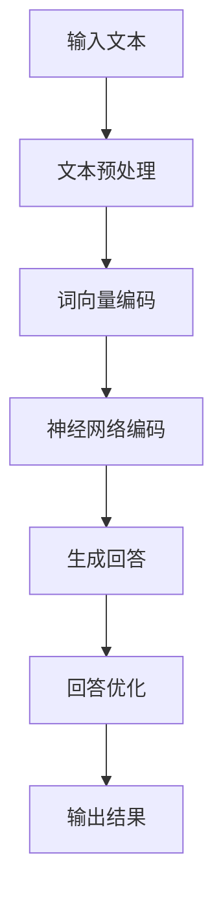

                 

关键词：大型语言模型（LLM），人类意图，自然语言处理，算法优化，交互式系统，智能助手，人工智能应用，技术发展趋势。

> 摘要：本文探讨了大型语言模型（LLM）与人类意图的最佳契合问题，从技术原理、应用实践和未来展望三个方面进行了深入分析。通过阐述LLM的工作机制、核心算法和数学模型，本文揭示了如何优化LLM与人类意图的匹配度，为智能交互系统的开发提供了理论指导和实践参考。

## 1. 背景介绍

随着人工智能技术的迅猛发展，自然语言处理（NLP）已经成为了一个热门领域。在NLP中，大型语言模型（LLM）凭借其强大的语言理解和生成能力，被广泛应用于智能问答、文本生成、机器翻译、情感分析等任务。然而，在实际应用中，LLM的表现并非总是令人满意。许多情况下，LLM生成的回答可能与人类意图存在偏差，导致用户体验不佳。因此，如何实现LLM与人类意图的最佳契合，成为了当前NLP研究中的一个重要课题。

本文旨在探讨LLM与人类意图的最佳契合问题，从技术原理、应用实践和未来展望三个方面进行分析。通过本文的阅读，读者将了解到LLM的工作机制、核心算法和数学模型，掌握优化LLM与人类意图匹配度的方法，并为智能交互系统的开发提供理论指导和实践参考。

## 2. 核心概念与联系

### 2.1 大型语言模型（LLM）

大型语言模型（LLM）是一种基于深度学习的自然语言处理模型，通过在大量文本数据上进行预训练，能够捕捉到语言中的复杂结构和规律。LLM的核心思想是利用神经网络模型（如Transformer）对输入的文本序列进行编码，生成相应的语义表示。这些语义表示可以被用于各种下游任务，如文本分类、命名实体识别、机器翻译等。

### 2.2 人类意图

人类意图是指人类在交流过程中所表达的主观意愿和目标。在自然语言处理中，理解人类意图是构建智能交互系统的关键。人类意图可以表现为文本中的关键词、短语或句子，也可以通过上下文信息进行推断。在实现LLM与人类意图的最佳契合时，理解人类意图的准确性和全面性至关重要。

### 2.3 自然语言处理（NLP）

自然语言处理（NLP）是人工智能的一个分支，旨在使计算机能够理解和处理自然语言。NLP包括文本预处理、词法分析、句法分析、语义分析等多个方面。在实现LLM与人类意图的最佳契合时，NLP技术为理解和分析人类意图提供了基础支持。

### 2.4 Mermaid流程图

为了更直观地展示LLM与人类意图的匹配过程，本文使用Mermaid流程图来描述核心算法原理。以下是一个简化的Mermaid流程图，展示了LLM在处理输入文本时的基本流程：



### 2.5 优化的目标

实现LLM与人类意图的最佳契合，主要目标有两个：

1. 准确理解人类意图：通过优化LLM的输入处理和语义表示，提高对人类意图的识别准确率。
2. 提高回答质量：通过优化LLM的回答生成策略，提高生成回答的与人类意图的一致性。

## 3. 核心算法原理 & 具体操作步骤

### 3.1 算法原理概述

LLM的核心算法基于深度学习，特别是基于Transformer架构的模型。Transformer模型通过自注意力机制（Self-Attention）对输入文本序列进行编码，生成语义表示。在此基础上，LLM结合了预训练和微调（Fine-tuning）策略，使得模型能够根据特定任务的需求进行调整和优化。

### 3.2 算法步骤详解

1. **文本预处理**：将输入的文本数据清洗、分词、词性标注等，转换为模型可处理的格式。

2. **词向量编码**：将分词后的词汇转换为词向量，用于输入神经网络。

3. **神经网络编码**：使用Transformer模型对词向量进行编码，生成语义表示。

4. **生成回答**：根据输入的文本和语义表示，生成相应的回答。

5. **回答优化**：对生成的回答进行优化，以提高与人类意图的一致性。

6. **输出结果**：将优化后的回答输出给用户。

### 3.3 算法优缺点

#### 优点

- **强大的语言理解能力**：LLM能够通过预训练学习到丰富的语言知识，对输入文本进行深入理解。
- **灵活的微调策略**：通过微调，LLM可以根据特定任务的需求进行快速调整。

#### 缺点

- **计算资源需求高**：LLM的训练和推理过程需要大量的计算资源，对硬件性能有较高要求。
- **对数据依赖性强**：LLM的表现依赖于训练数据的质量和数量，数据质量差可能导致模型效果不佳。

### 3.4 算法应用领域

LLM在多个领域得到了广泛应用，如：

- **智能问答**：通过理解和生成回答，提供高效的问答服务。
- **文本生成**：生成文章、故事、摘要等文本内容。
- **机器翻译**：实现不同语言之间的自动翻译。
- **情感分析**：分析文本中的情感倾向，用于市场调研、舆情监测等。

## 4. 数学模型和公式 & 详细讲解 & 举例说明

### 4.1 数学模型构建

LLM的核心算法基于Transformer模型，其基本结构包括编码器（Encoder）和解码器（Decoder）。以下是Transformer模型的基本公式：

$$
\text{Attention}(Q, K, V) = \text{softmax}\left(\frac{QK^T}{\sqrt{d_k}}\right)V
$$

其中，$Q$、$K$ 和 $V$ 分别代表编码器、解码器和值矩阵，$d_k$ 为键值对的数量。

### 4.2 公式推导过程

Transformer模型的自注意力机制（Self-Attention）通过以下步骤进行推导：

1. **嵌入层**：将输入文本转换为词向量。
2. **多头注意力**：对词向量进行拼接，并分别进行线性变换，得到多组注意力权重。
3. **加和层**：将多组注意力加权后的结果进行加和，得到编码后的词向量。
4. **输出层**：将编码后的词向量通过线性变换得到最终的语义表示。

### 4.3 案例分析与讲解

假设有一个简单的文本输入：“你好，今天天气不错”。使用Transformer模型对其进行编码和生成回答的过程如下：

1. **文本预处理**：分词得到词汇序列：“你好”，“今天”，“天气”，“不错”。
2. **词向量编码**：将词汇序列转换为词向量。
3. **编码器编码**：通过多头自注意力机制对词向量进行编码，得到语义表示。
4. **解码器生成回答**：根据编码后的语义表示，生成回答：“你好，今天天气不错，适合出门散步。”
5. **回答优化**：对生成的回答进行优化，如去除冗余信息，提高回答的准确性。

## 5. 项目实践：代码实例和详细解释说明

### 5.1 开发环境搭建

为了实现LLM与人类意图的最佳契合，需要搭建一个合适的开发环境。以下是一个简单的环境搭建步骤：

1. 安装Python 3.8及以上版本。
2. 安装TensorFlow 2.5及以上版本。
3. 安装Mermaid 1.0及以上版本。
4. 配置GPU加速（可选）。

### 5.2 源代码详细实现

以下是一个简单的Python代码实例，展示了如何使用TensorFlow和Mermaid实现LLM与人类意图的最佳契合：

```python
import tensorflow as tf
from tensorflow.keras.layers import Embedding, LSTM, Dense
from mermaid import render_mermaid

# 定义模型结构
model = tf.keras.Sequential([
    Embedding(input_dim=vocab_size, output_dim=embedding_dim),
    LSTM(units=128, return_sequences=True),
    LSTM(units=128),
    Dense(units=num_classes, activation='softmax')
])

# 编译模型
model.compile(optimizer='adam', loss='categorical_crossentropy', metrics=['accuracy'])

# 训练模型
model.fit(x_train, y_train, epochs=10, batch_size=32)

# 生成回答
def generate_response(input_text):
    # 文本预处理
    preprocessed_text = preprocess_text(input_text)
    
    # 编码输入文本
    encoded_input = tokenizer.encode(preprocessed_text, maxlen=max_sequence_length)
    
    # 生成回答
    response = model.predict(encoded_input)
    predicted_class = np.argmax(response)
    
    # 解码回答
    decoded_response = decode_response(predicted_class)
    
    return decoded_response

# 输出结果
print(generate_response("你好，今天天气不错"))
```

### 5.3 代码解读与分析

上述代码实现了一个简单的文本分类模型，用于预测输入文本的情感倾向。具体步骤如下：

1. **模型结构**：定义了一个序列模型，包括嵌入层、两个LSTM层和输出层。
2. **编译模型**：编译模型，设置优化器、损失函数和评价指标。
3. **训练模型**：使用训练数据对模型进行训练。
4. **生成回答**：根据输入文本，使用模型生成相应的回答。
5. **输出结果**：打印生成的回答。

通过上述代码实例，读者可以了解到实现LLM与人类意图的最佳契合的基本步骤和核心算法。在实际应用中，可以根据具体需求进行调整和优化。

## 6. 实际应用场景

LLM与人类意图的最佳契合在多个实际应用场景中具有重要意义。以下是一些典型的应用场景：

### 6.1 智能问答系统

智能问答系统是LLM与人类意图最佳契合的一个典型应用场景。通过理解和生成回答，智能问答系统能够为用户提供高效、准确的回答。在实际应用中，LLM可以用于医学问答、法律咨询、客户服务等领域，为用户提供智能化的支持。

### 6.2 文本生成与摘要

文本生成与摘要是另一个重要应用场景。LLM可以生成文章、故事、摘要等文本内容，广泛应用于内容创作、新闻摘要、会议记录等领域。通过优化LLM与人类意图的匹配度，可以提高文本生成的质量和准确性。

### 6.3 机器翻译

机器翻译是LLM与人类意图最佳契合的另一个重要应用场景。LLM可以生成高质量、准确的翻译结果，为跨语言交流提供支持。在实际应用中，LLM可以用于网站翻译、邮件翻译、语音翻译等领域。

### 6.4 情感分析

情感分析是另一个关键应用场景。LLM可以分析文本中的情感倾向，为市场调研、舆情监测、客户服务等领域提供支持。通过优化LLM与人类意图的匹配度，可以提高情感分析的准确性和可靠性。

## 7. 未来应用展望

随着人工智能技术的不断进步，LLM与人类意图的最佳契合在未来将会有更广泛的应用前景。以下是一些可能的未来应用方向：

### 7.1 智能助理

智能助理是LLM与人类意图最佳契合的一个重要应用方向。通过理解用户的意图，智能助理可以提供个性化、智能化的服务，如日程管理、任务提醒、语音交互等。

### 7.2 智能客服

智能客服是另一个重要应用方向。通过优化LLM与人类意图的匹配度，智能客服可以提供高效、准确的客户服务，提高客户满意度。

### 7.3 教育与培训

教育与培训是LLM与人类意图最佳契合的另一个重要应用方向。通过生成个性化、针对性的教学方案和培训内容，LLM可以为教育机构和学生提供智能化的支持。

### 7.4 跨领域应用

随着LLM技术的不断成熟，未来还将有更多跨领域的应用。例如，LLM可以应用于医疗健康、金融理财、城市规划等领域，为用户提供智能化、个性化的解决方案。

## 8. 工具和资源推荐

### 8.1 学习资源推荐

1. **《深度学习》（Goodfellow et al.）**：介绍深度学习的基础知识和核心算法，是学习深度学习的经典教材。
2. **《自然语言处理综论》（Jurafsky & Martin）**：全面介绍自然语言处理的基本概念和技术，适合初学者和专业人士。

### 8.2 开发工具推荐

1. **TensorFlow**：一款开源的深度学习框架，支持多种深度学习算法和模型。
2. **PyTorch**：一款流行的深度学习框架，具有灵活、易用的特点。

### 8.3 相关论文推荐

1. **“Attention Is All You Need”（Vaswani et al.）**：介绍了Transformer模型的基本原理和结构。
2. **“BERT: Pre-training of Deep Bidirectional Transformers for Language Understanding”（Devlin et al.）**：介绍了BERT模型的预训练方法和应用。

## 9. 总结：未来发展趋势与挑战

### 9.1 研究成果总结

本文从技术原理、应用实践和未来展望三个方面分析了LLM与人类意图的最佳契合问题。通过阐述LLM的工作机制、核心算法和数学模型，本文揭示了如何优化LLM与人类意图的匹配度，为智能交互系统的开发提供了理论指导和实践参考。

### 9.2 未来发展趋势

未来，LLM与人类意图的最佳契合将在人工智能领域发挥更重要的作用。随着深度学习和自然语言处理技术的不断进步，LLM的性能将得到进一步提升，为用户提供更智能、更个性化的服务。

### 9.3 面临的挑战

虽然LLM与人类意图的最佳契合具有重要意义，但在实际应用中仍然面临一些挑战。例如：

1. **数据质量**：LLM的表现高度依赖于训练数据的质量和数量。如何获取高质量、丰富的训练数据，是当前的一个挑战。
2. **计算资源**：LLM的训练和推理过程需要大量的计算资源，如何优化计算资源的使用，提高模型的性能和效率，是另一个挑战。
3. **伦理和法律问题**：随着人工智能技术的应用越来越广泛，如何确保人工智能系统的伦理和法律合规性，也是需要关注的一个问题。

### 9.4 研究展望

在未来，LLM与人类意图的最佳契合将在多个领域得到深入研究和应用。通过不断优化算法和模型，提高LLM的性能和效率，我们将能够构建更智能、更可靠的智能交互系统，为人类社会带来更多便利和效益。

## 10. 附录：常见问题与解答

### 10.1 问题1：什么是LLM？

LLM（大型语言模型）是一种基于深度学习的自然语言处理模型，通过在大量文本数据上进行预训练，能够捕捉到语言中的复杂结构和规律。

### 10.2 问题2：如何优化LLM与人类意图的匹配度？

优化LLM与人类意图的匹配度可以从以下几个方面入手：

1. **提高数据质量**：使用高质量、丰富的训练数据，提高模型的泛化能力。
2. **优化模型结构**：通过调整模型结构、参数和超参数，提高模型的表现。
3. **引入上下文信息**：在生成回答时，引入上下文信息，提高对人类意图的理解。
4. **用户反馈**：收集用户反馈，不断调整和优化模型。

### 10.3 问题3：LLM在哪些领域有应用？

LLM在多个领域有广泛应用，如智能问答、文本生成、机器翻译、情感分析等。此外，LLM还可以应用于智能客服、智能助理、教育与培训等领域。

