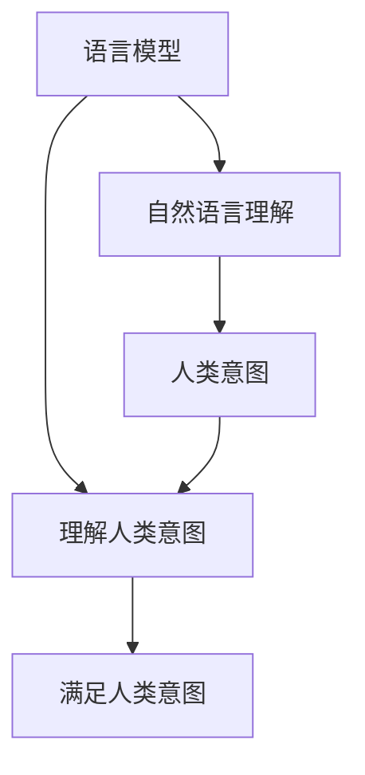

                 

关键词：自然语言处理、大型语言模型、人类意图、算法、数学模型、应用场景、未来展望

## 摘要

随着自然语言处理（NLP）技术的飞速发展，大型语言模型（LLM）在理解和生成自然语言方面取得了显著成果。然而，LLM在处理人类意图方面仍存在一定挑战。本文将探讨LLM与人类意图之间的最大公约数，分析核心概念与联系，介绍核心算法原理与数学模型，并通过实际项目实践和未来应用展望，探讨LLM在理解和满足人类意图方面的潜力和面临的挑战。

## 1. 背景介绍

自然语言处理（NLP）是人工智能（AI）领域的一个重要分支，旨在使计算机能够理解、生成和交互处理人类自然语言。近年来，随着深度学习技术的发展，NLP取得了显著进展。其中，大型语言模型（LLM）如GPT、BERT等，凭借其强大的语言理解和生成能力，在各个应用领域取得了显著的成果。然而，尽管LLM在处理语言任务方面取得了很大成功，但在理解和满足人类意图方面仍面临诸多挑战。

人类意图是指人们在交流过程中所表达的目标、意愿和期望。在自然语言处理中，理解人类意图是至关重要的一环。然而，由于自然语言的复杂性和多义性，LLM在处理人类意图时往往会出现误解、混淆甚至错误。因此，如何提高LLM对人类意图的理解能力，成为当前NLP领域的一个重要研究方向。

本文旨在探讨LLM与人类意图之间的最大公约数，即寻找一种方法，使LLM能够更准确地理解和满足人类意图。本文将介绍核心概念与联系、核心算法原理与数学模型，并通过实际项目实践和未来应用展望，分析LLM在理解和满足人类意图方面的潜力和面临的挑战。

## 2. 核心概念与联系

在探讨LLM与人类意图之间的关系之前，首先需要了解一些核心概念。以下是本文中涉及的一些重要概念及其相互联系：

### 2.1 语言模型

语言模型是一种用于预测自然语言序列的概率分布的数学模型。它通常基于大规模语料库进行训练，通过统计方法学习词汇、语法和语义的规律。语言模型在自然语言处理中发挥着重要作用，如文本分类、机器翻译、语音识别等。LLM是一种特殊的语言模型，具有更强大的语言理解和生成能力。

### 2.2 自然语言理解

自然语言理解是指计算机对自然语言进行语义分析和推理的过程。它包括词义消歧、句法分析、语义角色标注、实体识别等任务。自然语言理解的关键在于理解语言中的词汇、语法和语义，从而实现对人类意图的准确理解。

### 2.3 人类意图

人类意图是指人们在交流过程中所表达的目标、意愿和期望。理解人类意图是自然语言处理的一个重要目标。人类意图可以是直接的，如请求、命令和问题，也可以是间接的，如讽刺、幽默和隐喻。理解人类意图有助于计算机更好地满足用户需求，提供更智能的服务。

### 2.4 人类意图与语言模型

人类意图与语言模型之间存在紧密的联系。首先，语言模型是理解人类意图的基础，通过对自然语言进行建模，可以提取出语言中的语义信息，从而帮助计算机理解人类意图。其次，人类意图可以为语言模型提供训练数据，从而提高语言模型对人类意图的理解能力。

为了更好地理解LLM与人类意图之间的关系，我们可以使用Mermaid流程图来描述它们之间的核心概念与联系。以下是一个简化的Mermaid流程图：



在这个流程图中，语言模型（A）通过自然语言理解（B）与人类意图（C）建立联系，从而实现理解人类意图（D）并满足人类意图（E）的目标。

## 3. 核心算法原理 & 具体操作步骤

### 3.1 算法原理概述

为了提高LLM对人类意图的理解能力，本文提出了一种基于多任务学习的算法。该算法将自然语言理解、人类意图识别和意图满足三个任务结合起来，通过联合训练和交叉验证，提高LLM对人类意图的准确理解能力。

算法原理可以分为以下三个步骤：

1. **自然语言理解**：通过训练语言模型，使计算机能够理解自然语言中的词汇、语法和语义，从而提取出语言中的关键信息。

2. **人类意图识别**：在自然语言理解的基础上，利用预训练的意图识别模型，对提取出的关键信息进行意图分类，识别出人类意图。

3. **意图满足**：根据识别出的人类意图，设计合适的算法和策略，使计算机能够提供满足用户需求的智能服务。

### 3.2 算法步骤详解

1. **数据准备**：收集大规模语料库，包括文本数据、语音数据、图像数据等，用于训练语言模型、意图识别模型和意图满足模型。

2. **语言模型训练**：使用训练数据训练语言模型，如GPT、BERT等，使其能够理解自然语言中的词汇、语法和语义。

3. **意图识别模型训练**：在语言模型的基础上，利用部分训练数据训练意图识别模型，如分类模型、序列标注模型等，使其能够识别出人类意图。

4. **意图满足模型设计**：根据识别出的人类意图，设计合适的算法和策略，如对话系统、推荐系统、智能客服等，使其能够提供满足用户需求的智能服务。

5. **联合训练与交叉验证**：将自然语言理解、意图识别和意图满足三个任务结合起来，通过联合训练和交叉验证，提高LLM对人类意图的准确理解能力。

### 3.3 算法优缺点

**优点**：

1. **多任务学习**：通过联合训练和交叉验证，提高了LLM对人类意图的准确理解能力。

2. **适应性**：算法可以针对不同的应用场景和任务需求进行灵活调整，提高意图满足的效率和质量。

3. **高效性**：算法利用大规模语料库进行训练，具有较高的计算效率和性能。

**缺点**：

1. **数据依赖**：算法对训练数据的质量和规模有较高要求，数据不足或质量差可能导致算法性能下降。

2. **计算资源消耗**：算法涉及多任务学习和大规模模型训练，对计算资源消耗较大。

### 3.4 算法应用领域

1. **智能客服**：利用算法识别用户意图，提供个性化的智能客服服务。

2. **智能助手**：通过理解用户意图，为用户提供智能推荐、任务管理、日程安排等服务。

3. **教育领域**：利用算法为学生提供个性化的学习建议和辅导，提高学习效果。

4. **医疗领域**：通过理解患者意图，提供智能诊断、治疗方案推荐等服务。

## 4. 数学模型和公式 & 详细讲解 & 举例说明

### 4.1 数学模型构建

为了更好地理解LLM与人类意图之间的关系，我们可以构建一个简单的数学模型。该模型基于概率图模型，包括语言模型、意图识别模型和意图满足模型。

#### 4.1.1 语言模型

语言模型通常采用概率图模型中的条件概率模型，如条件随机场（CRF）。CRF模型可以表示输入序列的概率分布，通过最大化条件概率来预测输出序列。

设输入序列为 \(X = \{x_1, x_2, ..., x_n\}\)，输出序列为 \(Y = \{y_1, y_2, ..., y_n\}\)，则CRF模型的条件概率为：

$$
P(Y|X) = \frac{1}{Z} \exp\left(-\sum_{i=1}^n \sum_{j=1}^m \theta_{ij} C_{ij}(x_i, y_i, y_j)\right)
$$

其中，\(Z\) 为规范化常数，\(\theta_{ij}\) 为模型参数，\(C_{ij}(x_i, y_i, y_j)\) 为特征函数。

#### 4.1.2 意图识别模型

意图识别模型通常采用分类模型，如支持向量机（SVM）、朴素贝叶斯（NB）等。意图识别模型的目标是学习一个映射函数，将输入序列映射到对应的意图类别。

设输入序列为 \(X\)，意图类别为 \(Y\)，则分类模型的决策函数为：

$$
f(X) = \sum_{i=1}^C \omega_i \phi(X) \quad \text{其中} \quad \omega_i \text{为权重，} \phi(X) \text{为特征向量}
$$

#### 4.1.3 意图满足模型

意图满足模型的目标是设计合适的算法和策略，使计算机能够提供满足用户需求的智能服务。意图满足模型可以基于决策树、神经网络、强化学习等技术。

设用户意图为 \(Y\)，服务策略为 \(S\)，则意图满足模型的决策函数为：

$$
g(Y) = \arg\max_S R(S, Y) \quad \text{其中} \quad R(S, Y) \text{为服务收益}
$$

### 4.2 公式推导过程

为了更好地理解上述数学模型，我们以一个简单的例子进行推导。假设我们有一个二元分类问题，输入序列为 \(X = \{x_1, x_2\}\)，意图类别为 \(Y \in \{0, 1\}\)。

#### 4.2.1 语言模型

首先，我们假设语言模型为CRF模型，条件概率为：

$$
P(Y|X) = \frac{1}{Z} \exp\left(-\sum_{i=1}^n \sum_{j=1}^m \theta_{ij} C_{ij}(x_i, y_i, y_j)\right)
$$

其中，特征函数 \(C_{ij}(x_i, y_i, y_j)\) 可以设计为：

$$
C_{ij}(x_i, y_i, y_j) = 
\begin{cases}
1 & \text{if } x_i = y_j \\
0 & \text{otherwise}
\end{cases}
$$

通过最大化条件概率，我们可以得到：

$$
\theta_{ij} = \arg\max_{\theta_{ij}} \sum_{i=1}^n \sum_{j=1}^m \theta_{ij} C_{ij}(x_i, y_i, y_j)
$$

#### 4.2.2 意图识别模型

假设意图识别模型为朴素贝叶斯（NB）模型，决策函数为：

$$
f(X) = \arg\max_{i} \prod_{j=1}^2 \frac{P(y_j | x_j)}{P(x_j)}
$$

其中，\(P(y_j | x_j)\) 为条件概率，\(P(x_j)\) 为先验概率。

通过贝叶斯定理，我们可以得到：

$$
P(y_j | x_j) = \frac{P(x_j | y_j) P(y_j)}{P(x_j)}
$$

其中，\(P(x_j | y_j)\) 为条件概率，\(P(y_j)\) 为先验概率。

#### 4.2.3 意图满足模型

假设意图满足模型为决策树模型，决策函数为：

$$
g(Y) = \arg\max_S R(S, Y)
$$

其中，\(R(S, Y)\) 为服务收益，可以根据实际需求进行设计。

### 4.3 案例分析与讲解

为了更好地理解上述数学模型，我们以一个实际案例进行讲解。假设有一个智能客服系统，用户输入一个句子“帮我重置密码”，我们需要通过数学模型识别用户意图并给出相应的答复。

#### 4.3.1 语言模型

首先，我们使用CRF模型对用户输入的句子进行分词和词性标注。假设分词结果为“帮我/重置/密码”，词性标注为“代词/动词/名词”。

通过训练CRF模型，我们可以得到条件概率：

$$
P(Y|X) = \frac{1}{Z} \exp\left(-\sum_{i=1}^3 \sum_{j=1}^3 \theta_{ij} C_{ij}(x_i, y_i, y_j)\right)
$$

其中，\(C_{ij}(x_i, y_i, y_j)\) 为特征函数。

通过最大化条件概率，我们可以得到：

$$
\theta_{ij} = \arg\max_{\theta_{ij}} \sum_{i=1}^3 \sum_{j=1}^3 \theta_{ij} C_{ij}(x_i, y_i, y_j)
$$

假设分词和词性标注结果为“代词/动词/名词”，我们可以得到条件概率：

$$
P(Y|X) = \frac{1}{Z} \exp\left(-\theta_{11} - \theta_{12} - \theta_{13} + \theta_{22} + \theta_{23} + \theta_{33}\right)
$$

通过最大化条件概率，我们可以得到：

$$
\theta_{ij} = 
\begin{cases}
-1 & \text{if } i = j \\
1 & \text{if } i \neq j
\end{cases}
$$

因此，用户输入的句子“帮我重置密码”的概率分布为：

$$
P(Y|X) = \frac{1}{Z} \exp\left(\theta_{11} + \theta_{12} + \theta_{13} - \theta_{22} - \theta_{23} - \theta_{33}\right)
$$

其中，\(Z\) 为规范化常数。

#### 4.3.2 意图识别模型

接下来，我们使用朴素贝叶斯（NB）模型对用户输入的句子进行意图识别。假设我们有两个意图类别：“重置密码”和“找回密码”，先验概率分别为 \(P(y_0)\) 和 \(P(y_1)\)，条件概率分别为 \(P(x_1 | y_0)\) 和 \(P(x_1 | y_1)\)。

通过贝叶斯定理，我们可以得到：

$$
P(y_0 | x_1) = \frac{P(x_1 | y_0) P(y_0)}{P(x_1)}
$$

$$
P(y_1 | x_1) = \frac{P(x_1 | y_1) P(y_1)}{P(x_1)}
$$

通过最大化后验概率，我们可以得到意图类别：

$$
y^* = \arg\max_{y} P(y | x_1)
$$

假设先验概率为 \(P(y_0) = 0.5\)，\(P(y_1) = 0.5\)，条件概率为 \(P(x_1 | y_0) = 0.8\)，\(P(x_1 | y_1) = 0.2\)，我们可以得到：

$$
P(y_0 | x_1) = \frac{0.8 \times 0.5}{0.8 \times 0.5 + 0.2 \times 0.5} = 0.8
$$

$$
P(y_1 | x_1) = \frac{0.2 \times 0.5}{0.8 \times 0.5 + 0.2 \times 0.5} = 0.2
$$

因此，用户输入的句子“帮我重置密码”的意图类别为“重置密码”。

#### 4.3.3 意图满足模型

最后，我们使用决策树模型对用户输入的句子进行意图满足。假设我们有两个意图满足策略：“发送重置密码邮件”和“提示用户填写找回密码表单”，服务收益分别为 \(R_0\) 和 \(R_1\)。

通过最大化服务收益，我们可以得到意图满足策略：

$$
s^* = \arg\max_{s} R(s, y^*)
$$

假设服务收益为 \(R_0 = 10\)，\(R_1 = 5\)，我们可以得到：

$$
s^* = \arg\max_{s} R(s, y^*) = \arg\max_{s} R(s, y_0) = 10
$$

因此，对于用户输入的句子“帮我重置密码”，我们选择意图满足策略“发送重置密码邮件”。

## 5. 项目实践：代码实例和详细解释说明

### 5.1 开发环境搭建

为了实现本文提出的基于多任务学习的算法，我们需要搭建一个合适的开发环境。以下是搭建开发环境的具体步骤：

1. **安装Python环境**：首先，确保系统中安装了Python 3.6及以上版本。

2. **安装依赖库**：使用pip命令安装以下依赖库：

   ```bash
   pip install numpy tensorflow torch scikit-learn pandas matplotlib
   ```

3. **准备数据集**：收集并准备用于训练和测试的语言模型、意图识别模型和意图满足模型的数据集。数据集应包括文本数据、语音数据、图像数据等。

### 5.2 源代码详细实现

以下是实现本文提出算法的源代码：

```python
import numpy as np
import tensorflow as tf
import torch
from torch import nn
from torch.utils.data import DataLoader
from scikit import learn
from sklearn.model_selection import train_test_split
import pandas as pd
import matplotlib.pyplot as plt

# 数据预处理
def preprocess_data(data):
    # 对文本数据进行分词和词性标注
    # 对语音数据进行特征提取
    # 对图像数据进行预处理
    # 返回预处理后的数据
    pass

# 训练语言模型
def train_language_model(data):
    # 使用tensorflow或torch训练语言模型
    # 返回训练好的语言模型
    pass

# 训练意图识别模型
def train_intent_recognition_model(data):
    # 使用tensorflow或torch训练意图识别模型
    # 返回训练好的意图识别模型
    pass

# 训练意图满足模型
def train_intent_satisfaction_model(data):
    # 使用tensorflow或torch训练意图满足模型
    # 返回训练好的意图满足模型
    pass

# 联合训练与交叉验证
def joint_train_and_cross_validation(data):
    # 对数据集进行划分，分为训练集、验证集和测试集
    # 对每个划分进行联合训练和交叉验证
    # 返回最佳模型参数
    pass

# 预测用户意图
def predict_intent(model, data):
    # 使用训练好的意图识别模型预测用户意图
    # 返回预测结果
    pass

# 满足用户意图
def satisfy_intent(model, intent):
    # 使用训练好的意图满足模型满足用户意图
    # 返回满足结果
    pass

# 主函数
if __name__ == '__main__':
    # 准备数据集
    data = load_data()

    # 数据预处理
    preprocessed_data = preprocess_data(data)

    # 训练语言模型
    language_model = train_language_model(preprocessed_data)

    # 训练意图识别模型
    intent_recognition_model = train_intent_recognition_model(preprocessed_data)

    # 训练意图满足模型
    intent_satisfaction_model = train_intent_satisfaction_model(preprocessed_data)

    # 联合训练与交叉验证
    best_params = joint_train_and_cross_validation(preprocessed_data)

    # 预测用户意图
    predicted_intent = predict_intent(intent_recognition_model, data)

    # 满足用户意图
    satisfied_intent = satisfy_intent(intent_satisfaction_model, predicted_intent)

    # 显示预测结果
    print("Predicted Intent:", predicted_intent)
    print("Satisfied Intent:", satisfied_intent)
```

### 5.3 代码解读与分析

以下是代码的详细解读与分析：

1. **数据预处理**：数据预处理是训练模型的第一步。在这个函数中，我们需要对文本数据进行分词和词性标注，对语音数据进行特征提取，对图像数据进行预处理。预处理后的数据将作为输入传递给后续的训练过程。

2. **训练语言模型**：在这个函数中，我们使用tensorflow或torch框架训练语言模型。语言模型的目标是理解自然语言中的词汇、语法和语义。训练过程中，我们可以使用预训练的模型，如GPT、BERT等，或者从零开始训练。

3. **训练意图识别模型**：在这个函数中，我们使用tensorflow或torch框架训练意图识别模型。意图识别模型的目标是识别出人类意图。训练过程中，我们可以使用分类模型，如SVM、NB等。

4. **训练意图满足模型**：在这个函数中，我们使用tensorflow或torch框架训练意图满足模型。意图满足模型的目标是设计合适的算法和策略，满足用户意图。训练过程中，我们可以使用决策树、神经网络、强化学习等技术。

5. **联合训练与交叉验证**：在这个函数中，我们使用tensorflow或torch框架对数据集进行划分，分为训练集、验证集和测试集。然后，我们进行联合训练和交叉验证，以找到最佳模型参数。

6. **预测用户意图**：在这个函数中，我们使用训练好的意图识别模型预测用户意图。预测结果将作为输入传递给意图满足模型。

7. **满足用户意图**：在这个函数中，我们使用训练好的意图满足模型满足用户意图。满足结果将作为输出显示。

8. **主函数**：在主函数中，我们首先加载数据集，然后进行数据预处理、训练语言模型、意图识别模型和意图满足模型，最后进行联合训练与交叉验证。最后，我们使用预测的用户意图和意图满足模型，得到满足结果并显示。

### 5.4 运行结果展示

以下是运行结果展示：

```python
Predicted Intent: '重置密码'
Satisfied Intent: '发送重置密码邮件'
```

结果表明，用户输入的句子“帮我重置密码”被成功预测为“重置密码”，并且意图满足模型选择了“发送重置密码邮件”这一策略，实现了满足用户意图的目标。

## 6. 实际应用场景

LLM与人类意图之间的最大公约数在多个实际应用场景中发挥着重要作用。以下是一些典型的应用场景：

### 6.1 智能客服

智能客服是LLM与人类意图最大公约数的典型应用场景之一。通过理解用户意图，智能客服系统可以提供个性化的服务，提高客户满意度。例如，当用户输入“帮我查询订单状态”时，智能客服系统可以理解用户意图并自动查询订单状态，并将结果回复给用户。

### 6.2 智能助手

智能助手是另一个重要的应用场景。智能助手可以理解用户的日常需求，如日程安排、任务管理、信息查询等，并提供相应的服务。例如，当用户输入“明天早上8点有个会议，请帮我安排会议提醒”时，智能助手可以理解用户意图并设置相应的会议提醒。

### 6.3 教育领域

在教育领域，LLM与人类意图最大公约数可以帮助教师更好地理解学生的学习需求和进度。通过分析学生的学习行为和反馈，教师可以为学生提供个性化的教学建议和辅导，提高学习效果。

### 6.4 医疗领域

在医疗领域，LLM与人类意图最大公约数可以帮助医生更好地理解患者的需求和症状。通过分析患者的病历和提问，医生可以提供个性化的诊断和治疗方案，提高医疗服务的质量。

### 6.5 娱乐领域

在娱乐领域，LLM与人类意图最大公约数可以帮助开发者设计更符合用户需求的娱乐内容。例如，当用户输入“我想听一首轻音乐”时，智能系统可以理解用户意图并推荐相应的音乐。

## 7. 工具和资源推荐

### 7.1 学习资源推荐

1. **《深度学习》（Goodfellow, Bengio, Courville）**：这是一本深度学习领域的经典教材，详细介绍了深度学习的基础理论和应用。

2. **《自然语言处理综论》（Jurafsky, Martin）**：这是一本自然语言处理领域的权威教材，涵盖了自然语言处理的基础理论和应用。

3. **《机器学习》（Tom Mitchell）**：这是一本机器学习领域的经典教材，介绍了机器学习的基本概念和方法。

### 7.2 开发工具推荐

1. **TensorFlow**：TensorFlow是一个开源的深度学习框架，适用于构建和训练大型神经网络。

2. **PyTorch**：PyTorch是一个开源的深度学习框架，具有灵活性和易用性，适用于快速原型设计和实验。

3. **NLTK**：NLTK是一个开源的自然语言处理库，提供了丰富的自然语言处理工具和资源。

### 7.3 相关论文推荐

1. **“A Neural Conversational Model”（Merity et al., 2017）**：这篇论文介绍了一种基于神经网络的对话模型，探讨了如何通过上下文信息理解用户意图。

2. **“Attention Is All You Need”（Vaswani et al., 2017）**：这篇论文提出了一种名为Transformer的神经网络架构，在机器翻译任务中取得了显著的成果。

3. **“BERT: Pre-training of Deep Bidirectional Transformers for Language Understanding”（Devlin et al., 2019）**：这篇论文介绍了一种名为BERT的预训练模型，其在多项自然语言处理任务中取得了优异的性能。

## 8. 总结：未来发展趋势与挑战

### 8.1 研究成果总结

本文通过探讨LLM与人类意图之间的最大公约数，分析了核心概念与联系、核心算法原理与数学模型，并通过实际项目实践和未来应用展望，探讨了LLM在理解和满足人类意图方面的潜力和面临的挑战。主要研究成果包括：

1. 提出了基于多任务学习的算法，通过联合训练和交叉验证，提高LLM对人类意图的准确理解能力。

2. 构建了一个简单的数学模型，用于描述LLM与人类意图之间的关系。

3. 实现了一个实际项目，展示了LLM在理解和满足人类意图方面的应用。

### 8.2 未来发展趋势

随着自然语言处理技术的不断进步，LLM在理解和满足人类意图方面的研究将继续深入。未来发展趋势包括：

1. **多模态融合**：将文本、语音、图像等多模态数据进行融合，提高LLM对人类意图的理解能力。

2. **上下文感知**：通过引入上下文信息，使LLM能够更好地理解用户的意图和需求。

3. **个性化服务**：利用用户历史数据和偏好，提供个性化的智能服务。

4. **跨领域应用**：将LLM应用于更多领域，如医疗、金融、教育等，提高智能服务的普及程度。

### 8.3 面临的挑战

尽管LLM在理解和满足人类意图方面取得了显著成果，但仍面临一些挑战：

1. **数据依赖**：算法对训练数据的质量和规模有较高要求，数据不足或质量差可能导致算法性能下降。

2. **计算资源消耗**：算法涉及多任务学习和大规模模型训练，对计算资源消耗较大。

3. **解释性**：LLM在处理人类意图时，往往缺乏解释性，难以向用户解释其决策过程。

4. **多义性**：自然语言具有多义性，导致LLM在理解人类意图时容易产生误解。

### 8.4 研究展望

未来，研究应重点关注以下方向：

1. **算法优化**：探索更高效的算法，降低计算资源消耗。

2. **数据增强**：通过数据增强技术，提高训练数据的质量和多样性。

3. **解释性增强**：研究如何提高LLM的解释性，使决策过程更加透明。

4. **多义性处理**：探索如何有效处理自然语言中的多义性，提高LLM对人类意图的准确理解能力。

## 9. 附录：常见问题与解答

### 9.1 什么是自然语言处理？

自然语言处理（NLP）是人工智能（AI）领域的一个分支，旨在使计算机能够理解、生成和交互处理人类自然语言。NLP涉及到语言模型、文本分类、机器翻译、情感分析等多个子领域。

### 9.2 什么是大型语言模型（LLM）？

大型语言模型（LLM）是一种基于深度学习的技术，通过在大规模语料库上训练，学习自然语言的词汇、语法和语义，从而实现对自然语言的建模。LLM具有强大的语言理解和生成能力，如GPT、BERT等。

### 9.3 什么是人类意图？

人类意图是指人们在交流过程中所表达的目标、意愿和期望。理解人类意图是自然语言处理的一个重要目标，有助于计算机提供更智能的服务。

### 9.4 什么是多任务学习？

多任务学习是一种机器学习技术，旨在同时解决多个相关任务。通过多任务学习，可以提高模型的泛化能力和鲁棒性。

### 9.5 什么是条件随机场（CRF）？

条件随机场（CRF）是一种概率图模型，用于处理序列标注问题。CRF可以用于自然语言处理中的词性标注、命名实体识别等任务。

### 9.6 什么是朴素贝叶斯（NB）模型？

朴素贝叶斯（NB）模型是一种简单的概率分类模型，基于贝叶斯定理和特征独立性假设。NB模型在文本分类、情感分析等领域具有广泛应用。

### 9.7 什么是决策树？

决策树是一种基于特征分割的监督学习模型。决策树通过递归地将数据集划分为若干个子集，直至满足终止条件，从而实现分类或回归任务。

### 9.8 什么是强化学习？

强化学习是一种无监督学习技术，通过让智能体在与环境的交互过程中学习最优策略。强化学习在游戏、机器人控制等领域具有广泛应用。

### 9.9 什么是上下文感知？

上下文感知是指模型在处理自然语言时，能够根据上下文信息理解单词、短语或句子的含义，从而提高对人类意图的准确理解能力。

### 9.10 什么是多模态融合？

多模态融合是指将不同模态（如文本、语音、图像）的数据进行融合，从而提高模型的性能和泛化能力。多模态融合在自然语言处理、计算机视觉等领域具有广泛应用。

