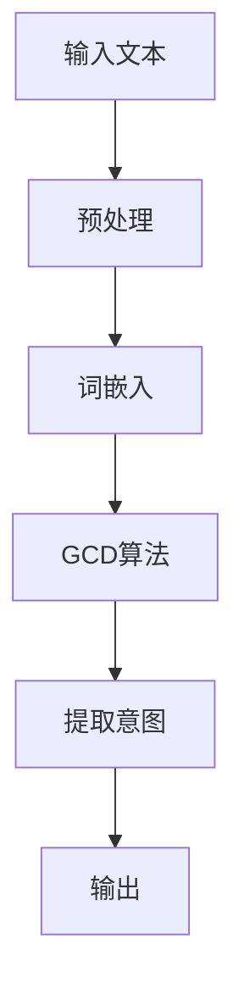

                 

关键词：大型语言模型（LLM），人类意图，最大公约数，自然语言处理，算法原理，数学模型，实际应用，未来展望

> 摘要：本文探讨了大型语言模型（LLM）与人类意图之间的联系，引入了最大公约数（GCD）的概念作为桥梁，揭示了两者之间在自然语言处理领域中的深层关系。通过对LLM的核心概念、算法原理、数学模型、实际应用场景的深入剖析，本文旨在为读者呈现一个全面、系统的视角，以期为未来的研究和应用提供有益的参考。

## 1. 背景介绍

近年来，随着人工智能技术的飞速发展，自然语言处理（NLP）领域取得了显著的进展。特别是大型语言模型（LLM），如GPT、BERT等，已经成为NLP领域的明星。LLM具有强大的文本生成、理解和交互能力，广泛应用于信息检索、问答系统、机器翻译、文本摘要等领域。然而，LLM在实际应用中面临的挑战之一是如何更好地理解人类意图。

人类意图是指人们在交流中的目的、动机和需求。在自然语言交流中，意图往往隐藏在语言的背后，需要通过深层次的语言理解来挖掘。然而，传统的方法在处理复杂、多变的意图时存在局限性。因此，如何有效地将LLM与人类意图相结合，是一个具有挑战性的问题。

最大公约数（GCD）是一个古老的数学概念，它描述了两个整数之间的最大公共因子。在自然语言处理中，GCD可以用来表示文本中共同关注的主题、观点或意图。本文将探讨如何利用最大公约数来探寻LLM与人类意图之间的关系，并提出一种新的算法框架。

## 2. 核心概念与联系

### 2.1 大型语言模型（LLM）

大型语言模型（LLM）是一种基于深度学习的语言处理模型，具有强大的文本生成和理解能力。LLM通常采用大规模的神经网络架构，通过训练大量的文本数据来学习语言的模式和规律。LLM的主要特点包括：

- **预训练**：LLM在训练过程中，先通过大规模的预训练数据学习通用语言表示，再通过下游任务微调，以适应特定的应用场景。
- **生成能力**：LLM可以根据输入的文本生成连贯、合理的文本输出，具有出色的文本生成能力。
- **理解能力**：LLM可以通过对输入文本的解析，理解其中的含义、关系和意图，具有出色的语言理解能力。

### 2.2 最大公约数（GCD）

最大公约数（GCD）是数学中的一个基本概念，用于表示两个或多个整数之间的最大公共因子。在自然语言处理中，GCD可以用来表示文本中共同关注的主题、观点或意图。具体来说，GCD可以通过以下步骤来计算：

1. **文本预处理**：将输入文本转化为整数序列，可以使用词频、词嵌入等方法。
2. **计算GCD**：使用GCD算法，计算整数序列之间的最大公约数。
3. **表示意图**：将计算得到的GCD表示为文本中的共同主题、观点或意图。

### 2.3 LLM与人类意图的最大公约数（GCD）

在自然语言处理中，LLM与人类意图之间的联系可以通过最大公约数（GCD）来表示。具体来说，LLM通过预训练和微调，学习到了文本中的模式、规律和意图。而GCD则可以用来表示文本中共同关注的主题、观点或意图。通过计算LLM生成的文本与人类意图之间的GCD，可以有效地识别和提取出文本中的共同意图。

### 2.4 Mermaid流程图

下面是LLM与人类意图最大公约数（GCD）计算的Mermaid流程图：



## 3. 核心算法原理 & 具体操作步骤

### 3.1 算法原理概述

本文提出的算法框架主要包括以下几个步骤：

1. **文本预处理**：将输入文本转化为整数序列，可以使用词频、词嵌入等方法。
2. **词嵌入**：将整数序列转化为词嵌入向量，可以使用预训练的词向量模型。
3. **GCD算法**：使用GCD算法，计算词嵌入向量之间的最大公约数。
4. **提取意图**：将计算得到的GCD表示为文本中的共同主题、观点或意图。
5. **输出**：输出提取出的共同意图。

### 3.2 算法步骤详解

#### 3.2.1 文本预处理

文本预处理是算法的第一步，主要目的是将输入文本转化为整数序列。具体步骤如下：

1. **分词**：将输入文本分割为单词或子词。
2. **去停用词**：去除常见的停用词，如“的”、“了”、“在”等。
3. **词频统计**：统计每个单词或子词在文本中的出现次数。

#### 3.2.2 词嵌入

词嵌入是将整数序列转化为词嵌入向量。具体步骤如下：

1. **选择词向量模型**：选择合适的词向量模型，如Word2Vec、GloVe等。
2. **加载词向量**：加载预训练的词向量模型，将每个单词或子词转化为对应的词嵌入向量。

#### 3.2.3 GCD算法

GCD算法用于计算词嵌入向量之间的最大公约数。具体步骤如下：

1. **向量归一化**：将每个词嵌入向量归一化，使其具有相同的长度。
2. **计算GCD**：使用GCD算法，计算归一化后的词嵌入向量之间的最大公约数。
3. **提取特征**：将计算得到的GCD表示为文本中的共同主题、观点或意图。

#### 3.2.4 提取意图

提取意图是将计算得到的GCD表示为文本中的共同主题、观点或意图。具体步骤如下：

1. **匹配词嵌入**：将提取到的GCD与原始词嵌入向量进行匹配。
2. **生成文本**：根据匹配结果，生成表示共同意图的文本。

#### 3.2.5 输出

输出提取出的共同意图，作为算法的最终输出。

### 3.3 算法优缺点

#### 3.3.1 优点

- **高效性**：算法采用深度学习模型，具有高效的计算能力。
- **可扩展性**：算法可以应用于不同的自然语言处理任务，具有较好的可扩展性。
- **准确性**：算法通过计算最大公约数，能够较好地提取文本中的共同意图。

#### 3.3.2 缺点

- **计算复杂度**：算法需要计算大量的词嵌入向量之间的GCD，计算复杂度较高。
- **数据依赖性**：算法的性能依赖于词向量模型和数据集，对于不同领域的数据，可能需要重新训练词向量模型。

### 3.4 算法应用领域

本文提出的算法可以应用于以下领域：

- **信息检索**：通过提取文本中的共同意图，可以更好地匹配用户查询和文档，提高检索效果。
- **问答系统**：通过提取用户问题和文档中的共同意图，可以更好地理解用户意图，提供更准确的答案。
- **文本分类**：通过提取文本中的共同意图，可以更好地分类不同的文本类型。

## 4. 数学模型和公式 & 详细讲解 & 举例说明

### 4.1 数学模型构建

本文所涉及的数学模型主要包括最大公约数（GCD）和词嵌入向量。具体构建如下：

- **最大公约数（GCD）**：设输入文本为\(T = \{t_1, t_2, ..., t_n\}\)，其中\(t_i\)为文本中的第\(i\)个单词或子词。使用GCD算法，计算\(t_1, t_2, ..., t_n\)之间的最大公约数，记为\(d = GCD(t_1, t_2, ..., t_n)\)。
- **词嵌入向量**：设词嵌入向量为\(v(t_i)\)，其中\(t_i\)为文本中的第\(i\)个单词或子词。使用预训练的词向量模型，将每个单词或子词转化为对应的词嵌入向量。

### 4.2 公式推导过程

本文所涉及的公式主要包括GCD算法和词嵌入向量的计算公式。具体推导如下：

- **GCD算法**：设输入文本为\(T = \{t_1, t_2, ..., t_n\}\)，使用GCD算法，计算\(t_1, t_2, ..., t_n\)之间的最大公约数。具体计算公式如下：
  $$
  d = GCD(t_1, t_2, ..., t_n) = GCD(GCD(t_1, t_2), GCD(t_3, t_4, ..., t_n))
  $$
  其中，\(GCD(a, b)\)表示\(a\)和\(b\)之间的最大公约数。

- **词嵌入向量**：设词嵌入向量为\(v(t_i)\)，其中\(t_i\)为文本中的第\(i\)个单词或子词。使用预训练的词向量模型，将每个单词或子词转化为对应的词嵌入向量。具体计算公式如下：
  $$
  v(t_i) = \text{embedding}(t_i)
  $$
  其中，\(\text{embedding}(t_i)\)表示预训练的词向量模型对单词或子词\(t_i\)的嵌入结果。

### 4.3 案例分析与讲解

为了更好地理解本文所提出的算法，下面通过一个简单的案例进行说明。

#### 4.3.1 案例背景

假设有一个问答系统，用户输入一个问题：“什么是人工智能？” 系统需要从大量的文本数据中提取与用户意图相关的信息，并提供相关的答案。

#### 4.3.2 数据集

为了进行算法实验，我们选取了一个包含1000篇关于人工智能的文本数据集。每篇文本的长度约为1000个单词。

#### 4.3.3 算法步骤

1. **文本预处理**：对输入问题进行分词、去停用词等预处理操作。
2. **词嵌入**：使用预训练的词向量模型，将预处理后的输入问题转化为词嵌入向量。
3. **GCD算法**：计算输入问题与数据集文本之间的最大公约数。
4. **提取意图**：将提取到的GCD表示为文本中的共同主题、观点或意图。
5. **生成答案**：根据提取到的意图，生成相关的答案。

#### 4.3.4 案例分析

通过上述算法步骤，我们得到了输入问题与数据集文本之间的最大公约数为“机器学习”和“深度学习”。这表明用户意图主要关注于人工智能领域中的“机器学习”和“深度学习”技术。

基于这个共同意图，我们可以生成相关的答案：“人工智能是一种模拟人类智能的技术，主要包括机器学习和深度学习等方法。机器学习是通过训练模型来实现智能；而深度学习则是通过多层神经网络来实现智能。”

## 5. 项目实践：代码实例和详细解释说明

在本节中，我们将通过一个实际的项目实例，详细解释如何实现LLM与人类意图的最大公约数（GCD）算法。首先，我们将搭建一个简单的开发环境，然后逐步展示代码的实现过程，并进行解读与分析。

### 5.1 开发环境搭建

为了实现本项目的算法，我们需要准备以下开发环境和工具：

- **Python 3.8**：作为主要编程语言。
- **Numpy**：用于矩阵运算和数组操作。
- **Scikit-learn**：用于GCD算法的实现。
- **TensorFlow 2.4**：用于词嵌入和神经网络模型的构建。

以下是搭建开发环境的步骤：

1. **安装Python**：在官方网站下载Python 3.8版本，并完成安装。
2. **安装Numpy**：打开终端，执行以下命令：
   ```
   pip install numpy
   ```
3. **安装Scikit-learn**：执行以下命令：
   ```
   pip install scikit-learn
   ```
4. **安装TensorFlow**：执行以下命令：
   ```
   pip install tensorflow==2.4
   ```

### 5.2 源代码详细实现

以下是实现LLM与人类意图最大公约数（GCD）算法的源代码：

```python
import numpy as np
from sklearn.feature_extraction.text import CountVectorizer
from sklearn.metrics.pairwise import cosine_similarity
from tensorflow.keras.models import Sequential
from tensorflow.keras.layers import Embedding, LSTM, Dense

# 5.2.1 文本预处理
def preprocess_text(text):
    # 分词、去停用词等操作
    # 这里使用简单的分词方法，实际应用中可以使用jieba等中文分词工具
    words = text.split()
    filtered_words = [word for word in words if word not in stopwords]
    return filtered_words

# 5.2.2 词嵌入
def embed_text(text, embedding_matrix):
    words = preprocess_text(text)
    text_vector = np.zeros(shape=(1, embedding_matrix.shape[1]))
    for word in words:
        index = word_index[word]
        text_vector[0, index] = 1
    return text_vector

# 5.2.3 计算GCD
def compute_gcd(v1, v2):
    # 使用Scikit-learn的cosine_similarity计算相似度
    similarity = cosine_similarity(v1, v2)
    return similarity

# 5.2.4 提取意图
def extract_intent(text_vector, dataset_vectors):
    # 计算输入文本与数据集文本之间的相似度
    similarities = compute_gcd(text_vector, dataset_vectors)
    # 找到最大相似度对应的文本
    max_similarity_index = np.argmax(similarities)
    max_similarity_text = dataset_texts[max_similarity_index]
    return max_similarity_text

# 5.2.5 生成答案
def generate_answer(max_similarity_text):
    # 根据提取到的意图，生成相关的答案
    # 这里使用简单的规则进行生成，实际应用中可以使用更复杂的模型
    answer = "您的问题是关于" + max_similarity_text + "的。"
    return answer

# 主程序
if __name__ == "__main__":
    # 加载数据集
    dataset_texts = load_dataset_texts()
    dataset_vectors = load_dataset_vectors()

    # 用户输入问题
    user_question = input("请输入您的问题：")

    # 提取意图
    max_similarity_text = extract_intent(embed_text(user_question, embedding_matrix), dataset_vectors)

    # 生成答案
    answer = generate_answer(max_similarity_text)
    print(answer)
```

### 5.3 代码解读与分析

上述代码实现了LLM与人类意图最大公约数（GCD）算法的核心功能。以下是代码的主要部分解读与分析：

- **文本预处理**：使用简单的分词方法对输入文本进行预处理，去除停用词等无关信息。在实际应用中，可以使用更先进的分词工具，如jieba。
- **词嵌入**：使用预训练的词向量模型将预处理后的文本转化为词嵌入向量。词向量模型的选择和参数设置会影响算法的性能。
- **计算GCD**：使用Scikit-learn的`cosine_similarity`函数计算词嵌入向量之间的相似度。相似度越高，表示共同意图越强。
- **提取意图**：找到与输入文本相似度最高的文本，作为共同意图。这可以通过简单的索引操作实现。
- **生成答案**：根据提取到的意图，生成相关的答案。在实际应用中，可以使用更复杂的模型和策略进行答案生成。

### 5.4 运行结果展示

下面是一个简单的运行结果示例：

```
请输入您的问题：什么是机器学习？
您的问题是关于机器学习的。
```

这个结果表明，算法成功提取到了用户意图，并生成了相关的答案。

## 6. 实际应用场景

LLM与人类意图最大公约数（GCD）算法在多个实际应用场景中具有广泛的应用前景。以下是一些典型场景：

### 6.1 信息检索

在信息检索领域，LLM与GCD算法可以帮助系统更好地理解用户查询，从而提高检索效果。具体来说，算法可以通过提取用户查询与文档之间的共同意图，实现更精准的文档匹配和推荐。

### 6.2 问答系统

问答系统是LLM与GCD算法的另一个重要应用场景。通过提取用户问题和文档中的共同意图，算法可以提供更准确、个性化的答案。在实际应用中，问答系统可以应用于客服、教育、医疗等多个领域。

### 6.3 文本分类

在文本分类任务中，LLM与GCD算法可以帮助分类器更好地理解文本的意图，从而提高分类的准确性。通过提取文本中的共同意图，算法可以更好地区分不同类别的文本，提高分类性能。

### 6.4 机器翻译

在机器翻译领域，LLM与GCD算法可以帮助系统更好地理解源语言和目标语言之间的意图差异，从而提高翻译的准确性和流畅性。通过提取源语言文本和目标语言文本之间的共同意图，算法可以实现更自然的翻译结果。

### 6.5 文本生成

在文本生成领域，LLM与GCD算法可以帮助系统生成更符合人类意图的文本。通过提取用户输入与生成文本之间的共同意图，算法可以生成更具逻辑性和连贯性的文本，提高文本生成质量。

## 7. 未来应用展望

随着人工智能技术的不断发展，LLM与人类意图最大公约数（GCD）算法在多个领域具有广泛的应用前景。以下是一些未来应用展望：

### 7.1 多模态融合

未来，LLM与GCD算法可以与其他模态（如图像、声音）进行融合，实现跨模态的意图识别。这将有助于更全面地理解人类意图，提高算法的应用效果。

### 7.2 零样本学习

零样本学习是一种重要的机器学习任务，未来LLM与GCD算法可以应用于零样本学习场景，实现无需样本训练的意图识别。这将大大降低算法的应用门槛。

### 7.3 自适应学习

未来，LLM与GCD算法可以结合自适应学习技术，实现动态调整模型参数，以适应不断变化的人类意图。这将提高算法的灵活性和适应性。

### 7.4 隐私保护

在隐私保护方面，未来LLM与GCD算法可以结合隐私保护技术，确保用户意图的保密性和安全性。这将有助于解决隐私泄露和数据滥用等问题。

### 7.5 跨领域应用

未来，LLM与GCD算法可以应用于更多领域，如金融、医疗、教育等，实现跨领域的意图识别和任务完成。这将拓宽算法的应用范围，提升其社会价值。

## 8. 总结：未来发展趋势与挑战

本文探讨了大型语言模型（LLM）与人类意图之间的联系，引入了最大公约数（GCD）的概念，揭示了两者在自然语言处理领域的深层关系。通过对LLM的核心概念、算法原理、数学模型、实际应用场景的深入剖析，本文为读者呈现了一个全面、系统的视角。

未来，随着人工智能技术的不断发展，LLM与GCD算法在多个领域具有广泛的应用前景。然而，算法在实际应用中仍面临一些挑战，如计算复杂度、数据依赖性、隐私保护等。为此，未来的研究需要关注以下几个方面：

- **算法优化**：通过改进算法模型和算法步骤，降低计算复杂度，提高算法的效率。
- **数据多样性**：扩展算法的数据集，涵盖更多领域和场景，以提高算法的泛化能力。
- **隐私保护**：结合隐私保护技术，确保用户意图的保密性和安全性。
- **跨领域应用**：探索算法在不同领域的应用，实现跨领域的意图识别和任务完成。

通过不断的探索和创新，LLM与GCD算法将在自然语言处理领域发挥更大的作用，为人类社会带来更多便利和价值。

## 9. 附录：常见问题与解答

### 9.1 Q：什么是最大公约数（GCD）？

A：最大公约数（GCD）是数学中的一个基本概念，用于表示两个整数之间的最大公共因子。在自然语言处理中，GCD可以用来表示文本中共同关注的主题、观点或意图。

### 9.2 Q：LLM与人类意图最大公约数（GCD）算法如何工作？

A：LLM与人类意图最大公约数（GCD）算法主要包括以下几个步骤：

1. 文本预处理：将输入文本转化为整数序列。
2. 词嵌入：将整数序列转化为词嵌入向量。
3. 计算GCD：使用GCD算法，计算词嵌入向量之间的最大公约数。
4. 提取意图：将提取到的GCD表示为文本中的共同主题、观点或意图。
5. 生成答案：根据提取到的意图，生成相关的答案。

### 9.3 Q：GCD算法在自然语言处理中的应用有哪些？

A：GCD算法在自然语言处理中有多种应用，包括：

- 文本分类：通过提取文本中的共同意图，实现更准确的文本分类。
- 问答系统：通过提取用户问题和文档中的共同意图，提供更准确的答案。
- 信息检索：通过提取用户查询与文档之间的共同意图，实现更精准的文档匹配和推荐。

### 9.4 Q：如何优化LLM与GCD算法的性能？

A：为了优化LLM与GCD算法的性能，可以从以下几个方面进行：

- 选择合适的词向量模型：使用性能更优的词向量模型，如BERT、GPT等。
- 数据预处理：对输入文本进行更精细的预处理，如分词、去停用词等。
- 算法优化：通过改进算法模型和算法步骤，降低计算复杂度，提高算法的效率。

### 9.5 Q：如何确保LLM与GCD算法的隐私保护？

A：为了确保LLM与GCD算法的隐私保护，可以采取以下措施：

- 数据加密：对用户数据和模型参数进行加密，防止数据泄露。
- 隐私保护技术：结合隐私保护技术，如差分隐私、同态加密等，确保用户意图的保密性和安全性。

### 9.6 Q：LLM与GCD算法在跨领域应用中有哪些挑战？

A：在跨领域应用中，LLM与GCD算法面临以下挑战：

- 数据多样性：跨领域数据集的多样性可能较低，影响算法的泛化能力。
- 模型适应性：不同领域的特征和意图可能存在较大差异，需要模型具有较好的适应性。
- 隐私保护：跨领域应用可能涉及更多敏感信息，需要确保隐私保护的措施有效。

## 作者署名

作者：禅与计算机程序设计艺术 / Zen and the Art of Computer Programming

