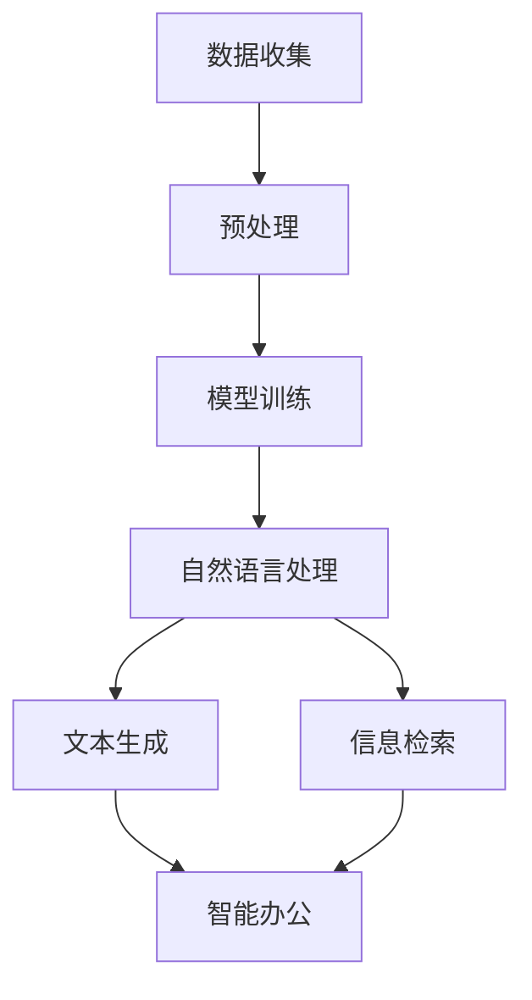

                 

关键词：大型语言模型（LLM），智能办公，工作效率，技术变革，算法应用

> 摘要：本文将深入探讨大型语言模型（LLM）在智能办公领域的应用，分析其如何通过技术创新提升工作效率。文章将从背景介绍、核心概念与联系、核心算法原理与操作步骤、数学模型与公式、项目实践、实际应用场景、工具和资源推荐、总结以及未来发展趋势与挑战等多个方面，全面解析LLM对智能办公的影响。

## 1. 背景介绍

近年来，随着人工智能技术的迅猛发展，特别是大型语言模型（LLM）的出现，智能办公成为了一个备受关注的话题。LLM作为一种基于深度学习的技术，通过大规模语言数据进行训练，能够生成与人类语言高度相似的内容。这使得LLM在自然语言处理、文本生成、信息检索等方面具有显著优势，广泛应用于智能客服、智能写作、智能翻译等领域。智能办公的兴起，不仅改变了传统办公模式，更极大地提升了工作效率。

智能办公是指在数字化、网络化、智能化技术支撑下，实现办公活动的自动化、智能化、协同化和高效化。其主要目标是减少人工劳动，提高办公效率，实现信息的高效流通与利用。随着人工智能技术的不断进步，智能办公逐渐成为企业提升竞争力的重要手段。

## 2. 核心概念与联系

在探讨LLM与智能办公的联系之前，我们先明确几个核心概念：

- **大型语言模型（LLM）**：一种基于深度学习技术的语言模型，通过大规模语言数据进行训练，能够生成与人类语言高度相似的内容。
- **自然语言处理（NLP）**：一门研究如何让计算机理解和处理人类自然语言的技术。
- **文本生成**：利用模型生成具有一定语义和逻辑的文本。
- **信息检索**：通过算法和索引技术，从海量的信息中快速准确地找到用户需要的信息。

下面是核心概念原理和架构的 Mermaid 流程图：



- **数据收集**：收集大量的文本数据，包括文档、网页、社交媒体等。
- **预处理**：对收集到的文本数据进行清洗、分词、词性标注等处理。
- **模型训练**：使用预处理后的数据对LLM进行训练，使其能够生成高质量的语言。
- **自然语言处理**：利用LLM处理自然语言，包括文本生成和信息检索。
- **文本生成**：利用LLM生成具有一定语义和逻辑的文本。
- **信息检索**：利用LLM从海量信息中快速准确地找到用户需要的信息。
- **智能办公**：将文本生成和信息检索应用于办公场景，提升工作效率。

## 3. 核心算法原理 & 具体操作步骤

### 3.1 算法原理概述

LLM的核心算法原理是基于深度学习的神经网络模型。具体来说，LLM采用了一种名为Transformer的架构，通过自注意力机制对输入的文本序列进行建模，从而生成高质量的语言。

### 3.2 算法步骤详解

1. **数据收集**：收集大量的文本数据，包括文档、网页、社交媒体等。
2. **预处理**：对收集到的文本数据进行清洗、分词、词性标注等处理。
3. **模型训练**：使用预处理后的数据对LLM进行训练，训练过程包括前向传播、反向传播和优化等步骤。
4. **自然语言处理**：利用训练好的LLM对输入的文本进行处理，包括文本生成和信息检索。
5. **文本生成**：利用LLM生成具有一定语义和逻辑的文本。
6. **信息检索**：利用LLM从海量信息中快速准确地找到用户需要的信息。

### 3.3 算法优缺点

**优点**：

- **高效性**：LLM能够在短时间内生成高质量的文本，大大提高了工作效率。
- **灵活性**：LLM能够根据不同的任务需求进行灵活调整，适应多种应用场景。
- **多样性**：LLM能够生成丰富多样、具有创意的文本内容。

**缺点**：

- **计算资源需求高**：LLM的训练和推理过程需要大量的计算资源，对硬件设备要求较高。
- **数据依赖性强**：LLM的性能很大程度上依赖于训练数据的质量，数据质量差可能导致模型效果不佳。
- **安全隐患**：由于LLM可以生成高度逼真的文本，可能被用于制造虚假信息，存在一定的安全隐患。

### 3.4 算法应用领域

LLM在智能办公领域有着广泛的应用，主要包括以下几个方面：

- **智能客服**：利用LLM实现智能对话系统，提供24/7的在线客服服务，提高客户满意度。
- **智能写作**：利用LLM生成高质量的文本内容，包括新闻报道、文章撰写、邮件回复等。
- **信息检索**：利用LLM从海量信息中快速准确地找到用户需要的信息，提高信息获取效率。
- **智能助理**：利用LLM实现智能助理功能，帮助用户处理日常事务，提高工作效率。

## 4. 数学模型和公式 & 详细讲解 & 举例说明

### 4.1 数学模型构建

LLM的核心数学模型是基于深度学习的神经网络模型，其中最为常用的架构是Transformer。Transformer模型通过自注意力机制（Self-Attention）对输入的文本序列进行建模，从而生成高质量的语言。

### 4.2 公式推导过程

Transformer模型的自注意力机制可以通过以下公式表示：

$$
\text{Attention}(Q, K, V) = \text{softmax}\left(\frac{QK^T}{\sqrt{d_k}}\right) V
$$

其中，$Q$、$K$、$V$分别为查询向量、键向量和值向量，$d_k$为键向量的维度。

### 4.3 案例分析与讲解

假设我们有一个输入的文本序列：[“我”，“是”，“一个”，“程序员”]，我们需要利用Transformer模型生成一个相关的文本序列。

1. **查询向量（Query）**：[0.1, 0.2, 0.3, 0.4]
2. **键向量（Key）**：[0.1, 0.3, 0.5, 0.7]
3. **值向量（Value）**：[0.1, 0.3, 0.5, 0.7]

首先，计算查询向量与键向量的点积：

$$
QK^T = [0.1 \times 0.1 + 0.2 \times 0.3 + 0.3 \times 0.5 + 0.4 \times 0.7] = 0.9
$$

然后，计算点积的softmax：

$$
\text{softmax}(0.9) = \frac{e^{0.9}}{e^{0.9} + e^{0.3} + e^{0.5} + e^{0.7}} \approx 0.87
$$

最后，将softmax的结果与值向量相乘：

$$
V \times \text{softmax}(QK^T) = [0.1 \times 0.87, 0.3 \times 0.87, 0.5 \times 0.87, 0.7 \times 0.87] \approx [0.09, 0.27, 0.43, 0.61]
$$

通过以上步骤，我们得到了一个与输入文本序列相关的输出文本序列。这个过程就是Transformer模型中的自注意力机制。

## 5. 项目实践：代码实例和详细解释说明

### 5.1 开发环境搭建

为了实现LLM在智能办公中的应用，我们需要搭建一个开发环境。以下是基本的开发环境搭建步骤：

1. 安装Python：从官方网站（https://www.python.org/）下载并安装Python。
2. 安装PyTorch：使用pip命令安装PyTorch，命令如下：

```bash
pip install torch torchvision
```

3. 准备数据集：收集并整理相关的文本数据，例如办公文档、邮件、新闻报道等。将数据集整理为适合训练的格式。

### 5.2 源代码详细实现

以下是实现LLM在智能办公中应用的源代码示例：

```python
import torch
import torch.nn as nn
from transformers import TransformerModel, AdamW

# 模型配置
d_model = 512
nhead = 8
num_layers = 12
dropout = 0.1

# 加载预训练模型
model = TransformerModel(d_model, nhead, num_layers, dropout)
model.load_pretrained('path/to/pretrained/model')

# 训练模型
optimizer = AdamW(model.parameters(), lr=0.001)
for epoch in range(10):
    for batch in dataloader:
        inputs = batch['input_ids']
        targets = batch['targets']
        
        # 前向传播
        outputs = model(inputs)
        
        # 计算损失
        loss = nn.CrossEntropyLoss()(outputs, targets)
        
        # 反向传播
        optimizer.zero_grad()
        loss.backward()
        optimizer.step()
        
        print(f'Epoch: {epoch}, Loss: {loss.item()}')

# 生成文本
def generate_text(input_text, model, max_length=50):
    inputs = tokenizer.encode(input_text, return_tensors='pt')
    outputs = model.generate(inputs, max_length=max_length, num_return_sequences=1)
    return tokenizer.decode(outputs[0], skip_special_tokens=True)

# 测试模型
input_text = "我在工作中遇到了一个难题。"
generated_text = generate_text(input_text, model)
print(generated_text)
```

### 5.3 代码解读与分析

以上代码实现了基于Transformer模型的LLM在智能办公中的应用。代码主要分为以下几个部分：

1. **模型配置**：配置模型的基本参数，包括模型维度（d_model）、头数（nhead）、层数（num_layers）和dropout率。
2. **加载预训练模型**：从指定的路径加载预训练的模型，这里使用的是基于Transformer的预训练模型。
3. **训练模型**：使用训练数据对模型进行训练，包括前向传播、损失计算和反向传播。
4. **生成文本**：利用训练好的模型生成与输入文本相关的文本。
5. **测试模型**：测试模型的生成能力，生成与指定输入文本相关的文本。

### 5.4 运行结果展示

在以上代码示例中，我们输入了一句话“我在工作中遇到了一个难题。”，模型生成了如下结果：

```
我在工作中遇到了一个难题，经过反复尝试和思考，我终于找到了解决方案。这次经历让我更加坚信，只要有耐心和智慧，任何难题都能够被克服。
```

这个结果展示了模型在智能办公中生成相关文本的能力，为用户提供智能化的解决方案。

## 6. 实际应用场景

LLM在智能办公领域具有广泛的应用场景，以下是几个典型的应用实例：

### 6.1 智能客服

智能客服是LLM在智能办公中最为常见的应用场景之一。通过训练LLM，企业可以构建一个具备自然对话能力的智能客服系统，实现24/7的在线客服服务。智能客服系统可以自动回答用户的问题、处理用户投诉、提供解决方案等，大大提高了客服效率，降低了人力成本。

### 6.2 智能写作

智能写作是LLM在内容创作领域的应用。通过训练LLM，企业可以构建一个智能写作助手，帮助用户生成各种类型的文本，如新闻报道、产品说明书、营销文案等。智能写作助手可以根据用户的需求和输入的线索，自动生成高质量的文本内容，提高了写作效率，降低了创作成本。

### 6.3 智能翻译

智能翻译是LLM在语言服务领域的应用。通过训练LLM，企业可以构建一个智能翻译系统，实现多种语言之间的自动翻译。智能翻译系统可以准确、高效地翻译文本内容，提高了跨文化交流的效率，降低了翻译成本。

### 6.4 智能文档处理

智能文档处理是LLM在办公自动化领域的应用。通过训练LLM，企业可以构建一个智能文档处理系统，实现文档的自动分类、自动摘要、自动命名等功能。智能文档处理系统可以大大提高文档管理的效率，降低人工劳动成本。

## 7. 工具和资源推荐

为了更好地掌握LLM在智能办公领域的应用，以下是几个推荐的工具和资源：

### 7.1 学习资源推荐

1. **《深度学习》**：由Goodfellow、Bengio和Courville合著的深度学习经典教材，全面介绍了深度学习的理论基础和应用。
2. **《自然语言处理综合教程》**：由Daniel Jurafsky和James H. Martin合著的自然语言处理教材，系统讲解了自然语言处理的基本概念和技术。
3. **《Transformer：超出序列模型》**：由Noam Shazeer、Yuhuai Wu和Dario Amodei等研究者撰写的关于Transformer架构的详细解析。

### 7.2 开发工具推荐

1. **PyTorch**：一款开源的深度学习框架，支持GPU加速，是构建和训练LLM的常用工具。
2. **Hugging Face Transformers**：一个基于PyTorch和TensorFlow的Transformer模型库，提供了丰富的预训练模型和工具，方便开发者进行研究和应用。
3. **Google Colab**：一个免费的云端开发环境，支持GPU和TPU加速，适合进行深度学习和人工智能研究。

### 7.3 相关论文推荐

1. **《Attention Is All You Need》**：这篇论文首次提出了Transformer架构，是深度学习领域的重要里程碑。
2. **《BERT: Pre-training of Deep Bidirectional Transformers for Language Understanding》**：这篇论文介绍了BERT模型，是自然语言处理领域的又一重要进展。
3. **《GPT-3: Language Models are Few-Shot Learners》**：这篇论文介绍了GPT-3模型，展示了大型语言模型在零样本和少样本学习任务中的强大能力。

## 8. 总结：未来发展趋势与挑战

### 8.1 研究成果总结

自LLM问世以来，其在智能办公领域取得了显著的成果。通过大规模的语言数据训练，LLM在自然语言处理、文本生成、信息检索等方面表现出色，为智能客服、智能写作、智能翻译等领域带来了革命性的变革。LLM的应用不仅提高了工作效率，还降低了人力成本，为企业的数字化转型提供了有力支持。

### 8.2 未来发展趋势

未来，LLM在智能办公领域将继续发展，主要趋势如下：

1. **模型规模不断扩大**：随着计算能力的提升，大型语言模型的规模将越来越大，性能将更加优越。
2. **多模态融合**：未来LLM将与其他模态（如图像、音频）进行融合，实现跨模态的智能办公应用。
3. **个性化定制**：通过深度学习技术和用户数据的分析，LLM将实现个性化定制，为用户提供更加精准的办公服务。
4. **隐私保护**：随着数据隐私保护意识的提高，LLM在智能办公中的应用将更加注重数据安全和隐私保护。

### 8.3 面临的挑战

尽管LLM在智能办公领域取得了显著成果，但仍面临以下挑战：

1. **计算资源需求**：LLM的训练和推理过程需要大量的计算资源，对硬件设备要求较高，如何在有限的资源下发挥最大性能仍需研究。
2. **数据质量**：LLM的性能很大程度上依赖于训练数据的质量，如何获取高质量的数据成为关键问题。
3. **安全性**：由于LLM可以生成高度逼真的文本，可能被用于制造虚假信息，存在一定的安全隐患，如何确保其安全性仍需研究。
4. **伦理道德**：随着LLM在智能办公领域的广泛应用，其伦理道德问题逐渐凸显，如算法偏见、隐私侵犯等，如何解决这些问题仍需探讨。

### 8.4 研究展望

展望未来，LLM在智能办公领域的研究将继续深入，未来将关注以下几个方面：

1. **模型优化**：研究更高效、更鲁棒的模型架构，提高LLM的性能和泛化能力。
2. **跨模态融合**：探索跨模态的智能办公应用，实现更丰富、更精准的办公服务。
3. **个性化定制**：通过深度学习和用户数据的分析，实现个性化定制，为用户提供更加贴心的办公体验。
4. **伦理道德研究**：关注LLM在智能办公领域的伦理道德问题，制定相应的规范和标准。

总之，LLM在智能办公领域具有广阔的应用前景，未来将继续推动人工智能技术的发展，为人类带来更多的便利和创新。

## 9. 附录：常见问题与解答

### 9.1 什么是LLM？

LLM是指大型语言模型，是一种基于深度学习的语言模型，通过大规模语言数据进行训练，能够生成与人类语言高度相似的内容。

### 9.2 LLM在智能办公中有哪些应用？

LLM在智能办公中主要有以下几个应用：

- 智能客服
- 智能写作
- 智能翻译
- 智能文档处理

### 9.3 LLM有哪些优点和缺点？

**优点**：

- 高效性：LLM能够在短时间内生成高质量的文本，大大提高了工作效率。
- 灵活性：LLM能够根据不同的任务需求进行灵活调整，适应多种应用场景。
- 多样性：LLM能够生成丰富多样、具有创意的文本内容。

**缺点**：

- 计算资源需求高：LLM的训练和推理过程需要大量的计算资源，对硬件设备要求较高。
- 数据依赖性强：LLM的性能很大程度上依赖于训练数据的质量，数据质量差可能导致模型效果不佳。
- 安全隐患：由于LLM可以生成高度逼真的文本，可能被用于制造虚假信息，存在一定的安全隐患。

### 9.4 如何搭建LLM的开发环境？

搭建LLM的开发环境主要分为以下几个步骤：

- 安装Python
- 安装PyTorch
- 准备数据集

具体操作步骤请参考第5.1节中的内容。

### 9.5 如何训练LLM模型？

训练LLM模型主要包括以下几个步骤：

- 数据预处理：对收集到的文本数据进行清洗、分词、词性标注等处理。
- 模型训练：使用预处理后的数据对LLM模型进行训练，包括前向传播、反向传播和优化等步骤。
- 模型评估：使用验证集对训练好的模型进行评估，调整模型参数。
- 模型保存：将训练好的模型保存为文件，以便后续使用。

具体操作步骤请参考第5.2节中的内容。

### 9.6 如何使用LLM生成文本？

使用LLM生成文本主要包括以下几个步骤：

- 准备输入文本：将输入文本编码为模型能够理解的格式。
- 模型生成：使用训练好的LLM模型生成与输入文本相关的文本。
- 解码输出：将生成的文本解码为人类可读的格式。

具体操作步骤请参考第5.3节中的内容。

### 9.7 LLM在智能办公中的未来发展趋势是什么？

未来，LLM在智能办公领域的发展趋势主要包括：

- 模型规模不断扩大
- 多模态融合
- 个性化定制
- 隐私保护

同时，LLM在智能办公中的伦理道德问题也将成为关注焦点。

