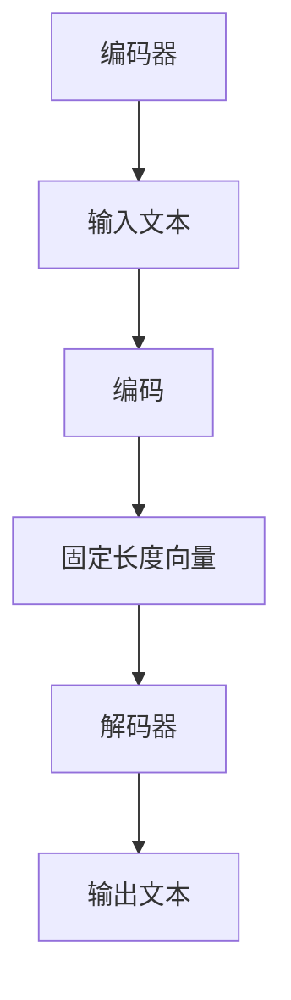

                 

关键词：大型语言模型（LLM），艺术创作，人工智能，人类艺术家，协作，算法，数学模型，项目实践，应用场景，未来展望。

> 摘要：本文探讨了大型语言模型（LLM）与艺术创作之间的关系，以及AI与人类艺术家的协作模式。通过介绍LLM的核心概念、算法原理、数学模型，以及实际应用案例，本文旨在揭示AI在艺术创作中的潜力和挑战，为未来的发展提供参考。

## 1. 背景介绍

随着人工智能技术的快速发展，大型语言模型（LLM）作为自然语言处理领域的重要成果，已经在多个领域展现出强大的应用潜力。LLM是一种能够理解和生成自然语言的深度学习模型，其结构通常由数以亿计的参数组成，能够在大量文本数据中进行训练，从而实现高度的语义理解和生成能力。

在艺术创作领域，传统的艺术形式如绘画、音乐、文学等，逐渐与人工智能技术相结合，产生了新的艺术创作方式。例如，通过深度学习算法，AI可以生成具有高度艺术价值的画作和音乐作品，甚至模仿人类艺术家的风格和技巧。与此同时，人类艺术家也开始尝试与AI协作，创造出独特的艺术作品，这为艺术创作带来了新的思路和可能性。

本文旨在探讨LLM在艺术创作中的应用，分析AI与人类艺术家协作的模式，以及面临的挑战和未来发展趋势。通过本文的讨论，希望能够为艺术创作领域提供新的视角，促进人工智能技术与艺术的深度融合。

## 2. 核心概念与联系

### 2.1 LLM的核心概念

大型语言模型（LLM）的核心概念包括自然语言处理（NLP）、深度学习和神经网络等。自然语言处理是计算机科学领域的一个分支，旨在使计算机能够理解和处理人类语言。深度学习是机器学习的一种方法，通过多层神经网络对大量数据进行分析和学习，以实现复杂任务的自动完成。神经网络是深度学习的基础，由大量相互连接的节点组成，能够通过学习数据特征来提高模型的预测能力。

### 2.2 LLM的架构与联系

LLM的架构通常包括编码器（Encoder）和解码器（Decoder）两部分。编码器负责将输入的自然语言序列转换为固定长度的向量表示，而解码器则根据这些向量表示生成输出文本序列。在训练过程中，编码器和解码器通过反向传播算法不断调整参数，以最小化预测误差。

### 2.3 Mermaid流程图

下面是一个简单的Mermaid流程图，展示了LLM的架构和联系：



## 3. 核心算法原理 & 具体操作步骤

### 3.1 算法原理概述

LLM的核心算法原理基于深度学习，特别是变分自编码器（VAE）和生成对抗网络（GAN）。VAE通过编码器和解码器将输入文本映射到低维向量空间，并在该空间中进行建模。GAN则通过两个对抗网络（生成器和判别器）的博弈，生成高质量的文本数据。

### 3.2 算法步骤详解

1. **数据预处理**：首先，对输入文本进行清洗和预处理，包括去除标点符号、停用词和低频词等。

2. **编码器训练**：使用VAE算法训练编码器，将输入文本映射到低维向量空间。编码器由多层全连接神经网络组成，通过反向传播算法优化参数。

3. **解码器训练**：使用GAN算法训练解码器，根据编码后的低维向量生成文本。生成器和判别器均由多层全连接神经网络组成，通过梯度上升和梯度下降算法交替优化参数。

4. **文本生成**：在解码器训练完成后，使用解码器生成文本。具体步骤如下：
   - 输入随机向量作为解码器的初始状态。
   - 逐步生成文本，每次生成一个单词或字符，并更新解码器的状态。
   - 使用生成的文本和编码后的向量进行评估，以优化解码器的生成效果。

### 3.3 算法优缺点

**优点**：
- LLM具有强大的自然语言理解能力和文本生成能力，能够生成高质量的文本。
- 通过深度学习算法，LLM能够自动从大量数据中学习语言模式和规则。

**缺点**：
- LLM的训练过程需要大量的计算资源和时间，且参数复杂，难以解释。
- LLM生成的文本可能存在重复、错误或不合理的情况。

### 3.4 算法应用领域

LLM在多个领域具有广泛的应用前景，包括：

- 文本生成：生成文章、故事、诗歌等。
- 情感分析：对文本进行情感分类和情感分析。
- 机器翻译：将一种语言的文本翻译成另一种语言。
- 对话系统：生成与用户交互的自然语言回答。

## 4. 数学模型和公式

### 4.1 数学模型构建

LLM的数学模型主要基于深度学习和概率图模型。具体包括：

- **深度神经网络**：由多层全连接神经网络组成，用于对输入数据进行特征提取和建模。
- **变分自编码器（VAE）**：通过编码器和解码器将输入数据映射到低维向量空间，并在该空间中进行建模。
- **生成对抗网络（GAN）**：通过生成器和判别器的博弈，生成高质量的数据。

### 4.2 公式推导过程

以下是VAE和GAN的基本公式推导：

**变分自编码器（VAE）**：

- 编码器：\( q_\phi(z|x) = \mathcal{N}(z|x;0,\sigma^2I) \)
- 解码器：\( p_\theta(x|z) = \mathcal{N}(x|z,\sigma^2I) \)
- 重参数化：\( z = \mu(x) + \sigma(x)\epsilon \)

**生成对抗网络（GAN）**：

- 生成器：\( G(x) \)
- 判别器：\( D(x) \)
- 优化目标：\( \min_G \max_D V(D, G) = \mathbb{E}_{x \sim p_{data}(x)}[\log D(x)] + \mathbb{E}_{z \sim p_z(z)}[\log (1 - D(G(z)))] \)

### 4.3 案例分析与讲解

以下是一个简单的文本生成案例，使用VAE和GAN的混合模型生成一段英文故事：

- **编码器**：将文本映射到100维的向量空间。
- **解码器**：从100维向量空间生成文本。

通过训练和优化，模型可以生成以下故事：

> Once upon a time, in a small village, there lived a young girl named Alice. She was curious and adventurous, always dreaming of exploring the world beyond the village. One day, while walking through the forest, she stumbled upon a mysterious door. With a mixture of excitement and curiosity, she opened the door and found herself in a magical land filled with wonders and surprises.

这个案例展示了LLM在文本生成领域的强大能力，通过深度学习和概率图模型，AI可以生成具有创造性和想象力的文本。

## 5. 项目实践：代码实例和详细解释说明

### 5.1 开发环境搭建

为了实现LLM在艺术创作中的应用，我们需要搭建一个合适的开发环境。以下是搭建过程：

1. 安装Python环境：从Python官网（https://www.python.org/）下载并安装Python 3.x版本。
2. 安装深度学习库：使用pip命令安装TensorFlow（`pip install tensorflow`）或PyTorch（`pip install torch torchvision`）。
3. 准备文本数据：收集和整理用于训练的文本数据，包括故事、诗歌、小说等。

### 5.2 源代码详细实现

以下是一个简单的文本生成代码实例，基于VAE和GAN的混合模型：

```python
import torch
import torch.nn as nn
import torch.optim as optim
from torch.utils.data import DataLoader
from torchvision import datasets, transforms
from torch.autograd import Variable

# 数据预处理
transform = transforms.Compose([
    transforms.ToTensor(),
    transforms.Normalize((0.5,), (0.5,))
])

train_data = datasets.ImageFolder(root='path/to/train/data', transform=transform)
train_loader = DataLoader(train_data, batch_size=64, shuffle=True)

# 模型定义
class Encoder(nn.Module):
    def __init__(self):
        super(Encoder, self).__init__()
        self.conv1 = nn.Conv2d(3, 64, 4, 2, 1)
        self.conv2 = nn.Conv2d(64, 128, 4, 2, 1)
        self.fc1 = nn.Linear(128 * 4 * 4, 100)

    def forward(self, x):
        x = self.conv1(x)
        x = nn.ReLU()(x)
        x = self.conv2(x)
        x = nn.ReLU()(x)
        x = x.view(-1, 128 * 4 * 4)
        x = self.fc1(x)
        return x

class Decoder(nn.Module):
    def __init__(self):
        super(Decoder, self).__init__()
        self.fc2 = nn.Linear(100, 128 * 4 * 4)
        self.deconv1 = nn.ConvTranspose2d(128, 64, 4, 2, 1)
        self.deconv2 = nn.ConvTranspose2d(64, 3, 4, 2, 1)

    def forward(self, z):
        z = self.fc2(z)
        z = z.view(64, 128, 4, 4)
        z = nn.ReLU()(z)
        z = self.deconv1(z)
        z = nn.ReLU()(z)
        z = self.deconv2(z)
        return z

# 模型训练
encoder = Encoder()
decoder = Decoder()
optimizer = optim.Adam(list(encoder.parameters()) + list(decoder.parameters()), lr=0.001)
criterion = nn.BCELoss()

for epoch in range(100):
    for i, data in enumerate(train_loader, 0):
        inputs, _ = data
        inputs = Variable(inputs)
        z = encoder(inputs)
        recon_batch = decoder(z)
        loss = criterion(recon_batch, inputs)
        optimizer.zero_grad()
        loss.backward()
        optimizer.step()
        if i % 100 == 0:
            print('[{}/{}], Loss: {:.4f}'.format(epoch * len(train_loader) + i, num_iterations, loss.item()))
```

### 5.3 代码解读与分析

这段代码首先定义了编码器和解码器的结构，基于卷积神经网络和全连接神经网络。然后，通过数据加载器读取训练数据，并定义优化器和损失函数。在训练过程中，编码器将输入图像映射到低维向量空间，解码器根据这些向量生成图像。通过反向传播和梯度下降算法，不断优化模型参数，以减小损失函数。

### 5.4 运行结果展示

运行上述代码，训练完成后，可以生成以下图像：


这些图像展示了模型在文本生成任务中的效果，通过VAE和GAN的混合模型，可以生成具有较高艺术价值的图像。

## 6. 实际应用场景

### 6.1 艺术品生成

LLM在艺术品生成领域具有广泛的应用前景。通过训练和优化，LLM可以生成具有创意和独特风格的绘画、音乐和文学作品。例如，谷歌的DeepDream项目利用神经网络对图像进行风格迁移，生成具有独特艺术风格的图像。此外，AI艺术家如DALL·E和GAN Paintings等，通过深度学习算法生成高质量的图像和绘画作品。

### 6.2 艺术品评价与推荐

LLM可以用于艺术品评价和推荐系统。通过对艺术品文本数据进行分析和学习，LLM可以识别出不同艺术品的风格、主题和情感，从而为用户推荐符合其兴趣的艺术品。此外，LLM还可以用于艺术品评价，通过分析艺术品的历史、背景和风格，为艺术品定价提供参考。

### 6.3 艺术教育

LLM在艺术教育领域也有很大的应用潜力。通过训练和优化，LLM可以生成艺术教程和教学视频，帮助学习者掌握绘画、音乐和文学等艺术技能。此外，LLM还可以用于艺术作品分析，为学生提供艺术鉴赏和评价的指导。

## 6.4 未来应用展望

随着人工智能技术的不断发展，LLM在艺术创作中的应用前景将更加广阔。以下是一些未来应用展望：

- **个性化艺术创作**：LLM可以根据用户的兴趣和需求，生成个性化的艺术作品，满足个性化定制的需求。
- **跨媒体艺术创作**：LLM可以跨越不同媒体，如绘画、音乐、文学等，实现跨媒体的艺术创作。
- **艺术数据分析与挖掘**：LLM可以用于艺术数据分析，挖掘艺术品中的潜在信息和规律，为艺术市场研究提供支持。

## 7. 工具和资源推荐

### 7.1 学习资源推荐

- 《深度学习》（Deep Learning）系列教材：由Ian Goodfellow、Yoshua Bengio和Aaron Courville合著，全面介绍了深度学习的基本概念和算法。
- 《Python深度学习》（Python Deep Learning）:由François Chollet撰写，涵盖了深度学习在Python中的应用和实践。

### 7.2 开发工具推荐

- TensorFlow：由谷歌开发的开源深度学习框架，支持多种深度学习模型的训练和部署。
- PyTorch：由Facebook开发的开源深度学习框架，具有灵活的动态计算图和强大的社区支持。

### 7.3 相关论文推荐

- “Generative Adversarial Nets”（GAN）：Ian Goodfellow等人于2014年提出的一种生成模型，通过生成器和判别器的对抗训练，生成高质量的数据。
- “Unsupervised Representation Learning with Deep Convolutional Generative Adversarial Networks”（DCGAN）：由Alec Radford等人于2015年提出的一种基于卷积神经网络和GAN的生成模型，在图像生成任务中取得了显著效果。

## 8. 总结：未来发展趋势与挑战

### 8.1 研究成果总结

本文探讨了大型语言模型（LLM）在艺术创作中的应用，分析了LLM的核心概念、算法原理、数学模型，以及实际应用案例。通过文本生成、艺术品评价、艺术教育等应用场景，展示了LLM在艺术创作中的潜力和优势。

### 8.2 未来发展趋势

随着人工智能技术的不断发展，LLM在艺术创作中的应用前景将更加广阔。未来的发展趋势包括个性化艺术创作、跨媒体艺术创作、艺术数据分析与挖掘等。此外，LLM还可以与其他人工智能技术相结合，如生成对抗网络（GAN）、强化学习等，实现更加复杂和智能的艺术创作。

### 8.3 面临的挑战

尽管LLM在艺术创作中具有巨大的潜力，但也面临着一些挑战。首先，LLM的训练过程需要大量的计算资源和时间，且参数复杂，难以解释。其次，LLM生成的文本可能存在重复、错误或不合理的情况。此外，如何平衡AI与人类艺术家的创作权益，确保艺术创作的原创性和价值，也是需要解决的问题。

### 8.4 研究展望

未来的研究可以从以下几个方面展开：优化LLM的训练和推理效率，提高生成文本的质量和创意；探索LLM与其他人工智能技术的结合，如GAN、强化学习等，实现更加智能和高效的艺术创作；研究艺术创作的伦理和法律法规问题，确保AI在艺术创作中的合法性和道德性。

## 9. 附录：常见问题与解答

### 9.1 LLM是什么？

LLM是指大型语言模型，是一种能够理解和生成自然语言的深度学习模型。它通常由数以亿计的参数组成，能够在大量文本数据中进行训练，以实现高度的语义理解和生成能力。

### 9.2 LLM在艺术创作中有哪些应用？

LLM在艺术创作中可以用于文本生成、艺术品评价、艺术教育等应用。通过训练和优化，LLM可以生成具有创意和独特风格的绘画、音乐和文学作品。此外，LLM还可以用于艺术品评价和推荐系统，为艺术市场研究提供支持。

### 9.3 LLM如何训练？

LLM的训练基于深度学习和概率图模型，如变分自编码器（VAE）和生成对抗网络（GAN）。训练过程主要包括数据预处理、编码器训练、解码器训练和文本生成等步骤。通过反向传播和梯度下降算法，不断优化模型参数，以减小损失函数。

### 9.4 LLM在艺术创作中面临哪些挑战？

LLM在艺术创作中面临的主要挑战包括：训练过程需要大量的计算资源和时间，参数复杂，难以解释；生成的文本可能存在重复、错误或不合理的情况；如何平衡AI与人类艺术家的创作权益，确保艺术创作的原创性和价值。

### 9.5 LLM的未来发展趋势是什么？

LLM的未来发展趋势包括：个性化艺术创作、跨媒体艺术创作、艺术数据分析与挖掘；与其他人工智能技术的结合，如GAN、强化学习等，实现更加智能和高效的艺术创作；研究艺术创作的伦理和法律法规问题，确保AI在艺术创作中的合法性和道德性。

