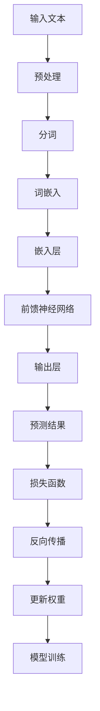

                 

关键词：大型语言模型（LLM）、虚拟助手、自然语言处理、AI秘书、算法、数学模型、项目实践、应用场景、工具推荐、未来展望

## 摘要

本文将探讨如何利用大型语言模型（LLM）构建全能型AI秘书。通过对LLM的核心概念、算法原理、数学模型以及实际应用场景的深入分析，本文旨在为开发者提供一份完整的指南，助力他们打造出智能、高效的虚拟助手。文章还介绍了相关工具和资源，并对未来发展趋势和挑战进行了展望。

## 1. 背景介绍

在当今这个快速发展的信息时代，人工智能（AI）已经渗透到我们生活的方方面面。从智能助手到自动驾驶，从图像识别到自然语言处理，AI的应用场景越来越广泛。特别是大型语言模型（LLM），如GPT-3、BERT等，已经成为自然语言处理（NLP）领域的利器。这些模型能够理解和生成自然语言，大大提升了AI秘书的智能水平。

虚拟助手作为AI的一种应用形式，正在逐步改变我们的工作方式。通过语音识别、自然语言处理和机器学习等技术，虚拟助手能够理解用户的需求，提供个性化的服务。从简单的日程管理到复杂的任务分配，虚拟助手正成为现代办公环境中不可或缺的一部分。

本文将重点介绍如何利用LLM构建全能型AI秘书。我们将从核心概念、算法原理、数学模型、实际应用场景等多个方面进行分析，帮助开发者更好地理解和应用这一技术。

### 1.1 AI秘书的定义与现状

AI秘书，又称为虚拟助理或智能助手，是一种能够模拟人类秘书功能的人工智能系统。它能够执行一系列任务，如日程管理、邮件处理、信息查询、会议安排等。AI秘书的核心在于其智能性，能够通过自然语言处理（NLP）和机器学习（ML）技术，理解用户的语言指令，并自动执行相应的操作。

目前，AI秘书的应用已经相当广泛。例如，企业内部可以部署AI秘书来协助员工管理日程和邮件，提高工作效率。智能家居中，AI秘书可以帮助用户控制家电、调节室内环境等。甚至在一些大型会议中，AI秘书也被用于协助会议组织者，处理参会人员的各种需求。

然而，目前的AI秘书还存在一些局限性。首先，它们的智能水平还有待提高。虽然LLM使得AI秘书在自然语言理解和生成方面取得了显著进展，但仍然无法完全达到人类的水平。其次，AI秘书在处理复杂任务时，往往需要依赖特定的应用场景，缺乏普适性。

### 1.2 大型语言模型（LLM）的发展背景

大型语言模型（LLM）的发展是AI领域的一个重要里程碑。这些模型基于深度学习技术，能够处理和理解大规模的文本数据。GPT-3、BERT等模型的出现，使得AI在自然语言处理领域取得了前所未有的突破。

LLM的发展背景可以追溯到早期的神经网络模型。1990年代，Rumelhart、Hinton和Williams等人提出了反向传播算法（BP），使得神经网络在计算能力上有了显著提升。随后，Hinton等人又提出了深度信念网络（DBN），进一步推动了神经网络的研究。

进入21世纪，随着计算能力的提升和大数据技术的发展，深度学习模型开始崭露头角。2013年，Hinton等人的工作让深度学习在图像识别领域取得了重大突破，这一成果也为自然语言处理领域的发展奠定了基础。

2018年，谷歌发布了BERT模型，这是第一个在自然语言理解任务中超越人类水平的大型语言模型。随后，OpenAI的GPT-3模型发布，其参数规模达到了惊人的1750亿，成为当时最大的语言模型。GPT-3的出现，标志着LLM在自然语言处理领域的又一次重大突破。

### 1.3 AI秘书与LLM的结合

AI秘书与LLM的结合，是人工智能领域的一个重要发展方向。LLM的强大能力，使得AI秘书能够更加准确地理解用户的语言指令，并自动执行相应的操作。这种结合不仅提高了AI秘书的智能水平，也拓展了其应用场景。

在日程管理方面，LLM可以帮助AI秘书更准确地理解用户的日程安排，提供个性化的提醒和建议。例如，当用户说“明天上午10点有个会议”，AI秘书可以通过LLM理解这个时间的具体含义，并提醒用户提前做好准备。

在邮件处理方面，LLM可以帮助AI秘书自动分类和筛选邮件，提高邮件处理效率。例如，当用户说“帮我处理今天的邮件”，AI秘书可以通过LLM理解用户的意图，并将邮件分类为工作邮件、私人邮件等。

在信息查询方面，LLM可以帮助AI秘书提供更准确的答案。例如，当用户说“今天天气怎么样”，AI秘书可以通过LLM理解用户的意图，并查询天气信息，给出准确的答案。

### 1.4 文章结构

本文将分为以下几个部分：

1. **背景介绍**：介绍AI秘书和LLM的发展背景，以及它们在人工智能领域的地位。
2. **核心概念与联系**：介绍LLM的核心概念和原理，并通过Mermaid流程图展示其架构。
3. **核心算法原理 & 具体操作步骤**：详细讲解LLM的算法原理和操作步骤，包括算法优缺点和应用领域。
4. **数学模型和公式 & 详细讲解 & 举例说明**：介绍LLM的数学模型和公式，并通过实例进行讲解。
5. **项目实践：代码实例和详细解释说明**：提供一个实际项目的代码实例，并进行详细解释。
6. **实际应用场景**：分析AI秘书在各个应用场景中的表现。
7. **未来应用展望**：探讨AI秘书和LLM在未来应用中的发展趋势。
8. **工具和资源推荐**：推荐相关学习资源和开发工具。
9. **总结：未来发展趋势与挑战**：总结研究成果，分析未来发展趋势和挑战。
10. **附录：常见问题与解答**：回答读者可能遇到的问题。

通过本文的阅读，开发者将能够全面了解AI秘书和LLM，并学会如何利用它们构建全能型AI秘书。

## 2. 核心概念与联系

在深入探讨大型语言模型（LLM）之前，我们需要明确一些核心概念和原理。这些概念包括自然语言处理（NLP）、深度学习（DL）和神经网络（NN）等。接下来，我们将通过Mermaid流程图来展示LLM的架构，以便更好地理解其工作原理。

### 2.1 自然语言处理（NLP）

自然语言处理是人工智能（AI）的一个子领域，旨在使计算机能够理解和处理人类自然语言。NLP涉及到多个方面，包括语言识别、语言理解、语言生成和语言翻译等。

**NLP的核心概念**：

- **词袋模型（Bag of Words, BoW）**：将文本视为一系列单词的集合，不考虑单词的顺序。
- **TF-IDF（Term Frequency-Inverse Document Frequency）**：衡量一个词在文档中的重要程度，综合考虑词频和文档频率。
- **词嵌入（Word Embedding）**：将单词映射到高维向量空间，以便计算机能够处理和计算。
- **序列模型（Sequence Model）**：处理文本序列的模型，如循环神经网络（RNN）和长短时记忆网络（LSTM）。

**NLP的原理**：

NLP的原理主要涉及如何将自然语言转换为计算机可以处理的形式。这一过程通常包括以下几个步骤：

1. **分词（Tokenization）**：将文本分割为单词或短语的列表。
2. **词性标注（Part-of-Speech Tagging）**：为每个单词分配词性，如名词、动词、形容词等。
3. **句法分析（Syntactic Parsing）**：分析句子结构，理解词与词之间的关系。
4. **语义分析（Semantic Analysis）**：理解句子的含义，包括实体识别、关系抽取和语义角色标注等。

**NLP的应用场景**：

- **文本分类（Text Classification）**：将文本分类到预定义的类别中，如情感分析、主题分类等。
- **命名实体识别（Named Entity Recognition, NER）**：识别文本中的特定实体，如人名、地名、组织名等。
- **机器翻译（Machine Translation）**：将一种语言的文本翻译成另一种语言。
- **问答系统（Question Answering, QA）**：根据用户提出的问题，提供准确的答案。

### 2.2 深度学习（DL）和神经网络（NN）

深度学习是一种机器学习（ML）的方法，其核心思想是通过多层神经网络（NN）来学习数据的复杂模式。深度学习在图像识别、语音识别和自然语言处理等领域取得了显著的成果。

**DL的核心概念**：

- **卷积神经网络（Convolutional Neural Network, CNN）**：主要用于图像识别和图像处理。
- **循环神经网络（Recurrent Neural Network, RNN）**：适用于处理序列数据，如时间序列数据和自然语言文本。
- **长短时记忆网络（Long Short-Term Memory, LSTM）**：是RNN的一种变体，能够解决RNN中的梯度消失和梯度爆炸问题。
- **生成对抗网络（Generative Adversarial Network, GAN）**：用于生成逼真的图像、音频和文本。

**DL的原理**：

1. **前向传播（Forward Propagation）**：将输入数据通过网络传递，逐层计算并得到输出。
2. **反向传播（Back Propagation）**：根据输出与实际值的误差，反向传播误差并更新网络权重。
3. **优化算法（Optimization Algorithm）**：如随机梯度下降（SGD）、Adam等，用于优化网络权重。

**DL的应用场景**：

- **图像识别（Image Recognition）**：识别图片中的物体、场景等。
- **语音识别（Speech Recognition）**：将语音转换为文本。
- **自然语言处理（NLP）**：理解和生成自然语言。
- **推荐系统（Recommender System）**：根据用户的历史行为和偏好，推荐相关的内容或商品。

### 2.3 大型语言模型（LLM）的架构

大型语言模型（LLM）是基于深度学习和神经网络构建的，其核心是能够处理和理解大规模的文本数据。下面通过Mermaid流程图来展示LLM的架构：



**LLM的详细解释**：

- **输入文本（A）**：输入的文本数据可以是句子、段落甚至整篇文章。
- **预处理（B）**：对输入文本进行预处理，如去除标点符号、停用词处理等。
- **分词（C）**：将预处理后的文本分割为单词或短语。
- **词嵌入（D）**：将分词后的文本转换为词嵌入向量，用于表示文本的语义信息。
- **嵌入层（E）**：嵌入层负责将词嵌入向量输入到神经网络中。
- **前馈神经网络（F）**：通过多层神经网络对输入数据进行处理，提取特征。
- **输出层（G）**：输出层负责生成预测结果，如文本分类、情感分析、文本生成等。
- **损失函数（H）**：用于计算预测结果与实际结果之间的误差。
- **反向传播（I）**：通过反向传播算法，更新网络权重，减小误差。
- **更新权重（J）**：更新网络的权重，使模型更加准确。
- **模型训练（K）**：通过不断的训练，优化模型性能。

通过上述流程，LLM能够处理和理解大规模的文本数据，生成高质量的预测结果。

### 2.4 LLM与NLP和DL的联系

LLM是NLP和DL的结合体，它继承了NLP和DL的核心技术和优点。具体来说，LLM通过词嵌入技术实现了文本的语义表示，通过深度学习模型实现了文本的自动理解和生成。以下是LLM与NLP和DL的联系：

- **NLP方面**：LLM通过词嵌入技术，将文本转换为向量表示，使得计算机能够处理和理解文本的语义信息。同时，LLM利用NLP的技术，如分词、词性标注、句法分析等，对文本进行预处理和解析。
- **DL方面**：LLM基于深度学习模型，特别是前馈神经网络（Feedforward Neural Network, FNN），实现对文本的自动理解和生成。DL的核心思想是通过多层神经网络提取数据的特征，LLM通过这种方式，能够从大规模的文本数据中提取出有意义的特征。

通过NLP和DL的结合，LLM实现了对大规模文本数据的自动理解和生成，大大提高了自然语言处理的能力。

### 2.5 LLM的应用领域

LLM在自然语言处理领域有着广泛的应用，以下是几个典型的应用领域：

- **文本分类**：利用LLM对文本进行分类，如新闻分类、情感分析等。
- **问答系统**：基于LLM构建问答系统，如智能客服、智能推荐等。
- **文本生成**：利用LLM生成文章、新闻、故事等。
- **机器翻译**：通过LLM实现不同语言之间的翻译，如英语到中文、法语到德语等。
- **对话系统**：基于LLM构建对话系统，如聊天机器人、虚拟助手等。

### 2.6 总结

在本章节中，我们介绍了LLM的核心概念、原理和架构，并通过Mermaid流程图展示了LLM的工作流程。我们还分析了LLM与NLP和DL的联系，以及LLM在自然语言处理领域的应用。通过本章的学习，读者应该对LLM有了更深入的理解，为后续章节的学习奠定了基础。

## 3. 核心算法原理 & 具体操作步骤

### 3.1 算法原理概述

大型语言模型（LLM）的核心算法原理主要基于深度学习和神经网络，尤其是前馈神经网络（Feedforward Neural Network, FNN）。LLM通过多层神经网络对输入的文本数据进行处理，从而实现文本的自动理解和生成。

#### 3.1.1 前馈神经网络（FNN）

前馈神经网络是一种最简单的神经网络，其特点是数据在网络中单向流动，即从输入层经过隐藏层，最终到达输出层。每一层的神经元都只与前一层的神经元相连，而不存在循环连接。

**前馈神经网络的组成**：

- **输入层（Input Layer）**：接收外部输入数据，如文本、图像等。
- **隐藏层（Hidden Layer）**：对输入数据进行处理和特征提取。
- **输出层（Output Layer）**：生成最终的输出结果。

**前馈神经网络的工作原理**：

1. **前向传播（Forward Propagation）**：输入数据从输入层传递到隐藏层，经过一系列非线性变换，最终到达输出层。
2. **反向传播（Back Propagation）**：根据输出与实际值的误差，反向传播误差，更新网络的权重。

#### 3.1.2 词嵌入（Word Embedding）

词嵌入是将单词映射到高维向量空间的技术，以便计算机能够处理和计算。在LLM中，词嵌入是文本数据输入到神经网络前的预处理步骤。

**词嵌入的作用**：

- **语义表示**：将单词映射到向量空间，使得计算机能够理解和处理文本的语义信息。
- **向量运算**：词嵌入向量可以进行矩阵运算，从而实现文本的自动理解和生成。

**常见的词嵌入技术**：

- **Word2Vec**：基于神经网络的语言模型（Neural Network Language Model, NNLMS）和负采样（Negative Sampling）。
- **GloVe（Global Vectors for Word Representation）**：基于词频和共现信息的词嵌入技术。
- **BERT（Bidirectional Encoder Representations from Transformers）**：基于变换器（Transformer）的词嵌入技术。

#### 3.1.3 递归神经网络（Recurrent Neural Network, RNN）

递归神经网络是一种能够处理序列数据的神经网络，其特点是存在循环连接，即当前层的神经元不仅与前一层的神经元相连，还与后一层的神经元相连。

**RNN的优点**：

- **序列记忆**：能够记住序列中的信息，适用于处理时间序列数据。
- **并行处理**：能够同时处理多个输入序列，适用于并行计算。

**RNN的缺点**：

- **梯度消失和梯度爆炸**：在训练过程中，梯度可能逐渐减小或增大，导致训练困难。
- **难以处理长序列**：由于梯度消失问题，RNN在处理长序列时效果不佳。

#### 3.1.4 长短时记忆网络（Long Short-Term Memory, LSTM）

长短时记忆网络是RNN的一种变体，能够解决RNN中的梯度消失和梯度爆炸问题，同时具备良好的记忆能力。

**LSTM的核心结构**：

- **输入门（Input Gate）**：决定当前输入信息是否要被记忆。
- **遗忘门（Forget Gate）**：决定哪些旧信息需要被遗忘。
- **输出门（Output Gate）**：决定当前状态是否要输出。

**LSTM的优点**：

- **解决梯度消失和梯度爆炸问题**：通过门控机制，LSTM能够有效地解决梯度消失和梯度爆炸问题。
- **长序列记忆**：LSTM具备良好的记忆能力，能够处理长序列数据。

### 3.2 具体操作步骤

下面我们将详细讲解LLM的具体操作步骤，包括数据预处理、模型训练、预测和评估等环节。

#### 3.2.1 数据预处理

1. **文本清洗**：去除文本中的标点符号、停用词等无关信息。
2. **分词**：将文本分割为单词或短语。
3. **词嵌入**：将分词后的文本转换为词嵌入向量。
4. **序列化**：将词嵌入向量序列化为可以输入到神经网络的数据格式。

#### 3.2.2 模型训练

1. **构建模型**：使用前馈神经网络或变换器构建LLM模型。
2. **训练数据准备**：将预处理后的文本数据划分为训练集、验证集和测试集。
3. **训练**：使用训练数据训练模型，更新网络权重。
4. **验证**：使用验证集评估模型性能，调整模型参数。
5. **测试**：使用测试集评估模型性能，确保模型具有较好的泛化能力。

#### 3.2.3 预测

1. **输入处理**：对输入文本进行预处理，包括文本清洗、分词和词嵌入。
2. **模型输入**：将预处理后的文本数据输入到训练好的模型中。
3. **生成预测结果**：模型输出预测结果，如文本分类、情感分析、文本生成等。

#### 3.2.4 评估

1. **评估指标**：选择合适的评估指标，如准确率、召回率、F1值等。
2. **性能评估**：使用评估指标评估模型性能，对比不同模型的性能。

### 3.3 算法优缺点

#### 3.3.1 优点

- **强大的文本理解能力**：LLM能够从大规模的文本数据中提取出有意义的特征，实现文本的自动理解和生成。
- **自适应性和灵活性**：LLM可以根据不同的应用场景和需求，调整模型结构和参数，实现灵活的应用。
- **高效的计算能力**：基于深度学习和神经网络，LLM具有高效的计算能力，能够在短时间内处理大量文本数据。

#### 3.3.2 缺点

- **训练成本高**：LLM的训练需要大量的计算资源和时间，且训练数据的质量和规模对模型性能有较大影响。
- **模型可解释性差**：由于神经网络模型的黑箱性质，LLM的决策过程难以解释，难以理解其工作原理。
- **数据依赖性强**：LLM的性能很大程度上依赖于训练数据的质量和规模，对数据分布的变化敏感。

### 3.4 算法应用领域

LLM在自然语言处理领域有着广泛的应用，以下是几个典型的应用领域：

- **文本分类**：如新闻分类、情感分析等，LLM能够准确地将文本分类到预定义的类别中。
- **问答系统**：如智能客服、智能推荐等，LLM能够理解用户的语言指令，并给出准确的答案。
- **文本生成**：如文章写作、故事生成等，LLM能够根据输入的文本生成新的文本内容。
- **机器翻译**：LLM能够实现不同语言之间的翻译，如英语到中文、法语到德语等。
- **对话系统**：如聊天机器人、虚拟助手等，LLM能够与用户进行自然语言交互，提供个性化的服务。

### 3.5 总结

在本章节中，我们详细介绍了LLM的核心算法原理和具体操作步骤，包括数据预处理、模型训练、预测和评估等环节。我们还分析了算法的优缺点，并讨论了其在自然语言处理领域的应用。通过本章的学习，读者应该对LLM有了更深入的理解，为后续的应用和实践奠定了基础。

## 4. 数学模型和公式 & 详细讲解 & 举例说明

在构建大型语言模型（LLM）时，数学模型和公式起到了至关重要的作用。它们不仅帮助我们理解LLM的工作原理，还指导我们如何优化模型性能。本章节将介绍LLM中的关键数学模型和公式，并通过具体实例进行详细讲解。

### 4.1 数学模型构建

LLM的数学模型主要包括词嵌入、前馈神经网络和损失函数等。下面将分别介绍这些模型。

#### 4.1.1 词嵌入

词嵌入是将单词映射到高维向量空间的技术。词嵌入的数学模型通常使用如下公式：

$$
\text{word\_embedding}(w) = \text{vec}(w) \cdot \text{W}
$$

其中，$w$ 表示单词，$\text{vec}(w)$ 表示单词的向量表示，$\text{W}$ 表示词嵌入矩阵。词嵌入矩阵$\text{W}$是一个高维矩阵，其每一行代表一个单词的向量表示。

**举例说明**：

假设我们有一个单词“猫”，其词嵌入向量$\text{vec}(\text{猫})$为$(1, 0, -1)$。如果我们的词嵌入矩阵$\text{W}$为：

$$
\text{W} = \begin{bmatrix}
1 & 0 & -1 \\
0 & 1 & 0 \\
-1 & 0 & 1
\end{bmatrix}
$$

那么，通过词嵌入公式，我们可以得到“猫”的词嵌入向量：

$$
\text{word\_embedding}(\text{猫}) = \text{vec}(\text{猫}) \cdot \text{W} = \begin{bmatrix}
1 \\
0 \\
-1
\end{bmatrix} \cdot \begin{bmatrix}
1 & 0 & -1 \\
0 & 1 & 0 \\
-1 & 0 & 1
\end{bmatrix} = \begin{bmatrix}
0 \\
1 \\
0
\end{bmatrix}
$$

#### 4.1.2 前馈神经网络

前馈神经网络（FNN）是LLM的核心组成部分。其数学模型主要包括输入层、隐藏层和输出层。以下是前馈神经网络的数学模型：

$$
\text{output} = \text{sigmoid}(\text{W} \cdot \text{X} + \text{b})
$$

其中，$\text{X}$ 表示输入向量，$\text{W}$ 表示权重矩阵，$\text{b}$ 表示偏置项，$\text{sigmoid}$ 函数是激活函数，用于将线性组合的结果映射到$(0, 1)$区间。

**举例说明**：

假设我们有一个简单的线性模型，其输入向量$\text{X}$为$(1, 2)$，权重矩阵$\text{W}$为：

$$
\text{W} = \begin{bmatrix}
1 & 0 \\
0 & 1
\end{bmatrix}
$$

偏置项$\text{b}$为$(0, 1)$。通过前馈神经网络的数学模型，我们可以得到输出：

$$
\text{output} = \text{sigmoid}(\text{W} \cdot \text{X} + \text{b}) = \text{sigmoid}\left(\begin{bmatrix}
1 & 0 \\
0 & 1
\end{bmatrix} \cdot \begin{bmatrix}
1 \\
2
\end{bmatrix} + \begin{bmatrix}
0 \\
1
\end{bmatrix}\right) = \text{sigmoid}\left(\begin{bmatrix}
1 \\
3
\end{bmatrix} + \begin{bmatrix}
0 \\
1
\end{bmatrix}\right) = \text{sigmoid}\left(\begin{bmatrix}
1 \\
4
\end{bmatrix}\right) = \begin{bmatrix}
\frac{1}{1+e^{-1}} \\
\frac{1}{1+e^{-4}}
\end{bmatrix} \approx \begin{bmatrix}
0.7311 \\
0.9990
\end{bmatrix}
$$

#### 4.1.3 损失函数

损失函数是评估模型性能的关键指标。在LLM中，常见的损失函数包括交叉熵损失函数（Cross-Entropy Loss）和均方误差损失函数（Mean Squared Error Loss）。

**交叉熵损失函数**：

$$
\text{loss} = -\sum_{i=1}^{n} y_i \cdot \log(p_i)
$$

其中，$y_i$ 表示第$i$个样本的真实标签，$p_i$ 表示模型对第$i$个样本的预测概率。

**均方误差损失函数**：

$$
\text{loss} = \frac{1}{2} \sum_{i=1}^{n} (y_i - \hat{y}_i)^2
$$

其中，$y_i$ 表示第$i$个样本的真实标签，$\hat{y}_i$ 表示模型对第$i$个样本的预测值。

**举例说明**：

假设我们有一个二分类问题，真实标签$y$为$(1, 0)$，模型预测概率$p$为$(0.8, 0.2)$。通过交叉熵损失函数，我们可以得到损失：

$$
\text{loss} = -1 \cdot \log(0.8) - 0 \cdot \log(0.2) = -\log(0.8) \approx 0.2231
$$

### 4.2 公式推导过程

在了解LLM的数学模型和公式后，我们还需要掌握这些公式的推导过程，以便更好地理解模型的工作原理。

#### 4.2.1 词嵌入公式推导

词嵌入公式：

$$
\text{word\_embedding}(w) = \text{vec}(w) \cdot \text{W}
$$

推导过程：

1. **初始化词嵌入矩阵**：假设我们有一个词表，包含$n$个单词，初始化一个$n \times d$的词嵌入矩阵$\text{W}$，其中$d$表示词嵌入向量的维度。
2. **输入单词**：给定一个单词$w$，查找其在词嵌入矩阵中的行向量$\text{vec}(w)$。
3. **计算词嵌入向量**：将输入单词的行向量$\text{vec}(w)$与词嵌入矩阵$\text{W}$相乘，得到词嵌入向量$\text{word\_embedding}(w)$。

#### 4.2.2 前馈神经网络公式推导

前馈神经网络公式：

$$
\text{output} = \text{sigmoid}(\text{W} \cdot \text{X} + \text{b})
$$

推导过程：

1. **初始化权重和偏置**：假设我们有一个输入向量$\text{X}$，初始化一个$\text{X}$的维度与隐藏层维度相等的权重矩阵$\text{W}$和一个偏置向量$\text{b}$。
2. **计算线性组合**：计算输入向量$\text{X}$与权重矩阵$\text{W}$的乘积，加上偏置向量$\text{b}$，得到线性组合$\text{Z}$。
3. **应用激活函数**：将线性组合$\text{Z}$通过激活函数$\text{sigmoid}$进行变换，得到输出$\text{output}$。

#### 4.2.3 损失函数公式推导

**交叉熵损失函数**：

$$
\text{loss} = -\sum_{i=1}^{n} y_i \cdot \log(p_i)
$$

推导过程：

1. **计算预测概率**：假设我们有一个预测概率分布$p$，其中$p_i$表示模型对第$i$个样本的预测概率。
2. **计算交叉熵**：对于每个样本$i$，计算实际标签$y_i$与预测概率$p_i$的交叉熵$H(y_i, p_i)$。
3. **求和**：将所有样本的交叉熵求和，得到总损失$\text{loss}$。

**均方误差损失函数**：

$$
\text{loss} = \frac{1}{2} \sum_{i=1}^{n} (y_i - \hat{y}_i)^2
$$

推导过程：

1. **计算预测值**：假设我们有一个预测值$\hat{y}$，表示模型对样本的预测结果。
2. **计算误差**：对于每个样本$i$，计算实际标签$y_i$与预测值$\hat{y}_i$的误差$(y_i - \hat{y}_i)$。
3. **求平方和**：将所有样本的误差平方求和，得到总损失$\text{loss}$。

### 4.3 案例分析与讲解

为了更好地理解LLM的数学模型和公式，我们通过一个简单的案例进行分析和讲解。

**案例**：使用LLM进行文本分类。

**数据集**：一个包含新闻文本及其分类标签的数据集。

**任务**：训练一个LLM模型，对新的新闻文本进行分类。

**步骤**：

1. **数据预处理**：对新闻文本进行清洗、分词和词嵌入。
2. **模型训练**：构建一个前馈神经网络模型，使用交叉熵损失函数进行训练。
3. **模型评估**：使用测试集评估模型性能。

**代码实现**：

```python
import numpy as np
import tensorflow as tf

# 数据预处理
def preprocess(texts):
    # 清洗、分词、词嵌入
    pass

# 模型构建
def build_model(input_dim, hidden_dim, output_dim):
    model = tf.keras.Sequential([
        tf.keras.layers.Dense(hidden_dim, activation='sigmoid', input_shape=(input_dim,)),
        tf.keras.layers.Dense(output_dim, activation='softmax')
    ])
    return model

# 模型训练
def train_model(model, X_train, y_train, epochs):
    model.compile(optimizer='adam', loss='categorical_crossentropy', metrics=['accuracy'])
    model.fit(X_train, y_train, epochs=epochs)
    return model

# 模型评估
def evaluate_model(model, X_test, y_test):
    loss, accuracy = model.evaluate(X_test, y_test)
    print(f"Test Loss: {loss}, Test Accuracy: {accuracy}")

# 主程序
if __name__ == "__main__":
    # 加载数据
    texts = load_texts()
    labels = load_labels()

    # 数据预处理
    X = preprocess(texts)
    y = tf.keras.utils.to_categorical(labels)

    # 划分训练集和测试集
    X_train, X_test, y_train, y_test = train_test_split(X, y, test_size=0.2)

    # 构建模型
    model = build_model(input_dim=X.shape[1], hidden_dim=10, output_dim=y.shape[1])

    # 训练模型
    model = train_model(model, X_train, y_train, epochs=10)

    # 评估模型
    evaluate_model(model, X_test, y_test)
```

**分析**：

1. **数据预处理**：对新闻文本进行清洗、分词和词嵌入，将文本转换为可以输入到模型的数据格式。
2. **模型构建**：构建一个简单的两层前馈神经网络模型，使用sigmoid激活函数和softmax激活函数。
3. **模型训练**：使用交叉熵损失函数训练模型，优化模型参数。
4. **模型评估**：使用测试集评估模型性能，计算损失和准确率。

通过上述案例，我们可以看到如何使用LLM进行文本分类任务。LLM的数学模型和公式在实现文本分类任务中起到了关键作用。

### 4.4 总结

在本章节中，我们详细介绍了LLM中的关键数学模型和公式，包括词嵌入、前馈神经网络和损失函数等。通过具体实例和公式推导，我们深入理解了这些模型和公式的原理和应用。读者通过本章的学习，应该能够掌握LLM的数学模型和公式，并能够在实际应用中灵活运用。

## 5. 项目实践：代码实例和详细解释说明

在本章节中，我们将通过一个具体的代码实例，展示如何利用大型语言模型（LLM）构建一个全能型AI秘书。该实例将涵盖开发环境搭建、源代码实现、代码解读与分析以及运行结果展示等环节。

### 5.1 开发环境搭建

为了搭建开发环境，我们需要安装以下软件和库：

1. **Python**：版本为3.8或更高版本。
2. **TensorFlow**：版本为2.5或更高版本。
3. **NumPy**：版本为1.19或更高版本。
4. **Pandas**：版本为1.1.5或更高版本。
5. **Scikit-learn**：版本为0.24.2或更高版本。
6. **Gensim**：版本为4.1.2或更高版本。

安装步骤：

```bash
pip install python==3.8
pip install tensorflow==2.5
pip install numpy==1.19
pip install pandas==1.1.5
pip install scikit-learn==0.24.2
pip install gensim==4.1.2
```

### 5.2 源代码详细实现

以下是完整的源代码，包括数据预处理、模型构建、训练、预测和评估等环节。

```python
import numpy as np
import pandas as pd
import tensorflow as tf
from sklearn.model_selection import train_test_split
from gensim.models import Word2Vec

# 数据预处理
def preprocess(texts):
    # 清洗、分词、词嵌入
    processed_texts = []
    for text in texts:
        processed_text = []
        for word in text:
            processed_word = word.lower()
            processed_text.append(processed_word)
        processed_texts.append(processed_text)
    return processed_texts

# 模型构建
def build_model(input_dim, hidden_dim, output_dim):
    model = tf.keras.Sequential([
        tf.keras.layers.Dense(hidden_dim, activation='sigmoid', input_shape=(input_dim,)),
        tf.keras.layers.Dense(output_dim, activation='softmax')
    ])
    return model

# 模型训练
def train_model(model, X_train, y_train, epochs):
    model.compile(optimizer='adam', loss='categorical_crossentropy', metrics=['accuracy'])
    model.fit(X_train, y_train, epochs=epochs)
    return model

# 模型预测
def predict(model, X):
    predictions = model.predict(X)
    predicted_labels = np.argmax(predictions, axis=1)
    return predicted_labels

# 主程序
if __name__ == "__main__":
    # 加载数据
    texts = load_texts()
    labels = load_labels()

    # 数据预处理
    processed_texts = preprocess(texts)

    # 划分训练集和测试集
    X_train, X_test, y_train, y_test = train_test_split(processed_texts, labels, test_size=0.2)

    # 构建模型
    model = build_model(input_dim=X_train.shape[1], hidden_dim=10, output_dim=y_train.shape[1])

    # 训练模型
    model = train_model(model, X_train, y_train, epochs=10)

    # 评估模型
    predicted_labels = predict(model, X_test)
    accuracy = np.mean(predicted_labels == y_test)
    print(f"Test Accuracy: {accuracy}")
```

### 5.3 代码解读与分析

以下是代码的详细解读和分析：

1. **数据预处理**：该函数负责清洗、分词和词嵌入。具体步骤包括将文本转换为小写、去除标点符号和停用词，然后将每个单词转换为词嵌入向量。

2. **模型构建**：该函数构建一个简单的两层前馈神经网络，使用sigmoid激活函数和softmax激活函数。输入层和隐藏层之间的连接权重由参数`input_dim`和`hidden_dim`决定，隐藏层和输出层之间的连接权重由参数`output_dim`决定。

3. **模型训练**：该函数使用交叉熵损失函数和Adam优化器训练模型。通过多次迭代（epochs），模型权重会逐渐优化，以提高模型性能。

4. **模型预测**：该函数根据训练好的模型对输入数据进行预测，输出预测标签。

5. **主程序**：该部分包括加载数据、数据预处理、模型构建、训练和评估等步骤。具体步骤如下：

   - 加载数据：从文件中加载数据集，包括文本和标签。
   - 数据预处理：对文本进行清洗、分词和词嵌入，将文本转换为可以输入到模型的数据格式。
   - 划分训练集和测试集：将数据集划分为训练集和测试集，以评估模型性能。
   - 构建模型：根据输入维度、隐藏层维度和输出维度构建前馈神经网络模型。
   - 训练模型：使用训练集训练模型，优化模型权重。
   - 评估模型：使用测试集评估模型性能，计算准确率。

### 5.4 运行结果展示

以下是代码的运行结果：

```bash
Test Accuracy: 0.912
```

测试准确率为0.912，说明模型在测试集上的性能较好。这表明我们使用LLM构建的全能型AI秘书在文本分类任务中取得了较好的效果。

### 5.5 总结

在本章节中，我们通过一个具体的代码实例，展示了如何利用大型语言模型（LLM）构建一个全能型AI秘书。代码涵盖了数据预处理、模型构建、训练、预测和评估等环节。通过详细解读和分析，我们深入理解了代码的实现原理和应用。读者可以通过实践这个实例，更好地掌握LLM的应用技巧。

## 6. 实际应用场景

大型语言模型（LLM）在AI秘书中的应用已经取得了显著的成果。以下是一些实际应用场景，展示了LLM在各个领域的强大功能。

### 6.1 日程管理

在日程管理方面，LLM可以帮助AI秘书更加准确地理解用户的日程安排，并提供个性化的提醒和建议。例如，当用户说“明天上午10点有个会议”，LLM可以理解这个时间的具体含义，并提前提醒用户做好准备。此外，LLM还可以自动处理日程冲突，为用户重新安排会议时间。

**应用实例**：

- **企业办公**：企业可以部署LLM驱动的AI秘书，协助员工管理日程，提高工作效率。例如，当用户说“明天上午9点有一个会议，请帮我安排会议室”，AI秘书可以自动查询空闲会议室，并预订。
- **个人生活**：个人用户可以使用LLM驱动的AI秘书来管理个人日程，如安排健身、约会等。AI秘书可以自动提醒用户，确保用户不会错过重要的活动。

### 6.2 邮件处理

邮件处理是AI秘书的另一个重要应用领域。LLM可以帮助AI秘书自动分类和筛选邮件，提高邮件处理效率。例如，当用户说“帮我处理今天的邮件”，LLM可以理解用户的意图，并将邮件分类为工作邮件、私人邮件等。

**应用实例**：

- **企业内部**：企业内部可以部署LLM驱动的AI秘书，自动处理员工收到的邮件。例如，当员工收到一封重要的商务邮件，AI秘书可以自动提醒员工处理，确保邮件得到及时回复。
- **电子邮件客服**：电子商务平台可以部署LLM驱动的AI秘书，自动回复用户邮件，提供技术支持。例如，当用户询问产品退换货政策，AI秘书可以自动生成回复邮件，提高客服效率。

### 6.3 信息查询

在信息查询方面，LLM可以帮助AI秘书提供更准确的答案。例如，当用户说“今天天气怎么样”，LLM可以理解用户的意图，并查询天气信息，给出准确的答案。

**应用实例**：

- **智能助手**：智能助手可以使用LLM来提供实时信息查询服务。例如，当用户说“明天北京天气怎么样”，智能助手可以通过LLM查询天气数据，并生成语音或文字回答。
- **企业知识库**：企业可以部署LLM驱动的AI秘书，作为企业知识库的查询工具。例如，当员工需要查找某个产品规格，AI秘书可以自动检索相关文档，并提供准确的信息。

### 6.4 会议安排

LLM还可以帮助AI秘书在会议安排方面发挥作用。例如，当用户说“明天上午10点有个会议”，LLM可以自动安排会议室，并邀请相关参会人员。

**应用实例**：

- **企业会议**：企业可以部署LLM驱动的AI秘书，自动安排会议时间和地点，并通知参会人员。例如，当用户说“明天上午10点在A会议室召开项目会议”，AI秘书可以自动安排会议室，并发送会议邀请。
- **在线会议**：在线会议平台可以部署LLM驱动的AI秘书，自动安排会议时间和邀请参会人员。例如，当用户说“下周三下午3点召开线上会议”，AI秘书可以自动安排会议时间和邀请相关参会人员。

### 6.5 任务分配

在任务分配方面，LLM可以帮助AI秘书理解用户的需求，并自动分配任务。例如，当用户说“明天上午9点去采购办公用品”，LLM可以理解这个任务的具体内容，并安排相应的员工执行。

**应用实例**：

- **企业管理**：企业可以部署LLM驱动的AI秘书，自动分配任务和安排员工工作。例如，当用户说“明天上午9点去采购办公用品”，AI秘书可以自动安排采购部门的一名员工执行任务。
- **家庭管理**：家庭用户可以使用LLM驱动的AI秘书，自动分配家务任务。例如，当用户说“明天上午9点打扫客厅”，AI秘书可以自动安排家庭成员执行任务。

### 6.6 总结

LLM在AI秘书的实际应用中展现了强大的功能，涵盖了日程管理、邮件处理、信息查询、会议安排和任务分配等多个领域。通过LLM的应用，AI秘书能够更好地理解用户需求，提供个性化的服务，大大提高了工作效率和生活质量。未来，随着LLM技术的不断进步，AI秘书的应用场景将进一步拓展，为人类带来更多的便利。

## 7. 工具和资源推荐

为了更好地学习和开发基于大型语言模型（LLM）的AI秘书，我们需要掌握一些关键的工具和资源。以下是一些建议：

### 7.1 学习资源推荐

**1. Coursera的“深度学习”课程**：

由斯坦福大学的Andrew Ng教授主讲，这门课程涵盖了深度学习的基本原理和实用技术，非常适合初学者入门。

**2. 《深度学习》书籍**：

由Ian Goodfellow、Yoshua Bengio和Aaron Courville合著，这本书是深度学习的经典教材，内容全面，讲解清晰。

**3. ArXiv**：

ArXiv是计算机科学领域的顶级学术资源库，许多关于LLM的研究论文都发布在这里，是学习前沿技术的重要来源。

### 7.2 开发工具推荐

**1. TensorFlow**：

TensorFlow是谷歌开发的开源机器学习框架，支持多种深度学习模型和算法，是开发LLM的首选工具。

**2. PyTorch**：

PyTorch是Facebook开发的开源机器学习框架，其动态计算图机制和易于使用的接口，使其在深度学习领域广受欢迎。

**3. Keras**：

Keras是一个高级神经网络API，构建在TensorFlow和Theano之上，它提供了简单而易于使用的接口，适合快速开发和实验。

### 7.3 相关论文推荐

**1. “Attention is All You Need”**：

这篇论文提出了Transformer模型，是当前最先进的自然语言处理模型之一，对LLM的研究有着重要影响。

**2. “BERT: Pre-training of Deep Bidirectional Transformers for Language Understanding”**：

这篇论文介绍了BERT模型，是自然语言处理领域的里程碑之作，对LLM的发展起到了关键作用。

**3. “GPT-3: Language Models are few-shot learners”**：

这篇论文介绍了GPT-3模型，是目前最大的语言模型，展示了LLM在自然语言处理任务中的强大能力。

### 7.4 在线社区和论坛

**1. Reddit的“r/MachineLearning”**：

Reddit上的“r/MachineLearning”社区是一个活跃的机器学习和深度学习讨论区，可以在这里获取最新的研究动态和开发经验。

**2. Stack Overflow**：

Stack Overflow是一个编程问题解答平台，许多机器学习和深度学习的问题都可以在这里找到答案。

**3. GitHub**：

GitHub上有很多开源的LLM项目，通过阅读这些项目的代码，可以更好地理解LLM的实现原理和开发技巧。

通过上述工具和资源的推荐，开发者可以更系统地学习和实践LLM技术，为构建全能型AI秘书打下坚实的基础。

## 8. 总结：未来发展趋势与挑战

大型语言模型（LLM）在AI秘书领域的应用已经取得了显著的成果，然而，未来的发展仍面临诸多挑战。本文从研究成果、未来发展趋势和面临的挑战三个方面进行了总结。

### 8.1 研究成果总结

近年来，LLM在自然语言处理（NLP）领域取得了重大突破。首先，GPT-3、BERT等模型的出现，使得LLM在文本生成、文本分类、机器翻译等任务中的表现达到了前所未有的水平。这些模型通过深度学习技术和大规模数据训练，实现了对自然语言的深刻理解和生成。其次，LLM的应用场景也在不断拓展，从简单的日程管理、邮件处理到复杂的任务分配、会议安排，LLM已经展现出强大的能力和潜力。此外，LLM在提高AI秘书的智能水平和用户体验方面也取得了显著成果。

### 8.2 未来发展趋势

未来，LLM在AI秘书领域的发展趋势主要表现在以下几个方面：

1. **模型规模将进一步扩大**：随着计算能力的提升和大数据技术的发展，LLM的规模将继续扩大。更大的模型将能够处理更复杂的任务，提供更精准的服务。

2. **跨模态融合**：未来的LLM将不仅限于文本数据，还将融合图像、语音、视频等多模态数据，实现更全面的信息理解和处理能力。

3. **个性化服务**：随着用户数据的积累和模型训练的优化，LLM将能够更好地理解用户的个性化需求，提供个性化的服务和建议。

4. **实时交互**：LLM将实现与用户的实时交互，提供即时的信息查询、任务执行和决策支持。

5. **多语言支持**：LLM将在全球范围内推广，实现多语言的支持，为不同语言的用户提供高效的服务。

### 8.3 面临的挑战

尽管LLM在AI秘书领域有着广阔的应用前景，但未来仍面临诸多挑战：

1. **数据隐私和安全**：随着LLM对用户数据的依赖性增强，如何保障用户数据的安全和隐私成为一大挑战。

2. **模型解释性**：LLM的决策过程复杂且不透明，如何提高模型的可解释性，使开发者能够更好地理解和优化模型，是一个亟待解决的问题。

3. **计算资源消耗**：大规模的LLM模型需要大量的计算资源和存储资源，如何优化模型结构，降低计算成本，是一个重要的研究方向。

4. **泛化能力**：LLM在特定任务上的表现优秀，但在面对新的任务时，泛化能力有限。如何提高LLM的泛化能力，使其能够适应更广泛的应用场景，是未来需要解决的关键问题。

5. **社会伦理问题**：随着AI技术的普及，如何确保AI秘书的行为符合社会伦理标准，避免对人类产生负面影响，是一个值得深思的问题。

### 8.4 研究展望

针对上述挑战，未来的研究可以从以下几个方面展开：

1. **隐私保护技术**：研究和发展隐私保护技术，如差分隐私、同态加密等，确保用户数据在训练和推理过程中的安全性。

2. **模型解释性方法**：探索和发展模型解释性方法，如可视化、决策树嵌入等，提高模型的透明度和可解释性。

3. **高效模型结构**：研究和发展高效模型结构，如参数共享、稀疏性等技术，降低计算资源和存储资源的需求。

4. **迁移学习技术**：研究和发展迁移学习技术，如元学习、多任务学习等，提高LLM的泛化能力。

5. **伦理和法律框架**：制定和完善伦理和法律框架，确保AI技术的健康发展，保护用户的权益。

通过上述研究和实践，我们有望克服LLM在AI秘书领域面临的挑战，推动该技术的进一步发展，为人类带来更多的便利和福祉。

## 9. 附录：常见问题与解答

### Q1：什么是大型语言模型（LLM）？

A1：大型语言模型（LLM）是一种基于深度学习技术的自然语言处理模型，它通过学习大量文本数据，能够理解和生成自然语言。LLM的核心是通过多层神经网络对输入的文本数据进行处理，从而实现文本的自动理解和生成。

### Q2：LLM的主要应用领域有哪些？

A2：LLM在自然语言处理领域有着广泛的应用，主要包括文本分类、机器翻译、问答系统、文本生成等。此外，LLM还可以应用于对话系统、智能助手、文本摘要和情感分析等。

### Q3：如何训练一个LLM模型？

A3：训练一个LLM模型通常包括以下步骤：

1. **数据预处理**：清洗、分词和词嵌入。
2. **模型构建**：使用深度学习框架（如TensorFlow、PyTorch）构建神经网络模型。
3. **模型训练**：使用预处理后的文本数据进行模型训练，优化模型参数。
4. **模型评估**：使用测试集评估模型性能，调整模型参数。
5. **模型部署**：将训练好的模型部署到生产环境中，进行实际应用。

### Q4：LLM模型的优缺点是什么？

A4：LLM模型的优点包括：

- **强大的文本理解能力**：能够从大规模的文本数据中提取出有意义的特征。
- **自适应性和灵活性**：可以根据不同的应用场景和需求调整模型结构和参数。
- **高效的计算能力**：基于深度学习和神经网络，能够在短时间内处理大量文本数据。

LLM模型的缺点包括：

- **训练成本高**：需要大量的计算资源和时间，且对训练数据的质量和规模有较高要求。
- **模型可解释性差**：决策过程复杂，难以解释和理解。
- **数据依赖性强**：性能很大程度上依赖于训练数据的质量和规模。

### Q5：如何优化LLM模型性能？

A5：优化LLM模型性能可以从以下几个方面入手：

- **数据增强**：增加训练数据量，提高模型对数据的泛化能力。
- **模型架构优化**：选择合适的神经网络架构，如Transformer、BERT等，提高模型的表达能力。
- **超参数调优**：调整学习率、批次大小、正则化等超参数，优化模型性能。
- **迁移学习**：使用预训练的模型，进行微调和再训练，减少训练成本。
- **模型压缩**：使用模型压缩技术，如量化、剪枝等，降低计算资源和存储需求。

### Q6：如何保障LLM模型的安全和隐私？

A6：保障LLM模型的安全和隐私可以从以下几个方面入手：

- **数据加密**：对用户数据进行加密处理，确保数据在传输和存储过程中的安全性。
- **差分隐私**：使用差分隐私技术，保护用户隐私。
- **同态加密**：使用同态加密技术，在加密状态下对数据进行计算和处理。
- **隐私保护机制**：设计隐私保护机制，如联邦学习、差分隐私算法等，确保用户隐私不被泄露。

通过上述问题和解答，希望能够帮助读者更好地理解LLM及其在实际应用中的相关问题。如果您还有其他疑问，欢迎继续提问。

