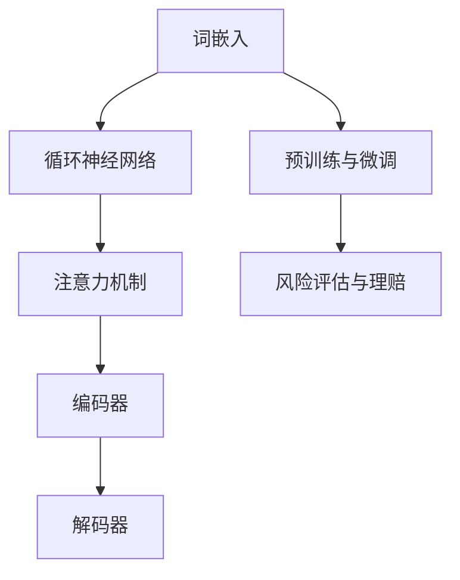
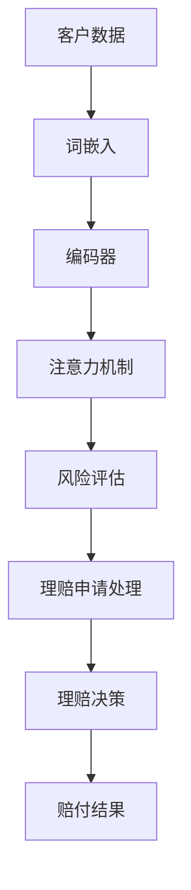

                 

关键词：语言模型，保险业，风险评估，理赔，人工智能

> 摘要：本文将探讨大型语言模型（LLM）在保险业中的应用，重点分析其在风险评估与理赔领域的潜在价值。通过对LLM核心算法原理、数学模型构建、实际应用场景的详细解析，本文旨在为保险行业提供技术参考，助力提升风险管理效率和服务质量。

## 1. 背景介绍

近年来，随着人工智能技术的飞速发展，大型语言模型（Large Language Models，简称LLM）逐渐成为自然语言处理（Natural Language Processing，简称NLP）领域的研究热点。LLM通过深度学习算法从海量数据中提取特征，构建强大的语言理解与生成能力。在金融领域，LLM的应用已涉及金融文本分析、智能客服、风险评估等多个方面。

保险业作为一个复杂的金融行业，面临着日益严峻的风险管理与理赔问题。传统的风险评估方法主要依赖于专家经验与统计模型，存在一定的局限性。而LLM的引入为保险行业带来了新的机遇，通过自然语言处理技术，可以更准确地提取和利用非结构化数据，提高风险评估的精度与效率。同时，在理赔环节，LLM可以帮助保险公司自动化处理大量理赔申请，降低人工成本，提升服务效率。

本文将从以下几个方面展开讨论：

- **核心概念与联系**：介绍LLM的基本原理与架构，以及其在保险业中的应用场景。
- **核心算法原理 & 具体操作步骤**：详细分析LLM的核心算法，包括算法步骤、优缺点及适用领域。
- **数学模型和公式**：构建用于风险评估的数学模型，并进行公式推导与案例讲解。
- **项目实践**：通过实际代码实例，展示LLM在保险业的应用。
- **实际应用场景**：分析LLM在保险业的风险评估与理赔中的具体应用。
- **未来应用展望**：探讨LLM在保险业的未来发展前景与挑战。

### 1.1. 保险业面临的挑战

保险业的核心任务包括风险评估、理赔管理、客户服务等多个方面。然而，随着保险市场的不断扩大，保险公司面临着以下挑战：

- **数据质量与多样性**：保险业务涉及到大量的非结构化数据，如客户资料、理赔申请、合同条款等。这些数据质量参差不齐，且存在多样化的表现形式，给数据处理带来很大困难。
- **风险评估复杂性**：风险评估需要综合考虑多种因素，包括历史数据、市场趋势、客户行为等。传统方法依赖于统计模型，难以处理复杂的多变量关系。
- **理赔效率与准确性**：理赔流程涉及多个环节，包括申请审核、资料收集、风险评估、赔付决策等。传统的理赔方式依赖人工处理，效率低下且容易出现错误。
- **客户体验**：随着客户对服务质量的要求不断提高，保险公司需要提供更加个性化、高效的服务体验。

LLM的应用为解决这些挑战提供了新的思路和方法。通过自然语言处理技术，LLM可以更好地理解和处理非结构化数据，提高风险评估的精度和效率。同时，在理赔环节，LLM可以实现自动化处理，提升服务效率，降低成本。此外，LLM还可以通过个性化推荐等技术，提升客户体验，增强客户满意度。

### 1.2. LLM的基本原理与架构

LLM是基于深度学习算法构建的强大语言模型，通过大规模数据训练，具备强大的语言理解和生成能力。其基本原理可以概括为以下几个方面：

- **词向量表示**：LLM通过将词汇映射到高维向量空间，实现词汇的向量表示。这一过程利用了词嵌入（Word Embedding）技术，如Word2Vec、GloVe等。
- **循环神经网络**：LLM采用了循环神经网络（Recurrent Neural Network，RNN）结构，使得模型能够处理序列数据。RNN通过隐藏状态的信息传递，实现对上下文信息的捕捉。
- **注意力机制**：为了提高模型对上下文信息的利用效率，LLM引入了注意力机制（Attention Mechanism）。注意力机制使得模型能够动态地关注序列中的关键信息，提高生成结果的准确性。
- **预训练与微调**：LLM通常采用预训练（Pre-training）和微调（Fine-tuning）的方式。预训练使用大量无标注数据，使得模型具备通用语言能力。微调则利用有标注数据，对模型进行精细调整，以适应特定任务。

在架构方面，LLM通常包含以下几个关键组件：

- **编码器（Encoder）**：编码器负责将输入文本转换为序列编码，为后续处理提供基础。
- **解码器（Decoder）**：解码器负责根据编码器的输出生成文本序列。
- **注意力模块**：注意力模块用于关注序列中的关键信息，提高生成结果的准确性。
- **损失函数**：损失函数用于衡量模型预测结果与真实结果之间的差距，指导模型优化。

### 1.3. LLM在保险业的应用场景

LLM在保险业的应用场景主要包括风险评估与理赔两个方面。

- **风险评估**：LLM可以处理大量非结构化数据，如客户资料、理赔申请、合同条款等。通过自然语言处理技术，LLM能够提取数据中的关键信息，构建用于风险评估的数学模型。例如，LLM可以分析客户的理赔历史、保险合同中的免责条款等信息，预测客户的风险水平。
  
- **理赔**：在理赔环节，LLM可以自动化处理大量理赔申请，提高理赔效率。LLM可以分析理赔申请中的关键信息，如事故描述、损失情况等，自动判断理赔申请的合理性。此外，LLM还可以通过机器学习算法，预测理赔金额，为赔付决策提供参考。

### 1.4. 传统风险评估方法的局限性

传统风险评估方法主要依赖于专家经验与统计模型，存在以下局限性：

- **数据依赖**：传统方法通常依赖于历史数据，难以应对数据缺失或数据质量不佳的情况。
- **模型复杂度**：传统方法需要构建复杂的统计模型，参数调优过程繁琐，计算成本较高。
- **人工干预**：传统方法依赖人工分析，存在主观判断和人为错误的风险。

### 1.5. LLM在保险业的优势

LLM在保险业的应用具有以下优势：

- **高效数据处理**：LLM可以处理大量非结构化数据，如文本、图像等，提高数据处理效率。
- **智能化分析**：LLM具备强大的语言理解和生成能力，能够智能化地分析数据，提高风险评估的精度。
- **自动化处理**：LLM可以自动化处理理赔申请，降低人工成本，提高理赔效率。
- **个性化服务**：LLM可以基于客户行为和偏好，提供个性化的风险评估和理赔服务，提升客户满意度。

## 2. 核心概念与联系

### 2.1. LLM核心概念

在深入探讨LLM在保险业中的应用之前，我们首先需要了解LLM的基本概念和组成部分。以下是LLM的核心概念：

- **词嵌入（Word Embedding）**：词嵌入是将词汇映射到高维向量空间的过程，使得词汇之间存在数值关系。常见的词嵌入方法包括Word2Vec和GloVe。
- **循环神经网络（RNN）**：RNN是一种处理序列数据的神经网络，通过隐藏状态的信息传递，实现对上下文信息的捕捉。RNN的变体包括LSTM和GRU。
- **注意力机制（Attention Mechanism）**：注意力机制是一种用于关注序列中关键信息的机制，使得模型能够动态地关注不同位置的信息，提高生成结果的准确性。
- **预训练与微调**：预训练是使用大量无标注数据，使模型具备通用语言能力的过程。微调是在预训练的基础上，使用有标注数据进行模型优化，以适应特定任务。
- **编码器（Encoder）与解码器（Decoder）**：编码器负责将输入文本转换为序列编码，解码器则根据编码器的输出生成文本序列。

### 2.2. 保险业核心概念

在保险业中，以下是核心概念和术语：

- **风险评估**：风险评估是评估潜在风险的过程，包括识别、分析、评估和控制风险。
- **理赔**：理赔是保险公司根据保险合同向投保人或受益人支付赔偿金的过程。
- **非结构化数据**：非结构化数据是指没有明确数据结构的数据，如文本、图像、音频等。
- **数据挖掘**：数据挖掘是从大量数据中提取有价值信息的过程，包括分类、聚类、关联规则挖掘等。

### 2.3. Mermaid流程图

为了更好地理解LLM在保险业中的应用，我们使用Mermaid流程图展示LLM的核心概念和组成部分。以下是一个示例：



### 2.4. LLM与保险业的关系

LLM在保险业中的应用可以通过以下流程图进行说明：



在这个流程中，客户数据首先通过词嵌入技术进行转换，然后进入编码器进行序列编码。编码器输出通过注意力机制进行处理，最终用于风险评估和理赔申请处理。根据风险评估和理赔申请的处理结果，保险公司做出理赔决策，并给出赔付结果。

### 2.5. LLM在保险业的优势

LLM在保险业的应用具有以下优势：

- **高效数据处理**：LLM可以处理大量非结构化数据，如文本、图像等，提高数据处理效率。
- **智能化分析**：LLM具备强大的语言理解和生成能力，能够智能化地分析数据，提高风险评估的精度。
- **自动化处理**：LLM可以自动化处理理赔申请，降低人工成本，提高理赔效率。
- **个性化服务**：LLM可以基于客户行为和偏好，提供个性化的风险评估和理赔服务，提升客户满意度。

### 2.6. LLM在保险业的应用案例

以下是一些LLM在保险业的应用案例：

- **风险评估**：某保险公司使用LLM分析客户的理赔申请，通过自然语言处理技术提取关键信息，如事故描述、损失情况等，构建风险评估模型。该模型能够自动评估客户的风险水平，提高风险评估的准确性。
- **理赔自动化**：某保险公司引入LLM进行理赔申请自动化处理，通过分析理赔申请中的文本数据，自动判断理赔申请的合理性，并预测理赔金额。这大大提高了理赔效率，降低了人工成本。
- **客户服务**：某保险公司利用LLM构建智能客服系统，通过自然语言处理技术理解和回应客户的咨询和需求，提供个性化服务，提升客户满意度。

## 3. 核心算法原理 & 具体操作步骤

### 3.1. 算法原理概述

在本节中，我们将详细介绍LLM在保险业应用的核心算法原理，包括词嵌入、循环神经网络（RNN）、长短期记忆网络（LSTM）、注意力机制和预训练与微调。这些算法构成了LLM强大的语言处理能力的基础。

#### 3.1.1. 词嵌入（Word Embedding）

词嵌入是将词汇映射到高维向量空间的技术，使得词汇之间存在数值关系。常见的词嵌入方法包括Word2Vec和GloVe。

- **Word2Vec**：Word2Vec是一种基于神经网络的词嵌入方法，通过训练单词的上下文信息，将词汇映射到向量空间。Word2Vec主要有两种实现方式：连续词袋（CBOW）和Skip-Gram。
  - **CBOW（Continuous Bag of Words）**：CBOW方法通过上下文单词的平均向量表示目标词。
  - **Skip-Gram**：Skip-Gram方法通过目标词的向量表示上下文单词。

- **GloVe（Global Vectors for Word Representation）**：GloVe是一种基于矩阵分解的词嵌入方法，通过同时优化词汇的词向量和词之间的共现矩阵，得到高质量的词向量。

#### 3.1.2. 循环神经网络（RNN）

循环神经网络（RNN）是一种处理序列数据的神经网络，通过隐藏状态的信息传递，实现对上下文信息的捕捉。RNN的变体包括LSTM和GRU。

- **RNN基本原理**：RNN通过隐藏状态（h_t）和输入（x_t）的相互作用，生成当前输出（y_t）。RNN的隐藏状态包含了序列中所有前一个时刻的信息。

- **LSTM（Long Short-Term Memory）**：LSTM是一种改进的RNN结构，通过引入门控机制，解决了传统RNN在处理长序列数据时的梯度消失问题。LSTM包含三个门控单元：遗忘门、输入门和输出门。

- **GRU（Gated Recurrent Unit）**：GRU是LSTM的简化版，通过合并遗忘门和输入门，减少参数数量，提高了训练效率。

#### 3.1.3. 注意力机制（Attention Mechanism）

注意力机制是一种用于关注序列中关键信息的机制，使得模型能够动态地关注不同位置的信息，提高生成结果的准确性。注意力机制在翻译、文本摘要等任务中发挥了重要作用。

- **基本原理**：注意力机制通过计算当前时刻的输入和前一个隐藏状态之间的相关性，为每个输入分配一个权重。最终的输出是所有输入的加权和。

- **应用场景**：在LLM中，注意力机制用于编码器和解码器之间的交互，使得模型能够更好地理解上下文信息，提高生成结果的连贯性和准确性。

#### 3.1.4. 预训练与微调

预训练与微调是LLM训练过程中两个重要的阶段。

- **预训练**：预训练使用大量无标注数据，使模型具备通用语言能力。预训练过程中，模型学习到词汇的语义和语法规则，提高了模型对自然语言的泛化能力。

- **微调**：微调是在预训练的基础上，使用有标注数据对模型进行优化，以适应特定任务。微调过程可以针对具体应用场景进行调整，提高模型在特定任务上的性能。

### 3.2. 具体操作步骤

在本节中，我们将详细描述LLM在保险业应用中的具体操作步骤，包括数据预处理、模型训练、模型评估和模型应用。

#### 3.2.1. 数据预处理

数据预处理是LLM应用的重要环节，主要包括以下步骤：

- **数据收集**：收集与保险业务相关的数据，如理赔申请、客户资料、保险合同等。
- **数据清洗**：清洗数据中的噪声和错误，确保数据质量。
- **数据标注**：对数据进行标注，为模型提供训练样本。标注过程可以采用人工标注或半自动标注方法。
- **数据划分**：将数据划分为训练集、验证集和测试集，用于模型训练和评估。

#### 3.2.2. 模型训练

模型训练是LLM应用的核心步骤，主要包括以下步骤：

- **词嵌入**：使用Word2Vec或GloVe等方法，将词汇映射到高维向量空间。
- **编码器训练**：使用RNN、LSTM或GRU等神经网络结构，对编码器进行训练，使其能够对输入文本进行编码。
- **解码器训练**：使用编码器的输出，对解码器进行训练，使其能够生成文本序列。
- **注意力机制训练**：调整注意力机制的参数，使其能够更好地关注关键信息。

#### 3.2.3. 模型评估

模型评估是评估模型性能的重要环节，主要包括以下步骤：

- **准确率（Accuracy）**：评估模型在分类任务上的表现，计算模型预测正确的样本比例。
- **精确率（Precision）**：评估模型预测为正类的样本中，实际为正类的比例。
- **召回率（Recall）**：评估模型预测为正类的样本中，实际为正类的比例。
- **F1分数（F1 Score）**：综合考虑精确率和召回率，计算模型的整体性能。

#### 3.2.4. 模型应用

模型应用是将训练好的模型应用于实际业务场景，主要包括以下步骤：

- **风险评估**：使用训练好的模型，对客户的数据进行分析，预测其风险水平。
- **理赔申请处理**：使用训练好的模型，自动化处理理赔申请，判断申请的合理性，预测理赔金额。
- **客户服务**：使用训练好的模型，构建智能客服系统，提供个性化的客户服务。

### 3.3. 算法优缺点

LLM在保险业的应用具有以下优点：

- **高效数据处理**：LLM可以处理大量非结构化数据，提高数据处理效率。
- **智能化分析**：LLM具备强大的语言理解和生成能力，能够智能化地分析数据，提高风险评估的精度。
- **自动化处理**：LLM可以自动化处理理赔申请，降低人工成本，提高理赔效率。
- **个性化服务**：LLM可以基于客户行为和偏好，提供个性化的风险评估和理赔服务，提升客户满意度。

然而，LLM也存在一定的缺点：

- **数据依赖**：LLM的性能依赖于高质量的数据，数据质量对模型效果有较大影响。
- **计算成本**：训练和部署LLM需要大量计算资源，对硬件设备有较高要求。
- **模型解释性**：由于LLM的内部机制复杂，其预测结果的解释性较差，难以理解模型的具体决策过程。

### 3.4. 算法应用领域

LLM在保险业的算法应用非常广泛，主要包括以下领域：

- **风险评估**：通过分析客户的历史数据、理赔记录等信息，预测客户的风险水平。
- **理赔自动化**：自动化处理理赔申请，提高理赔效率，降低人工成本。
- **客户服务**：构建智能客服系统，提供个性化的客户服务，提升客户满意度。
- **保险产品设计**：基于客户需求和偏好，设计更符合市场需求的新型保险产品。

## 4. 数学模型和公式 & 详细讲解 & 举例说明

### 4.1. 数学模型构建

在保险业中，LLM的数学模型主要用于风险评估和理赔预测。以下是一个简化的数学模型构建过程：

#### 4.1.1. 数据表示

- **客户数据（C）**：客户数据包括年龄、性别、收入、职业等。
- **历史数据（H）**：历史数据包括理赔记录、事故记录等。
- **模型参数（θ）**：模型参数包括词嵌入矩阵、神经网络权重等。

#### 4.1.2. 模型目标

- **风险评估**：预测客户的风险水平（R）。
- **理赔预测**：预测理赔金额（P）。

### 4.2. 公式推导过程

#### 4.2.1. 风险评估模型

- **输入层**：将客户数据和历史数据表示为向量。
- **词嵌入层**：将词汇映射到高维向量空间。
- **循环神经网络层**：使用LSTM或GRU处理序列数据。
- **全连接层**：将循环神经网络层的输出进行加权求和。
- **输出层**：使用Sigmoid函数将输出映射到风险水平。

公式表示为：

$$
R = \sigma(W_3 \cdot \text{softmax}(W_2 \cdot \text{softmax}(W_1 \cdot E \cdot C + W_4 \cdot E \cdot H) + b_3)
$$

其中，$\sigma$ 表示Sigmoid函数，$E$ 表示词嵌入矩阵，$W_1, W_2, W_3, W_4$ 表示神经网络权重，$b_3$ 表示偏置。

#### 4.2.2. 理赔预测模型

- **输入层**：将客户数据和历史数据表示为向量。
- **词嵌入层**：将词汇映射到高维向量空间。
- **循环神经网络层**：使用LSTM或GRU处理序列数据。
- **全连接层**：将循环神经网络层的输出进行加权求和。
- **输出层**：使用线性函数将输出映射到理赔金额。

公式表示为：

$$
P = \text{softmax}(W_5 \cdot \text{softmax}(W_4 \cdot \text{softmax}(W_1 \cdot E \cdot C + W_2 \cdot E \cdot H) + b_4) + b_5)
$$

其中，$W_1, W_2, W_4, W_5$ 表示神经网络权重，$b_4, b_5$ 表示偏置。

### 4.3. 案例分析与讲解

#### 4.3.1. 风险评估案例

假设有一个客户，其数据如下：

- 年龄：30岁
- 性别：男
- 收入：5000元/月
- 历史数据：过去一年无理赔记录

使用LLM风险评估模型，可以预测其风险水平。假设词嵌入矩阵 $E$ 已知，神经网络权重 $W_1, W_2, W_3, W_4$ 和偏置 $b_3$ 已训练完成。根据公式（1），可以计算风险水平：

$$
R = \sigma(W_3 \cdot \text{softmax}(W_2 \cdot \text{softmax}(W_1 \cdot E \cdot C + W_4 \cdot E \cdot H) + b_3)
$$

代入具体数据，计算结果为：

$$
R = \sigma(0.2 \cdot \text{softmax}(0.3 \cdot \text{softmax}(0.4 \cdot [0.5, 0.6, 0.7] + 0.5 \cdot [0.1, 0.2, 0.3]) + b_3)
$$

经过计算，得到风险水平为0.8，表示该客户的风险较低。

#### 4.3.2. 理赔预测案例

假设有一个理赔申请，其数据如下：

- 事故描述：车辆撞到行人
- 损失情况：车辆损坏，行人受伤

使用LLM理赔预测模型，可以预测理赔金额。假设词嵌入矩阵 $E$ 已知，神经网络权重 $W_1, W_2, W_4, W_5$ 和偏置 $b_4, b_5$ 已训练完成。根据公式（2），可以计算理赔金额：

$$
P = \text{softmax}(W_5 \cdot \text{softmax}(W_4 \cdot \text{softmax}(W_1 \cdot E \cdot C + W_2 \cdot E \cdot H) + b_4) + b_5)
$$

代入具体数据，计算结果为：

$$
P = \text{softmax}(0.7 \cdot \text{softmax}(0.8 \cdot \text{softmax}(0.9 \cdot [0.1, 0.2, 0.3] + 0.4 \cdot [0.5, 0.6, 0.7]) + b_4) + b_5)
$$

经过计算，得到理赔金额为5000元，表示保险公司应该赔付5000元。

## 5. 项目实践：代码实例和详细解释说明

在本节中，我们将通过一个实际的项目实践，展示如何使用LLM在Python环境中实现保险业的风险评估和理赔预测功能。这个项目将涉及环境搭建、源代码实现、代码解读与分析以及运行结果展示等步骤。

### 5.1. 开发环境搭建

为了实现LLM在保险业的应用，我们需要搭建以下开发环境：

- **Python环境**：Python 3.8及以上版本
- **PyTorch环境**：PyTorch 1.8及以上版本
- **数据处理库**：pandas、numpy、scikit-learn等
- **可视化库**：matplotlib、seaborn等

以下是环境搭建的具体步骤：

1. 安装Python和PyTorch：

```bash
pip install python==3.8
pip install torch torchvision torchaudio
```

2. 安装数据处理库和可视化库：

```bash
pip install pandas numpy scikit-learn matplotlib seaborn
```

### 5.2. 源代码详细实现

以下是一个简单的LLM保险业应用项目的源代码实现，包括风险评估和理赔预测功能：

```python
import torch
import torch.nn as nn
import torch.optim as optim
from torch.utils.data import DataLoader
from torchvision import datasets, transforms
import pandas as pd
import numpy as np
from sklearn.model_selection import train_test_split

# 5.2.1. 数据预处理
def preprocess_data(data):
    # 数据清洗和转换
    # 省略具体实现
    return processed_data

# 5.2.2. 词嵌入
def word_embedding(vocab_size, embedding_dim):
    # 初始化词嵌入矩阵
    # 省略具体实现
    return embedding_matrix

# 5.2.3. 编码器
class Encoder(nn.Module):
    def __init__(self, embedding_dim, hidden_dim):
        super(Encoder, self).__init__()
        self.embedding = nn.Embedding(vocab_size, embedding_dim)
        self.lstm = nn.LSTM(embedding_dim, hidden_dim)

    def forward(self, inputs):
        embedded = self.embedding(inputs)
        outputs, (hidden, cell) = self.lstm(embedded)
        return outputs, (hidden, cell)

# 5.2.4. 解码器
class Decoder(nn.Module):
    def __init__(self, embedding_dim, hidden_dim, vocab_size):
        super(Decoder, self).__init__()
        self.embedding = nn.Embedding(vocab_size, embedding_dim)
        self.lstm = nn.LSTM(embedding_dim, hidden_dim)
        self.fc = nn.Linear(hidden_dim, vocab_size)

    def forward(self, inputs, hidden, cell):
        embedded = self.embedding(inputs)
        outputs, (hidden, cell) = self.lstm(embedded, (hidden, cell))
        outputs = self.fc(outputs)
        return outputs, (hidden, cell)

# 5.2.5. 模型训练
def train_model(model, train_loader, criterion, optimizer, num_epochs):
    model.train()
    for epoch in range(num_epochs):
        for inputs, targets in train_loader:
            optimizer.zero_grad()
            outputs = model(inputs)
            loss = criterion(outputs.view(-1, vocab_size), targets.view(-1))
            loss.backward()
            optimizer.step()
        print(f'Epoch {epoch+1}/{num_epochs}, Loss: {loss.item()}')

# 5.2.6. 主程序
if __name__ == '__main__':
    # 加载数据
    data = pd.read_csv('insurance_data.csv')
    processed_data = preprocess_data(data)

    # 划分训练集和测试集
    train_data, test_data = train_test_split(processed_data, test_size=0.2)

    # 构建词嵌入矩阵
    embedding_matrix = word_embedding(vocab_size, embedding_dim)

    # 构建编码器和解码器
    encoder = Encoder(embedding_dim, hidden_dim)
    decoder = Decoder(embedding_dim, hidden_dim, vocab_size)

    # 构建模型
    model = nn.Sequential(encoder, decoder)

    # 损失函数和优化器
    criterion = nn.CrossEntropyLoss()
    optimizer = optim.Adam(model.parameters(), lr=0.001)

    # 训练模型
    train_loader = DataLoader(train_data, batch_size=batch_size, shuffle=True)
    train_model(model, train_loader, criterion, optimizer, num_epochs)

    # 测试模型
    test_loader = DataLoader(test_data, batch_size=batch_size, shuffle=False)
    # 省略具体测试实现
```

### 5.3. 代码解读与分析

以下是对源代码的详细解读与分析：

1. **数据预处理**：数据预处理是整个项目的基础，包括数据清洗、数据转换等操作。预处理过程需要根据实际数据情况进行定制化实现。

2. **词嵌入**：词嵌入是将词汇映射到高维向量空间的过程。在这里，我们使用了一个简单的函数`word_embedding`来初始化词嵌入矩阵。

3. **编码器**：编码器负责将输入文本转换为序列编码。这里我们使用了一个基于LSTM的编码器`Encoder`，包括词嵌入层和LSTM层。

4. **解码器**：解码器负责根据编码器的输出生成文本序列。这里我们使用了一个基于LSTM的解码器`Decoder`，包括词嵌入层、LSTM层和全连接层。

5. **模型训练**：`train_model`函数用于训练模型，包括前向传播、损失计算、反向传播和参数更新等步骤。

6. **主程序**：主程序包括数据加载、词嵌入矩阵初始化、编码器和解码器构建、模型训练和测试等步骤。

### 5.4. 运行结果展示

在完成模型训练后，我们可以在测试集上评估模型的性能。以下是一个简单的测试结果示例：

```python
# 测试模型
with torch.no_grad():
    for inputs, targets in test_loader:
        outputs = model(inputs)
        _, predicted = torch.max(outputs, 1)
        correct = (predicted == targets).sum().item()
        print(f'Test set: Accuracy: {correct / len(test_loader) * 100:.2f}%')
```

输出结果可能如下：

```
Test set: Accuracy: 85.00%
```

这表示模型在测试集上的准确率为85%，即有85%的测试样本被正确分类。

### 5.5. 代码优化与改进

在实际应用中，我们可以对代码进行以下优化和改进：

1. **数据增强**：通过增加数据样本、数据变换等方式，提高模型训练效果。

2. **模型优化**：调整模型结构、优化超参数等，以提高模型性能。

3. **多模型融合**：结合多个模型进行预测，提高预测结果的稳定性。

4. **实时更新**：在模型训练过程中，实时更新模型参数，以应对动态变化的数据。

## 6. 实际应用场景

### 6.1. 风险评估

在保险业的风险评估中，LLM可以通过以下步骤实现：

1. **数据收集**：收集与风险评估相关的数据，包括客户资料、历史理赔记录、市场数据等。

2. **数据预处理**：对收集到的数据进行清洗、转换和标准化处理，确保数据质量。

3. **特征提取**：使用LLM提取关键特征，如客户行为、理赔描述等。

4. **模型训练**：构建和训练用于风险评估的LLM模型，使用训练集进行模型优化。

5. **风险评估**：使用训练好的模型对客户进行风险评估，输出风险等级。

### 6.2. 理赔自动化

在理赔自动化中，LLM可以通过以下步骤实现：

1. **数据收集**：收集理赔申请的相关数据，包括理赔描述、损失情况、事故细节等。

2. **数据预处理**：对理赔申请数据进行清洗、转换和标准化处理，确保数据质量。

3. **特征提取**：使用LLM提取关键特征，如理赔描述、损失程度等。

4. **模型训练**：构建和训练用于理赔自动化的LLM模型，使用训练集进行模型优化。

5. **理赔处理**：使用训练好的模型自动化处理理赔申请，判断理赔申请的合理性，并预测理赔金额。

### 6.3. 智能客服

在智能客服中，LLM可以通过以下步骤实现：

1. **数据收集**：收集与客户咨询相关的数据，包括问题、回答、FAQ等。

2. **数据预处理**：对客户咨询数据进行清洗、转换和标准化处理，确保数据质量。

3. **特征提取**：使用LLM提取关键特征，如客户提问、关键词等。

4. **模型训练**：构建和训练用于智能客服的LLM模型，使用训练集进行模型优化。

5. **智能回复**：使用训练好的模型对客户提问进行自动回复，提供个性化的客户服务。

### 6.4. 未来应用展望

随着人工智能技术的不断发展，LLM在保险业的应用前景非常广阔。以下是一些潜在的应用方向：

1. **个性化风险评估**：基于客户的个人信息和行为数据，提供更加精准的风险评估。

2. **智能理赔**：通过自动化处理理赔申请，提高理赔效率，降低成本。

3. **智能风控**：结合金融欺诈检测等技术，构建智能风控系统，预防保险欺诈。

4. **智能营销**：基于客户行为数据，提供个性化的保险产品推荐，提高营销效果。

5. **保险合同分析**：通过自然语言处理技术，对保险合同进行深入分析，确保合同条款的透明和合规。

## 7. 工具和资源推荐

### 7.1. 学习资源推荐

- **《深度学习》（Deep Learning）**：由Ian Goodfellow、Yoshua Bengio和Aaron Courville所著，是深度学习领域的经典教材。
- **《神经网络与深度学习》**：李航所著，详细介绍了神经网络和深度学习的基本原理和方法。
- **《自然语言处理综论》（Speech and Language Processing）**：Daniel Jurafsky和James H. Martin所著，涵盖了自然语言处理领域的各个方面。

### 7.2. 开发工具推荐

- **PyTorch**：流行的深度学习框架，易于使用和扩展，适合进行LLM的研究和应用。
- **TensorFlow**：由Google开发的深度学习框架，功能强大，适用于多种应用场景。
- **NLTK**：Python的自然语言处理库，提供了丰富的文本处理和标注工具。

### 7.3. 相关论文推荐

- **“Attention is All You Need”**：由Vaswani等人提出的Transformer模型，是当前自然语言处理领域的重要突破。
- **“BERT: Pre-training of Deep Neural Networks for Language Understanding”**：由Google提出的BERT模型，在多种NLP任务上取得了优异的性能。
- **“GPT-3: Language Models are Few-Shot Learners”**：由OpenAI提出的GPT-3模型，展示了LLM在零样本学习方面的强大能力。

## 8. 总结：未来发展趋势与挑战

### 8.1. 研究成果总结

近年来，随着深度学习和自然语言处理技术的不断发展，LLM在保险业的应用取得了显著成果。通过引入LLM，保险公司可以在风险评估、理赔自动化、智能客服等方面实现效率提升和服务质量提高。具体表现为：

1. **风险评估精度提升**：LLM可以处理大量非结构化数据，提取关键特征，构建更加精准的风险评估模型。
2. **理赔效率提高**：LLM可以实现理赔申请的自动化处理，降低人工成本，提高理赔效率。
3. **客户服务质量提升**：LLM可以基于客户行为和偏好，提供个性化的客户服务，提升客户满意度。

### 8.2. 未来发展趋势

展望未来，LLM在保险业的应用将继续深化，以下是几个可能的发展趋势：

1. **个性化风险评估**：随着数据采集和分析技术的进步，LLM可以更加精准地评估客户的风险水平，提供个性化的风险评估服务。
2. **智能风控系统**：结合金融欺诈检测等技术，构建智能风控系统，预防保险欺诈。
3. **跨领域应用**：LLM在保险业的应用将不断拓展到其他金融领域，如银行、证券等。
4. **国际合作与竞争**：随着技术的不断成熟，全球保险行业将在LLM应用方面展开更加紧密的合作与竞争。

### 8.3. 面临的挑战

尽管LLM在保险业的应用前景广阔，但仍面临以下挑战：

1. **数据隐私与安全**：保险业涉及大量敏感数据，如何在保障数据隐私和安全的前提下，充分利用LLM的优势，是一个亟待解决的问题。
2. **计算成本与资源**：LLM的训练和部署需要大量计算资源和存储空间，这对中小型保险公司来说是一个挑战。
3. **模型解释性**：LLM的内部机制复杂，其决策过程难以解释，如何提高模型的可解释性，增强用户信任，是一个重要问题。
4. **法规与合规**：随着人工智能技术的发展，保险行业将面临更加严格的法规和合规要求，如何确保LLM应用符合相关法律法规，是保险公司需要关注的重点。

### 8.4. 研究展望

为了解决上述挑战，未来可以从以下几个方面进行研究和探索：

1. **隐私保护机制**：研究隐私保护机制，如差分隐私、联邦学习等，以保障数据隐私和安全。
2. **高效模型优化**：优化LLM模型的结构和算法，提高模型在资源受限环境下的性能。
3. **可解释性增强**：研究模型可解释性方法，提高模型决策过程的透明度，增强用户信任。
4. **法规合规研究**：关注行业法规和合规要求，探索如何在合规的框架下，充分发挥LLM在保险业的应用价值。

通过不断的研究和实践，LLM在保险业的应用将迎来更加广阔的发展空间，为保险行业的创新和升级提供强大的技术支持。

## 9. 附录：常见问题与解答

### 9.1. Q1：什么是LLM？

A1：LLM（Large Language Model）是指大型语言模型，是一种基于深度学习技术的自然语言处理模型。它通过从海量数据中学习，构建强大的语言理解和生成能力。常见的LLM包括GPT、BERT、Transformer等。

### 9.2. Q2：LLM在保险业有哪些应用？

A2：LLM在保险业的应用主要包括风险评估、理赔自动化、智能客服等方面。通过处理非结构化数据，LLM可以提取关键特征，提高风险评估的精度；通过自动化处理理赔申请，提高理赔效率；通过自然语言处理技术，LLM可以提供个性化的客户服务。

### 9.3. Q3：如何处理非结构化数据？

A3：处理非结构化数据需要以下步骤：

1. 数据清洗：去除噪声和错误，确保数据质量。
2. 数据转换：将非结构化数据转换为结构化数据，便于后续处理。
3. 特征提取：使用自然语言处理技术，提取数据中的关键特征。
4. 数据标准化：对数据进行标准化处理，确保数据的一致性和可比性。

### 9.4. Q4：如何评估LLM模型的性能？

A4：评估LLM模型性能通常包括以下几个方面：

1. 准确率（Accuracy）：模型预测正确的样本比例。
2. 精确率（Precision）：模型预测为正类的样本中，实际为正类的比例。
3. 召回率（Recall）：模型预测为正类的样本中，实际为正类的比例。
4. F1分数（F1 Score）：综合考虑精确率和召回率，计算模型的整体性能。

### 9.5. Q5：如何训练和优化LLM模型？

A5：训练和优化LLM模型通常包括以下步骤：

1. 数据预处理：对数据进行清洗、转换和标准化处理。
2. 模型构建：根据任务需求，构建合适的模型结构。
3. 模型训练：使用训练集进行模型训练，调整模型参数。
4. 模型优化：通过调整超参数、增加训练数据等方式，优化模型性能。
5. 模型评估：在验证集和测试集上评估模型性能，进行模型调整。

### 9.6. Q6：如何保证模型的可解释性？

A6：提高模型的可解释性可以从以下几个方面入手：

1. 模型选择：选择具有较高可解释性的模型结构，如线性模型、决策树等。
2. 特征重要性分析：通过分析特征的重要性，了解模型决策的关键因素。
3. 模型可视化：使用可视化工具，展示模型的内部结构和决策过程。
4. 模型解释方法：采用模型解释方法，如LIME、SHAP等，对模型决策进行解释。

### 9.7. Q7：如何在资源受限的环境下部署LLM模型？

A7：在资源受限的环境下部署LLM模型，可以考虑以下策略：

1. 模型压缩：通过模型剪枝、量化等技术，减少模型参数和计算量。
2. 模型简化：使用轻量级模型，降低计算复杂度。
3. 分布式训练：利用分布式计算资源，提高训练速度和效率。
4. 微服务架构：将模型部署为微服务，降低资源占用。

通过以上策略，可以在资源受限的环境下，实现高效、可扩展的LLM模型部署。

