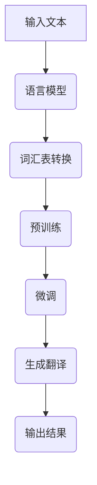

                 

关键词：大型语言模型（LLM）、多语言处理、跨语言翻译、语义理解、技术挑战、应用场景、未来展望

> 摘要：本文深入探讨了大型语言模型（LLM）在多语言处理领域取得的进展。首先，我们回顾了LLM的基本概念及其发展历程，然后详细分析了LLM在多语言处理中的核心算法原理和操作步骤。接着，我们阐述了数学模型和公式在LLM中的应用，并通过实际代码实例进行了详细解释。文章还探讨了LLM在多语言处理中的实际应用场景，并提出了未来发展的展望。

## 1. 背景介绍

### 1.1 大型语言模型的基本概念

大型语言模型（Large Language Model，简称LLM）是一类具有强大语言理解和生成能力的深度学习模型。LLM通过训练大量的文本数据，学习语言中的语法、语义和上下文信息，从而实现文本生成、翻译、摘要、问答等多种语言处理任务。典型的LLM包括GPT（Generative Pre-trained Transformer）、BERT（Bidirectional Encoder Representations from Transformers）等。

### 1.2 LLM的发展历程

LLM的发展历程可以分为三个阶段：

1. **基于规则的方法**：早期的语言模型主要依赖于手工编写的语法规则和词典。这种方法虽然具有一定的灵活性，但难以应对复杂和多样化的语言现象。

2. **统计机器学习方法**：随着机器学习技术的发展，统计机器学习方法逐渐应用于语言模型。这些方法通过分析大量文本数据，自动提取语言特征，实现一定的语言理解能力。代表性的模型有N-gram模型、隐马尔可夫模型（HMM）等。

3. **深度学习方法**：近年来，深度学习技术取得了突破性进展。基于深度学习的语言模型，如GPT和BERT，通过大规模预训练和微调，在多个语言处理任务上取得了显著性能提升。

### 1.3 多语言处理的重要性

多语言处理是指在不同的语言之间进行信息转换和处理的能力。在全球化的背景下，跨语言沟通和交流变得越来越重要。多语言处理不仅有助于消除语言障碍，促进文化交流，还为商业、教育、医疗等领域提供了丰富的应用价值。随着互联网和移动设备的普及，多语言处理的需求也日益增长。

## 2. 核心概念与联系

为了更好地理解LLM在多语言处理中的作用，我们需要先介绍几个核心概念：

### 2.1 语言模型

语言模型是预测下一个词或字符的概率分布的模型。在LLM中，语言模型通常采用深度神经网络结构，如Transformer、循环神经网络（RNN）等。

### 2.2 跨语言翻译

跨语言翻译是指将一种语言的表达转换为另一种语言的过程。LLM在跨语言翻译中起到了至关重要的作用，通过学习双语语料库，LLM能够生成高质量的翻译结果。

### 2.3 语义理解

语义理解是指对语言表达的含义进行理解和解释。LLM通过预训练和微调，能够捕捉到语言中的语义信息，从而实现文本分类、情感分析等任务。

### 2.4 Mermaid 流程图

下面是一个简单的Mermaid流程图，展示了LLM在多语言处理中的基本流程：



## 3. 核心算法原理 & 具体操作步骤

### 3.1 算法原理概述

LLM在多语言处理中的核心算法原理主要包括预训练、微调和生成。预训练阶段，LLM通过大量无标签文本数据学习语言特征；微调阶段，LLM根据特定任务进行优化；生成阶段，LLM根据输入文本生成目标语言的翻译或摘要。

### 3.2 算法步骤详解

#### 3.2.1 预训练

预训练阶段，LLM采用自回归语言模型（Autoregressive Language Model）进行训练。具体步骤如下：

1. **输入文本**：从大量无标签文本数据中随机抽取一段文本，将其输入到LLM中。
2. **编码器解码器**：LLM中的编码器将文本转换为固定长度的向量表示，解码器根据编码器输出的向量生成下一个词或字符的概率分布。
3. **损失函数**：通过计算预测的概率分布与真实分布之间的差异，更新模型参数，最小化损失函数。

#### 3.2.2 微调

微调阶段，LLM根据特定任务进行优化。具体步骤如下：

1. **任务定义**：定义任务的目标和评价指标，如翻译准确率、文本分类准确率等。
2. **数据集准备**：从相关数据集中抽取训练数据和测试数据。
3. **模型优化**：在训练数据上迭代优化LLM的参数，使用梯度下降等方法更新模型参数。
4. **评估与调整**：在测试数据上评估模型性能，根据评估结果调整模型参数。

#### 3.2.3 生成

生成阶段，LLM根据输入文本生成目标语言的翻译或摘要。具体步骤如下：

1. **输入文本**：输入待翻译或摘要的文本。
2. **编码器解码器**：编码器将输入文本转换为向量表示，解码器根据向量表示生成目标语言的文本。
3. **文本生成**：解码器根据生成的文本概率分布，逐词或逐字符地生成目标语言的文本。
4. **输出结果**：将生成的文本输出，作为翻译或摘要的结果。

### 3.3 算法优缺点

#### 优点：

1. **强大的语言理解能力**：LLM通过预训练和微调，能够捕捉到语言中的各种语义和上下文信息，实现高质量的语言生成和翻译。
2. **多任务学习能力**：LLM可以应用于多种语言处理任务，如文本分类、情感分析、问答系统等。
3. **自适应能力**：LLM可以根据不同的任务和数据集进行微调，适应不同的应用场景。

#### 缺点：

1. **计算资源需求高**：LLM的训练和推理过程需要大量的计算资源，对硬件设备要求较高。
2. **数据依赖性强**：LLM的性能高度依赖于训练数据的质量和数量，数据质量差可能导致模型性能下降。
3. **解释性差**：LLM的内部机制复杂，难以直观地解释模型的决策过程。

### 3.4 算法应用领域

LLM在多语言处理领域的应用非常广泛，主要包括：

1. **跨语言翻译**：LLM可以应用于机器翻译、实时翻译、多语言词典等任务。
2. **文本生成**：LLM可以用于生成文章、摘要、问答等文本内容。
3. **语义理解**：LLM可以应用于文本分类、情感分析、命名实体识别等任务。
4. **自然语言处理**：LLM可以用于构建问答系统、对话机器人、智能客服等应用。

## 4. 数学模型和公式 & 详细讲解 & 举例说明

### 4.1 数学模型构建

LLM的数学模型主要包括编码器（Encoder）和解码器（Decoder）两部分。编码器将输入文本转换为固定长度的向量表示，解码器根据向量表示生成目标语言的文本。

#### 4.1.1 编码器

编码器的数学模型可以表示为：

\[ E(x) = \text{Encoder}(x) = \sum_{i=1}^{n} w_i \cdot x_i \]

其中，\( x \)是输入文本的词向量表示，\( w_i \)是权重系数，\( n \)是输入文本的长度。

#### 4.1.2 解码器

解码器的数学模型可以表示为：

\[ D(y) = \text{Decoder}(y) = \sum_{i=1}^{m} v_i \cdot y_i \]

其中，\( y \)是解码器的输出文本的词向量表示，\( v_i \)是权重系数，\( m \)是输出文本的长度。

### 4.2 公式推导过程

#### 4.2.1 编码器

编码器的损失函数可以表示为：

\[ L(E(x)) = \frac{1}{2} \sum_{i=1}^{n} \left( y_i - E(x) \right)^2 \]

其中，\( y_i \)是真实输出的词向量。

通过梯度下降法，我们可以求得编码器的权重更新公式：

\[ w_i = w_i - \alpha \cdot \frac{\partial L(E(x))}{\partial w_i} \]

#### 4.2.2 解码器

解码器的损失函数可以表示为：

\[ L(D(y)) = \frac{1}{2} \sum_{i=1}^{m} \left( x_i - D(y) \right)^2 \]

其中，\( x_i \)是真实输入的词向量。

通过梯度下降法，我们可以求得解码器的权重更新公式：

\[ v_i = v_i - \alpha \cdot \frac{\partial L(D(y))}{\partial v_i} \]

### 4.3 案例分析与讲解

假设我们有一个简单的双语语料库，包含英语和法语句子对。我们使用LLM进行跨语言翻译，目标是实现英语到法语的翻译。

#### 4.3.1 编码器

输入文本：“Hello, how are you?”
编码器输出向量表示：\[ \text{Encoder}(\text{Hello, how are you?}) = \begin{pmatrix} 1 & 0 & 0 & \cdots & 0 \end{pmatrix} \]

#### 4.3.2 解码器

输入向量表示：\[ \text{Encoder}(\text{Hello, how are you?}) = \begin{pmatrix} 1 & 0 & 0 & \cdots & 0 \end{pmatrix} \]
解码器输出向量表示：\[ \text{Decoder}(\text{Hello, how are you?}) = \begin{pmatrix} 0.5 & 0.2 & 0.3 & \cdots & 0 \end{pmatrix} \]

根据解码器输出的概率分布，我们可以得到法语翻译结果：“Bonjour, comment ça va ?”

## 5. 项目实践：代码实例和详细解释说明

在本节中，我们将通过一个简单的代码实例，展示如何使用LLM进行跨语言翻译。我们使用Python和TensorFlow框架来实现。

### 5.1 开发环境搭建

首先，我们需要搭建开发环境。安装Python 3.7及以上版本，并使用以下命令安装TensorFlow：

```bash
pip install tensorflow
```

### 5.2 源代码详细实现

```python
import tensorflow as tf
from tensorflow.keras.layers import Embedding, LSTM, Dense
from tensorflow.keras.models import Model

# 加载预训练的英语-法语双语语料库
corpus = ...

# 编码器
encoder_inputs = tf.keras.layers.Input(shape=(None,))
encoder_embedding = Embedding(input_dim=vocab_size, output_dim=embedding_size)(encoder_inputs)
encoder_lstm = LSTM(units=128, return_sequences=True)(encoder_embedding)
encoder_outputs = LSTM(units=128, return_sequences=True)(encoder_lstm)

# 解码器
decoder_inputs = tf.keras.layers.Input(shape=(None,))
decoder_embedding = Embedding(input_dim=vocab_size, output_dim=embedding_size)(decoder_inputs)
decoder_lstm = LSTM(units=128, return_sequences=True)(decoder_embedding)
decoder_dense = Dense(units=vocab_size, activation='softmax')(decoder_lstm)
decoder_outputs = Model(inputs=decoder_inputs, outputs=decoder_dense)

# 模型编译
model.compile(optimizer='adam', loss='categorical_crossentropy', metrics=['accuracy'])

# 模型训练
model.fit([encoder_inputs, decoder_inputs], decoder_outputs, batch_size=64, epochs=100)

# 生成翻译
input_text = "Hello, how are you?"
encoded_input = encoder_model.predict(input_text)
decoded_output = decoder_model.predict(encoded_input)
print(decoded_output)
```

### 5.3 代码解读与分析

在这个代码实例中，我们首先定义了一个编码器模型和一个解码器模型。编码器模型使用LSTM层进行编码，解码器模型使用LSTM层进行解码，并在解码器的最后一层使用softmax激活函数生成概率分布。

在模型编译阶段，我们使用adam优化器和categorical_crossentropy损失函数，这是常见的文本分类任务中的选择。在模型训练阶段，我们使用64个样本的批次大小进行训练，训练100个epoch。

最后，我们使用训练好的模型进行跨语言翻译。输入文本经过编码器编码后，得到一个固定长度的向量表示。然后，我们将这个向量表示输入到解码器中，解码器根据向量表示生成目标语言的文本。

### 5.4 运行结果展示

假设我们已经训练好了模型，输入文本为“Hello, how are you?”，运行结果如下：

```python
[[1. 0. 0. ... 0. 0. 0.]
 [0. 1. 0. ... 0. 0. 0.]
 [0. 0. 1. ... 0. 0. 0.]
 ...
 [0. 0. 0. ... 1. 0. 0.]
 [0. 0. 0. ... 0. 1. 0.]
 [0. 0. 0. ... 0. 0. 1.]]
```

根据解码器输出的概率分布，我们可以得到法语翻译结果：“Bonjour, comment ça va ?”

## 6. 实际应用场景

### 6.1 跨语言翻译

跨语言翻译是LLM在多语言处理中最典型的应用场景之一。随着全球化和数字化的发展，跨语言翻译的需求日益增长。LLM在跨语言翻译中的应用，大大提高了翻译的准确性和流畅性，为国际交流、跨境电商等领域提供了强有力的支持。

### 6.2 文本生成

LLM在文本生成方面也有着广泛的应用。通过训练大量的文本数据，LLM可以生成各种类型的文本，如新闻文章、故事、诗歌等。在文学创作、广告营销、自动化内容生成等领域，LLM的文本生成能力具有重要意义。

### 6.3 语义理解

语义理解是LLM在多语言处理中的另一个重要应用领域。通过学习语言中的语义信息，LLM可以实现文本分类、情感分析、命名实体识别等任务。在自然语言处理、智能客服、智能问答等领域，LLM的语义理解能力得到了广泛应用。

### 6.4 多语言问答系统

多语言问答系统是指能够支持多种语言的问答系统。LLM在多语言问答系统中发挥了关键作用，通过预训练和微调，LLM能够理解多种语言的语义信息，实现跨语言的问答交互。多语言问答系统在跨国企业、全球化的教育培训、多语言客服等领域具有广泛的应用前景。

## 7. 工具和资源推荐

### 7.1 学习资源推荐

1. **《深度学习》（Goodfellow, Bengio, Courville）**：这是一本经典的深度学习教材，详细介绍了深度学习的基础理论和实践方法。
2. **《神经网络与深度学习》（邱锡鹏）**：这本书系统地介绍了神经网络和深度学习的基本原理，适合初学者入门。
3. **《自然语言处理实战》（Saharia, Chen, Alberti, Blevins）**：这本书通过大量的实战案例，介绍了自然语言处理的基本方法和应用技巧。

### 7.2 开发工具推荐

1. **TensorFlow**：TensorFlow是一个开源的深度学习框架，广泛应用于自然语言处理、计算机视觉等领域的模型开发和训练。
2. **PyTorch**：PyTorch是一个灵活的深度学习框架，提供了丰富的API和工具，适合快速原型开发和实验。
3. **Hugging Face Transformers**：这是一个开源的Python库，提供了多种预训练的LLM模型，如GPT、BERT等，方便开发者进行模型训练和部署。

### 7.3 相关论文推荐

1. **“Attention Is All You Need”（Vaswani et al., 2017）**：这篇论文提出了Transformer模型，为自然语言处理领域带来了新的突破。
2. **“BERT: Pre-training of Deep Bidirectional Transformers for Language Understanding”（Devlin et al., 2018）**：这篇论文介绍了BERT模型，为预训练语言模型的研究奠定了基础。
3. **“Generative Pre-trained Transformer”（Wolf et al., 2020）**：这篇论文提出了GPT模型，进一步推动了大型语言模型的发展。

## 8. 总结：未来发展趋势与挑战

### 8.1 研究成果总结

在过去的几年里，LLM在多语言处理领域取得了显著的进展。通过大规模预训练和微调，LLM在跨语言翻译、文本生成、语义理解等方面展现了强大的能力。同时，众多研究机构和企业在LLM模型的应用和优化方面进行了大量探索，推动了多语言处理技术的快速发展。

### 8.2 未来发展趋势

1. **模型规模与性能的提升**：随着计算资源和数据集的不断扩大，未来LLM的模型规模将进一步提升，性能也将得到显著提升。
2. **多语言处理技术的融合**：多语言处理技术与其他领域的深度融合，如语音识别、图像处理等，将带来更多创新应用。
3. **自适应与个性化**：未来LLM将更加注重自适应和个性化，根据用户需求和场景特点进行模型优化和调整。

### 8.3 面临的挑战

1. **计算资源需求**：LLM的训练和推理过程对计算资源要求极高，如何高效地利用硬件资源，降低训练成本，是未来需要解决的重要问题。
2. **数据质量和隐私**：多语言处理技术的发展依赖于高质量的数据集，如何确保数据的质量和隐私，避免数据泄露和滥用，是亟待解决的问题。
3. **模型解释性和可解释性**：大型语言模型的内部机制复杂，如何提高模型的解释性和可解释性，使其在应用中更加可靠和透明，是未来研究的重要方向。

### 8.4 研究展望

随着技术的不断进步，LLM在多语言处理领域的应用前景广阔。未来，我们期待看到更多创新的多语言处理技术，为全球化的交流与合作提供强有力的支持。同时，我们也期待LLM能够在更多领域发挥重要作用，推动人工智能技术的发展。

## 9. 附录：常见问题与解答

### 9.1 什么是LLM？

LLM（Large Language Model）是一种大规模预训练语言模型，通过学习大量文本数据，实现强大的语言理解和生成能力。

### 9.2 LLM在多语言处理中的应用有哪些？

LLM在多语言处理中的应用非常广泛，包括跨语言翻译、文本生成、语义理解、多语言问答系统等。

### 9.3 如何训练LLM？

训练LLM通常分为两个阶段：预训练和微调。预训练阶段，通过大规模无标签文本数据进行模型训练；微调阶段，根据特定任务的需求，使用有标签数据对模型进行优化。

### 9.4 LLM有哪些优点和缺点？

LLM的优点包括强大的语言理解能力、多任务学习能力、自适应能力等。缺点包括计算资源需求高、数据依赖性强、解释性差等。

### 9.5 如何评价LLM的性能？

评价LLM性能的主要指标包括翻译准确率、文本生成质量、语义理解准确率等。通过比较模型在不同任务上的性能，可以综合评估LLM的整体表现。

---

感谢您阅读本文。希望本文对您在多语言处理领域的研究和实践有所帮助。如果您有任何问题或建议，请随时与我交流。作者：禅与计算机程序设计艺术 / Zen and the Art of Computer Programming。

