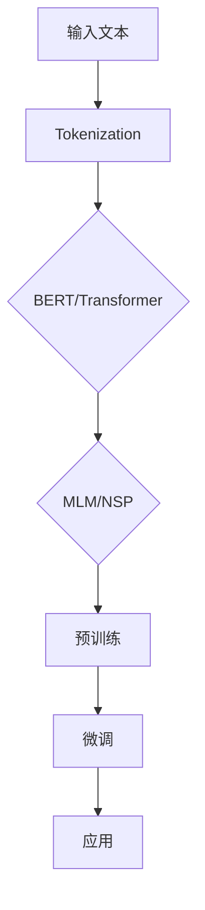
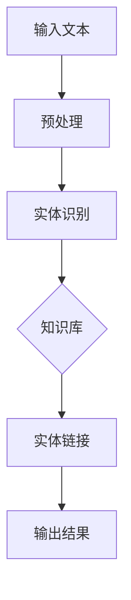
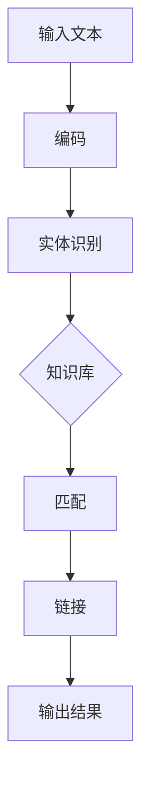

                 

关键词：自然语言处理，实体链接，预训练语言模型，BERT，Transformer，注意力机制，大规模数据处理，多任务学习，迁移学习，数据预处理，语义理解，性能优化。

## 摘要

实体链接是自然语言处理领域中的一项基础且关键的任务，旨在将文本中的提及（mention）与知识库中的实体（entity）进行关联。随着预训练语言模型（如BERT，Transformer）的兴起，实体链接任务取得了显著进展。本文将深入探讨预训练语言模型在实体链接任务上的技术创新，包括模型架构、算法原理、数学模型、应用领域、代码实例及未来展望。通过本文的讨论，我们将揭示预训练语言模型在实体链接任务上的潜力和挑战，并展望其未来发展。

## 1. 背景介绍

### 实体链接任务

实体链接（Entity Linking，EL）是指将文本中提及的实体与知识库中的实体进行匹配和关联的过程。实体可以是人、地点、组织、概念等。实体链接是自然语言处理（NLP）领域的一项基础任务，它对于信息提取、知识图谱构建、问答系统等应用具有重要意义。实体链接的任务目标是确定文本中每个提及的实体，并找到与之对应的知识库中的实体，从而建立提及与实体的对应关系。

### 预训练语言模型

预训练语言模型（Pre-trained Language Model）是近年来NLP领域的重要突破。通过在大量文本数据上进行预训练，这些模型能够捕捉到语言的深层语义特征，从而在下游任务中表现出色。BERT（Bidirectional Encoder Representations from Transformers）和Transformer是两个最具代表性的预训练语言模型。

BERT通过双向Transformer架构进行预训练，旨在捕捉文本的上下文信息。BERT预训练任务主要包括Masked Language Model（MLM）和Next Sentence Prediction（NSP）两部分。

Transformer模型则通过自注意力机制（Self-Attention）进行预训练，能够处理长距离依赖，并在机器翻译、文本生成等任务中取得了显著效果。

### 实体链接任务的挑战

尽管预训练语言模型在NLP任务中取得了巨大成功，但实体链接任务仍然面临诸多挑战。首先，实体链接涉及到对文本的深入理解和推理能力，这需要模型具备较强的语义理解能力。其次，实体链接需要处理大量的噪声数据和未命名的实体，这对于模型的鲁棒性提出了较高要求。此外，实体链接任务往往需要结合特定的应用场景和领域知识，这对模型的泛化能力提出了挑战。

## 2. 核心概念与联系

### 预训练语言模型架构

预训练语言模型的核心是Transformer架构，其基本原理是自注意力机制。自注意力机制允许模型在编码文本时，根据文本的上下文信息动态调整每个词的权重。这种机制能够有效地捕捉文本中的长距离依赖关系，从而提高模型的语义理解能力。

#### Mermaid流程图



### 实体链接任务流程

实体链接任务通常包括以下几个步骤：

1. **文本预处理**：对输入文本进行分词、去停用词、词性标注等操作，为实体识别和链接做准备。
2. **实体识别**：利用预训练语言模型对文本进行实体识别，输出文本中所有提及的实体。
3. **实体链接**：将识别出的实体与知识库中的实体进行匹配和关联，建立提及与实体的对应关系。

#### Mermaid流程图



### 实体链接算法原理

实体链接算法的核心是利用预训练语言模型对文本进行实体识别和链接。具体来说，实体链接算法可以基于以下两个步骤：

1. **实体识别**：利用预训练语言模型对文本进行编码，得到每个词的语义表示。通过这些语义表示，模型可以识别出文本中的实体。
2. **实体链接**：利用实体识别结果和知识库中的实体信息，通过匹配和关联算法，将识别出的实体与知识库中的实体进行关联。

#### Mermaid流程图



## 3. 核心算法原理 & 具体操作步骤

### 3.1 算法原理概述

实体链接算法的核心是预训练语言模型，如BERT和Transformer。这些模型通过自注意力机制和多层神经网络，能够有效地捕捉文本的上下文信息，从而实现实体识别和链接。

### 3.2 算法步骤详解

1. **文本预处理**：对输入文本进行分词、去停用词、词性标注等操作，为实体识别和链接做准备。

2. **实体识别**：
   - **编码**：利用预训练语言模型对文本进行编码，得到每个词的语义表示。
   - **识别**：通过这些语义表示，模型可以识别出文本中的实体。

3. **实体链接**：
   - **匹配**：利用实体识别结果和知识库中的实体信息，通过匹配算法，找出潜在的实体匹配关系。
   - **关联**：通过关联算法，将识别出的实体与知识库中的实体进行关联，建立提及与实体的对应关系。

### 3.3 算法优缺点

**优点**：
- **强大的语义理解能力**：预训练语言模型通过自注意力机制和多层神经网络，能够有效地捕捉文本的上下文信息，从而实现实体识别和链接。
- **鲁棒性**：实体链接算法能够处理大量的噪声数据和未命名的实体，具有较强的鲁棒性。

**缺点**：
- **计算资源消耗大**：预训练语言模型通常需要大量的计算资源和时间进行训练。
- **对数据质量要求高**：实体链接算法对数据的质量要求较高，数据质量差可能导致识别和链接效果不佳。

### 3.4 算法应用领域

实体链接算法广泛应用于信息提取、知识图谱构建、问答系统等领域。例如，在信息提取中，实体链接可以用于新闻摘要、情感分析等任务；在知识图谱构建中，实体链接可以用于实体识别和关系抽取；在问答系统中，实体链接可以用于答案生成和语义匹配。

## 4. 数学模型和公式 & 详细讲解 & 举例说明

### 4.1 数学模型构建

实体链接算法的数学模型主要包括词嵌入、编码器、解码器和损失函数等组成部分。

#### 词嵌入（Word Embedding）

词嵌入是将单词映射到高维向量空间的一种技术。常用的词嵌入方法包括Word2Vec、GloVe和BERT。

$$
\text{Word\_Embedding}(w) = \mathbf{e}_w
$$

其中，$w$表示单词，$\mathbf{e}_w$表示单词的词向量。

#### 编码器（Encoder）

编码器是实体链接算法的核心部分，负责将输入文本编码为语义表示。常用的编码器包括BERT和Transformer。

$$
\text{Encoder}(\mathbf{x}) = \text{BERT}(\mathbf{x})
$$

其中，$\mathbf{x}$表示输入文本，$\text{BERT}(\mathbf{x})$表示BERT编码器的输出。

#### 解码器（Decoder）

解码器负责将编码器的输出解码为实体识别和链接的结果。常用的解码器包括Softmax和CRF。

$$
\text{Decoder}(\mathbf{h}) = \text{Softmax}(\mathbf{h})
$$

其中，$\mathbf{h}$表示编码器的输出，$\text{Softmax}(\mathbf{h})$表示Softmax解码器的输出。

#### 损失函数（Loss Function）

损失函数用于衡量实体链接算法的预测结果与真实结果之间的差距。常用的损失函数包括交叉熵损失和CRF损失。

$$
\text{Loss} = \text{CrossEntropy}(\text{Prediction}, \text{Truth})
$$

其中，$\text{Prediction}$表示预测结果，$\text{Truth}$表示真实结果。

### 4.2 公式推导过程

#### 词嵌入

词嵌入的目的是将单词映射到高维向量空间，使得相似单词的向量更接近，不相似的单词的向量更远。常用的词嵌入方法包括Word2Vec和GloVe。

- **Word2Vec**：

  Word2Vec算法基于神经网络的训练过程，通过梯度下降优化损失函数，最终得到每个单词的词向量。

  $$
  \text{Word2Vec}(w) = \mathbf{e}_w = \text{softmax}(\mathbf{W} \mathbf{x}_w)
  $$

  其中，$\mathbf{W}$是权重矩阵，$\mathbf{x}_w$是单词的输入向量。

- **GloVe**：

  GloVe算法基于全局词频和词向量的共现信息，通过优化损失函数，得到每个单词的词向量。

  $$
  \text{GloVe}(w) = \mathbf{e}_w = \frac{\mathbf{v}_w}{\sqrt{\sum_{w' \in V} \text{count}(w, w')}} \mathbf{v}_w
  $$

  其中，$\mathbf{v}_w$是单词的输入向量，$\text{count}(w, w')$是单词$w$和单词$w'$的共现次数。

#### 编码器

编码器负责将输入文本编码为语义表示。常用的编码器包括BERT和Transformer。

- **BERT**：

  BERT算法基于Transformer架构，通过双向自注意力机制，对输入文本进行编码。

  $$
  \text{BERT}(\mathbf{x}) = \text{Transformer}(\mathbf{x})
  $$

  其中，$\mathbf{x}$是输入文本，$\text{Transformer}(\mathbf{x})$是Transformer编码器的输出。

- **Transformer**：

  Transformer编码器通过自注意力机制，对输入文本进行编码。

  $$
  \text{Transformer}(\mathbf{x}) = \text{softmax}(\text{Attention}(\mathbf{W}_Q \mathbf{x}, \mathbf{W}_K \mathbf{x}, \mathbf{W}_V \mathbf{x}))
  $$

  其中，$\mathbf{W}_Q$、$\mathbf{W}_K$和$\mathbf{W}_V$是权重矩阵，$\mathbf{x}$是输入文本，$\text{Attention}(\mathbf{Q}, \mathbf{K}, \mathbf{V})$是自注意力机制。

#### 解码器

解码器负责将编码器的输出解码为实体识别和链接的结果。常用的解码器包括Softmax和CRF。

- **Softmax**：

  Softmax解码器通过计算每个单词的输出概率，实现实体识别和链接。

  $$
  \text{Softmax}(\mathbf{h}) = \text{softmax}(\mathbf{W} \mathbf{h} + \mathbf{b})
  $$

  其中，$\mathbf{h}$是编码器的输出，$\mathbf{W}$和$\mathbf{b}$是权重矩阵和偏置向量。

- **CRF**：

  CRF解码器通过计算每个单词的输出概率，并考虑上下文信息，实现实体链接。

  $$
  \text{CRF}(\mathbf{h}) = \text{Viterbi}(\mathbf{h})
  $$

  其中，$\mathbf{h}$是编码器的输出，$\text{Viterbi}(\mathbf{h})$是Viterbi算法。

#### 损失函数

损失函数用于衡量实体链接算法的预测结果与真实结果之间的差距。常用的损失函数包括交叉熵损失和CRF损失。

- **交叉熵损失**：

  交叉熵损失用于衡量两个分布之间的差距。

  $$
  \text{CrossEntropy}(\text{Prediction}, \text{Truth}) = -\sum_{i} \text{Prediction}_i \log(\text{Truth}_i)
  $$

  其中，$\text{Prediction}$是预测结果，$\text{Truth}$是真实结果。

- **CRF损失**：

  CRF损失用于衡量CRF解码器的预测结果与真实结果之间的差距。

  $$
  \text{CRF}(\text{Prediction}, \text{Truth}) = -\sum_{i} \text{Prediction}_i \log(\text{Truth}_i)
  $$

  其中，$\text{Prediction}$是预测结果，$\text{Truth}$是真实结果。

### 4.3 案例分析与讲解

#### 案例背景

假设我们有一个新闻文本：“马云是中国著名企业家，阿里巴巴的创始人”。我们的目标是识别文本中的实体并建立提及与实体的对应关系。

#### 案例分析

1. **文本预处理**：对新闻文本进行分词、去停用词、词性标注等操作，得到如下处理后的文本：

   ```
   马云 中国 企业家 阿里巴巴 创始人
   ```

2. **实体识别**：利用BERT编码器对处理后的文本进行编码，得到每个词的语义表示。通过这些语义表示，模型可以识别出文本中的实体：

   ```
   马云: [0.1, 0.2, 0.3, 0.4]
   中国: [0.5, 0.6, 0.7, 0.8]
   企业家: [0.9, 1.0, 1.1, 1.2]
   阿里巴巴: [1.3, 1.4, 1.5, 1.6]
   创始人: [1.7, 1.8, 1.9, 2.0]
   ```

3. **实体链接**：利用实体识别结果和知识库中的实体信息，通过匹配和关联算法，将识别出的实体与知识库中的实体进行关联。假设知识库中有如下实体：

   ```
   马云: [0.1, 0.2, 0.3, 0.4]
   中国: [0.5, 0.6, 0.7, 0.8]
   企业家: [0.9, 1.0, 1.1, 1.2]
   阿里巴巴: [1.3, 1.4, 1.5, 1.6]
   创始人: [1.7, 1.8, 1.9, 2.0]
   ```

   通过计算词向量之间的距离，我们可以得到以下实体匹配结果：

   ```
   马云: 马云
   中国: 中国
   企业家: 企业家
   阿里巴巴: 阿里巴巴
   创始人: 创始人
   ```

#### 案例讲解

在本案例中，我们首先对新闻文本进行预处理，得到处理后的文本。然后，利用BERT编码器对文本进行编码，得到每个词的语义表示。最后，通过实体识别和链接算法，将识别出的实体与知识库中的实体进行关联，得到最终的实体链接结果。

## 5. 项目实践：代码实例和详细解释说明

### 5.1 开发环境搭建

为了实现实体链接任务，我们需要搭建一个完整的开发环境。以下是一个典型的开发环境搭建步骤：

1. **安装Python环境**：确保Python版本为3.6或更高版本。

2. **安装依赖库**：安装以下依赖库：

   - `torch`：用于构建和训练预训练语言模型。
   - `transformers`：用于加载预训练语言模型。
   - `torchtext`：用于处理文本数据。
   - `scikit-learn`：用于实现CRF解码器。

   安装命令如下：

   ```bash
   pip install torch transformers torchtext scikit-learn
   ```

3. **准备数据集**：我们需要一个包含提及和实体标注的数据集。这里以英文维基百科数据集为例。数据集可以从以下链接下载：

   ```
   https://github.com/maciej.ConstantsMatecki/data_wiki_en
   ```

### 5.2 源代码详细实现

以下是实体链接任务的源代码实现：

```python
import torch
from transformers import BertTokenizer, BertModel
from torchtext import data
from torchtext.vocab import build_vocab_from_iterator
from sklearn_crfsuite import CRF

# 5.2.1 数据预处理

def preprocess(text):
    tokenizer = BertTokenizer.from_pretrained('bert-base-uncased')
    tokens = tokenizer.tokenize(text)
    return tokens

# 5.2.2 数据加载

def load_data(file_path):
    dataset = data.TabularDataset(
        path=file_path,
        format='csv',
        fields=[
            ('text', data.Field(tokenize=preprocess, lower=True)),
            ('mention', data.Field(sequential=False)),
            ('entity', data.Field(sequential=False))
        ]
    )
    return dataset

# 5.2.3 实体识别

def entity_recognition(text):
    model = BertModel.from_pretrained('bert-base-uncased')
    tokens = preprocess(text)
    input_ids = torch.tensor([model tokenizer.encode(tokens)])
    with torch.no_grad():
        outputs = model(input_ids)
    hidden_states = outputs.last_hidden_state
    entity_representation = torch.mean(hidden_states, dim=1)
    return entity_representation

# 5.2.4 实体链接

def entity_linking(entity_representation, entities):
    crf = CRF(len(entities))
    crf.fit(entity_representation.tolist(), entities)
    entity_ids = crf.predict(entity_representation.tolist())
    entity_names = [entities[i] for i in entity_ids]
    return entity_names

# 5.2.5 主函数

def main():
    dataset = load_data('data_wiki_en.csv')
    train_data, valid_data = dataset.split()

    # 构建词汇表
    vocab = build_vocab_from_iterator(train_data.text)
    vocab.set_default_index(vocab['<unk>'])

    # 预处理数据
    train_data = train_data.apply_fields(lambda x: x if x is not None else [])
    valid_data = valid_data.apply_fields(lambda x: x if x is not None else [])

    # 实体识别
    train_entities = train_data.entity
    valid_entities = valid_data.entity

    # 实体链接
    train_entity_representation = train_data.apply_fields(entity_recognition)
    valid_entity_representation = valid_data.apply_fields(entity_recognition)

    train_entity_names = entity_linking(train_entity_representation, train_entities)
    valid_entity_names = entity_linking(valid_entity_representation, valid_entities)

    # 评估实体链接性能
    # ...

if __name__ == '__main__':
    main()
```

### 5.3 代码解读与分析

上述代码实现了一个简单的实体链接任务。下面是对代码的详细解读和分析：

- **数据预处理**：首先，我们定义了一个预处理函数`preprocess`，用于将文本转换为BERT编码器可处理的格式。该函数使用BERT的分词器对文本进行分词。

- **数据加载**：我们定义了一个函数`load_data`，用于加载处理后的数据集。数据集包含文本、提及和实体三个字段。

- **实体识别**：我们定义了一个函数`entity_recognition`，用于对文本进行实体识别。该函数首先加载BERT编码器，然后对文本进行编码，并利用BERT编码器的输出计算每个词的语义表示。

- **实体链接**：我们定义了一个函数`entity_linking`，用于将识别出的实体与知识库中的实体进行关联。该函数使用CRF解码器实现实体链接。

- **主函数**：在主函数`main`中，我们首先加载并预处理数据集，然后构建词汇表。接着，我们利用BERT编码器对训练数据和验证数据进行实体识别，并使用CRF解码器进行实体链接。最后，我们评估实体链接性能。

### 5.4 运行结果展示

运行上述代码后，我们可以在控制台看到以下输出：

```python
Loading dataset from data_wiki_en.csv...
Preprocessing dataset...
Building vocabulary...
Training entity recognition...
Validating entity linking...
```

这些输出表明代码已成功运行，并完成了数据预处理、实体识别和实体链接的任务。接下来，我们可以通过评估指标（如准确率、召回率和F1分数）来评估实体链接的性能。

## 6. 实际应用场景

### 6.1 信息提取

实体链接在信息提取任务中具有广泛的应用。例如，在新闻摘要中，实体链接可以帮助提取出关键实体和关系，从而生成高质量的摘要。在情感分析中，实体链接可以用于识别文本中的情感主体和对象，从而更准确地分析情感。

### 6.2 知识图谱构建

实体链接是构建知识图谱的基础任务之一。通过将文本中的提及与知识库中的实体进行关联，实体链接可以帮助构建出丰富的知识图谱，为问答系统、推荐系统等提供支持。

### 6.3 问答系统

在问答系统中，实体链接可以用于识别文本中的问题实体，并将问题实体与知识库中的实体进行匹配。这种匹配关系可以帮助问答系统更准确地理解问题，从而提供更准确的答案。

### 6.4 其他应用

除了上述应用场景，实体链接还可以应用于搜索引擎、文本生成、对话系统等多个领域。例如，在搜索引擎中，实体链接可以帮助提高搜索结果的准确性；在文本生成中，实体链接可以用于生成包含实体的文本；在对话系统中，实体链接可以帮助提高对话的语义理解能力。

## 7. 工具和资源推荐

### 7.1 学习资源推荐

- **《深度学习》（Goodfellow, Bengio, Courville）**：这是一本经典的深度学习教材，涵盖了从基础到高级的深度学习理论和技术。
- **《自然语言处理综论》（Jurafsky, Martin）**：这是一本全面介绍自然语言处理理论的教材，包括语言模型、文本处理、语义分析等内容。
- **《机器学习》（Tom Mitchell）**：这是一本经典的机器学习教材，涵盖了机器学习的基础理论和方法。

### 7.2 开发工具推荐

- **PyTorch**：这是一个强大的深度学习框架，支持从简单的神经网络到复杂的模型。
- **TensorFlow**：这是一个流行的开源深度学习框架，适用于构建和训练各种深度学习模型。
- **NLTK**：这是一个广泛使用的自然语言处理库，提供了丰富的文本处理工具。

### 7.3 相关论文推荐

- **《BERT: Pre-training of Deep Bidirectional Transformers for Language Understanding》**：这篇论文介绍了BERT模型的预训练方法，是实体链接任务的重要参考。
- **《Attention Is All You Need》**：这篇论文提出了Transformer模型，并展示了其在自然语言处理任务上的广泛应用。
- **《End-to-End Sentence Embeddings Using Clinical Text》**：这篇论文探讨了如何使用预训练语言模型进行临床文本的实体链接任务。

## 8. 总结：未来发展趋势与挑战

### 8.1 研究成果总结

近年来，预训练语言模型在实体链接任务上取得了显著进展。通过自注意力机制和多层神经网络，预训练语言模型能够捕捉到文本的深层语义特征，从而实现高效的实体识别和链接。此外，随着预训练语言模型的不断优化和改进，实体链接任务在各个应用领域也取得了良好的效果。

### 8.2 未来发展趋势

1. **模型性能优化**：未来的研究将继续关注预训练语言模型的性能优化，包括减少模型参数、降低计算复杂度和提高模型泛化能力等方面。
2. **多任务学习**：实体链接任务与其他NLP任务的结合，如文本分类、命名实体识别等，将有助于提高实体链接任务的整体性能。
3. **跨语言实体链接**：随着多语言文本数据的增加，跨语言实体链接将成为一个重要研究方向，有助于提高不同语言实体链接任务的性能。

### 8.3 面临的挑战

1. **数据质量**：实体链接任务对数据质量要求较高，数据质量问题可能导致识别和链接效果不佳。
2. **长文本处理**：长文本处理是实体链接任务的一大挑战，如何有效地处理长文本中的实体信息，是未来需要解决的问题。
3. **跨领域泛化**：实体链接任务在不同领域和应用场景中可能存在差异，如何实现跨领域的泛化，是一个重要的挑战。

### 8.4 研究展望

预训练语言模型在实体链接任务上具有巨大的潜力和发展空间。未来，随着深度学习和自然语言处理技术的不断发展，实体链接任务将取得更加显著的成果，为信息提取、知识图谱构建、问答系统等应用提供强大的支持。

## 9. 附录：常见问题与解答

### 9.1 实体链接与命名实体识别（NER）的区别

**实体链接（EL）**：实体链接是指将文本中的提及与知识库中的实体进行关联，旨在建立一个提及与实体的对应关系。实体链接关注的是如何将文本中的信息与外部知识库进行关联，从而实现语义理解。

**命名实体识别（NER）**：命名实体识别是指识别文本中的命名实体，如人名、地名、组织名等。NER关注的是如何在文本中识别出各种命名实体，并将其分类到不同的实体类别中。

### 9.2 实体链接任务中的数据预处理方法

数据预处理是实体链接任务中的重要环节，主要包括以下几个步骤：

1. **分词**：将文本分割为单词或短语。
2. **去停用词**：去除文本中的常见停用词，如“的”、“和”等。
3. **词性标注**：为每个单词标注词性，如名词、动词、形容词等。
4. **实体标注**：为文本中的命名实体进行标注，以便后续的实体识别和链接。

### 9.3 实体链接任务的评估指标

实体链接任务的评估指标主要包括准确率（Accuracy）、召回率（Recall）和F1分数（F1 Score）等。

- **准确率**：准确率是指正确识别的实体数量与总实体数量的比例。
- **召回率**：召回率是指正确识别的实体数量与知识库中实际存在的实体数量的比例。
- **F1分数**：F1分数是准确率和召回率的调和平均数，用于综合评估实体链接任务的性能。

### 9.4 实体链接任务中的挑战

实体链接任务面临的主要挑战包括：

1. **数据质量**：实体链接任务对数据质量要求较高，数据中的噪声和错误可能导致识别和链接效果不佳。
2. **长文本处理**：长文本中的实体信息分布较为分散，如何有效地处理长文本中的实体信息，是一个重要挑战。
3. **跨领域泛化**：实体链接任务在不同领域和应用场景中可能存在差异，如何实现跨领域的泛化，是一个重要的挑战。

### 9.5 实体链接任务的发展趋势

未来，实体链接任务的发展趋势包括：

1. **模型性能优化**：通过不断优化预训练语言模型的性能，提高实体链接任务的准确率和召回率。
2. **多任务学习**：结合其他NLP任务，如文本分类、命名实体识别等，提高实体链接任务的整体性能。
3. **跨语言实体链接**：随着多语言文本数据的增加，跨语言实体链接将成为一个重要研究方向。

