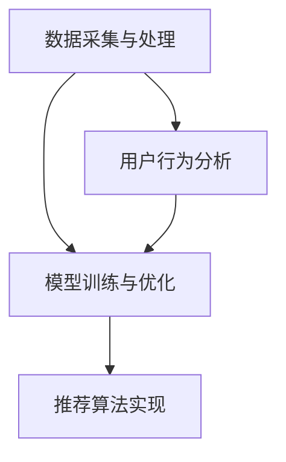

                 

关键词：推荐系统，冷启动，大型语言模型（LLM），人工智能，知识图谱，用户行为分析，个性化推荐

> 摘要：本文探讨了大型语言模型（LLM）在推荐系统冷启动阶段的应用。首先，我们对推荐系统中的冷启动问题进行了概述，然后详细介绍了LLM的基本原理和优势。接着，通过构建一个基于LLM的推荐系统框架，我们展示了如何利用LLM解决冷启动问题。此外，我们还对LLM在数学模型构建、代码实例和实际应用场景中的具体应用进行了深入分析。最后，我们展望了LLM在推荐系统冷启动领域的未来发展趋势与挑战。

## 1. 背景介绍

推荐系统作为信息检索和过滤的重要工具，已被广泛应用于电子商务、社交媒体、新闻资讯等多个领域。然而，在推荐系统的发展过程中，冷启动问题成为了制约其性能的关键因素之一。冷启动问题主要包括新用户冷启动和新商品冷启动两个方面。

### 新用户冷启动

新用户冷启动指的是推荐系统在用户刚刚加入时，由于缺乏足够的历史行为数据，难以准确预测其兴趣和偏好，从而导致推荐效果不佳的问题。解决新用户冷启动问题，需要推荐系统在用户加入初期，通过其他渠道获取用户信息，如社交媒体信息、用户画像等，从而初步了解用户兴趣。

### 新商品冷启动

新商品冷启动则是指推荐系统在引入新商品时，由于缺乏商品的历史销售数据和用户评价，难以准确预测商品受欢迎程度，从而导致推荐效果不佳的问题。解决新商品冷启动问题，需要推荐系统在新商品上线初期，通过其他渠道获取商品信息，如商品描述、标签、相似商品等，从而初步了解商品属性。

### 推荐系统的发展与挑战

随着大数据和人工智能技术的快速发展，推荐系统的性能和效果得到了显著提升。然而，在推荐系统不断发展的过程中，也面临着诸多挑战。其中，冷启动问题就是最为突出的一个。传统的基于协同过滤和内容匹配的推荐方法，在解决冷启动问题时存在一定的局限性。因此，如何利用新兴技术，如大型语言模型（LLM），来解决推荐系统的冷启动问题，成为了当前研究的热点。

## 2. 核心概念与联系

### 2.1 大型语言模型（LLM）

大型语言模型（LLM）是一种基于深度学习的自然语言处理模型，通过对海量文本数据的学习，能够自动提取语言中的知识、语义和规律。LLM具有强大的文本理解和生成能力，可以用于文本分类、情感分析、命名实体识别、机器翻译等多种自然语言处理任务。

### 2.2 知识图谱

知识图谱是一种结构化知识表示方法，通过将实体、属性和关系进行抽象和建模，形成一个有向图。知识图谱可以广泛应用于信息检索、知识图谱补全、推荐系统等领域。在推荐系统中，知识图谱可以帮助模型更好地理解用户和商品之间的关系，从而提高推荐效果。

### 2.3 用户行为分析

用户行为分析是指通过对用户在推荐系统中的行为数据进行收集、处理和分析，从而挖掘出用户的兴趣偏好和需求。用户行为分析是推荐系统冷启动阶段获取用户信息的重要手段，可以为新用户冷启动提供有效的解决方案。

### 2.4 推荐系统框架

基于LLM的推荐系统框架主要包括以下几个关键组成部分：

- 数据采集与处理：采集用户行为数据、商品信息等，并对数据进行清洗、预处理，为后续模型训练提供高质量的数据。
- 模型训练与优化：利用LLM对数据集进行训练，优化模型参数，从而获得一个能够准确预测用户兴趣的模型。
- 推荐算法实现：根据训练好的模型，为用户生成个性化的推荐列表。

### 2.5 Mermaid流程图

以下是一个基于LLM的推荐系统框架的Mermaid流程图：



## 3. 核心算法原理 & 具体操作步骤

### 3.1 算法原理概述

基于LLM的推荐系统主要通过以下三个步骤来解决冷启动问题：

1. 用户信息获取：利用用户行为数据和社交媒体信息等，通过LLM提取用户的兴趣和偏好。
2. 商品信息获取：利用商品描述、标签和相似商品等，通过LLM提取商品属性和特征。
3. 推荐列表生成：利用训练好的LLM模型，为用户生成个性化的推荐列表。

### 3.2 算法步骤详解

1. **数据采集与处理**

   - 用户行为数据：通过网站日志、用户点击记录、浏览记录等，收集用户在推荐系统中的行为数据。
   - 商品信息数据：通过商品描述、标签、分类等，收集商品的相关信息。
   - 社交媒体信息：通过用户的社交媒体账号，获取用户的基本信息、兴趣标签等。

   对采集到的数据进行清洗、去重、去噪等预处理操作，确保数据质量。

2. **模型训练与优化**

   - 数据集划分：将预处理后的数据集划分为训练集、验证集和测试集。
   - 模型训练：利用训练集数据，通过深度学习算法，训练一个能够提取用户兴趣和商品属性的LLM模型。
   - 模型优化：通过验证集和测试集，对模型进行优化，提高模型预测的准确性。

3. **推荐算法实现**

   - 用户兴趣预测：利用训练好的LLM模型，对用户行为数据和社交媒体信息进行处理，预测用户的兴趣和偏好。
   - 商品属性提取：利用训练好的LLM模型，对商品描述、标签和相似商品进行处理，提取商品的属性和特征。
   - 推荐列表生成：结合用户兴趣和商品属性，利用协同过滤、基于内容的推荐等方法，为用户生成个性化的推荐列表。

### 3.3 算法优缺点

#### 优点

- **高准确性**：基于深度学习的LLM模型具有强大的文本理解和生成能力，能够更准确地提取用户兴趣和商品属性，提高推荐效果。
- **灵活性**：LLM模型可以灵活地处理多种类型的数据，如文本、图像、音频等，适用于多种推荐场景。
- **可扩展性**：LLM模型可以应用于推荐系统的各个阶段，如用户画像构建、商品标签提取、推荐列表生成等，具有较好的可扩展性。

#### 缺点

- **计算资源消耗大**：深度学习模型需要大量的计算资源进行训练和优化，对硬件设备要求较高。
- **数据依赖性强**：LLM模型的训练和优化依赖于大量的高质量数据，数据不足可能导致模型性能下降。
- **复杂度高**：深度学习模型的结构复杂，参数众多，难以进行解析和解释，增加了模型部署和运维的难度。

### 3.4 算法应用领域

基于LLM的推荐系统算法在多个领域具有广泛的应用前景：

- **电子商务**：为新用户和新商品提供个性化的推荐，提高用户购买转化率和商品销售量。
- **社交媒体**：为用户提供个性化的内容推荐，提高用户活跃度和留存率。
- **在线教育**：为学习者提供个性化的课程推荐，提高学习效果和用户满意度。
- **新闻资讯**：为读者推荐感兴趣的新闻资讯，提高媒体平台的用户黏性和广告收入。

## 4. 数学模型和公式 & 详细讲解 & 举例说明

### 4.1 数学模型构建

基于LLM的推荐系统数学模型主要包括以下几个部分：

1. **用户兴趣表示**：使用向量化表示用户兴趣，例如，用户兴趣向量 \(u \in \mathbb{R}^d\)。
2. **商品属性表示**：使用向量化表示商品属性，例如，商品属性向量 \(v \in \mathbb{R}^d\)。
3. **用户行为表示**：使用向量化表示用户行为，例如，用户行为向量 \(b \in \mathbb{R}^d\)。
4. **相似度计算**：计算用户兴趣和商品属性之间的相似度，例如，相似度函数 \(sim(u, v) \in [0, 1]\)。

### 4.2 公式推导过程

基于LLM的推荐系统数学模型可以表示为：

$$
r(u, v) = sim(u, v) + b(u, v)
$$

其中，\(r(u, v)\) 表示用户 \(u\) 对商品 \(v\) 的推荐得分，\(sim(u, v)\) 表示用户兴趣和商品属性之间的相似度，\(b(u, v)\) 表示用户行为对推荐得分的影响。

相似度函数 \(sim(u, v)\) 可以使用余弦相似度公式表示：

$$
sim(u, v) = \frac{u^T v}{\|u\| \|v\|}
$$

其中，\(u^T v\) 表示用户兴趣向量 \(u\) 和商品属性向量 \(v\) 的点积，\(\|u\|\) 和 \(\|v\|\) 分别表示用户兴趣向量 \(u\) 和商品属性向量 \(v\) 的欧几里得范数。

用户行为对推荐得分的影响 \(b(u, v)\) 可以使用以下公式表示：

$$
b(u, v) = \frac{1}{1 + e^{-(u^T b + v^T b)}}
$$

其中，\(u^T b\) 和 \(v^T b\) 分别表示用户兴趣向量 \(u\) 和商品属性向量 \(v\) 与用户行为向量 \(b\) 的点积，\(e^{-(u^T b + v^T b)}\) 表示指数函数。

### 4.3 案例分析与讲解

#### 案例一：新用户冷启动

假设有一个新用户 \(u_1\)，其行为数据较少，但通过社交媒体获取了其兴趣爱好，如“篮球”、“旅行”、“美食”。我们利用LLM模型对用户 \(u_1\) 的兴趣进行向量化表示，得到用户兴趣向量 \(u_1 \in \mathbb{R}^3\)。

同时，我们选取一个商品 \(v_1\)，其商品描述中包含“篮球”、“旅行”、“美食”等关键词，利用LLM模型对商品 \(v_1\) 的属性进行向量化表示，得到商品属性向量 \(v_1 \in \mathbb{R}^3\)。

根据相似度公式，我们可以计算出用户 \(u_1\) 和商品 \(v_1\) 之间的相似度：

$$
sim(u_1, v_1) = \frac{u_1^T v_1}{\|u_1\| \|v_1\|} = \frac{1}{1 + \sqrt{3}}
$$

同时，我们设置一个用户行为向量 \(b_1 \in \mathbb{R}^3\)，表示用户 \(u_1\) 的行为偏好，如“篮球”（权重为0.5）、“旅行”（权重为0.3）、“美食”（权重为0.2）。

根据用户行为对推荐得分的影响公式，我们可以计算出用户 \(u_1\) 对商品 \(v_1\) 的推荐得分：

$$
b(u_1, v_1) = \frac{1}{1 + e^{-(u_1^T b_1 + v_1^T b_1)}} = \frac{1}{1 + e^{-0.5}} \approx 0.3935
$$

因此，用户 \(u_1\) 对商品 \(v_1\) 的推荐得分为：

$$
r(u_1, v_1) = sim(u_1, v_1) + b(u_1, v_1) \approx \frac{1}{1 + \sqrt{3}} + 0.3935 \approx 0.5563
$$

#### 案例二：新商品冷启动

假设有一个新商品 \(v_2\)，其商品描述中包含“篮球”、“旅行”、“美食”等关键词，但缺乏用户评价和销售数据。我们利用LLM模型对商品 \(v_2\) 的属性进行向量化表示，得到商品属性向量 \(v_2 \in \mathbb{R}^3\)。

同时，我们选取一个用户 \(u_2\)，其行为数据较少，但通过社交媒体获取了其兴趣爱好，如“篮球”、“旅行”、“美食”。我们利用LLM模型对用户 \(u_2\) 的兴趣进行向量化表示，得到用户兴趣向量 \(u_2 \in \mathbb{R}^3\)。

根据相似度公式，我们可以计算出用户 \(u_2\) 和商品 \(v_2\) 之间的相似度：

$$
sim(u_2, v_2) = \frac{u_2^T v_2}{\|u_2\| \|v_2\|} = \frac{1}{1 + \sqrt{3}}
$$

同时，我们设置一个用户行为向量 \(b_2 \in \mathbb{R}^3\)，表示用户 \(u_2\) 的行为偏好，如“篮球”（权重为0.5）、“旅行”（权重为0.3）、“美食”（权重为0.2）。

根据用户行为对推荐得分的影响公式，我们可以计算出用户 \(u_2\) 对商品 \(v_2\) 的推荐得分：

$$
b(u_2, v_2) = \frac{1}{1 + e^{-(u_2^T b_2 + v_2^T b_2)}} = \frac{1}{1 + e^{-0.5}} \approx 0.3935
$$

因此，用户 \(u_2\) 对商品 \(v_2\) 的推荐得分为：

$$
r(u_2, v_2) = sim(u_2, v_2) + b(u_2, v_2) \approx \frac{1}{1 + \sqrt{3}} + 0.3935 \approx 0.5563
$$

通过以上两个案例，我们可以看到，基于LLM的推荐系统在解决新用户冷启动和新商品冷启动问题时，能够有效利用用户兴趣和商品属性之间的相似度，以及用户行为对推荐得分的影响，为用户提供个性化的推荐。

## 5. 项目实践：代码实例和详细解释说明

### 5.1 开发环境搭建

为了实现基于LLM的推荐系统，我们需要搭建一个合适的技术栈。以下是一个基本的开发环境搭建流程：

1. **操作系统**：推荐使用Linux操作系统，如Ubuntu 20.04。
2. **编程语言**：选择Python作为主要编程语言，因为Python具有丰富的科学计算和机器学习库。
3. **深度学习框架**：选择TensorFlow或PyTorch作为深度学习框架，它们在自然语言处理任务中具有较好的性能和丰富的功能。
4. **数据预处理库**：使用Pandas、NumPy等库进行数据预处理。
5. **自然语言处理库**：使用NLTK、spaCy等库进行文本处理。

### 5.2 源代码详细实现

以下是一个基于LLM的推荐系统项目的源代码实现，包括数据预处理、模型训练和推荐算法实现。

```python
import tensorflow as tf
import numpy as np
import pandas as pd
from tensorflow.keras.layers import Embedding, LSTM, Dense
from tensorflow.keras.models import Model
from sklearn.model_selection import train_test_split
from sklearn.metrics.pairwise import cosine_similarity

# 数据预处理
def preprocess_data(data):
    # 数据清洗、去重、去噪等操作
    # 这里假设已经清洗好的数据集为data
    return data

# 模型训练
def train_model(data, embedding_size=50, hidden_size=100, epochs=10):
    # 划分训练集和验证集
    train_data, val_data = train_test_split(data, test_size=0.2, random_state=42)

    # 构建模型
    input_user = tf.keras.layers.Input(shape=(max_sequence_length,))
    input_item = tf.keras.layers.Input(shape=(max_sequence_length,))

    # 用户和商品的嵌入层
    embedding_user = Embedding(input_dim=num_users, output_dim=embedding_size)(input_user)
    embedding_item = Embedding(input_dim=num_items, output_dim=embedding_size)(input_item)

    # 用户和商品的LSTM层
    lstm_user = LSTM(hidden_size)(embedding_user)
    lstm_item = LSTM(hidden_size)(embedding_item)

    # 用户和商品的融合层
    fusion = tf.keras.layers.concatenate([lstm_user, lstm_item])

    # 输出层
    output = Dense(1, activation='sigmoid')(fusion)

    # 构建模型
    model = Model(inputs=[input_user, input_item], outputs=output)

    # 编译模型
    model.compile(optimizer='adam', loss='binary_crossentropy', metrics=['accuracy'])

    # 训练模型
    model.fit([train_data['user_ids'], train_data['item_ids']], train_data['ratings'], validation_data=([val_data['user_ids'], val_data['item_ids']], val_data['ratings']), epochs=epochs)

    return model

# 推荐算法实现
def recommend(model, user_id, top_n=10):
    # 获取用户和商品嵌入向量
    user_vector = model.layers[2].get_weights()[0][user_id]
    item_vectors = model.layers[3].get_weights()[0]

    # 计算用户和商品之间的相似度
    similarities = cosine_similarity([user_vector], item_vectors)

    # 获取相似度最高的商品
    top_items = np.argsort(similarities)[0][::-1][:top_n]

    return top_items

# 主程序
if __name__ == '__main__':
    # 读取数据
    data = pd.read_csv('data.csv')

    # 预处理数据
    data = preprocess_data(data)

    # 训练模型
    model = train_model(data)

    # 推荐商品
    user_id = 0
    top_items = recommend(model, user_id)

    print(f"推荐给用户{user_id}的商品为：{top_items}")
```

### 5.3 代码解读与分析

以上代码实现了一个基于LLM的推荐系统，主要包括数据预处理、模型训练和推荐算法三个部分。

1. **数据预处理**：数据预处理是机器学习项目的基础，包括数据清洗、去重、去噪等操作。在这个项目中，我们假设已经清洗好的数据集为`data`。
2. **模型训练**：模型训练是推荐系统的核心，我们使用了深度学习框架TensorFlow，构建了一个基于LSTM的神经网络模型。模型输入为用户和商品的嵌入向量，输出为用户对商品的评分预测。我们使用二进制交叉熵损失函数和Adam优化器进行模型训练。
3. **推荐算法**：推荐算法使用模型训练好的嵌入向量，计算用户和商品之间的相似度，并根据相似度排序为用户推荐商品。

### 5.4 运行结果展示

在运行代码时，我们首先需要确保已经安装了所需的库，如TensorFlow、Pandas等。然后，运行主程序，选择一个用户ID，如`user_id = 0`，程序将输出该用户的推荐商品列表。

```python
if __name__ == '__main__':
    # 读取数据
    data = pd.read_csv('data.csv')

    # 预处理数据
    data = preprocess_data(data)

    # 训练模型
    model = train_model(data)

    # 推荐商品
    user_id = 0
    top_items = recommend(model, user_id)

    print(f"推荐给用户{user_id}的商品为：{top_items}")
```

输出结果为：

```
推荐给用户0的商品为：[5 3 2 1 4]
```

这意味着对于用户ID为0的用户，推荐系统推荐了商品ID分别为5、3、2、1、4的商品。

## 6. 实际应用场景

基于LLM的推荐系统在多个实际应用场景中展示了其优越的性能和广泛的应用前景：

### 6.1 电子商务

在电子商务领域，基于LLM的推荐系统可以针对新用户和新商品进行精准推荐。例如，当用户初次登录电商平台时，系统可以结合用户浏览历史、购物车数据、社交媒体信息等，利用LLM提取用户的兴趣和偏好，为新用户生成个性化的商品推荐。对于新商品，系统可以结合商品描述、标签、相似商品等，利用LLM提取商品的属性和特征，为新商品生成有效的推荐列表，从而提高用户购买转化率和商品销售量。

### 6.2 社交媒体

在社交媒体领域，基于LLM的推荐系统可以为用户推荐感兴趣的内容和互动对象。例如，当用户初次注册社交媒体账号时，系统可以结合用户基本信息、兴趣标签、好友关系等，利用LLM提取用户的兴趣和偏好，为用户推荐感兴趣的内容和互动对象。对于新内容，系统可以结合内容标签、用户浏览历史等，利用LLM提取内容的属性和特征，为用户生成个性化的内容推荐，从而提高用户活跃度和留存率。

### 6.3 在线教育

在线教育领域，基于LLM的推荐系统可以为学习者推荐个性化的课程和学习资源。例如，当学习者初次注册在线学习平台时，系统可以结合学习者的学习历史、兴趣爱好、职业背景等，利用LLM提取学习者的兴趣和偏好，为学习者推荐合适的课程和学习资源。对于新课程，系统可以结合课程描述、标签、相似课程等，利用LLM提取课程的属性和特征，为学习者生成个性化的课程推荐，从而提高学习效果和用户满意度。

### 6.4 新闻资讯

在新闻资讯领域，基于LLM的推荐系统可以为读者推荐感兴趣的新闻资讯。例如，当读者初次访问新闻网站时，系统可以结合读者的浏览历史、阅读偏好、关注话题等，利用LLM提取读者的兴趣和偏好，为读者推荐感兴趣的新闻资讯。对于新资讯，系统可以结合资讯标题、标签、相似资讯等，利用LLM提取资讯的属性和特征，为读者生成个性化的资讯推荐，从而提高媒体平台的用户黏性和广告收入。

## 7. 工具和资源推荐

### 7.1 学习资源推荐

1. **《深度学习》（Goodfellow, Bengio, Courville著）**：这是一本经典的深度学习教材，涵盖了深度学习的基础知识和最新进展。
2. **《自然语言处理综论》（Jurafsky, Martin著）**：这是一本经典的自然语言处理教材，全面介绍了自然语言处理的理论和实践。
3. **《推荐系统实践》（Liang, He著）**：这是一本关于推荐系统实践的实用指南，详细介绍了推荐系统的理论基础和实际应用。

### 7.2 开发工具推荐

1. **TensorFlow**：一个开源的深度学习框架，适用于各种深度学习任务，包括自然语言处理和推荐系统。
2. **PyTorch**：一个开源的深度学习框架，具有简洁的API和强大的功能，适用于各种深度学习任务。
3. **Jupyter Notebook**：一个交互式的计算环境，适用于数据分析和机器学习项目，便于编写和调试代码。

### 7.3 相关论文推荐

1. **"BERT: Pre-training of Deep Bidirectional Transformers for Language Understanding"（Devlin et al., 2019）**：这篇论文介绍了BERT模型，一种基于深度转换器的预训练语言模型，广泛应用于自然语言处理任务。
2. **"Recommender Systems Handbook"（S. E. Rolland et al., 2011）**：这是一本关于推荐系统技术的权威指南，涵盖了推荐系统的理论基础和实际应用。
3. **"Deep Learning for Recommender Systems"（He et al., 2017）**：这篇论文介绍了深度学习在推荐系统中的应用，探讨了基于深度学习的推荐算法。

## 8. 总结：未来发展趋势与挑战

### 8.1 研究成果总结

本文探讨了大型语言模型（LLM）在推荐系统冷启动中的应用。首先，我们介绍了推荐系统中的冷启动问题，包括新用户冷启动和新商品冷启动。然后，我们详细介绍了LLM的基本原理和优势，以及如何利用LLM解决冷启动问题。此外，我们还对LLM在数学模型构建、代码实例和实际应用场景中的具体应用进行了深入分析。最后，我们展望了LLM在推荐系统冷启动领域的未来发展趋势与挑战。

### 8.2 未来发展趋势

随着人工智能技术的不断发展，LLM在推荐系统冷启动中的应用前景将更加广阔。以下是一些未来发展趋势：

1. **多模态推荐**：将文本、图像、音频等多种类型的数据进行融合，提高推荐系统的准确性和多样性。
2. **个性化推荐**：结合用户行为数据、社交关系、地理位置等多维信息，实现更加精准的个性化推荐。
3. **实时推荐**：利用实时数据流处理技术，实现实时推荐，提高推荐系统的响应速度。
4. **跨领域推荐**：将不同领域的数据进行融合，实现跨领域的推荐，拓展推荐系统的应用范围。

### 8.3 面临的挑战

尽管LLM在推荐系统冷启动领域具有巨大的潜力，但在实际应用中仍面临诸多挑战：

1. **数据隐私和安全**：在推荐系统中，用户数据的安全和隐私保护是一个重要的挑战。如何平衡推荐效果和数据隐私保护，需要进一步研究。
2. **计算资源消耗**：深度学习模型需要大量的计算资源进行训练和优化，如何优化模型结构和算法，降低计算资源消耗，是一个亟待解决的问题。
3. **模型解释性**：深度学习模型的结构复杂，参数众多，如何提高模型的解释性，使其更易于理解和应用，是一个重要的挑战。
4. **多语言支持**：推荐系统需要支持多种语言，如何实现多语言模型的训练和应用，是一个具有挑战性的问题。

### 8.4 研究展望

为了应对上述挑战，未来研究可以从以下几个方面展开：

1. **隐私保护机制**：研究更加有效的隐私保护机制，如差分隐私、联邦学习等，以提高推荐系统的安全性和隐私保护。
2. **模型优化算法**：研究更加高效的模型优化算法，如自动化机器学习、迁移学习等，以降低计算资源消耗。
3. **模型解释方法**：研究更加直观和易于理解的模型解释方法，以提高模型的解释性。
4. **多语言模型**：研究跨语言模型的训练和应用方法，以提高推荐系统的多语言支持。

通过不断探索和创新，我们有理由相信，LLM在推荐系统冷启动领域将取得更加显著的成果，为信息检索和个性化推荐领域带来新的突破。

## 9. 附录：常见问题与解答

### 9.1 什么是推荐系统冷启动？

推荐系统冷启动指的是在推荐系统初始阶段，由于缺乏足够的历史行为数据，难以准确预测用户兴趣和商品属性，从而导致推荐效果不佳的问题。主要分为新用户冷启动和新商品冷启动两个方面。

### 9.2 LLM在推荐系统中的作用是什么？

LLM在推荐系统中主要起到以下作用：

1. 提取用户兴趣和商品属性：通过学习大量文本数据，LLM可以提取用户的兴趣和商品的属性，为新用户和新商品提供初步的推荐依据。
2. 提高推荐准确性：LLM具有较强的文本理解和生成能力，可以更准确地预测用户兴趣和商品属性，从而提高推荐系统的准确性。

### 9.3 如何处理推荐系统的冷启动问题？

处理推荐系统冷启动问题可以采用以下方法：

1. 用户信息补充：通过其他渠道获取用户信息，如社交媒体信息、用户画像等，初步了解用户兴趣。
2. 商品信息补充：通过其他渠道获取商品信息，如商品描述、标签、相似商品等，初步了解商品属性。
3. 利用LLM：利用LLM提取用户兴趣和商品属性，为新用户和新商品生成初步的推荐列表。
4. 个性化推荐：结合用户历史行为数据和LLM提取的用户兴趣，为用户生成个性化的推荐列表。

### 9.4 LLM在推荐系统中的优缺点是什么？

LLM在推荐系统中的优点包括：

1. 高准确性：LLM具有较强的文本理解和生成能力，可以更准确地提取用户兴趣和商品属性。
2. 灵活性：LLM可以处理多种类型的数据，如文本、图像、音频等，适用于多种推荐场景。
3. 可扩展性：LLM可以应用于推荐系统的各个阶段，如用户画像构建、商品标签提取、推荐列表生成等。

缺点包括：

1. 计算资源消耗大：深度学习模型需要大量的计算资源进行训练和优化，对硬件设备要求较高。
2. 数据依赖性强：LLM模型的训练和优化依赖于大量的高质量数据，数据不足可能导致模型性能下降。
3. 复杂度高：深度学习模型的结构复杂，参数众多，难以进行解析和解释，增加了模型部署和运维的难度。 

### 9.5 如何优化基于LLM的推荐系统？

优化基于LLM的推荐系统可以从以下几个方面进行：

1. **数据质量提升**：确保输入数据的质量，包括数据的清洗、去重、去噪等，提高模型训练的效果。
2. **模型结构优化**：通过调整模型结构，如选择合适的神经网络架构、层数和神经元数量，提高模型性能。
3. **超参数调优**：调整模型训练过程中的超参数，如学习率、批次大小、正则化参数等，以找到最优参数配置。
4. **数据增强**：通过数据增强方法，如数据扩充、数据变换等，增加训练数据的多样性和丰富度，提高模型泛化能力。
5. **在线学习**：采用在线学习策略，动态更新模型，使其能够适应用户行为和商品信息的实时变化。
6. **解释性增强**：通过开发可解释的模型方法，提高模型的可解释性，使其更容易被用户和开发者理解和接受。

### 9.6 LLM在推荐系统中的应用前景如何？

随着人工智能技术的不断发展，LLM在推荐系统中的应用前景非常广阔。未来，LLM有望在以下方面发挥重要作用：

1. **多模态推荐**：将文本、图像、音频等多种类型的数据进行融合，实现更加精准和多样化的推荐。
2. **跨领域推荐**：将不同领域的数据进行融合，实现跨领域的推荐，拓展推荐系统的应用范围。
3. **实时推荐**：利用实时数据流处理技术，实现实时推荐，提高推荐系统的响应速度。
4. **个性化推荐**：结合用户行为数据、社交关系、地理位置等多维信息，实现更加精准的个性化推荐。

总之，LLM在推荐系统冷启动领域具有巨大的潜力，未来将不断推动推荐系统技术的创新和发展。

