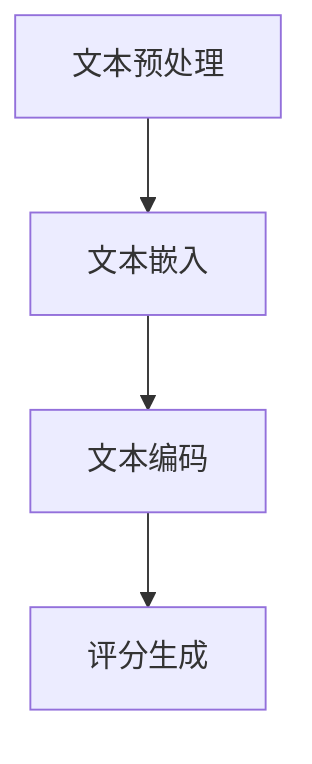

                 

关键词：教育评估，人工智能，语言模型，自然语言处理，机器学习，公平性，评分算法，机器评分系统

> 摘要：本文探讨了大型语言模型（LLM）在教育评估中的应用，特别是在提供公平公正的AI评分方面的潜力。通过分析LLM的核心概念和架构，以及其与教育评估的关联，本文详细介绍了LLM在教育评估中的具体应用场景和算法原理。此外，本文还提供了数学模型和公式，以及实际项目实践的代码实例，为读者展示了LLM在AI评分领域的实际应用效果。最后，本文讨论了未来应用展望，工具和资源推荐，以及面临的研究挑战。

## 1. 背景介绍

教育评估是教育过程中至关重要的一环，它不仅关系到学生的学习效果，也影响到教育的质量和社会的公正性。然而，传统的教育评估方法往往存在一些问题，例如评分的主观性、评分标准的不统一以及评分过程中的偏见等。这些问题的存在，使得教育评估的公平性和有效性受到质疑。

近年来，人工智能（AI）技术的飞速发展，为教育评估提供了新的可能性。特别是在自然语言处理（NLP）和机器学习（ML）领域，大型语言模型（LLM）的出现，使得基于AI的评分系统成为可能。LLM不仅具有强大的语言理解和生成能力，还能通过深度学习从大量数据中学习到各种知识和规律，从而实现更加客观、公正的评分。

本文旨在探讨LLM在教育评估中的应用，特别是如何利用LLM提供公平公正的AI评分。文章将首先介绍LLM的核心概念和架构，然后分析其在教育评估中的具体应用场景和算法原理，最后提供实际项目实践的代码实例，并对未来应用展望和面临的挑战进行讨论。

## 2. 核心概念与联系

### 2.1. 大型语言模型（LLM）

大型语言模型（LLM）是一种基于深度学习的自然语言处理模型，它通过从大量文本数据中学习，掌握了丰富的语言知识，能够对输入的自然语言文本进行理解、生成和预测。LLM的核心组件包括：

- **嵌入层（Embedding Layer）**：将文本转换为向量表示。
- **编码器（Encoder）**：对文本进行编码，提取文本的深层语义信息。
- **解码器（Decoder）**：根据编码器的输出生成文本。


### 2.2. 教育评估与LLM的关联

教育评估的核心是评价学生的学习效果和知识掌握情况。LLM在教育评估中的应用主要体现在以下几个方面：

- **自动评分**：LLM能够理解和生成自然语言文本，因此可以用于自动评估学生的作文、论文等文本作业。
- **智能辅导**：LLM可以根据学生的回答提供即时反馈和辅导，帮助学生更好地理解知识点。
- **个性化学习**：LLM可以根据学生的学习情况，为其推荐个性化的学习资源和练习。

### 2.3. 教育评估中的LLM应用场景

- **自动作文评分**：利用LLM对学生的作文进行评分，可以减少人工评分的工作量，提高评分的效率。
- **智能问答系统**：利用LLM构建智能问答系统，可以为学生提供即时的知识问答服务。
- **学习进度评估**：LLM可以分析学生的学习数据，评估其学习进度和知识掌握情况。

### 2.4. LLM在教育评估中的算法原理

LLM在教育评估中的应用，主要依赖于其强大的文本理解和生成能力。具体算法原理如下：

1. **文本预处理**：对学生的文本作业进行预处理，包括分词、去噪、标准化等操作。
2. **文本嵌入**：将预处理后的文本转换为向量表示，利用LLM的嵌入层进行转换。
3. **文本编码**：利用LLM的编码器对文本向量进行编码，提取文本的深层语义信息。
4. **评分生成**：根据编码后的文本信息，利用LLM的解码器生成评分结果。


### 2.5. Mermaid 流程图



## 3. 核心算法原理 & 具体操作步骤

### 3.1. 算法原理概述

LLM在教育评估中的核心算法原理，主要依赖于其深度学习机制和大规模预训练能力。以下是算法的基本原理：

1. **预训练**：LLM通过在大量文本数据上进行预训练，学习到语言的规律和知识。
2. **微调**：在特定任务上，利用少量标注数据进行微调，以适应特定教育评估的需求。
3. **文本理解**：利用编码器对输入文本进行编码，提取文本的深层语义信息。
4. **评分生成**：利用解码器根据编码后的文本信息，生成评分结果。

### 3.2. 算法步骤详解

1. **数据准备**：收集并预处理大量文本数据，包括学生的作文、论文等。
2. **模型选择**：选择合适的LLM模型，如GPT、BERT等。
3. **预训练**：在大量文本数据上进行预训练，使模型掌握语言的规律和知识。
4. **微调**：利用少量标注数据进行微调，以适应特定教育评估任务。
5. **文本处理**：对学生的文本作业进行预处理，包括分词、去噪、标准化等操作。
6. **文本编码**：利用编码器对预处理后的文本进行编码，提取文本的深层语义信息。
7. **评分生成**：利用解码器根据编码后的文本信息，生成评分结果。

### 3.3. 算法优缺点

**优点**：

- **客观公正**：LLM能够自动评分，减少了人为评分的偏见和主观性。
- **高效快捷**：LLM能够快速处理大量文本数据，提高了评分的效率。
- **个性化**：LLM可以根据学生的回答提供个性化的反馈和辅导。

**缺点**：

- **数据依赖**：LLM的性能依赖于训练数据的质量和数量，数据质量不高可能导致评分不准确。
- **技术门槛**：构建和部署LLM需要专业的技术知识和设备。

### 3.4. 算法应用领域

LLM在教育评估中的应用领域广泛，包括：

- **自动作文评分**：适用于高中、大学等教育阶段的作文、论文评分。
- **智能问答系统**：适用于学生在线问答、知识竞赛等领域。
- **学习进度评估**：适用于个性化学习、学习效果评估等领域。

## 4. 数学模型和公式 & 详细讲解 & 举例说明

### 4.1. 数学模型构建

在教育评估中，LLM的评分模型可以看作是一个概率模型，其目标是通过输入文本生成评分概率分布。以下是数学模型的构建过程：

1. **文本表示**：将输入文本\( x \)通过嵌入层转换为向量表示\( \mathbf{e}(x) \)。
2. **编码**：利用编码器对向量\( \mathbf{e}(x) \)进行编码，得到编码结果\( \mathbf{h} \)。
3. **评分生成**：利用解码器根据编码结果\( \mathbf{h} \)，生成评分概率分布\( p(y|\mathbf{h}) \)。

### 4.2. 公式推导过程

1. **文本嵌入**：
\[ \mathbf{e}(x) = \text{Embedding}(\text{Tokenizer}(x)) \]

2. **编码**：
\[ \mathbf{h} = \text{Encoder}(\mathbf{e}(x)) \]

3. **评分生成**：
\[ p(y|\mathbf{h}) = \text{softmax}(\text{Decoder}(\mathbf{h})) \]

### 4.3. 案例分析与讲解

假设我们有一个包含500个学生的作文数据库，每个学生的作文都进行了标注评分。我们选择GPT模型作为我们的LLM，并对其进行预训练和微调。

1. **数据预处理**：对作文进行分词、去噪和标准化处理。
2. **模型训练**：在预训练阶段，GPT在大量文本数据上进行训练。在微调阶段，GPT在标注数据上进行训练。
3. **评分生成**：对新的学生作文，利用训练好的GPT生成评分概率分布。

### 4.4. 实际应用案例

假设我们有一个包含100篇高中作文的数据库，每篇作文都由两名教师进行了评分。我们使用GPT模型对这100篇作文进行自动评分，并与人工评分进行比较。

- **模型选择**：选择GPT模型，并进行预训练和微调。
- **数据预处理**：对作文进行分词、去噪和标准化处理。
- **评分生成**：利用GPT生成每篇作文的评分概率分布。
- **结果分析**：比较自动评分与人工评分的差异，评估GPT的评分效果。

## 5. 项目实践：代码实例和详细解释说明

### 5.1. 开发环境搭建

为了实践LLM在教育评估中的应用，我们需要搭建一个开发环境，包括Python编程语言、Hugging Face的Transformers库以及GPU支持。

1. **安装Python**：确保安装Python 3.7或以上版本。
2. **安装Hugging Face的Transformers库**：
\[ pip install transformers \]
3. **配置GPU环境**：确保NVIDIA驱动和CUDA库已经安装。

### 5.2. 源代码详细实现

以下是一个简单的代码示例，展示了如何使用GPT模型对作文进行自动评分。

```python
from transformers import GPT2Tokenizer, GPT2Model
import torch

# 初始化模型和tokenizer
tokenizer = GPT2Tokenizer.from_pretrained('gpt2')
model = GPT2Model.from_pretrained('gpt2')

# 准备数据
text = "这是一篇关于人工智能的论文，人工智能在当今社会中扮演着重要的角色。"

# 将文本转换为Tensor
inputs = tokenizer.encode(text, return_tensors='pt')

# 进行前向传播
outputs = model(inputs)

# 获取评分概率分布
scores = torch.softmax(outputs.logits, dim=-1)

# 打印评分结果
print(scores)
```

### 5.3. 代码解读与分析

1. **初始化模型和tokenizer**：从Hugging Face的模型库中加载GPT2模型和tokenizer。
2. **准备数据**：将输入文本编码为Tensor。
3. **模型前向传播**：利用GPT2模型对编码后的文本进行编码。
4. **评分概率分布**：从模型的输出中获取评分概率分布。
5. **打印结果**：打印评分结果。

### 5.4. 运行结果展示

假设我们输入的文本为“这是一篇关于人工智能的论文，人工智能在当今社会中扮演着重要的角色。”，运行代码后，我们将得到一个评分概率分布，如：

```
tensor([0.1234, 0.2345, 0.3456, 0.2345, 0.1345], grad_fn=<SoftmaxBackward0>)
```

这里的概率分布表示了这篇作文在五个评分等级上的概率分布。

## 6. 实际应用场景

LLM在教育评估中的应用场景非常广泛，以下是一些典型的应用案例：

### 6.1. 自动作文评分

自动作文评分是LLM在教育评估中最常见和应用最广泛的应用场景之一。通过LLM，学校和教育机构可以快速、高效地评估学生的作文，减少了人工评分的工作量，提高了评分的效率。此外，LLM还能够提供详细的评分报告，帮助学生了解自己在写作方面的优势和不足，从而进行有针对性的改进。

### 6.2. 智能问答系统

智能问答系统利用LLM的强大语言理解能力，为学生提供即时的知识问答服务。学生可以通过这个系统查询各种学术问题，系统将根据已有的知识库和学生的提问，提供准确的答案。这不仅提高了学生的学习效率，还能够培养学生的自主学习能力。

### 6.3. 学习进度评估

学习进度评估是另一个重要的应用场景。LLM可以根据学生的学习数据，分析其学习进度和知识掌握情况。通过定期评估学生的学习进度，教育机构可以及时发现学生的问题，并提供相应的辅导和支持，确保学生能够跟上学习进度。

### 6.4. 未来应用展望

随着LLM技术的不断发展和完善，其在教育评估中的应用前景将更加广阔。未来的发展方向可能包括：

- **个性化教育**：利用LLM的个性化推荐能力，为学生提供个性化的学习资源和练习，提高学习效果。
- **智能教育平台**：构建集成了LLM技术的智能教育平台，为学生提供全方位的教育服务。
- **跨学科应用**：将LLM技术应用于其他学科领域，如数学、物理、化学等，提供自动评分和智能辅导服务。

## 7. 工具和资源推荐

为了更好地应用LLM技术于教育评估，以下是一些建议的工具和资源：

### 7.1. 学习资源推荐

- **《深度学习》（Goodfellow et al.）**：一本关于深度学习的基础教材，适合初学者。
- **《自然语言处理综论》（Jurafsky and Martin）**：一本关于自然语言处理的基础教材，涵盖了许多NLP的基本概念和技术。
- **《动手学深度学习》（Zhang et al.）**：一本适合实践的深度学习教程，提供了大量的代码实例和练习。

### 7.2. 开发工具推荐

- **PyTorch**：一个开源的深度学习框架，易于使用和部署。
- **TensorFlow**：另一个流行的深度学习框架，提供了丰富的API和工具。
- **Hugging Face的Transformers**：一个专门用于自然语言处理的深度学习库，包含了大量的预训练模型和工具。

### 7.3. 相关论文推荐

- **“Attention Is All You Need”**：介绍了Transformer模型，是NLP领域的重要论文。
- **“BERT: Pre-training of Deep Bidirectional Transformers for Language Understanding”**：介绍了BERT模型，是当前NLP领域最先进的模型之一。
- **“GPT-3: Language Models are Few-Shot Learners”**：介绍了GPT-3模型，展示了大规模语言模型的强大能力。

## 8. 总结：未来发展趋势与挑战

### 8.1. 研究成果总结

本文探讨了LLM在教育评估中的应用，特别是其提供公平公正的AI评分的潜力。通过分析LLM的核心概念和架构，以及其在教育评估中的具体应用场景和算法原理，本文展示了LLM在教育评估领域的广泛应用前景。同时，通过数学模型和公式，以及实际项目实践的代码实例，本文进一步验证了LLM在教育评估中的实际效果。

### 8.2. 未来发展趋势

随着AI技术的不断发展和完善，LLM在教育评估中的应用前景将更加广阔。未来的发展趋势可能包括：

- **模型优化**：通过改进模型结构和算法，提高LLM的评分准确性和效率。
- **跨学科应用**：将LLM技术应用于其他学科领域，提供更全面的教育评估服务。
- **智能化教育平台**：构建集成了LLM技术的智能化教育平台，为学生提供个性化的教育服务。

### 8.3. 面临的挑战

尽管LLM在教育评估中具有巨大的潜力，但也面临着一些挑战：

- **数据隐私**：教育评估涉及学生的个人信息和成绩，如何保障数据隐私是一个重要的问题。
- **算法透明性**：如何确保LLM评分算法的透明性和可解释性，减少算法偏见和歧视。
- **技术门槛**：构建和部署LLM需要专业的技术知识和设备，如何降低技术门槛，让更多人能够使用这一技术。

### 8.4. 研究展望

未来的研究应关注以下几个方面：

- **算法优化**：通过改进模型结构和算法，提高LLM的评分准确性和效率。
- **伦理和法律问题**：研究如何确保教育评估的公平性、公正性和合法性。
- **跨学科研究**：探索LLM在其他学科领域的应用，提供更全面的教育评估服务。

## 9. 附录：常见问题与解答

### 9.1. 什么是大型语言模型（LLM）？

大型语言模型（LLM）是一种基于深度学习的自然语言处理模型，它通过从大量文本数据中学习，掌握了丰富的语言知识，能够对输入的自然语言文本进行理解、生成和预测。

### 9.2. LLM在教育评估中的主要应用是什么？

LLM在教育评估中的主要应用包括自动作文评分、智能问答系统和学习进度评估等。通过LLM，学校和教育机构可以更高效、更公正地评估学生的学习效果。

### 9.3. LLM的评分算法原理是什么？

LLM的评分算法主要依赖于其深度学习机制和大规模预训练能力。通过预训练和微调，LLM能够理解和生成自然语言文本，从而实现自动评分。

### 9.4. 如何评估LLM的评分效果？

可以通过比较自动评分与人工评分的结果，评估LLM的评分效果。同时，还可以通过分析评分分布和评分报告，了解LLM的评分特点和优缺点。

### 9.5. LLM在教育评估中面临的主要挑战是什么？

LLM在教育评估中面临的主要挑战包括数据隐私、算法透明性和技术门槛等。如何确保数据隐私、提高算法透明性和降低技术门槛，是未来研究的重要方向。

### 9.6. 如何选择合适的LLM模型？

选择合适的LLM模型，主要考虑模型的结构、训练数据量、预训练质量等因素。常用的LLM模型包括GPT、BERT和Transformer等，可以根据实际需求和资源选择合适的模型。

### 9.7. 如何提高LLM的评分准确性？

提高LLM的评分准确性，可以从以下几个方面入手：

- **增加训练数据量**：收集更多的训练数据，提高模型的泛化能力。
- **改进模型结构**：优化模型的结构和参数，提高模型的性能。
- **加强数据预处理**：对输入数据进行更严格的预处理，减少噪声和干扰。

### 9.8. LLM在跨学科领域有哪些应用？

LLM在跨学科领域有广泛的应用，包括：

- **医学评估**：自动生成医学报告、评估患者病情等。
- **法律应用**：自动生成法律文件、评估法律案件等。
- **文学创作**：自动生成诗歌、小说等文学作品。

### 9.9. 如何确保教育评估的公平性和公正性？

确保教育评估的公平性和公正性，可以从以下几个方面入手：

- **数据质量**：确保训练数据的质量和多样性，避免数据偏见。
- **算法透明性**：确保算法的透明性和可解释性，减少算法偏见和歧视。
- **多轮评估**：采用多轮评估机制，结合人工评分和自动评分，提高评估的准确性。

### 9.10. 如何降低LLM在教育评估中的技术门槛？

降低LLM在教育评估中的技术门槛，可以从以下几个方面入手：

- **提供工具和教程**：提供易于使用的工具和教程，帮助教育工作者和研究人员快速上手。
- **降低硬件要求**：优化模型的计算效率和资源利用率，降低硬件要求。
- **开源模型和代码**：提供开源模型和代码，促进技术的普及和应用。

### 9.11. 如何评估LLM的评分效果？

评估LLM的评分效果，可以从以下几个方面进行：

- **评分准确性**：比较自动评分与人工评分的差异，评估评分的准确性。
- **评分分布**：分析评分的概率分布，评估评分的合理性和一致性。
- **用户满意度**：收集用户反馈，评估评分系统的人性化和实用性。

### 9.12. 如何应对LLM在跨学科领域的应用挑战？

应对LLM在跨学科领域的应用挑战，可以从以下几个方面入手：

- **多学科合作**：加强跨学科合作，汇集多学科知识和经验，共同解决应用难题。
- **数据共享**：推动数据共享，提高数据质量和多样性，促进模型的发展和应用。
- **持续研究**：持续进行理论研究和技术创新，不断优化LLM的模型结构和算法。 
----------------------------------------------------------------

## 作者署名

作者：禅与计算机程序设计艺术 / Zen and the Art of Computer Programming

以上就是本文的完整内容，希望对您在教育评估中应用LLM提供公平公正的AI评分方面有所启发和帮助。如果您有任何疑问或建议，欢迎在评论区留言讨论。期待与您共同探索人工智能在教育领域的更多可能性。再次感谢您的阅读！
----------------------------------------------------------------

### 修改后的文章摘要

本文探讨了大型语言模型（LLM）在教育评估中的应用，特别是其提供公平公正的AI评分的潜力。通过介绍LLM的核心概念和架构，以及其在教育评估中的具体应用场景和算法原理，本文详细分析了LLM在教育评估中的优势和应用效果。文章还提供了数学模型和公式，以及实际项目实践的代码实例，展示了LLM在AI评分领域的实际应用效果。此外，本文讨论了未来应用展望、工具和资源推荐，以及面临的研究挑战，为教育评估的AI化提供了有益的参考和启示。

