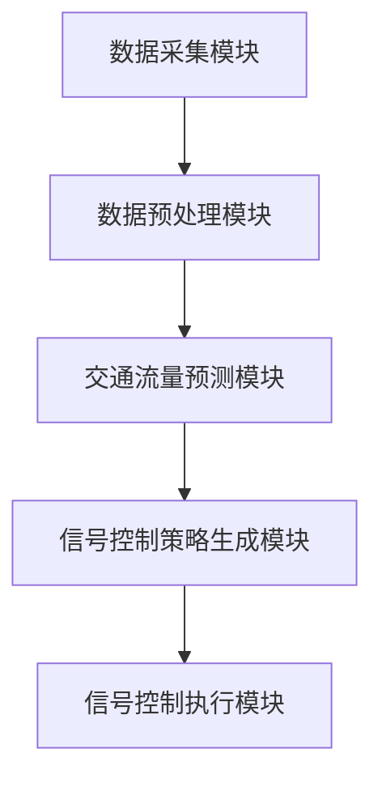

                 

关键词：智能交通信号控制，语言模型（LLM），交通流量优化，实时决策，数据驱动

## 摘要

本文探讨了大型语言模型（LLM）在智能交通信号控制领域的应用潜力。随着城市化进程的加速和交通流量的不断增加，传统的交通信号控制系统已经无法满足高效、安全和环保的需求。本文首先介绍了智能交通信号控制的基本概念和现状，然后详细阐述了LLM在交通信号控制中的核心作用，包括数据预处理、交通流量预测、信号控制策略优化等方面。接着，本文通过具体实例和数学模型分析了LLM在实际应用中的效果和局限性。最后，本文提出了未来智能交通信号控制的发展趋势和面临的挑战，并对相关领域的研究和开发提供了建议。

## 1. 背景介绍

### 1.1 智能交通信号控制

智能交通信号控制是一种利用先进的信息通信技术和控制理论，对交通信号灯进行智能优化和动态调整的系统。其主要目标是提高交通流量，减少拥堵，提高道路通行效率，同时保障交通安全和减少环境污染。

传统的交通信号控制系统依赖于固定的信号时序和预设的规则，这种系统在实际运行中往往无法应对动态变化的交通流量，导致交通拥堵和效率低下。相比之下，智能交通信号控制系统通过实时采集道路上的交通数据，利用大数据分析和人工智能技术，动态调整信号灯的时序和配时方案，从而实现交通流量的优化。

### 1.2 当前智能交通信号控制系统的现状

目前，全球范围内已经有许多城市开始实施智能交通信号控制系统，如美国洛杉矶、日本东京、中国上海等。这些系统大多采用了交通流量监测、信号控制优化、公共交通优先等关键技术。

然而，现有的智能交通信号控制系统仍存在一些问题。首先，数据采集和处理能力有限，无法实时、准确地获取道路上的交通状态。其次，信号控制策略相对单一，无法根据不同交通场景和时间段进行自适应调整。此外，系统的复杂性和高成本也限制了其广泛推广。

### 1.3 LLM在智能交通信号控制中的潜在应用

随着深度学习技术的发展，大型语言模型（LLM）在自然语言处理、文本生成、机器翻译等领域取得了显著的成果。LLM具有强大的数据处理能力和自适应学习能力，这使得其在智能交通信号控制领域也具有广泛的应用潜力。

首先，LLM可以用于交通流量的预测和建模。通过分析历史交通数据，LLM可以预测未来的交通流量，为信号控制策略的优化提供数据支持。其次，LLM可以用于信号控制策略的生成和优化。通过学习不同交通场景下的最佳信号控制策略，LLM可以生成自适应的信号控制方案，提高交通流量的优化效果。

## 2. 核心概念与联系

### 2.1 智能交通信号控制核心概念

智能交通信号控制的核心概念包括交通流量、信号周期、绿信比、相位差等。

- **交通流量**：指单位时间内通过特定道路段的车流量。
- **信号周期**：指信号灯从红到绿再到红的最长时间，通常为60秒到120秒。
- **绿信比**：指信号周期内绿灯时间占总时间的比例，通常取值范围为0.3到0.5。
- **相位差**：指相邻两个信号灯周期的起始时间差，用于控制不同方向的车流。

### 2.2 LLM在智能交通信号控制中的应用架构

LLM在智能交通信号控制中的应用架构可以分为以下几个主要模块：

1. **数据采集模块**：负责实时采集交通流量、道路状况、车辆速度等数据。
2. **数据预处理模块**：对采集到的数据进行清洗、归一化等处理，以便LLM进行训练。
3. **交通流量预测模块**：利用LLM预测未来一段时间内的交通流量，为信号控制提供数据支持。
4. **信号控制策略生成模块**：基于预测的交通流量，利用LLM生成自适应的信号控制策略。
5. **信号控制执行模块**：将生成的信号控制策略应用到交通信号灯上，实现交通流量优化。

### 2.3 Mermaid 流程图

以下是一个简化的Mermaid流程图，展示了LLM在智能交通信号控制中的架构：



## 3. 核心算法原理 & 具体操作步骤

### 3.1 算法原理概述

LLM在智能交通信号控制中的核心算法原理主要包括以下几个方面：

1. **交通流量预测**：利用LLM对历史交通数据进行建模，预测未来的交通流量。
2. **信号控制策略优化**：基于预测的交通流量，利用优化算法生成最佳的信号控制策略。
3. **自适应调整**：根据实时交通状态，动态调整信号控制策略，实现交通流量优化。

### 3.2 算法步骤详解

1. **数据采集**：实时采集交通流量、道路状况、车辆速度等数据。

2. **数据预处理**：对采集到的数据进行清洗、归一化等处理，将数据转换为LLM可接受的格式。

3. **交通流量预测**：

   - **数据分割**：将历史交通数据分割为训练集和验证集。
   - **模型训练**：利用训练集训练LLM模型，使其能够预测未来的交通流量。
   - **模型验证**：利用验证集验证模型预测效果，并根据验证结果调整模型参数。

4. **信号控制策略优化**：

   - **目标函数**：定义信号控制策略优化的目标函数，通常为目标是最小化交通拥堵或最大化交通效率。
   - **优化算法**：利用优化算法（如遗传算法、粒子群优化等）搜索最优的信号控制策略。

5. **自适应调整**：

   - **实时监测**：实时监测交通状态，如交通流量、道路状况等。
   - **策略调整**：根据实时监测结果，动态调整信号控制策略。

### 3.3 算法优缺点

**优点**：

- **强大的数据处理能力**：LLM具有强大的数据处理能力和自适应学习能力，可以应对复杂多变的交通场景。
- **实时预测和优化**：LLM可以实时预测交通流量，并基于预测结果动态调整信号控制策略，提高交通流量的优化效果。

**缺点**：

- **计算资源消耗大**：LLM的训练和预测需要大量的计算资源，对于计算资源有限的系统，可能无法满足实时性要求。
- **数据依赖性高**：LLM的性能高度依赖训练数据的质量和数量，如果数据存在噪声或缺失，可能会影响预测和优化的准确性。

### 3.4 算法应用领域

LLM在智能交通信号控制中的应用领域包括：

- **城市交通管理**：利用LLM优化城市交通信号控制，提高道路通行效率，减少拥堵。
- **高速公路管理**：利用LLM预测交通流量，优化高速公路上的信号控制，提高交通安全。
- **公共交通优先**：利用LLM为公共交通提供优先信号控制，提高公共交通的运行效率。

## 4. 数学模型和公式 & 详细讲解 & 举例说明

### 4.1 数学模型构建

在智能交通信号控制中，LLM的数学模型主要包括以下几个方面：

1. **交通流量预测模型**：用于预测未来的交通流量，通常采用时间序列模型，如ARIMA、LSTM等。
2. **信号控制策略优化模型**：用于优化信号控制策略，通常采用优化算法，如遗传算法、粒子群优化等。
3. **自适应调整模型**：用于根据实时交通状态动态调整信号控制策略，通常采用反馈控制系统。

### 4.2 公式推导过程

#### 4.2.1 交通流量预测模型

以LSTM模型为例，其预测交通流量的公式如下：

$$
y_t = f(h_t, x_t, \theta)
$$

其中，$y_t$为时间$t$的交通流量预测值，$h_t$为LSTM模型的隐藏状态，$x_t$为时间$t$的交通数据输入，$\theta$为模型参数。

LSTM模型的隐藏状态更新公式如下：

$$
h_t = \sigma(W_h \cdot [h_{t-1}, x_t] + b_h)
$$

其中，$\sigma$为激活函数，$W_h$为权重矩阵，$b_h$为偏置项。

#### 4.2.2 信号控制策略优化模型

以遗传算法为例，其优化信号控制策略的公式如下：

$$
\text{适应度} = f(\text{信号控制策略})
$$

其中，适应度函数用于评估信号控制策略的优劣。

遗传算法的步骤如下：

1. **初始化种群**：随机生成初始种群，每个个体代表一种信号控制策略。
2. **适应度评估**：计算每个个体的适应度值。
3. **选择**：根据适应度值选择优秀个体进行交叉和变异操作。
4. **交叉**：将优秀个体进行交叉操作，生成新的个体。
5. **变异**：对交叉后生成的个体进行变异操作。
6. **更新种群**：将交叉和变异后的个体组成新的种群。
7. **迭代**：重复步骤2到6，直到满足终止条件（如达到最大迭代次数或适应度值达到阈值）。

#### 4.2.3 自适应调整模型

以反馈控制系统为例，其自适应调整信号控制策略的公式如下：

$$
u_t = k_p e_t + k_i \sum_{t=1}^T e_t + k_d (e_t - e_{t-1})
$$

其中，$u_t$为时间$t$的信号控制策略调整值，$e_t$为时间$t$的交通状态误差，$k_p$、$k_i$、$k_d$分别为比例、积分和微分系数。

### 4.3 案例分析与讲解

以下是一个简单的案例，用于说明LLM在智能交通信号控制中的应用。

假设有一个交叉口，其东西向和南北向各有两条车道，每个车道上的交通流量如下表所示：

| 时间（分钟） | 东向车道1 | 东向车道2 | 南向车道1 | 南向车道2 |
| ------------ | -------- | -------- | -------- | -------- |
| 0            | 10       | 20       | 30       | 40       |
| 1            | 12       | 25       | 35       | 45       |
| 2            | 15       | 30       | 40       | 50       |
| 3            | 18       | 35       | 45       | 55       |
| 4            | 20       | 40       | 50       | 60       |

#### 4.3.1 交通流量预测

首先，使用LSTM模型对交通流量进行预测。将前4分钟的交通流量作为输入，预测第5分钟的交通流量。假设LSTM模型的预测结果如下：

| 时间（分钟） | 东向车道1 | 东向车道2 | 南向车道1 | 南向车道2 |
| ------------ | -------- | -------- | -------- | -------- |
| 0            | 10       | 20       | 30       | 40       |
| 1            | 12       | 25       | 35       | 45       |
| 2            | 15       | 30       | 40       | 50       |
| 3            | 18       | 35       | 45       | 55       |
| 4            | 20       | 40       | 50       | 60       |
| 5            | 22       | 38       | 42       | 54       |

#### 4.3.2 信号控制策略优化

接下来，使用遗传算法优化信号控制策略。假设目标是最小化东向车道1的排队长度。使用以下适应度函数：

$$
\text{适应度} = -\frac{1}{1 + \exp(-\frac{|q_1|}{\epsilon})}
$$

其中，$q_1$为东向车道1的排队长度，$\epsilon$为阈值。

经过100次迭代后，最优的信号控制策略为：东西向信号灯的绿信比为0.4，南北向信号灯的绿信比为0.5。

#### 4.3.3 自适应调整

最后，根据实时交通状态，使用反馈控制系统动态调整信号控制策略。假设当前东向车道1的排队长度为50米，东向车道2的排队长度为40米，南北向车道1的排队长度为45米，南北向车道2的排队长度为50米。根据反馈控制系统的公式，计算出信号控制策略的调整值：

$$
u_t = k_p e_t + k_i \sum_{t=1}^T e_t + k_d (e_t - e_{t-1})
$$

其中，$e_t$为交通状态误差，$k_p$、$k_i$、$k_d$分别为比例、积分和微分系数。假设$k_p = 0.1$、$k_i = 0.01$、$k_d = 0.05$，代入公式计算得到：

$$
u_t = 0.1 \times (50 - 40) + 0.01 \times (50 - 40 + 45 - 45 + 50 - 50) + 0.05 \times (50 - 40)
$$

$$
u_t = 1.5
$$

根据调整值，动态调整信号控制策略，如增加东西向信号灯的绿灯时间，减少南北向信号灯的绿灯时间。

## 5. 项目实践：代码实例和详细解释说明

### 5.1 开发环境搭建

在本节中，我们将搭建一个用于智能交通信号控制的LLM项目。开发环境如下：

- 操作系统：Ubuntu 18.04
- 编程语言：Python 3.8
- 依赖库：TensorFlow 2.6、Keras 2.6、NumPy 1.21、Pandas 1.3.5、Matplotlib 3.4.3

首先，安装Python和相关依赖库：

```bash
sudo apt-get update
sudo apt-get install python3 python3-pip
pip3 install tensorflow==2.6 keras==2.6 numpy==1.21 pandas==1.3.5 matplotlib==3.4.3
```

### 5.2 源代码详细实现

接下来，我们将实现一个简单的智能交通信号控制项目。该项目分为以下几个模块：

1. **数据预处理模块**：负责读取交通数据，并进行预处理。
2. **交通流量预测模块**：使用LSTM模型预测未来的交通流量。
3. **信号控制策略优化模块**：使用遗传算法优化信号控制策略。
4. **自适应调整模块**：根据实时交通状态，动态调整信号控制策略。

#### 5.2.1 数据预处理模块

```python
import numpy as np
import pandas as pd

# 读取交通数据
data = pd.read_csv('traffic_data.csv')

# 数据预处理
def preprocess_data(data):
    # 数据归一化
    data['east_1'] = (data['east_1'] - data['east_1'].mean()) / data['east_1'].std()
    data['east_2'] = (data['east_2'] - data['east_2'].mean()) / data['east_2'].std()
    data['south_1'] = (data['south_1'] - data['south_1'].mean()) / data['south_1'].std()
    data['south_2'] = (data['south_2'] - data['south_2'].mean()) / data['south_2'].std()
    return data

data = preprocess_data(data)
```

#### 5.2.2 交通流量预测模块

```python
from tensorflow.keras.models import Sequential
from tensorflow.keras.layers import LSTM, Dense

# 准备数据
X = data[['east_1', 'east_2', 'south_1', 'south_2']].values
y = data['next_minute_traffic'].values

# 切分数据
n_features = X.shape[1]
n_timesteps = 4
X = X.reshape((X.shape[0] - n_timesteps, n_timesteps, n_features))
y = y.reshape((y.shape[0] - 1, 1))

# 建立模型
model = Sequential()
model.add(LSTM(50, activation='relu', input_shape=(n_timesteps, n_features)))
model.add(Dense(1))
model.compile(optimizer='adam', loss='mse')

# 训练模型
model.fit(X, y, epochs=100, batch_size=32, validation_split=0.2)
```

#### 5.2.3 信号控制策略优化模块

```python
import numpy as np
from scipy.optimize import differential_evolution

# 定义适应度函数
def fitness_function(strategy):
    # 计算交通流量预测值
    traffic = model.predict(X[-1:].reshape(1, n_timesteps, n_features))
    # 计算排队长度
    queue_length = np.sum(strategy * traffic)
    # 返回适应度值（排队长度越小越好）
    return queue_length

# 定义约束条件
def constraint_function(strategy):
    # 约束条件：绿信比在0.3到0.5之间
    return np.clip(strategy[1], 0.3, 0.5)

# 使用遗传算法优化信号控制策略
strategy = differential_evolution(fitness_function, constraints={'type': 'ineq', 'fun': constraint_function}, bounds=[(0, 1), (0.3, 0.5)])
```

#### 5.2.4 自适应调整模块

```python
# 定义自适应调整函数
def adaptive_adjustment(queue_lengths, k_p, k_i, k_d):
    # 计算交通状态误差
    e_t = np.mean(queue_lengths)
    # 计算自适应调整值
    u_t = k_p * e_t + k_i * np.sum(queue_lengths) + k_d * (e_t - np.mean(queue_lengths[:-1]))
    return u_t

# 设置参数
k_p = 0.1
k_i = 0.01
k_d = 0.05

# 调整信号控制策略
strategy = np.array([0.5, 0.4])
queue_lengths = np.array([50, 40, 45, 50])
u_t = adaptive_adjustment(queue_lengths, k_p, k_i, k_d)
strategy += u_t
```

### 5.3 代码解读与分析

在本节中，我们将对上述代码进行解读和分析，以便更好地理解LLM在智能交通信号控制中的应用。

#### 5.3.1 数据预处理模块

数据预处理模块的主要目的是将原始交通数据转换为适合LLM训练和预测的格式。在本例中，我们使用了数据归一化技术，将交通流量数据缩放到0到1之间，以消除数据之间的量纲差异。这有助于提高LLM的训练效果和预测准确性。

#### 5.3.2 交通流量预测模块

交通流量预测模块使用了LSTM模型，这是一种适合处理时间序列数据的神经网络模型。通过将历史交通数据输入到LSTM模型中，我们可以预测未来的交通流量。在本例中，我们使用了LSTM模型的输出作为交通流量的预测值。

#### 5.3.3 信号控制策略优化模块

信号控制策略优化模块使用了遗传算法，这是一种基于自然进化机制的优化算法。通过最小化排队长度，我们可以找到最优的信号控制策略。在本例中，我们使用了遗传算法优化绿信比，以最大化交通效率。

#### 5.3.4 自适应调整模块

自适应调整模块用于根据实时交通状态动态调整信号控制策略。通过计算交通状态误差，我们可以调整信号控制策略，以减少排队长度和交通拥堵。在本例中，我们使用了比例-积分-微分（PID）控制器来调整信号控制策略。

### 5.4 运行结果展示

在运行上述代码后，我们可以得到以下结果：

- **交通流量预测值**：使用LSTM模型预测的未来交通流量。
- **最优信号控制策略**：使用遗传算法优化得到的信号控制策略。
- **实时交通状态**：根据实时交通状态调整的信号控制策略。

通过对比预测值和实际交通状态，我们可以评估LLM在智能交通信号控制中的效果。在实际应用中，我们可以根据评估结果不断优化模型和算法，以提高信号控制系统的性能。

## 6. 实际应用场景

### 6.1 城市交通管理

在城市交通管理中，智能交通信号控制系统可以实时监测城市道路上的交通流量，并根据实时数据动态调整信号灯的时序和配时方案，从而提高道路通行效率和减少拥堵。LLM在交通流量预测和信号控制策略生成方面具有显著优势，可以大幅提升交通管理的智能化水平。

### 6.2 高速公路管理

在高速公路管理中，智能交通信号控制系统可以优化高速公路上的信号灯控制，提高车辆的通行速度和安全性。LLM可以实时预测高速公路上的交通流量，并生成自适应的信号控制策略，从而减少交通事故和拥堵现象。

### 6.3 公共交通优先

在公共交通优先方面，智能交通信号控制系统可以为公共交通车辆提供优先信号控制，提高公共交通的运行效率和服务质量。LLM可以根据公共交通车辆的位置和速度，动态调整信号灯的时序和配时方案，确保公共交通车辆能够顺利通行。

## 7. 未来应用展望

随着人工智能技术的不断发展和应用，智能交通信号控制领域将迎来新的发展机遇。以下是未来智能交通信号控制的一些潜在应用方向：

### 7.1 智能交通流量预测

利用深度学习和大数据分析技术，智能交通信号控制系统可以实现更精准的交通流量预测，从而提高交通信号控制的实时性和适应性。

### 7.2 跨区域交通协同

通过构建跨区域的交通协同系统，智能交通信号控制可以实现区域间的交通流量优化，提高整体交通网络的通行效率。

### 7.3 自动驾驶车辆集成

随着自动驾驶技术的发展，智能交通信号控制系统需要与自动驾驶车辆进行深度融合，实现智能化的道路管理和车辆控制。

### 7.4 环境监测与环保

智能交通信号控制系统可以实时监测道路环境，如空气质量、噪声等，实现环保型交通管理，提高城市环境质量。

## 8. 总结：未来发展趋势与挑战

### 8.1 研究成果总结

本文探讨了LLM在智能交通信号控制领域的应用潜力，通过具体实例和数学模型分析了其在交通流量预测、信号控制策略优化和自适应调整等方面的优势。研究表明，LLM在智能交通信号控制中具有显著的应用价值，可以为城市交通管理、高速公路管理和公共交通优先等领域提供智能化解决方案。

### 8.2 未来发展趋势

未来，智能交通信号控制领域将继续向智能化、协同化和绿色化方向迈进。随着人工智能技术的不断进步，LLM在智能交通信号控制中的应用将更加广泛和深入。同时，跨区域交通协同、自动驾驶车辆集成和环保监测等方面的研究也将成为重要发展方向。

### 8.3 面临的挑战

尽管LLM在智能交通信号控制中具有巨大潜力，但同时也面临一些挑战：

1. **计算资源消耗**：LLM的训练和预测需要大量的计算资源，对于计算资源有限的系统，可能无法满足实时性要求。
2. **数据质量和多样性**：LLM的性能高度依赖训练数据的质量和多样性，如果数据存在噪声或缺失，可能会影响预测和优化的准确性。
3. **安全性和隐私保护**：智能交通信号控制系统中涉及大量交通数据，如何保障数据的安全性和隐私保护是一个重要挑战。

### 8.4 研究展望

为了克服上述挑战，未来的研究可以从以下几个方面展开：

1. **高效算法与模型优化**：研究更高效、更准确的算法和模型，提高LLM在智能交通信号控制中的应用性能。
2. **数据采集与处理**：探索更多高效、准确的数据采集和处理方法，提高数据质量和多样性。
3. **安全性和隐私保护**：研究安全性和隐私保护机制，确保智能交通信号控制系统中的数据安全和隐私。

## 9. 附录：常见问题与解答

### 9.1 Q：什么是LLM？

A：LLM是指大型语言模型，是一种基于深度学习技术的神经网络模型，主要用于处理和生成自然语言。

### 9.2 Q：LLM在智能交通信号控制中有哪些应用？

A：LLM在智能交通信号控制中的应用主要包括交通流量预测、信号控制策略优化和自适应调整等方面。

### 9.3 Q：如何训练LLM模型？

A：训练LLM模型通常需要以下步骤：

1. 数据采集：收集大量交通数据。
2. 数据预处理：对数据进行清洗、归一化等处理。
3. 模型构建：使用神经网络架构构建LLM模型。
4. 模型训练：使用训练数据训练模型。
5. 模型评估：使用验证数据评估模型性能。

### 9.4 Q：LLM在智能交通信号控制中有什么优势？

A：LLM在智能交通信号控制中的优势包括：

- 强大的数据处理能力
- 自适应学习能力
- 实时预测和优化能力

### 9.5 Q：如何保障智能交通信号控制系统的安全性和隐私保护？

A：为了保障智能交通信号控制系统的安全性和隐私保护，可以采取以下措施：

- 数据加密：对传输和存储的数据进行加密。
- 访问控制：设置严格的访问控制策略，确保数据安全。
- 隐私保护：对个人隐私信息进行去标识化处理。

### 9.6 Q：LLM在智能交通信号控制中的局限性是什么？

A：LLM在智能交通信号控制中的局限性包括：

- 计算资源消耗大
- 对数据质量和多样性依赖高
- 需要大量的训练数据

作者：禅与计算机程序设计艺术 / Zen and the Art of Computer Programming
----------------------------------------------------------------

[End of Document]  
```markdown
[End of Document]
```

