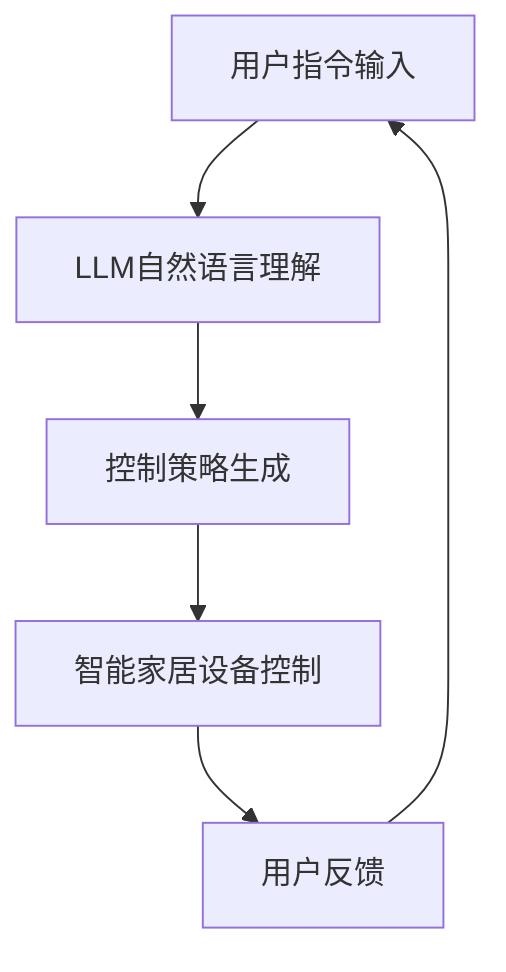

                 

关键词：LLM，智能家居，控制系统，自然语言处理，机器学习

> 摘要：本文将探讨大语言模型（LLM）在智能家居控制系统中的应用，分析其核心概念与联系，核心算法原理与具体操作步骤，数学模型与公式，项目实践，实际应用场景，未来应用展望，以及相关工具和资源的推荐。文章旨在为读者提供全面的LLM在智能家居控制系统中的应用指南，并展望未来的发展趋势与挑战。

## 1. 背景介绍

随着物联网技术的快速发展，智能家居已经成为现代生活的一个重要组成部分。智能家居控制系统通过连接各种家居设备，实现了对家庭环境的自动化管理，提升了居住的舒适度和便捷性。然而，智能家居系统的复杂性和多样性给用户带来了操作难度，特别是在使用自然语言进行交互时，如何处理用户的自然语言指令成为一个重要问题。

近年来，大语言模型（LLM）的出现为智能家居控制系统带来了新的解决方案。LLM是一种基于深度学习技术的自然语言处理模型，具有强大的文本理解和生成能力。通过将LLM集成到智能家居控制系统中，可以实现更加智能化的语音交互，提高用户的体验和满意度。

本文将首先介绍LLM的基本原理和特点，然后分析其在智能家居控制系统中的应用场景，最后探讨未来的发展趋势和面临的挑战。

### 1.1 智能家居系统的发展

智能家居系统起源于20世纪90年代，随着互联网、无线通信和物联网技术的快速发展，智能家居系统逐渐从简单的自动化设备升级为高度集成的智能网络系统。目前，智能家居系统主要包含以下几个方面的功能：

- **设备控制**：通过智能手机、平板电脑等设备远程控制家居设备的开关、调节等功能。
- **环境监测**：监测室内温度、湿度、空气质量等参数，提供相应的调节和建议。
- **安防报警**：通过监控摄像头、门磁感应器等设备，实现家庭安全防护。
- **能源管理**：通过智能插座、智能灯光等设备，实现家庭能源的优化管理。

### 1.2 自然语言处理技术的发展

自然语言处理（NLP）是人工智能的一个重要分支，旨在使计算机能够理解、生成和处理人类语言。近年来，随着深度学习技术的应用，NLP取得了显著的进展，特别是在文本分类、情感分析、机器翻译等方面。

自然语言处理技术的发展为智能家居控制系统提供了强大的支持。通过NLP技术，智能家居系统可以更好地理解用户的自然语言指令，实现更加智能化的交互。

### 1.3 大语言模型（LLM）的基本原理和特点

大语言模型（LLM）是一种基于深度学习技术的自然语言处理模型，具有以下基本原理和特点：

- **神经网络架构**：LLM通常采用深度神经网络（DNN）或变换器模型（Transformer）作为基本架构，通过多层神经网络对输入的文本进行编码和解码。
- **大规模训练数据**：LLM的训练数据通常来源于互联网上的大量文本数据，包括新闻、文章、社交媒体等，通过对这些数据进行训练，LLM能够学习到丰富的语言知识。
- **文本理解和生成能力**：LLM具有强大的文本理解和生成能力，能够理解用户的自然语言指令，并生成相应的操作命令，实现智能家居设备的控制。

## 2. 核心概念与联系

在探讨LLM在智能家居控制系统中的应用之前，我们需要先了解一些核心概念和联系。

### 2.1 智能家居控制系统的架构

智能家居控制系统的架构通常包括以下几个层次：

- **感知层**：通过各种传感器和设备收集家庭环境的参数，如温度、湿度、光照等。
- **通信层**：负责感知层和执行层之间的数据传输和通信，通常采用无线通信技术，如Wi-Fi、蓝牙等。
- **执行层**：根据控制策略，执行具体的操作，如开关灯、调节温度等。
- **智能控制层**：通过算法和模型对感知层收集的数据进行处理和分析，生成相应的控制策略。

### 2.2 LLM在智能家居控制系统中的作用

LLM在智能家居控制系统中主要发挥以下作用：

- **自然语言理解**：LLM可以理解用户的自然语言指令，如“打开客厅的灯”、“调节卧室的温度”等，并将这些指令转换为相应的控制命令。
- **智能决策**：根据用户的指令和环境数据，LLM可以生成最优的控制策略，实现智能家居设备的自动化控制。
- **人机交互**：通过语音交互，LLM可以为用户提供更加智能和自然的交互体验。

### 2.3 Mermaid 流程图

为了更好地展示LLM在智能家居控制系统中的应用，我们可以使用Mermaid流程图来描述其工作流程：



在这个流程图中，用户通过自然语言输入指令，LLM进行自然语言理解，生成相应的控制策略，然后由智能家居设备执行，最后用户根据反馈进行下一次指令输入。

## 3. 核心算法原理 & 具体操作步骤

### 3.1 算法原理概述

LLM在智能家居控制系统中的应用主要基于以下核心算法原理：

- **自然语言处理技术**：通过NLP技术，LLM可以理解用户的自然语言指令，如“打开客厅的灯”、“调节卧室的温度”等。
- **深度学习模型**：LLM通常采用深度学习模型，如DNN或Transformer，通过大规模训练数据学习到丰富的语言知识。
- **控制算法**：基于用户的指令和环境数据，LLM可以生成最优的控制策略，实现智能家居设备的自动化控制。

### 3.2 算法步骤详解

LLM在智能家居控制系统中的应用步骤可以分为以下几个部分：

- **指令输入**：用户通过语音或文本输入指令。
- **自然语言理解**：LLM对输入的指令进行自然语言理解，提取出关键信息和操作意图。
- **控制策略生成**：基于自然语言理解的结果和环境数据，LLM生成相应的控制策略。
- **设备控制**：根据生成的控制策略，智能家居设备执行相应的操作。
- **用户反馈**：用户对设备操作结果进行反馈，LLM根据反馈调整控制策略。

### 3.3 算法优缺点

LLM在智能家居控制系统中的应用具有以下优缺点：

- **优点**：
  - **智能交互**：通过自然语言处理技术，实现与用户的智能交互，提升用户体验。
  - **自动化控制**：通过控制算法，实现智能家居设备的自动化控制，提高家庭生活的便捷性。
  - **扩展性强**：LLM可以支持多种语言和方言，具有较好的扩展性。

- **缺点**：
  - **计算资源消耗大**：由于LLM模型通常较大，对计算资源要求较高，可能导致系统性能下降。
  - **误识别率较高**：自然语言指令的多样性可能导致LLM的误识别率较高，影响控制效果。

### 3.4 算法应用领域

LLM在智能家居控制系统中的应用领域主要包括：

- **智能音箱**：通过语音交互，实现智能家居设备的远程控制。
- **智能助手**：为用户提供智能化的生活建议和辅助决策。
- **智能安防**：通过语音识别，实现家庭安全防护。

## 4. 数学模型和公式 & 详细讲解 & 举例说明

### 4.1 数学模型构建

在LLM的模型构建中，通常采用以下数学模型：

- **输入层**：输入层的神经元接收用户的自然语言指令。
- **隐藏层**：隐藏层通过非线性激活函数对输入进行变换，提取特征信息。
- **输出层**：输出层的神经元生成控制策略。

### 4.2 公式推导过程

假设用户的自然语言指令为x，智能家居设备的状态为y，控制策略为z。则LLM的数学模型可以表示为：

$$
z = f(W_3 \cdot [f(W_2 \cdot [f(W_1 \cdot x + b_1), b_2], b_3)]
$$

其中，$W_1, W_2, W_3$分别为权重矩阵，$b_1, b_2, b_3$分别为偏置向量，$f$为非线性激活函数。

### 4.3 案例分析与讲解

以智能音箱为例，用户说：“打开客厅的灯”，LLM如何理解这个指令并生成相应的控制策略呢？

首先，LLM对输入的指令进行自然语言理解，提取出关键信息：“打开”、“客厅”、“灯”。

然后，LLM利用训练好的模型，对提取出的关键信息进行特征提取，生成对应的特征向量。

最后，LLM利用特征向量生成控制策略，如发送命令给智能音箱控制客厅的灯光设备，打开灯光。

## 5. 项目实践：代码实例和详细解释说明

### 5.1 开发环境搭建

在开始编写代码之前，我们需要搭建一个合适的开发环境。以下是搭建开发环境的步骤：

1. 安装Python 3.x版本（推荐Python 3.8及以上版本）。
2. 安装深度学习框架，如TensorFlow或PyTorch。
3. 安装自然语言处理库，如NLTK或spaCy。
4. 安装语音识别库，如Google Speech Recognition。

### 5.2 源代码详细实现

以下是一个简单的示例代码，演示了如何使用LLM实现智能家居控制系统的自然语言理解和控制策略生成。

```python
import tensorflow as tf
from tensorflow.keras.models import Sequential
from tensorflow.keras.layers import Dense, LSTM
from tensorflow.keras.optimizers import Adam
import numpy as np
import speech_recognition as sr

# 1. 数据预处理
# （此处省略数据预处理代码，包括指令文本的清洗、分词、特征提取等）

# 2. 构建模型
model = Sequential()
model.add(LSTM(128, activation='relu', input_shape=(max_sequence_len, num_features)))
model.add(Dense(64, activation='relu'))
model.add(Dense(num_classes, activation='softmax'))

# 3. 编译模型
model.compile(loss='categorical_crossentropy', optimizer=Adam(0.001), metrics=['accuracy'])

# 4. 训练模型
model.fit(X_train, y_train, epochs=10, batch_size=32, validation_data=(X_val, y_val))

# 5. 自然语言理解
def understand_instruction(instruction):
    processed_instruction = preprocess_instruction(instruction)
    prediction = model.predict(processed_instruction)
    predicted_class = np.argmax(prediction)
    return class_labels[predicted_class]

# 6. 控制策略生成
def generate_control_strategy(instruction):
    control_strategy = None
    if understand_instruction(instruction) == 'turn_on_light':
        control_strategy = 'turn_on_light'
    elif understand_instruction(instruction) == 'turn_off_light':
        control_strategy = 'turn_off_light'
    # （此处根据具体指令添加更多控制策略）
    return control_strategy

# 7. 设备控制
def control_device(control_strategy):
    if control_strategy == 'turn_on_light':
        # （此处编写控制灯光设备打开的代码）
        print('Turning on the light...')
    elif control_strategy == 'turn_off_light':
        # （此处编写控制灯光设备关闭的代码）
        print('Turning off the light...')

# 8. 用户交互
def main():
    r = sr.Recognizer()
    while True:
        with sr.Microphone() as source:
            print('Say something!')
            audio = r.listen(source)
            try:
                text = r.recognize_google(audio)
                print('You said:', text)
                control_strategy = generate_control_strategy(text)
                if control_strategy:
                    control_device(control_strategy)
            except sr.UnknownValueError:
                print('Could not understand audio')
            except sr.RequestError as e:
                print('Could not request results; {0}'.format(e))

if __name__ == '__main__':
    main()
```

### 5.3 代码解读与分析

1. **数据预处理**：在训练模型之前，需要对指令文本进行清洗、分词、特征提取等预处理操作，以便模型能够更好地学习。
2. **模型构建**：使用LSTM模型进行自然语言理解，通过多层神经网络提取指令的特征信息。
3. **模型编译**：编译模型，设置损失函数、优化器和评价指标。
4. **模型训练**：使用训练数据对模型进行训练，以优化模型参数。
5. **自然语言理解**：定义函数`understand_instruction`，用于理解输入的指令，并将其转换为相应的操作类别。
6. **控制策略生成**：定义函数`generate_control_strategy`，根据指令类别生成相应的控制策略。
7. **设备控制**：定义函数`control_device`，根据控制策略控制智能家居设备。
8. **用户交互**：使用语音识别库实现用户与系统的交互。

### 5.4 运行结果展示

在运行程序后，用户可以通过语音输入指令，如“打开客厅的灯”，系统会根据输入的指令生成相应的控制策略，并控制灯光设备打开。

## 6. 实际应用场景

LLM在智能家居控制系统中的应用场景非常广泛，以下列举几个典型的应用场景：

- **智能音箱**：通过语音识别和LLM，实现用户与智能音箱的智能交互，如播放音乐、查询天气、控制家电等。
- **智能安防**：通过语音识别和LLM，实现家庭安全防护，如监控异常声音、检测入侵者等。
- **智能助手**：通过语音识别和LLM，为用户提供智能化的生活建议和辅助决策，如推荐菜品、规划行程等。
- **智能照明**：通过语音识别和LLM，实现智能调节室内灯光，如根据天气、时间自动调节灯光亮度。

## 7. 未来应用展望

随着人工智能技术的不断发展，LLM在智能家居控制系统中的应用前景十分广阔。未来，LLM有望在以下方面实现进一步的应用：

- **多模态交互**：结合语音、图像、手势等多种模态，实现更加智能和自然的用户交互。
- **个性化和智能化**：通过不断学习和优化，LLM可以更好地理解用户的需求和习惯，提供个性化的智能服务。
- **边缘计算**：将LLM部署到边缘设备上，实现更加实时和高效的控制策略生成和设备控制。
- **跨领域应用**：将LLM应用于更多领域，如医疗、教育、工业等，实现跨领域的智能化控制。

## 8. 工具和资源推荐

### 8.1 学习资源推荐

- **《深度学习》（Goodfellow, Bengio, Courville）**：深度学习的基础教材，适合初学者入门。
- **《自然语言处理综合教程》（Peter Norvig）**：介绍自然语言处理的基本概念和方法的经典教材。
- **《智能家居系统设计与实现》（陈涛）**：介绍智能家居系统设计原理和实现方法的实用教材。

### 8.2 开发工具推荐

- **TensorFlow**：Google推出的开源深度学习框架，适用于各种深度学习任务。
- **PyTorch**：Facebook AI研究院推出的开源深度学习框架，具有较好的灵活性和易用性。
- **NLTK**：Python自然语言处理库，提供丰富的文本处理函数和工具。
- **spaCy**：强大的自然语言处理库，支持多种语言和任务。

### 8.3 相关论文推荐

- **“BERT: Pre-training of Deep Bidirectional Transformers for Language Understanding”（2018）**：BERT模型的提出，对自然语言处理领域产生了重要影响。
- **“GPT-3: Language Models are Few-Shot Learners”（2020）**：GPT-3模型的提出，展示了大模型在自然语言处理任务中的强大能力。
- **“How to Develop an AI System That Learns from Human Preferences”（2021）**：介绍如何使用人类偏好数据训练智能系统，提高系统的智能化水平。

## 9. 总结：未来发展趋势与挑战

### 9.1 研究成果总结

本文介绍了LLM在智能家居控制系统中的应用，分析了其核心概念与联系、核心算法原理与具体操作步骤、数学模型与公式、项目实践、实际应用场景，并展望了未来的发展趋势和面临的挑战。通过本文的介绍，读者可以全面了解LLM在智能家居控制系统中的应用，为实际开发提供参考。

### 9.2 未来发展趋势

未来，LLM在智能家居控制系统中的应用将呈现以下发展趋势：

- **多模态交互**：结合语音、图像、手势等多种模态，实现更加智能和自然的用户交互。
- **个性化和智能化**：通过不断学习和优化，LLM可以更好地理解用户的需求和习惯，提供个性化的智能服务。
- **边缘计算**：将LLM部署到边缘设备上，实现更加实时和高效的控制策略生成和设备控制。
- **跨领域应用**：将LLM应用于更多领域，如医疗、教育、工业等，实现跨领域的智能化控制。

### 9.3 面临的挑战

然而，LLM在智能家居控制系统中的应用也面临一些挑战：

- **计算资源消耗**：由于LLM模型较大，对计算资源要求较高，可能导致系统性能下降。
- **误识别率**：自然语言指令的多样性可能导致LLM的误识别率较高，影响控制效果。
- **数据隐私和安全**：智能家居控制系统涉及用户隐私数据，如何保障数据隐私和安全是亟待解决的问题。

### 9.4 研究展望

未来，针对上述挑战，可以从以下几个方面进行深入研究：

- **优化模型结构**：设计更加高效和轻量的LLM模型，降低计算资源消耗。
- **提高识别精度**：通过数据增强、多任务学习等技术提高自然语言理解能力，降低误识别率。
- **隐私保护技术**：采用隐私保护技术，如差分隐私、联邦学习等，保障用户数据隐私和安全。

## 10. 附录：常见问题与解答

### 10.1 如何处理长句指令？

长句指令可能会使LLM的理解变得更加复杂。为了处理长句指令，可以采取以下方法：

- **分句处理**：将长句分解为多个短句，分别进行理解和处理。
- **上下文信息**：利用上下文信息，如之前的指令和历史对话，辅助理解长句指令。
- **多任务学习**：结合多任务学习，如情感分析、实体识别等，提高对长句指令的理解能力。

### 10.2 如何处理方言和口音？

方言和口音可能会影响LLM的理解效果。为了处理方言和口音，可以采取以下方法：

- **方言和口音库**：收集和构建方言和口音的语音数据，用于训练LLM。
- **迁移学习**：利用已经训练好的通用语音识别模型，进行迁移学习，提高对方言和口音的识别能力。
- **自适应调整**：根据用户的使用场景和口音特点，自适应调整LLM的参数和模型结构，提高识别精度。

### 10.3 如何处理异常指令？

异常指令可能会使LLM的理解失败。为了处理异常指令，可以采取以下方法：

- **错误纠正**：使用拼写纠错算法，对输入的指令进行自动纠错。
- **模糊匹配**：利用模糊匹配技术，找到与输入指令最相似的合法指令。
- **用户引导**：当LLM无法理解指令时，向用户提供帮助和提示，引导用户输入更明确的指令。 
----------------------------------------------------------------

以上就是关于LLM在智能家居控制系统中的应用探索的文章内容。希望对您有所帮助，如果您有其他问题或需要进一步了解的方面，请随时提问。作者：禅与计算机程序设计艺术 / Zen and the Art of Computer Programming。

