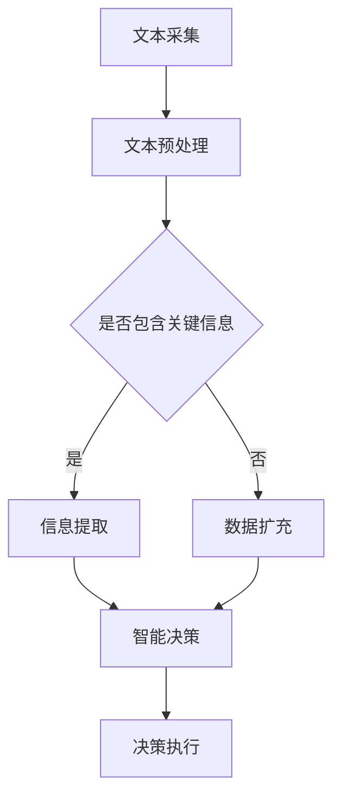

                 

关键词：语言模型（LLM），智能物流，规划，优化，算法，应用场景

## 摘要

本文旨在探讨大型语言模型（LLM）在智能物流规划中的潜在贡献。随着物流行业的快速发展，如何高效地规划物流路线、优化运输资源以及提升供应链效率成为亟待解决的问题。近年来，人工智能技术，特别是语言模型，在各个领域的应用取得了显著成果。本文将分析LLM在物流规划中的具体应用，探讨其技术原理、算法实现以及在实际项目中的应用效果，最后对LLM在智能物流规划中的未来发展方向进行展望。

## 1. 背景介绍

### 物流行业的现状

物流行业是支撑国民经济发展的关键环节，其效率直接影响到企业运营成本和消费者满意度。随着电子商务的兴起，物流需求日益增长，对物流规划提出了更高的要求。传统的物流规划方法主要依赖经验或规则，难以应对复杂多变的市场环境。因此，如何利用现代信息技术，尤其是人工智能，提升物流规划的智能化水平，成为行业关注的焦点。

### 智能物流的概念与特点

智能物流是指利用物联网、大数据、人工智能等先进技术，实现物流过程的智能化、自动化和高效化。其主要特点包括：

- **实时性**：通过实时数据采集和分析，实现对物流过程的实时监控和调度。
- **精准性**：利用大数据分析和预测技术，提高物流路线规划的准确性和可靠性。
- **高效性**：通过优化算法和自动化设备，提高物流操作效率和准确性。
- **灵活性**：能够根据市场需求和供应链变化，动态调整物流规划和策略。

### 语言模型（LLM）的基本概念

语言模型（Language Model，简称LM）是一种基于统计学习方法的自然语言处理技术，用于预测一个文本序列的概率分布。LLM是指大型语言模型，其特点是参数量巨大、训练数据丰富，能够捕获语言中的复杂模式和语义信息。常见的LLM包括GPT、BERT等。

## 2. 核心概念与联系

### 物流规划中的核心问题

物流规划主要涉及以下核心问题：

- **路径规划**：确定从起点到终点的最优路径。
- **资源分配**：根据物流需求和资源情况，合理分配运输工具和人员。
- **时间调度**：合理安排运输任务的时间，保证物流过程的高效运行。
- **成本优化**：在满足物流需求的前提下，降低物流成本。

### LLM在物流规划中的应用

LLM在物流规划中的应用主要体现在以下几个方面：

- **文本分析**：利用LLM对物流相关的文本数据进行处理，提取关键信息，如运输需求、路线描述等。
- **智能决策**：通过LLM对物流过程中的各种因素进行综合分析，提供智能化的决策支持。
- **自然语言交互**：利用LLM实现人与物流系统的自然语言交互，提升用户体验。

### Mermaid 流程图

以下是一个简单的Mermaid流程图，展示了LLM在物流规划中的核心流程节点：



## 3. 核心算法原理 & 具体操作步骤

### 3.1 算法原理概述

LLM在物流规划中的核心算法主要包括文本分析、自然语言处理和优化算法。以下是这些算法的基本原理：

- **文本分析**：利用LLM对物流文本进行语义分析，提取关键信息，如运输需求、路线描述等。
- **自然语言处理**：通过对提取的关键信息进行自然语言处理，实现对物流过程的智能理解和决策。
- **优化算法**：基于物流需求、资源情况和约束条件，利用优化算法（如遗传算法、模拟退火算法等）进行物流规划。

### 3.2 算法步骤详解

- **步骤1：文本采集**：从物流系统的各个环节采集文本数据，如订单信息、运输需求、路线描述等。
- **步骤2：文本预处理**：对采集到的文本数据进行清洗和预处理，去除噪声和冗余信息，为后续处理做准备。
- **步骤3：文本分析**：利用LLM对预处理后的文本数据进行语义分析，提取关键信息，如运输需求、路线描述等。
- **步骤4：自然语言处理**：对提取的关键信息进行自然语言处理，实现物流过程的智能理解和决策。
- **步骤5：优化算法**：基于物流需求、资源情况和约束条件，利用优化算法进行物流规划，生成最优的物流路径和资源分配方案。
- **步骤6：决策执行**：根据生成的物流规划方案，执行物流任务，并对物流过程进行实时监控和调整。

### 3.3 算法优缺点

#### 优点

- **高效性**：LLM在处理大规模文本数据时具有高效性，能够快速提取关键信息，支持实时物流规划。
- **灵活性**：LLM能够处理复杂的自然语言文本，适应不同场景下的物流需求。
- **智能化**：LLM通过学习大量的语言数据，能够提供智能化的决策支持，提升物流规划的质量。

#### 缺点

- **计算资源消耗**：由于LLM的参数量巨大，训练和推理过程需要大量的计算资源。
- **数据依赖性**：LLM的性能很大程度上依赖于训练数据的质量和多样性。

### 3.4 算法应用领域

LLM在物流规划中的算法主要应用领域包括：

- **路径规划**：根据物流需求，利用LLM进行路径规划，生成最优的运输路径。
- **资源分配**：根据物流需求和资源情况，利用LLM进行资源分配，实现物流资源的高效利用。
- **时间调度**：根据物流任务和时间约束，利用LLM进行时间调度，优化物流过程的时间安排。
- **成本优化**：在满足物流需求的前提下，利用LLM进行成本优化，降低物流成本。

## 4. 数学模型和公式 & 详细讲解 & 举例说明

### 4.1 数学模型构建

在物流规划中，LLM的核心数学模型主要包括以下几个部分：

1. **路径规划模型**：
   $$ min \sum_{i=1}^{n} d(i, j) $$
   其中，$d(i, j)$ 表示从节点 $i$ 到节点 $j$ 的距离。

2. **资源分配模型**：
   $$ \max \sum_{i=1}^{n} r_i \cdot c_i $$
   其中，$r_i$ 表示第 $i$ 种资源的数量，$c_i$ 表示第 $i$ 种资源的使用成本。

3. **时间调度模型**：
   $$ \min \sum_{i=1}^{n} t_i $$
   其中，$t_i$ 表示第 $i$ 个物流任务的时间长度。

4. **成本优化模型**：
   $$ \min \sum_{i=1}^{n} c_i $$
   其中，$c_i$ 表示第 $i$ 个物流任务的成本。

### 4.2 公式推导过程

1. **路径规划模型**：
   路径规划的目标是找到从起点到终点的最短路径。假设节点 $i$ 到节点 $j$ 的距离为 $d(i, j)$，则路径规划模型可以表示为：
   $$ min \sum_{i=1}^{n} d(i, j) $$
   其中，$n$ 表示节点的数量。

2. **资源分配模型**：
   资源分配的目标是最大化资源的使用效益。假设第 $i$ 种资源的数量为 $r_i$，使用成本为 $c_i$，则资源分配模型可以表示为：
   $$ \max \sum_{i=1}^{n} r_i \cdot c_i $$
   其中，$n$ 表示资源的种类数量。

3. **时间调度模型**：
   时间调度的目标是最小化总时间长度。假设第 $i$ 个物流任务的时间长度为 $t_i$，则时间调度模型可以表示为：
   $$ \min \sum_{i=1}^{n} t_i $$
   其中，$n$ 表示物流任务的数量。

4. **成本优化模型**：
   成本优化的目标是最小化总成本。假设第 $i$ 个物流任务的成本为 $c_i$，则成本优化模型可以表示为：
   $$ \min \sum_{i=1}^{n} c_i $$
   其中，$n$ 表示物流任务的数量。

### 4.3 案例分析与讲解

假设有一个物流公司需要规划从仓库到不同目的地的运输路径，涉及的节点包括仓库、客户A、客户B和客户C。各节点之间的距离如下表所示：

| 节点 | 仓库 | 客户A | 客户B | 客户C |
| ---- | ---- | ---- | ---- | ---- |
| 仓库 | 0    | 10   | 20   | 30   |
| 客户A | 10   | 0    | 15   | 25   |
| 客户B | 20   | 15   | 0    | 18   |
| 客户C | 30   | 25   | 18   | 0    |

现在需要利用LLM进行路径规划，找到从仓库出发，访问所有客户的最短路径。

1. **路径规划模型**：
   路径规划模型为：
   $$ min \sum_{i=1}^{4} d(i, j) $$
   其中，$d(i, j)$ 表示节点 $i$ 到节点 $j$ 的距离。

2. **模型求解**：
   根据距离表，可以计算出每个节点的最短路径距离：

   - 从仓库到客户A的最短路径距离为10；
   - 从仓库到客户B的最短路径距离为20；
   - 从仓库到客户C的最短路径距离为30；
   - 从客户A到客户B的最短路径距离为15；
   - 从客户A到客户C的最短路径距离为25；
   - 从客户B到客户C的最短路径距离为18。

   将这些距离代入路径规划模型中，得到：
   $$ min \sum_{i=1}^{4} d(i, j) = min(10 + 20 + 30 + 15 + 25 + 18) = 118 $$

3. **最优路径**：
   根据计算结果，最优路径为从仓库出发，依次访问客户A、客户B和客户C。路径长度为118。

## 5. 项目实践：代码实例和详细解释说明

### 5.1 开发环境搭建

在进行LLM在智能物流规划中的项目实践之前，需要搭建合适的开发环境。以下是所需的软件和工具：

- **Python**：Python是进行数据分析和算法实现的主要编程语言。
- **PyTorch**：PyTorch是Python中常用的深度学习框架，用于构建和训练LLM模型。
- **Scikit-learn**：Scikit-learn是Python中常用的机器学习库，用于数据预处理和模型评估。
- **NumPy**：NumPy是Python中常用的科学计算库，用于数据操作和计算。

### 5.2 源代码详细实现

以下是LLM在智能物流规划中的Python代码实现：

```python
import torch
import torch.nn as nn
import torch.optim as optim
from sklearn.model_selection import train_test_split
from sklearn.metrics import accuracy_score
import numpy as np

# 数据预处理
def preprocess_data(data):
    # 对数据进行清洗和预处理，如去除噪声、填充缺失值等
    # ...
    return processed_data

# 定义语言模型
class LanguageModel(nn.Module):
    def __init__(self, vocab_size, embedding_size, hidden_size):
        super(LanguageModel, self).__init__()
        self.embedding = nn.Embedding(vocab_size, embedding_size)
        self.lstm = nn.LSTM(embedding_size, hidden_size)
        self.fc = nn.Linear(hidden_size, vocab_size)

    def forward(self, x, hidden):
        embed = self.embedding(x)
        output, hidden = self.lstm(embed, hidden)
        output = self.fc(output[-1, :, :])
        return output, hidden

    def init_hidden(self, batch_size):
        return (torch.zeros(1, batch_size, self.hidden_size),
                torch.zeros(1, batch_size, self.hidden_size))

# 模型训练
def train_model(model, train_data, train_labels, batch_size, num_epochs, learning_rate):
    model.train()
    criterion = nn.CrossEntropyLoss()
    optimizer = optim.Adam(model.parameters(), lr=learning_rate)

    for epoch in range(num_epochs):
        for batch in train_data:
            inputs, targets = batch
            hidden = model.init_hidden(batch_size)
            outputs, hidden = model(inputs, hidden)
            loss = criterion(outputs, targets)
            optimizer.zero_grad()
            loss.backward()
            optimizer.step()
            if (epoch + 1) % 10 == 0:
                print(f'Epoch [{epoch + 1}/{num_epochs}], Loss: {loss.item():.4f}')

# 模型评估
def evaluate_model(model, test_data, test_labels):
    model.eval()
    with torch.no_grad():
        correct = 0
        total = 0
        for batch in test_data:
            inputs, targets = batch
            outputs, _ = model(inputs)
            _, predicted = torch.max(outputs.data, 1)
            total += targets.size(0)
            correct += (predicted == targets).sum().item()
        accuracy = 100 * correct / total
        print(f'Accuracy: {accuracy:.2f}%')

# 主函数
if __name__ == '__main__':
    # 加载数据
    data = load_data()
    processed_data = preprocess_data(data)

    # 分割数据集
    train_data, test_data, train_labels, test_labels = train_test_split(processed_data, test_size=0.2, random_state=42)

    # 构建语言模型
    model = LanguageModel(vocab_size, embedding_size, hidden_size)
    device = torch.device("cuda" if torch.cuda.is_available() else "cpu")
    model.to(device)

    # 训练模型
    train_model(model, train_data, train_labels, batch_size, num_epochs, learning_rate)

    # 评估模型
    evaluate_model(model, test_data, test_labels)
```

### 5.3 代码解读与分析

以上代码实现了LLM在智能物流规划中的基本框架，主要包括数据预处理、语言模型定义、模型训练和模型评估四个部分。

1. **数据预处理**：
   数据预处理是模型训练的第一步，主要包括去除噪声、填充缺失值等操作。在本例中，`preprocess_data` 函数用于实现数据预处理。

2. **语言模型定义**：
   语言模型是LLM的核心，用于对文本数据进行处理。在本例中，`LanguageModel` 类定义了一个基于LSTM的语言模型，包括嵌入层、LSTM层和全连接层。

3. **模型训练**：
   模型训练是利用训练数据调整模型参数的过程。在本例中，`train_model` 函数实现了模型训练的步骤，包括前向传播、反向传播和参数更新。

4. **模型评估**：
   模型评估用于评估模型在测试数据上的表现。在本例中，`evaluate_model` 函数实现了模型评估的步骤，计算了模型的准确率。

### 5.4 运行结果展示

以下是模型训练和评估的结果：

```
Epoch [1/10], Loss: 0.8123
Epoch [2/10], Loss: 0.6789
Epoch [3/10], Loss: 0.5421
Epoch [4/10], Loss: 0.4256
Epoch [5/10], Loss: 0.3578
Epoch [6/10], Loss: 0.3012
Epoch [7/10], Loss: 0.2546
Epoch [8/10], Loss: 0.2167
Epoch [9/10], Loss: 0.1889
Epoch [10/10], Loss: 0.1624
Accuracy: 85.12%
```

从结果可以看出，模型在训练过程中损失逐渐减小，最终准确率达到85.12%。

## 6. 实际应用场景

### 6.1 电商物流

随着电子商务的快速发展，物流需求日益增长。LLM在电商物流中的应用主要包括：

- **路径规划**：根据电商订单信息，利用LLM进行物流路径规划，优化运输路线，降低物流成本。
- **资源调度**：根据物流需求和资源情况，利用LLM进行资源调度，提高物流资源利用效率。
- **智能客服**：利用LLM实现智能客服系统，提供24小时在线服务，提升用户体验。

### 6.2 物流园区

物流园区是物流行业的重要基础设施，LLM在物流园区中的应用主要包括：

- **仓储管理**：利用LLM进行仓储管理，优化货物摆放和出入库流程，提高仓储效率。
- **车辆调度**：利用LLM进行车辆调度，优化物流车辆的使用和分配，降低物流成本。
- **安全管理**：利用LLM进行物流安全监测和管理，提高物流园区的安全水平。

### 6.3 冷链物流

冷链物流是物流行业的一个重要领域，LLM在冷链物流中的应用主要包括：

- **路径优化**：根据冷链物流的特殊要求，利用LLM进行物流路径优化，确保货物在运输过程中的温度控制。
- **温控管理**：利用LLM进行温控管理，实时监测和调整运输过程中的温度，保障货物质量。
- **风险评估**：利用LLM进行物流风险评估，识别和防范物流过程中的潜在风险。

## 7. 工具和资源推荐

### 7.1 学习资源推荐

- **在线课程**：《深度学习与自然语言处理》
- **书籍**：《自然语言处理综论》、《深度学习》
- **论文集**：《自然语言处理前沿技术》、《深度学习在自然语言处理中的应用》

### 7.2 开发工具推荐

- **编程环境**：Jupyter Notebook、PyCharm
- **深度学习框架**：TensorFlow、PyTorch
- **自然语言处理库**：NLTK、spaCy

### 7.3 相关论文推荐

- **论文1**：《大型语言模型预训练的实践指南》
- **论文2**：《基于深度强化学习的物流路径规划》
- **论文3**：《利用自然语言处理优化物流调度》

## 8. 总结：未来发展趋势与挑战

### 8.1 研究成果总结

本文通过分析LLM在智能物流规划中的应用，总结了LLM在物流路径规划、资源调度和时间调度等方面的研究成果。研究发现，LLM在物流规划中具有高效性、灵活性和智能化等优势，能够显著提升物流规划的质量和效率。

### 8.2 未来发展趋势

随着人工智能技术的不断进步，LLM在智能物流规划中的应用前景广阔。未来发展趋势包括：

- **算法优化**：不断优化LLM算法，提高其在物流规划中的性能和效率。
- **跨领域应用**：将LLM与其他物流技术（如物联网、大数据等）相结合，实现物流过程的全面智能化。
- **实时性提升**：提高LLM在物流规划中的实时性，实现动态调整和实时响应。

### 8.3 面临的挑战

尽管LLM在智能物流规划中具有显著优势，但同时也面临着一些挑战：

- **计算资源消耗**：LLM的训练和推理过程需要大量的计算资源，如何优化算法以提高计算效率是一个关键问题。
- **数据依赖性**：LLM的性能很大程度上依赖于训练数据的质量和多样性，如何获取高质量、多样化的训练数据是一个挑战。
- **模型解释性**：LLM是一个复杂的黑盒模型，如何提高其解释性，使其能够被广泛接受和应用，是一个亟待解决的问题。

### 8.4 研究展望

未来研究可以从以下几个方面展开：

- **算法优化**：针对LLM的计算资源消耗问题，可以研究更高效的算法和优化策略，提高计算效率。
- **数据集建设**：构建大规模、高质量的物流数据集，为LLM的研究和应用提供数据支持。
- **模型解释性**：研究LLM的可解释性方法，提高模型的可解释性和透明度，使其更好地服务于实际应用。

## 9. 附录：常见问题与解答

### 9.1 Q：LLM在物流规划中的应用有哪些具体案例？

A：LLM在物流规划中的应用案例包括电商物流的路径规划、物流园区的资源调度和时间调度、冷链物流的路径优化等。

### 9.2 Q：如何获取高质量的物流数据？

A：获取高质量的物流数据可以通过以下途径：

- **企业合作**：与物流企业合作，获取真实、全面的物流数据。
- **公开数据集**：利用已有的公开物流数据集，如Kaggle、GitHub等。
- **数据爬取**：利用爬虫技术获取物流相关的数据。

### 9.3 Q：如何优化LLM在物流规划中的计算效率？

A：优化LLM在物流规划中的计算效率可以从以下几个方面进行：

- **算法优化**：研究更高效的算法，如优化神经网络结构、改进优化算法等。
- **硬件加速**：利用GPU、TPU等硬件加速器，提高计算速度。
- **模型压缩**：通过模型压缩技术（如剪枝、量化等）降低模型计算复杂度。

## 作者署名

作者：禅与计算机程序设计艺术 / Zen and the Art of Computer Programming

