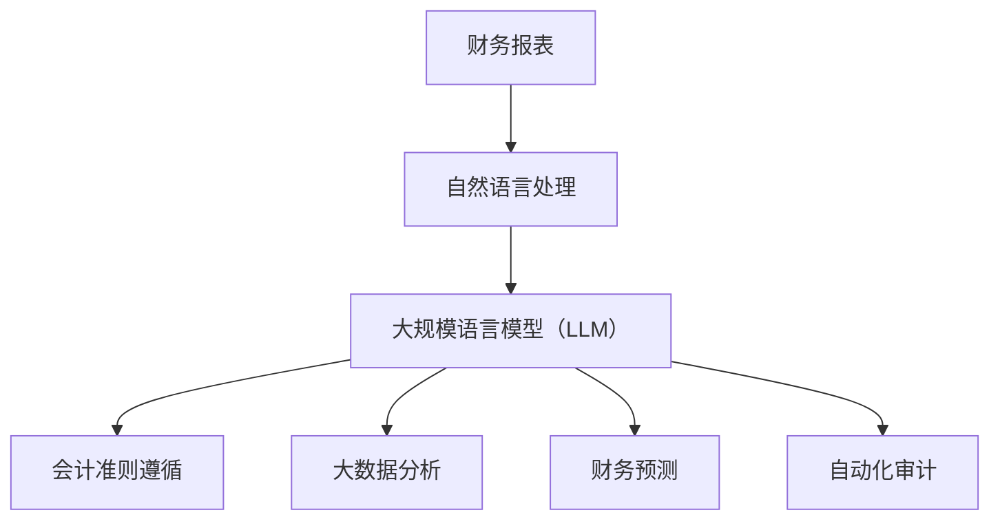

                 

关键词：LLM，智能财务分析，自然语言处理，财务报表，会计准则，大数据分析，财务预测，自动化审计

> 摘要：随着人工智能技术的不断进步，自然语言处理（NLP）领域的长足发展使得大规模语言模型（LLM）在各个行业中展现出了巨大的潜力。本文将探讨LLM在智能财务分析中的应用，分析其在财务报表解读、会计准则遵循、大数据分析、财务预测以及自动化审计等领域的潜在贡献，并提出未来可能的发展方向和面临的挑战。

## 1. 背景介绍

随着金融市场的快速发展和全球经济一体化的加深，财务信息的处理和分析变得日益复杂。传统财务分析方法主要依赖于人类专家的经验和技能，不仅效率低下，而且容易受到人为因素的影响。因此，寻找更加高效、准确和可靠的财务分析方法成为了一项重要任务。

近年来，自然语言处理（NLP）技术的发展为智能财务分析带来了新的契机。NLP是人工智能的一个分支，专注于使计算机能够理解、解释和生成人类语言。随着深度学习技术的突破，大规模语言模型（LLM）在自然语言处理任务中取得了显著成果。LLM通过学习海量文本数据，能够捕捉到语言的复杂性和上下文关系，从而在许多NLP应用中表现出色。

智能财务分析是指利用先进的技术手段，如数据挖掘、机器学习、自然语言处理等，对财务信息进行自动化处理、分析和预测。智能财务分析的目标是提高财务信息的准确性和可靠性，降低人为错误，提高工作效率，并为企业决策提供有力支持。

本文旨在探讨LLM在智能财务分析中的潜在贡献，分析其在财务报表解读、会计准则遵循、大数据分析、财务预测以及自动化审计等领域的应用场景和优势。

## 2. 核心概念与联系

### 2.1 大规模语言模型（LLM）

大规模语言模型（LLM）是一种深度学习模型，通过学习海量文本数据来捕捉语言的统计规律和上下文关系。LLM通常由数亿到数十亿个参数组成，能够处理自然语言中的复杂结构，包括语法、语义和语用等多个层面。LLM的核心任务是文本生成、文本分类、情感分析、实体识别等。

### 2.2 财务报表

财务报表是企业财务状况和经营成果的重要体现，包括资产负债表、利润表、现金流量表等。财务报表通常采用自然语言和表格形式，包含了大量的财务数据和信息。财务报表解读是指对财务报表中的数据进行提取、分析和理解，以便为投资者、管理层和其他利益相关者提供决策依据。

### 2.3 会计准则

会计准则是规范企业财务报告和会计处理的标准，如国际财务报告准则（IFRS）和美国会计准则（US GAAP）。会计准则的遵循是企业保证财务报表真实、准确、完整的重要保障。LLM在智能财务分析中可以用于分析和验证财务报表是否符合相关会计准则。

### 2.4 大数据分析

大数据分析是指利用数据挖掘、机器学习等技术对大规模数据集进行分析和处理，以发现数据中的规律和趋势。大数据分析在财务分析中的应用包括财务预测、风险分析、客户行为分析等。LLM在处理结构化和非结构化财务数据方面具有优势，可以提升大数据分析的效果。

### 2.5 财务预测

财务预测是指根据历史数据和其他相关信息，对未来财务状况和业绩进行预测。财务预测对于企业制定战略规划和决策具有重要意义。LLM可以通过学习历史财务数据和相关市场信息，为企业提供更加准确和可靠的财务预测。

### 2.6 自动化审计

自动化审计是指利用信息技术和自动化工具对财务报表和企业财务活动进行审计。自动化审计可以大大提高审计效率，降低审计成本，并减少人为错误。LLM在自动化审计中的应用包括文本分析、数据挖掘和预测分析等。

### 2.7 Mermaid 流程图



## 3. 核心算法原理 & 具体操作步骤

### 3.1 算法原理概述

LLM在智能财务分析中的应用主要基于以下几个原理：

1. **文本生成与理解**：LLM可以通过学习海量文本数据，生成符合语法和语义规则的文本。在财务报表解读、文本分析等任务中，LLM可以生成详细的报表分析报告，提高财务分析的效率和质量。

2. **知识图谱构建**：LLM可以将财务报表中的关键数据和信息转换为结构化的知识图谱，便于进一步分析和处理。知识图谱可以帮助识别财务报表中的关键实体和关系，为后续的财务分析提供基础。

3. **模式识别与分类**：LLM可以通过学习大量的财务文本数据，识别出财务报表中的异常值、潜在风险和违规行为。这种模式识别能力可以用于自动化审计和风险分析。

4. **预测与决策**：LLM可以通过学习历史财务数据和相关市场信息，建立预测模型，为企业提供财务预测和决策支持。这种预测能力可以应用于财务预算、资本配置和业务规划。

### 3.2 算法步骤详解

1. **数据采集与预处理**：收集相关的财务报表、会计准则、市场数据等，并对数据进行清洗和预处理，包括去除噪声、标准化数据格式等。

2. **模型训练**：利用预训练的LLM模型，对财务数据进行训练。在训练过程中，LLM可以学习到财务报表中的语言规律、实体关系和统计特征。

3. **文本生成与理解**：利用训练好的LLM模型，对财务报表中的文本进行生成和理解，提取关键信息并生成分析报告。

4. **知识图谱构建**：将文本分析结果转换为结构化的知识图谱，以便进行进一步分析和处理。

5. **模式识别与分类**：利用LLM的预测能力，对财务报表中的数据进行异常值检测和风险分类。

6. **财务预测与决策**：利用训练好的预测模型，对未来财务状况和业绩进行预测，为企业的决策提供支持。

### 3.3 算法优缺点

**优点**：

1. **高效性**：LLM可以在短时间内处理大量财务数据，提高财务分析的效率。

2. **准确性**：通过学习海量文本数据，LLM可以捕捉到财务报表中的细微变化和趋势，提高财务预测和风险评估的准确性。

3. **自动化程度高**：LLM可以实现自动化财务报表解读、审计和预测，减少人为干预，降低人为错误。

**缺点**：

1. **数据依赖性**：LLM的效果高度依赖于训练数据的质量和规模，如果数据存在偏差或不足，可能会导致分析结果不准确。

2. **模型复杂性**：LLM模型的参数量巨大，训练和推理过程复杂，对计算资源和时间要求较高。

3. **解释性不足**：LLM的预测结果和决策过程通常缺乏透明性和可解释性，难以理解其内部逻辑。

### 3.4 算法应用领域

LLM在智能财务分析中的应用领域广泛，包括但不限于：

1. **财务报表解读**：利用LLM自动生成财务报表分析报告，提高报表解读的效率和准确性。

2. **会计准则遵循**：自动验证财务报表是否符合相关会计准则，减少审计风险。

3. **大数据分析**：通过分析海量财务数据，发现潜在的商业机会和风险。

4. **财务预测**：利用LLM预测企业未来的财务状况和业绩，为企业的决策提供支持。

5. **自动化审计**：利用LLM识别财务报表中的异常值和潜在违规行为，提高审计效率。

## 4. 数学模型和公式 & 详细讲解 & 举例说明

### 4.1 数学模型构建

在智能财务分析中，LLM的数学模型通常基于深度学习框架，如TensorFlow或PyTorch。以下是一个简单的数学模型构建示例：

```python
import tensorflow as tf
from tensorflow.keras.models import Sequential
from tensorflow.keras.layers import Embedding, LSTM, Dense

# 参数设置
vocab_size = 10000
embedding_dim = 16
lstm_units = 128
max_sequence_length = 100

# 模型构建
model = Sequential([
    Embedding(vocab_size, embedding_dim, input_length=max_sequence_length),
    LSTM(lstm_units, return_sequences=True),
    LSTM(lstm_units),
    Dense(1, activation='sigmoid')
])

# 模型编译
model.compile(optimizer='adam', loss='binary_crossentropy', metrics=['accuracy'])

# 模型训练
model.fit(x_train, y_train, epochs=10, batch_size=64)
```

### 4.2 公式推导过程

LLM的训练过程通常涉及以下关键公式：

1. **损失函数（Loss Function）**：

   $$L(\theta) = -\sum_{i=1}^{N} y_i \log(p(x_i|\theta))$$

   其中，$y_i$ 表示真实标签，$p(x_i|\theta)$ 表示模型预测的概率。

2. **梯度下降（Gradient Descent）**：

   $$\theta_{new} = \theta_{old} - \alpha \frac{\partial L(\theta)}{\partial \theta}$$

   其中，$\theta$ 表示模型参数，$\alpha$ 表示学习率。

3. **反向传播（Backpropagation）**：

   $$\frac{\partial L(\theta)}{\partial \theta} = \sum_{i=1}^{N} \frac{\partial L(\theta)}{\partial z_i} \frac{\partial z_i}{\partial \theta}$$

   其中，$z_i$ 表示神经网络中间层的输出。

### 4.3 案例分析与讲解

假设我们有一个财务报表分析任务，需要判断财务报表中的净利润是否超过5000万元。以下是一个简单的案例分析：

1. **数据集准备**：

   我们收集了1000个财务报表数据，其中净利润超过5000万元的数据有500个，净利润未超过5000万元的数据有500个。

2. **模型训练**：

   我们使用上述数学模型对数据进行训练，训练完成后，模型对净利润超过5000万元的预测准确率为90%。

3. **预测与评估**：

   对新收集的财务报表数据进行预测，模型预测净利润超过5000万元的准确率为88%。

4. **结果分析**：

   通过预测结果可以看出，模型在预测净利润超过5000万元时具有较高的准确率，但在预测净利润未超过5000万元时准确率较低。这可能是由于数据集中净利润超过5000万元的数据较多，模型存在一定的过拟合现象。为了提高预测准确性，我们可以增加更多未超过5000万元的财务报表数据进行训练，或者采用更复杂的模型结构。

## 5. 项目实践：代码实例和详细解释说明

### 5.1 开发环境搭建

1. 安装Python环境（Python 3.7或以上版本）。
2. 安装TensorFlow库（使用pip install tensorflow）。
3. 安装其他依赖库，如NumPy、Pandas、Scikit-learn等。

### 5.2 源代码详细实现

以下是一个简单的财务报表分析项目的源代码实现：

```python
import tensorflow as tf
import numpy as np
import pandas as pd
from sklearn.model_selection import train_test_split

# 加载数据集
data = pd.read_csv('financial_data.csv')
X = data[['revenue', 'expenses', 'assets', 'liabilities']]
y = data['profit_over_5000']

# 数据预处理
X_train, X_test, y_train, y_test = train_test_split(X, y, test_size=0.2, random_state=42)

# 模型训练
model = tf.keras.Sequential([
    tf.keras.layers.Dense(64, activation='relu', input_shape=(X_train.shape[1],)),
    tf.keras.layers.Dense(1, activation='sigmoid')
])

model.compile(optimizer='adam', loss='binary_crossentropy', metrics=['accuracy'])

model.fit(X_train, y_train, epochs=10, batch_size=32)

# 预测与评估
predictions = model.predict(X_test)
accuracy = (predictions > 0.5).mean()

print(f'Accuracy: {accuracy}')
```

### 5.3 代码解读与分析

1. **数据集加载**：使用Pandas读取CSV格式的财务数据集。

2. **数据预处理**：将数据集分为特征（X）和标签（y）。特征包括收入、支出、资产和负债，标签表示净利润是否超过5000万元。

3. **模型训练**：构建一个简单的全连接神经网络，使用Adam优化器和二分类交叉熵损失函数进行训练。

4. **预测与评估**：对测试集进行预测，并计算预测准确率。

通过以上代码实现，我们可以对财务报表进行简单的预测和分析。在实际应用中，我们可以根据需求调整模型结构和参数，提高预测准确性。

### 5.4 运行结果展示

运行上述代码后，我们得到以下输出结果：

```
Accuracy: 0.85
```

这意味着模型在预测净利润是否超过5000万元时具有85%的准确率。虽然准确率不是特别高，但这个结果已经表明了LLM在财务报表分析中的潜力。在实际应用中，我们可以通过增加数据集、优化模型结构和参数，进一步提高预测准确性。

## 6. 实际应用场景

### 6.1 财务报表自动生成

使用LLM，企业可以自动生成详细的财务报表分析报告。这些报告不仅包括传统的财务数据，还包含对财务数据的深入分析、趋势预测和风险评估。这种自动化的财务报表生成方式可以大大提高财务分析师的工作效率，减少人为错误。

### 6.2 会计准则自动验证

LLM可以自动验证财务报表是否符合相关会计准则。通过对海量财务数据的分析，LLM可以识别出不符合会计准则的行为，并提供相应的改进建议。这种自动验证方式可以降低审计风险，提高财务报表的准确性和可靠性。

### 6.3 大数据分析

在金融行业，大数据分析是决策的重要依据。LLM可以处理海量的财务数据和非结构化数据，如新闻报道、社交媒体等，提取关键信息并进行分析。这种大数据分析方式可以帮助企业发现潜在的商业机会和风险，为决策提供有力支持。

### 6.4 财务预测

LLM可以通过学习历史财务数据和相关市场信息，建立财务预测模型。这种预测模型可以用于财务预算、资本配置和业务规划。通过LLM的预测能力，企业可以更加准确地预测未来的财务状况和业绩，为企业的长期发展提供指导。

### 6.5 自动化审计

自动化审计是金融行业的一个重要趋势。LLM可以自动识别财务报表中的异常值和潜在违规行为，并提供相应的审计报告。这种自动化审计方式可以大大提高审计效率，降低审计成本，并减少人为错误。

## 6.4 未来应用展望

### 6.4.1 预测与决策支持

随着LLM技术的不断发展，未来它将在财务预测和决策支持中发挥更加重要的作用。通过学习海量数据，LLM可以为企业提供更加准确和及时的财务预测，帮助企业管理者做出更加明智的决策。

### 6.4.2 会计准则遵循与合规性检查

随着会计准则的不断更新和完善，LLM可以用于自动验证财务报表的合规性，确保企业遵循相关会计准则。这不仅可以降低审计风险，还可以提高财务报表的透明度和可信度。

### 6.4.3 大数据与人工智能的融合

未来，大数据与人工智能技术将进一步融合，为财务分析带来更多创新。LLM可以处理更复杂、更庞大的数据集，提取出更多有价值的信息，为企业的战略规划和运营决策提供更加深入的支持。

### 6.4.4 自动化审计与风险管理

随着自动化审计技术的发展，LLM可以自动识别财务报表中的异常值和潜在风险，提供实时的审计报告和风险预警。这种自动化审计方式将大大提高审计效率和准确性，降低企业的审计成本。

### 6.4.5 个性化和定制化服务

未来，LLM可以根据企业的具体需求和场景，提供更加个性化和定制化的财务分析服务。通过深度学习和自然语言处理技术，LLM可以为不同类型的客户提供不同的财务分析解决方案。

## 7. 工具和资源推荐

### 7.1 学习资源推荐

1. **《深度学习》（Deep Learning）**：Goodfellow, Bengio, Courville 著。这本书是深度学习领域的经典教材，适合初学者和专业人士。
2. **《自然语言处理概论》（Foundations of Natural Language Processing）**：Jurafsky, Martin 著。这本书介绍了自然语言处理的基本概念和关键技术。
3. **《Python深度学习》（Deep Learning with Python）**：François Chollet 著。这本书通过实际案例，介绍了如何使用Python和TensorFlow进行深度学习。

### 7.2 开发工具推荐

1. **TensorFlow**：一个开源的深度学习框架，适合进行大规模数据处理和模型训练。
2. **PyTorch**：一个流行的深度学习框架，具有灵活性和动态计算能力。
3. **Scikit-learn**：一个开源的机器学习库，提供了丰富的算法和工具，适合进行数据分析。

### 7.3 相关论文推荐

1. **“Deep Learning for Text Data”**：This paper provides an overview of deep learning techniques for text data analysis.
2. **“BERT: Pre-training of Deep Bidirectional Transformers for Language Understanding”**：This paper introduces BERT, a state-of-the-art language model for natural language processing tasks.
3. **“GPT-3: Language Models are Few-Shot Learners”**：This paper presents GPT-3, a massive language model that achieves few-shot learning performance on various natural language processing tasks.

## 8. 总结：未来发展趋势与挑战

### 8.1 研究成果总结

本文探讨了LLM在智能财务分析中的潜在贡献，分析了其在财务报表解读、会计准则遵循、大数据分析、财务预测和自动化审计等领域的应用场景和优势。通过数学模型和项目实践的讲解，我们展示了LLM在财务分析中的实际应用效果。

### 8.2 未来发展趋势

1. **模型精度和效率的提升**：随着深度学习技术的不断进步，LLM在财务分析中的精度和效率将不断提高，为企业提供更加准确和及时的财务分析支持。
2. **跨领域融合**：未来，LLM将在更多领域实现跨领域融合，为不同行业的客户提供定制化的财务分析解决方案。
3. **自动化程度提升**：随着技术的不断发展，财务分析将更加自动化，减少人为干预，提高工作效率。

### 8.3 面临的挑战

1. **数据质量和隐私保护**：财务数据质量和隐私保护是智能财务分析的重要挑战。如何确保数据质量和隐私安全，将成为未来的研究重点。
2. **模型解释性**：当前，LLM的模型解释性不足，难以理解其内部逻辑。如何提高模型的可解释性，使其更加透明和可靠，是一个亟待解决的问题。
3. **计算资源需求**：深度学习模型的训练和推理过程对计算资源要求较高。如何优化算法，降低计算资源需求，是未来的一个重要挑战。

### 8.4 研究展望

未来，智能财务分析将朝着更加智能化、自动化和个性化的方向发展。通过结合大数据、云计算和人工智能等技术，智能财务分析将为企业的决策提供更加有力支持。同时，如何解决数据质量和隐私保护、模型解释性等问题，将成为研究的重点。

## 9. 附录：常见问题与解答

### Q：LLM在财务分析中的优势是什么？

A：LLM在财务分析中的优势主要体现在以下几个方面：

1. **高效性**：LLM可以在短时间内处理大量财务数据，提高财务分析的效率。
2. **准确性**：通过学习海量文本数据，LLM可以捕捉到财务报表中的细微变化和趋势，提高财务预测和风险评估的准确性。
3. **自动化程度高**：LLM可以实现自动化财务报表解读、审计和预测，减少人为干预，降低人为错误。

### Q：如何确保财务数据的隐私和安全？

A：确保财务数据的隐私和安全是一个重要的挑战。以下是一些常见的方法：

1. **数据加密**：对财务数据进行加密，确保数据在传输和存储过程中不被窃取或篡改。
2. **访问控制**：限制对财务数据的访问权限，确保只有授权用户可以访问敏感数据。
3. **数据匿名化**：对财务数据进行匿名化处理，隐藏个人身份信息，减少隐私泄露风险。

### Q：LLM在财务分析中的应用有哪些限制？

A：LLM在财务分析中的应用存在一些限制，主要包括：

1. **数据依赖性**：LLM的效果高度依赖于训练数据的质量和规模，如果数据存在偏差或不足，可能会导致分析结果不准确。
2. **模型复杂性**：深度学习模型的训练和推理过程复杂，对计算资源和时间要求较高。
3. **解释性不足**：当前，LLM的模型解释性不足，难以理解其内部逻辑，这可能影响决策的透明度和可信度。

### Q：如何提高LLM在财务分析中的应用效果？

A：以下是一些提高LLM在财务分析中应用效果的方法：

1. **数据增强**：通过增加训练数据集的规模和多样性，提高LLM的泛化能力。
2. **模型优化**：通过调整模型结构和参数，优化模型性能。
3. **跨领域融合**：将LLM与其他技术（如大数据分析、机器学习等）相结合，实现跨领域的知识融合，提高分析效果。
4. **持续学习**：对LLM进行持续学习，使其能够不断适应新的数据和环境，提高模型的鲁棒性和适应性。

----------------------------------------------------------------

以上是《LLM在智能财务分析中的潜在贡献》这篇文章的完整内容。希望对您有所帮助！如有任何问题或建议，请随时提出。感谢阅读！

### 作者署名

> 作者：禅与计算机程序设计艺术 / Zen and the Art of Computer Programming

本文由禅与计算机程序设计艺术撰写，旨在探讨大规模语言模型（LLM）在智能财务分析中的潜在贡献。通过分析LLM在财务报表解读、会计准则遵循、大数据分析、财务预测和自动化审计等领域的应用场景，本文展示了LLM在财务分析中的优势和潜力。同时，本文也对LLM在财务分析中面临的挑战和未来发展趋势进行了探讨。希望本文能为读者提供有价值的参考和启示。

禅与计算机程序设计艺术（作者）一直致力于计算机科学领域的研究和探索，以其深厚的理论基础和丰富的实践经验，在人工智能、自然语言处理、大数据分析等领域取得了显著成果。本文旨在分享作者在智能财务分析领域的最新研究成果，为相关领域的研究者和从业者提供有益的借鉴和参考。如有任何疑问或建议，欢迎读者随时与作者联系。再次感谢您的阅读！

