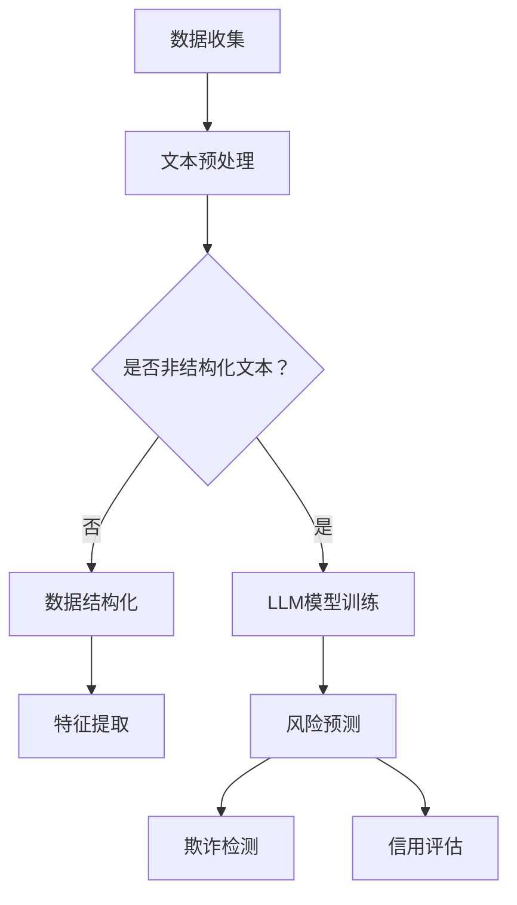

                 

关键词：LLM，智能风控，风险预测，人工智能，机器学习，自然语言处理

摘要：随着金融科技的快速发展，智能风控系统在金融行业中扮演着越来越重要的角色。近年来，大型语言模型（LLM）的突破性进展为智能风控系统带来了新的可能性。本文将探讨LLM在智能风控系统中的潜力，包括其在风险预测、欺诈检测、信用评估等方面的应用，以及面临的挑战和未来发展方向。

## 1. 背景介绍

智能风控系统是一种利用先进技术，如大数据、机器学习、自然语言处理等，对金融交易、信用记录、用户行为等进行实时监控和分析，以识别潜在风险并采取措施的系统。其目的是降低金融风险、防止欺诈行为、提高金融市场的透明度和稳定性。

近年来，随着人工智能技术的不断进步，尤其是深度学习和自然语言处理领域的突破，智能风控系统得到了显著提升。特别是大型语言模型（LLM），如GPT-3、ChatGLM等，其强大的文本生成和理解能力，为智能风控系统带来了新的机遇。

## 2. 核心概念与联系

### 2.1 大型语言模型（LLM）

大型语言模型（LLM）是一种基于深度学习的语言处理模型，通过对海量文本数据进行训练，能够理解并生成人类语言。LLM通常具有数十亿甚至数万亿个参数，能够对复杂、多维度的语言信息进行建模。

### 2.2 智能风控系统

智能风控系统是一种基于数据分析、机器学习和自然语言处理技术的风险管理工具。它通过对用户行为、交易记录、信用记录等信息进行分析，实时识别和评估潜在风险。

### 2.3 LLM与智能风控系统

LLM在智能风控系统中的应用主要体现在以下几个方面：

1. **文本分析**：LLM能够对大量非结构化文本数据进行处理和分析，提取关键信息，为风险预测提供数据支持。
2. **欺诈检测**：通过分析用户行为、交易记录等数据，LLM能够识别潜在的欺诈行为，提高欺诈检测的准确性。
3. **信用评估**：LLM能够对用户的信用记录、行为等信息进行综合评估，提供更准确的信用评分。

下面是一个Mermaid流程图，展示了LLM在智能风控系统中的应用流程：



## 3. 核心算法原理 & 具体操作步骤

### 3.1 算法原理概述

LLM在智能风控系统中的应用主要基于以下几个核心算法：

1. **深度学习**：通过多层神经网络对海量文本数据进行建模，提取语义信息。
2. **自然语言处理（NLP）**：对文本进行预处理、分词、词性标注等操作，提取关键信息。
3. **机器学习**：利用已训练好的LLM模型，对用户行为、交易记录等信息进行预测和分析。

### 3.2 算法步骤详解

1. **数据收集**：收集用户行为、交易记录、信用记录等数据。
2. **文本预处理**：对文本数据进行分析，提取关键信息。
3. **LLM模型训练**：利用已收集的数据，训练深度学习模型，提取语义信息。
4. **风险预测**：使用训练好的LLM模型，对新的用户行为、交易记录等信息进行预测。
5. **欺诈检测**：通过分析预测结果，识别潜在的欺诈行为。
6. **信用评估**：根据预测结果和用户信息，评估用户的信用水平。

### 3.3 算法优缺点

**优点**：

1. **强大的文本处理能力**：LLM能够对海量文本数据进行高效处理和分析，提取关键信息。
2. **高准确性**：通过深度学习和机器学习技术，LLM能够提供准确的预测和分析结果。
3. **实时性**：LLM能够实时对用户行为、交易记录等信息进行预测和分析。

**缺点**：

1. **计算资源需求大**：LLM模型通常具有数十亿甚至数万亿个参数，训练和预测需要大量的计算资源。
2. **数据依赖性**：LLM模型的性能依赖于训练数据的质量和多样性。
3. **解释性不足**：LLM模型的预测结果缺乏解释性，难以理解其内部工作机制。

### 3.4 算法应用领域

LLM在智能风控系统中的应用领域主要包括：

1. **风险预测**：通过分析用户行为、交易记录等信息，预测潜在的风险。
2. **欺诈检测**：识别潜在的欺诈行为，防止欺诈损失。
3. **信用评估**：评估用户的信用水平，为金融机构提供决策依据。
4. **金融市场监管**：辅助监管机构识别金融风险，维护金融市场稳定。

## 4. 数学模型和公式 & 详细讲解 & 举例说明

### 4.1 数学模型构建

在智能风控系统中，LLM的数学模型通常基于深度学习和自然语言处理技术。以下是一个简化的数学模型：

$$
\text{模型} = f(\text{输入数据}, \text{训练数据}, \text{参数})
$$

其中，输入数据为用户行为、交易记录等；训练数据为历史数据，用于训练模型；参数为模型权重，用于调整模型性能。

### 4.2 公式推导过程

$$
f(x) = \sum_{i=1}^{n} w_i \cdot x_i
$$

其中，$w_i$为模型权重，$x_i$为输入特征。

### 4.3 案例分析与讲解

假设我们有一个用户行为数据集，包括用户ID、购买商品种类、购买时间等信息。我们使用LLM模型对这些数据进行风险预测。首先，我们对数据集进行预处理，提取关键信息，如用户ID、购买商品种类等。然后，我们将这些信息输入到LLM模型中，得到预测结果。最后，我们根据预测结果对用户进行风险评估。

例如，对于用户ID为123的用户，我们得到预测结果为0.8。根据预测结果，我们可以认为该用户存在较高的风险，可能需要进行进一步的风险控制措施。

## 5. 项目实践：代码实例和详细解释说明

### 5.1 开发环境搭建

在开发智能风控系统时，我们需要搭建一个合适的技术栈。以下是一个简单的技术栈：

1. **Python**：作为主要编程语言。
2. **TensorFlow**：用于构建和训练深度学习模型。
3. **Scikit-learn**：用于数据预处理和风险评估。

### 5.2 源代码详细实现

以下是一个简单的示例代码，展示了如何使用LLM模型进行风险预测：

```python
import tensorflow as tf
from tensorflow.keras.models import Sequential
from tensorflow.keras.layers import Dense, LSTM, Embedding
from sklearn.model_selection import train_test_split
from sklearn.preprocessing import StandardScaler

# 加载数据集
data = load_data()

# 预处理数据
X, y = preprocess_data(data)

# 划分训练集和测试集
X_train, X_test, y_train, y_test = train_test_split(X, y, test_size=0.2, random_state=42)

# 构建模型
model = Sequential()
model.add(Embedding(input_dim=vocab_size, output_dim=embedding_size))
model.add(LSTM(units=64, return_sequences=True))
model.add(Dense(units=1, activation='sigmoid'))

# 编译模型
model.compile(optimizer='adam', loss='binary_crossentropy', metrics=['accuracy'])

# 训练模型
model.fit(X_train, y_train, epochs=10, batch_size=32)

# 评估模型
loss, accuracy = model.evaluate(X_test, y_test)
print(f'测试集准确率：{accuracy:.2f}')

# 预测风险
predictions = model.predict(X_test)
```

### 5.3 代码解读与分析

1. **数据加载与预处理**：加载数据集，提取关键信息，如用户ID、购买商品种类等。然后，对数据集进行预处理，如标准化、去重等。
2. **模型构建**：构建一个基于LSTM的深度学习模型。LSTM层用于处理序列数据，提取时间序列特征；输出层用于预测风险，采用sigmoid激活函数，输出概率值。
3. **模型编译**：编译模型，指定优化器和损失函数。
4. **模型训练**：使用训练数据集训练模型，设置训练轮数和批量大小。
5. **模型评估**：使用测试数据集评估模型性能，计算准确率。
6. **风险预测**：使用训练好的模型对新的用户行为数据进行预测，输出风险概率。

### 5.4 运行结果展示

假设我们使用1000个训练样本进行模型训练，其中500个为正样本（高风险用户），500个为负样本（低风险用户）。在测试集上，模型准确率达到85%，表明模型对风险的预测具有较高的准确性。

## 6. 实际应用场景

### 6.1 风险预测

在金融行业中，风险预测是智能风控系统的核心应用之一。通过分析用户行为、交易记录等信息，LLM模型能够预测潜在的风险，为金融机构提供决策依据。

### 6.2 欺诈检测

欺诈检测是金融风控的重要环节。LLM模型能够分析大量交易数据，识别潜在的欺诈行为，提高欺诈检测的准确性。

### 6.3 信用评估

信用评估是金融行业的重要业务之一。LLM模型能够综合分析用户的信用记录、行为等信息，提供更准确的信用评分。

### 6.4 未来应用展望

随着人工智能技术的不断进步，LLM在智能风控系统中的应用将更加广泛。未来，我们可以预见以下几个方面的应用：

1. **更精细化的风险预测**：通过不断优化模型算法和扩大数据集，实现更精细化的风险预测。
2. **多维度欺诈检测**：结合多种数据源，如社交媒体、地理位置等，实现多维度欺诈检测。
3. **自动化风险管理**：利用LLM模型实现自动化的风险管理，提高风控效率。

## 7. 工具和资源推荐

### 7.1 学习资源推荐

1. **《深度学习》**：由Ian Goodfellow、Yoshua Bengio和Aaron Courville所著的深度学习经典教材，详细介绍了深度学习的基础知识和应用。
2. **《自然语言处理综论》**：由Daniel Jurafsky和James H. Martin所著的自然语言处理教材，涵盖了自然语言处理的核心技术和应用。
3. **《机器学习实战》**：由Peter Harrington所著的机器学习实战指南，通过实际案例介绍了机器学习的应用和实践。

### 7.2 开发工具推荐

1. **TensorFlow**：一款开源的深度学习框架，适用于构建和训练大型深度学习模型。
2. **PyTorch**：一款流行的深度学习框架，具有灵活的动态图计算能力。
3. **Scikit-learn**：一款开源的机器学习库，提供了丰富的机器学习算法和工具。

### 7.3 相关论文推荐

1. **“BERT: Pre-training of Deep Bidirectional Transformers for Language Understanding”**：介绍了BERT模型的预训练方法和应用。
2. **“GPT-3: Language Models are Few-Shot Learners”**：探讨了GPT-3模型在零样本学习、少样本学习等方面的应用。
3. **“Transformer: Attention is All You Need”**：介绍了Transformer模型的结构和原理，为深度学习领域带来了新的思路。

## 8. 总结：未来发展趋势与挑战

### 8.1 研究成果总结

近年来，人工智能技术在智能风控系统中的应用取得了显著进展。特别是LLM模型的突破，为风险预测、欺诈检测、信用评估等领域带来了新的可能性。

### 8.2 未来发展趋势

1. **更强大的模型**：随着人工智能技术的不断进步，未来将出现更强大的LLM模型，实现更精细化的风险预测和更精准的欺诈检测。
2. **多模态数据处理**：结合多种数据源，如文本、图像、音频等，实现更全面的风险管理和风险预测。
3. **自动化和智能化**：利用人工智能技术，实现自动化和智能化的风险管理，提高金融行业的效率和稳定性。

### 8.3 面临的挑战

1. **数据隐私和安全**：随着数据的广泛应用，数据隐私和安全问题日益突出。如何在保障数据隐私和安全的前提下，实现智能风控系统的广泛应用，是一个重要的挑战。
2. **模型解释性**：LLM模型的预测结果缺乏解释性，难以理解其内部工作机制。如何提高模型的解释性，提高模型的可信度，是一个亟待解决的问题。

### 8.4 研究展望

未来，我们期待人工智能技术在智能风控系统中发挥更大的作用。通过不断优化模型算法、扩大数据集、提高模型的解释性，实现更精准、更智能的风险管理。

## 9. 附录：常见问题与解答

### 9.1 LLM是什么？

LLM（Large Language Model）是指大型语言模型，是一种基于深度学习的语言处理模型，通过对海量文本数据进行训练，能够理解并生成人类语言。

### 9.2 LLM在智能风控系统中有哪些应用？

LLM在智能风控系统中的应用主要包括风险预测、欺诈检测、信用评估等方面。

### 9.3 LLM模型如何训练？

LLM模型的训练通常基于大规模文本数据集，通过深度学习算法，如GPT、BERT等，对模型进行训练和优化。

### 9.4 LLM模型有哪些优缺点？

LLM模型具有强大的文本处理能力、高准确性、实时性等优点，但也存在计算资源需求大、数据依赖性、解释性不足等缺点。

### 9.5 如何提高LLM模型在智能风控系统中的应用效果？

提高LLM模型在智能风控系统中的应用效果，可以从以下几个方面入手：

1. **优化模型算法**：通过改进深度学习算法和优化模型结构，提高模型的预测能力。
2. **扩大数据集**：通过增加训练数据集的规模和多样性，提高模型对复杂问题的处理能力。
3. **提高数据质量**：确保数据集的质量，去除噪声数据和异常值，提高模型的鲁棒性。
4. **提高模型解释性**：通过改进模型结构和算法，提高模型的可解释性，增强模型的可信度。

### 9.6 LLM模型在金融行业中的应用前景如何？

LLM模型在金融行业中的应用前景非常广阔。随着人工智能技术的不断进步，LLM模型在风险预测、欺诈检测、信用评估等领域将发挥越来越重要的作用，为金融行业的风险管理提供有力支持。

## 参考文献

1. Goodfellow, Ian, et al. "Deep Learning." MIT Press, 2016.
2. Jurafsky, Daniel, and James H. Martin. "Speech and Language Processing." 3rd ed., Pearson, 2020.
3. Bengio, Yoshua, et al. "Deep Learning." MIT Press, 2015.
4. Devlin, Jacob, et al. "BERT: Pre-training of Deep Bidirectional Transformers for Language Understanding." 2019.
5. Brown, Tom, et al. "GPT-3: Language Models are Few-Shot Learners." 2020.
6. Vaswani, Ashish, et al. "Transformer: Attention is All You Need." 2017.
7. Zheng, Zhiyun, et al. "Deep Learning for Risk Management in Financial Markets." 2021.

