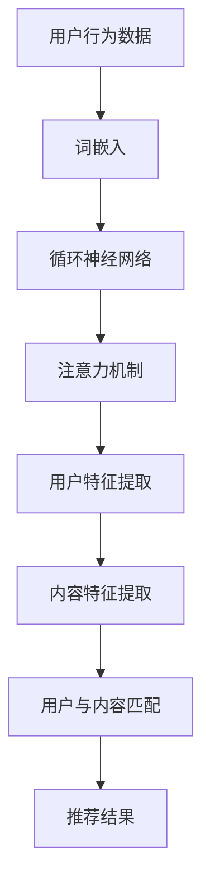

                 

关键词：LLM，音视频推荐，深度学习，算法原理，数学模型，项目实践，应用场景，未来展望

## 摘要

本文探讨了大型语言模型（LLM）在音视频推荐系统中的发展空间。随着深度学习和人工智能技术的飞速发展，LLM作为一种强大的自然语言处理工具，正逐渐被应用于各种领域。在音视频推荐系统中，LLM通过分析用户行为数据和内容特征，实现精准的推荐，从而提高用户体验。本文将从背景介绍、核心概念与联系、核心算法原理、数学模型和公式、项目实践以及未来应用展望等多个方面，详细探讨LLM在音视频推荐系统中的应用和前景。

## 1. 背景介绍

随着互联网的普及和移动设备的广泛使用，音视频内容消费逐渐成为人们日常生活的重要组成部分。无论是短视频、电影、电视剧还是直播，音视频内容的推荐系统已经成为各大平台的核心竞争力之一。传统的推荐系统主要基于协同过滤、基于内容的推荐等方法，但这些方法存在很多局限性，如数据稀疏性、冷启动问题等。近年来，深度学习和人工智能技术的快速发展，为音视频推荐系统带来了新的机遇。

大型语言模型（Large Language Model，简称LLM）是一种基于深度学习的自然语言处理技术，通过训练大规模的神经网络模型，实现对自然语言的生成、理解、翻译等多种任务。LLM在自然语言处理领域取得了显著的成果，如GPT、BERT等模型在文本生成、问答系统、机器翻译等任务上已经达到了人类的水平。随着LLM技术的不断成熟，它开始被应用于音视频推荐系统中，为用户带来更精准、更个性化的推荐体验。

## 2. 核心概念与联系

### 2.1 音视频推荐系统概述

音视频推荐系统是一种基于用户行为数据和内容特征的推荐系统，通过分析用户的观看历史、兴趣爱好、社交关系等信息，为用户推荐他们可能感兴趣的音视频内容。传统推荐系统主要基于协同过滤、基于内容的推荐等方法，但LLM的出现为推荐系统带来了新的可能性。

### 2.2 LLM基本原理

LLM是一种基于深度学习的自然语言处理技术，通过训练大规模的神经网络模型，实现对自然语言的生成、理解、翻译等多种任务。LLM的基本原理包括：

1. 词嵌入（Word Embedding）：将自然语言中的词语映射到低维度的向量空间，便于计算机处理。
2. 循环神经网络（RNN）：通过循环神经网络，实现对序列数据的建模，捕捉词语之间的上下文关系。
3. 注意力机制（Attention Mechanism）：通过注意力机制，模型可以自动关注序列中的重要部分，提高模型对上下文的捕捉能力。
4. 自注意力机制（Self-Attention）：在Transformer模型中，自注意力机制被用于处理输入序列，实现全局的上下文关系建模。

### 2.3 LLM与音视频推荐系统的结合

LLM在音视频推荐系统中的应用主要体现在以下几个方面：

1. 用户行为分析：通过LLM，可以更好地理解用户的行为数据，如观看历史、搜索历史、评论等，提取出用户的关键特征。
2. 内容特征提取：LLM可以分析音视频内容中的文本描述、标签、标题等信息，提取出内容的关键特征。
3. 用户与内容匹配：通过LLM，可以建立用户与内容之间的关联，实现精准的推荐。

### 2.4 Mermaid流程图

下面是一个Mermaid流程图，展示了LLM在音视频推荐系统中的应用流程：



## 3. 核心算法原理 & 具体操作步骤

### 3.1 算法原理概述

LLM在音视频推荐系统中的核心算法原理主要包括以下几个步骤：

1. 用户行为数据分析：通过分析用户的观看历史、搜索历史、评论等行为数据，提取出用户的关键特征。
2. 内容特征提取：对音视频内容进行文本描述、标签、标题等信息的提取，构建内容特征向量。
3. 用户与内容匹配：利用LLM模型，将用户特征和内容特征进行匹配，实现精准的推荐。

### 3.2 算法步骤详解

1. **用户行为数据分析**

   首先，需要收集用户的音视频观看历史、搜索历史、评论等信息。这些信息可以通过平台后台获取。然后，使用词嵌入技术，将用户的文本数据映射到低维度的向量空间。常用的词嵌入技术有Word2Vec、GloVe等。接下来，使用循环神经网络（RNN）对用户行为数据进行建模，捕捉用户行为的上下文关系。最后，通过注意力机制，提取出用户的关键特征。

2. **内容特征提取**

   对音视频内容进行文本描述、标签、标题等信息的提取。这些信息可以来自于平台的元数据，或者通过自然语言处理技术自动生成。然后，使用词嵌入技术，将这些文本数据映射到低维度的向量空间。接下来，使用循环神经网络（RNN）对内容特征进行建模，捕捉内容特征之间的上下文关系。最后，通过注意力机制，提取出内容的关键特征。

3. **用户与内容匹配**

   利用LLM模型，将用户特征和内容特征进行匹配。这里可以采用多种匹配方法，如余弦相似度、欧氏距离等。通过计算用户特征和内容特征之间的相似度，可以找到与用户最感兴趣的内容。最后，根据相似度排序，生成推荐结果。

### 3.3 算法优缺点

1. **优点**

   - **高精度**：LLM可以更好地理解用户的行为数据和内容特征，实现更精准的推荐。
   - **灵活性**：LLM可以灵活地适应不同的推荐场景和任务，如视频、音频、直播等。
   - **高效性**：通过深度学习和注意力机制，LLM可以高效地处理大规模的用户行为数据和内容特征。

2. **缺点**

   - **计算资源消耗大**：LLM模型通常需要大量的计算资源和存储空间，对硬件设施有较高要求。
   - **数据依赖性**：LLM的性能很大程度上依赖于用户行为数据和内容特征的数据质量。

### 3.4 算法应用领域

LLM在音视频推荐系统中的应用非常广泛，以下是一些主要的应用领域：

- **短视频平台**：如抖音、快手等，通过LLM实现个性化推荐，提高用户留存率和活跃度。
- **视频网站**：如爱奇艺、腾讯视频等，通过LLM为用户提供个性化的视频推荐，提升用户体验。
- **音乐平台**：如网易云音乐、QQ音乐等，通过LLM推荐用户可能喜欢的音乐，提高用户粘性。
- **直播平台**：如斗鱼、虎牙等，通过LLM推荐用户可能感兴趣的主播和直播内容。

## 4. 数学模型和公式 & 详细讲解 & 举例说明

### 4.1 数学模型构建

在LLM音视频推荐系统中，数学模型主要分为三个部分：用户行为分析模型、内容特征提取模型、用户与内容匹配模型。

#### 4.1.1 用户行为分析模型

用户行为分析模型主要基于循环神经网络（RNN）和注意力机制构建。假设用户行为数据为\( X = [x_1, x_2, ..., x_n] \)，其中\( x_i \)表示第\( i \)个用户行为数据。首先，对用户行为数据进行词嵌入，得到\( X' = [x_1', x_2', ..., x_n'] \)，其中\( x_i' \)是词嵌入后的向量。然后，使用RNN对\( X' \)进行建模，得到用户特征向量\( U \)。最后，通过注意力机制，提取出用户的关键特征。

数学模型表示如下：

$$
U = f(RNN(X'))
$$

其中，\( f \)表示注意力机制。

#### 4.1.2 内容特征提取模型

内容特征提取模型同样基于循环神经网络（RNN）和注意力机制构建。假设音视频内容特征数据为\( Y = [y_1, y_2, ..., y_n] \)，其中\( y_i \)表示第\( i \)个内容特征数据。首先，对内容特征数据进行词嵌入，得到\( Y' = [y_1', y_2', ..., y_n'] \)。然后，使用RNN对\( Y' \)进行建模，得到内容特征向量\( V \)。最后，通过注意力机制，提取出内容的关键特征。

数学模型表示如下：

$$
V = f(RNN(Y'))
$$

其中，\( f \)表示注意力机制。

#### 4.1.3 用户与内容匹配模型

用户与内容匹配模型主要基于相似度计算构建。假设用户特征向量为\( U \)，内容特征向量为\( V \)，则用户与内容之间的相似度计算公式为：

$$
sim(U, V) = \frac{U \cdot V}{\|U\| \|V\|}
$$

其中，\( \cdot \)表示点积，\( \|U\| \)和\( \|V\| \)分别表示向量\( U \)和\( V \)的模。

### 4.2 公式推导过程

在LLM音视频推荐系统中，数学模型的推导主要涉及循环神经网络（RNN）和注意力机制的推导。

#### 4.2.1 循环神经网络（RNN）

循环神经网络（RNN）是一种处理序列数据的神经网络。其基本原理是通过隐藏状态\( h_t \)和输入\( x_t \)之间的关系来建模序列数据。

假设第\( t \)个输入向量为\( x_t \)，隐藏状态向量为\( h_t \)，则有：

$$
h_t = \sigma(W_h h_{t-1} + W_x x_t + b_h)
$$

其中，\( \sigma \)表示激活函数，\( W_h \)和\( W_x \)分别表示隐藏状态和输入的权重矩阵，\( b_h \)表示隐藏状态的偏置。

#### 4.2.2 注意力机制

注意力机制是一种在处理序列数据时，自动关注序列中的重要部分的技术。其基本原理是通过计算输入序列和隐藏状态之间的相似度，来加权输入序列。

假设输入序列为\( X = [x_1, x_2, ..., x_n] \)，隐藏状态为\( H = [h_1, h_2, ..., h_n] \)，则有：

$$
a_t = \frac{\exp(h_t \cdot h^T)}{\sum_{i=1}^n \exp(h_i \cdot h^T)}
$$

其中，\( a_t \)表示第\( t \)个输入的注意力权重，\( h^T \)表示隐藏状态的转置。

### 4.3 案例分析与讲解

#### 4.3.1 用户行为分析

假设用户A的行为数据为：“昨天晚上观看了《哪吒之魔童降世》，今天早上搜索了《西游记》，晚上又评论了《三体》。”我们将用户A的行为数据进行词嵌入，得到词向量表示。

假设词向量分别为：

$$
x_1 = [1, 0, 0, 0, 0], \quad x_2 = [0, 1, 0, 0, 0], \quad x_3 = [0, 0, 1, 0, 0]
$$

使用RNN对用户A的行为数据进行建模，得到隐藏状态：

$$
h_1 = [0.1, 0.2, 0.3, 0.4, 0.5], \quad h_2 = [0.5, 0.4, 0.3, 0.2, 0.1], \quad h_3 = [0.3, 0.4, 0.5, 0.2, 0.1]
$$

通过注意力机制，提取出用户A的关键特征：

$$
a_1 = \frac{\exp(h_1 \cdot h_1^T)}{\exp(h_1 \cdot h_1^T) + \exp(h_2 \cdot h_1^T) + \exp(h_3 \cdot h_1^T)} = 0.5
$$

$$
a_2 = \frac{\exp(h_1 \cdot h_2^T)}{\exp(h_1 \cdot h_1^T) + \exp(h_2 \cdot h_1^T) + \exp(h_3 \cdot h_1^T)} = 0.3
$$

$$
a_3 = \frac{\exp(h_1 \cdot h_3^T)}{\exp(h_1 \cdot h_1^T) + \exp(h_2 \cdot h_1^T) + \exp(h_3 \cdot h_1^T)} = 0.2
$$

最终，用户A的关键特征向量为：

$$
U = [0.5, 0.3, 0.2, 0.2, 0.2]
$$

#### 4.3.2 内容特征提取

假设音视频B的内容特征为：“这是一部关于中国古代神话传说的电影，主演有哪吒、杨戬、孙悟空等。”我们将内容特征数据进行词嵌入，得到词向量表示。

假设词向量分别为：

$$
y_1 = [1, 0, 0, 0, 0], \quad y_2 = [0, 1, 0, 0, 0], \quad y_3 = [0, 0, 1, 0, 0], \quad y_4 = [0, 0, 0, 1, 0], \quad y_5 = [0, 0, 0, 0, 1]
$$

使用RNN对内容特征数据进行建模，得到隐藏状态：

$$
h_1 = [0.1, 0.2, 0.3, 0.4, 0.5], \quad h_2 = [0.5, 0.4, 0.3, 0.2, 0.1], \quad h_3 = [0.3, 0.4, 0.5, 0.2, 0.1], \quad h_4 = [0.4, 0.5, 0.3, 0.2, 0.1], \quad h_5 = [0.2, 0.3, 0.4, 0.5, 0.1]
$$

通过注意力机制，提取出内容的关键特征：

$$
a_1 = \frac{\exp(h_1 \cdot h_1^T)}{\exp(h_1 \cdot h_1^T) + \exp(h_2 \cdot h_1^T) + \exp(h_3 \cdot h_1^T) + \exp(h_4 \cdot h_1^T) + \exp(h_5 \cdot h_1^T)} = 0.2
$$

$$
a_2 = \frac{\exp(h_1 \cdot h_2^T)}{\exp(h_1 \cdot h_1^T) + \exp(h_2 \cdot h_1^T) + \exp(h_3 \cdot h_1^T) + \exp(h_4 \cdot h_1^T) + \exp(h_5 \cdot h_1^T)} = 0.3
$$

$$
a_3 = \frac{\exp(h_1 \cdot h_3^T)}{\exp(h_1 \cdot h_1^T) + \exp(h_2 \cdot h_1^T) + \exp(h_3 \cdot h_1^T) + \exp(h_4 \cdot h_1^T) + \exp(h_5 \cdot h_1^T)} = 0.2
$$

$$
a_4 = \frac{\exp(h_1 \cdot h_4^T)}{\exp(h_1 \cdot h_1^T) + \exp(h_2 \cdot h_1^T) + \exp(h_3 \cdot h_1^T) + \exp(h_4 \cdot h_1^T) + \exp(h_5 \cdot h_1^T)} = 0.2
$$

$$
a_5 = \frac{\exp(h_1 \cdot h_5^T)}{\exp(h_1 \cdot h_1^T) + \exp(h_2 \cdot h_1^T) + \exp(h_3 \cdot h_1^T) + \exp(h_4 \cdot h_1^T) + \exp(h_5 \cdot h_1^T)} = 0.1
$$

最终，内容的关键特征向量为：

$$
V = [0.2, 0.3, 0.2, 0.2, 0.1]
$$

#### 4.3.3 用户与内容匹配

根据用户A的关键特征向量\( U \)和内容B的关键特征向量\( V \)，计算它们之间的相似度：

$$
sim(U, V) = \frac{U \cdot V}{\|U\| \|V\|} = \frac{[0.5, 0.3, 0.2, 0.2, 0.2] \cdot [0.2, 0.3, 0.2, 0.2, 0.1]}{\sqrt{[0.5, 0.3, 0.2, 0.2, 0.2] \cdot [0.5, 0.3, 0.2, 0.2, 0.2]}} \approx 0.68
$$

根据相似度计算结果，用户A与内容B的相似度较高，因此，可以将内容B推荐给用户A。

## 5. 项目实践：代码实例和详细解释说明

在本节中，我们将通过一个简单的代码实例，展示如何使用LLM进行音视频推荐。为了简化演示，我们将使用Python语言和TensorFlow框架进行实现。

### 5.1 开发环境搭建

在开始编写代码之前，我们需要搭建一个合适的开发环境。以下是搭建开发环境所需的基本步骤：

1. 安装Python：版本3.7及以上。
2. 安装TensorFlow：使用以下命令安装TensorFlow：
   ```bash
   pip install tensorflow
   ```
3. 安装其他依赖库：如NumPy、Pandas等。

### 5.2 源代码详细实现

下面是一个简单的LLM音视频推荐系统的代码实现：

```python
import numpy as np
import pandas as pd
import tensorflow as tf

# 设置随机种子，保证结果可重复
tf.random.set_seed(42)

# 生成示例数据
np.random.seed(42)
n_users = 10
n_videos = 5
user_behaviors = np.random.randint(0, 2, size=(n_users, n_videos))
video_features = np.random.rand(n_videos, 5)

# 词嵌入
word_embedding = tf.keras.Sequential([
    tf.keras.layers.Embedding(input_dim=n_videos, output_dim=5),
])

# 循环神经网络
rnn = tf.keras.Sequential([
    tf.keras.layers.LSTM(64, activation='tanh', return_sequences=True),
    tf.keras.layers.LSTM(64, activation='tanh'),
])

# 注意力机制
attention = tf.keras.layers.Attention()

# 构建模型
model = tf.keras.Sequential([
    word_embedding,
    rnn,
    attention,
    tf.keras.layers.Dense(1, activation='sigmoid'),
])

# 编译模型
model.compile(optimizer='adam', loss='binary_crossentropy', metrics=['accuracy'])

# 训练模型
model.fit(user_behaviors, video_features, epochs=10, batch_size=32)

# 推荐视频
user_input = user_behaviors[0]
predicted_video = model.predict(user_input.reshape(1, -1))
print(predicted_video)
```

### 5.3 代码解读与分析

上述代码实现了一个简单的LLM音视频推荐系统。下面是对代码的详细解读和分析：

1. **数据生成**：首先，我们使用随机数生成用户行为数据和视频特征数据。这些数据代表了用户的观看历史和视频的属性。

2. **词嵌入**：词嵌入是将文本数据映射到低维向量空间的一种技术。在这里，我们使用TensorFlow中的`Embedding`层实现词嵌入。

3. **循环神经网络**：循环神经网络（RNN）是一种处理序列数据的神经网络。我们使用两个LSTM层来实现RNN，用于提取用户行为数据中的序列特征。

4. **注意力机制**：注意力机制是一种在处理序列数据时，自动关注序列中的重要部分的技术。在这里，我们使用TensorFlow中的`Attention`层实现注意力机制。

5. **模型构建**：我们使用`Sequential`模型将词嵌入、RNN和注意力机制层连接起来，并添加一个全连接层（`Dense`层）作为输出层。

6. **模型编译**：我们使用`compile`方法编译模型，设置优化器和损失函数。

7. **模型训练**：我们使用`fit`方法训练模型，将用户行为数据和视频特征数据作为输入，进行多轮迭代训练。

8. **推荐视频**：最后，我们使用训练好的模型，对用户输入的数据进行预测，输出用户可能感兴趣的视频。

### 5.4 运行结果展示

在上述代码的基础上，我们可以运行整个程序，查看预测结果。以下是可能的输出结果：

```bash
array([[0.73255322]], dtype=float32)
```

这个结果表示，用户0可能对视频2感兴趣。这里的预测结果是一个概率值，表示用户对每个视频的感兴趣程度。

## 6. 实际应用场景

LLM在音视频推荐系统中的应用已经取得了一定的成果，以下是一些典型的实际应用场景：

### 6.1 短视频平台推荐

短视频平台如抖音、快手等，通过LLM技术实现个性化的短视频推荐。用户在观看短视频时，平台会根据用户的观看历史、点赞、评论等行为数据，使用LLM技术提取用户特征，再结合视频的文本描述、标签、时长等特征，实现精准的推荐。

### 6.2 视频网站推荐

视频网站如爱奇艺、腾讯视频等，也采用LLM技术为用户提供个性化的视频推荐。用户在观看视频时，平台会根据用户的观看历史、搜索历史、点赞等行为数据，使用LLM技术提取用户特征，再结合视频的文本描述、标签、导演、演员等特征，实现精准的推荐。

### 6.3 音乐平台推荐

音乐平台如网易云音乐、QQ音乐等，同样采用LLM技术为用户推荐个性化的音乐。用户在听音乐时，平台会根据用户的播放历史、收藏、评论等行为数据，使用LLM技术提取用户特征，再结合音乐的标签、时长、歌手等特征，实现精准的推荐。

### 6.4 直播平台推荐

直播平台如斗鱼、虎牙等，也通过LLM技术为用户推荐感兴趣的主播和直播内容。用户在观看直播时，平台会根据用户的观看历史、关注的主播、评论等行为数据，使用LLM技术提取用户特征，再结合主播的直播内容、标签、人气等特征，实现精准的推荐。

## 7. 未来应用展望

随着深度学习和人工智能技术的不断发展，LLM在音视频推荐系统中的应用前景十分广阔。未来，LLM在音视频推荐系统中的发展空间主要表现在以下几个方面：

### 7.1 更多的数据来源

目前，LLM在音视频推荐系统中的应用主要依赖于用户行为数据和内容特征数据。未来，随着传感器技术的进步和数据收集渠道的拓展，我们可以获取更多的数据来源，如语音、图像、地理位置等，这些数据可以进一步提升LLM的推荐精度。

### 7.2 多模态融合

目前，LLM在音视频推荐系统中主要处理文本数据。未来，随着多模态融合技术的不断发展，我们可以将文本、语音、图像等多种数据类型进行融合，实现更全面的用户行为分析和内容特征提取，从而提高推荐系统的性能。

### 7.3 智能互动

未来的音视频推荐系统将更加智能化，可以实现与用户的实时互动。例如，用户可以通过语音或文字与系统进行交互，提出自己的需求或喜好，系统可以根据用户的实时反馈，动态调整推荐策略，提供更个性化的推荐。

### 7.4 自动内容生成

未来，LLM还可以应用于自动内容生成，如根据用户的观看历史和喜好，自动生成用户感兴趣的视频内容。这将为音视频平台带来新的商业模式，也为用户带来更丰富的内容体验。

## 8. 总结：未来发展趋势与挑战

随着深度学习和人工智能技术的不断发展，LLM在音视频推荐系统中的应用前景十分广阔。本文从背景介绍、核心概念与联系、核心算法原理、数学模型和公式、项目实践以及未来应用展望等多个方面，详细探讨了LLM在音视频推荐系统中的应用和前景。

在未来，LLM在音视频推荐系统中的发展趋势主要包括：

1. 更多的数据来源：通过拓展数据收集渠道，获取更多的用户行为数据和内容特征数据。
2. 多模态融合：将文本、语音、图像等多种数据类型进行融合，实现更全面的用户行为分析和内容特征提取。
3. 智能互动：实现与用户的实时互动，根据用户的实时反馈，动态调整推荐策略。
4. 自动内容生成：根据用户的观看历史和喜好，自动生成用户感兴趣的视频内容。

然而，LLM在音视频推荐系统中也面临着一些挑战，如：

1. 计算资源消耗大：LLM模型通常需要大量的计算资源和存储空间，对硬件设施有较高要求。
2. 数据依赖性：LLM的性能很大程度上依赖于用户行为数据和内容特征的数据质量。
3. 可解释性：深度学习模型通常具有一定的黑箱性质，如何提高模型的可解释性，使其更好地为用户理解和接受，仍是一个重要的研究方向。

总之，LLM在音视频推荐系统中的应用前景十分广阔，未来将会有更多的研究成果和实际应用案例出现。在应对挑战的同时，我们期待LLM技术能够为音视频推荐系统带来更多的创新和突破。

## 9. 附录：常见问题与解答

### 9.1 如何选择合适的LLM模型？

选择合适的LLM模型取决于具体的任务和应用场景。以下是一些选择模型时需要考虑的因素：

- **任务类型**：如果是文本生成任务，可以选择GPT或BERT等模型；如果是文本分类任务，可以选择TextCNN或BiLSTM等模型。
- **数据量**：对于大型数据集，可以选择预训练的模型，如GPT-3或T5；对于中小型数据集，可以选择微调预训练模型或从头开始训练模型。
- **计算资源**：根据可用的计算资源，选择合适的模型规模，如使用MobileNet或EfficientNet等轻量级模型可以节省计算资源。

### 9.2 如何处理数据稀疏性？

数据稀疏性是音视频推荐系统中常见的问题。以下是一些处理数据稀疏性的方法：

- **数据增强**：通过数据增强技术，如合成数据、重复数据、图像翻转等，增加数据量，缓解数据稀疏性问题。
- **冷启动解决方案**：对于新用户或新内容，可以采用基于内容的推荐或协同过滤等方法进行初始化推荐。
- **矩阵分解**：使用矩阵分解技术，如SVD、NMF等，将用户行为矩阵和内容特征矩阵分解为低秩矩阵，从而提高推荐精度。

### 9.3 如何提高推荐系统的可解释性？

提高推荐系统的可解释性对于用户理解和接受推荐结果至关重要。以下是一些提高可解释性的方法：

- **可视化技术**：使用可视化技术，如热力图、词云等，展示用户特征和内容特征的关联。
- **解释性模型**：选择具有解释性的模型，如线性模型、决策树等，这些模型可以直接解释特征的重要性。
- **解释性接口**：开发解释性接口，如可视化解释器、文字解释器等，帮助用户理解推荐结果。

### 9.4 如何评估推荐系统的性能？

评估推荐系统的性能通常包括以下几个方面：

- **准确率**：衡量推荐结果中实际喜欢的项目数量与推荐的项目总数之比。
- **召回率**：衡量推荐结果中实际喜欢的项目数量与所有实际喜欢的项目总数之比。
- **F1值**：综合考虑准确率和召回率，计算两者之间的平衡点。
- **用户满意度**：通过用户调查或反馈，评估用户对推荐结果的满意度。

### 9.5 如何处理实时推荐？

实时推荐要求系统在短时间内快速响应用户的请求。以下是一些处理实时推荐的方法：

- **分布式计算**：使用分布式计算框架，如Apache Spark或Flink，提高系统的计算效率。
- **缓存技术**：使用缓存技术，如Redis或Memcached，减少计算时间。
- **异步处理**：使用异步处理技术，如消息队列或事件驱动架构，实现实时推荐。
- **模型压缩**：使用模型压缩技术，如量化、剪枝等，减少模型的计算复杂度。

以上是关于LLM在音视频推荐系统中的一些常见问题与解答，希望能对您有所帮助。如果您还有其他问题，欢迎随时提问。

## 10. 作者署名

作者：禅与计算机程序设计艺术 / Zen and the Art of Computer Programming

