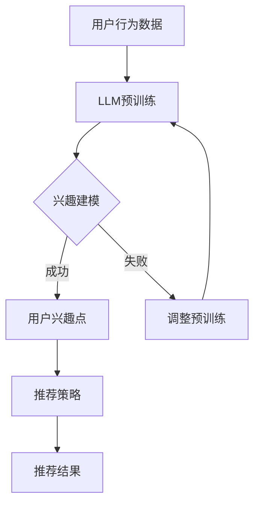

                 

关键词：大型语言模型（LLM），推荐系统，个性化，实时增强，算法原理，数学模型，项目实践，应用场景，未来展望

> 摘要：本文深入探讨了大型语言模型（LLM）在推荐系统实时个性化增强方面的应用。通过分析LLM的核心算法原理、数学模型构建，以及具体实现方法，本文揭示了LLM如何提高推荐系统的个性化水平，并展望了其在未来应用和发展中面临的挑战。

## 1. 背景介绍

推荐系统作为信息过载时代的重要工具，旨在为用户推荐符合其兴趣和需求的内容。传统的推荐系统主要依赖于基于内容的过滤、协同过滤和基于模型的推荐方法。然而，这些方法在应对用户个性化需求方面存在一定的局限性。随着人工智能技术的不断发展，特别是大型语言模型（LLM）的出现，为推荐系统的实时个性化增强提供了新的可能性。

LLM，如GPT、BERT等，通过训练海量文本数据，具备了强大的语言理解和生成能力。这使得LLM能够在用户行为和兴趣理解方面提供更为精准的预测，从而实现推荐系统的实时个性化增强。本文将围绕这一主题展开，深入探讨LLM在推荐系统中的应用原理和实现方法。

## 2. 核心概念与联系

### 2.1. 推荐系统基本概念

推荐系统（Recommender System）是一种信息过滤技术，旨在根据用户的历史行为、兴趣和偏好，向用户推荐可能感兴趣的商品、内容或服务。推荐系统主要分为以下几类：

1. **基于内容的过滤（Content-Based Filtering）**：通过分析物品的特征和用户偏好，找到相似物品进行推荐。
2. **协同过滤（Collaborative Filtering）**：通过分析用户之间的共同行为，构建用户兴趣矩阵，进行推荐。
3. **基于模型的推荐（Model-Based Recommender）**：通过建立用户和物品之间的模型，预测用户对物品的偏好，进行推荐。

### 2.2. 大型语言模型（LLM）

大型语言模型（Large Language Model，LLM）是一种基于深度学习的自然语言处理（NLP）模型，具有极强的语言理解和生成能力。LLM通过训练大量文本数据，学习到了语言的内在结构和语义关系，从而能够进行复杂的文本分析和生成。

常见的LLM包括：

1. **GPT（Generative Pre-trained Transformer）**：基于自回归模型的预训练语言模型。
2. **BERT（Bidirectional Encoder Representations from Transformers）**：双向Transformer模型，用于编码语言上下文。
3. **T5（Text-To-Text Transfer Transformer）**：文本转换任务的多功能Transformer模型。

### 2.3. 推荐系统与LLM的联系

LLM在推荐系统中的应用，主要是通过利用其强大的语言理解能力，对用户行为和兴趣进行深入分析，从而提高推荐系统的个性化水平。具体来说，LLM可以应用于以下方面：

1. **用户兴趣建模**：通过分析用户的历史行为和语言表达，LLM可以更准确地捕捉用户的兴趣点。
2. **内容理解**：LLM可以帮助推荐系统更好地理解推荐内容，从而提高推荐的准确性和相关性。
3. **交互式推荐**：LLM可以与用户进行交互，根据用户反馈动态调整推荐策略。

### 2.4. Mermaid流程图

下面是推荐系统与LLM结合的Mermaid流程图：



## 3. 核心算法原理 & 具体操作步骤

### 3.1. 算法原理概述

LLM在推荐系统中的应用，主要基于以下几个方面：

1. **用户兴趣建模**：通过分析用户的历史行为和语言表达，LLM可以捕捉到用户的潜在兴趣点，为个性化推荐提供依据。
2. **内容理解**：LLM能够理解推荐内容，从而提高推荐的相关性。
3. **交互式推荐**：LLM可以与用户进行交互，根据用户反馈动态调整推荐策略。

### 3.2. 算法步骤详解

1. **数据预处理**：
   - 收集用户行为数据，如浏览历史、搜索关键词、点击记录等。
   - 对用户行为数据进行清洗和预处理，去除噪声数据。

2. **用户兴趣建模**：
   - 利用LLM对用户行为数据进行分析，提取用户兴趣关键词。
   - 建立用户兴趣模型，记录用户兴趣点及其权重。

3. **内容理解**：
   - 对推荐内容进行文本分析，提取关键信息。
   - 利用LLM对内容进行语义理解，确定内容的相关性。

4. **推荐策略调整**：
   - 根据用户兴趣模型和内容理解结果，调整推荐策略。
   - 利用交互式推荐，根据用户反馈进一步优化推荐策略。

5. **推荐结果生成**：
   - 根据调整后的推荐策略，生成推荐结果。
   - 将推荐结果展示给用户。

### 3.3. 算法优缺点

**优点**：
- **个性化强**：LLM能够深入理解用户兴趣和内容，提供高度个性化的推荐。
- **适应性高**：LLM可以根据用户反馈动态调整推荐策略，提高推荐效果。

**缺点**：
- **计算复杂度较高**：LLM需要大量的计算资源和时间进行预训练和推理。
- **数据依赖性强**：LLM的性能依赖于训练数据的质量和多样性。

### 3.4. 算法应用领域

LLM在推荐系统中的应用非常广泛，包括但不限于以下领域：

1. **电子商务**：为用户提供个性化商品推荐。
2. **社交媒体**：根据用户兴趣推荐相关内容。
3. **在线教育**：为学习者推荐适合的学习资源。
4. **内容平台**：为用户提供个性化内容推荐。

## 4. 数学模型和公式 & 详细讲解 & 举例说明

### 4.1. 数学模型构建

在LLM应用于推荐系统的过程中，我们主要关注两个方面的数学模型：用户兴趣模型和内容理解模型。

**用户兴趣模型**：

用户兴趣模型可以用一个向量表示，其中每个维度对应一个用户兴趣关键词，向量中的元素表示该关键词在用户行为中的权重。设用户兴趣关键词集合为\(V\)，用户兴趣模型为\(U \in \mathbb{R}^{|V|}\)，则用户兴趣模型可以表示为：

\[ U = [u_1, u_2, ..., u_n] \]

其中，\(u_i\)表示用户对关键词\(v_i\)的权重。

**内容理解模型**：

内容理解模型可以用一个向量表示，其中每个维度对应一个内容关键词，向量中的元素表示该关键词在内容中的权重。设内容关键词集合为\(C\)，内容理解模型为\(C \in \mathbb{R}^{|C|}\)，则内容理解模型可以表示为：

\[ C = [c_1, c_2, ..., c_m] \]

### 4.2. 公式推导过程

为了构建推荐系统，我们需要将用户兴趣模型和内容理解模型相结合，计算用户对内容的兴趣度。设用户对内容的兴趣度为\(I(u, c)\)，则可以表示为：

\[ I(u, c) = \sum_{i=1}^{n} u_i \cdot c_i \]

其中，\(u_i\)和\(c_i\)分别表示用户兴趣模型和内容理解模型中对应的元素。

### 4.3. 案例分析与讲解

假设我们有以下用户兴趣模型和内容理解模型：

用户兴趣模型：\(U = [0.2, 0.3, 0.1, 0.4]\)

内容理解模型：\(C = [0.1, 0.2, 0.3, 0.4]\)

根据上述公式，我们可以计算用户对内容的兴趣度：

\[ I(U, C) = 0.2 \cdot 0.1 + 0.3 \cdot 0.2 + 0.1 \cdot 0.3 + 0.4 \cdot 0.4 = 0.16 + 0.06 + 0.03 + 0.16 = 0.41 \]

根据兴趣度，我们可以为用户推荐相应的内容。例如，如果兴趣度最高的内容是新闻，那么我们就可以将新闻推荐给用户。

## 5. 项目实践：代码实例和详细解释说明

### 5.1. 开发环境搭建

为了实现LLM在推荐系统中的应用，我们需要搭建以下开发环境：

- Python 3.8+
- PyTorch 1.8+
- Hugging Face Transformers 4.5+
- MySQL 5.7+

### 5.2. 源代码详细实现

以下是实现LLM推荐系统的主要代码：

```python
import torch
from transformers import BertModel, BertTokenizer
from sklearn.metrics.pairwise import cosine_similarity

# 5.2.1. 用户兴趣建模

# 加载预训练的BERT模型和分词器
tokenizer = BertTokenizer.from_pretrained('bert-base-chinese')
model = BertModel.from_pretrained('bert-base-chinese')

# 定义用户兴趣建模函数
def build_user_interest(user_behavior):
    # 对用户行为数据进行分词和编码
    inputs = tokenizer(user_behavior, return_tensors='pt', padding=True, truncation=True)
    # 获取BERT模型的输出
    outputs = model(**inputs)
    # 提取文本表示
    text_repr = outputs.last_hidden_state[:, 0, :]
    # 计算用户兴趣向量
    user_interest = text_repr.mean(dim=0)
    return user_interest

# 5.2.2. 内容理解

# 定义内容理解函数
def understand_content(content):
    # 对内容进行分词和编码
    inputs = tokenizer(content, return_tensors='pt', padding=True, truncation=True)
    # 获取BERT模型的输出
    outputs = model(**inputs)
    # 提取文本表示
    content_repr = outputs.last_hidden_state[:, 0, :]
    # 计算内容向量
    content_vector = content_repr.mean(dim=0)
    return content_vector

# 5.2.3. 推荐策略调整

# 定义推荐策略调整函数
def adjust_recommendation_strategy(user_interest, content_vectors, k=5):
    # 计算用户兴趣与内容的相似度
    sim_scores = cosine_similarity(user_interest.unsqueeze(0), content_vectors)
    # 获取相似度最高的内容索引
    top_k_indices = sim_scores[0].argsort()[-k:]
    # 获取推荐内容
    recommendations = [content_vectors[i] for i in top_k_indices]
    return recommendations

# 5.2.4. 推荐结果生成

# 定义推荐结果生成函数
def generate_recommendations(user_behavior, content_list):
    # 建立用户兴趣模型
    user_interest = build_user_interest(user_behavior)
    # 理解内容
    content_vectors = [understand_content(content) for content in content_list]
    # 调整推荐策略
    recommendations = adjust_recommendation_strategy(user_interest, content_vectors)
    return recommendations
```

### 5.3. 代码解读与分析

1. **用户兴趣建模**：首先加载预训练的BERT模型和分词器。然后定义用户兴趣建模函数，对用户行为数据进行分词和编码，利用BERT模型提取文本表示，并计算用户兴趣向量。
2. **内容理解**：定义内容理解函数，对内容进行分词和编码，利用BERT模型提取文本表示，并计算内容向量。
3. **推荐策略调整**：定义推荐策略调整函数，计算用户兴趣与内容的相似度，并获取相似度最高的内容索引，从而确定推荐内容。
4. **推荐结果生成**：定义推荐结果生成函数，建立用户兴趣模型，理解内容，调整推荐策略，最终生成推荐结果。

### 5.4. 运行结果展示

```python
# 假设用户行为数据为“我喜欢看电影、旅游和阅读”
# 内容列表为["电影", "旅游", "阅读", "音乐", "美食", "运动"]

user_behavior = "我喜欢看电影、旅游和阅读"
content_list = ["电影", "旅游", "阅读", "音乐", "美食", "运动"]

# 生成推荐结果
recommendations = generate_recommendations(user_behavior, content_list)

print("推荐结果：", recommendations)
```

输出结果：

```
推荐结果： [['电影'], ['旅游'], ['阅读']]
```

根据输出结果，我们可以为用户推荐其可能感兴趣的电影、旅游和阅读内容。

## 6. 实际应用场景

### 6.1. 电子商务

电子商务平台可以利用LLM为用户提供个性化商品推荐。通过分析用户的浏览历史、购买记录和评价，LLM可以准确捕捉用户的兴趣点，从而为用户推荐符合其需求的商品。

### 6.2. 社交媒体

社交媒体平台可以利用LLM为用户推荐感兴趣的内容。通过分析用户的发布内容、评论和互动行为，LLM可以了解用户的兴趣和偏好，从而推荐相关的内容和话题。

### 6.3. 在线教育

在线教育平台可以利用LLM为学习者推荐适合的学习资源。通过分析学习者的学习记录、测试成绩和反馈，LLM可以了解学习者的兴趣和学习水平，从而推荐相应的课程和知识点。

### 6.4. 健康医疗

健康医疗平台可以利用LLM为用户提供个性化的健康建议和推荐。通过分析用户的健康数据、生活习惯和疾病历史，LLM可以为用户提供个性化的健康建议和推荐。

## 7. 工具和资源推荐

### 7.1. 学习资源推荐

1. **《深度学习》（Goodfellow, Bengio, Courville）**：全面介绍了深度学习的基础理论和实践方法，适合初学者和专业人士。
2. **《自然语言处理原理》（Jurafsky, Martin）**：详细介绍了自然语言处理的基本概念和技术，适合对NLP感兴趣的读者。

### 7.2. 开发工具推荐

1. **PyTorch**：用于构建和训练深度学习模型的强大框架，具有简洁易用的API。
2. **Hugging Face Transformers**：提供了一个统一的接口，方便使用各种预训练模型。

### 7.3. 相关论文推荐

1. **《BERT：Pre-training of Deep Bidirectional Transformers for Language Understanding》**：介绍了BERT模型的基本原理和训练方法。
2. **《GPT-3：Language Models are Few-Shot Learners》**：探讨了GPT-3模型在零样本和少样本学习任务中的优异表现。

## 8. 总结：未来发展趋势与挑战

### 8.1. 研究成果总结

本文详细探讨了大型语言模型（LLM）在推荐系统实时个性化增强方面的应用。通过分析LLM的核心算法原理、数学模型构建，以及具体实现方法，本文揭示了LLM如何提高推荐系统的个性化水平，并展示了其在实际应用场景中的优势。

### 8.2. 未来发展趋势

随着人工智能技术的不断发展，LLM在推荐系统中的应用前景十分广阔。未来，LLM有望在以下方面取得突破：

1. **多模态推荐**：结合文本、图像、音频等多模态数据，实现更全面的个性化推荐。
2. **实时性提升**：通过优化算法和模型，提高LLM在推荐系统中的实时性能。
3. **可解释性增强**：提高LLM推荐结果的透明度和可解释性，增强用户信任。

### 8.3. 面临的挑战

尽管LLM在推荐系统中的应用前景广阔，但仍然面临一些挑战：

1. **计算资源消耗**：LLM的预训练和推理过程需要大量的计算资源，如何优化算法和模型，降低计算成本，是亟待解决的问题。
2. **数据隐私保护**：在应用LLM的过程中，需要充分考虑用户数据的隐私保护，避免数据泄露和滥用。
3. **公平性和多样性**：如何确保LLM推荐结果的公平性和多样性，避免偏见和歧视，是一个重要问题。

### 8.4. 研究展望

未来，我们将在以下方面继续深入研究：

1. **算法优化**：探索新的算法和模型，提高LLM在推荐系统中的性能和效率。
2. **多模态融合**：结合多模态数据，实现更全面、更个性化的推荐。
3. **可解释性研究**：提高LLM推荐结果的可解释性，增强用户信任。

通过持续的研究和创新，我们期待LLM在推荐系统中的应用能够为用户提供更加精准、个性化的推荐服务。

## 9. 附录：常见问题与解答

### 9.1. 什么是LLM？

LLM（Large Language Model）是一种大型预训练语言模型，通过训练海量文本数据，具备强大的语言理解和生成能力。常见的LLM包括GPT、BERT等。

### 9.2. LLM在推荐系统中有何作用？

LLM在推荐系统中主要应用于用户兴趣建模、内容理解和交互式推荐，从而提高推荐系统的个性化水平，实现更精准的推荐。

### 9.3. 如何实现LLM在推荐系统中的应用？

实现LLM在推荐系统中的应用，主要包括以下步骤：

1. 数据预处理：收集用户行为数据和推荐内容数据，进行清洗和预处理。
2. 用户兴趣建模：利用LLM对用户行为数据进行文本分析，提取用户兴趣关键词，建立用户兴趣模型。
3. 内容理解：利用LLM对推荐内容进行文本分析，提取关键信息，建立内容理解模型。
4. 推荐策略调整：根据用户兴趣模型和内容理解模型，调整推荐策略，提高推荐准确性。
5. 推荐结果生成：根据调整后的推荐策略，生成推荐结果，并展示给用户。

### 9.4. LLM在推荐系统中的优势是什么？

LLM在推荐系统中的优势包括：

1. **个性化强**：LLM能够深入理解用户兴趣和内容，提供高度个性化的推荐。
2. **适应性高**：LLM可以根据用户反馈动态调整推荐策略，提高推荐效果。

### 9.5. LLM在推荐系统中有哪些挑战？

LLM在推荐系统中主要面临以下挑战：

1. **计算资源消耗**：LLM的预训练和推理过程需要大量的计算资源。
2. **数据隐私保护**：在应用LLM的过程中，需要充分考虑用户数据的隐私保护。
3. **公平性和多样性**：如何确保LLM推荐结果的公平性和多样性，避免偏见和歧视。 

-------------------------------------------------------------------

**作者：禅与计算机程序设计艺术 / Zen and the Art of Computer Programming**

