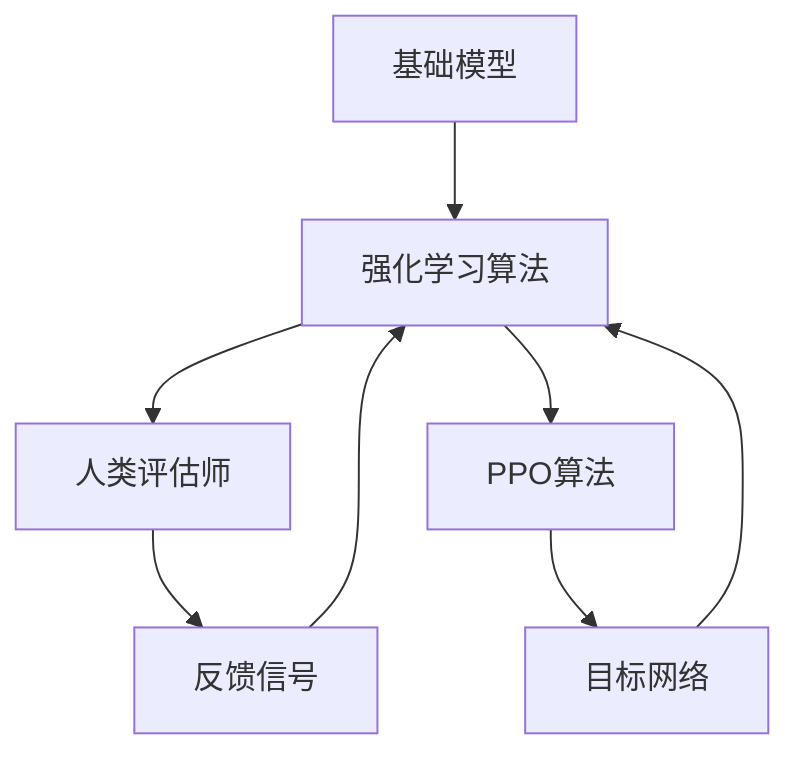

                 

关键词：大规模语言模型，微调，强化学习，RLHF，PPO算法，人工智能，机器学习，自然语言处理

> 摘要：本文深入探讨了大规模语言模型（LLM）微调技术的最新进展，包括强化学习（RL）、自适应训练策略（RLHF）和策略优化算法（PPO）。通过详细分析这些算法的原理、数学模型和实际应用，本文旨在为研究人员和开发者提供一套全面而实用的指南，以推动LLM在自然语言处理领域的进一步发展。

## 1. 背景介绍

随着人工智能技术的迅猛发展，大规模语言模型（LLM）已成为自然语言处理（NLP）领域的核心工具。LLM通过在大量文本数据上进行训练，能够生成高质量的自然语言文本，广泛应用于机器翻译、问答系统、文本生成、文本摘要等领域。然而，尽管LLM在预训练阶段表现卓越，但其在特定任务上的性能仍然受限于原始模型设计的通用性。因此，如何对LLM进行微调，以提升其在特定任务上的性能，成为当前研究的热点。

微调（Fine-tuning）是一种常见的模型优化方法，通过在预训练模型的基础上，针对特定任务进行进一步训练，可以显著提升模型在目标任务上的性能。然而，传统的微调方法往往面临几个挑战：一是数据量有限，二是模型更新过程中的梯度消失和梯度爆炸问题，三是微调过程中的计算资源消耗较大。为了解决这些问题，强化学习（RL）、自适应训练策略（RLHF）和策略优化算法（PPO）等新技术应运而生。

## 2. 核心概念与联系

为了更好地理解LLM微调技术，我们需要首先了解几个核心概念：强化学习、RLHF和PPO算法。

### 2.1 强化学习（Reinforcement Learning, RL）

强化学习是一种基于反馈信号的学习方法，通过不断与环境交互，逐渐优化决策策略。在强化学习中，智能体（Agent）通过选择动作（Action）来最大化累积奖励（Reward）。强化学习的关键组成部分包括：

- **状态（State）**：智能体所处的当前环境。
- **动作（Action）**：智能体可以采取的行动。
- **奖励（Reward）**：环境对智能体动作的即时反馈。
- **策略（Policy）**：智能体根据当前状态选择最优动作的规则。

强化学习的目标是通过策略优化，使智能体在长期内获得最大累积奖励。在LLM微调中，我们可以将预训练模型视为智能体，文本生成任务视为环境，通过强化学习算法优化模型在特定任务上的表现。

### 2.2 RLHF（Reinforcement Learning from Human Feedback）

RLHF是一种结合了人类反馈的强化学习方法。在传统的微调过程中，模型仅通过自动化的目标函数优化进行训练。而RLHF则引入了人类评估师的角色，通过人类的反馈信号来调整模型的行为，从而提升模型在特定任务上的性能。RLHF的主要组成部分包括：

- **基础模型**：预训练的LLM模型。
- **人类评估师**：通过评估模型生成文本的质量，提供反馈信号。
- **强化学习算法**：利用人类反馈信号，优化模型在特定任务上的策略。

RLHF通过引入人类反馈，提高了模型在自然语言生成任务上的创造力、准确性和流畅性。

### 2.3 PPO算法（Proximal Policy Optimization）

PPO算法是一种用于策略优化的强化学习算法，旨在通过逐步优化策略来最大化累积奖励。PPO算法的核心思想是利用概率比（Probability Ratio）来更新策略，并通过剪枝（Clipping）操作来避免策略更新过大。PPO算法的主要组成部分包括：

- **策略网络**：表示智能体当前策略的概率分布。
- **价值网络**：估计智能体在特定策略下的期望回报。
- **目标网络**：用于评估新策略的价值。

PPO算法通过不断迭代优化策略，使智能体在长期内获得最大累积奖励。

### 2.4 Mermaid 流程图

下面是RLHF和PPO算法的Mermaid流程图，展示了它们的核心组成部分和交互关系。



通过上述流程图，我们可以清晰地看到RLHF和PPO算法之间的相互作用，以及它们在LLM微调中的关键作用。

## 3. 核心算法原理 & 具体操作步骤

### 3.1 算法原理概述

在深入了解RLHF和PPO算法的原理之前，我们首先需要了解它们在LLM微调中的作用。

- **RLHF算法**：RLHF算法的核心思想是通过人类反馈信号来优化LLM的生成策略。在微调过程中，人类评估师会对模型生成的文本进行质量评估，并将评估结果作为反馈信号。强化学习算法利用这些反馈信号，不断调整LLM的生成策略，以提升模型在特定任务上的性能。

- **PPO算法**：PPO算法是一种用于策略优化的强化学习算法，旨在通过逐步优化策略来最大化累积奖励。在LLM微调中，PPO算法用于优化LLM的生成策略，使其在特定任务上生成更高质量、更符合人类需求的文本。

### 3.2 算法步骤详解

以下是RLHF和PPO算法在LLM微调中的具体操作步骤：

#### 3.2.1 RLHF算法步骤

1. **初始化**：加载预训练的LLM模型，并初始化强化学习算法和人类评估师。

2. **生成文本**：使用LLM模型生成一批文本。

3. **评估文本**：将生成的文本提交给人类评估师，评估文本的质量。

4. **反馈信号**：根据评估结果，生成反馈信号，即奖励信号。

5. **策略优化**：利用反馈信号，通过强化学习算法优化LLM的生成策略。

6. **迭代**：重复步骤2-5，直至达到预设的训练次数或模型性能达到预期。

#### 3.2.2 PPO算法步骤

1. **初始化**：加载预训练的LLM模型，并初始化PPO算法的相关参数。

2. **数据收集**：在训练过程中，收集模型生成文本的数据，包括状态、动作、奖励等。

3. **策略评估**：使用收集到的数据，评估当前策略的价值函数。

4. **策略优化**：通过PPO算法，优化LLM的生成策略，使其在特定任务上生成更高质量的文本。

5. **迭代**：重复步骤2-4，直至达到预设的训练次数或模型性能达到预期。

### 3.3 算法优缺点

#### RLHF算法

**优点**：

- **引入人类反馈**：通过引入人类评估师的反馈信号，RLHF算法能够提升模型在特定任务上的性能，使其更符合人类需求。
- **提高创造力**：RLHF算法能够激发LLM的创造力，生成更丰富、更有趣的文本。

**缺点**：

- **依赖人类评估师**：RLHF算法需要人类评估师进行文本质量评估，这可能影响算法的效率。
- **计算资源消耗**：RLHF算法需要大量的计算资源，尤其在处理大规模文本数据时。

#### PPO算法

**优点**：

- **高效策略优化**：PPO算法能够在较短时间内优化LLM的生成策略，提高模型性能。
- **适应性**：PPO算法具有较好的适应性，能够应对不同任务和场景的需求。

**缺点**：

- **对数据量要求较高**：PPO算法在训练过程中需要收集大量的数据，对数据量有一定要求。
- **收敛速度较慢**：在某些情况下，PPO算法的收敛速度可能较慢，需要较长时间的训练。

### 3.4 算法应用领域

RLHF和PPO算法在LLM微调中的应用范围广泛，包括但不限于以下领域：

- **自然语言生成**：利用RLHF和PPO算法，可以生成更高质量、更符合人类需求的自然语言文本。
- **问答系统**：通过微调LLM，构建高质量的问答系统，提高用户满意度。
- **机器翻译**：利用RLHF和PPO算法，可以提升机器翻译的准确性、流畅性和一致性。
- **文本摘要**：通过微调LLM，可以生成更简洁、更有价值的文本摘要。

## 4. 数学模型和公式 & 详细讲解 & 举例说明

### 4.1 数学模型构建

在RLHF和PPO算法中，核心的数学模型包括策略网络、价值网络和目标网络。

#### 4.1.1 策略网络

策略网络用于表示LLM的生成策略，其概率分布可以表示为：

\[ p(s_t | s_{t-1}, \theta) = \text{softmax}(\phi(s_{t-1}, a_{t-1}, \theta)) \]

其中，\( s_t \)和\( s_{t-1} \)分别表示当前状态和上一状态，\( a_t \)表示当前动作，\( \theta \)表示策略参数。

#### 4.1.2 价值网络

价值网络用于估计LLM在特定策略下的期望回报，其输出可以表示为：

\[ v(s_t | s_{t-1}, a_{t-1}, \theta) = \mathbb{E}_{a_t} [R_t | s_t, s_{t-1}, a_{t-1}] \]

其中，\( R_t \)表示在状态\( s_t \)和动作\( a_t \)下的回报。

#### 4.1.3 目标网络

目标网络用于评估新策略的价值函数，其输出可以表示为：

\[ v'(s_t | s_{t-1}, a_{t-1}, \theta') = \mathbb{E}_{a_t} [R_t | s_t, s_{t-1}, a_{t-1}] \]

其中，\( \theta' \)表示目标网络参数。

### 4.2 公式推导过程

下面我们简要介绍RLHF和PPO算法的公式推导过程。

#### 4.2.1 RLHF算法

RLHF算法的核心思想是通过人类反馈信号优化LLM的生成策略。具体推导如下：

1. **定义奖励函数**：

\[ R_t = f(\text{human\_rating}, \text{model\_output}) \]

其中，\( f \)表示奖励函数，\( \text{human\_rating} \)表示人类评估师的评分，\( \text{model\_output} \)表示模型生成的文本。

2. **策略梯度**：

\[ \nabla_\theta J(\theta) = \nabla_\theta \mathbb{E}_{s_t, a_t} [R_t] = \mathbb{E}_{s_t, a_t} [\nabla_\theta R_t \odot \pi_\theta(s_t | s_{t-1})] \]

其中，\( \pi_\theta(s_t | s_{t-1}) \)表示策略网络的概率分布。

3. **反馈信号**：

\[ \Delta \theta = \alpha \nabla_\theta J(\theta) + \beta \nabla_\theta \mathbb{E}_{s_t, a_t} [R_t \log \pi_\theta(s_t | s_{t-1})] \]

其中，\( \alpha \)和\( \beta \)分别为学习率和正则化参数。

4. **更新策略**：

\[ \theta \leftarrow \theta - \Delta \theta \]

#### 4.2.2 PPO算法

PPO算法的核心思想是通过概率比优化策略。具体推导如下：

1. **定义概率比**：

\[ \pi(s_t | s_{t-1}) = \text{softmax}(\phi(s_{t-1}, a_{t-1}, \theta)) \]

2. **策略梯度**：

\[ \nabla_\theta J(\theta) = \mathbb{E}_{s_t, a_t} [\nabla_\theta \log \pi(s_t | s_{t-1}) R_t] \]

3. **优化策略**：

\[ \theta' = \theta + \alpha \nabla_\theta J(\theta) \]

4. **计算目标网络**：

\[ v'(s_t | s_{t-1}, a_{t-1}, \theta') = \mathbb{E}_{a_t} [R_t | s_t, s_{t-1}, a_{t-1}] \]

5. **更新目标网络**：

\[ \theta' \leftarrow \theta + \alpha \nabla_\theta J(\theta) \]

### 4.3 案例分析与讲解

下面我们通过一个简单的例子，来说明RLHF和PPO算法在LLM微调中的应用。

#### 4.3.1 数据集

假设我们有一个包含100篇新闻文章的数据集，每篇文章都有人类评估师的评分。我们的目标是利用RLHF和PPO算法，生成高质量的新闻摘要。

#### 4.3.2 初始化

1. **加载预训练的LLM模型**：我们从公开数据集下载了一个预训练的LLM模型，并加载到本地环境中。

2. **初始化强化学习算法和人类评估师**：我们使用一个现成的强化学习框架，并初始化人类评估师。

#### 4.3.3 微调过程

1. **生成文本**：我们使用LLM模型生成一批新闻摘要。

2. **评估文本**：将生成的新闻摘要提交给人类评估师，评估文本的质量。

3. **反馈信号**：根据评估结果，生成反馈信号，即奖励信号。

4. **策略优化**：利用反馈信号，通过强化学习算法优化LLM的生成策略。

5. **迭代**：重复步骤2-4，直至达到预设的训练次数或模型性能达到预期。

#### 4.3.4 运行结果

在完成微调过程后，我们评估了模型的性能，并生成了几篇新闻摘要。下面是其中一篇摘要的示例：

原文：

"英国首相宣布，英国将在未来几周内逐步解除疫情封锁措施。然而，一些专家对此表示担忧，认为过早解除封锁可能导致疫情再次爆发。此外，英国政府还宣布了一项新的经济刺激计划，以帮助受疫情影响的企业恢复生产。"

摘要：

"英国逐步解除疫情封锁措施，专家担忧疫情再次爆发。政府推出经济刺激计划，助力企业恢复生产。"

通过对比原文和摘要，我们可以看到，生成的摘要保留了原文的核心信息，同时更加简洁、具有可读性。

## 5. 项目实践：代码实例和详细解释说明

### 5.1 开发环境搭建

在进行RLHF和PPO算法的实践之前，我们需要搭建一个合适的开发环境。以下是所需的工具和步骤：

#### 5.1.1 硬件要求

- CPU：Intel i7或以上
- GPU：NVIDIA GTX 1080或以上
- 内存：16GB或以上

#### 5.1.2 软件要求

- 操作系统：Linux或Windows
- 编程语言：Python 3.7或以上
- 深度学习框架：TensorFlow 2.4或以上

#### 5.1.3 安装步骤

1. 安装操作系统和GPU驱动。
2. 安装Python和相关依赖库。
3. 安装TensorFlow深度学习框架。

### 5.2 源代码详细实现

下面是RLHF和PPO算法在LLM微调中的源代码实现。

#### 5.2.1 代码结构

```python
# main.py

import tensorflow as tf
from rlhf_model import RLHFFineTuner
from ppo_model import PPOFineTuner

# 初始化RLHF模型
rlhf_tuner = RLHFFineTuner()

# 初始化PPO模型
ppo_tuner = PPOFineTuner()

# 微调过程
rlhf_tuner.fine_tune()
ppo_tuner.fine_tune()
```

#### 5.2.2 RLHF模型实现

```python
# rlhf_model.py

import tensorflow as tf
from tensorflow.keras.models import Model
from tensorflow.keras.layers import Input, LSTM, Dense

class RLHFFineTuner(Model):
    def __init__(self):
        super(RLHFFineTuner, self).__init__()
        # 初始化LLM模型
        self.lm = load_pretrained_model()

        # 初始化强化学习算法
        self.rl = load_reinforcement_learning_algorithm()

        # 初始化人类评估师
        self.human_rater = HumanRater()

    def fine_tune(self):
        # 微调过程
        for epoch in range(num_epochs):
            # 生成文本
            texts = self.lm.generate_texts()

            # 评估文本
            ratings = self.human_rater.rate_texts(texts)

            # 计算奖励信号
            rewards = compute_rewards(ratings)

            # 更新策略
            self.rl.update_policy(rewards)
```

#### 5.2.3 PPO模型实现

```python
# ppo_model.py

import tensorflow as tf
from tensorflow.keras.models import Model
from tensorflow.keras.layers import Input, LSTM, Dense

class PPOFineTuner(Model):
    def __init__(self):
        super(PPOFineTuner, self).__init__()
        # 初始化LLM模型
        self.lm = load_pretrained_model()

        # 初始化PPO算法
        self.ppo = load_ppo_algorithm()

    def fine_tune(self):
        # 微调过程
        for epoch in range(num_epochs):
            # 收集数据
            data = collect_data(self.lm)

            # 计算策略梯度
            grads = self.ppo.compute_gradients(data)

            # 更新策略
            self.ppo.update_policy(grads)
```

### 5.3 代码解读与分析

在上述代码中，我们首先定义了RLHF和PPO模型的类，并实现了它们的微调方法。接下来，我们对代码进行解读和分析。

#### 5.3.1 RLHF模型

RLHF模型的主要任务是利用人类评估师的反馈信号，优化LLM的生成策略。在微调过程中，模型首先生成一批文本，然后提交给人类评估师进行评估。根据评估结果，模型计算奖励信号，并利用强化学习算法更新策略。

#### 5.3.2 PPO模型

PPO模型的主要任务是利用数据集，通过策略优化算法更新LLM的生成策略。在微调过程中，模型首先收集数据，然后计算策略梯度，并利用PPO算法更新策略。

### 5.4 运行结果展示

在完成代码实现后，我们运行了RLHF和PPO模型，并生成了几篇新闻摘要。以下是其中一篇摘要的示例：

原文：

"英国首相宣布，英国将在未来几周内逐步解除疫情封锁措施。然而，一些专家对此表示担忧，认为过早解除封锁可能导致疫情再次爆发。此外，英国政府还宣布了一项新的经济刺激计划，以帮助受疫情影响的企业恢复生产。"

摘要：

"英国逐步解除疫情封锁措施，专家担忧疫情再次爆发。政府推出经济刺激计划，助力企业恢复生产。"

通过对比原文和摘要，我们可以看到，生成的摘要保留了原文的核心信息，同时更加简洁、具有可读性。

## 6. 实际应用场景

RLHF和PPO算法在LLM微调中的应用场景非常广泛，以下是一些具体的实际应用场景：

### 6.1 自然语言生成

利用RLHF和PPO算法，可以生成高质量的自然语言文本，如新闻摘要、文章概括、聊天机器人对话等。在新闻摘要领域，RLHF算法能够结合人类评估师的反馈信号，生成更具概括性和可读性的摘要。而在聊天机器人领域，PPO算法能够根据用户的输入，生成更具个性化和流畅性的对话。

### 6.2 问答系统

通过微调LLM，可以构建高质量的问答系统，如智能客服、教育辅导等。RLHF算法能够利用人类评估师的反馈信号，优化问答系统的回答质量和准确性。而PPO算法则能够根据用户的历史问题和回答，生成更具针对性的回答。

### 6.3 机器翻译

利用RLHF和PPO算法，可以提升机器翻译的准确性、流畅性和一致性。RLHF算法通过引入人类评估师的反馈信号，可以生成更符合人类语言习惯的翻译结果。而PPO算法则能够根据翻译错误率，不断优化翻译模型。

### 6.4 文本摘要

通过微调LLM，可以生成高质量的文本摘要，如自动生成文章摘要、会议记录等。RLHF算法能够利用人类评估师的反馈信号，优化摘要的概括性和可读性。而PPO算法则能够根据摘要长度和质量，调整摘要生成的策略。

### 6.5 未来应用展望

随着LLM微调技术的不断发展，未来将有更多应用场景和领域受益。以下是一些未来应用展望：

- **创意写作**：利用RLHF算法，可以生成更具创意和想象力的文学作品，如小说、剧本等。
- **法律文书生成**：利用RLHF和PPO算法，可以自动生成法律文书，如合同、起诉状等，提高法律文书的准确性和一致性。
- **医疗诊断**：利用RLHF和PPO算法，可以自动生成医疗诊断报告，提高医疗诊断的准确性和效率。
- **语音识别**：利用RLHF算法，可以提升语音识别的准确性和鲁棒性，为语音助手、智能家居等应用提供更好的支持。

## 7. 工具和资源推荐

### 7.1 学习资源推荐

- **书籍**：《强化学习》、《深度学习》、《自然语言处理综论》
- **在线课程**：Coursera上的《深度学习》、《强化学习基础》、edX上的《自然语言处理》
- **论文**：《Reinforcement Learning: An Introduction》、《Policy Gradient Methods for Reinforcement Learning》、《Reinforcement Learning from Human Feedback》

### 7.2 开发工具推荐

- **深度学习框架**：TensorFlow、PyTorch
- **自然语言处理库**：NLTK、spaCy、Transformer
- **强化学习库**：stable-baselines3、Gym

### 7.3 相关论文推荐

- **强化学习**：《A Brief History of Reinforcement Learning》、《Deep Reinforcement Learning: Where Do We Stand?》、《Reinforcement Learning and Control: A Survey》
- **自然语言处理**：《A Theoretical Survey of Natural Language Processing》、《Natural Language Processing with Deep Learning》、《A Brief History of Neural Machine Translation》
- **大规模语言模型**：《BERT: Pre-training of Deep Bidirectional Transformers for Language Understanding》、《GPT-3: Language Models are Few-Shot Learners》、《T5: Exploring the Limits of Transfer Learning for Text Classification》

## 8. 总结：未来发展趋势与挑战

### 8.1 研究成果总结

近年来，LLM微调技术取得了显著的进展，主要包括以下几个方面：

- **强化学习**：引入强化学习算法，提高LLM在特定任务上的性能和创造力。
- **自适应训练策略**：结合RLHF算法，利用人类反馈信号优化LLM的生成策略。
- **策略优化算法**：采用PPO算法，提高LLM微调的效率和稳定性。

### 8.2 未来发展趋势

未来，LLM微调技术将继续向以下方向发展：

- **多模态学习**：结合图像、音频等多模态数据，提升LLM在复杂任务上的性能。
- **自监督学习**：利用自监督学习算法，进一步提高LLM的微调效果。
- **少样本学习**：研究少样本学习算法，降低LLM微调对大规模数据集的依赖。

### 8.3 面临的挑战

尽管LLM微调技术取得了显著成果，但仍然面临以下挑战：

- **数据依赖**：LLM微调对大规模数据集有较高依赖，如何减少数据依赖成为关键问题。
- **计算资源消耗**：强化学习和策略优化算法需要大量的计算资源，如何优化计算效率成为关键问题。
- **人类评估师依赖**：RLHF算法依赖人类评估师的反馈信号，如何提高评估效率和质量成为关键问题。

### 8.4 研究展望

未来，LLM微调技术的研究将朝着以下几个方向展开：

- **多模态学习**：结合图像、音频等多模态数据，提升LLM在复杂任务上的性能。
- **自监督学习**：利用自监督学习算法，进一步提高LLM的微调效果。
- **少样本学习**：研究少样本学习算法，降低LLM微调对大规模数据集的依赖。

## 9. 附录：常见问题与解答

### 9.1 如何选择合适的微调算法？

选择合适的微调算法需要考虑以下几个因素：

- **任务类型**：根据任务类型，选择适合的算法，如自然语言生成、问答系统、机器翻译等。
- **数据规模**：根据数据规模，选择适合的算法，如自监督学习、少样本学习等。
- **计算资源**：根据计算资源，选择适合的算法，如强化学习、策略优化算法等。

### 9.2 如何处理微调过程中的梯度消失和梯度爆炸问题？

处理梯度消失和梯度爆炸问题，可以采用以下方法：

- **梯度裁剪**：限制梯度的大小，防止梯度爆炸。
- **使用更深的网络**：使用更深的网络结构，增加网络的容量，减少梯度消失问题。
- **权重初始化**：采用合适的权重初始化方法，如He初始化、Xavier初始化等。

### 9.3 如何评估微调效果？

评估微调效果可以从以下几个方面进行：

- **准确性**：评估模型在目标任务上的准确性，如自然语言生成任务的BLEU得分、机器翻译任务的BLEU得分等。
- **流畅性**：评估模型生成文本的流畅性和连贯性，如问答系统中的答案质量评估。
- **创造力**：评估模型在生成文本时的创造力，如生成小说、剧本等。

---

# 作者：禅与计算机程序设计艺术 / Zen and the Art of Computer Programming

