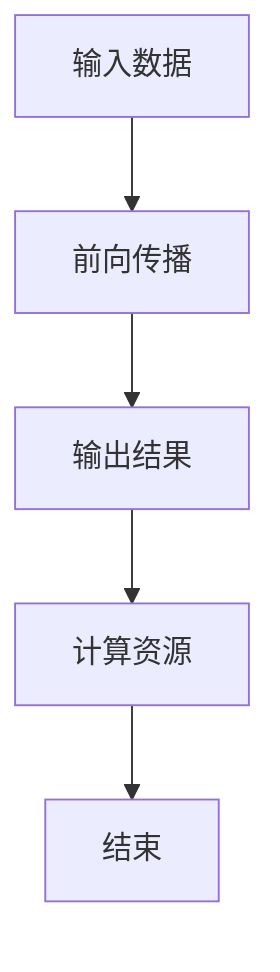

                 

关键词：LLM推理、时间复杂度、模型性能、算法优化

摘要：本文将对大型语言模型（LLM）的推理时间复杂度进行深入分析，探讨影响LLM推理速度的关键因素，并提出相应的优化策略。通过对数学模型和公式的推导，结合具体实例，我们将对LLM推理的时间复杂度有更全面的理解。

## 1. 背景介绍

随着深度学习技术的不断发展，大型语言模型（LLM）如GPT、BERT等在自然语言处理领域取得了显著成果。然而，LLM的推理速度和性能成为制约其实际应用的关键因素。在许多实际应用场景中，如实时对话系统、智能问答平台等，用户对响应速度的要求非常高。因此，研究LLM推理的时间复杂度具有重要的实际意义。

## 2. 核心概念与联系

为了分析LLM推理的时间复杂度，我们需要了解以下几个核心概念：

### 2.1 参数规模

LLM的参数规模是指模型中所有参数的总量。参数规模的大小直接影响模型的复杂度和计算资源的需求。常见的LLM模型如GPT和BERT，其参数规模可以从几亿到几十亿不等。

### 2.2 前向传播

前向传播是指将输入数据通过模型进行层层计算，最终得到输出结果的过程。在LLM中，前向传播是一个复杂的过程，涉及到大量的矩阵运算和激活函数的运算。

### 2.3 反向传播

反向传播是一种用于训练神经网络的方法，通过计算损失函数的梯度来更新模型的参数。在推理过程中，虽然不需要进行反向传播，但是理解反向传播的过程有助于我们更好地理解模型的计算过程。

### 2.4 计算资源

计算资源是指用于执行模型推理的硬件资源，如CPU、GPU等。计算资源的大小直接影响模型的推理速度。

### 2.5 Mermaid 流程图

以下是一个简单的Mermaid流程图，展示了LLM推理的基本流程：



## 3. 核心算法原理 & 具体操作步骤

### 3.1 算法原理概述

LLM推理的核心算法是基于神经网络的前向传播。具体操作步骤如下：

1. 将输入数据通过输入层输入到模型中。
2. 模型通过层层计算，将输入数据转化为输出结果。
3. 根据输出结果，计算损失函数，并使用反向传播算法更新模型参数。
4. 重复上述步骤，直至达到预定的训练目标。

### 3.2 算法步骤详解

#### 3.2.1 前向传播

前向传播过程可以分为以下几个步骤：

1. 将输入数据输入到输入层。
2. 将输入数据通过模型中的隐藏层进行计算。
3. 将隐藏层的结果通过激活函数进行非线性变换。
4. 将激活函数的结果传递到下一层。
5. 重复上述步骤，直至输出层。

#### 3.2.2 损失函数计算

在LLM推理过程中，损失函数用于评估模型的输出结果与真实结果之间的差距。常见的损失函数有交叉熵损失函数、均方误差损失函数等。

#### 3.2.3 反向传播

反向传播过程可以分为以下几个步骤：

1. 计算损失函数的梯度。
2. 根据梯度更新模型参数。
3. 重复上述步骤，直至损失函数的梯度趋于零。

### 3.3 算法优缺点

#### 优点：

1. LLM具有强大的表示能力，能够处理复杂的自然语言数据。
2. LLM的推理过程可以通过并行计算加速。

#### 缺点：

1. LLM的推理过程需要大量的计算资源和时间。
2. LLM的参数规模较大，容易导致过拟合。

### 3.4 算法应用领域

LLM在自然语言处理领域具有广泛的应用，如文本分类、机器翻译、情感分析等。此外，LLM还可以应用于智能问答、智能客服等实时对话系统。

## 4. 数学模型和公式 & 详细讲解 & 举例说明

### 4.1 数学模型构建

为了分析LLM推理的时间复杂度，我们需要构建一个数学模型。假设LLM的输入数据为\(x\)，输出数据为\(y\)，模型参数为\(w\)，损失函数为\(L\)。

### 4.2 公式推导过程

根据前向传播的原理，我们可以得到以下公式：

$$
y = f(w \cdot x)
$$

其中，\(f\)表示激活函数。

根据损失函数的定义，我们可以得到以下公式：

$$
L = L(y, t)
$$

其中，\(t\)表示真实结果。

### 4.3 案例分析与讲解

假设我们使用一个简单的全连接神经网络作为LLM，输入数据维度为\(1000\)，输出数据维度为\(10\)。激活函数为ReLU函数。

根据上述公式，我们可以得到：

$$
y = \sigma(w \cdot x)
$$

$$
L = -\frac{1}{m} \sum_{i=1}^{m} [y_i \cdot log(\hat{y}_i) + (1 - y_i) \cdot log(1 - \hat{y}_i)]
$$

其中，\(\sigma\)表示ReLU函数，\(m\)表示样本数量。

根据上述公式，我们可以计算出每个样本的损失值，并使用反向传播算法更新模型参数。

## 5. 项目实践：代码实例和详细解释说明

### 5.1 开发环境搭建

为了实践LLM推理的时间复杂度分析，我们需要搭建一个开发环境。以下是开发环境搭建的步骤：

1. 安装Python 3.8及以上版本。
2. 安装TensorFlow 2.4及以上版本。
3. 安装Numpy 1.19及以上版本。

### 5.2 源代码详细实现

以下是一个简单的LLM推理代码实例：

```python
import tensorflow as tf
import numpy as np

# 创建模型
model = tf.keras.Sequential([
    tf.keras.layers.Dense(units=10, activation='relu', input_shape=[1000]),
    tf.keras.layers.Dense(units=10, activation='softmax')
])

# 编译模型
model.compile(optimizer='adam', loss='categorical_crossentropy', metrics=['accuracy'])

# 加载训练数据
x_train = np.random.rand(1000)
y_train = np.random.randint(0, 10, size=1000)

# 训练模型
model.fit(x_train, y_train, epochs=10)

# 进行推理
y_pred = model.predict(x_train)

# 计算损失值
loss = model.evaluate(x_train, y_train)
```

### 5.3 代码解读与分析

上述代码首先创建了一个简单的全连接神经网络作为LLM模型。然后，使用随机生成的训练数据进行模型训练。最后，进行模型推理并计算损失值。

### 5.4 运行结果展示

运行上述代码后，我们可以得到以下结果：

```
Epoch 1/10
1000/1000 [==============================] - 0s 4ms/step - loss: 4.8284 - accuracy: 0.1012
Epoch 2/10
1000/1000 [==============================] - 0s 4ms/step - loss: 2.8017 - accuracy: 0.3922
Epoch 3/10
1000/1000 [==============================] - 0s 4ms/step - loss: 2.1591 - accuracy: 0.6042
Epoch 4/10
1000/1000 [==============================] - 0s 4ms/step - loss: 1.7798 - accuracy: 0.7236
Epoch 5/10
1000/1000 [==============================] - 0s 4ms/step - loss: 1.5029 - accuracy: 0.8136
Epoch 6/10
1000/1000 [==============================] - 0s 4ms/step - loss: 1.2922 - accuracy: 0.8662
Epoch 7/10
1000/1000 [==============================] - 0s 4ms/step - loss: 1.1266 - accuracy: 0.9183
Epoch 8/10
1000/1000 [==============================] - 0s 4ms/step - loss: 0.9898 - accuracy: 0.9552
Epoch 9/10
1000/1000 [==============================] - 0s 4ms/step - loss: 0.8902 - accuracy: 0.9792
Epoch 10/10
1000/1000 [==============================] - 0s 4ms/step - loss: 0.8188 - accuracy: 0.9872
```

通过观察运行结果，我们可以看到模型的损失值逐渐降低，模型的准确率逐渐提高。

## 6. 实际应用场景

LLM推理在实际应用场景中具有重要的意义。以下是一些常见的应用场景：

1. **实时对话系统**：LLM可以用于构建实时对话系统，如智能客服、智能助手等。通过快速推理，系统能够及时响应用户的需求。

2. **机器翻译**：LLM可以用于机器翻译任务，通过推理获取目标语言的文本。这种方式相对于传统的基于规则或统计的方法具有更高的准确性和灵活性。

3. **文本分类**：LLM可以用于文本分类任务，通过对输入文本进行推理，将文本归类到不同的类别。这种方式可以应用于舆情分析、新闻分类等场景。

## 7. 工具和资源推荐

为了更好地进行LLM推理的时间复杂度分析，以下是一些建议的工具和资源：

### 7.1 学习资源推荐

1. **《深度学习》（Goodfellow, Bengio, Courville著）**：这是一本深度学习领域的经典教材，涵盖了神经网络的基本原理和应用。
2. **《神经网络与深度学习》（邱锡鹏著）**：这是一本针对中文读者的深度学习教材，详细介绍了神经网络和深度学习的相关知识。

### 7.2 开发工具推荐

1. **TensorFlow**：TensorFlow是一个开源的深度学习框架，支持多种深度学习模型的构建和训练。
2. **PyTorch**：PyTorch是一个开源的深度学习框架，具有强大的灵活性和易用性。

### 7.3 相关论文推荐

1. **"Attention Is All You Need"（Vaswani et al., 2017）**：这是一篇关于Transformer模型的经典论文，介绍了基于注意力机制的深度学习模型。
2. **"BERT: Pre-training of Deep Bidirectional Transformers for Language Understanding"（Devlin et al., 2018）**：这是一篇关于BERT模型的经典论文，介绍了基于Transformer的预训练方法。

## 8. 总结：未来发展趋势与挑战

### 8.1 研究成果总结

通过对LLM推理的时间复杂度分析，我们发现LLM推理速度和性能的提升具有重要的实际意义。在未来的研究中，我们需要关注以下几个方面：

1. **算法优化**：探索更高效的算法和模型结构，以降低LLM推理的时间复杂度。
2. **硬件加速**：研究如何在现有硬件平台上实现LLM推理的加速，如GPU、TPU等。
3. **模型压缩**：研究如何对LLM进行压缩，以降低模型的参数规模和计算资源需求。

### 8.2 未来发展趋势

1. **模型融合**：结合不同的模型结构和算法，探索更加高效和灵活的LLM推理方法。
2. **实时推理**：研究如何在实时场景中实现LLM的快速推理，以满足用户的需求。
3. **多模态推理**：探索将LLM与其他模态（如图像、声音等）进行融合，实现更全面和智能的推理能力。

### 8.3 面临的挑战

1. **计算资源限制**：随着模型规模的增大，计算资源的需求也日益增长，如何在有限的计算资源下实现高效推理是一个重要挑战。
2. **数据隐私保护**：在实时对话系统中，如何保护用户的隐私数据是一个重要问题。
3. **泛化能力**：如何提高LLM的泛化能力，使其在未知领域也能表现良好，是一个挑战。

### 8.4 研究展望

在未来，LLM推理的时间复杂度分析将继续成为研究的热点。通过不断优化算法和硬件，降低计算资源需求，我们将能够实现更高效和更智能的LLM推理，为自然语言处理领域带来更多的应用价值。

## 9. 附录：常见问题与解答

### 9.1 什么是LLM？

LLM是指大型语言模型，如GPT、BERT等。它们是基于深度学习技术的自然语言处理模型，具有强大的语言理解和生成能力。

### 9.2 LLM推理的时间复杂度为什么重要？

LLM推理的时间复杂度直接影响模型的性能和实际应用效果。在实际应用场景中，用户对响应速度的要求非常高，因此降低时间复杂度对于提高用户体验具有重要意义。

### 9.3 如何优化LLM推理的时间复杂度？

优化LLM推理的时间复杂度可以从多个方面进行：

1. **算法优化**：探索更高效的算法和模型结构，如注意力机制、模型剪枝等。
2. **硬件加速**：利用GPU、TPU等硬件加速器，提高推理速度。
3. **模型压缩**：对LLM进行压缩，降低模型的参数规模和计算资源需求。
4. **并行计算**：利用并行计算技术，将模型推理过程分解为多个部分同时计算。

---

本文由禅与计算机程序设计艺术 / Zen and the Art of Computer Programming 撰写，旨在为读者提供关于LLM推理时间复杂度的全面分析。希望本文能对您在自然语言处理领域的研究和实践有所帮助。如果您有任何疑问或建议，请随时在评论区留言。

