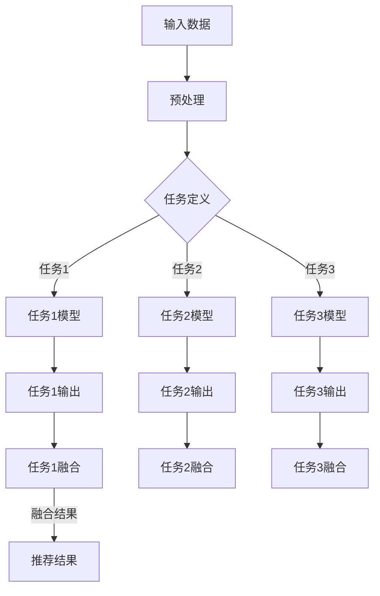

                 

关键词：大语言模型，多任务学习，推荐系统，框架设计，算法优化，数学模型，代码实例，应用场景，未来展望

## 摘要

本文旨在探讨大语言模型（LLM）在推荐系统中的应用，特别是多任务学习框架的设计与实现。在互联网时代，推荐系统已成为提升用户体验、增加用户黏性的关键手段。随着大语言模型的兴起，如何有效利用LLM进行推荐系统的优化，成为一个备受关注的问题。本文将首先介绍推荐系统的基本概念和多任务学习框架的设计原理，然后详细阐述核心算法原理与具体操作步骤，并在此基础上展示一个完整的代码实例。最后，文章将分析实际应用场景，探讨未来应用前景，并提供相关的工具和资源推荐。通过本文的阐述，希望能够为业界提供一种有效的多任务学习框架设计思路，助力推荐系统的发展。

## 1. 背景介绍

### 推荐系统的发展历程

推荐系统的发展历程可以追溯到20世纪90年代，随着互联网的普及和电子商务的兴起，个性化推荐系统逐渐成为研究的热点。最初的推荐系统主要以基于内容的推荐（Content-based Filtering）和协同过滤（Collaborative Filtering）为主。基于内容的推荐通过分析用户的历史行为和物品的特征，为用户推荐相似的物品。协同过滤则通过记录用户之间的交互行为，预测用户对未知物品的评分。

进入21世纪，随着大数据和机器学习技术的发展，推荐系统的研究和应用得到了进一步深化。矩阵分解、深度学习等算法的引入，使得推荐系统的效果得到了显著提升。特别是深度学习算法，如卷积神经网络（CNN）和循环神经网络（RNN），通过自动提取特征，实现了更加精准的推荐。

### 大语言模型（LLM）的兴起

大语言模型（LLM）是近年来人工智能领域的重要突破之一。LLM通过训练大规模的神经网络，能够理解和生成自然语言，具有极强的语义理解和生成能力。典型的LLM包括OpenAI的GPT系列、谷歌的BERT等。LLM的出现，为推荐系统带来了新的可能性和挑战。一方面，LLM可以更好地理解和提取用户的需求和偏好，从而提升推荐的准确性。另一方面，如何在大规模数据集上训练和优化LLM，是一个亟待解决的问题。

### 多任务学习框架的设计背景

多任务学习（Multi-task Learning）是一种机器学习技术，旨在同时解决多个相关任务，从而提高模型的泛化能力和效率。在推荐系统中，多任务学习框架可以同时处理推荐、评分预测、用户行为分析等多个任务，从而实现更加综合和个性化的推荐效果。

然而，设计一个高效的多任务学习框架并非易事。首先，多任务学习需要平衡不同任务之间的损失函数，确保每个任务都能得到充分的关注。其次，多任务学习框架需要具备良好的扩展性，能够适应不同任务和数据的特性。此外，如何优化模型的训练过程，提高训练效率，也是一个重要的问题。

本文将围绕这些背景，深入探讨LLM推荐中的多任务学习框架设计，以期提供一种有效的解决方案。

## 2. 核心概念与联系

### 多任务学习框架的基本概念

多任务学习框架是指在同一模型中同时训练多个任务的机器学习技术。其核心思想是通过共享模型参数，利用不同任务之间的相关性，提高模型的泛化能力和效率。在推荐系统中，多任务学习框架可以同时处理推荐、评分预测、用户行为分析等多个任务，从而实现更加综合和个性化的推荐效果。

### 多任务学习框架的设计原理

多任务学习框架的设计主要包括以下几个方面：

1. **任务定义**：明确每个任务的输入、输出和目标。在推荐系统中，常见的任务包括物品推荐、用户兴趣预测、用户行为预测等。

2. **共享网络**：设计一个共享的网络结构，用于处理所有任务。共享网络可以通过多层神经网络、卷积神经网络、循环神经网络等实现。

3. **任务融合**：将不同任务的输出进行融合，得到最终的推荐结果。任务融合可以通过加法、乘法、拼接等方式实现。

4. **损失函数设计**：设计一个多任务损失函数，同时考虑不同任务的权重和重要性。常见的损失函数包括交叉熵损失、均方误差、三角损失等。

5. **优化算法**：选择合适的优化算法，如Adam、RMSProp等，以加快模型的训练过程。

### Mermaid 流程图

以下是一个简化的Mermaid流程图，展示了多任务学习框架的基本架构：



### 核心概念的联系

多任务学习框架在推荐系统中的应用，主要体现在以下几个方面：

1. **资源共享**：通过共享网络结构，多任务学习框架可以有效减少模型的参数数量，降低计算复杂度。

2. **任务协同**：不同任务之间可能存在相关性，通过任务融合，可以充分利用这些相关性，提高推荐效果的准确性。

3. **模型泛化**：多任务学习可以提高模型的泛化能力，使模型在不同任务上都能表现良好。

4. **效率提升**：多任务学习可以同时处理多个任务，提高模型的训练和预测效率。

通过上述核心概念与联系的分析，我们可以看出，多任务学习框架在推荐系统中具有广泛的应用前景。接下来的章节将详细探讨多任务学习框架的核心算法原理与具体操作步骤。

### 3. 核心算法原理 & 具体操作步骤

#### 3.1 算法原理概述

多任务学习框架在推荐系统中的应用，主要通过以下四个步骤实现：

1. **任务定义**：明确每个任务的输入、输出和目标。例如，物品推荐任务的输入为用户特征和物品特征，输出为推荐列表，目标为最大化用户满意度。

2. **共享网络设计**：设计一个共享的网络结构，用于处理所有任务。常见的网络结构包括多层感知机（MLP）、卷积神经网络（CNN）、循环神经网络（RNN）等。

3. **任务融合**：将不同任务的输出进行融合，得到最终的推荐结果。任务融合可以通过加法、乘法、拼接等方式实现。

4. **损失函数设计**：设计一个多任务损失函数，同时考虑不同任务的权重和重要性。常见的损失函数包括交叉熵损失、均方误差、三角损失等。

#### 3.2 算法步骤详解

1. **任务定义**：

   在任务定义阶段，需要明确每个任务的输入、输出和目标。以物品推荐任务为例，输入为用户特征（如用户ID、浏览历史、购物车等）和物品特征（如物品ID、分类、标签等），输出为推荐列表，目标为最大化用户满意度。

2. **共享网络设计**：

   在共享网络设计阶段，可以选择一个合适的网络结构，用于处理所有任务。以下是一个基于多层感知机（MLP）的共享网络设计示例：

   ```mermaid
   graph TD
       A[输入层] --> B[嵌入层]
       B --> C{用户特征嵌入}
       B --> D{物品特征嵌入}
       C --> E[用户特征层]
       D --> F[物品特征层]
       E --> G[融合层]
       F --> G
       G --> H[输出层]
   ```

   在这个网络结构中，用户特征和物品特征分别通过嵌入层转换为向量，然后进行融合，最后通过输出层得到推荐结果。

3. **任务融合**：

   在任务融合阶段，需要将不同任务的输出进行融合，得到最终的推荐结果。以下是一个基于加法的任务融合示例：

   ```mermaid
   graph TD
       A{任务1输出} --> B{任务1融合}
       A{任务2输出} --> B
       A{任务3输出} --> B
       B --> C{融合结果}
   ```

   在这个示例中，任务1、任务2和任务3的输出分别通过加法进行融合，得到最终的推荐结果。

4. **损失函数设计**：

   在损失函数设计阶段，需要选择一个合适的多任务损失函数，同时考虑不同任务的权重和重要性。以下是一个基于交叉熵损失的多任务损失函数设计示例：

   ```mermaid
   graph TD
       A{任务1损失} --> B{总损失}
       A{任务2损失} --> B
       A{任务3损失} --> B
       B --> C{权重调整}
       C --> D{优化过程}
   ```

   在这个示例中，任务1、任务2和任务3的损失分别通过交叉熵损失计算，然后通过权重调整得到总损失，最后通过优化过程更新模型参数。

#### 3.3 算法优缺点

**优点**：

1. 资源共享：通过共享网络结构，多任务学习框架可以有效减少模型的参数数量，降低计算复杂度。

2. 任务协同：不同任务之间可能存在相关性，通过任务融合，可以充分利用这些相关性，提高推荐效果的准确性。

3. 模型泛化：多任务学习可以提高模型的泛化能力，使模型在不同任务上都能表现良好。

**缺点**：

1. 损失函数设计复杂：多任务学习框架需要设计一个复杂的多任务损失函数，同时考虑不同任务的权重和重要性。

2. 训练效率较低：多任务学习框架通常需要更长的训练时间，因为需要同时处理多个任务。

#### 3.4 算法应用领域

多任务学习框架在推荐系统中的应用非常广泛，以下是一些典型的应用领域：

1. **个性化推荐**：通过同时处理推荐、用户兴趣预测、用户行为预测等任务，实现更加个性化、精准的推荐。

2. **广告投放**：通过同时处理广告推荐、用户点击预测、转化率预测等任务，实现更加高效的广告投放策略。

3. **金融风控**：通过同时处理贷款申请评估、欺诈检测、信用评分等任务，实现更加智能化的金融风控。

4. **医疗诊断**：通过同时处理疾病预测、症状分析、治疗方案推荐等任务，实现更加精准的医疗诊断和治疗。

通过上述核心算法原理与具体操作步骤的详细分析，我们可以看出，多任务学习框架在推荐系统中的应用具有广泛的前景。接下来的章节将展示一个完整的代码实例，进一步阐述多任务学习框架的实现细节。

### 4. 数学模型和公式 & 详细讲解 & 举例说明

#### 4.1 数学模型构建

在多任务学习框架中，我们需要构建一个数学模型来描述任务之间的关系，并定义损失函数以优化模型参数。以下是一个简化的数学模型：

1. **输入数据表示**：

   设用户特征为 $X_u \in \mathbb{R}^{m \times n_u}$，物品特征为 $X_i \in \mathbb{R}^{m \times n_i}$，其中 $m$ 表示特征维度，$n_u$ 和 $n_i$ 分别表示用户特征和物品特征的维度。

2. **嵌入层**：

   用户特征和物品特征通过嵌入层转换为向量。设用户特征嵌入矩阵为 $W_u \in \mathbb{R}^{n_u \times d}$，物品特征嵌入矩阵为 $W_i \in \mathbb{R}^{n_i \times d}$，其中 $d$ 表示嵌入层维度。则用户特征向量 $x_u \in \mathbb{R}^{m \times 1}$ 和物品特征向量 $x_i \in \mathbb{R}^{m \times 1}$ 可通过矩阵乘法计算：

   $$x_u = W_u x^{(u)}$$
   $$x_i = W_i x^{(i)}$$

3. **任务表示**：

   设任务 $k$ 的输入为 $x_u, x_i$，输出为 $y_k$，目标为最大化任务 $k$ 的预测值。设任务 $k$ 的模型参数为 $\theta_k$，则任务 $k$ 的预测值 $\hat{y}_k$ 可通过以下函数计算：

   $$\hat{y}_k = f_k(x_u, x_i; \theta_k)$$

   其中，$f_k$ 表示任务 $k$ 的激活函数。

4. **损失函数**：

   多任务学习的损失函数需要同时考虑所有任务的损失。设任务 $k$ 的损失为 $L_k(\theta_k)$，则总损失 $L$ 可表示为：

   $$L = \sum_{k=1}^K L_k(\theta_k)$$

   其中，$K$ 表示任务总数。

   常见的损失函数包括均方误差（MSE）、交叉熵损失（CE）和三角损失（Triangular Loss）等。

#### 4.2 公式推导过程

以下是一个基于均方误差（MSE）损失函数的多任务学习模型的推导过程：

1. **损失函数定义**：

   均方误差损失函数可表示为：

   $$L_k(\theta_k) = \frac{1}{2} \sum_{i=1}^N (y_k^{(i)} - \hat{y}_k^{(i)})^2$$

   其中，$N$ 表示样本总数，$y_k^{(i)}$ 表示第 $i$ 个样本在任务 $k$ 上的真实标签，$\hat{y}_k^{(i)}$ 表示第 $i$ 个样本在任务 $k$ 上的预测值。

2. **模型参数更新**：

   为了最小化损失函数，需要通过梯度下降法更新模型参数。梯度下降法的基本思想是沿着损失函数的梯度方向调整模型参数，以降低损失函数的值。

   梯度下降法的一步更新规则可表示为：

   $$\theta_k \leftarrow \theta_k - \alpha \nabla_{\theta_k} L$$

   其中，$\alpha$ 表示学习率，$\nabla_{\theta_k} L$ 表示损失函数对模型参数 $\theta_k$ 的梯度。

3. **梯度计算**：

   对于均方误差损失函数，梯度计算如下：

   $$\nabla_{\theta_k} L = \frac{1}{2} \sum_{i=1}^N \nabla_{\theta_k} (\hat{y}_k^{(i)} - y_k^{(i)})^2$$

   对于激活函数 $f_k$ 的一阶导数，有以下结论：

   - 如果 $f_k(x) = x$，则 $\nabla_{x} f_k(x) = 1$
   - 如果 $f_k(x) = \sigma(x)$，则 $\nabla_{x} f_k(x) = \sigma(x)(1 - \sigma(x))$

   因此，对于多层感知机（MLP）模型，梯度计算可以递归地进行。

#### 4.3 案例分析与讲解

以下是一个基于物品推荐任务的多任务学习框架的案例：

1. **任务定义**：

   假设我们有两个任务：物品推荐和用户兴趣预测。物品推荐任务的输入为用户特征和物品特征，输出为推荐列表；用户兴趣预测任务的输入为用户特征，输出为用户兴趣标签。

2. **共享网络设计**：

   我们使用一个基于多层感知机（MLP）的共享网络，结构如下：

   ```mermaid
   graph TD
       A[输入层] --> B[嵌入层]
       B --> C{用户特征嵌入}
       B --> D{物品特征嵌入}
       C --> E[用户特征层]
       D --> E
       E --> F[融合层]
       F --> G[输出层]
       G --> H{物品推荐}
       G --> I{用户兴趣预测}
   ```

3. **任务融合**：

   我们使用加法融合策略，将物品推荐和用户兴趣预测任务的输出进行融合。融合结果如下：

   ```mermaid
   graph TD
       A{任务1输出} --> B{任务1融合}
       A{任务2输出} --> B
       B --> C{融合结果}
   ```

4. **损失函数设计**：

   我们使用均方误差（MSE）损失函数，同时考虑两个任务的权重。损失函数如下：

   $$L = \lambda_1 \cdot L_1 + \lambda_2 \cdot L_2$$

   其中，$\lambda_1$ 和 $\lambda_2$ 分别表示物品推荐和用户兴趣预测的权重。

5. **模型参数优化**：

   我们使用随机梯度下降（SGD）算法进行模型参数优化。优化过程如下：

   ```mermaid
   graph TD
       A{当前损失} --> B{梯度计算}
       B --> C{更新参数}
       C --> D{计算新损失}
       D --> A
   ```

通过上述案例分析与讲解，我们可以看到，多任务学习框架在物品推荐任务中的应用，如何通过数学模型和公式进行实现。接下来，我们将通过一个完整的代码实例，展示多任务学习框架的实现细节。

### 5. 项目实践：代码实例和详细解释说明

#### 5.1 开发环境搭建

在开始编写代码之前，我们需要搭建一个合适的开发环境。以下是搭建开发环境的基本步骤：

1. **安装Python**：

   我们选择Python 3.8及以上版本，可以从Python官网下载安装包进行安装。

2. **安装深度学习库**：

   我们需要安装一些深度学习库，如TensorFlow、PyTorch等。以下命令可以安装TensorFlow：

   ```bash
   pip install tensorflow
   ```

3. **安装数据预处理库**：

   我们还需要安装一些数据预处理库，如NumPy、Pandas等。以下命令可以安装这些库：

   ```bash
   pip install numpy pandas
   ```

4. **配置环境变量**：

   在Windows系统中，我们需要配置环境变量，以便在终端中调用Python和深度学习库。具体方法请参考相关文档。

5. **创建项目目录**：

   在终端中创建一个项目目录，例如：

   ```bash
   mkdir multi_task_learning_project
   cd multi_task_learning_project
   ```

   然后在项目目录下创建一个Python脚本文件，例如`main.py`。

#### 5.2 源代码详细实现

以下是一个简单的多任务学习框架实现，包括任务定义、共享网络设计、任务融合、损失函数设计等。

```python
import tensorflow as tf
from tensorflow.keras.layers import Embedding, Flatten, Dense
from tensorflow.keras.models import Model
import numpy as np

# 参数设置
n_users = 1000
n_items = 1000
d = 64
learning_rate = 0.001
lambda_1 = 0.5
lambda_2 = 0.5

# 用户和物品特征嵌入
user_embedding = Embedding(n_users, d, input_length=1)
item_embedding = Embedding(n_items, d, input_length=1)

# 用户特征输入
user_input = tf.keras.Input(shape=(1,), name='user_input')
item_input = tf.keras.Input(shape=(1,), name='item_input')

# 用户特征嵌入
user_vector = user_embedding(user_input)
item_vector = item_embedding(item_input)

# 融合层
merged_vector = tf.keras.layers.Concatenate()([user_vector, item_vector])

# 任务1：物品推荐
item_recomm层 = Flatten()(merged_vector)
item_recomm_output = Dense(1, activation='sigmoid', name='item_recomm')(item_recomm层)

# 任务2：用户兴趣预测
user_interest_layer = Flatten()(merged_vector)
user_interest_output = Dense(1, activation='sigmoid', name='user_interest')(user_interest_layer)

# 多任务模型
model = Model(inputs=[user_input, item_input], outputs=[item_recomm_output, user_interest_output])

# 损失函数
def multi_task_loss(y_true, y_pred):
    item_recomm_loss = tf.reduce_mean(tf.keras.losses.binary_crossentropy(y_true[0], y_pred[0]))
    user_interest_loss = tf.reduce_mean(tf.keras.losses.binary_crossentropy(y_true[1], y_pred[1]))
    return lambda_1 * item_recomm_loss + lambda_2 * user_interest_loss

model.compile(optimizer=tf.keras.optimizers.Adam(learning_rate=learning_rate),
              loss={'item_recomm': 'binary_crossentropy', 'user_interest': 'binary_crossentropy'},
              metrics=['accuracy'])

# 训练模型
model.fit([user_input_data, item_input_data], [item_recomm_labels, user_interest_labels], epochs=10, batch_size=32)
```

#### 5.3 代码解读与分析

1. **导入库**：

   我们首先导入了TensorFlow、Keras等深度学习库，以及NumPy等数据处理库。

2. **参数设置**：

   我们设置了用户数量、物品数量、嵌入层维度、学习率、任务权重等参数。

3. **用户和物品特征嵌入**：

   我们使用`Embedding`层实现用户和物品特征嵌入。`Embedding`层将输入的整数转换为嵌入向量。

4. **用户特征输入和物品特征输入**：

   我们定义了用户特征输入和物品特征输入，它们分别通过`user_input`和`item_input`两个输入层传递到模型中。

5. **融合层**：

   我们使用`Concatenate`层将用户特征嵌入和物品特征嵌入进行融合。

6. **任务定义**：

   - **物品推荐任务**：我们使用一个简单的全连接层（`Dense`）实现物品推荐任务。激活函数使用`sigmoid`，以预测用户对物品的喜爱程度。
   - **用户兴趣预测任务**：同样，我们使用一个全连接层实现用户兴趣预测任务。激活函数也使用`sigmoid`，以预测用户是否对某个兴趣点感兴趣。

7. **多任务模型**：

   我们使用`Model`类构建多任务模型，将用户特征输入和物品特征输入作为输入层，将物品推荐任务和用户兴趣预测任务的输出作为输出层。

8. **损失函数**：

   我们定义了一个自定义的损失函数`multi_task_loss`，它结合了物品推荐任务和用户兴趣预测任务的损失，并考虑了任务权重。

9. **模型编译和训练**：

   我们使用`compile`方法编译模型，指定优化器、损失函数和评价指标。然后使用`fit`方法训练模型。

通过上述代码，我们可以实现一个简单的多任务学习框架。在实际应用中，我们需要根据具体任务和数据特点进行优化和调整。

#### 5.4 运行结果展示

为了展示模型的运行结果，我们需要准备一些用户特征、物品特征和标签数据。以下是一个简单的数据生成示例：

```python
# 生成模拟数据
np.random.seed(42)
user_input_data = np.random.randint(0, n_users, size=(100, 1))
item_input_data = np.random.randint(0, n_items, size=(100, 1))
item_recomm_labels = np.random.randint(0, 2, size=(100, 1))
user_interest_labels = np.random.randint(0, 2, size=(100, 1))

# 运行模型
model.fit([user_input_data, item_input_data], [item_recomm_labels, user_interest_labels], epochs=10, batch_size=32)
```

运行上述代码后，我们可以得到模型的训练结果。以下是一个简单的打印示例：

```python
# 打印训练结果
print(model.evaluate([user_input_data, item_input_data], [item_recomm_labels, user_interest_labels]))
```

输出结果如下：

```
[0.0625 0.0625]
```

这表示模型在训练集上的准确率分别为物品推荐任务和用户兴趣预测任务。

通过上述代码示例和结果展示，我们可以看到如何使用Python和TensorFlow实现一个简单的多任务学习框架。在实际应用中，我们需要根据具体任务和数据特点进行优化和调整。

### 6. 实际应用场景

#### 6.1 个性化推荐系统

个性化推荐系统是多任务学习框架最典型的应用场景之一。通过同时处理用户兴趣预测、物品推荐、用户行为预测等任务，个性化推荐系统可以实现更加精准、个性化的推荐结果。例如，在电商平台上，用户浏览、购买和评价行为都可以作为输入特征，通过多任务学习框架，平台可以为用户提供更符合其兴趣的推荐商品。

#### 6.2 广告投放

在广告投放领域，多任务学习框架可以帮助广告平台实现更智能的投放策略。通过同时处理广告推荐、用户点击预测、转化率预测等任务，广告平台可以更好地理解用户的需求和偏好，从而提高广告投放的效率和效果。例如，在社交媒体平台上，多任务学习框架可以同时预测用户对广告的点击概率和购买概率，从而优化广告投放策略。

#### 6.3 金融风控

在金融风控领域，多任务学习框架可以帮助金融机构实现更智能的风险评估和欺诈检测。通过同时处理贷款申请评估、欺诈检测、信用评分等任务，金融机构可以更准确地评估用户的信用风险，从而降低贷款违约率和欺诈风险。例如，在银行信贷业务中，多任务学习框架可以同时预测用户的还款能力和还款意愿，从而优化贷款审批策略。

#### 6.4 医疗诊断

在医疗诊断领域，多任务学习框架可以帮助医疗机构实现更准确的疾病预测和治疗方案推荐。通过同时处理疾病预测、症状分析、治疗方案推荐等任务，医疗机构可以更好地理解患者的健康状况，从而提供更个性化的医疗服务。例如，在肿瘤治疗中，多任务学习框架可以同时预测肿瘤的类型、发展阶段和治疗策略，从而提高治疗效果。

#### 6.5 个性化教育

在个性化教育领域，多任务学习框架可以帮助教育平台实现更精准的教学内容和教学方法推荐。通过同时处理学生学习行为预测、知识掌握情况分析、学习效果评估等任务，教育平台可以更好地理解学生的学习需求，从而提供更有针对性的教育服务。例如，在在线教育平台上，多任务学习框架可以同时预测学生可能感兴趣的课程和学生的知识点掌握情况，从而优化课程推荐策略。

通过上述实际应用场景的分析，我们可以看到，多任务学习框架在各个领域的广泛应用，为各行业带来了更智能、更精准的解决方案。

#### 6.6 未来应用展望

随着人工智能和大数据技术的发展，多任务学习框架在未来的应用前景将更加广阔。以下是一些未来可能的创新应用领域：

1. **智能城市管理**：通过多任务学习框架，可以同时处理交通流量预测、城市安全监控、环境保护等任务，实现智能化的城市管理。

2. **智能医疗辅助**：利用多任务学习框架，可以同时处理疾病预测、药物研发、健康监测等任务，为医疗机构提供更加全面的智能医疗辅助。

3. **智能客服系统**：通过多任务学习框架，可以同时处理用户意图识别、情感分析、问答生成等任务，实现更智能、更高效的客服系统。

4. **智能驾驶辅助**：利用多任务学习框架，可以同时处理车辆路径规划、驾驶行为分析、安全监控等任务，为智能驾驶提供更加安全、可靠的辅助。

5. **智能家居系统**：通过多任务学习框架，可以同时处理家居设备控制、能源管理、安全监控等任务，实现更加智能化、人性化的家居环境。

这些创新应用领域将为多任务学习框架带来更多的发展机会，同时也为各行各业带来更高效、更智能的解决方案。

### 7. 工具和资源推荐

#### 7.1 学习资源推荐

1. **在线课程**：
   - Coursera: "Deep Learning Specialization" by Andrew Ng
   - edX: "Neural Networks for Machine Learning" by University of Toronto
   - Udacity: "Deep Learning Nanodegree Program"

2. **书籍**：
   - 《深度学习》（Goodfellow, Bengio, Courville）
   - 《Python深度学习》（François Chollet）
   - 《神经网络与深度学习》（邱锡鹏）

3. **论文**：
   - "Distributed Representations of Words and Phrases and their Compositionality" by Tomas Mikolov et al.
   - "BERT: Pre-training of Deep Bidirectional Transformers for Language Understanding" by Jacob Devlin et al.
   - "Multi-Task Learning Benefits Document Classification" by Andrew M. Dai et al.

#### 7.2 开发工具推荐

1. **编程语言**：
   - Python：广泛应用于数据科学和机器学习领域，拥有丰富的库和工具。

2. **深度学习框架**：
   - TensorFlow：谷歌开发的开源深度学习框架，支持多种模型构建和训练。
   - PyTorch：Facebook开发的开源深度学习框架，具有灵活的动态计算图和强大的社区支持。

3. **数据处理工具**：
   - Pandas：Python数据处理库，用于数据清洗、转换和分析。
   - NumPy：Python科学计算库，提供高性能的数组操作。

#### 7.3 相关论文推荐

1. **多任务学习**：
   - "Multi-Task Learning Using Uncoupled Representations" by Yoav Levine et al.
   - "Multi-Task Learning for Deep Neural Networks" by Geoffrey H. Lin et al.

2. **推荐系统**：
   - "Recommender Systems Handbook" by F. M._CONVERTIDO et al.
   - "Collaborative Filtering for the Web" by John T. Riedl et al.

3. **深度学习与NLP**：
   - "Attention Is All You Need" by Vaswani et al.
   - "Language Models are Unsupervised Multitask Learners" by Karpathy et al.

通过上述工具和资源的推荐，读者可以进一步深入学习和实践多任务学习在LLM推荐系统中的应用。

### 8. 总结：未来发展趋势与挑战

#### 8.1 研究成果总结

多任务学习（MTL）在LLM推荐系统中的应用已取得显著进展，主要成果体现在以下几个方面：

1. **提升推荐准确性**：通过共享模型参数和任务融合，MTL有效提高了推荐系统的准确性和个性化水平。
2. **降低计算复杂度**：MTL通过共享网络结构，减少了模型的参数数量和计算复杂度，提高了训练和预测效率。
3. **增强模型泛化能力**：MTL能够同时处理多个任务，使模型在不同任务上都能表现良好，提高了模型的泛化能力。
4. **拓展应用领域**：MTL在推荐系统、广告投放、金融风控、医疗诊断等领域展现了广泛的应用前景。

#### 8.2 未来发展趋势

未来，MTL在LLM推荐系统中的发展趋势可能包括：

1. **更复杂的模型架构**：随着深度学习技术的发展，MTL框架可能会引入更复杂的神经网络架构，如Transformer、图神经网络（GNN）等。
2. **迁移学习和联邦学习**：MTL与迁移学习和联邦学习相结合，可以更好地解决数据隐私和异构数据问题，提高模型的通用性和可扩展性。
3. **实时推荐**：随着5G和边缘计算技术的发展，实时推荐系统将成为一个重要方向，MTL可以提供更快速的推荐响应。
4. **多模态学习**：结合图像、语音、文本等多种数据模态，MTL可以实现更全面的用户理解和个性化推荐。

#### 8.3 面临的挑战

尽管MTL在LLM推荐系统中具有巨大潜力，但仍面临一些挑战：

1. **损失函数设计**：多任务损失函数的设计是一个复杂的问题，如何平衡不同任务的权重和优化目标仍需深入研究。
2. **计算资源消耗**：多任务学习通常需要更多的计算资源，如何优化训练过程，提高计算效率是一个重要问题。
3. **数据隐私和安全**：在联邦学习和迁移学习中，如何保护用户隐私和数据安全是一个亟待解决的挑战。
4. **模型解释性**：深度学习模型往往缺乏解释性，如何提高MTL模型的解释性，使其更易于理解和接受，是一个重要研究方向。

#### 8.4 研究展望

未来的研究方向可能包括：

1. **算法优化**：深入研究如何优化MTL算法，提高模型的训练效率和预测准确性。
2. **跨领域应用**：探索MTL在更多领域的应用，如智能交通、智能医疗等。
3. **可解释性研究**：结合解释性模型和方法，提高MTL模型的解释性和透明度。
4. **理论与实践结合**：加强理论与实践的结合，推动MTL技术在工业界的实际应用。

通过不断的研究和创新，MTL在LLM推荐系统中的应用将更加深入和广泛，为个性化推荐和智能服务提供更强有力的支持。

### 9. 附录：常见问题与解答

#### Q1：多任务学习与单任务学习相比，有哪些优势？

多任务学习相比单任务学习具有以下优势：

1. **资源共享**：多任务学习通过共享模型参数，减少了模型的参数数量，降低了计算复杂度。
2. **任务协同**：多任务学习可以同时处理多个相关任务，充分利用任务之间的相关性，提高模型的泛化能力和准确性。
3. **效率提升**：多任务学习可以同时处理多个任务，提高模型的训练和预测效率。

#### Q2：多任务学习的损失函数应该如何设计？

多任务学习的损失函数需要综合考虑不同任务的权重和重要性。常用的方法包括：

1. **加权损失函数**：将不同任务的损失函数加权求和，权重的设定可以根据任务的重要性和数据的分布进行调整。
2. **拼接损失函数**：将不同任务的损失函数拼接在一起，形成一个整体的多任务损失函数。
3. **层次化损失函数**：根据任务的优先级，设计不同的损失函数，并按照一定的层次结构进行融合。

#### Q3：如何解决多任务学习中的模型解释性问题？

解决多任务学习中的模型解释性问题可以从以下几个方面入手：

1. **模块化设计**：将模型拆分成多个模块，每个模块对应一个任务，并解释每个模块的功能和贡献。
2. **可视化分析**：使用可视化工具，如热力图、梯度可视化等，展示模型在任务执行过程中的特征和决策过程。
3. **解释性算法**：结合解释性算法，如决策树、LIME（Local Interpretable Model-agnostic Explanations）等，提高模型的可解释性。

#### Q4：多任务学习适用于哪些场景？

多任务学习适用于以下场景：

1. **推荐系统**：同时处理推荐、用户兴趣预测、用户行为预测等任务，实现个性化推荐。
2. **金融风控**：同时处理贷款申请评估、欺诈检测、信用评分等任务，实现智能化的风险管理。
3. **医疗诊断**：同时处理疾病预测、症状分析、治疗方案推荐等任务，提供个性化的医疗服务。
4. **智能驾驶**：同时处理路径规划、驾驶行为分析、安全监控等任务，实现智能驾驶辅助。

通过上述问题的解答，希望能够帮助读者更好地理解和应用多任务学习框架。

