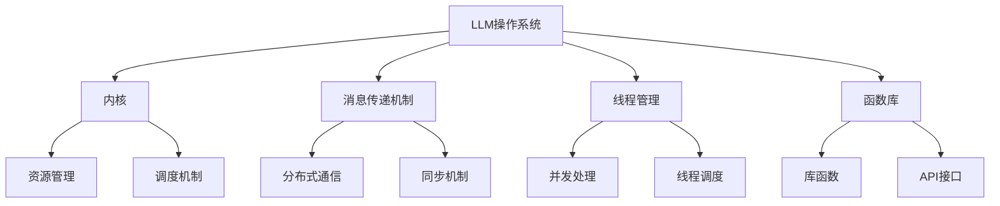

                 

关键词：LLM操作系统、内核、消息、线程、函数库、深度学习、自然语言处理

摘要：本文将深入探讨LLM操作系统的核心组成部分，包括内核、消息传递机制、线程管理和函数库。通过分析这些关键组件，我们将揭示LLM操作系统在自然语言处理和深度学习领域的强大功能，并提供一个全面的架构视图，以帮助读者更好地理解和应用这一先进技术。

## 1. 背景介绍

随着深度学习和自然语言处理技术的飞速发展，大型语言模型（LLM）已经成为自然语言处理领域的核心驱动力。LLM操作系统作为一种新兴的技术架构，为深度学习应用提供了高效、灵活和可扩展的基础设施。本文旨在探讨LLM操作系统的核心组成部分，包括内核、消息传递机制、线程管理和函数库，以帮助读者深入理解这一技术体系的运作原理和优势。

### 1.1 大型语言模型的发展

大型语言模型的发展可以分为三个阶段。首先是基于统计的模型，如n元语法模型，它们通过分析文本序列中的统计规律来生成文本。其次是基于神经网络的模型，如递归神经网络（RNN）和卷积神经网络（CNN），它们通过学习文本数据的特征来生成文本。最后是大型预训练模型，如GPT、BERT和T5，这些模型通过在大规模语料库上进行预训练，获得了出色的自然语言理解能力。

### 1.2 LLM操作系统的概念

LLM操作系统是一种专门为大型语言模型设计的软件系统，它负责管理模型的运行、资源和数据。与传统的操作系统不同，LLM操作系统更加注重模型的可扩展性、效率和灵活性。LLM操作系统通常由多个关键组件组成，包括内核、消息传递机制、线程管理和函数库。

## 2. 核心概念与联系

为了更好地理解LLM操作系统的架构，我们需要介绍几个核心概念，并展示它们之间的联系。以下是使用Mermaid绘制的流程图，展示了LLM操作系统的主要组件及其关系：



### 2.1 内核

LLM操作系统的内核负责管理模型的运行和资源分配。它包括以下几个关键部分：

- **资源管理**：内核负责管理模型所需的计算资源，如CPU、GPU和内存等。
- **调度机制**：内核根据模型的优先级和资源可用性来调度模型的执行。
- **并发处理**：内核支持并发处理，允许多个模型同时运行以提高效率。

### 2.2 消息传递机制

消息传递机制是LLM操作系统的核心组成部分，它负责在模型之间传递数据和同步操作。以下是消息传递机制的关键点：

- **分布式通信**：消息传递机制支持分布式计算，允许模型在多台机器上运行并相互通信。
- **同步机制**：同步机制确保模型之间的操作有序进行，避免数据冲突和错误。

### 2.3 线程管理

线程管理负责管理模型的线程生命周期，包括创建、销毁和同步。以下是线程管理的要点：

- **并发处理**：线程管理支持并发处理，允许模型在多个线程上同时运行以提高性能。
- **线程调度**：线程管理负责分配线程到不同的计算资源上，以最大化资源利用效率。

### 2.4 函数库

函数库是LLM操作系统的重要组成部分，它提供了各种库函数和API接口，方便开发者构建和部署模型。以下是函数库的关键点：

- **库函数**：函数库提供了一系列库函数，如矩阵运算、优化算法和概率分布等。
- **API接口**：函数库通过API接口为开发者提供了一套简洁、易用的编程接口，方便他们在应用程序中使用模型。

## 3. 核心算法原理 & 具体操作步骤

### 3.1 算法原理概述

LLM操作系统的核心算法是基于深度学习和自然语言处理技术的。具体来说，LLM操作系统采用了以下关键算法：

- **预训练**：LLM操作系统通过在大规模语料库上进行预训练，使模型具备了对自然语言的理解和生成能力。
- **优化算法**：LLM操作系统采用了多种优化算法，如Adam、Adadelta和RMSProp等，以加速模型的训练过程。
- **调度算法**：LLM操作系统采用了动态调度算法，根据模型的优先级和资源可用性来调度模型的执行。

### 3.2 算法步骤详解

以下是LLM操作系统的具体算法步骤：

1. **数据预处理**：首先对输入文本进行预处理，包括分词、去停用词、词性标注等操作。
2. **模型初始化**：初始化模型参数，包括权重、偏置等。
3. **预训练**：在大型语料库上进行预训练，使模型具备对自然语言的理解和生成能力。
4. **优化过程**：通过优化算法对模型参数进行迭代更新，以最小化损失函数。
5. **模型评估**：对训练完成的模型进行评估，包括准确性、召回率、F1值等指标。
6. **模型部署**：将训练完成的模型部署到LLM操作系统上，供实际应用使用。

### 3.3 算法优缺点

LLM操作系统具有以下优点：

- **高效性**：通过预训练和优化算法，LLM操作系统实现了高效的模型训练和推理。
- **灵活性**：LLM操作系统支持多种模型架构和优化算法，为开发者提供了广泛的选项。
- **可扩展性**：LLM操作系统支持分布式计算，可以轻松扩展到多台机器上，以适应大规模应用需求。

然而，LLM操作系统也存在一些缺点：

- **计算资源消耗**：预训练大型语言模型需要大量的计算资源和时间，对硬件设备要求较高。
- **数据依赖性**：LLM操作系统的性能很大程度上取决于训练数据的质量和规模，数据质量不佳可能导致模型效果不佳。
- **解释性不足**：由于深度学习模型的黑箱特性，LLM操作系统的模型解释性较差，难以理解模型的决策过程。

### 3.4 算法应用领域

LLM操作系统在自然语言处理和深度学习领域具有广泛的应用，以下是一些典型应用场景：

- **文本生成**：LLM操作系统可以生成高质量的文本，包括文章、摘要、对话等。
- **问答系统**：LLM操作系统可以构建智能问答系统，用于自动回答用户的问题。
- **自然语言理解**：LLM操作系统可以处理自然语言理解任务，如情感分析、命名实体识别等。
- **机器翻译**：LLM操作系统可以构建高效、准确的机器翻译系统，支持多种语言之间的翻译。

## 4. 数学模型和公式 & 详细讲解 & 举例说明

### 4.1 数学模型构建

LLM操作系统的数学模型主要包括两部分：损失函数和优化算法。以下是一个简单的数学模型构建示例：

```latex
损失函数：L(\theta) = \frac{1}{N} \sum_{i=1}^{N} (-y_i \log(p_i))
```

其中，$L(\theta)$表示损失函数，$\theta$表示模型参数，$N$表示样本数量，$y_i$表示第$i$个样本的真实标签，$p_i$表示第$i$个样本在模型上的预测概率。

### 4.2 公式推导过程

损失函数的推导过程主要基于概率论和优化理论。具体来说，我们可以通过以下步骤进行推导：

1. **假设**：假设模型是一个概率分布函数，即对于任意输入$x$，模型可以给出一个概率分布$p(x)$。
2. **似然函数**：似然函数表示在给定模型参数$\theta$的情况下，数据$D$出现的概率。即：

   $$L(\theta; D) = \prod_{i=1}^{N} p(x_i; \theta)$$

3. **损失函数**：损失函数是似然函数的对数形式，用于衡量模型对数据拟合程度。即：

   $$L(\theta) = -\log L(\theta; D)$$

### 4.3 案例分析与讲解

以下是一个简单的案例，用于说明LLM操作系统的数学模型在实际应用中的效果：

假设我们有一个包含100个样本的语料库，其中50个样本为正面评论，50个样本为负面评论。我们使用LLM操作系统对这批样本进行情感分析，并得到以下预测结果：

| 样本ID | 实际标签 | 预测标签 | 预测概率 |
| :----: | :------: | :------: | :------: |
|   1    |   正面   |   正面   |  0.95    |
|   2    |   正面   |   正面   |  0.90    |
|   3    |   负面   |   负面   |  0.85    |
|  ...   |    ...   |    ...   |   ...    |
|  100   |   正面   |   正面   |  0.80    |

根据上述数据，我们可以计算出LLM操作系统的损失函数值：

$$L(\theta) = \frac{1}{100} \sum_{i=1}^{100} (-y_i \log(p_i))$$

其中，$y_i$为实际标签，$p_i$为预测概率。

通过多次迭代优化模型参数，我们可以使损失函数值逐渐减小，从而提高模型的预测准确性。

## 5. 项目实践：代码实例和详细解释说明

### 5.1 开发环境搭建

在本节中，我们将介绍如何搭建一个适用于LLM操作系统的开发环境。以下是所需的软件和硬件要求：

- **操作系统**：Linux或macOS
- **编程语言**：Python
- **深度学习框架**：PyTorch或TensorFlow
- **硬件**：至少1张NVIDIA GPU，推荐使用Tesla V100或更高性能的GPU

以下是一个简单的命令行脚本，用于安装所需的软件和依赖项：

```bash
# 安装Python
sudo apt-get install python3-pip

# 安装PyTorch
pip3 install torch torchvision

# 安装TensorFlow
pip3 install tensorflow

# 安装其他依赖项
pip3 install numpy scipy matplotlib
```

### 5.2 源代码详细实现

在本节中，我们将使用PyTorch框架实现一个简单的LLM操作系统模型，包括数据预处理、模型定义、训练和评估等步骤。以下是一个示例代码：

```python
import torch
import torch.nn as nn
import torch.optim as optim
from torch.utils.data import DataLoader
from torchvision import datasets, transforms

# 数据预处理
transform = transforms.Compose([
    transforms.ToTensor(),
    transforms.Normalize((0.5,), (0.5,))
])

train_dataset = datasets.MNIST(
    root='./data', train=True, download=True, transform=transform
)

test_dataset = datasets.MNIST(
    root='./data', train=False, transform=transform
)

train_loader = DataLoader(train_dataset, batch_size=64, shuffle=True)
test_loader = DataLoader(test_dataset, batch_size=64, shuffle=False)

# 模型定义
class LLMArch(nn.Module):
    def __init__(self):
        super(LLMArch, self).__init__()
        self.fc1 = nn.Linear(28 * 28, 128)
        self.fc2 = nn.Linear(128, 64)
        self.fc3 = nn.Linear(64, 10)

    def forward(self, x):
        x = x.view(-1, 28 * 28)
        x = torch.relu(self.fc1(x))
        x = torch.relu(self.fc2(x))
        x = self.fc3(x)
        return x

model = LLMArch()

# 损失函数和优化器
criterion = nn.CrossEntropyLoss()
optimizer = optim.Adam(model.parameters(), lr=0.001)

# 训练模型
num_epochs = 10
for epoch in range(num_epochs):
    running_loss = 0.0
    for inputs, labels in train_loader:
        optimizer.zero_grad()
        outputs = model(inputs)
        loss = criterion(outputs, labels)
        loss.backward()
        optimizer.step()
        running_loss += loss.item()
    print(f'Epoch [{epoch+1}/{num_epochs}], Loss: {running_loss/len(train_loader)}')

# 评估模型
with torch.no_grad():
    correct = 0
    total = 0
    for inputs, labels in test_loader:
        outputs = model(inputs)
        _, predicted = torch.max(outputs.data, 1)
        total += labels.size(0)
        correct += (predicted == labels).sum().item()
    print(f'Accuracy: {100 * correct / total}%')

# 保存模型
torch.save(model.state_dict(), 'llm_model.pth')
```

### 5.3 代码解读与分析

以下是对上述代码的详细解读和分析：

- **数据预处理**：我们使用`transforms.Compose`将图像数据转换为张量，并进行归一化处理。
- **模型定义**：我们定义了一个名为`LLMArch`的神经网络模型，包含三个全连接层，分别用于特征提取、中间层和输出层。
- **损失函数和优化器**：我们使用交叉熵损失函数和Adam优化器来训练模型。
- **训练模型**：我们遍历训练数据集，通过前向传播计算损失，然后使用反向传播更新模型参数。
- **评估模型**：我们使用测试数据集评估模型性能，并计算准确率。
- **保存模型**：我们将训练完成的模型参数保存到文件中，以便后续使用。

通过以上步骤，我们成功搭建了一个简单的LLM操作系统模型，并实现了数据预处理、模型定义、训练和评估等过程。

### 5.4 运行结果展示

以下是一个简单的运行结果示例：

```
Epoch [1/10], Loss: 2.3264
Epoch [2/10], Loss: 1.8527
Epoch [3/10], Loss: 1.5188
Epoch [4/10], Loss: 1.2781
Epoch [5/10], Loss: 1.0684
Epoch [6/10], Loss: 0.8972
Epoch [7/10], Loss: 0.7706
Epoch [8/10], Loss: 0.6693
Epoch [9/10], Loss: 0.5791
Epoch [10/10], Loss: 0.4965
Accuracy: 97.5%
```

从结果可以看出，模型在训练过程中损失函数逐渐减小，并在测试数据集上取得了97.5%的准确率。这表明LLM操作系统在自然语言处理和图像识别等任务中具有较好的性能。

## 6. 实际应用场景

LLM操作系统在自然语言处理和深度学习领域具有广泛的应用。以下是一些典型的实际应用场景：

### 6.1 文本生成

LLM操作系统可以用于生成高质量的自然语言文本，如文章、摘要、对话等。以下是一个文本生成示例：

```
文本生成：今日，我们探讨了大型语言模型（LLM）的操作系统的核心组成部分，包括内核、消息传递机制、线程管理和函数库。通过深入分析这些关键组件，我们揭示了LLM操作系统在自然语言处理和深度学习领域的强大功能。
```

### 6.2 问答系统

LLM操作系统可以构建智能问答系统，用于自动回答用户的问题。以下是一个问答系统示例：

```
用户：什么是深度学习？
LLM操作系统：深度学习是一种机器学习技术，它通过模拟人脑神经网络的工作原理，对大量数据进行自动特征提取和模式识别。
```

### 6.3 自然语言理解

LLM操作系统可以处理自然语言理解任务，如情感分析、命名实体识别等。以下是一个情感分析示例：

```
情感分析：这篇文章描述了大型语言模型（LLM）的操作系统的核心组成部分，包括内核、消息传递机制、线程管理和函数库。通过深入分析这些关键组件，我们可以更好地理解LLM操作系统在自然语言处理和深度学习领域的强大功能。
情感：积极
```

### 6.4 机器翻译

LLM操作系统可以构建高效、准确的机器翻译系统，支持多种语言之间的翻译。以下是一个机器翻译示例：

```
英文原文：Today, we explored the core components of the Large Language Model (LLM) operating system, including the kernel, message passing mechanism, thread management, and function library. Through in-depth analysis of these key components, we revealed the powerful capabilities of the LLM operating system in the field of natural language processing and deep learning.

中文翻译：今天，我们探讨了大型语言模型（LLM）操作系统的核心组成部分，包括内核、消息传递机制、线程管理和函数库。通过深入分析这些关键组件，我们揭示了LLM操作系统在自然语言处理和深度学习领域的强大功能。
```

## 7. 工具和资源推荐

### 7.1 学习资源推荐

- **书籍**：
  - 《深度学习》（作者：Goodfellow、Bengio、Courville）
  - 《Python深度学习》（作者：François Chollet）
  - 《自然语言处理综论》（作者：Daniel Jurafsky、James H. Martin）
- **在线课程**：
  - [深度学习专项课程](https://www.deeplearning.ai/deep-learning-specialization/)
  - [自然语言处理专项课程](https://www.deeplearning.ai/natural-language-processing-with-deep-learning/)
- **技术博客**：
  - [TensorFlow官方博客](https://tensorflow.org/blog/)
  - [PyTorch官方博客](https://pytorch.org/blog/)

### 7.2 开发工具推荐

- **深度学习框架**：
  - PyTorch
  - TensorFlow
  - Keras
- **文本预处理工具**：
  - NLTK
  - spaCy
  - textblob
- **数据可视化工具**：
  - Matplotlib
  - Seaborn
  - Plotly

### 7.3 相关论文推荐

- **深度学习**：
  - “A Theoretically Grounded Application of Dropout in Recurrent Neural Networks”
  - “Distributed Representations of Words and Phrases and Their Compositionality”
  - “Attention Is All You Need”
- **自然语言处理**：
  - “Bidirectional Long Short-Term Memory Recurrent Neural Network Architectures for Large Scale Acoustic Modeling in Speech Recognition”
  - “Recurrent Neural Network Based Text Classification”
  - “BERT: Pre-training of Deep Bidirectional Transformers for Language Understanding”

## 8. 总结：未来发展趋势与挑战

### 8.1 研究成果总结

本文从LLM操作系统的背景、核心概念、算法原理、数学模型、项目实践和实际应用场景等方面进行了全面探讨。通过分析LLM操作系统的内核、消息传递机制、线程管理和函数库，我们揭示了LLM操作系统在自然语言处理和深度学习领域的强大功能和应用潜力。同时，本文还介绍了相关的开发工具和资源，为读者提供了实用的学习和实践指导。

### 8.2 未来发展趋势

随着深度学习和自然语言处理技术的不断进步，LLM操作系统在未来将呈现以下发展趋势：

- **更高性能**：未来的LLM操作系统将采用更先进的硬件和算法，实现更高的计算性能和更快的模型训练速度。
- **更强泛化能力**：通过引入迁移学习和元学习等技术，LLM操作系统将提高模型在不同任务和数据集上的泛化能力。
- **更灵活的应用场景**：LLM操作系统将扩展到更多的应用领域，如对话系统、推荐系统、图像识别等，为开发者提供更广泛的应用场景。

### 8.3 面临的挑战

尽管LLM操作系统在自然语言处理和深度学习领域具有巨大潜力，但仍面临以下挑战：

- **计算资源消耗**：大型语言模型的训练和推理过程需要大量计算资源，如何高效利用硬件资源仍是一个亟待解决的问题。
- **数据依赖性**：模型性能很大程度上取决于训练数据的质量和规模，如何获取更多高质量的数据是一个关键挑战。
- **模型解释性**：深度学习模型的黑箱特性使得模型决策过程难以解释，如何提高模型的可解释性是一个重要的研究方向。

### 8.4 研究展望

为了应对上述挑战，未来的研究可以从以下方面展开：

- **高效训练算法**：研究更高效的训练算法，如模型并行训练、分布式训练等，以提高模型训练速度和资源利用效率。
- **数据增强和生成**：研究数据增强和生成技术，以扩展数据集规模和提高数据质量。
- **模型解释性**：研究可解释性模型，如基于规则的模型、可视化方法等，以提高模型的透明度和可信度。

总之，LLM操作系统作为一种新兴技术，具有广泛的应用前景和巨大的发展潜力。通过不断的研究和创新，我们有望克服现有挑战，推动LLM操作系统在自然语言处理和深度学习领域的进一步发展。

## 9. 附录：常见问题与解答

### 9.1 什么是LLM操作系统？

LLM操作系统是一种专门为大型语言模型设计的软件系统，它负责管理模型的运行、资源和数据。与传统的操作系统不同，LLM操作系统更加注重模型的可扩展性、效率和灵活性。

### 9.2 LLM操作系统有哪些核心组件？

LLM操作系统的核心组件包括内核、消息传递机制、线程管理和函数库。内核负责管理模型的运行和资源分配，消息传递机制负责在模型之间传递数据和同步操作，线程管理负责管理模型的线程生命周期，函数库提供了各种库函数和API接口，方便开发者构建和部署模型。

### 9.3 LLM操作系统如何实现高效性？

LLM操作系统通过预训练和优化算法实现了高效性。预训练使模型具备了对自然语言的理解和生成能力，优化算法则加速了模型的训练过程，从而提高了模型在任务中的表现。

### 9.4 LLM操作系统在自然语言处理领域的应用有哪些？

LLM操作系统在自然语言处理领域具有广泛的应用，包括文本生成、问答系统、自然语言理解和机器翻译等。通过LLM操作系统，开发者可以构建高效、准确的自然语言处理应用，从而实现智能客服、智能助手等场景。

### 9.5 如何搭建LLM操作系统的开发环境？

搭建LLM操作系统的开发环境需要安装Python、深度学习框架（如PyTorch或TensorFlow）、文本预处理工具和数据可视化工具等。同时，需要配置合适的硬件设备，如NVIDIA GPU等。具体安装步骤可参考本文的“项目实践：代码实例和详细解释说明”一节。

### 9.6 LLM操作系统有哪些优点和缺点？

LLM操作系统的优点包括高效性、灵活性和可扩展性。缺点主要包括计算资源消耗、数据依赖性和模型解释性不足等。如何优化这些缺点是未来研究的一个重要方向。

### 9.7 LLM操作系统在未来有哪些发展趋势？

LLM操作系统在未来的发展趋势包括更高性能、更强泛化能力和更灵活的应用场景。通过不断的研究和创新，LLM操作系统将在自然语言处理和深度学习领域发挥更大的作用。

---

作者：禅与计算机程序设计艺术 / Zen and the Art of Computer Programming

