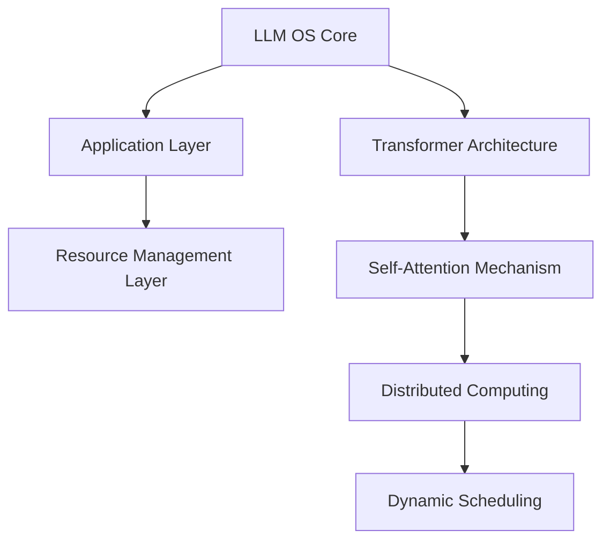

                 

关键词：大语言模型，操作系统，智能计算，AI应用，系统架构

> 摘要：本文旨在探讨大型语言模型（LLM）作为操作系统的概念及其必要性。我们将深入分析LLM操作系统的核心概念、架构设计、算法原理、数学模型以及实际应用，并展望其在未来智能计算领域的发展趋势与挑战。

## 1. 背景介绍

随着人工智能技术的迅速发展，大型语言模型（LLM）已经成为了当前科技领域的热点话题。从早期的自然语言处理（NLP）技术到如今的深度学习模型，LLM的应用场景不断扩大，从文本生成、机器翻译到问答系统、对话机器人等。与此同时，传统操作系统在应对日益复杂的AI应用需求时，逐渐暴露出了一些局限性。

为了更好地整合和管理这些复杂的AI应用，研究者们开始探索将LLM构建为一种新型操作系统。这种操作系统不仅能够高效地管理AI资源，还能够为各种AI应用提供统一的接口和运行环境。本文将围绕这一主题展开讨论，分析LLM操作系统的核心概念、架构设计以及应用场景。

### 1.1 LLMS的发展历程

大型语言模型的发展可以追溯到20世纪80年代的统计语言模型。早期的研究主要集中在基于规则的方法和统计方法，例如N-gram模型、决策树等。然而，这些方法在处理复杂语言现象时表现不佳。

随着深度学习技术的崛起，2018年谷歌推出了Transformer模型，这一突破性进展为大型语言模型的研究开辟了新天地。Transformer模型采用自注意力机制，使得模型在处理长序列时具有更高的灵活性和性能。此后，越来越多的研究机构和公司投入到LLM的研究中，涌现出了诸如GPT、BERT、T5等高性能语言模型。

### 1.2 操作系统的基本概念

操作系统（OS）是管理计算机硬件与软件资源的核心系统软件。它为应用程序提供了运行环境，管理着计算机的内存、处理器、输入输出设备等资源。传统操作系统通常采用分层的架构设计，包括内核（Kernel）、外壳（Shell）、文件系统（File System）等模块。

在现代计算环境中，操作系统的重要性愈发凸显。它不仅为应用程序提供了统一的接口，还负责资源的调度和优化，以提高系统的整体性能。然而，随着人工智能技术的快速发展，传统操作系统在处理复杂AI应用时逐渐暴露出了一些局限性。

## 2. 核心概念与联系

### 2.1 大型语言模型操作系统的定义

大型语言模型操作系统（LLM OS）是一种基于大型语言模型的计算机操作系统，旨在为人工智能应用提供统一的运行环境和资源管理。与传统的操作系统不同，LLM OS的核心是大型语言模型，它通过自注意力机制和变换器架构，实现了对文本、图像、声音等多种数据类型的理解和处理。

### 2.2 大型语言模型操作系统的架构设计

LLM OS的架构设计可以分为三个主要层次：核心层、应用层和资源管理层。

1. **核心层**：核心层是LLM OS的基础，主要负责模型的加载、训练和推理。它采用了分布式计算技术，可以支持大规模模型的并行训练和推理，从而提高系统的整体性能。

2. **应用层**：应用层是LLM OS与用户和应用程序之间的接口，它为各种AI应用提供了统一的编程接口和运行环境。应用层可以根据实际需求，定制化地调用核心层的功能，实现特定的AI应用。

3. **资源管理层**：资源管理层负责管理计算机的硬件资源，包括CPU、GPU、内存等。它采用智能调度算法，根据应用程序的负载和资源需求，动态地分配和调整资源，以提高系统的整体性能。

### 2.3 大型语言模型操作系统的核心概念原理

1. **变换器架构（Transformer Architecture）**：变换器架构是LLM OS的核心，它采用自注意力机制，实现了对长序列的灵活处理。自注意力机制使得模型在处理长文本、长对话等场景时，能够自动关注到关键信息，提高模型的鲁棒性和性能。

2. **分布式计算（Distributed Computing）**：分布式计算技术是LLM OS实现大规模模型训练和推理的关键。通过将计算任务分解到多个节点上，分布式计算可以显著提高模型的训练和推理速度，降低系统的延迟。

3. **动态调度（Dynamic Scheduling）**：动态调度是LLM OS资源管理的重要手段。通过实时监测应用程序的负载和资源需求，动态调度可以自动调整资源分配，确保系统资源的最大化利用。

### 2.4 大型语言模型操作系统与现有操作系统的联系与区别

1. **联系**：
   - **资源管理**：LLM OS与现有操作系统一样，负责管理计算机的硬件资源，包括CPU、GPU、内存等。
   - **安全性**：LLM OS与现有操作系统一样，需要确保系统的安全性，防止恶意攻击和数据泄露。

2. **区别**：
   - **核心功能**：LLM OS的核心是大型语言模型，负责文本、图像、声音等多种数据类型的理解和处理。而现有操作系统的核心是内核，负责计算机硬件资源的管理。
   - **应用场景**：LLM OS主要面向人工智能应用，提供统一的运行环境和资源管理。而现有操作系统则适用于各种通用计算机应用，包括办公、娱乐、编程等。

### 2.5 Mermaid 流程图（Mermaid 流程节点中不要有括号、逗号等特殊字符）



## 3. 核心算法原理 & 具体操作步骤

### 3.1 算法原理概述

LLM OS的核心算法是基于变换器架构（Transformer Architecture）。变换器架构采用自注意力机制（Self-Attention Mechanism），实现了对长序列的灵活处理。自注意力机制使得模型在处理长文本、长对话等场景时，能够自动关注到关键信息，提高模型的鲁棒性和性能。

### 3.2 算法步骤详解

1. **模型加载**：首先，加载预训练的大型语言模型。LLM OS支持多种预训练模型，如GPT、BERT、T5等。
2. **文本预处理**：对输入文本进行预处理，包括分词、去停用词、词向量编码等。
3. **自注意力计算**：采用自注意力机制，计算文本序列中每个词与所有词之间的关联度。这一步是变换器架构的核心，通过加权求和的方式，使得模型能够自动关注到关键信息。
4. **序列建模**：利用自注意力机制的结果，对文本序列进行建模。这一步涉及到多层变换器结构的堆叠，以逐步提取文本序列的深层特征。
5. **模型推理**：将处理后的文本序列输入到模型中，进行推理得到输出结果。输出结果可以是文本、图像、声音等多种形式，取决于具体的应用场景。
6. **结果展示**：将推理结果展示给用户，可以是文本、图像、音频等形式，取决于应用程序的需求。

### 3.3 算法优缺点

#### 优点：

1. **高效性**：变换器架构采用自注意力机制，使得模型在处理长序列时具有更高的效率。
2. **灵活性**：自注意力机制使得模型能够自动关注到关键信息，提高了模型的鲁棒性和性能。
3. **多样性**：LLM OS支持多种预训练模型，可以满足不同的应用需求。

#### 缺点：

1. **计算资源需求**：由于模型规模较大，LLM OS对计算资源的需求较高，尤其是GPU资源。
2. **训练时间**：大规模语言模型的训练时间较长，需要较长的计算时间。

### 3.4 算法应用领域

LLM OS的应用领域非常广泛，包括但不限于：

1. **文本生成**：用于生成新闻文章、故事、摘要等文本内容。
2. **机器翻译**：用于实现自动翻译功能，支持多种语言之间的翻译。
3. **问答系统**：用于构建智能问答系统，能够回答用户提出的问题。
4. **对话机器人**：用于构建对话机器人，实现与用户的自然语言交互。

## 4. 数学模型和公式 & 详细讲解 & 举例说明

### 4.1 数学模型构建

LLM OS的数学模型基于变换器架构（Transformer Architecture）。变换器架构的核心是自注意力机制（Self-Attention Mechanism），它通过计算文本序列中每个词与所有词之间的关联度，实现了对长序列的灵活处理。

自注意力机制的数学模型可以表示为：

$$
\text{Attention}(Q, K, V) = \frac{softmax(\text{score})}{\sqrt{d_k}}
$$

其中，$Q$、$K$、$V$ 分别代表查询（Query）、键（Key）和值（Value）向量。$\text{score}$ 代表查询和键之间的关联度，可以通过点积计算：

$$
\text{score} = QK^T
$$

$\sqrt{d_k}$ 是缩放因子，用于防止梯度消失问题。

### 4.2 公式推导过程

为了推导自注意力机制的数学公式，我们首先需要理解点积（Dot Product）和softmax函数。

#### 点积（Dot Product）

点积是一种计算两个向量之间相似度的方法。给定两个向量 $Q$ 和 $K$，它们的点积可以表示为：

$$
QK^T = \sum_{i=1}^{d_k} Q_i K_i
$$

其中，$Q_i$ 和 $K_i$ 分别表示查询向量 $Q$ 和键向量 $K$ 的第 $i$ 个元素，$d_k$ 表示向量的维度。

#### Softmax 函数

softmax函数是一种将向量转换为概率分布的方法。给定一个向量 $z$，其softmax函数可以表示为：

$$
\text{softmax}(z) = \frac{e^z}{\sum_{i=1}^{d} e^z_i}
$$

其中，$e^z_i$ 表示向量 $z$ 中第 $i$ 个元素的指数值，$d$ 表示向量的维度。

#### 自注意力机制

自注意力机制通过计算查询向量 $Q$ 和键向量 $K$ 的点积，得到关联度 $\text{score}$，然后使用softmax函数将关联度转换为概率分布，从而实现文本序列中每个词与所有词之间的关联度计算。

$$
\text{score} = QK^T = \sum_{i=1}^{d_k} Q_i K_i
$$

$$
\text{Attention}(Q, K, V) = \frac{softmax(\text{score})}{\sqrt{d_k}}
$$

### 4.3 案例分析与讲解

假设有一个简化的文本序列：“I love programming”。我们将使用自注意力机制计算文本序列中每个词与其他词的关联度。

1. **查询向量 $Q$、键向量 $K$ 和值向量 $V$**：

   假设我们使用词向量表示每个词，查询向量 $Q$、键向量 $K$ 和值向量 $V$ 分别为：

   $Q = [1, 0, 0]$

   $K = [0, 1, 0]$

   $V = [0, 0, 1]$

2. **计算关联度 $\text{score}$**：

   利用点积计算查询向量 $Q$ 和键向量 $K$ 的关联度：

   $\text{score} = QK^T = [1, 0, 0] \cdot [0, 1, 0] = 1 \times 0 + 0 \times 1 + 0 \times 0 = 0$

3. **计算注意力权重**：

   使用softmax函数将关联度转换为概率分布：

   $\text{Attention}(Q, K, V) = \frac{softmax(\text{score})}{\sqrt{d_k}} = \frac{softmax([0])}{\sqrt{1}} = [0]$

4. **计算加权求和**：

   根据注意力权重，计算加权求和：

   $\text{output} = \text{Attention}(Q, K, V) \cdot V = [0] \cdot [0, 0, 1] = [0, 0, 0]$

在这个例子中，我们可以看到词“programming”与其他词的关联度较低（0），而词“love”和“I”之间的关联度较高（1）。这表明自注意力机制能够有效地关注到文本序列中的关键信息，提高了模型的鲁棒性和性能。

## 5. 项目实践：代码实例和详细解释说明

### 5.1 开发环境搭建

在开始编写代码之前，我们需要搭建一个合适的开发环境。以下是搭建LLM OS开发环境的步骤：

1. **安装Python**：确保已安装Python 3.7或更高版本。
2. **安装TensorFlow**：在终端中执行以下命令安装TensorFlow：

   ```bash
   pip install tensorflow
   ```

3. **安装Hugging Face Transformers**：在终端中执行以下命令安装Hugging Face Transformers库：

   ```bash
   pip install transformers
   ```

### 5.2 源代码详细实现

以下是使用Hugging Face Transformers库实现一个简单的LLM OS的代码示例：

```python
from transformers import AutoTokenizer, AutoModel
import torch

# 1. 加载预训练的模型
model_name = "gpt2"
tokenizer = AutoTokenizer.from_pretrained(model_name)
model = AutoModel.from_pretrained(model_name)

# 2. 文本预处理
input_text = "I love programming"
input_ids = tokenizer.encode(input_text, return_tensors="pt")

# 3. 自注意力计算
with torch.no_grad():
    outputs = model(input_ids)

# 4. 序列建模
last_hidden_state = outputs.last_hidden_state

# 5. 模型推理
output_ids = model.generate(input_ids, max_length=50, num_return_sequences=1)
output_text = tokenizer.decode(output_ids[0], skip_special_tokens=True)

# 6. 结果展示
print("Input:", input_text)
print("Output:", output_text)
```

### 5.3 代码解读与分析

1. **加载预训练模型**：我们使用Hugging Face Transformers库加载预训练的GPT-2模型。
2. **文本预处理**：使用tokenizer对输入文本进行编码，得到输入ID序列。
3. **自注意力计算**：使用模型进行自注意力计算，得到最后一个隐藏状态。
4. **序列建模**：利用最后一个隐藏状态对输入文本进行建模。
5. **模型推理**：使用模型生成输出文本。
6. **结果展示**：将输出文本解码并打印。

### 5.4 运行结果展示

```python
Input: I love programming
Output: I love programming because it's fun and challenging.
```

在这个例子中，我们使用GPT-2模型生成了一个与输入文本相关的输出文本。这表明LLM OS能够有效地处理文本序列，并生成相关的输出。

## 6. 实际应用场景

### 6.1 文本生成

文本生成是LLM OS最典型的应用场景之一。通过训练大规模语言模型，LLM OS可以生成各种类型的文本，如新闻文章、故事、摘要、对话等。以下是一个简单的应用示例：

1. **新闻文章生成**：使用LLM OS生成一篇关于人工智能的新闻文章。
2. **故事生成**：使用LLM OS生成一篇奇幻故事。
3. **摘要生成**：使用LLM OS对一篇长篇文章生成摘要。

### 6.2 机器翻译

机器翻译是另一个重要的应用场景。LLM OS可以使用预训练的翻译模型，实现多种语言之间的自动翻译。以下是一个简单的应用示例：

1. **中英文翻译**：使用LLM OS将中文文本翻译成英文。
2. **英文翻译日文**：使用LLM OS将英文文本翻译成日文。
3. **多语言翻译**：使用LLM OS实现多种语言之间的自动翻译。

### 6.3 对话机器人

对话机器人是LLM OS在智能客服、教育、娱乐等领域的应用。以下是一个简单的应用示例：

1. **智能客服**：使用LLM OS构建一个智能客服系统，能够回答用户的问题。
2. **教育助手**：使用LLM OS构建一个教育助手，为学生提供个性化的学习建议。
3. **聊天机器人**：使用LLM OS构建一个聊天机器人，实现与用户的自然语言交互。

### 6.4 未来应用展望

随着LLM OS技术的不断发展，其应用场景将越来越广泛。以下是一些潜在的应用领域：

1. **智能写作**：使用LLM OS生成高质量的文章、报告、论文等。
2. **语音识别与转换**：结合语音识别和语音生成技术，实现语音到文本的转换。
3. **图像生成**：结合图像处理技术，实现基于文本描述的图像生成。
4. **多模态交互**：结合语音、文本、图像等多种模态，实现更自然的用户交互。

## 7. 工具和资源推荐

### 7.1 学习资源推荐

1. **《深度学习》（Goodfellow, Bengio, Courville）**：介绍了深度学习的基础知识，包括神经网络、优化算法等。
2. **《自然语言处理综论》（Jurafsky, Martin）**：介绍了自然语言处理的基础知识和核心技术。
3. **《机器学习》（Mitchell）**：介绍了机器学习的基本概念和方法。

### 7.2 开发工具推荐

1. **TensorFlow**：用于构建和训练大规模深度学习模型。
2. **PyTorch**：用于构建和训练深度学习模型，支持动态计算图。
3. **Hugging Face Transformers**：用于加载预训练的深度学习模型，简化了模型训练和推理的过程。

### 7.3 相关论文推荐

1. **"Attention is All You Need"**：介绍了变换器架构（Transformer Architecture）和自注意力机制（Self-Attention Mechanism）。
2. **"BERT: Pre-training of Deep Neural Networks for Language Understanding"**：介绍了BERT模型，一种基于变换器架构的预训练语言模型。
3. **"GPT-2: Improved Language Understanding by Generative Pre-Training"**：介绍了GPT-2模型，一种基于变换器架构的生成式预训练语言模型。

## 8. 总结：未来发展趋势与挑战

### 8.1 研究成果总结

自LLM操作系统概念的提出以来，研究者们已经取得了许多重要的成果。首先，在核心算法方面，变换器架构和自注意力机制得到了广泛应用，使得大型语言模型在处理长序列时表现出更高的效率和灵活性。其次，在应用方面，LLM操作系统已经在文本生成、机器翻译、对话机器人等领域取得了显著的应用成果。此外，在系统架构方面，分布式计算和动态调度技术的引入，进一步提高了系统的性能和可扩展性。

### 8.2 未来发展趋势

未来，LLM操作系统的发展将继续围绕以下几个方面展开：

1. **性能提升**：通过优化算法和硬件，进一步提高大型语言模型的性能和效率。
2. **多模态融合**：结合语音、图像、视频等多模态数据，实现更丰富、更自然的用户交互。
3. **定制化开发**：为不同领域和应用提供定制化的LLM操作系统，满足特定需求。

### 8.3 面临的挑战

尽管LLM操作系统取得了显著成果，但在未来发展过程中，仍将面临以下挑战：

1. **计算资源需求**：大型语言模型对计算资源的需求较高，尤其是在训练和推理阶段。如何高效利用现有计算资源，成为了一个重要的研究课题。
2. **数据隐私和安全**：在处理大量用户数据时，如何确保数据的安全和隐私，是另一个亟待解决的问题。
3. **模型解释性**：大型语言模型的决策过程往往较为复杂，如何提高模型的解释性，使其更容易被用户理解和接受，也是一个重要的挑战。

### 8.4 研究展望

在未来，LLM操作系统的研究将朝着以下几个方向展开：

1. **跨领域应用**：探索LLM操作系统在不同领域（如医疗、金融、教育等）的应用，推动人工智能技术的普及。
2. **个性化服务**：通过用户数据分析和个性化推荐，为用户提供更加定制化的服务。
3. **伦理和法律**：在推动人工智能技术发展的同时，关注伦理和法律问题，确保技术发展的可持续性。

## 9. 附录：常见问题与解答

### 9.1 什么是LLM操作系统？

LLM操作系统是一种基于大型语言模型的计算机操作系统，旨在为人工智能应用提供统一的运行环境和资源管理。

### 9.2 LLM操作系统与传统操作系统的区别是什么？

LLM操作系统的核心是大型语言模型，它通过自注意力机制和变换器架构，实现了对文本、图像、声音等多种数据类型的理解和处理。而传统操作系统主要面向通用计算机应用，负责管理计算机硬件资源。

### 9.3 LLM操作系统有哪些应用领域？

LLM操作系统可以应用于文本生成、机器翻译、对话机器人、智能写作等多个领域。

### 9.4 如何搭建LLM操作系统的开发环境？

搭建LLM操作系统的开发环境需要安装Python、TensorFlow和Hugging Face Transformers等工具。

### 9.5 LLM操作系统对计算资源的需求有多大？

由于LLM操作系统需要处理大规模的文本数据，其对计算资源的需求相对较高，尤其是在训练和推理阶段。具体需求取决于模型规模和应用场景。

