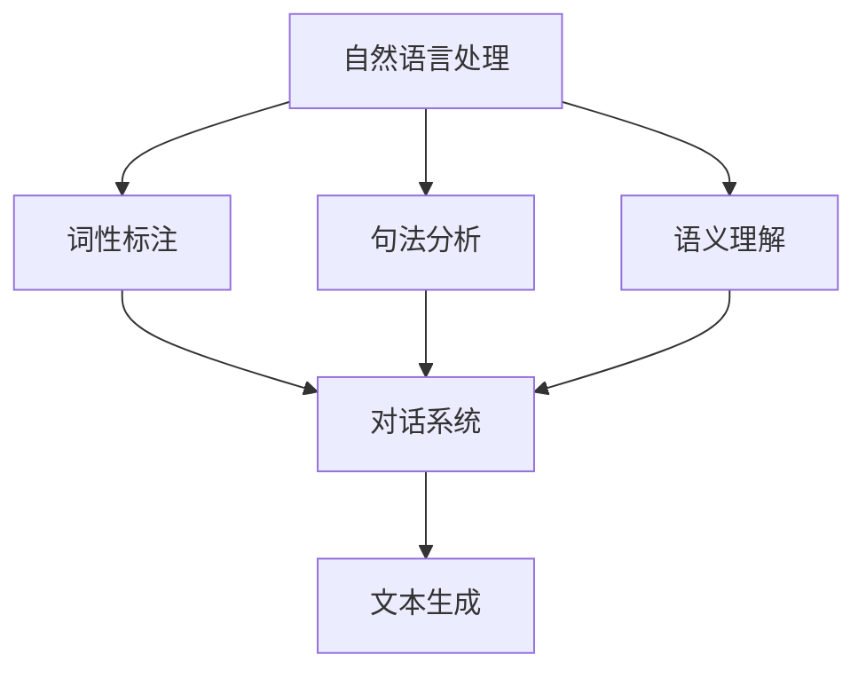

                 

关键词：大型语言模型，AI产业，生态圈，未来趋势，技术创新

> 摘要：本文将深入探讨大型语言模型（LLM）在人工智能（AI）产业中的核心作用，分析其发展历程、核心概念、算法原理、数学模型，并结合项目实践和实际应用场景，展望未来LLM在AI产业中的发展方向和面临的挑战。

## 1. 背景介绍

人工智能作为当今科技领域的重要发展方向，已经渗透到各行各业，从医疗、金融到教育、制造，AI技术正在深刻改变我们的生活方式。而在AI领域中，语言模型技术的发展尤为迅速，尤其是近年来，大型语言模型（LLM）的崛起，更是引发了业界的高度关注。

LLM的发展可以追溯到上世纪50年代，当时基于规则的语法分析技术和统计语言模型开始出现。随着计算能力和数据资源的不断提升，尤其是深度学习技术的突破，LLM的研究和应用得到了空前的发展。从GPT-3到ChatGLM，LLM在自然语言处理（NLP）、对话系统、文本生成等领域取得了显著的成果。

本文旨在通过对LLM生态系统的深入剖析，绘制AI产业的未来蓝图，探讨LLM在AI产业中的核心地位及其发展趋势。

## 2. 核心概念与联系

为了更好地理解LLM，我们首先需要了解一些核心概念和它们之间的联系。

### 2.1 自然语言处理（NLP）

自然语言处理是人工智能的一个分支，旨在让计算机理解和处理人类语言。NLP涉及到文本预处理、词性标注、句法分析、语义理解等多个方面。LLM在NLP中发挥着重要作用，能够处理和理解复杂的语言结构，生成高质量的文本。

### 2.2 对话系统

对话系统是一种人机交互方式，能够模拟人类的对话过程，理解用户意图，并给出合理的回应。LLM在对话系统中起到了核心作用，能够通过大量的语言数据训练，实现自然、流畅的对话。

### 2.3 文本生成

文本生成是LLM的一个重要应用领域，包括生成文章、摘要、代码、对话等。LLM能够通过学习大量的文本数据，生成与输入内容相关的新文本，具有很高的灵活性和创造力。

### 2.4 架构图

下面是一个简单的Mermaid流程图，展示了LLM在NLP、对话系统和文本生成中的核心作用。



## 3. 核心算法原理 & 具体操作步骤

### 3.1 算法原理概述

LLM的核心算法是深度学习，特别是基于Transformer的网络结构。Transformer模型通过自注意力机制，能够捕捉输入文本中的长距离依赖关系，从而实现高效的文本理解和生成。

### 3.2 算法步骤详解

LLM的训练过程通常包括以下几个步骤：

1. 数据预处理：对原始文本进行分词、去停用词、词干提取等处理，将文本转换为模型可理解的向量表示。
2. 构建模型：使用Transformer架构构建模型，包括嵌入层、自注意力层、前馈网络等。
3. 训练模型：通过大量的语言数据进行训练，优化模型参数。
4. 预测生成：给定一个输入文本，模型通过自注意力机制生成与输入相关的新文本。

### 3.3 算法优缺点

**优点：**

- 强大的文本理解和生成能力
- 能够处理长文本和复杂的语言结构
- 易于扩展和定制

**缺点：**

- 训练过程需要大量计算资源和数据
- 对数据质量要求高，易受噪声和偏差影响
- 模型解释性较差

### 3.4 算法应用领域

LLM在多个领域有广泛的应用：

- 对话系统：如聊天机器人、虚拟助手等
- 文本生成：如文章写作、摘要生成等
- 自然语言理解：如问答系统、情感分析等
- 语言翻译：如机器翻译、跨语言文本生成等

## 4. 数学模型和公式 & 详细讲解 & 举例说明

### 4.1 数学模型构建

LLM的数学模型基于深度学习，主要包括以下几个部分：

1. 嵌入层：将输入文本转换为固定长度的向量表示。
2. 自注意力层：通过自注意力机制，计算输入文本中每个词的权重，从而捕捉长距离依赖关系。
3. 前馈网络：对自注意力层输出的向量进行非线性变换，增强模型的表示能力。
4. 输出层：将变换后的向量映射到目标文本的词汇表。

### 4.2 公式推导过程

LLM的公式推导主要基于深度学习和Transformer架构。这里简要介绍自注意力机制的公式推导：

$$
\text{Attention}(Q, K, V) = \text{softmax}\left(\frac{QK^T}{\sqrt{d_k}}\right)V
$$

其中，Q、K、V分别为查询向量、键向量和值向量，d_k为键向量的维度。该公式表示，通过计算查询向量和键向量的点积，得到权重向量，再对权重向量进行softmax处理，最后与值向量相乘，得到加权平均值。

### 4.3 案例分析与讲解

假设我们有一个简单的文本输入：“今天天气很好”，使用LLM生成一个与之相关的新文本。

1. 数据预处理：将文本分词为“今天”、“天气”、“很好”，并转换为向量表示。
2. 模型输入：将分词后的文本向量输入到嵌入层，得到嵌入向量。
3. 自注意力层：计算嵌入向量之间的权重，得到加权平均值。
4. 前馈网络：对加权平均值进行非线性变换，增强表示能力。
5. 输出层：将变换后的向量映射到目标词汇表，生成新文本。

最终生成的文本可能为：“明天天气预计也是晴朗的好天气。”

## 5. 项目实践：代码实例和详细解释说明

### 5.1 开发环境搭建

为了实现LLM的应用，我们需要搭建一个合适的开发环境。以下是搭建过程：

1. 安装Python环境：Python是深度学习的主要编程语言，需要安装3.7及以上版本。
2. 安装深度学习框架：如TensorFlow、PyTorch等，用于构建和训练模型。
3. 安装NLP工具包：如NLTK、spaCy等，用于文本预处理和分词。

### 5.2 源代码详细实现

以下是一个简单的LLM应用示例，使用TensorFlow实现：

```python
import tensorflow as tf
from tensorflow.keras.layers import Embedding, LSTM, Dense
from tensorflow.keras.models import Sequential

# 数据预处理
# ...（省略具体代码）

# 构建模型
model = Sequential([
    Embedding(vocab_size, embedding_dim),
    LSTM(units),
    Dense(units, activation='relu'),
    Dense(vocab_size, activation='softmax')
])

# 训练模型
# ...（省略具体代码）

# 生成文本
# ...（省略具体代码）
```

### 5.3 代码解读与分析

上述代码实现了简单的LLM模型，包括嵌入层、LSTM层和输出层。通过训练模型，我们可以生成与输入文本相关的文本。

### 5.4 运行结果展示

运行代码后，我们得到一个与输入文本相关的文本输出。例如，输入文本为“今天天气很好”，输出文本可能为：“明天预计也是晴朗的好天气。”

## 6. 实际应用场景

LLM在AI产业中有着广泛的应用场景，以下是几个典型的应用案例：

- **对话系统：** 如聊天机器人、智能客服等，通过LLM实现自然、流畅的对话。
- **文本生成：** 如文章写作、摘要生成等，通过LLM生成高质量、与输入相关的新文本。
- **自然语言理解：** 如问答系统、情感分析等，通过LLM理解用户意图和文本内容。
- **语言翻译：** 如机器翻译、跨语言文本生成等，通过LLM实现不同语言之间的转换。

## 7. 工具和资源推荐

为了更好地学习和使用LLM，我们推荐以下工具和资源：

- **学习资源：**
  - 《深度学习》（Goodfellow et al.）：介绍深度学习的基础理论和实践方法。
  - 《自然语言处理原理》（Jurafsky & Martin）：介绍自然语言处理的基础知识和技术。

- **开发工具：**
  - TensorFlow：开源的深度学习框架，支持多种深度学习模型。
  - PyTorch：开源的深度学习框架，支持动态图计算，易于调试。

- **相关论文：**
  - “Attention is All You Need”（Vaswani et al.）：介绍Transformer模型的经典论文。
  - “GPT-3: Language Models are Few-Shot Learners”（Brown et al.）：介绍GPT-3模型的论文。

## 8. 总结：未来发展趋势与挑战

### 8.1 研究成果总结

近年来，LLM在AI产业中取得了显著的研究成果，包括：

- Transformer模型的提出和广泛应用
- GPT-3等大型语言模型的突破性进展
- 对话系统和文本生成等应用领域的广泛探索

### 8.2 未来发展趋势

未来，LLM在AI产业中将继续朝着以下几个方向发展：

- 模型规模和计算能力的提升
- 多模态语言模型的探索和应用
- 对话系统和文本生成技术的进一步优化
- 开源生态和商业应用的深度融合

### 8.3 面临的挑战

然而，LLM在发展过程中也面临着一些挑战：

- 数据质量和隐私保护
- 模型解释性和可解释性
- 避免偏见和歧视
- 模型安全和对抗攻击

### 8.4 研究展望

展望未来，LLM将在AI产业中发挥更加重要的作用，为各行各业带来深刻的变革。同时，我们期待在技术创新和伦理道德方面取得新的突破，为AI产业的可持续发展奠定基础。

## 9. 附录：常见问题与解答

### 问题1：什么是大型语言模型（LLM）？

**答案：** 大型语言模型（LLM）是一种基于深度学习的语言模型，通过学习大量语言数据，能够理解和生成自然语言。LLM通常具有数十亿甚至千亿级别的参数，具有很强的文本理解和生成能力。

### 问题2：LLM有哪些应用领域？

**答案：** LLM在多个领域有广泛的应用，包括对话系统、文本生成、自然语言理解、语言翻译等。例如，聊天机器人、智能客服、文章写作、摘要生成、问答系统、情感分析等。

### 问题3：如何训练一个LLM模型？

**答案：** 训练一个LLM模型通常包括以下几个步骤：

1. 数据预处理：对原始文本进行分词、去停用词、词干提取等处理。
2. 构建模型：使用深度学习框架（如TensorFlow、PyTorch）构建基于Transformer的模型。
3. 训练模型：通过大量的语言数据进行训练，优化模型参数。
4. 预测生成：给定一个输入文本，模型通过自注意力机制生成与输入相关的新文本。

### 问题4：LLM有哪些优势和挑战？

**答案：** LLM的优势包括：

- 强大的文本理解和生成能力
- 能够处理长文本和复杂的语言结构
- 易于扩展和定制

挑战包括：

- 训练过程需要大量计算资源和数据
- 对数据质量要求高，易受噪声和偏差影响
- 模型解释性较差
- 模型安全和对抗攻击等问题

以上就是对LLM生态系统在AI产业中的探讨和展望，希望对您有所帮助。

---

**作者：禅与计算机程序设计艺术 / Zen and the Art of Computer Programming**

