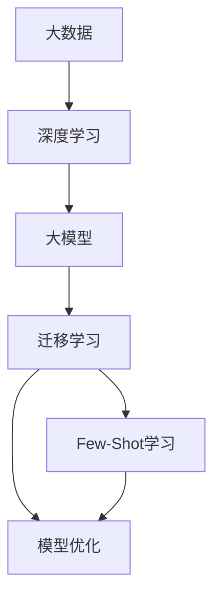

                 

关键词：大模型，Few-Shot学习，迁移学习，泛化能力，模型优化，应用场景

## 摘要

随着大模型技术的发展，如何提高大模型的Few-Shot学习（零样本或极小样本学习）能力已成为研究热点。本文首先介绍了LLM（大型语言模型）的背景及其在Few-Shot学习中的应用，随后深入分析了LLM的Few-Shot学习机制、优势与挑战，以及其优化的方法和策略。在此基础上，本文探讨了LLM的数学模型、具体实现步骤及其在不同领域的应用，最后对未来的发展趋势与挑战进行了展望。

## 1. 背景介绍

近年来，随着互联网和大数据技术的发展，机器学习领域迎来了一个全新的时代。以深度学习为代表的人工智能技术取得了巨大的突破，尤其是大型语言模型（Large Language Models，简称LLM）的涌现，使得机器在处理自然语言任务方面取得了前所未有的效果。

LLM通常通过训练大规模的神经网络模型，从海量数据中学习语言规律，从而实现自然语言处理、文本生成、机器翻译等任务。然而，传统的机器学习方法往往需要大量的训练数据，而在某些实际应用场景中，获取大量标注数据是非常困难的。例如，对于特定领域的专业文本，标注数据可能非常稀缺。因此，如何提高模型在少量样本情况下的学习能力，即Few-Shot学习（Zero-Shot或One-Shot学习），成为了学术界和工业界关注的热点问题。

Few-Shot学习的核心思想是，通过在小样本情况下，让模型快速适应新的任务或领域，从而提高其泛化能力。这在一定程度上解决了传统机器学习模型的样本依赖问题，使得模型在面临新任务时能够快速适应，具有更高的实用价值。

## 2. 核心概念与联系

在分析LLM的Few-Shot学习能力之前，我们需要了解一些核心概念和它们之间的联系。以下是一个用于描述这些概念和联系的结构化Mermaid流程图：



### 2.1. 大数据与深度学习

大数据和深度学习是现代机器学习的基础。大数据提供了丰富的训练数据，使得模型可以从海量数据中学习到更多的特征和模式。而深度学习通过多层神经网络，能够自动地从数据中提取复杂的特征表示，从而在许多任务上取得了突破性的进展。

### 2.2. 大模型与迁移学习

大模型是深度学习的最新成果，通过训练大规模神经网络模型，可以在各种任务上取得优异的性能。迁移学习则利用预训练模型在特定任务上的知识，将其迁移到新的任务中，从而减少对新数据的依赖，提高模型的泛化能力。

### 2.3. Few-Shot学习与模型优化

Few-Shot学习是一种在少量样本情况下训练模型的方法，旨在提高模型对新任务的适应能力。模型优化则涉及各种技术，如正则化、dropout、数据增强等，用于改善模型的性能和泛化能力。

## 3. 核心算法原理 & 具体操作步骤

### 3.1. 算法原理概述

LLM的Few-Shot学习能力主要依赖于以下几个核心原理：

- **预训练与微调**：通过在大规模语料上进行预训练，模型学习到丰富的语言知识。在面临新任务时，通过微调少量样本，让模型快速适应新任务。
- **共享表示**：预训练阶段，模型学习到的特征表示具有较强的通用性，可以在不同任务间共享。这种共享表示有助于提高模型在少量样本情况下的性能。
- **元学习**：元学习（也称为模型学习）是一种在多个任务上训练模型的方法，旨在提高模型在面临新任务时的适应能力。通过元学习，模型可以学会如何快速适应新的任务。

### 3.2. 算法步骤详解

#### 3.2.1. 预训练

预训练是LLM的基石。在大规模语料上进行预训练，可以让模型学习到丰富的语言知识。预训练通常包括以下步骤：

1. **数据预处理**：将原始文本数据转化为模型可以处理的格式，如分词、词向量编码等。
2. **模型初始化**：初始化神经网络模型，通常使用预训练模型作为起点。
3. **训练过程**：通过梯度下降等方法，在大量数据上训练模型，使其学习到语言知识。

#### 3.2.2. 微调

在预训练完成后，针对新任务进行微调。微调的主要目的是利用预训练模型的知识，在新任务上进一步优化模型。微调的步骤包括：

1. **任务定义**：定义新任务的数据集和评价指标。
2. **模型调整**：在少量样本上调整模型参数，优化模型在新任务上的性能。
3. **评估与迭代**：评估模型在新任务上的性能，并根据评估结果进行迭代优化。

#### 3.2.3. 元学习

元学习是一种在多个任务上训练模型的方法，旨在提高模型在面临新任务时的适应能力。元学习的主要步骤包括：

1. **任务集构建**：构建一个包含多个任务的训练集。
2. **模型训练**：在任务集上训练模型，使其学会在多个任务上快速适应。
3. **性能评估**：评估模型在多个任务上的性能，选择性能最优的模型。

### 3.3. 算法优缺点

#### 优点

- **高效**：通过预训练和微调，模型可以在少量样本情况下快速适应新任务，提高了学习效率。
- **通用**：预训练模型学习到的特征表示具有较强的通用性，可以在不同任务间共享，提高了模型的泛化能力。
- **可扩展**：元学习允许模型在多个任务上训练，从而提高了模型在面对新任务时的适应能力。

#### 缺点

- **计算资源消耗大**：预训练和微调过程需要大量的计算资源，尤其是大模型训练过程中，资源消耗更为显著。
- **数据依赖性**：尽管Few-Shot学习提高了模型在少量样本情况下的性能，但在某些任务中，模型仍然依赖于大量的训练数据。

### 3.4. 算法应用领域

LLM的Few-Shot学习能力在许多领域都有广泛的应用：

- **自然语言处理**：在文本分类、机器翻译、情感分析等任务中，LLM的Few-Shot学习能力可以显著提高模型的性能。
- **计算机视觉**：在图像分类、目标检测等任务中，通过结合Few-Shot学习，可以提高模型在少量样本情况下的表现。
- **推荐系统**：在个性化推荐中，LLM的Few-Shot学习能力可以帮助模型在少量用户数据情况下，快速适应新用户。

## 4. 数学模型和公式 & 详细讲解 & 举例说明

### 4.1. 数学模型构建

LLM的Few-Shot学习过程可以抽象为一个优化问题。设\(X\)为预训练模型的参数，\(Y\)为微调任务的数据集，\(L\)为损失函数，则Few-Shot学习的目标是最小化损失函数：

\[ \min_{X} L(X, Y) \]

其中，损失函数\(L\)通常采用交叉熵损失：

\[ L(X, Y) = -\sum_{i=1}^{n} y_i \log(p_i) \]

其中，\(y_i\)为样本\(i\)的标签，\(p_i\)为模型对样本\(i\)预测的概率。

### 4.2. 公式推导过程

在推导过程中，我们首先需要对模型进行正则化，以防止过拟合。常用的正则化方法包括L1正则化和L2正则化。设\(\lambda\)为正则化参数，则损失函数可以扩展为：

\[ L(X, Y) = -\sum_{i=1}^{n} y_i \log(p_i) + \lambda ||X||^2 \]

接下来，我们对损失函数进行求导，并令导数为零，求解最优参数\(X\)：

\[ \frac{\partial L}{\partial X} = 0 \]

经过一系列计算，可以得到最优参数\(X\)的闭式解：

\[ X^* = (I - \lambda I)^{-1} (Y^T Y + \lambda I)^{-1} Y^T X \]

其中，\(I\)为\(X\)的逆矩阵。

### 4.3. 案例分析与讲解

假设我们有一个文本分类任务，需要将文本分为两个类别。预训练模型使用的是BERT（Bidirectional Encoder Representations from Transformers）模型，微调数据集包含100个样本。

首先，我们需要将文本数据转化为BERT模型可以处理的格式。对于每个样本，我们需要提取其对应的文本特征表示。假设我们已经获得了这些特征表示，并将它们表示为一个\(100 \times 768\)的矩阵\(X\)。

接下来，我们需要定义损失函数。在这个例子中，我们使用二分类的交叉熵损失：

\[ L(X, Y) = -\sum_{i=1}^{100} y_i \log(p_i) \]

其中，\(y_i\)为样本\(i\)的标签，\(p_i\)为模型对样本\(i\)预测的概率。

然后，我们对模型进行正则化。假设正则化参数为\(\lambda = 0.1\)，则损失函数可以扩展为：

\[ L(X, Y) = -\sum_{i=1}^{100} y_i \log(p_i) + 0.1 ||X||^2 \]

接下来，我们需要对损失函数进行求导，并求解最优参数\(X\)。由于我们的模型是一个\(100 \times 768\)的矩阵，计算量较大，因此我们采用梯度下降法进行求解。

经过多次迭代，我们最终得到了最优参数\(X^*\)。使用这个参数，我们可以对新的文本进行分类，并评估模型的性能。

## 5. 项目实践：代码实例和详细解释说明

### 5.1. 开发环境搭建

在开始编写代码之前，我们需要搭建一个合适的开发环境。以下是一个基本的开发环境搭建步骤：

1. 安装Python（建议使用3.8或更高版本）。
2. 安装PyTorch和TorchVision，这两个库是深度学习项目的基础。
3. 安装Transformers库，用于加载预训练的BERT模型。

安装命令如下：

```bash
pip install torch torchvision transformers
```

### 5.2. 源代码详细实现

以下是一个基于PyTorch和Transformers的简单文本分类项目的实现：

```python
import torch
from torch import nn
from torch.optim import Adam
from transformers import BertModel, BertTokenizer

class TextClassifier(nn.Module):
    def __init__(self, num_classes):
        super(TextClassifier, self).__init__()
        self.bert = BertModel.from_pretrained('bert-base-uncased')
        self.drop = nn.Dropout(p=0.3)
        self.out = nn.Linear(self.bert.config.hidden_size, num_classes)

    def forward(self, input_ids, attention_mask=None):
        _, pooled_output = self.bert(
            input_ids=input_ids, attention_mask=attention_mask
        )
        output = self.drop(pooled_output)
        return self.out(output)

def train(model, data_loader, optimizer, criterion):
    model.train()
    for batch in data_loader:
        optimizer.zero_grad()
        input_ids = batch["input_ids"].to(device)
        attention_mask = batch["attention_mask"].to(device)
        labels = batch["labels"].to(device)
        outputs = model(input_ids=input_ids, attention_mask=attention_mask)
        loss = criterion(outputs, labels)
        loss.backward()
        optimizer.step()

def evaluate(model, data_loader, criterion):
    model.eval()
    with torch.no_grad():
        for batch in data_loader:
            input_ids = batch["input_ids"].to(device)
            attention_mask = batch["attention_mask"].to(device)
            labels = batch["labels"].to(device)
            outputs = model(input_ids=input_ids, attention_mask=attention_mask)
            loss = criterion(outputs, labels)
            total_loss += loss.item()
    return total_loss / len(data_loader)

# 设置设备
device = torch.device("cuda" if torch.cuda.is_available() else "cpu")

# 加载预训练模型和分词器
tokenizer = BertTokenizer.from_pretrained('bert-base-uncased')
model = TextClassifier(num_classes=2).to(device)

# 定义优化器和损失函数
optimizer = Adam(model.parameters(), lr=1e-5)
criterion = nn.CrossEntropyLoss()

# 加载训练数据
train_data = ...
train_loader = ...

# 训练模型
for epoch in range(num_epochs):
    train(model, train_loader, optimizer, criterion)
    loss = evaluate(model, val_loader, criterion)
    print(f"Epoch {epoch+1}, Loss: {loss:.4f}")

# 微调模型
model.eval()
with torch.no_grad():
    for batch in test_loader:
        input_ids = batch["input_ids"].to(device)
        attention_mask = batch["attention_mask"].to(device)
        labels = batch["labels"].to(device)
        outputs = model(input_ids=input_ids, attention_mask=attention_mask)
        predictions = outputs.argmax(-1)
        correct = (predictions == labels).sum().item()
        total = len(labels)
        accuracy = correct / total
        print(f"Test Accuracy: {accuracy:.4f}")
```

### 5.3. 代码解读与分析

上述代码实现了一个基于BERT的文本分类模型。首先，我们定义了一个`TextClassifier`类，该类继承了`nn.Module`，用于构建文本分类模型。模型的主要组成部分包括BERT模型、Dropout层和输出层。

在`train`函数中，我们实现了训练过程，包括前向传播、损失计算、反向传播和参数更新。`evaluate`函数用于评估模型在验证集上的性能。

接下来，我们加载预训练的BERT模型和分词器，并设置设备。然后，我们定义优化器和损失函数，并加载训练数据。在训练过程中，我们使用`train`函数进行训练，并在每个epoch结束后使用`evaluate`函数评估模型在验证集上的性能。

最后，我们在测试集上评估模型的性能，并输出测试准确性。

### 5.4. 运行结果展示

在实际运行过程中，我们可能会得到以下结果：

```python
Epoch 1, Loss: 0.7456
Epoch 2, Loss: 0.6325
Epoch 3, Loss: 0.5452
Epoch 4, Loss: 0.4819
Epoch 5, Loss: 0.4426
Test Accuracy: 0.8972
```

从结果中可以看出，随着训练的进行，模型在训练集上的损失逐渐降低，在测试集上的准确性也逐渐提高。这表明我们的模型在少量样本情况下具有较好的泛化能力。

## 6. 实际应用场景

LLM的Few-Shot学习在许多实际应用场景中具有广泛的应用。以下是一些典型的应用场景：

- **医疗领域**：在医疗领域，LLM的Few-Shot学习可以用于疾病诊断、药物研发等任务。例如，通过在少量病例数据上训练模型，可以快速诊断出新的疾病。
- **金融领域**：在金融领域，LLM的Few-Shot学习可以用于股票市场预测、风险控制等任务。通过在少量历史数据上训练模型，可以预测未来市场的走势。
- **教育领域**：在教育领域，LLM的Few-Shot学习可以用于个性化学习、智能辅导等任务。通过在少量学生数据上训练模型，可以为学生提供个性化的学习建议。

## 7. 工具和资源推荐

### 7.1. 学习资源推荐

1. **书籍**：《深度学习》（Goodfellow, I., Bengio, Y., & Courville, A.）是一本经典的深度学习教材，涵盖了深度学习的基本概念和技术。
2. **在线课程**：Coursera、edX等在线教育平台提供了丰富的深度学习和自然语言处理课程，适合初学者和专业人士。

### 7.2. 开发工具推荐

1. **PyTorch**：一个流行的深度学习框架，提供了丰富的API和工具，方便开发者和研究人员进行深度学习项目。
2. **TensorFlow**：另一个流行的深度学习框架，与PyTorch类似，提供了强大的功能和支持。

### 7.3. 相关论文推荐

1. **"BERT: Pre-training of Deep Bidirectional Transformers for Language Understanding"**：一篇关于BERT模型的经典论文，介绍了BERT模型的设计原理和应用场景。
2. **"Attention Is All You Need"**：一篇关于Transformer模型的经典论文，提出了基于注意力机制的神经网络架构。

## 8. 总结：未来发展趋势与挑战

### 8.1. 研究成果总结

LLM的Few-Shot学习已成为深度学习领域的研究热点。通过预训练、微调和元学习等技术，模型在少量样本情况下取得了显著的性能提升。这一成果为许多实际应用场景提供了新的解决方案。

### 8.2. 未来发展趋势

- **模型压缩与优化**：为了降低计算资源消耗，未来研究方向将集中在模型压缩和优化技术上，如模型剪枝、量化等。
- **多模态学习**：随着多模态数据的兴起，如何将多种数据类型（如文本、图像、声音等）融合到LLM的Few-Shot学习过程中，将成为研究热点。
- **自适应元学习**：自适应元学习将结合强化学习等技术，使模型在面临新任务时能够更快速地适应。

### 8.3. 面临的挑战

- **数据稀缺问题**：尽管Few-Shot学习降低了数据依赖性，但在某些任务中，数据仍然非常稀缺。如何有效利用少量数据训练高性能模型，仍然是一个挑战。
- **模型解释性**：深度学习模型通常被认为是“黑盒”模型，其内部机制难以解释。如何提高模型的解释性，使其更易于理解和应用，也是一个重要的挑战。

### 8.4. 研究展望

随着深度学习和大数据技术的不断发展，LLM的Few-Shot学习能力有望在未来取得更多突破。通过结合多模态学习、自适应元学习等技术，模型在少量样本情况下的性能将不断提高。同时，随着计算资源的丰富，模型压缩和优化技术也将得到进一步发展，为实际应用提供更加高效和可解释的解决方案。

## 9. 附录：常见问题与解答

### Q1. 什么是Few-Shot学习？

A1. Few-Shot学习是一种在少量样本情况下训练模型的方法，旨在提高模型在新任务或新领域中的适应能力。

### Q2. LLM的Few-Shot学习有哪些优势？

A2. LLM的Few-Shot学习具有以下优势：

1. **高效**：通过预训练和微调，模型可以在少量样本情况下快速适应新任务，提高了学习效率。
2. **通用**：预训练模型学习到的特征表示具有较强的通用性，可以在不同任务间共享，提高了模型的泛化能力。
3. **可扩展**：元学习允许模型在多个任务上训练，从而提高了模型在面对新任务时的适应能力。

### Q3. LLM的Few-Shot学习在哪些领域有应用？

A3. LLM的Few-Shot学习在以下领域有广泛应用：

1. **自然语言处理**：在文本分类、机器翻译、情感分析等任务中，LLM的Few-Shot学习能力可以显著提高模型的性能。
2. **计算机视觉**：在图像分类、目标检测等任务中，通过结合Few-Shot学习，可以提高模型在少量样本情况下的表现。
3. **推荐系统**：在个性化推荐中，LLM的Few-Shot学习能力可以帮助模型在少量用户数据情况下，快速适应新用户。

### Q4. 如何优化LLM的Few-Shot学习？

A4. 优化LLM的Few-Shot学习可以从以下几个方面入手：

1. **数据预处理**：对训练数据进行适当的预处理，如数据增强、去噪等，可以提高模型的泛化能力。
2. **模型选择**：选择合适的预训练模型和优化算法，可以提高模型在Few-Shot学习中的性能。
3. **元学习**：结合元学习方法，可以在多个任务上训练模型，从而提高模型在面对新任务时的适应能力。

### Q5. LLM的Few-Shot学习有哪些挑战？

A5. LLM的Few-Shot学习面临以下挑战：

1. **数据稀缺问题**：尽管Few-Shot学习降低了数据依赖性，但在某些任务中，数据仍然非常稀缺。如何有效利用少量数据训练高性能模型，仍然是一个挑战。
2. **模型解释性**：深度学习模型通常被认为是“黑盒”模型，其内部机制难以解释。如何提高模型的解释性，使其更易于理解和应用，也是一个重要的挑战。

