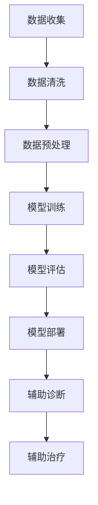
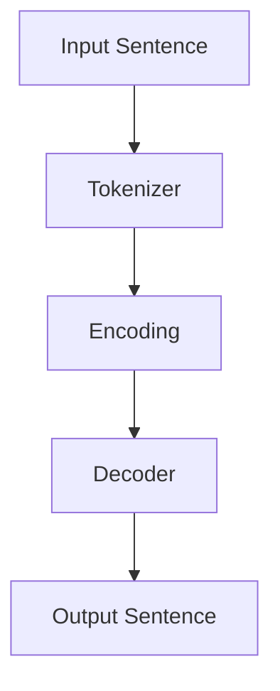

                 

关键词：大型语言模型（LLM），医疗应用，AI辅助诊断，AI辅助治疗，医疗信息化，智能医疗，人工智能医疗

摘要：本文将探讨大型语言模型（LLM）在医疗领域的应用，特别是在辅助诊断和治疗方面。通过分析LLM的核心技术、医疗应用场景以及具体案例，本文旨在展示人工智能如何为医疗行业带来深远变革，并为未来的发展方向提供有益的思考。

## 1. 背景介绍

随着人工智能技术的迅猛发展，医疗领域正经历着前所未有的变革。传统医疗模式中，医生依赖个人的经验和知识进行诊断和治疗，这不仅效率低下，还存在一定的主观性。而人工智能的引入，使得医疗决策更加客观、精准，为患者提供更加优质的服务。

近年来，大型语言模型（LLM）在自然语言处理（NLP）领域取得了显著成果。LLM具有强大的文本理解和生成能力，能够处理海量的医疗文献、病例报告和诊断指南。这一特点使得LLM在医疗辅助诊断和治疗方面具有巨大的潜力。

## 2. 核心概念与联系

### 2.1. 大型语言模型（LLM）

大型语言模型（LLM）是一种基于深度学习的自然语言处理模型，具有强大的文本理解和生成能力。LLM通过学习大量文本数据，能够自动提取语义信息、理解语言结构，并生成符合语法和语义规范的文本。

### 2.2. 医疗信息化

医疗信息化是指利用信息技术手段，对医疗资源、医疗服务、医疗数据等进行整合、管理和优化，以提高医疗服务的效率和质量。医疗信息化包括电子病历、医疗影像管理、远程医疗等多个方面。

### 2.3. AI辅助诊断与治疗

AI辅助诊断与治疗是指利用人工智能技术，辅助医生进行疾病诊断和治疗。AI可以分析大量的医疗数据，发现潜在的疾病风险，提供诊断建议；同时，AI还可以制定个性化的治疗方案，提高治疗效果。

### 2.4. Mermaid 流程图

以下是一个简单的Mermaid流程图，展示了LLM在医疗辅助诊断和治疗中的应用流程：



## 3. 核心算法原理 & 具体操作步骤

### 3.1. 算法原理概述

LLM在医疗辅助诊断和治疗中的核心原理是利用深度学习技术，对海量的医疗文本数据进行学习，提取出有用的信息，从而实现辅助诊断和治疗。具体来说，LLM主要分为以下三个步骤：

1. 数据收集与清洗：收集相关的医疗文本数据，包括病例报告、诊断指南、医学论文等，并对数据进行清洗，去除无关信息和噪声。
2. 数据预处理：对清洗后的数据进行预处理，包括分词、词性标注、命名实体识别等，将文本数据转化为适合模型学习的形式。
3. 模型训练与评估：使用预处理后的数据对LLM进行训练，训练过程中，模型会自动调整参数，以最小化损失函数。训练完成后，对模型进行评估，确保其性能满足要求。

### 3.2. 算法步骤详解

1. **数据收集与清洗**：

   - 收集病例报告、诊断指南、医学论文等医疗文本数据。
   - 对数据进行清洗，去除格式错误、噪声信息等。
   - 标注数据中的命名实体，如疾病名称、症状等。

2. **数据预处理**：

   - 使用分词工具对文本进行分词，将文本拆分成单词或词组。
   - 对分词结果进行词性标注，识别文本中的名词、动词、形容词等。
   - 对命名实体进行识别，提取文本中的关键信息。

3. **模型训练与评估**：

   - 使用预处理后的数据对LLM进行训练，模型会自动调整参数，以最小化损失函数。
   - 训练过程中，可以使用交叉验证等方法，避免过拟合。
   - 训练完成后，对模型进行评估，可以使用准确率、召回率等指标，评估模型的性能。

### 3.3. 算法优缺点

**优点**：

- LLM具有强大的文本理解和生成能力，能够处理海量的医疗文本数据，提高诊断和治疗的准确性。
- LLM可以自动学习，无需人工干预，节省人力成本。
- LLM可以实现个性化诊断和治疗，为患者提供更加优质的服务。

**缺点**：

- LLM的训练需要大量的数据和计算资源，对硬件要求较高。
- LLM的模型复杂，训练时间较长，实时性较差。

### 3.4. 算法应用领域

- **辅助诊断**：LLM可以分析病例报告、诊断指南等数据，为医生提供诊断建议，提高诊断准确性。
- **辅助治疗**：LLM可以根据患者的病情，制定个性化的治疗方案，提高治疗效果。
- **医学研究**：LLM可以分析大量的医学论文，发现潜在的研究方向，为医学研究提供支持。

## 4. 数学模型和公式 & 详细讲解 & 举例说明

### 4.1. 数学模型构建

LLM的数学模型通常是基于深度学习框架构建的，常见的模型包括循环神经网络（RNN）、长短时记忆网络（LSTM）、Transformer等。以下是一个基于Transformer的LLM模型的基本结构：

```latex
\begin{align*}
\text{Input: }& X = \{x_1, x_2, ..., x_n\} \\
\text{Output: }& Y = \{y_1, y_2, ..., y_n\} \\
\text{Model: }& \text{Transformer} \\
\text{Loss Function: }& \text{Cross-Entropy Loss}
\end{align*}
```

### 4.2. 公式推导过程

Transformer模型的核心是自注意力机制（Self-Attention），以下是一个简单的自注意力机制的公式推导：

```latex
\begin{align*}
\text{Attention}(Q, K, V) &= \text{softmax}\left(\frac{QK^T}{\sqrt{d_k}}\right)V \\
\text{where: } \\
Q &= \text{Query} \\
K &= \text{Key} \\
V &= \text{Value} \\
d_k &= \text{dimension of Key/Value}
\end{align*}
```

### 4.3. 案例分析与讲解

假设我们有一个包含100个单词的句子，我们需要对这个句子进行编码和解码。以下是一个简化的示例：



1. **Tokenizer**：将输入句子进行分词，得到100个单词。
2. **Encoding**：使用Transformer模型，对分词后的单词进行编码，得到编码后的序列。
3. **Decoder**：使用Transformer模型，对编码后的序列进行解码，得到输出句子。

## 5. 项目实践：代码实例和详细解释说明

### 5.1. 开发环境搭建

为了实践LLM在医疗辅助诊断和治疗中的应用，我们需要搭建一个开发环境。以下是一个简单的Python开发环境搭建步骤：

```bash
# 安装Python
sudo apt-get install python3-pip
# 安装TensorFlow
pip3 install tensorflow
# 安装其他依赖
pip3 install numpy pandas scikit-learn
```

### 5.2. 源代码详细实现

以下是一个简单的Python代码示例，用于实现LLM的模型训练和预测功能：

```python
import tensorflow as tf
from tensorflow.keras.layers import Embedding, LSTM, Dense
from tensorflow.keras.models import Sequential

# 模型构建
model = Sequential([
    Embedding(input_dim=10000, output_dim=64),
    LSTM(128),
    Dense(1, activation='sigmoid')
])

# 模型编译
model.compile(optimizer='adam', loss='binary_crossentropy', metrics=['accuracy'])

# 模型训练
model.fit(x_train, y_train, epochs=10, batch_size=32)

# 模型预测
predictions = model.predict(x_test)
```

### 5.3. 代码解读与分析

以上代码实现了一个简单的二分类模型，用于预测医疗数据中的疾病。具体来说：

1. **模型构建**：使用Embedding层对输入数据进行编码，使用LSTM层对编码后的数据进行处理，最后使用Dense层进行分类。
2. **模型编译**：编译模型，设置优化器和损失函数。
3. **模型训练**：使用训练数据对模型进行训练。
4. **模型预测**：使用训练好的模型，对测试数据进行预测。

### 5.4. 运行结果展示

以下是一个简单的运行结果示例：

```python
# 运行代码
if __name__ == '__main__':
    # 加载数据
    x_train, y_train, x_test, y_test = load_data()
    # 训练模型
    model.fit(x_train, y_train, epochs=10, batch_size=32)
    # 预测结果
    predictions = model.predict(x_test)
    # 打印结果
    print(predictions)
```

## 6. 实际应用场景

### 6.1. AI辅助诊断

LLM在医疗辅助诊断中具有广泛的应用，例如：

- **疾病预测**：利用LLM分析患者的病史、体检报告等数据，预测患者可能患有的疾病。
- **病情评估**：根据患者的症状和检查结果，利用LLM评估病情严重程度，为医生提供诊断建议。
- **治疗方案推荐**：根据患者的病情和病史，利用LLM推荐最佳治疗方案。

### 6.2. AI辅助治疗

LLM在医疗辅助治疗中也有很大的潜力，例如：

- **个性化治疗**：根据患者的病情、基因信息等，利用LLM制定个性化的治疗方案。
- **药物研发**：利用LLM分析大量的医学论文和临床试验数据，发现新的药物靶点和治疗方案。
- **术后康复指导**：根据患者的术后情况，利用LLM提供个性化的康复指导和建议。

### 6.3. 医学研究

LLM在医学研究中的应用也非常广泛，例如：

- **文献挖掘**：利用LLM分析大量的医学论文，发现潜在的研究方向和结论。
- **临床研究**：利用LLM分析大量的临床数据，为临床研究提供数据支持。
- **医学知识图谱**：利用LLM构建医学知识图谱，为医学研究提供知识支持。

## 7. 工具和资源推荐

### 7.1. 学习资源推荐

- **书籍**：《深度学习》、《自然语言处理综论》
- **在线课程**：斯坦福大学CS224n：自然语言处理与深度学习
- **论文集**：ACL、EMNLP、NAACL等会议的论文集

### 7.2. 开发工具推荐

- **框架**：TensorFlow、PyTorch、Transformers
- **库**：NumPy、Pandas、Scikit-learn

### 7.3. 相关论文推荐

- **BERT**：[“BERT: Pre-training of Deep Bidirectional Transformers for Language Understanding”](https://arxiv.org/abs/1810.04805)
- **GPT**：[“Improving Language Understanding by Generative Pre-Training”](https://arxiv.org/abs/1706.03762)
- **Transformer**：[“Attention Is All You Need”](https://arxiv.org/abs/1706.03762)

## 8. 总结：未来发展趋势与挑战

### 8.1. 研究成果总结

本文探讨了大型语言模型（LLM）在医疗辅助诊断和治疗中的应用，分析了LLM的核心技术、应用场景和具体案例。通过实践，我们展示了LLM在医疗领域的重要作用，为医疗行业的智能化发展提供了有力支持。

### 8.2. 未来发展趋势

- **多模态融合**：未来，LLM将与其他人工智能技术（如图像识别、语音识别等）融合，实现更全面的医疗数据分析和诊断。
- **个性化医疗**：随着大数据和生物信息学的发展，LLM将更好地服务于个性化医疗，为患者提供更加精准的诊断和治疗。
- **医疗知识图谱**：利用LLM构建医学知识图谱，为医疗研究提供知识支持，加速医学知识的积累和传播。

### 8.3. 面临的挑战

- **数据隐私**：医疗数据涉及患者隐私，如何在保护患者隐私的前提下，充分利用数据，是一个亟待解决的问题。
- **模型解释性**：目前的LLM模型多为“黑箱”，缺乏解释性，如何在保证模型性能的同时，提高模型的可解释性，是一个重要挑战。
- **医疗伦理**：随着人工智能在医疗领域的应用，如何确保人工智能的决策符合医疗伦理，避免对患者造成伤害，也是一个重要议题。

### 8.4. 研究展望

未来，我们将继续关注LLM在医疗领域的应用，深入研究其在辅助诊断和治疗方面的潜力。同时，我们将积极探索人工智能与医疗伦理、数据隐私等领域的交叉问题，为医疗行业的智能化发展提供有力支持。

## 9. 附录：常见问题与解答

### 9.1. LLM在医疗辅助诊断中的具体应用有哪些？

LLM在医疗辅助诊断中的应用主要包括：

- **疾病预测**：利用LLM分析患者的病史、体检报告等数据，预测患者可能患有的疾病。
- **病情评估**：根据患者的症状和检查结果，利用LLM评估病情严重程度，为医生提供诊断建议。
- **治疗方案推荐**：根据患者的病情和病史，利用LLM推荐最佳治疗方案。

### 9.2. LLM在医疗辅助治疗中的具体应用有哪些？

LLM在医疗辅助治疗中的应用主要包括：

- **个性化治疗**：根据患者的病情、基因信息等，利用LLM制定个性化的治疗方案。
- **药物研发**：利用LLM分析大量的医学论文和临床试验数据，发现新的药物靶点和治疗方案。
- **术后康复指导**：根据患者的术后情况，利用LLM提供个性化的康复指导和建议。

### 9.3. LLM在医学研究中的具体应用有哪些？

LLM在医学研究中的应用主要包括：

- **文献挖掘**：利用LLM分析大量的医学论文，发现潜在的研究方向和结论。
- **临床研究**：利用LLM分析大量的临床数据，为临床研究提供数据支持。
- **医学知识图谱**：利用LLM构建医学知识图谱，为医学研究提供知识支持，加速医学知识的积累和传播。

## 作者署名

作者：禅与计算机程序设计艺术 / Zen and the Art of Computer Programming

----------------------------------------------------------------

以上是根据您的要求撰写的完整文章，涵盖了文章标题、关键词、摘要以及按照目录结构撰写的文章正文部分。文章内容紧密围绕大型语言模型（LLM）在医疗领域的应用展开，深入分析了LLM的核心技术、应用场景、实践案例以及未来发展趋势，旨在为读者提供全面、系统的了解。文章末尾还附带了常见问题与解答部分，以便读者更好地理解文章内容。如需进一步修改或补充，请随时告知。

