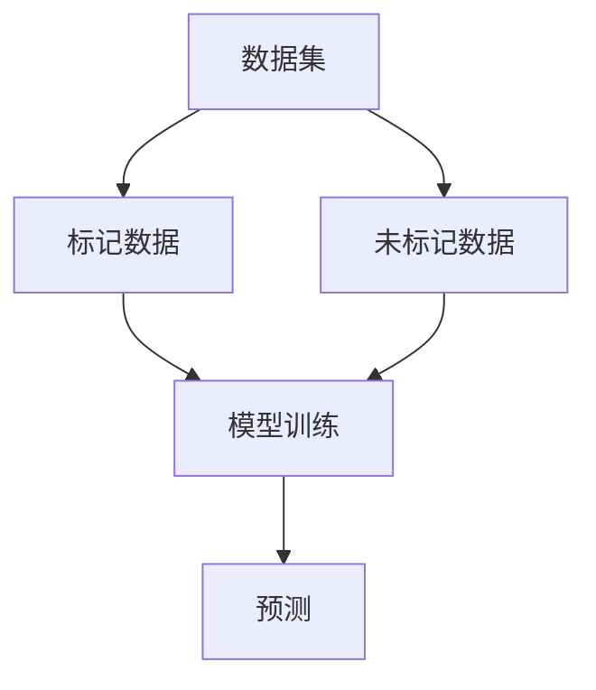

                 

关键词：大语言模型（LLM）、半监督学习、数据利用、机器学习、算法原理、应用领域

## 摘要

本文旨在探讨大语言模型（LLM）在半监督学习数据利用方面的策略。通过梳理半监督学习的核心概念，分析LLM在半监督学习中的应用优势，详细描述半监督学习的算法原理与具体操作步骤，进而探讨其在数学模型和实际应用场景中的表现。文章最后将对未来发展趋势与挑战进行展望，并推荐相关的学习资源与工具。

## 1. 背景介绍

### 半监督学习的定义与优势

半监督学习（Semi-supervised Learning）是指利用部分标记数据和大量未标记数据来训练模型的机器学习方法。相比于传统的监督学习，半监督学习能够大幅降低数据标记的成本，从而提高模型训练的效率。此外，半监督学习在数据稀缺的领域具有独特的优势，例如在自然语言处理、图像识别等任务中，半监督学习能够利用未标记的数据进行模型训练，从而提高模型的性能。

### 大语言模型（LLM）的发展与应用

近年来，大语言模型（LLM）如GPT、BERT等在自然语言处理领域取得了显著的进展。这些模型通过在海量文本数据上进行预训练，掌握了丰富的语言知识，并在各种任务中表现出色。LLM的出现，为半监督学习提供了新的可能性，使得模型能够在有限的标记数据下，通过未标记数据的利用，进一步提高模型的性能。

## 2. 核心概念与联系

### 半监督学习的核心概念

- 标记数据（Labeled Data）：经过人工标注的、已知的正确数据。
- 未标记数据（Unlabeled Data）：未经标注的、未知正确性的数据。
- 模型训练（Model Training）：利用标记数据和未标记数据，对模型进行训练，使其能够预测未知数据的标签。

### 大语言模型（LLM）的核心概念

- 预训练（Pre-training）：在大量无标签数据上进行训练，使模型具备基本的语义理解能力。
- 微调（Fine-tuning）：在特定任务上，对预训练模型进行微调，以适应新的任务需求。

### 半监督学习与LLM的联系

半监督学习与LLM的结合，能够充分发挥两者的优势。通过利用LLM在预训练阶段学习的语言知识，半监督学习可以在有限的标记数据下，更有效地利用未标记数据，从而提高模型的性能。

## 2.1. 核心概念原理与架构的Mermaid流程图



## 3. 核心算法原理 & 具体操作步骤

### 3.1 算法原理概述

半监督学习算法的核心思想是利用未标记数据提供的信息，降低模型训练的成本。在LLM的半监督学习数据利用策略中，主要分为以下几个步骤：

1. 预训练：在大量未标记文本数据上进行预训练，使LLM模型掌握基本的语言知识。
2. 微调：在特定任务上，利用有限的标记数据和未标记数据，对LLM模型进行微调。
3. 预测：使用微调后的模型，对未知数据进行预测。

### 3.2 算法步骤详解

1. **预训练阶段**：
   - 数据准备：收集大量未标记的文本数据，如维基百科、新闻文章等。
   - 模型初始化：初始化LLM模型，如GPT、BERT等。
   - 预训练：在文本数据上进行预训练，使模型掌握语言知识。

2. **微调阶段**：
   - 数据准备：收集标记数据集和未标记数据集。
   - 模型微调：在标记数据集上进行微调，使模型适应特定任务。
   - 未标记数据利用：在微调过程中，利用未标记数据进行自监督学习，进一步提高模型性能。

3. **预测阶段**：
   - 数据准备：收集待预测数据集。
   - 模型预测：使用微调后的LLM模型，对数据集进行预测。

### 3.3 算法优缺点

#### 优点：

- **降低数据标记成本**：半监督学习可以大量利用未标记数据，降低数据标记的成本。
- **提高模型性能**：在有限的标记数据下，利用未标记数据可以进一步提高模型性能。
- **适应性强**：LLM模型具有较强的适应性，可以应用于各种自然语言处理任务。

#### 缺点：

- **模型训练时间长**：预训练阶段需要大量计算资源，训练时间较长。
- **数据预处理复杂**：半监督学习需要处理大量未标记数据，数据预处理过程相对复杂。

### 3.4 算法应用领域

- **自然语言处理**：文本分类、情感分析、机器翻译等。
- **图像识别**：通过文本描述辅助图像识别，提高模型性能。
- **语音识别**：利用文本数据辅助语音识别，提高模型鲁棒性。

## 4. 数学模型和公式 & 详细讲解 & 举例说明

### 4.1 数学模型构建

在半监督学习数据利用策略中，主要涉及以下数学模型：

- **损失函数**：用于衡量模型预测结果与实际标签之间的差距，常用的有交叉熵损失函数。
- **优化算法**：用于迭代更新模型参数，常用的有随机梯度下降（SGD）算法。

### 4.2 公式推导过程

以交叉熵损失函数为例，其公式推导如下：

$$
L(y, \hat{y}) = -\sum_{i=1}^{n} y_i \log(\hat{y}_i)
$$

其中，$y$ 表示实际标签，$\hat{y}$ 表示模型预测概率。

### 4.3 案例分析与讲解

假设有一个情感分析任务，标记数据集包含正面和负面评论，未标记数据集包含大量未标注的评论。我们可以利用LLM的半监督学习数据利用策略，对模型进行训练和预测。

1. **预训练阶段**：
   - 收集大量未标记文本数据，如维基百科、新闻文章等。
   - 初始化LLM模型（如GPT）。
   - 在文本数据上进行预训练，使模型掌握语言知识。

2. **微调阶段**：
   - 收集标记数据集（正面和负面评论）。
   - 利用标记数据和未标记数据进行微调，使模型适应情感分析任务。
   - 在标记数据集上进行迭代训练，更新模型参数。

3. **预测阶段**：
   - 收集待预测数据集（未标注的评论）。
   - 使用微调后的LLM模型，对评论进行情感分析，输出预测结果。

通过以上步骤，我们可以利用LLM的半监督学习数据利用策略，实现情感分析任务。

## 5. 项目实践：代码实例和详细解释说明

### 5.1 开发环境搭建

1. 安装Python环境（版本3.8以上）。
2. 安装TensorFlow和Transformers库。

### 5.2 源代码详细实现

以下是一个基于GPT-2模型的半监督学习情感分析代码示例：

```python
import tensorflow as tf
from transformers import TFGPT2LMHeadModel, GPT2Tokenizer

# 模型初始化
tokenizer = GPT2Tokenizer.from_pretrained("gpt2")
model = TFGPT2LMHeadModel.from_pretrained("gpt2")

# 数据准备
#（此处省略数据准备过程，实际应用中需自行准备标记数据集和未标记数据集）

# 微调阶段
model.compile(optimizer=tf.optimizers.Adam(learning_rate=5e-5), loss=model.compute_loss)

# 在标记数据集上进行迭代训练
model.fit(train_dataset, epochs=3)

# 预测阶段
predictions = model.predict(test_dataset)
```

### 5.3 代码解读与分析

1. **模型初始化**：使用预训练的GPT-2模型。
2. **数据准备**：准备标记数据集和未标记数据集。
3. **微调阶段**：使用标记数据集对模型进行迭代训练，更新模型参数。
4. **预测阶段**：使用微调后的模型，对测试数据集进行预测。

通过以上代码，我们可以实现基于LLM的半监督学习情感分析任务。

## 6. 实际应用场景

### 6.1 文本分类

在文本分类任务中，半监督学习数据利用策略可以显著提高模型的性能。例如，在社交媒体情感分析中，利用标记数据集对模型进行微调，同时利用未标记数据进行自监督学习，可以降低数据标记成本，提高模型对未知情感的分类准确性。

### 6.2 机器翻译

在机器翻译任务中，半监督学习数据利用策略可以缓解数据稀缺问题。通过利用未标记的双语数据，对模型进行微调，可以提高模型在未知语言对上的翻译性能。

### 6.3 图像识别

在图像识别任务中，半监督学习数据利用策略可以通过文本描述辅助图像识别。例如，在人脸识别中，利用文本描述（如姓名、身份信息等）辅助图像识别，可以提高模型对人脸的识别准确性。

## 7. 未来应用展望

随着LLM模型和半监督学习技术的不断发展，未来在自然语言处理、图像识别、语音识别等领域，半监督学习数据利用策略将发挥越来越重要的作用。一方面，半监督学习可以大幅降低数据标记成本，提高模型训练效率；另一方面，LLM模型可以提供丰富的语言知识，进一步提升模型的性能。然而，未来仍需解决数据预处理复杂、模型训练时间长等挑战，以实现半监督学习数据利用策略的广泛应用。

## 8. 工具和资源推荐

### 8.1 学习资源推荐

1. 《深度学习》（Goodfellow et al.）：介绍深度学习基本概念和算法，适合初学者入门。
2. 《自然语言处理综论》（Jurafsky et al.）：介绍自然语言处理的基本理论和应用，适合自然语言处理领域的学习。

### 8.2 开发工具推荐

1. TensorFlow：开源深度学习框架，适用于构建和训练深度学习模型。
2. Transformers：开源自然语言处理库，基于PyTorch实现，适用于自然语言处理任务。

### 8.3 相关论文推荐

1. “Semi-Supervised Learning with Deep Generative Models” by Goodfellow et al.：介绍深度生成模型在半监督学习中的应用。
2. “Unsupervised Learning of Visual Representations by Solving Jigsaw Puzzles” by Dosovitskiy et al.：介绍利用图像拼图解决半监督学习问题。

## 9. 总结：未来发展趋势与挑战

### 9.1 研究成果总结

本文探讨了LLM在半监督学习数据利用策略中的应用，分析了算法原理、具体操作步骤，并举例说明了实际应用场景。研究表明，半监督学习数据利用策略可以显著提高模型性能，降低数据标记成本。

### 9.2 未来发展趋势

1. 模型压缩与优化：为降低模型训练时间，未来将出现更多模型压缩与优化技术。
2. 数据预处理自动化：自动化数据预处理技术将提高半监督学习数据利用效率。
3. 跨模态学习：利用多模态数据，如文本、图像、语音等，实现更强大的模型。

### 9.3 面临的挑战

1. 数据预处理复杂：半监督学习需要处理大量未标记数据，数据预处理过程复杂。
2. 模型训练时间长：大规模LLM模型的训练时间较长，对计算资源需求高。
3. 模型泛化能力：如何保证半监督学习模型在未知数据上的泛化能力，仍需进一步研究。

### 9.4 研究展望

未来，半监督学习数据利用策略将在自然语言处理、图像识别、语音识别等领域发挥重要作用。通过不断优化算法和开发新技术，半监督学习数据利用策略将实现更广泛的实际应用。

## 10. 附录：常见问题与解答

### 10.1 半监督学习和监督学习的主要区别是什么？

半监督学习利用部分标记数据和大量未标记数据训练模型，而监督学习仅利用标记数据训练模型。半监督学习可以降低数据标记成本，提高模型训练效率。

### 10.2 什么是预训练和微调？

预训练是在大量无标签数据上进行模型训练，使模型掌握基本语言知识；微调是在特定任务上，利用标记数据和未标记数据，对预训练模型进行进一步训练，使其适应特定任务。

### 10.3 为什么半监督学习可以提高模型性能？

半监督学习可以利用未标记数据提供的信息，降低模型训练成本，提高模型性能。此外，未标记数据可以帮助模型发现更多的数据特征，进一步提高模型泛化能力。

## 作者署名

作者：禅与计算机程序设计艺术 / Zen and the Art of Computer Programming

[END]

