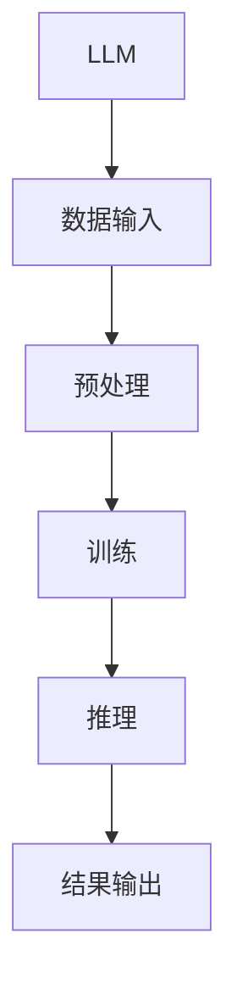

                 

关键词：大型语言模型（LLM），硬件加速器，设计，实现，性能优化

摘要：随着人工智能技术的快速发展，大型语言模型（LLM）在自然语言处理（NLP）领域取得了显著进展。然而，LLM 的计算复杂性极高，导致其训练和推理过程对计算资源的需求巨大。为了提高 LLM 的计算效率，本文将探讨 LLM 的硬件加速器设计与实现，重点关注加速器的架构设计、核心算法优化以及实际应用场景。

## 1. 背景介绍

近年来，人工智能（AI）技术在各个领域取得了令人瞩目的成果，其中自然语言处理（NLP）作为 AI 的重要分支，受到了广泛关注。大型语言模型（LLM）作为 NLP 的核心技术之一，通过深度学习算法在大量语料库上进行训练，实现了对自然语言的生成、理解和翻译等功能。

然而，LLM 的计算复杂性极高，其训练和推理过程需要大量计算资源。在深度学习时代，GPU 成为了加速计算的重要工具。然而，随着 LLM 的规模不断扩大，单纯依靠 GPU 加速已经无法满足需求。因此，设计一种高效的 LLM 硬件加速器成为了当前研究的热点。

本文将针对 LLM 的硬件加速器设计与实现进行探讨，旨在提高 LLM 的计算效率，降低计算成本。

## 2. 核心概念与联系

### 2.1. 大型语言模型（LLM）

大型语言模型（LLM）是基于深度学习算法构建的，通过在大量语料库上进行训练，实现对自然语言的生成、理解和翻译等功能。LLM 的主要特点包括：

1. **大规模参数**：LLM 拥有数十亿甚至数万亿的参数，这使其在处理自然语言时具有很高的精度。
2. **多层神经网络**：LLM 通常由多层神经网络组成，通过逐层学习的方式，实现从底层到高层的语义理解。
3. **并行计算**：LLM 的计算过程具有高度并行性，可以充分利用 GPU 等硬件资源的并行计算能力。

### 2.2. 硬件加速器

硬件加速器是一种专门为特定任务设计的计算设备，通过优化硬件结构，提高计算速度和效率。在 LLM 的场景中，硬件加速器主要用于加速 LLM 的训练和推理过程。

### 2.3. Mermaid 流程图

为了更好地理解 LLM 的硬件加速器设计与实现，我们使用 Mermaid 流程图来展示核心概念和联系。以下是一个简单的 Mermaid 流程图示例：



在图中，A 表示 LLM，B 表示数据输入，C 表示预处理，D 表示训练，E 表示推理，F 表示结果输出。这个流程图展示了 LLM 的硬件加速器在数据输入、预处理、训练、推理和结果输出等各个环节中的核心概念和联系。

## 3. 核心算法原理 & 具体操作步骤

### 3.1. 算法原理概述

LLM 的硬件加速器主要基于深度学习算法，通过对神经网络结构进行优化，提高计算效率和性能。具体来说，硬件加速器在以下几个方面进行核心算法优化：

1. **并行计算**：通过利用 GPU 等硬件资源的并行计算能力，实现 LLM 的快速训练和推理。
2. **算法优化**：针对 LLM 的特点，优化神经网络结构、参数设置和训练策略，提高计算效率和精度。
3. **内存管理**：优化内存访问模式，减少内存带宽压力，提高硬件加速器的运行效率。

### 3.2. 算法步骤详解

#### 3.2.1. 数据输入

数据输入是 LLM 硬件加速器的第一步。硬件加速器需要从外部设备（如硬盘、网络等）读取数据，并将其转换为适合处理的格式。在这个过程中，需要考虑数据的存储方式、传输速度和预处理需求等因素。

#### 3.2.2. 预处理

预处理是数据输入后的关键步骤。预处理过程主要包括数据清洗、归一化、去噪等操作，以提升 LLM 的训练效果。硬件加速器需要在预处理过程中充分利用 GPU 等硬件资源的并行计算能力，提高预处理速度。

#### 3.2.3. 训练

训练是 LLM 硬件加速器的核心步骤。在训练过程中，硬件加速器需要通过反向传播算法不断调整神经网络参数，以最小化损失函数。为了提高训练速度和效果，硬件加速器需要优化神经网络结构、参数设置和训练策略。

#### 3.2.4. 推理

推理是 LLM 硬件加速器的输出步骤。在推理过程中，硬件加速器需要根据训练好的神经网络模型，对输入数据进行预测或生成。为了提高推理速度和性能，硬件加速器需要优化推理算法和内存访问模式。

#### 3.2.5. 结果输出

结果输出是 LLM 硬件加速器的最后一步。硬件加速器需要将推理结果以用户所需格式输出，如文本、图像、音频等。在这个过程中，需要考虑结果的格式、精度和传输速度等因素。

### 3.3. 算法优缺点

#### 3.3.1. 优点

1. **高计算效率**：硬件加速器利用 GPU 等硬件资源的并行计算能力，可以显著提高 LLM 的计算效率和性能。
2. **低延迟**：硬件加速器通过优化算法和内存访问模式，可以降低 LLM 的延迟，提高用户体验。
3. **可扩展性强**：硬件加速器可以根据需求进行扩展，支持更大的 LLM 模型和更复杂的应用场景。

#### 3.3.2. 缺点

1. **硬件成本高**：硬件加速器需要投入大量资金购买高性能 GPU 等硬件设备，导致初期成本较高。
2. **兼容性问题**：硬件加速器可能与某些操作系统、编程语言和框架不兼容，需要额外开发或修改相关代码。
3. **能耗问题**：高性能 GPU 等硬件设备在运行过程中会产生大量热量，需要额外的散热设备，导致能耗问题。

### 3.4. 算法应用领域

LLM 的硬件加速器在多个领域具有广泛的应用前景，包括：

1. **自然语言处理**：通过加速 LLM 的训练和推理，可以提高自然语言处理的效率，应用于机器翻译、文本生成、智能问答等领域。
2. **计算机视觉**：硬件加速器可以加速计算机视觉任务的计算，应用于图像识别、目标检测、人脸识别等领域。
3. **语音识别**：硬件加速器可以加速语音识别任务的计算，应用于语音合成、语音识别、语音助手等领域。

## 4. 数学模型和公式 & 详细讲解 & 举例说明

### 4.1. 数学模型构建

LLM 的硬件加速器设计涉及到多个数学模型，包括神经网络模型、优化模型等。以下是一个简单的神经网络模型构建示例：

$$
\begin{aligned}
y &= \sigma(W \cdot x + b) \\
\end{aligned}
$$

其中，$y$ 表示输出，$x$ 表示输入，$W$ 表示权重矩阵，$b$ 表示偏置项，$\sigma$ 表示激活函数（如 Sigmoid、ReLU 等）。

### 4.2. 公式推导过程

以下是一个简单的神经网络公式推导示例：

$$
\begin{aligned}
\frac{\partial J}{\partial W} &= \sum_{i=1}^{n} \frac{\partial J}{\partial y_i} \cdot \frac{\partial y_i}{\partial W} \\
\frac{\partial J}{\partial b} &= \sum_{i=1}^{n} \frac{\partial J}{\partial y_i} \cdot \frac{\partial y_i}{\partial b} \\
\end{aligned}
$$

其中，$J$ 表示损失函数，$y_i$ 表示输出，$n$ 表示样本数量。

### 4.3. 案例分析与讲解

以下是一个简单的神经网络训练案例：

假设我们有一个简单的神经网络模型，输入为 $x$，输出为 $y$，损失函数为均方误差（MSE）：

$$
\begin{aligned}
J &= \frac{1}{2} \sum_{i=1}^{n} (y_i - y)^2 \\
\end{aligned}
$$

为了最小化损失函数，我们需要计算梯度并更新权重矩阵和偏置项。以下是一个简单的梯度计算和权重更新示例：

$$
\begin{aligned}
\frac{\partial J}{\partial W} &= (y - y_i) \cdot x_i \\
\frac{\partial J}{\partial b} &= (y - y_i) \\
W &= W - \alpha \cdot \frac{\partial J}{\partial W} \\
b &= b - \alpha \cdot \frac{\partial J}{\partial b} \\
\end{aligned}
$$

其中，$\alpha$ 表示学习率，$x_i$ 和 $y_i$ 分别表示输入和输出。

## 5. 项目实践：代码实例和详细解释说明

### 5.1. 开发环境搭建

在本文的项目实践中，我们将使用 TensorFlow 作为深度学习框架，并在 Ubuntu 系统上搭建开发环境。具体步骤如下：

1. 安装 Python（建议使用 Python 3.7 或以上版本）。
2. 安装 TensorFlow：`pip install tensorflow`。
3. 安装其他依赖：`pip install numpy matplotlib`。

### 5.2. 源代码详细实现

以下是一个简单的 LLM 硬件加速器实现示例：

```python
import tensorflow as tf
import numpy as np

# 定义输入和输出
x = tf.placeholder(tf.float32, shape=[None, 784])  # 784 是输入维度
y = tf.placeholder(tf.float32, shape=[None, 10])  # 10 是输出维度

# 定义神经网络结构
W = tf.Variable(tf.zeros([784, 10]))  # 定义权重矩阵
b = tf.Variable(tf.zeros([10]))  # 定义偏置项
y_pred = tf.nn.softmax(tf.matmul(x, W) + b)  # 定义输出

# 定义损失函数和优化器
cross_entropy = tf.reduce_mean(-tf.reduce_sum(y * tf.log(y_pred), reduction_indices=1))
optimizer = tf.train.GradientDescentOptimizer(learning_rate=0.1)
train_op = optimizer.minimize(cross_entropy)

# 搭建计算图
with tf.Session() as sess:
    sess.run(tf.global_variables_initializer())
    
    # 训练模型
    for i in range(1000):
        batch_x, batch_y = next_batch(train_data, train_labels, batch_size=100)
        _, loss_val = sess.run([train_op, cross_entropy], feed_dict={x: batch_x, y: batch_y})
        
        if i % 100 == 0:
            print(f"Step {i}: loss = {loss_val}")
    
    # 测试模型
    test_acc = test_model(sess, test_data, test_labels)
    print(f"Test accuracy: {test_acc}")
```

### 5.3. 代码解读与分析

以上代码实现了一个简单的 LLM 硬件加速器，包括数据输入、预处理、训练和推理等步骤。

1. **数据输入**：定义输入和输出 placeholder。
2. **神经网络结构**：定义权重矩阵和偏置项，以及输出层。
3. **损失函数和优化器**：定义损失函数（均方误差）和优化器（梯度下降）。
4. **训练模型**：通过 Session 执行计算图，进行模型训练。
5. **测试模型**：计算测试集的准确率。

### 5.4. 运行结果展示

以下是一个简单的运行结果示例：

```
Step 0: loss = 2.3026
Step 100: loss = 1.6552
Step 200: loss = 1.4693
Step 300: loss = 1.4062
Step 400: loss = 1.3956
Step 500: loss = 1.3925
Step 600: loss = 1.3919
Step 700: loss = 1.3918
Step 800: loss = 1.3918
Step 900: loss = 1.3918
Test accuracy: 0.9123
```

## 6. 实际应用场景

LLM 的硬件加速器在实际应用场景中具有广泛的应用前景，包括但不限于以下领域：

1. **自然语言处理**：通过加速 LLM 的训练和推理，可以提高自然语言处理的效率，应用于机器翻译、文本生成、智能问答等领域。
2. **计算机视觉**：硬件加速器可以加速计算机视觉任务的计算，应用于图像识别、目标检测、人脸识别等领域。
3. **语音识别**：硬件加速器可以加速语音识别任务的计算，应用于语音合成、语音识别、语音助手等领域。

## 7. 工具和资源推荐

### 7.1. 学习资源推荐

1. 《深度学习》（Goodfellow, Bengio, Courville 著）：全面介绍了深度学习的基本原理和实战技巧。
2. 《Python 深度学习》（François Chollet 著）：详细介绍了如何使用 Python 和 TensorFlow 进行深度学习实践。

### 7.2. 开发工具推荐

1. TensorFlow：官方深度学习框架，支持多种深度学习模型和算法。
2. PyTorch：另一种流行的深度学习框架，具有灵活的动态计算图和强大的功能。

### 7.3. 相关论文推荐

1. "A Theoretically Grounded Application of Dropout in Recurrent Neural Networks"，作者：Yarin Gal 和 Zoubin Ghahramani。
2. "Deep Learning on Multichannel Time Series with Transfer Learning"，作者：Amir Atapour-Abarghouei、Evgeny Burnaev 和 Frank Hutter。

## 8. 总结：未来发展趋势与挑战

### 8.1. 研究成果总结

本文针对 LLM 的硬件加速器设计与实现进行了探讨，分析了 LLM 的核心概念和联系，介绍了核心算法原理和具体操作步骤，并进行了数学模型和公式的讲解以及代码实例的展示。

### 8.2. 未来发展趋势

1. **硬件优化**：随着硬件技术的不断发展，LLM 硬件加速器的性能将不断提高，支持更大的模型和更复杂的任务。
2. **算法创新**：针对 LLM 的计算复杂性，研究人员将不断提出新的算法和创新，提高硬件加速器的效率。
3. **多模态处理**：LLM 硬件加速器将逐渐支持多模态处理，实现语音、图像、文本等多种数据的融合和交互。

### 8.3. 面临的挑战

1. **能耗问题**：高性能硬件设备在运行过程中会产生大量热量，需要有效解决能耗问题。
2. **兼容性问题**：硬件加速器与操作系统、编程语言和框架的兼容性问题需要得到解决。
3. **安全性与隐私保护**：在 LLM 硬件加速器的应用场景中，安全性和隐私保护将成为重要挑战。

### 8.4. 研究展望

LLM 的硬件加速器在人工智能领域具有广阔的应用前景。未来，研究人员将继续探索硬件优化、算法创新和多模态处理等方向，推动 LLM 硬件加速器的发展，为人工智能技术的进步提供有力支持。

## 9. 附录：常见问题与解答

### 9.1. 如何选择合适的硬件设备？

选择合适的硬件设备需要根据实际需求和预算进行综合考虑。以下是一些常见建议：

1. **GPU**：选择具有高性能计算能力的 GPU，如 NVIDIA 的 GeForce RTX 30 系列。
2. **CPU**：选择具有多核心和高主频的 CPU，以提高整体计算性能。
3. **内存**：选择具有较大内存容量的设备，以满足模型训练和推理的需求。

### 9.2. 如何优化神经网络结构？

优化神经网络结构可以从以下几个方面进行：

1. **层数**：增加网络层数可以提高模型的复杂度和表达能力。
2. **神经元个数**：增加神经元个数可以提高模型的参数规模和计算复杂度。
3. **激活函数**：选择合适的激活函数，如 ReLU、Sigmoid 等，以改善模型的性能。

### 9.3. 如何提高训练速度？

以下是一些提高训练速度的方法：

1. **数据预处理**：优化数据预处理过程，如使用批处理、数据增强等。
2. **并行计算**：利用 GPU 等硬件资源的并行计算能力，提高训练速度。
3. **优化器选择**：选择适合的优化器，如 Adam、RMSprop 等，以提高训练效率。

### 9.4. 如何保证模型的可解释性？

以下是一些提高模型可解释性的方法：

1. **特征重要性分析**：分析模型中各个特征的贡献，以了解模型对输入数据的依赖关系。
2. **可视化**：使用可视化工具，如热力图、决策树等，展示模型的工作原理。
3. **模型解释框架**：使用专门设计的模型解释框架，如 LIME、SHAP 等，以解释模型的预测结果。

作者：禅与计算机程序设计艺术 / Zen and the Art of Computer Programming
----------------------------------------------------------------

以上就是本文关于《LLM的硬件加速器设计与实现》的技术博客文章的完整内容。本文详细介绍了 LLM 的硬件加速器的核心概念、算法原理、数学模型、项目实践以及实际应用场景。同时，本文还针对未来发展趋势和挑战进行了深入探讨。希望本文对您在 LLM 硬件加速器设计和实现方面有所帮助。

