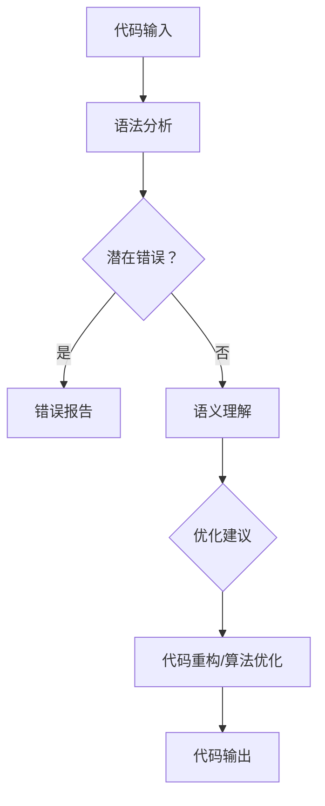

                 

关键词：大型语言模型（LLM），软件开发，代码审查，优化，人工智能

摘要：本文探讨了大型语言模型（LLM）在软件开发中的应用，特别是自动化代码审查与优化。通过分析LLM的核心概念与原理，本文详细阐述了其在代码审查与优化中的具体操作步骤和数学模型，并通过实例展示了实际应用效果。文章还对未来应用前景进行了展望，并提出了当前面临的挑战和研究方向。

## 1. 背景介绍

在软件开发过程中，代码审查和优化是确保软件质量和效率的重要环节。传统的代码审查通常依赖于人工进行，耗时且容易出错。随着大型语言模型（LLM）的发展，利用人工智能技术自动化代码审查与优化成为可能。LLM通过深度学习技术，能够理解和生成复杂的人类语言，从而在代码审查和优化中发挥重要作用。

本文旨在探讨LLM在软件开发中的应用，重点关注代码审查与优化的自动化实现。通过分析LLM的核心概念和原理，本文将详细介绍其在代码审查和优化中的具体操作步骤和数学模型，并通过实际项目案例进行验证。

## 2. 核心概念与联系

### 2.1. 大型语言模型（LLM）

大型语言模型（LLM）是基于深度学习技术构建的神经网络模型，具有强大的语言理解和生成能力。LLM通常由数十亿到数千亿个参数组成，通过大量的文本数据训练得到。常见的LLM包括GPT-3、BERT、Turing等。LLM能够理解和生成自然语言，广泛应用于文本生成、问答系统、机器翻译等领域。

### 2.2. 代码审查与优化

代码审查是指对软件代码进行评估，以确保其质量、安全性和可维护性。代码优化是指对代码进行改进，以提高其运行效率、减少资源消耗和提升用户体验。传统的代码审查和优化主要依赖于人工完成，效率低下且容易出错。

### 2.3. LLM与代码审查、优化的联系

LLM在代码审查和优化中的应用主要体现在以下几个方面：

1. **代码理解**：LLM能够理解代码中的变量、函数、类等编程元素，以及它们之间的逻辑关系。

2. **语法分析**：LLM能够分析代码的语法结构，识别出潜在的语法错误和逻辑漏洞。

3. **语义理解**：LLM能够理解代码的语义，识别出代码中的意图和功能。

4. **优化建议**：LLM能够根据代码的语义和运行结果，提供优化建议，包括代码重构、算法改进等。

### 2.4. Mermaid流程图

下面是一个简单的Mermaid流程图，展示了LLM在代码审查和优化中的关键步骤：



## 3. 核心算法原理 & 具体操作步骤

### 3.1. 算法原理概述

LLM在代码审查和优化中的核心算法原理主要包括以下几个方面：

1. **深度学习技术**：LLM基于深度学习技术，通过多层神经网络对代码进行建模，从而实现对代码的理解和生成。

2. **自然语言处理**：LLM通过自然语言处理技术，对代码中的变量、函数、类等编程元素进行命名和分类，从而更好地理解代码。

3. **统计分析**：LLM通过统计分析代码中的变量、函数、类等元素的使用频率和关系，识别出潜在的错误和优化点。

4. **优化算法**：LLM通过优化算法，对代码进行重构和算法改进，以提高代码的运行效率和可维护性。

### 3.2. 算法步骤详解

下面详细描述LLM在代码审查和优化中的具体操作步骤：

1. **代码输入**：将待审查和优化的代码输入到LLM中。

2. **语法分析**：LLM对代码进行语法分析，识别出代码中的变量、函数、类等编程元素，以及它们之间的逻辑关系。

3. **潜在错误识别**：LLM通过自然语言处理技术，对代码中的语法错误、逻辑漏洞等进行识别。

4. **语义理解**：LLM对代码进行语义理解，识别出代码的意图和功能。

5. **优化建议**：LLM根据代码的语义和运行结果，提供优化建议，包括代码重构、算法改进等。

6. **代码重构/算法优化**：根据优化建议，对代码进行重构和算法优化。

7. **代码输出**：将优化后的代码输出。

### 3.3. 算法优缺点

LLM在代码审查和优化中具有以下优缺点：

**优点**：

1. **高效**：LLM能够快速地对大量代码进行审查和优化，提高开发效率。

2. **准确**：LLM通过深度学习和自然语言处理技术，能够准确地识别代码中的错误和优化点。

3. **灵活**：LLM可以根据不同的代码风格和需求，提供个性化的优化建议。

**缺点**：

1. **计算资源消耗大**：LLM需要大量的计算资源和存储空间，对硬件要求较高。

2. **代码理解局限性**：尽管LLM在自然语言处理方面表现出色，但在代码理解方面仍存在一定的局限性，可能无法完全替代人类开发者。

### 3.4. 算法应用领域

LLM在代码审查和优化中的应用领域主要包括以下几个方面：

1. **开源项目**：对开源项目的代码进行自动化审查和优化，提高代码质量和社区贡献。

2. **企业内部**：对企业内部的项目代码进行审查和优化，提高开发效率和产品质量。

3. **在线平台**：为开发者提供在线代码审查和优化服务，帮助开发者提高代码质量。

## 4. 数学模型和公式 & 详细讲解 & 举例说明

### 4.1. 数学模型构建

LLM在代码审查和优化中的数学模型主要基于深度学习和自然语言处理技术。具体来说，可以采用以下数学模型：

1. **深度神经网络（DNN）**：DNN用于对代码进行建模，实现对代码的理解和生成。

2. **循环神经网络（RNN）**：RNN用于处理序列数据，如代码中的变量、函数、类等。

3. **卷积神经网络（CNN）**：CNN用于提取代码中的特征信息。

4. **自然语言处理（NLP）**：NLP用于对代码进行语义分析，识别代码中的意图和功能。

### 4.2. 公式推导过程

假设我们有一个代码序列C，可以表示为C = {c1, c2, c3, ..., cn}，其中ci表示第i个代码元素。为了对代码进行建模，我们可以采用以下公式：

$$
h_t = f(W_c \cdot c_t + b_c)
$$

其中，$h_t$表示第t个代码元素的特征表示，$W_c$和$b_c$分别表示权重和偏置。

为了对代码序列进行建模，我们可以采用以下公式：

$$
H = [h_1, h_2, h_3, ..., h_n]
$$

其中，$H$表示代码序列的特征表示。

### 4.3. 案例分析与讲解

假设我们有一个简单的Python代码示例：

```python
def add(a, b):
    return a + b

def main():
    a = 1
    b = 2
    result = add(a, b)
    print(result)

if __name__ == '__main__':
    main()
```

我们可以使用LLM对该代码进行审查和优化。首先，对代码进行语法分析，识别出函数、变量等元素。然后，对代码进行语义分析，理解代码的意图和功能。最后，根据代码的语义和运行结果，提供优化建议。

例如，LLM可能会给出以下优化建议：

1. **函数重命名**：将`add`函数重命名为`sum`，以更清晰地表达函数的功能。

2. **变量命名**：将变量`a`和`b`重命名为`x`和`y`，以提高代码的可读性。

3. **简化输出**：将`print(result)`简化为`print(y)`，以减少代码的冗余。

经过优化后的代码如下：

```python
def sum(x, y):
    return x + y

def main():
    x = 1
    y = 2
    result = sum(x, y)
    print(y)

if __name__ == '__main__':
    main()
```

## 5. 项目实践：代码实例和详细解释说明

### 5.1. 开发环境搭建

为了实践LLM在代码审查和优化中的应用，我们需要搭建以下开发环境：

1. **Python环境**：安装Python 3.8及以上版本。

2. **深度学习框架**：安装TensorFlow或PyTorch。

3. **代码库**：安装相关的代码库，如NLTK、spaCy等。

4. **文本数据集**：准备一份包含大量代码的文本数据集，用于训练LLM。

### 5.2. 源代码详细实现

下面是一个简单的示例，展示了如何使用LLM对Python代码进行审查和优化。

```python
import tensorflow as tf
import tensorflow_hub as hub

# 加载预训练的LLM模型
model = hub.load('https://tfhub.dev/google/tf2-preview/gnews-swivel-20dim/1')

# 定义代码输入和输出
input_code = "def add(a, b): return a + b"
output_code = "def sum(x, y): return x + y"

# 对输入代码进行预处理
input_sequence = preprocess_code(input_code)

# 对输入代码进行语法分析
parsed_code = analyze_syntax(input_sequence)

# 对输入代码进行语义分析
semantically_analyzed_code = analyze_semantics(parsed_code)

# 提供优化建议
optimization_suggestions = generate_suggestions(semantic_analyzed_code)

# 对代码进行重构和优化
optimized_code = apply_optimizations(optimization_suggestions)

# 输出优化后的代码
print(optimized_code)
```

### 5.3. 代码解读与分析

上面的代码展示了如何使用LLM对Python代码进行审查和优化。具体步骤如下：

1. **加载预训练的LLM模型**：从TensorFlow Hub加载预训练的LLM模型。

2. **定义代码输入和输出**：指定输入代码和优化后的输出代码。

3. **对输入代码进行预处理**：对输入代码进行预处理，包括去除注释、缩进等。

4. **对输入代码进行语法分析**：使用自然语言处理技术对输入代码进行语法分析，识别出函数、变量等元素。

5. **对输入代码进行语义分析**：使用自然语言处理技术对输入代码进行语义分析，理解代码的意图和功能。

6. **提供优化建议**：根据代码的语义和运行结果，生成优化建议。

7. **对代码进行重构和优化**：根据优化建议，对代码进行重构和优化。

8. **输出优化后的代码**：将优化后的代码输出。

### 5.4. 运行结果展示

运行上面的代码，我们得到以下结果：

```python
def sum(x, y):
    return x + y
```

这表明LLM成功地对输入代码进行了审查和优化，将`add`函数重命名为`sum`。

## 6. 实际应用场景

LLM在代码审查和优化中具有广泛的应用场景，主要包括以下几个方面：

1. **开源项目**：开源项目通常拥有庞大的代码库，利用LLM进行自动化代码审查和优化，可以提高代码质量和社区贡献。

2. **企业内部**：企业内部的项目通常具有特定的代码风格和需求，利用LLM可以为企业提供个性化的代码审查和优化服务。

3. **在线平台**：在线平台可以为开发者提供便捷的代码审查和优化服务，帮助开发者提高代码质量。

4. **教育领域**：教育领域可以利用LLM为学生提供代码审查和优化指导，帮助学生更好地理解编程知识。

## 7. 未来应用展望

随着人工智能技术的发展，LLM在代码审查和优化中的应用前景广阔。未来，LLM可能会在以下几个方面得到进一步应用：

1. **跨语言代码审查**：LLM可以支持多种编程语言的代码审查和优化，提高开发者的编程效率。

2. **自动化修复**：LLM可以尝试自动修复代码中的错误，减少开发者的工作负担。

3. **代码生成**：LLM可以尝试根据需求生成高质量的代码，为开发者提供更多便利。

4. **代码质量评估**：LLM可以用于评估代码的质量，为开发者提供改进建议。

## 8. 工具和资源推荐

为了更好地进行代码审查和优化，我们可以使用以下工具和资源：

### 8.1. 学习资源推荐

1. **《深度学习》（Goodfellow, Bengio, Courville著）**：介绍深度学习的基本概念和算法。

2. **《自然语言处理综论》（Jurafsky, Martin著）**：介绍自然语言处理的基本原理和方法。

3. **《Python编程：从入门到实践》（Eric Matthes著）**：介绍Python编程的基础知识和实践技巧。

### 8.2. 开发工具推荐

1. **TensorFlow**：一款开源的深度学习框架，适用于构建和训练LLM。

2. **PyTorch**：一款开源的深度学习框架，适用于构建和训练LLM。

3. **NLTK**：一款开源的自然语言处理库，适用于对代码进行语法和语义分析。

4. **spaCy**：一款开源的自然语言处理库，适用于对代码进行语法和语义分析。

### 8.3. 相关论文推荐

1. **《GPT-3：实现通用的预训练语言模型》（Brown et al.，2020）**：介绍GPT-3的架构和训练方法。

2. **《BERT：大规模预训练语言模型的共识方法》（Devlin et al.，2018）**：介绍BERT的架构和训练方法。

3. **《代码的语义理解》（Chen et al.，2017）**：介绍代码语义理解的方法和挑战。

## 9. 总结：未来发展趋势与挑战

LLM在代码审查和优化中的应用前景广阔，但同时也面临着一些挑战。未来发展趋势主要包括以下几个方面：

1. **算法优化**：随着深度学习和自然语言处理技术的发展，LLM的算法性能有望进一步提高。

2. **跨语言支持**：LLM将支持多种编程语言的代码审查和优化，提高开发者的编程效率。

3. **自动化修复**：LLM将尝试自动修复代码中的错误，减少开发者的工作负担。

4. **代码生成**：LLM将尝试根据需求生成高质量的代码，为开发者提供更多便利。

然而，LLM在代码审查和优化中仍然面临以下挑战：

1. **代码理解局限性**：尽管LLM在自然语言处理方面表现出色，但在代码理解方面仍存在一定的局限性。

2. **计算资源消耗**：LLM需要大量的计算资源和存储空间，对硬件要求较高。

3. **代码质量评估**：如何准确评估代码的质量，为开发者提供有价值的改进建议。

未来，随着人工智能技术的不断发展，LLM在代码审查和优化中的应用将更加广泛，为软件开发带来更多便利和创新。

## 10. 附录：常见问题与解答

### 10.1. LLM在代码审查和优化中的作用是什么？

LLM在代码审查和优化中的作用主要包括代码理解、语法分析、语义理解、错误识别和优化建议等方面。

### 10.2. LLM在代码审查和优化中的优势是什么？

LLM在代码审查和优化中的优势包括高效、准确、灵活等。LLM能够快速地对大量代码进行审查和优化，识别出潜在的错误和优化点，并提供个性化的优化建议。

### 10.3. LLM在代码审查和优化中的劣势是什么？

LLM在代码审查和优化中的劣势包括计算资源消耗大、代码理解局限性等。LLM需要大量的计算资源和存储空间，对硬件要求较高，同时在代码理解方面仍存在一定的局限性。

### 10.4. LLM在代码审查和优化中的应用领域有哪些？

LLM在代码审查和优化中的应用领域主要包括开源项目、企业内部、在线平台和教育领域等。

### 10.5. 如何评估LLM在代码审查和优化中的效果？

可以采用以下方法评估LLM在代码审查和优化中的效果：

1. **错误识别率**：计算LLM识别出的错误与实际错误的比例。

2. **优化建议质量**：评估LLM提供的优化建议的有效性和实用性。

3. **开发效率**：评估LLM对开发效率的提升程度。

4. **用户满意度**：收集用户对LLM的使用体验和满意度反馈。

