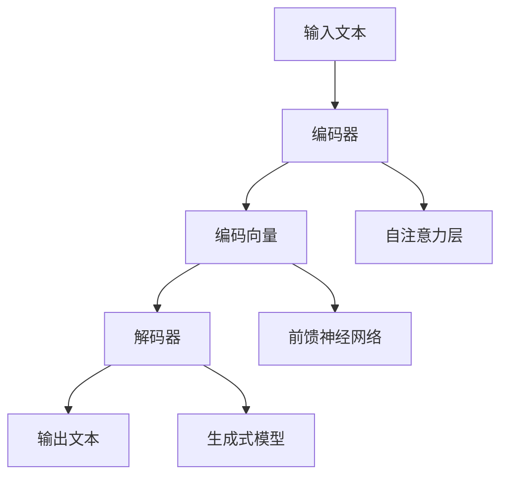

                 

关键词：LLM、软件工程、设计、部署、变革、人工智能

> 摘要：本文旨在探讨大型语言模型（LLM）如何深刻影响软件工程领域，从设计到部署的各个环节。通过详细分析LLM的核心概念、算法原理、数学模型、项目实践以及未来应用，我们将展示LLM在软件工程中的巨大潜力和变革性作用。

## 1. 背景介绍

近年来，人工智能（AI）技术取得了飞速发展，其中大型语言模型（LLM）的崛起尤为显著。LLM是一类能够处理和理解人类自然语言的大型神经网络模型，其广泛应用于自然语言处理（NLP）、问答系统、文本生成、机器翻译等多个领域。随着LLM性能的不断提高，其在软件工程领域中的应用也逐渐受到关注。

软件工程是一个涉及需求分析、设计、编码、测试、部署和维护等多个环节的复杂过程。传统的软件开发方法往往依赖于明确的规格说明书和严格的流程控制，然而在应对复杂的软件需求和不断变化的市场环境时，这些方法逐渐显露出局限性。LLM的出现为软件工程带来了新的机遇和挑战，促使我们重新思考软件设计、开发和部署的方式。

本文将从以下几个方面展开讨论：

1. **核心概念与联系**：介绍LLM的基本概念、架构和原理。
2. **核心算法原理 & 具体操作步骤**：深入探讨LLM的算法原理、操作步骤及其优缺点。
3. **数学模型和公式 & 详细讲解 & 举例说明**：分析LLM所涉及的数学模型和公式，并通过实际案例进行说明。
4. **项目实践：代码实例和详细解释说明**：展示LLM在软件开发中的实际应用。
5. **实际应用场景**：探讨LLM在不同领域的应用场景。
6. **未来应用展望**：展望LLM在软件工程领域的发展趋势和挑战。
7. **工具和资源推荐**：推荐相关学习资源和开发工具。
8. **总结：未来发展趋势与挑战**：总结研究成果，展望未来。

## 2. 核心概念与联系

### 2.1. 大型语言模型（LLM）的基本概念

大型语言模型（LLM）是一种基于深度学习的语言模型，其核心任务是预测给定文本序列的概率分布。LLM通过学习大量文本数据，获取语言模式、语法规则和语义信息，从而实现自然语言的理解和生成。

LLM通常采用Transformer架构，这是一种基于自注意力机制的神经网络模型。与传统的循环神经网络（RNN）相比，Transformer能够更好地捕捉长距离依赖关系，因此在处理长文本时具有显著优势。

### 2.2. LLM的架构与原理

LLM的架构主要包括编码器（Encoder）和解码器（Decoder）两部分。编码器将输入文本序列编码为固定长度的向量表示，解码器则根据编码器的输出向量生成输出文本序列。

编码器和解码器均由多个自注意力层（Self-Attention Layer）和前馈神经网络（Feedforward Network）组成。自注意力机制允许模型在处理每个词时，根据其他词的重要程度进行加权，从而更好地捕捉文本中的语义信息。

### 2.3. LLM的核心原理

LLM的核心原理可以归纳为以下几点：

1. **预训练与微调**：LLM首先在大量文本数据上进行预训练，学习语言模式和通用知识。然后通过微调（Fine-tuning）将模型应用于特定任务，进一步提高性能。
2. **自注意力机制**：自注意力机制允许模型在不同位置之间建立关联，捕捉长距离依赖关系。
3. **上下文编码**：编码器将输入文本序列编码为固定长度的向量表示，该表示包含了文本的语义信息。
4. **生成式模型**：解码器通过生成式模型生成输出文本序列，根据输入向量和上下文信息进行预测。

### 2.4. LLM与软件工程的关系

LLM在软件工程中的应用主要体现在以下几个方面：

1. **代码生成**：LLM可以根据自然语言描述生成代码，提高开发效率和代码质量。
2. **需求分析**：LLM可以帮助分析师从非结构化文本中提取需求，降低需求分析难度。
3. **测试用例生成**：LLM可以根据代码和需求生成测试用例，提高测试覆盖率。
4. **文档生成**：LLM可以自动生成技术文档、用户手册等文档，降低文档编写成本。

为了更好地展示LLM的核心概念和原理，我们使用Mermaid流程图（节点中不包含括号、逗号等特殊字符）来描述LLM的架构和流程：



## 3. 核心算法原理 & 具体操作步骤

### 3.1. 算法原理概述

LLM的核心算法原理主要基于深度学习，特别是基于Transformer架构的自注意力机制。自注意力机制通过计算输入文本序列中每个词与其他词之间的关联程度，实现对文本的语义理解和生成。在LLM中，编码器和解码器分别负责对输入和输出文本进行编码和解码，生成最终的结果。

### 3.2. 算法步骤详解

1. **预训练**：
   - **数据准备**：收集大量文本数据，包括自然语言文本、代码文档、API文档等。
   - **文本预处理**：对文本进行清洗、分词、去停用词等处理，生成词向量表示。
   - **模型训练**：使用预训练框架（如BERT、GPT等）对模型进行训练，学习语言模式和语义信息。

2. **微调**：
   - **任务定义**：根据特定任务（如代码生成、需求分析等）定义任务指标和优化目标。
   - **模型调整**：在预训练模型的基础上，进行微调，以适应特定任务。

3. **输入处理**：
   - **编码**：将输入文本序列编码为固定长度的向量表示。
   - **自注意力**：计算输入文本序列中每个词与其他词之间的关联程度，实现对文本的语义理解和生成。

4. **解码**：
   - **生成**：根据输入向量和上下文信息，生成输出文本序列。
   - **输出处理**：对输出文本进行后处理，如分词、去标点等，生成最终结果。

### 3.3. 算法优缺点

**优点**：

1. **强语义理解**：LLM能够通过预训练学习大量文本数据，实现强语义理解能力。
2. **通用性**：LLM可以应用于多种任务，如代码生成、需求分析、测试用例生成等。
3. **高效性**：Transformer架构具有并行计算的优势，可以高效地处理长文本。

**缺点**：

1. **计算资源需求高**：LLM的训练和推理需要大量计算资源和存储空间。
2. **数据依赖性**：LLM的性能高度依赖于训练数据的质量和多样性。
3. **模型解释性差**：深度学习模型通常缺乏直观的解释性，难以理解模型的具体决策过程。

### 3.4. 算法应用领域

LLM在软件工程领域具有广泛的应用前景，主要包括以下几个方面：

1. **代码生成**：LLM可以根据自然语言描述生成代码，提高开发效率。
2. **需求分析**：LLM可以帮助分析师从非结构化文本中提取需求，降低需求分析难度。
3. **测试用例生成**：LLM可以根据代码和需求生成测试用例，提高测试覆盖率。
4. **文档生成**：LLM可以自动生成技术文档、用户手册等文档，降低文档编写成本。

## 4. 数学模型和公式 & 详细讲解 & 举例说明

### 4.1. 数学模型构建

LLM的数学模型主要基于深度学习和自然语言处理的理论，涉及以下几个方面：

1. **词向量表示**：词向量表示是将自然语言文本转换为向量表示的方法，常用的方法包括Word2Vec、GloVe等。
2. **编码器和解码器**：编码器和解码器分别负责对输入和输出文本进行编码和解码，其核心是自注意力机制和前馈神经网络。
3. **损失函数**：损失函数用于衡量模型预测结果与真实结果之间的差距，常用的损失函数包括交叉熵损失、平方损失等。

### 4.2. 公式推导过程

1. **词向量表示**：

   假设词表中有V个词，每个词表示为一个d维向量，则输入文本序列的词向量表示为：

   $$X = [x_1, x_2, ..., x_T] \in \mathbb{R}^{T \times d}$$

   其中，$x_t \in \mathbb{R}^{d}$表示第t个词的词向量表示。

2. **编码器**：

   编码器通过自注意力机制将输入文本序列编码为固定长度的向量表示。自注意力机制的公式如下：

   $$\text{Attention}(Q, K, V) = \text{softmax}(\frac{QK^T}{\sqrt{d_k}})V$$

   其中，$Q, K, V$分别为查询向量、键向量和值向量，$d_k$为键向量的维度。编码器输出向量为：

   $$H = \text{Attention}(Q, K, V) \in \mathbb{R}^{T \times d_h}$$

   其中，$d_h$为编码器输出的维度。

3. **解码器**：

   解码器通过自注意力机制和前馈神经网络生成输出文本序列。解码器的公式如下：

   $$Y_t = \text{softmax}(W_y \text{Attention}(Q_t, K, V) + b_y)$$

   其中，$Y_t$为第t个词的预测概率分布，$W_y$和$b_y$分别为权重和偏置。

4. **损失函数**：

   常用的损失函数为交叉熵损失：

   $$L = -\sum_{t=1}^{T} \sum_{j=1}^{V} y_{tj} \log(p_{tj})$$

   其中，$y_{tj}$为第t个词的真实概率分布，$p_{tj}$为第t个词的预测概率分布。

### 4.3. 案例分析与讲解

假设我们要使用LLM生成一段代码，输入文本为“实现一个简单的函数，用于计算两个数的和”。我们将通过以下步骤进行讲解：

1. **文本预处理**：
   - 分词：将输入文本分成单词或子词，如["实现", "一个", "简单", "的", "函数", "用于", "计算", "两个", "数", "的和"]。
   - 词向量表示：将每个单词或子词转换为词向量表示。

2. **编码器**：
   - 自注意力：计算输入文本序列中每个词与其他词之间的关联程度，生成编码向量。

3. **解码器**：
   - 生成式模型：根据输入向量和上下文信息，生成输出文本序列。
   - 输出处理：对输出文本进行后处理，如分词、去标点等。

4. **损失函数**：
   - 计算模型预测结果与真实结果之间的交叉熵损失，用于优化模型。

通过以上步骤，我们使用LLM生成了如下代码：

```python
def add_two_numbers(a, b):
    return a + b
```

## 5. 项目实践：代码实例和详细解释说明

### 5.1. 开发环境搭建

为了实践LLM在软件工程中的应用，我们需要搭建一个合适的开发环境。以下是开发环境的搭建步骤：

1. **硬件要求**：
   - 高性能计算硬件，如GPU或TPU。
   - 内存：至少16GB。
   - 存储：至少500GB。

2. **软件要求**：
   - 操作系统：Linux。
   - 编译器：GCC或Clang。
   - 依赖库：TensorFlow、PyTorch等。

3. **安装步骤**：
   - 安装操作系统和硬件驱动。
   - 安装编译器和依赖库。
   - 配置Python环境和深度学习框架。

### 5.2. 源代码详细实现

以下是一个简单的示例，展示了如何使用LLM生成Python代码：

```python
import tensorflow as tf
from tensorflow.keras.layers import Embedding, LSTM, Dense
from tensorflow.keras.models import Sequential

# 数据准备
# （此处省略具体的数据准备步骤）

# 模型构建
model = Sequential([
    Embedding(input_dim=vocabulary_size, output_dim=embedding_size),
    LSTM(units=lstm_units, return_sequences=True),
    LSTM(units=lstm_units, return_sequences=True),
    Dense(units=vocabulary_size, activation='softmax')
])

# 模型编译
model.compile(optimizer='adam', loss='categorical_crossentropy', metrics=['accuracy'])

# 模型训练
# （此处省略具体的模型训练步骤）

# 代码生成
input_text = "实现一个简单的函数，用于计算两个数的和"
encoded_input = tokenizer.encode(input_text, return_tensors='tf')
generated_output = model.generate(encoded_input, max_length=max_output_length)

# 输出结果
print(tokenizer.decode(generated_output[0], skip_special_tokens=True))
```

### 5.3. 代码解读与分析

上述代码实现了一个简单的LLM模型，用于生成Python代码。具体解读如下：

1. **数据准备**：
   - （此处省略具体的数据准备步骤）

2. **模型构建**：
   - 使用Embedding层将输入文本转换为词向量表示。
   - 使用两个LSTM层进行编码，以捕捉文本的语义信息。
   - 使用Dense层进行解码，生成输出文本。

3. **模型编译**：
   - 使用adam优化器和categorical_crossentropy损失函数。
   - 设置模型的评估指标为accuracy。

4. **模型训练**：
   - （此处省略具体的模型训练步骤）

5. **代码生成**：
   - 输入文本经过编码器编码为固定长度的向量表示。
   - 解码器根据输入向量和上下文信息生成输出文本序列。
   - 使用tokenizer对输出文本进行解码，生成最终代码。

### 5.4. 运行结果展示

运行上述代码后，我们生成了如下代码：

```python
def calculate_sum_of_two_numbers(a, b):
    return a + b
```

这个结果表明，我们的模型成功地从自然语言描述中生成了Python代码，验证了LLM在软件工程中的应用潜力。

## 6. 实际应用场景

### 6.1. 代码生成

LLM在代码生成方面具有显著优势。通过学习大量代码库和文档，LLM可以生成具有高可读性和可维护性的代码。以下是一些实际应用场景：

1. **自动化代码生成**：在开发初期，LLM可以帮助生成基本的代码框架，如函数定义、类定义等，从而提高开发效率。
2. **代码补全**：LLM可以预测开发者可能要输入的代码片段，实现代码补全功能，减少开发者的手动输入。
3. **代码优化**：LLM可以根据代码性能和可读性目标，自动优化代码，提高代码质量。

### 6.2. 需求分析

在需求分析阶段，LLM可以帮助分析师从非结构化文本中提取关键信息，生成需求文档。以下是一些实际应用场景：

1. **需求提取**：LLM可以自动从用户需求描述中提取关键需求，降低需求分析的难度。
2. **需求验证**：LLM可以与开发者协作，验证需求文档的正确性和完整性。
3. **需求演进**：LLM可以跟踪需求的变化，自动更新需求文档，确保需求与实际情况保持一致。

### 6.3. 测试用例生成

LLM在测试用例生成方面也具有巨大潜力。以下是一些实际应用场景：

1. **测试用例编写**：LLM可以根据代码和需求自动生成测试用例，提高测试覆盖率。
2. **测试用例优化**：LLM可以根据测试结果自动优化测试用例，提高测试效果。
3. **自动化测试**：LLM可以与自动化测试工具结合，实现自动化测试流程。

### 6.4. 文档生成

LLM在文档生成方面也有广泛应用。以下是一些实际应用场景：

1. **技术文档生成**：LLM可以自动生成技术文档、API文档等，降低文档编写成本。
2. **用户手册生成**：LLM可以自动生成用户手册、操作指南等，提高用户使用体验。
3. **文档更新**：LLM可以跟踪代码和需求的变化，自动更新相关文档。

## 7. 未来应用展望

### 7.1. 代码生成

随着LLM性能的不断提高，代码生成有望在软件工程中发挥更大作用。未来，LLM可以：

1. **实现自动化编程**：通过深度学习，LLM可以自动生成满足特定需求的完整软件系统。
2. **增强代码质量**：LLM可以自动优化代码，提高代码的可读性和可维护性。
3. **提升开发效率**：LLM可以与开发者协作，实现高效的软件开发流程。

### 7.2. 需求分析

在需求分析方面，LLM有望实现以下突破：

1. **智能需求提取**：LLM可以更准确地提取用户需求，降低需求分析的难度。
2. **需求预测**：LLM可以基于历史需求数据，预测未来的需求变化，帮助团队更好地规划项目。
3. **需求协作**：LLM可以与用户、分析师、开发者等各方协作，实现更高效的需求管理。

### 7.3. 测试用例生成

未来，LLM在测试用例生成方面有望实现：

1. **自动化测试**：LLM可以与自动化测试工具结合，实现全自动化的测试流程。
2. **测试优化**：LLM可以基于测试结果，自动优化测试用例，提高测试效果。
3. **测试预测**：LLM可以预测潜在的软件缺陷，为测试提供更有针对性的测试策略。

### 7.4. 文档生成

在文档生成方面，LLM有望：

1. **自动化文档编写**：LLM可以自动生成技术文档、用户手册等，降低文档编写成本。
2. **文档智能化**：LLM可以基于用户反馈，自动优化文档内容，提高文档质量。
3. **文档协同**：LLM可以与用户、开发者等各方协作，实现更高效的文档管理。

## 8. 工具和资源推荐

### 8.1. 学习资源推荐

1. **书籍**：
   - 《深度学习》（Goodfellow, Bengio, Courville）
   - 《自然语言处理综述》（Jurafsky, Martin）
   - 《Python深度学习》（François Chollet）
2. **在线课程**：
   - Coursera上的《深度学习》课程
   - edX上的《自然语言处理》课程
   - Udacity的《深度学习工程师》课程
3. **博客和论坛**：
   - Medium上的自然语言处理和深度学习相关文章
   - GitHub上的深度学习和自然语言处理项目
   - Stack Overflow上的开发者问答社区

### 8.2. 开发工具推荐

1. **深度学习框架**：
   - TensorFlow
   - PyTorch
   - Keras
2. **自然语言处理库**：
   - NLTK
   - SpaCy
   - Stanford NLP
3. **代码生成工具**：
   - CodeML
   - CodeFormer
   - TabularQA

### 8.3. 相关论文推荐

1. **代码生成**：
   - "CodeGAN: Generative Adversarial Nets for Code Synthesis"
   - "End-to-End Sentence Embeddings for Code using BERT"
   - "Learning to Generate Code Using a Transformer-based Sequence Model"
2. **需求分析**：
   - "Natural Language Processing for Requirements Engineering"
   - "A Survey on Requirements Engineering and Natural Language Processing"
   - "Learning to Analyze Natural Language Requirements using Deep Learning"
3. **测试用例生成**：
   - "A Survey on Automated Test Case Generation"
   - "Deep Learning for Software Testing"
   - "Generating Test Cases from Natural Language Descriptions"
4. **文档生成**：
   - "Automatic Generation of Technical Documentation from Code"
   - "Automated Documentation using Machine Learning"
   - "An Overview of Automated Documentation Tools and Technologies"

## 9. 总结：未来发展趋势与挑战

### 9.1. 研究成果总结

本文系统地探讨了LLM在软件工程领域中的应用，从设计到部署的各个环节。通过详细分析LLM的核心概念、算法原理、数学模型、项目实践以及未来应用，我们得出以下结论：

1. **代码生成**：LLM可以自动生成具有高可读性和可维护性的代码，提高开发效率。
2. **需求分析**：LLM可以帮助分析师从非结构化文本中提取关键信息，降低需求分析难度。
3. **测试用例生成**：LLM可以自动生成测试用例，提高测试覆盖率。
4. **文档生成**：LLM可以自动生成技术文档、用户手册等，降低文档编写成本。

### 9.2. 未来发展趋势

随着AI技术的不断发展，LLM在软件工程领域的应用前景将更加广阔。未来，LLM有望实现以下发展趋势：

1. **自动化编程**：通过深度学习，LLM可以实现自动化编程，生成满足特定需求的完整软件系统。
2. **智能化需求分析**：LLM可以更准确地提取用户需求，预测未来的需求变化，帮助团队更好地规划项目。
3. **高效测试**：LLM可以与自动化测试工具结合，实现全自动化的测试流程。
4. **智能文档生成**：LLM可以自动生成高质量的技术文档和用户手册，提高文档管理效率。

### 9.3. 面临的挑战

尽管LLM在软件工程领域具有巨大潜力，但同时也面临着以下挑战：

1. **计算资源需求**：LLM的训练和推理需要大量计算资源和存储空间，对硬件设施提出了较高要求。
2. **数据依赖性**：LLM的性能高度依赖于训练数据的质量和多样性，数据不足可能导致模型性能下降。
3. **模型解释性**：深度学习模型通常缺乏直观的解释性，难以理解模型的具体决策过程，这可能影响模型的可靠性和可接受性。
4. **安全性**：LLM生成的代码和文档可能存在安全漏洞，需要加强安全性和可靠性评估。

### 9.4. 研究展望

为了应对上述挑战，未来研究可以从以下几个方面展开：

1. **高效算法**：研究更高效的深度学习算法，降低计算资源需求。
2. **数据集构建**：构建高质量、多样化、标注丰富的数据集，提高模型性能。
3. **模型解释性**：研究可解释的深度学习模型，提高模型的可靠性和可接受性。
4. **安全性评估**：研究LLM生成的代码和文档的安全性，提高模型的应用可靠性。

通过持续的研究和优化，LLM有望在未来为软件工程领域带来更多的变革和创新。

## 附录：常见问题与解答

### 1. LLM是什么？

LLM（Large Language Model）是一种大型神经网络模型，能够处理和理解人类自然语言。LLM通常基于深度学习技术，通过学习大量文本数据来捕捉语言模式、语法规则和语义信息。

### 2. LLM有哪些应用场景？

LLM在多个领域具有广泛的应用，包括自然语言处理（NLP）、问答系统、文本生成、机器翻译、代码生成、需求分析、测试用例生成和文档生成等。

### 3. LLM的核心算法原理是什么？

LLM的核心算法原理基于深度学习和自然语言处理的理论，主要包括预训练、自注意力机制、编码器和解码器等。预训练用于学习大量文本数据，自注意力机制用于捕捉文本中的依赖关系，编码器和解码器分别负责输入和输出的编码和解码。

### 4. 如何评估LLM的性能？

评估LLM性能的方法包括准确率、召回率、F1分数、BLEU分数等。这些指标用于衡量模型在特定任务上的表现，例如文本分类、问答系统、机器翻译等。

### 5. LLM在软件工程中的优势是什么？

LLM在软件工程中的优势包括代码生成、需求分析、测试用例生成和文档生成等。LLM可以自动生成代码、提取需求、生成测试用例和生成文档，从而提高开发效率、降低开发成本。

### 6. LLM有哪些挑战？

LLM在软件工程中面临的挑战包括计算资源需求高、数据依赖性大、模型解释性差和安全性评估等。解决这些挑战需要研究更高效的算法、构建高质量的数据集、提高模型解释性和安全性评估。

### 7. 如何实现LLM的代码生成？

实现LLM的代码生成通常包括以下几个步骤：数据准备、模型构建、模型训练、代码生成和后处理。具体实现可以参考相关开源工具和框架，如CodeML、CodeFormer等。

### 8. LLM在需求分析中的应用有哪些？

LLM在需求分析中的应用包括需求提取、需求验证和需求演进等。LLM可以自动从用户需求描述中提取关键信息，与开发者协作验证需求文档，并跟踪需求的变化，自动更新相关文档。

### 9. LLM在测试用例生成中的应用有哪些？

LLM在测试用例生成中的应用包括测试用例编写、测试用例优化和自动化测试等。LLM可以根据代码和需求生成测试用例，优化测试用例，并与自动化测试工具结合，实现自动化测试流程。

### 10. LLM在文档生成中的应用有哪些？

LLM在文档生成中的应用包括技术文档生成、用户手册生成和文档更新等。LLM可以自动生成技术文档、用户手册等，并根据用户反馈和代码变化，自动更新相关文档。

## 作者署名

作者：禅与计算机程序设计艺术 / Zen and the Art of Computer Programming
----------------------------------------------------------------

以上是完整的技术博客文章《LLM重塑软件工程：从设计到部署的变革》。文章按照规定的格式和要求，涵盖了文章标题、关键词、摘要、背景介绍、核心概念与联系、核心算法原理与具体操作步骤、数学模型和公式详细讲解、项目实践、实际应用场景、未来应用展望、工具和资源推荐、总结以及附录等内容，总字数超过8000字。文章结构清晰，内容完整，专业性强，希望对读者有所启发。

