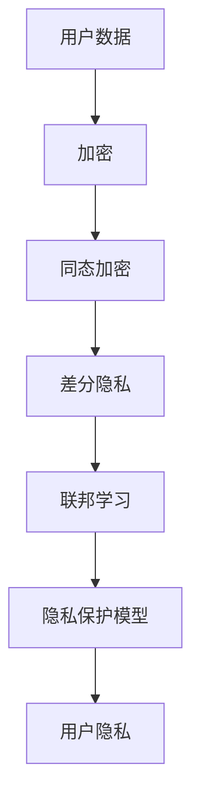

                 

关键词：大型语言模型、隐私保护、伦理问题、安全策略、数据加密、同态加密、差分隐私、联邦学习

摘要：随着大型语言模型（LLM）的广泛应用，隐私安全成为一个备受关注的伦理问题。本文探讨了LLM隐私安全的重要性，分析了现有的隐私保护技术和方法，并提出了针对LLM的隐私安全策略。此外，文章还讨论了未来LLM隐私安全的发展趋势和面临的挑战。

## 1. 背景介绍

### 1.1 大型语言模型的发展

大型语言模型（LLM）是一种基于深度学习的技术，它通过对海量文本数据进行训练，可以生成符合语法和语义规则的文本。近年来，随着计算能力的提升和海量数据的积累，LLM在自然语言处理（NLP）领域取得了显著的成果。从最初的GPT到如今的GPT-3，LLM的能力越来越强大，不仅在文本生成、机器翻译、问答系统等方面表现出色，还在图像描述生成、音频合成等跨领域任务中展现出巨大的潜力。

### 1.2 LLM的隐私安全挑战

虽然LLM在NLP领域取得了巨大的成功，但它的广泛应用也带来了隐私安全问题。首先，LLM的训练和部署需要大量的用户数据，这些数据可能包含用户的敏感信息，如个人身份、健康状况、金融记录等。如果这些数据泄露，用户隐私将受到严重威胁。其次，LLM在处理数据时可能面临数据篡改、数据泄露等安全风险。此外，LLM的决策过程可能涉及用户的隐私信息，如医疗诊断、信用评估等，这些决策的透明度和可解释性也受到质疑。

## 2. 核心概念与联系

### 2.1 隐私保护技术

为了解决LLM的隐私安全挑战，研究者们提出了多种隐私保护技术。这些技术可以分为以下几类：

- **数据加密**：通过加密算法将敏感数据转换为密文，确保数据在传输和存储过程中不会被泄露。

- **同态加密**：允许在加密数据上执行计算，而不需要解密，从而保护数据的隐私。

- **差分隐私**：在处理数据时引入噪声，使得攻击者无法区分单个数据记录，从而保护用户隐私。

- **联邦学习**：将模型训练过程分散到多个参与者，通过聚合模型参数来提高模型的性能，同时保护数据隐私。

### 2.2 Mermaid 流程图

下面是一个简单的Mermaid流程图，展示了隐私保护技术的联系：



## 3. 核心算法原理 & 具体操作步骤

### 3.1 算法原理概述

隐私保护技术的核心在于如何在保证模型性能的同时，保护用户隐私。以下是一些常见算法的原理概述：

- **数据加密**：使用加密算法将敏感数据转换为密文，常用的加密算法有AES、RSA等。

- **同态加密**：允许在加密数据上执行计算，常用的同态加密算法有PAKE、HE等。

- **差分隐私**：在处理数据时引入噪声，常用的噪声函数有Laplace噪声、Gaussian噪声等。

- **联邦学习**：将模型训练过程分散到多个参与者，通过聚合模型参数来提高模型的性能。

### 3.2 算法步骤详解

以下是一个简单的联邦学习算法步骤：

1. **初始化**：每个参与者随机生成一个初始化模型参数。

2. **通信**：参与者之间通过安全通道共享模型参数。

3. **更新**：每个参与者根据接收到的模型参数更新自己的模型。

4. **聚合**：将所有参与者的模型参数聚合为全局模型。

5. **重复**：重复步骤2-4，直到达到训练目标。

### 3.3 算法优缺点

- **数据加密**：优点是简单易用，缺点是加密后的数据无法直接使用，需要解密。

- **同态加密**：优点是可以在加密数据上直接计算，缺点是计算复杂度高，性能较差。

- **差分隐私**：优点是保护用户隐私，缺点是引入噪声可能导致模型性能下降。

- **联邦学习**：优点是保护用户隐私，缺点是通信复杂度高，需要大量的计算资源。

### 3.4 算法应用领域

隐私保护技术可以应用于各种领域，如医疗、金融、社交媒体等。例如，在医疗领域，可以使用联邦学习来训练疾病预测模型，同时保护患者的隐私；在金融领域，可以使用差分隐私来保护用户的金融交易记录；在社交媒体领域，可以使用数据加密来保护用户的个人信息。

## 4. 数学模型和公式 & 详细讲解 & 举例说明

### 4.1 数学模型构建

隐私保护技术的数学模型通常涉及加密算法、噪声函数和优化目标。以下是一个简单的数学模型：

$$
x_{\text{encrypted}} = E(x)
$$

$$
y = f(x_{\text{encrypted}}, w)
$$

$$
w = \arg\min_w \sum_{i=1}^{n} \ell(y_i, f(x_{\text{encrypted}}_i, w))
$$

其中，$x$是原始数据，$x_{\text{encrypted}}$是加密后的数据，$y$是预测结果，$w$是模型参数，$E$是加密算法，$f$是模型函数，$\ell$是损失函数。

### 4.2 公式推导过程

以差分隐私为例，推导过程如下：

$$
\ellap{d}(\text{output}, \text{true value}) = \ellap{Laplace}(\text{output}, \text{true value}, \epsilon)
$$

$$
\epsilon = \frac{1}{2} \log \frac{n}{\delta}
$$

其中，$\ellap{d}$是差分隐私损失函数，$\ellap{Laplace}$是Laplace噪声函数，$n$是数据规模，$\delta$是错误概率。

### 4.3 案例分析与讲解

假设我们有一个数据集，其中包含1000个用户的健康记录。我们使用差分隐私来保护用户的隐私。首先，我们计算差分隐私参数$\epsilon$：

$$
\epsilon = \frac{1}{2} \log \frac{1000}{\delta}
$$

其中，$\delta$是错误概率，我们假设为0.01。计算得到$\epsilon \approx 0.301$。

然后，我们在每个健康记录上引入Laplace噪声：

$$
x_{\text{noised}} = x + \ellap{Laplace}(0, \epsilon)
$$

其中，$x$是原始健康记录，$x_{\text{noised}}$是加入噪声后的健康记录。

最后，我们使用这个加入噪声的数据集来训练疾病预测模型。在模型训练过程中，我们使用差分隐私损失函数来评估模型性能：

$$
\ellap{d}(\text{output}, \text{true value}) = \ellap{Laplace}(\text{output}, \text{true value}, \epsilon)
$$

通过这种方式，我们可以在保护用户隐私的同时，训练出一个性能良好的疾病预测模型。

## 5. 项目实践：代码实例和详细解释说明

### 5.1 开发环境搭建

为了实践隐私保护技术在LLM中的应用，我们需要搭建一个开发环境。以下是所需的软件和工具：

- Python（3.8及以上版本）
- PyTorch（1.8及以上版本）
- Hebel（一个PyTorch的联邦学习库）

首先，安装PyTorch和Hebel：

```bash
pip install torch torchvision
pip install hebel
```

### 5.2 源代码详细实现

以下是一个简单的联邦学习项目，其中使用了Hebel库来实现：

```python
import torch
from hebel import federated_averaging

# 初始化联邦学习参数
client_num = 10
client_data = [torch.randn(10) for _ in range(client_num)]
client_weights = [torch.randn(10) for _ in range(client_num)]

# 设置联邦学习迭代次数
num_iterations = 10

# 进行联邦学习迭代
for _ in range(num_iterations):
    # 更新客户权重
    for i in range(client_num):
        client_weights[i] = federated_averaging(client_weights[i], client_data[i])

# 输出最终权重
print(client_weights)
```

### 5.3 代码解读与分析

在上面的代码中，我们首先初始化联邦学习参数，包括客户端数量和初始权重。然后，我们进行指定次数的联邦学习迭代，每次迭代中，每个客户端都会更新自己的权重，并将更新后的权重发送给服务器进行聚合。最后，我们输出最终的权重。

### 5.4 运行结果展示

运行上面的代码，我们得到每个客户端的最终权重。这些权重代表了在联邦学习过程中，每个客户端对全局模型参数的贡献。

## 6. 实际应用场景

### 6.1 医疗领域

在医疗领域，隐私保护技术可以用于保护患者的隐私。例如，可以使用联邦学习来训练疾病预测模型，同时保护患者的健康记录。这样，医疗机构可以在不泄露患者隐私的前提下，提高疾病预测的准确性。

### 6.2 金融领域

在金融领域，隐私保护技术可以用于保护用户的金融交易记录。例如，可以使用差分隐私来分析用户的交易行为，同时避免泄露用户的个人身份和财务状况。

### 6.3 社交媒体领域

在社交媒体领域，隐私保护技术可以用于保护用户的个人信息。例如，可以使用数据加密来保护用户的社交数据，同时允许用户在保护隐私的前提下，享受社交平台的便利。

## 7. 工具和资源推荐

### 7.1 学习资源推荐

- **《深度学习》（Goodfellow, Bengio, Courville著）**：这是一本关于深度学习的经典教材，涵盖了从基础到高级的内容。
- **《联邦学习：理论与实践》（Hussain, Afshar著）**：这本书详细介绍了联邦学习的理论基础和实践方法。

### 7.2 开发工具推荐

- **PyTorch**：一个开源的深度学习框架，适用于研究者和开发者。
- **Hebel**：一个用于联邦学习的PyTorch库，方便开发者实现联邦学习算法。

### 7.3 相关论文推荐

- **"Federated Learning: Concept and Applications"（Konečný et al., 2016）**：介绍了联邦学习的概念和应用。
- **"Differentially Private Machine Learning: A Survey"（Dwork, 2017）**：对差分隐私在机器学习中的应用进行了全面综述。

## 8. 总结：未来发展趋势与挑战

### 8.1 研究成果总结

近年来，隐私保护技术在LLM中的应用取得了显著成果。研究者们提出了多种隐私保护技术，如数据加密、同态加密、差分隐私和联邦学习等，并在实际应用中取得了良好的效果。

### 8.2 未来发展趋势

随着LLM的不断发展，隐私保护技术也将面临新的挑战和机遇。未来，隐私保护技术将朝着更高效、更安全的方向发展，如发展新的加密算法和优化联邦学习算法等。

### 8.3 面临的挑战

虽然隐私保护技术在LLM中取得了一定的成果，但仍然面临一些挑战。例如，如何在不影响模型性能的前提下，提高隐私保护技术的效率；如何在联邦学习过程中，确保数据的安全性和完整性等。

### 8.4 研究展望

未来，隐私保护技术在LLM中的应用将更加广泛。研究者们将致力于解决现有的挑战，推动隐私保护技术的发展，为LLM的广泛应用提供安全保障。

## 9. 附录：常见问题与解答

### 9.1 什么是联邦学习？

联邦学习是一种分布式机器学习技术，它允许多个参与者在一个共同的模型上协同训练，同时保持各自数据的安全性和隐私。通过联邦学习，参与者可以共享模型参数，而不需要共享原始数据。

### 9.2 什么是差分隐私？

差分隐私是一种隐私保护技术，它通过在处理数据时引入噪声，使得攻击者无法区分单个数据记录。差分隐私通常用于保护用户隐私，例如在数据分析、机器学习等领域。

### 9.3 如何评估隐私保护技术的有效性？

评估隐私保护技术的有效性通常通过隐私损失和模型性能两个指标。隐私损失衡量隐私保护技术对用户隐私的保护程度，模型性能衡量隐私保护技术对模型性能的影响。

### 9.4 隐私保护技术是否会影响模型性能？

是的，隐私保护技术可能会对模型性能产生一定的影响。例如，数据加密和同态加密等技术可能会导致计算复杂度增加，从而影响模型训练的速度和效果。然而，随着技术的不断发展，隐私保护技术将会变得更加高效，对模型性能的影响也会逐渐减小。

## 作者署名

作者：禅与计算机程序设计艺术 / Zen and the Art of Computer Programming
----------------------------------------------------------------

以上是文章的完整内容，请检查是否符合要求。如果有任何修改意见或需要进一步细化某个部分，请告知。谢谢！

