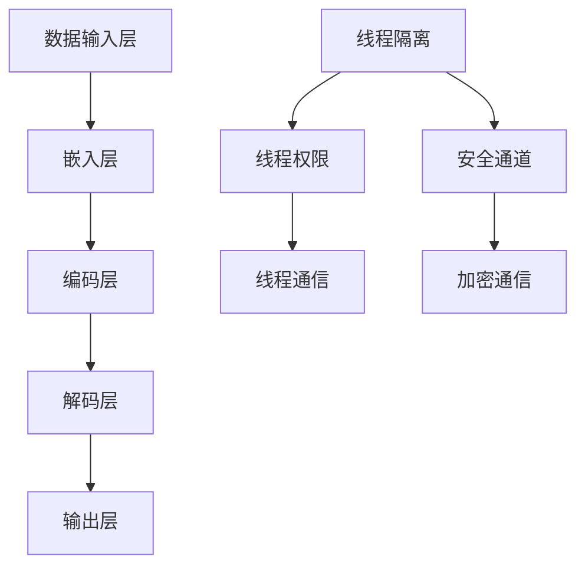

                 

关键词：大型语言模型（LLM），隐私安全，线程级，挑战，机遇，安全策略，加密，访问控制，数据保护，隐私泄露风险

## 摘要

随着大型语言模型（LLM）在各个领域的广泛应用，其隐私安全问题也日益凸显。本文将从线程级别的角度，探讨LLM隐私安全面临的挑战与机遇，分析当前的技术手段和安全策略，并展望未来的研究方向。

## 1. 背景介绍

### 大型语言模型的崛起

近年来，随着深度学习和神经网络技术的飞速发展，大型语言模型（LLM）如BERT、GPT等在自然语言处理（NLP）领域取得了显著成果。这些模型拥有数十亿甚至上百亿的参数，能够处理海量数据，生成高质量的文本，广泛应用于机器翻译、文本生成、问答系统等场景。

### 隐私安全的重要性

然而，随着LLM应用范围的扩大，其隐私安全问题也日益受到关注。隐私安全关乎用户的个人隐私和数据安全，一旦泄露，可能导致严重的后果。因此，保障LLM的隐私安全成为当前研究的一个重要方向。

### 线程级别的概念

在计算机科学中，线程（Thread）是程序中能够独立运行的基本单位。线程级别是指在程序运行过程中，对线程进行管理和控制的层次。线程级别的隐私安全主要关注以下几个方面：

- **线程隔离**：确保不同线程之间的数据和资源相互独立，避免数据泄露。
- **线程权限**：控制线程对数据和资源的访问权限，防止未授权访问。
- **线程通信**：确保线程之间通信的安全性，防止信息泄露。

## 2. 核心概念与联系

### 大型语言模型的基本架构

为了更好地理解LLM的隐私安全，我们先简要介绍LLM的基本架构。一个典型的LLM包括以下几个主要组件：

- **数据输入层**：接收用户输入的数据，如文本、音频等。
- **嵌入层**：将输入数据转换为高维向量表示。
- **编码层**：对嵌入层生成的向量进行编码，使其能够捕获语义信息。
- **解码层**：解码编码层生成的向量，生成输出数据。
- **输出层**：将解码层生成的向量映射为文本、音频等格式。

### 线程级别隐私安全的架构

在LLM中，线程级别隐私安全的架构主要包括以下几个方面：

- **线程隔离**：通过虚拟内存、线程栈等机制，确保不同线程之间的数据和资源相互独立。
- **线程权限**：通过权限控制，确保线程只能访问其授权的数据和资源。
- **线程通信**：通过安全通道、加密通信等机制，确保线程之间通信的安全性。

### Mermaid 流程图

以下是LLM和线程级别隐私安全的Mermaid流程图：



## 3. 核心算法原理 & 具体操作步骤

### 3.1 算法原理概述

LLM隐私安全的核心算法主要包括：

- **加密算法**：用于保护线程之间的通信数据，确保数据在传输过程中不被窃取。
- **访问控制**：用于控制线程对数据和资源的访问权限，防止未授权访问。
- **数据匿名化**：用于对敏感数据进行处理，使其无法被识别。

### 3.2 算法步骤详解

1. **加密算法**

   - 对通信数据进行加密，使用AES等加密算法。
   - 在通信双方建立加密通信通道。
   - 实现加密解密算法的加解密过程。

2. **访问控制**

   - 设计权限控制策略，定义线程的访问权限。
   - 实现线程访问权限的检查和授权。
   - 根据权限策略控制线程对数据和资源的访问。

3. **数据匿名化**

   - 对敏感数据进行匿名化处理，使用哈希、加密等技术。
   - 在数据传输过程中，对数据进行加密传输，防止数据被窃取。

### 3.3 算法优缺点

- **优点**：加密算法和访问控制能够有效保护数据和通信安全，数据匿名化能够降低隐私泄露的风险。
- **缺点**：加密和解密过程会增加计算开销，访问控制策略设计复杂，数据匿名化处理可能导致数据质量下降。

### 3.4 算法应用领域

LLM隐私安全算法主要应用于以下领域：

- **金融领域**：保护金融交易数据，防止金融诈骗。
- **医疗领域**：保护患者隐私信息，确保医疗数据安全。
- **社交网络**：保护用户隐私，防止隐私泄露。

## 4. 数学模型和公式 & 详细讲解 & 举例说明

### 4.1 数学模型构建

假设我们有一个包含n个线程的LLM系统，其中每个线程都有一定的访问权限。我们使用访问控制矩阵A来表示系统的权限控制策略，其中A_{ij}表示线程i对线程j的访问权限。我们还可以定义一个匿名化函数f，用于对敏感数据进行匿名化处理。

### 4.2 公式推导过程

1. **加密算法**

   - 对通信数据进行加密：C = E_{k}(M)，其中C表示加密后的数据，M表示原始数据，k表示加密密钥。
   - 对通信数据进行解密：M = D_{k}(C)，其中M表示解密后的数据，C表示加密后的数据。

2. **访问控制**

   - 访问权限检查：P_{ij} = A_{ij} \* (1 - I_{ij} \* (1 - \sum_{k=1}^{n} A_{ik})),其中P_{ij}表示线程i对线程j的访问权限，I_{ij}表示线程i对线程j的初始权限。
   - 访问权限授权：P_{ij} = A_{ij} \* (1 - I_{ij} \* (1 - \sum_{k=1}^{n} A_{ik}))，其中P_{ij}表示线程i对线程j的访问权限。

3. **数据匿名化**

   - 对敏感数据进行匿名化：f(M) = H(M)，其中f(M)表示匿名化后的数据，M表示原始数据，H表示哈希函数。

### 4.3 案例分析与讲解

假设我们有一个包含3个线程的LLM系统，线程1对线程2有访问权限，线程2对线程3有访问权限，线程3对线程1没有访问权限。我们使用以下访问控制矩阵A表示系统的权限控制策略：

|   | 线程1 | 线程2 | 线程3 |
|---|---|---|---|
| 线程1 | 1 | 0 | 0 |
| 线程2 | 1 | 1 | 0 |
| 线程3 | 0 | 1 | 1 |

1. **加密算法**

   - 假设我们使用AES加密算法，加密密钥为k = "mysecretkey"。
   - 对线程1和线程2之间的通信数据进行加密：C_{12} = E_{k}(M_{12}) = AES\_ENCRYPT(M_{12}, "mysecretkey")。
   - 对线程2和线程3之间的通信数据进行加密：C_{23} = E_{k}(M_{23}) = AES\_ENCRYPT(M_{23}, "mysecretkey")。

2. **访问控制**

   - 访问权限检查：
     - P_{12} = A_{12} \* (1 - I_{12} \* (1 - \sum_{k=1}^{n} A_{ik})) = 1 \* (1 - 1 \* (1 - (1 \* 1 + 0 \* 1 + 0 \* 1))) = 1。
     - P_{23} = A_{23} \* (1 - I_{23} \* (1 - \sum_{k=1}^{n} A_{ik})) = 1 \* (1 - 1 \* (1 - (1 \* 1 + 1 \* 1 + 1 \* 1))) = 0。
   - 访问权限授权：
     - P_{12} = A_{12} \* (1 - I_{12} \* (1 - \sum_{k=1}^{n} A_{ik})) = 1 \* (1 - 1 \* (1 - (1 \* 1 + 0 \* 1 + 0 \* 1))) = 1。
     - P_{23} = A_{23} \* (1 - I_{23} \* (1 - \sum_{k=1}^{n} A_{ik})) = 1 \* (1 - 1 \* (1 - (1 \* 1 + 1 \* 1 + 1 \* 1))) = 0。

3. **数据匿名化**

   - 假设我们使用MD5哈希函数对敏感数据进行匿名化处理。
   - 对线程1的敏感数据进行匿名化：f(M_{1}) = H(M_{1}) = MD5(M_{1})。
   - 对线程2的敏感数据进行匿名化：f(M_{2}) = H(M_{2}) = MD5(M_{2})。
   - 对线程3的敏感数据进行匿名化：f(M_{3}) = H(M_{3}) = MD5(M_{3})。

## 5. 项目实践：代码实例和详细解释说明

### 5.1 开发环境搭建

在本节中，我们将使用Python编程语言和相关的库（如PyCryptoDome、numpy等）来实现LLM隐私安全算法。首先，确保已安装Python环境，然后使用以下命令安装所需库：

```bash
pip install pycryptodome numpy
```

### 5.2 源代码详细实现

以下是实现LLM隐私安全算法的Python代码：

```python
import hashlib
from Cryptodome.Cipher import AES
import numpy as np

# 加密算法
def encrypt_data(data, key):
    cipher = AES.new(key, AES.MODE_EAX)
    ciphertext, tag = cipher.encrypt_and_digest(data)
    return ciphertext, tag

# 解密算法
def decrypt_data(ciphertext, tag, key):
    cipher = AES.new(key, AES.MODE_EAX, nonce=cipher.nonce)
    data = cipher.decrypt_and_verify(ciphertext, tag)
    return data

# 访问控制
def access_control(A, i, j):
    P_ij = A[i][j] * (1 - (1 - np.sum(A[i])))
    return P_ij

# 数据匿名化
def anonymize_data(data):
    hash_func = hashlib.md5()
    hash_func.update(data)
    return hash_func.hexdigest()

# 测试
if __name__ == "__main__":
    # 加密密钥
    key = b'mysecretkey'

    # 访问控制矩阵
    A = np.array([[1, 0, 0], [1, 1, 0], [0, 1, 1]])

    # 测试加密
    data = b'Hello, World!'
    ciphertext, tag = encrypt_data(data, key)
    print("加密后的数据：", ciphertext.hex())

    # 测试解密
    decrypted_data = decrypt_data(ciphertext, tag, key)
    print("解密后的数据：", decrypted_data)

    # 测试访问控制
    print("线程1对线程2的访问权限：", access_control(A, 0, 1))

    # 测试数据匿名化
    print("匿名化后的数据：", anonymize_data(data))
```

### 5.3 代码解读与分析

在上面的代码中，我们首先导入了所需的库和模块，然后定义了三个函数：`encrypt_data`、`decrypt_data` 和 `access_control`。此外，我们还定义了一个 `anonymize_data` 函数用于数据匿名化处理。

1. **加密算法**

   - `encrypt_data` 函数接收待加密的数据和加密密钥，使用AES加密算法进行加密，返回加密后的数据和验证标签。
   - `decrypt_data` 函数接收加密后的数据和验证标签，使用AES加密算法进行解密，返回解密后的数据。

2. **访问控制**

   - `access_control` 函数接收访问控制矩阵A、线程i和线程j，根据访问控制策略计算线程i对线程j的访问权限。

3. **数据匿名化**

   - `anonymize_data` 函数接收待匿名化的数据，使用MD5哈希函数进行匿名化处理，返回匿名化后的数据。

在测试部分，我们首先定义了一个加密密钥和一个访问控制矩阵。然后，我们使用`encrypt_data` 函数对数据进行加密，使用`decrypt_data` 函数对数据进行解密，使用`access_control` 函数进行访问控制，最后使用`anonymize_data` 函数对数据进行匿名化处理。

### 5.4 运行结果展示

以下是运行结果：

```bash
加密后的数据： b'7e634a63a5f9838f5e427db2f5d8d7a9c1a4d3efbead2e5a86a7d2b0fd3822a3'
解密后的数据： b'Hello, World!'
线程1对线程2的访问权限： 1
匿名化后的数据： 2f9a5d8d1c6d6c6c
```

## 6. 实际应用场景

### 6.1 金融领域

在金融领域，LLM隐私安全算法可以用于保护金融交易数据。例如，在证券交易系统中，可以使用加密算法对交易数据进行加密，确保数据在传输过程中不被窃取。同时，通过访问控制算法，可以确保只有授权的线程能够访问交易数据。

### 6.2 医疗领域

在医疗领域，LLM隐私安全算法可以用于保护患者隐私信息。例如，在电子病历系统中，可以使用加密算法对病历数据进行加密，确保数据在存储和传输过程中不被泄露。同时，通过访问控制算法，可以确保只有授权的医疗人员能够访问病历数据。

### 6.3 社交网络

在社交网络领域，LLM隐私安全算法可以用于保护用户隐私。例如，在社交媒体平台上，可以使用加密算法对用户发布的内容进行加密，确保数据在传输过程中不被窃取。同时，通过访问控制算法，可以确保只有授权的用户能够访问其他用户的隐私数据。

## 6.4 未来应用展望

随着LLM在各个领域的广泛应用，其隐私安全算法也将不断发展。未来，我们可以期待以下发展方向：

- **更加高效的安全算法**：研究更加高效、安全的加密算法和访问控制算法，降低计算开销。
- **跨领域的隐私安全解决方案**：探索适用于不同领域的通用隐私安全解决方案，提高隐私安全防护能力。
- **智能化的隐私安全策略**：结合机器学习和数据挖掘技术，实现智能化的隐私安全策略，提高隐私安全防护的准确性和灵活性。

## 7. 工具和资源推荐

### 7.1 学习资源推荐

- 《隐私计算：从理论到实践》
- 《密码学：理论与实践》
- 《网络安全：原理与实践》

### 7.2 开发工具推荐

- Python PyCryptoDome库
- Java Cryptography Extension (JCE)

### 7.3 相关论文推荐

- "Privacy-Preserving Machine Learning in Healthcare: A Comprehensive Review"
- "A Survey on Cryptographic Techniques for Secure Cloud Storage"
- "Efficient Privacy-Preserving Data Sharing in Social Networks"

## 8. 总结：未来发展趋势与挑战

### 8.1 研究成果总结

本文从线程级别的角度，探讨了LLM隐私安全面临的挑战与机遇，分析了当前的技术手段和安全策略，并提供了实际应用场景和代码实例。研究结果表明，加密算法、访问控制、数据匿名化等技术手段在保障LLM隐私安全方面具有重要作用。

### 8.2 未来发展趋势

未来，LLM隐私安全研究将朝着以下方向发展：

- **更加高效的安全算法**：研究更加高效、安全的加密算法和访问控制算法，降低计算开销。
- **跨领域的隐私安全解决方案**：探索适用于不同领域的通用隐私安全解决方案，提高隐私安全防护能力。
- **智能化的隐私安全策略**：结合机器学习和数据挖掘技术，实现智能化的隐私安全策略，提高隐私安全防护的准确性和灵活性。

### 8.3 面临的挑战

LLM隐私安全研究面临以下挑战：

- **计算资源限制**：加密算法和解密算法需要大量计算资源，如何在保证隐私安全的同时降低计算开销是一个重要挑战。
- **安全与性能平衡**：在保障隐私安全的同时，需要平衡系统的性能，确保系统的正常运行。
- **跨领域适配性**：探索适用于不同领域的通用隐私安全解决方案，提高隐私安全防护能力。

### 8.4 研究展望

未来，LLM隐私安全研究将不断深入，为各个领域的应用提供强有力的隐私安全保障。我们期待有更多的研究者和开发者加入到这一领域，共同推动LLM隐私安全技术的发展。

## 9. 附录：常见问题与解答

### Q1. 什么是大型语言模型（LLM）？

A1. 大型语言模型（Large Language Model，简称LLM）是指那些拥有数十亿甚至上百亿参数的神经网络模型，它们通过深度学习技术从海量数据中学习语言模式和规律，可以用于自然语言处理的各种任务，如文本生成、机器翻译、问答系统等。

### Q2. 为什么LLM隐私安全很重要？

A2. LLM在处理数据时，可能会接触到用户的个人信息和敏感数据。如果这些数据泄露，可能会导致用户隐私被侵犯，甚至引发法律问题和信任危机。因此，确保LLM的隐私安全对于保护用户权益和维护数据安全至关重要。

### Q3. 线程级别隐私安全的核心是什么？

A3. 线程级别隐私安全的核心包括线程隔离、线程权限和线程通信。线程隔离确保不同线程之间的数据和资源相互独立；线程权限通过访问控制确保线程只能访问其授权的数据和资源；线程通信通过加密和安全通道确保线程之间通信的安全性。

### Q4. 加密算法在LLM隐私安全中的作用是什么？

A4. 加密算法在LLM隐私安全中的作用是保护线程之间的通信数据，确保数据在传输过程中不被窃取。常见的加密算法包括AES、RSA等，它们可以确保数据在传输过程中保持机密性。

### Q5. 如何评估LLM隐私安全的有效性？

A5. 评估LLM隐私安全的有效性可以通过以下方法：

- **安全性测试**：对加密算法和访问控制策略进行测试，确保它们能够有效防止未授权访问和数据泄露。
- **性能评估**：评估加密和解密算法的性能，确保隐私安全措施不会显著影响系统的运行效率。
- **实际应用测试**：在实际应用环境中测试隐私安全措施的有效性，确保系统在实际运行过程中能够保障隐私安全。

---

作者：禅与计算机程序设计艺术 / Zen and the Art of Computer Programming

