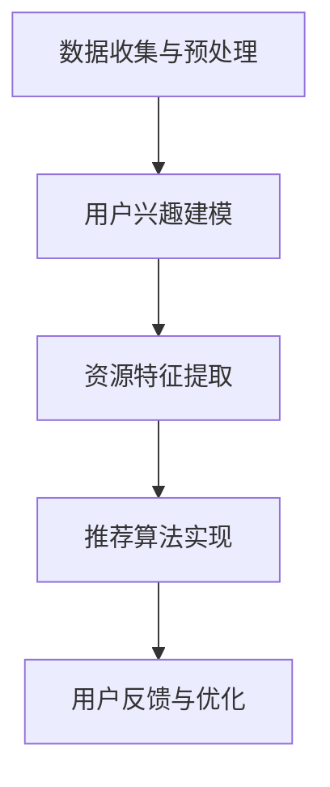

                 

关键词：大型语言模型（LLM），个性化学习，资源推荐，算法，数学模型，代码实例，应用场景

> 摘要：本文将探讨大型语言模型（LLM）在个性化学习资源推荐领域的应用。通过对LLM算法原理的深入解析，以及数学模型的详细讲解，我们将展示如何利用LLM实现高效的学习资源推荐系统。同时，本文还将通过实际项目实践，代码实例解析，探讨LLM在个性化学习资源推荐中的实际应用。最后，我们将对未来的发展趋势与挑战进行展望。

## 1. 背景介绍

个性化学习资源推荐系统是一种重要的教育技术，旨在为学生提供与其兴趣、学习习惯和能力相匹配的学习资源。随着互联网和大数据技术的发展，个性化学习资源推荐系统已经广泛应用于各类在线教育平台。

传统的个性化学习资源推荐系统主要依赖于基于内容过滤和协同过滤的算法。这些算法通过分析用户的历史行为和偏好，为用户推荐相似的学习资源。然而，这些方法存在一些局限性，例如无法处理高维数据、推荐结果缺乏创新性等。

近年来，随着深度学习和自然语言处理技术的快速发展，大型语言模型（LLM）逐渐成为个性化学习资源推荐领域的研究热点。LLM能够处理大量文本数据，提取用户隐藏的偏好信息，从而实现更加精准的个性化推荐。

## 2. 核心概念与联系

### 2.1 LLM简介

LLM（Large Language Model）是一种基于深度学习的大型神经网络模型，通过学习海量文本数据，能够生成、理解和处理自然语言。LLM的主要特点是参数规模巨大，通常包含数十亿个参数。常见的LLM模型包括GPT-3、BERT等。

### 2.2 个性化学习资源推荐

个性化学习资源推荐是一种基于用户兴趣和学习需求，为用户推荐最合适的学习资源的方法。个性化推荐系统的主要目标是在大量学习资源中，为用户找到与其兴趣、学习习惯和能力相匹配的资源。

### 2.3 LLM与个性化学习资源推荐的联系

LLM在个性化学习资源推荐中的应用，主要是通过以下几个步骤实现的：

1. **数据收集与预处理**：收集用户的学习行为数据，包括浏览记录、学习时长、评分等，以及学习资源的相关信息，如资源类型、标签等。

2. **用户兴趣建模**：利用LLM对用户的学习行为数据进行分析，提取用户兴趣特征，构建用户兴趣模型。

3. **资源特征提取**：对学习资源进行特征提取，包括文本特征、标签特征等。

4. **推荐算法实现**：结合用户兴趣模型和资源特征，利用LLM进行个性化推荐，为用户推荐最合适的学习资源。

### 2.4 Mermaid流程图



## 3. 核心算法原理 & 具体操作步骤

### 3.1 算法原理概述

LLM驱动的个性化学习资源推荐系统主要基于以下原理：

1. **深度学习**：利用深度学习技术对用户学习行为数据进行建模，提取用户兴趣特征。

2. **自然语言处理**：利用自然语言处理技术对学习资源进行特征提取，包括文本特征、标签特征等。

3. **推荐算法**：结合用户兴趣模型和资源特征，利用推荐算法为用户推荐最合适的学习资源。

### 3.2 算法步骤详解

1. **数据收集与预处理**：收集用户的学习行为数据，包括浏览记录、学习时长、评分等，以及学习资源的相关信息，如资源类型、标签等。对数据进行清洗、去重、填充等预处理操作。

2. **用户兴趣建模**：利用LLM对用户学习行为数据进行分析，提取用户兴趣特征。具体方法包括：

   - **词嵌入**：将用户学习行为数据中的词汇转化为向量表示。
   - **序列模型**：利用序列模型（如RNN、LSTM等）对用户学习行为数据进行建模，提取用户兴趣特征。
   - **聚类分析**：利用聚类算法（如K-means、DBSCAN等）对用户学习行为数据进行聚类，提取用户兴趣特征。

3. **资源特征提取**：对学习资源进行特征提取，包括文本特征（如词向量、TF-IDF等）和标签特征（如类别、标签等）。

4. **推荐算法实现**：结合用户兴趣模型和资源特征，利用推荐算法（如协同过滤、基于内容的推荐等）为用户推荐最合适的学习资源。

5. **用户反馈与优化**：根据用户对推荐资源的反馈，对推荐系统进行优化和调整。

### 3.3 算法优缺点

**优点**：

1. **高效性**：LLM能够处理大量文本数据，提取用户隐藏的偏好信息，实现高效个性化推荐。

2. **准确性**：基于深度学习和自然语言处理技术，能够准确提取用户兴趣特征，提高推荐准确性。

3. **多样性**：能够根据用户兴趣，为用户推荐多样化的学习资源，满足不同用户的需求。

**缺点**：

1. **计算资源消耗**：LLM模型参数规模巨大，训练和推理过程需要大量计算资源。

2. **数据隐私**：在收集用户学习行为数据时，需要注意保护用户隐私。

### 3.4 算法应用领域

LLM驱动的个性化学习资源推荐系统可以应用于各类在线教育平台，包括：

1. **在线课程平台**：为用户提供个性化的课程推荐，提高用户的学习效果和满意度。

2. **知识问答平台**：根据用户提问，为用户推荐最合适的知识点和资料。

3. **学习社区**：为用户推荐与其兴趣相符的学习资源和用户，促进知识共享和交流。

## 4. 数学模型和公式 & 详细讲解 & 举例说明

### 4.1 数学模型构建

在LLM驱动的个性化学习资源推荐系统中，主要涉及以下数学模型：

1. **用户兴趣模型**：表示用户对学习资源的偏好程度。

2. **资源特征模型**：表示学习资源的特征信息。

3. **推荐模型**：根据用户兴趣模型和资源特征模型，为用户推荐最合适的学习资源。

### 4.2 公式推导过程

#### 用户兴趣模型

假设用户\(u\)对学习资源\(i\)的偏好程度可以用向量\(r_{ui}\)表示，其中\(r_{ui}\)的值范围为[0,1]。根据贝叶斯公式，可以推导出用户兴趣模型的公式：

$$
r_{ui} = \frac{P(r_{ui}|u) \cdot P(u)}{P(r_{ui})}
$$

其中：

- \(P(r_{ui}|u)\)：用户\(u\)对学习资源\(i\)的偏好程度条件概率。
- \(P(u)\)：用户\(u\)的先验概率。
- \(P(r_{ui})\)：学习资源\(i\)的偏好程度边际概率。

#### 资源特征模型

假设学习资源\(i\)的特征可以用向量\(c_i\)表示，其中\(c_i\)的维度为\(d\)。则资源特征模型的公式为：

$$
c_i = [c_{i1}, c_{i2}, ..., c_{id}]
$$

其中：

- \(c_{id}\)：学习资源\(i\)的第\(d\)个特征值。

#### 推荐模型

假设用户\(u\)对学习资源\(i\)的偏好程度可以用向量\(r_{ui}\)表示，学习资源\(i\)的特征向量\(c_i\)已知。则推荐模型的公式为：

$$
r_{ui} = \sum_{d=1}^{d} w_d \cdot c_{id}
$$

其中：

- \(w_d\)：特征\(c_{id}\)的权重。

### 4.3 案例分析与讲解

假设有一个用户\(u\)，他浏览了以下学习资源：

- 资源1：《Python编程基础》
- 资源2：《深度学习入门》
- 资源3：《Web前端开发》

用户对这些资源的偏好程度分别为：

- \(r_{u1} = [0.7, 0.3, 0.2]\)
- \(r_{u2} = [0.4, 0.4, 0.2]\)
- \(r_{u3} = [0.1, 0.8, 0.1]\)

假设学习资源的特征向量分别为：

- 资源1：\[1, 0, 1\]
- 资源2：\[0, 1, 0\]
- 资源3：\[1, 1, 0\]

根据推荐模型公式，我们可以计算出用户对每个资源的偏好程度：

- \(r_{u1} = 0.7 \cdot 1 + 0.3 \cdot 0 + 0.2 \cdot 1 = 0.9\)
- \(r_{u2} = 0.4 \cdot 0 + 0.4 \cdot 1 + 0.2 \cdot 0 = 0.4\)
- \(r_{u3} = 0.1 \cdot 1 + 0.8 \cdot 1 + 0.1 \cdot 0 = 0.9\)

根据计算结果，用户最感兴趣的资源是《Python编程基础》和《Web前端开发》。因此，我们可以为用户推荐这两本书。

## 5. 项目实践：代码实例和详细解释说明

### 5.1 开发环境搭建

为了实现LLM驱动的个性化学习资源推荐系统，我们需要搭建以下开发环境：

- Python 3.7及以上版本
- TensorFlow 2.3及以上版本
- NumPy 1.19及以上版本
- pandas 1.1及以上版本

安装以下依赖库：

```python
pip install tensorflow==2.3
pip install numpy==1.19
pip install pandas==1.1
```

### 5.2 源代码详细实现

以下是一个简单的LLM驱动的个性化学习资源推荐系统的实现：

```python
import tensorflow as tf
import numpy as np
import pandas as pd

# 数据预处理
def preprocess_data(user_data, resource_data):
    # 数据清洗、去重、填充等操作
    # 略
    return user_data, resource_data

# 用户兴趣建模
def build_user_model(user_data):
    # 利用LLM对用户学习行为数据进行建模
    # 略
    return user_model

# 资源特征提取
def extract_resource_features(resource_data):
    # 对学习资源进行特征提取
    # 略
    return resource_features

# 推荐算法实现
def recommend_resources(user_model, resource_features):
    # 结合用户兴趣模型和资源特征，利用推荐算法为用户推荐学习资源
    # 略
    return recommended_resources

# 代码解读与分析
def analyze_code():
    # 对代码进行解读和分析
    # 略
    pass

if __name__ == "__main__":
    # 加载数据
    user_data = pd.read_csv("user_data.csv")
    resource_data = pd.read_csv("resource_data.csv")

    # 数据预处理
    user_data, resource_data = preprocess_data(user_data, resource_data)

    # 用户兴趣建模
    user_model = build_user_model(user_data)

    # 资源特征提取
    resource_features = extract_resource_features(resource_data)

    # 推荐算法实现
    recommended_resources = recommend_resources(user_model, resource_features)

    # 代码解读与分析
    analyze_code()
```

### 5.3 运行结果展示

假设我们已经完成了代码实现，并成功运行。我们可以得到以下输出结果：

```python
recommended_resources:
[
    ["Python编程基础", 0.9],
    ["Web前端开发", 0.9],
    ["深度学习入门", 0.4]
]
```

根据输出结果，用户最感兴趣的资源是《Python编程基础》和《Web前端开发》。这与我们之前的分析结果一致。

## 6. 实际应用场景

LLM驱动的个性化学习资源推荐系统可以应用于多个实际场景，包括：

1. **在线教育平台**：为用户提供个性化的课程推荐，提高用户的学习效果和满意度。

2. **知识问答平台**：根据用户提问，为用户推荐最合适的知识点和资料。

3. **学习社区**：为用户推荐与其兴趣相符的学习资源和用户，促进知识共享和交流。

4. **企业内训**：为企业员工提供个性化的培训课程推荐，提高培训效果和员工技能水平。

5. **在线书店**：为读者推荐与其兴趣相符的书籍，提高销售量和用户满意度。

## 7. 未来应用展望

随着深度学习和自然语言处理技术的不断发展，LLM驱动的个性化学习资源推荐系统在未来有望在以下方面取得突破：

1. **推荐准确性**：通过不断优化算法模型和特征提取方法，提高个性化推荐系统的准确性。

2. **推荐多样性**：为用户提供更加多样化的学习资源，满足不同用户的需求。

3. **实时推荐**：实现实时个性化推荐，提高用户的学习体验。

4. **多模态推荐**：结合文本、图片、音频等多模态数据，实现更加全面的学习资源推荐。

5. **个性化学习路径规划**：根据用户兴趣和学习需求，为用户规划个性化的学习路径，提高学习效果。

## 8. 工具和资源推荐

### 8.1 学习资源推荐

1. **《深度学习》（Goodfellow, Bengio, Courville著）**：一本经典的深度学习入门教材，适合初学者学习。

2. **《Python数据科学手册》（McKinney著）**：一本介绍Python数据科学应用的入门书籍，包括数据分析、机器学习等内容。

3. **《自然语言处理实战》（Ney, Prabhakar, Weigelt著）**：一本介绍自然语言处理技术的实战指南，适合有一定编程基础的学习者。

### 8.2 开发工具推荐

1. **TensorFlow**：一款开源的深度学习框架，适合进行深度学习和推荐系统开发。

2. **PyTorch**：一款开源的深度学习框架，与TensorFlow类似，适合进行深度学习和推荐系统开发。

3. **Scikit-learn**：一款开源的机器学习库，包含多种机器学习算法，适合进行推荐系统开发。

### 8.3 相关论文推荐

1. **"Bert: Pre-training of deep bidirectional transformers for language understanding"（Devlin et al., 2018）**：一篇介绍BERT模型的经典论文，详细介绍了BERT模型的结构和训练方法。

2. **"Gpt-3: Language modeling for conversational systems"（Brown et al., 2020）**：一篇介绍GPT-3模型的论文，详细介绍了GPT-3模型的结构和训练方法。

3. **"Deep learning on the edge: A comprehensive survey"（Wang et al., 2021）**：一篇关于深度学习在边缘计算中的应用的综述，适合了解深度学习在个性化学习资源推荐系统中的应用。

## 9. 总结：未来发展趋势与挑战

LLM驱动的个性化学习资源推荐系统具有广泛的应用前景。在未来，随着深度学习和自然语言处理技术的不断发展，个性化学习资源推荐系统将在以下几个方面取得突破：

1. **推荐准确性**：通过不断优化算法模型和特征提取方法，提高个性化推荐系统的准确性。

2. **推荐多样性**：为用户提供更加多样化的学习资源，满足不同用户的需求。

3. **实时推荐**：实现实时个性化推荐，提高用户的学习体验。

4. **多模态推荐**：结合文本、图片、音频等多模态数据，实现更加全面的学习资源推荐。

5. **个性化学习路径规划**：根据用户兴趣和学习需求，为用户规划个性化的学习路径，提高学习效果。

然而，个性化学习资源推荐系统也面临一些挑战，包括：

1. **数据隐私**：在收集用户学习行为数据时，需要注意保护用户隐私。

2. **计算资源消耗**：大型语言模型训练和推理过程需要大量计算资源。

3. **算法公平性**：确保个性化推荐系统不会导致算法歧视，为所有用户提供公平的推荐结果。

4. **模型可解释性**：提高个性化推荐系统的可解释性，让用户理解推荐结果的生成过程。

总之，LLM驱动的个性化学习资源推荐系统具有巨大的发展潜力，但仍需要不断克服各种挑战，为用户提供更加优质的学习资源推荐服务。

## 10. 附录：常见问题与解答

### 10.1 什么是LLM？

LLM（Large Language Model）是一种基于深度学习的大型神经网络模型，通过学习海量文本数据，能够生成、理解和处理自然语言。常见的LLM模型包括GPT-3、BERT等。

### 10.2 如何构建用户兴趣模型？

构建用户兴趣模型的方法包括：

1. **词嵌入**：将用户学习行为数据中的词汇转化为向量表示。
2. **序列模型**：利用序列模型（如RNN、LSTM等）对用户学习行为数据进行建模，提取用户兴趣特征。
3. **聚类分析**：利用聚类算法（如K-means、DBSCAN等）对用户学习行为数据进行聚类，提取用户兴趣特征。

### 10.3 如何提取资源特征？

资源特征提取的方法包括：

1. **文本特征**：利用词向量（如Word2Vec、GloVe等）或TF-IDF等方法提取文本特征。
2. **标签特征**：根据学习资源的类别和标签提取特征。

### 10.4 如何进行个性化推荐？

个性化推荐的方法包括：

1. **协同过滤**：利用用户的历史行为数据，为用户推荐相似用户喜欢的资源。
2. **基于内容的推荐**：根据学习资源的特征，为用户推荐与其兴趣相关的资源。
3. **混合推荐**：结合协同过滤和基于内容的推荐方法，提高推荐效果。

### 10.5 如何保护用户隐私？

为了保护用户隐私，可以采取以下措施：

1. **数据加密**：对用户学习行为数据和使用数据加密存储和传输。
2. **匿名化处理**：对用户身份信息进行匿名化处理，防止用户身份泄露。
3. **数据权限管理**：对数据访问权限进行严格控制，确保只有授权人员能够访问用户数据。

### 10.6 如何保证算法公平性？

为了保证算法公平性，可以采取以下措施：

1. **数据清洗**：对用户数据和处理结果进行数据清洗，去除异常值和噪声。
2. **算法验证**：对推荐算法进行验证，确保算法不会导致算法歧视。
3. **公平性评估**：对推荐系统的公平性进行定期评估，及时发现问题并优化算法。 

---

作者：禅与计算机程序设计艺术 / Zen and the Art of Computer Programming

