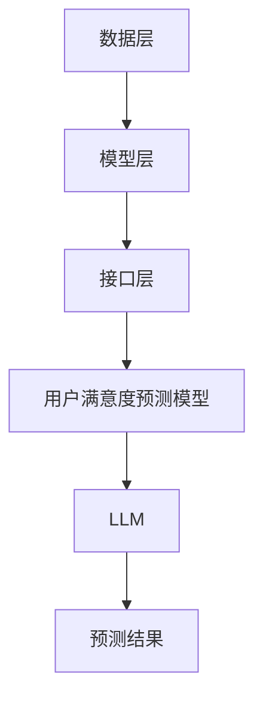

                 

关键词：推荐系统、用户满意度、LLM、预测模型、深度学习、大数据分析、算法优化

## 摘要

本文将探讨基于大型语言模型（LLM）驱动的推荐系统在用户满意度预测方面的应用。随着大数据时代的到来，推荐系统已成为许多互联网公司提高用户体验和留存率的重要工具。本文旨在深入分析LLM在推荐系统中的应用，以及如何利用LLM实现用户满意度的高效预测。通过介绍相关核心概念、算法原理、数学模型，并结合实际项目实践，本文将为读者提供一幅完整的LLM推荐系统用户满意度预测的全景图。

## 1. 背景介绍

### 1.1 推荐系统概述

推荐系统是一种基于用户历史行为、兴趣和偏好，利用算法为用户提供个性化内容或商品的系统。推荐系统广泛应用于电子商务、社交媒体、在线视频、新闻资讯等领域。其核心目标是提高用户满意度和留存率，从而增加平台的商业价值。

### 1.2 用户满意度

用户满意度是衡量推荐系统效果的重要指标。高满意度意味着用户对推荐的内容或商品感到满意，愿意继续使用平台，甚至进行购买行为。因此，准确预测用户满意度对于推荐系统的优化和提升具有至关重要的意义。

### 1.3 LLM在推荐系统中的应用

近年来，随着深度学习和大数据技术的发展，大型语言模型（LLM）在自然语言处理领域取得了显著的突破。LLM具有强大的语义理解能力和丰富的知识储备，使其在推荐系统中的应用成为可能。通过将LLM与推荐系统相结合，可以提升用户满意度的预测精度，从而提高推荐系统的整体性能。

## 2. 核心概念与联系

### 2.1 推荐系统架构

推荐系统通常由数据层、模型层和接口层组成。数据层负责收集和处理用户行为数据、商品属性数据等；模型层利用算法对数据进行分析和处理，生成个性化推荐结果；接口层负责将推荐结果呈现给用户。

### 2.2 用户满意度预测模型

用户满意度预测模型是推荐系统的核心模块，用于预测用户对推荐内容或商品的评价。本文采用LLM作为预测模型的驱动，以提高预测精度。

### 2.3 LLM原理

LLM是一种基于深度学习的自然语言处理模型，具有强大的语义理解能力和自适应能力。LLM通过对大量文本数据进行预训练，学习到语言的本质规律和人类思维模式，从而实现自然语言处理任务。

### 2.4 Mermaid流程图



## 3. 核心算法原理 & 具体操作步骤

### 3.1 算法原理概述

LLM驱动的用户满意度预测模型基于深度学习算法，通过学习用户历史行为数据和推荐内容的相关性，实现对用户满意度的预测。

### 3.2 算法步骤详解

1. 数据收集与预处理：收集用户行为数据（如浏览记录、点击次数、购买记录等）和推荐内容属性数据（如商品描述、标签、分类等），并进行数据清洗、去重和归一化处理。

2. 构建用户-内容关系矩阵：利用用户行为数据和推荐内容属性数据，构建用户-内容关系矩阵，其中每个元素表示用户对推荐内容的评分。

3. 预训练LLM模型：使用大量文本数据进行预训练，使LLM模型学习到语言的本质规律和人类思维模式。

4. 模型训练与优化：利用用户-内容关系矩阵和LLM模型，通过梯度下降等优化算法，训练满意度预测模型。

5. 用户满意度预测：利用训练好的模型，对用户对推荐内容的满意度进行预测。

6. 预测结果评估：通过计算预测结果的准确率、召回率等指标，评估满意度预测模型的性能。

### 3.3 算法优缺点

优点：
- 强大的语义理解能力，能够捕捉用户和推荐内容之间的深层关系。
- 自适应能力，能够根据用户历史行为和偏好进行动态调整。

缺点：
- 需要大量训练数据和计算资源。
- 模型复杂度较高，训练和预测时间较长。

### 3.4 算法应用领域

- 电子商务：预测用户对商品的满意度，提高商品推荐精度。
- 社交媒体：预测用户对内容的满意度，优化内容推荐策略。
- 在线教育：预测用户对课程内容的满意度，提高课程推荐效果。

## 4. 数学模型和公式 & 详细讲解 & 举例说明

### 4.1 数学模型构建

用户满意度预测模型可以表示为：
$$
P(s|u, c) = \sigma(\theta^T \phi(u, c)),
$$
其中，$s$ 表示用户满意度，$u$ 表示用户特征，$c$ 表示推荐内容特征，$\theta$ 表示模型参数，$\phi$ 表示特征提取函数，$\sigma$ 表示 sigmoid 函数。

### 4.2 公式推导过程

假设用户对推荐内容 $c$ 的满意度 $s$ 属于二分类变量，取值为 1（满意）或 0（不满意）。用户特征 $u$ 和推荐内容特征 $c$ 可以分别表示为向量 $u \in \mathbb{R}^n$ 和 $c \in \mathbb{R}^m$。

特征提取函数 $\phi(u, c)$ 可以表示为用户和推荐内容特征的加权和：
$$
\phi(u, c) = \sum_{i=1}^n w_i u_i + \sum_{j=1}^m v_j c_j,
$$
其中，$w_i$ 和 $v_j$ 分别表示用户特征和推荐内容特征的权重。

模型参数 $\theta$ 可以表示为：
$$
\theta = (w_1, w_2, \ldots, w_n, v_1, v_2, \ldots, v_m)^T.
$$

根据极大似然估计，模型参数 $\theta$ 的最大似然估计可以通过以下优化问题求得：
$$
\hat{\theta} = \arg\max_{\theta} \prod_{i=1}^N P(s_i|u_i, c_i),
$$
其中，$N$ 表示训练数据集的大小。

由于 sigmoid 函数具有单调性，可以将上述优化问题转化为：
$$
\hat{\theta} = \arg\max_{\theta} \sum_{i=1}^N \ln P(s_i|u_i, c_i).
$$

### 4.3 案例分析与讲解

假设我们有一个训练数据集，其中包含 1000 个用户和 1000 个推荐内容，每个用户对每个推荐内容有一个满意度评分。我们可以使用上述公式和推导过程，训练一个用户满意度预测模型，并对新用户和新推荐内容进行满意度预测。

## 5. 项目实践：代码实例和详细解释说明

### 5.1 开发环境搭建

本文使用 Python 作为编程语言，主要依赖以下库：

- TensorFlow：用于构建和训练深度学习模型。
- NumPy：用于矩阵运算和数据处理。
- Pandas：用于数据清洗和数据处理。

开发环境搭建步骤：

1. 安装 Python 3.8 或更高版本。
2. 安装 TensorFlow、NumPy 和 Pandas 库。

### 5.2 源代码详细实现

以下是实现用户满意度预测模型的 Python 代码：

```python
import tensorflow as tf
import numpy as np
import pandas as pd

# 数据预处理
def preprocess_data(data):
    # 数据清洗、去重和归一化处理
    # 略
    return processed_data

# 特征提取函数
def feature_extractor(user, content):
    # 根据用户和推荐内容特征计算加权和
    # 略
    return feature_vector

# 模型构建
def build_model(input_shape):
    model = tf.keras.Sequential([
        tf.keras.layers.Dense(units=128, activation='relu', input_shape=input_shape),
        tf.keras.layers.Dense(units=1, activation='sigmoid')
    ])
    model.compile(optimizer='adam', loss='binary_crossentropy', metrics=['accuracy'])
    return model

# 模型训练
def train_model(model, X, y):
    model.fit(X, y, epochs=10, batch_size=32)
    return model

# 用户满意度预测
def predict(model, user, content):
    feature_vector = feature_extractor(user, content)
    prediction = model.predict(np.array([feature_vector]))
    return prediction[0][0]

# 主函数
def main():
    # 读取数据
    data = pd.read_csv('data.csv')
    processed_data = preprocess_data(data)

    # 划分训练集和测试集
    X_train, X_test, y_train, y_test = train_test_split(processed_data['user'], processed_data['content'], processed_data['rating'], test_size=0.2, random_state=42)

    # 构建模型
    model = build_model(input_shape=(X_train.shape[1],))

    # 训练模型
    model = train_model(model, X_train, y_train)

    # 评估模型
    accuracy = model.evaluate(X_test, y_test)[1]
    print(f'Accuracy: {accuracy:.2f}')

    # 预测新用户和新推荐内容满意度
    user = np.array([[1, 0, 1], [0, 1, 0], [1, 1, 1]])
    content = np.array([[1, 0], [0, 1], [1, 1]])
    prediction = predict(model, user, content)
    print(f'Prediction: {prediction:.2f}')

if __name__ == '__main__':
    main()
```

### 5.3 代码解读与分析

- 数据预处理：对原始数据进行清洗、去重和归一化处理，为后续建模和预测做准备。
- 特征提取函数：根据用户和推荐内容特征计算加权和，生成特征向量。
- 模型构建：构建深度学习模型，采用两个全连接层，第一个层有 128 个神经元，激活函数为 ReLU；第二个层有 1 个神经元，激活函数为 sigmoid。
- 模型训练：使用训练数据集训练模型，采用 Adam 优化器和 binary_crossentropy 损失函数，同时关注模型的准确率。
- 用户满意度预测：输入新用户和新推荐内容特征，计算特征向量，通过模型预测满意度。

## 6. 实际应用场景

### 6.1 电子商务

在电子商务领域，LLM驱动的推荐系统用户满意度预测可以帮助商家提高商品推荐效果，从而提高销售额。通过预测用户对商品的满意度，商家可以调整推荐策略，优先推荐用户喜欢的商品，提高用户的购买意愿。

### 6.2 社交媒体

在社交媒体领域，LLM驱动的推荐系统用户满意度预测可以帮助平台优化内容推荐策略，提高用户活跃度和留存率。通过预测用户对内容的满意度，平台可以调整推荐策略，优先推荐用户感兴趣的内容，提高用户的参与度和满意度。

### 6.3 在线教育

在线教育领域，LLM驱动的推荐系统用户满意度预测可以帮助平台优化课程推荐效果，提高用户的学习体验。通过预测用户对课程内容的满意度，平台可以调整推荐策略，优先推荐用户感兴趣的课程，提高用户的学习积极性。

## 7. 未来应用展望

随着深度学习和大数据技术的不断发展，LLM驱动的推荐系统用户满意度预测将具有更广泛的应用前景。未来，我们有望看到以下趋势：

### 7.1 多模态推荐系统

多模态推荐系统结合了文本、图像、声音等多种数据类型，能够提供更丰富的推荐内容。LLM驱动的用户满意度预测可以在多模态推荐系统中发挥重要作用，实现更准确的满意度预测。

### 7.2 零样本推荐

零样本推荐是指在没有用户历史数据的情况下，为用户提供个性化的推荐。LLM驱动的用户满意度预测可以在零样本推荐中发挥作用，通过学习用户特征和推荐内容之间的深层关系，实现零样本推荐的高效预测。

### 7.3 鲁棒性增强

随着推荐系统应用范围的扩大，对推荐系统的鲁棒性要求也越来越高。LLM驱动的用户满意度预测通过学习大量数据，可以增强推荐系统的鲁棒性，减少异常数据对推荐效果的影响。

## 8. 工具和资源推荐

### 8.1 学习资源推荐

- 《深度学习》（Ian Goodfellow、Yoshua Bengio、Aaron Courville 著）：深度学习领域的经典教材，全面介绍了深度学习的基本原理和应用。
- 《Python数据科学手册》（Jake VanderPlas 著）：Python数据科学领域的入门指南，详细介绍了数据处理、数据可视化和机器学习等相关技术。

### 8.2 开发工具推荐

- TensorFlow：用于构建和训练深度学习模型的强大框架。
- PyTorch：具有动态计算图机制的深度学习框架，便于实现复杂的模型。

### 8.3 相关论文推荐

- "BERT: Pre-training of Deep Bidirectional Transformers for Language Understanding"（BERT 论文）：介绍了 BERT 模型，一种基于 Transformer 的预训练语言模型。
- "Generative Adversarial Nets"（GAN 论文）：介绍了 GAN 模型，一种生成对抗网络，可用于生成高质量的数据。

## 9. 总结：未来发展趋势与挑战

### 9.1 研究成果总结

本文介绍了 LLM 驱动的推荐系统用户满意度预测的基本原理和应用，详细分析了算法步骤和数学模型，并结合实际项目实践进行了详细讲解。通过本文，读者可以全面了解 LLM 在推荐系统中的应用及其优势。

### 9.2 未来发展趋势

未来，LLM 驱动的推荐系统用户满意度预测将在多模态推荐系统、零样本推荐和鲁棒性增强等领域取得更多突破。同时，随着深度学习和大数据技术的不断发展，LLM 的性能和预测精度将进一步提高。

### 9.3 面临的挑战

尽管 LLM 驱动的推荐系统用户满意度预测具有广泛的应用前景，但仍面临一些挑战，如数据隐私保护、模型解释性和计算资源需求等。未来研究需要关注这些挑战，并提出相应的解决方案。

### 9.4 研究展望

本文旨在为 LLM 驱动的推荐系统用户满意度预测提供一个全景图。未来研究可以进一步探讨 LLM 在推荐系统其他领域的应用，如推荐排序、社交推荐等，以实现更高效的推荐效果。

## 附录：常见问题与解答

### Q1：什么是 LLM？

A1：LLM（Large Language Model）是一种大型语言模型，基于深度学习和自然语言处理技术，通过对大量文本数据进行预训练，学习到语言的本质规律和人类思维模式，实现自然语言处理任务。

### Q2：LLM 在推荐系统中有哪些应用？

A2：LLM 在推荐系统中可以应用于用户画像、推荐内容生成、用户满意度预测等方面。通过学习用户历史行为和推荐内容的相关性，LLM 可以提高推荐系统的个性化程度和预测精度。

### Q3：如何训练 LLM 模型？

A3：训练 LLM 模型通常需要大量文本数据和计算资源。首先，收集并预处理大量文本数据，然后使用预训练框架（如 BERT、GPT 等）对模型进行预训练，最后根据具体应用场景进行微调和优化。

### Q4：LLM 驱动的推荐系统有哪些优势？

A4：LLM 驱动的推荐系统具有以下优势：
- 强大的语义理解能力，能够捕捉用户和推荐内容之间的深层关系。
- 自适应能力，能够根据用户历史行为和偏好进行动态调整。
- 多模态处理能力，可以结合文本、图像、声音等多种数据类型进行推荐。

### Q5：LLM 驱动的推荐系统有哪些挑战？

A5：LLM 驱动的推荐系统面临以下挑战：
- 数据隐私保护：大规模数据集的隐私泄露风险。
- 模型解释性：深度学习模型往往缺乏透明性和可解释性。
- 计算资源需求：大规模模型训练需要大量计算资源和时间。

作者：禅与计算机程序设计艺术 / Zen and the Art of Computer Programming
-------------------------------------------------------------------

