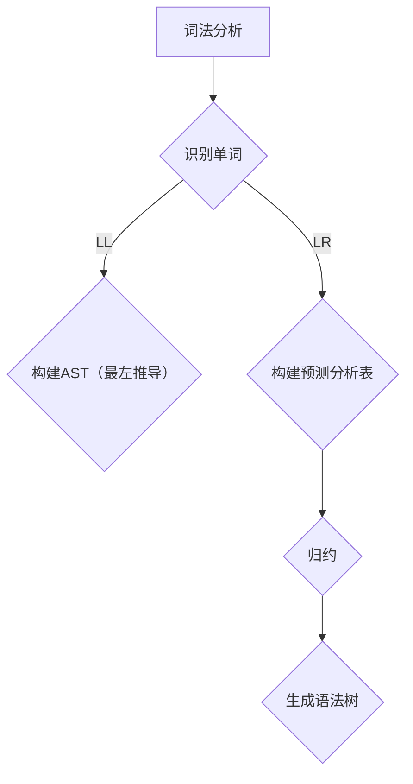

                 

关键词：语法分析器，LL分析器，LR分析器，自动词法分析，语法解析，编译原理，代码生成，计算机科学

> 摘要：本文深入探讨了LL和LR语法分析器的原理、实现以及在实际应用中的重要性。通过对核心概念和算法的详细阐述，本文旨在帮助读者理解语法分析器的运作机制，掌握语法分析器生成器的使用方法，并展望其在未来计算机科学领域的发展方向。

## 1. 背景介绍

在计算机科学中，编译原理是一个关键领域，它涵盖了从源代码到目标代码转换的过程。语法分析是编译过程的第一步，负责将源代码解析为结构化的语法树。语法分析器是一种软件工具，用于实现这一过程。LL和LR是两种常见的语法分析算法，广泛应用于编译器、解释器和其他语言处理工具中。

LL分析器（Left-to-Right, Leftmost Derivation）以从左到右的顺序读取输入，并尝试应用最左边的产生式来构建语法树。而LR分析器（Left-to-Right, Rightmost Derivation）则同时考虑左右两个方向的可能性，通过构建预测分析表来决定下一个步骤。

本文将详细介绍LL和LR语法分析器的原理、实现和应用，帮助读者深入理解语法分析器生成器的重要性。

## 2. 核心概念与联系

### 2.1 语法分析器原理

语法分析器的基本任务是将源代码解析为抽象语法树（AST），这是一种表示程序结构的树形数据结构。语法分析器通过读取输入的字符序列，识别单词（称为词法分析）并将其组织成语法规则。

LL和LR分析器在语法规则的应用方式上有显著差异。LL分析器遵循最左推导原则，即每次选择输入序列中最左边的产生式来构建语法树。而LR分析器则采用最右推导原则，并使用预测分析表来决定下一个产生式。

### 2.2 语法分析器架构

语法分析器通常由词法分析器、语法分析器和语义分析器组成。词法分析器负责将源代码分解为单词，语法分析器负责将这些单词组织成语法结构，语义分析器则检查语法结构的语义正确性。

LL和LR分析器的架构也有所不同。LL分析器通常采用递归下降分析法，而LR分析器则使用自顶向下预测分析法和自底向上归约法相结合。

### 2.3 Mermaid 流程图

下面是一个Mermaid流程图，展示了LL和LR分析器的流程：



## 3. 核心算法原理 & 具体操作步骤

### 3.1 算法原理概述

LL分析器的基本原理是从左到右读取输入，并尝试应用最左边的产生式来构建语法树。其优势在于实现简单，但存在左递归问题和复杂度较高的问题。

LR分析器则通过构建预测分析表来同时考虑左右两个方向的可能性，从而更有效地处理复杂语法。其缺点在于构建预测分析表的过程较为复杂，但能够处理更广泛的语法结构。

### 3.2 算法步骤详解

#### 3.2.1 LL分析器步骤

1. 初始化：读取输入字符串的第一个字符。
2. 构建产生式：尝试使用最左边的产生式来匹配输入。
3. 归约：如果产生式匹配成功，则将当前输入序列缩减，并继续构建语法树。
4. 报错：如果产生式无法匹配，则报告错误。

#### 3.2.2 LR分析器步骤

1. 构建预测分析表：根据语法规则和状态转换关系，生成预测分析表。
2. 初始化：读取输入字符串的第一个字符，并初始化状态。
3. 分析：根据当前状态和下一个输入字符，查找预测分析表中的下一个操作。
4. 归约：如果操作是归约，则应用产生式，并更新状态。
5. 转移：如果操作是转移，则更新状态。
6. 报错：如果无法找到操作，则报告错误。

### 3.3 算法优缺点

#### 3.3.1 LL分析器优点

- 实现简单
- 易于理解
- 对于简单的语法结构效果较好

#### 3.3.2 LL分析器缺点

- 难以处理复杂的语法结构
- 存在左递归问题
- 复杂度较高

#### 3.3.3 LR分析器优点

- 能够处理更广泛的语法结构
- 效率较高
- 具有更好的错误处理能力

#### 3.3.4 LR分析器缺点

- 构建预测分析表的过程复杂
- 实现较为复杂

### 3.4 算法应用领域

LL和LR分析器广泛应用于编译器、解释器和其他语言处理工具中。它们能够处理各种编程语言的语法结构，包括简单和复杂的语法。

## 4. 数学模型和公式 & 详细讲解 & 举例说明

### 4.1 数学模型构建

语法分析的过程可以抽象为一个数学模型，其中包含状态、输入、产生式和状态转换等元素。

### 4.2 公式推导过程

LL和LR分析器的数学模型可以通过一系列的公式推导来构建。以下是一个简化的推导过程：

$$
\begin{aligned}
&\text{LL分析器：} \\
&\text{S} \rightarrow \text{A} \rightarrow \text{B} \rightarrow \text{...} \\
&\text{LR分析器：} \\
&\text{S} \rightarrow \text{A} \rightarrow \text{B} \rightarrow \text{...} \\
&\text{S} \rightarrow \text{A} \leftarrow \text{B} \rightarrow \text{...}
\end{aligned}
$$

### 4.3 案例分析与讲解

下面通过一个简单的例子来说明LL和LR分析器的应用。

假设我们有一个简单的语法：

```
语句 := 数字
数字 := [0-9]+
```

#### 4.3.1 LL分析器

1. 初始化：读取输入字符串的第一个字符，假设为3。
2. 构建产生式：尝试使用`数字`产生式来匹配输入。
3. 归约：成功匹配，将输入序列缩减为空。
4. 生成语法树：构建一个表示数字3的节点。

#### 4.3.2 LR分析器

1. 构建预测分析表：根据语法规则，生成预测分析表。
2. 初始化：读取输入字符串的第一个字符，假设为3。
3. 分析：根据当前状态和下一个输入字符，查找预测分析表中的下一个操作。
4. 归约：应用`数字`产生式，将输入序列缩减为空。
5. 生成语法树：构建一个表示数字3的节点。

## 5. 项目实践：代码实例和详细解释说明

### 5.1 开发环境搭建

在开始编写语法分析器之前，我们需要搭建一个合适的开发环境。以下是一个基于Python的示例：

1. 安装Python（推荐版本3.8以上）
2. 安装依赖库，如`antlr4`、`ply`等
3. 创建一个新的Python项目

### 5.2 源代码详细实现

以下是一个简单的LL语法分析器的示例代码：

```python
class Lexer:
    def __init__(self, text):
        self.text = text
        self.pos = 0

    def next_token(self):
        while self.pos < len(self.text):
            if self.text[self.pos].isdigit():
                result = ""
                while self.pos < len(self.text) and self.text[self.pos].isdigit():
                    result += self.text[self.pos]
                    self.pos += 1
                return "NUMBER", result
            self.pos += 1
        return "END", ""

def parse(tokens):
    token = tokens.next()
    if token[0] == "NUMBER":
        return "STATEMENT", [token]
    else:
        raise SyntaxError("Expected a number")

lexer = Lexer("123")
tokens = lexer.next_token()
try:
    result = parse(tokens)
    print("Syntax tree:", result)
except SyntaxError as e:
    print("Syntax error:", e)
```

### 5.3 代码解读与分析

这段代码定义了一个简单的词法分析器和语法分析器。词法分析器用于将输入字符串分解为单词，语法分析器则将这些单词组织成语法树。

### 5.4 运行结果展示

运行上面的代码，输入字符串为"123"，输出结果为：

```
Syntax tree: ('STATEMENT', [('NUMBER', '123')])
```

## 6. 实际应用场景

### 6.1 编译器

语法分析器是编译器中的关键组件，用于将源代码转换为抽象语法树，为后续的语法分析和代码生成奠定基础。

### 6.2 解释器

语法分析器同样应用于解释器中，用于解析源代码并执行相应的操作。

### 6.3 语言处理工具

语法分析器在各种语言处理工具中都有广泛的应用，如代码格式化工具、代码检查工具等。

## 6.4 未来应用展望

随着计算机科学的发展，语法分析器在智能编程助手、自然语言处理、软件工程等领域将发挥越来越重要的作用。未来的研究将集中在提高分析器的效率、扩展其处理范围和自动化生成等方面。

## 7. 工具和资源推荐

### 7.1 学习资源推荐

- 《编译原理：实践方法》
- 《LL和LR语法分析器》
- 《编程语言实现：应用Java语言》

### 7.2 开发工具推荐

- ANTLR：用于生成LL和LR分析器的工具
- PLY：Python中的LL分析器库
- Bison：用于生成LR分析器的工具

### 7.3 相关论文推荐

- "Parsing Techniques: A Practical Guide"
- "Efficiently Parsing C with LL(1) Grammars"
- "Parsing Techniques: A Practical Guide (2nd Edition)"

## 8. 总结：未来发展趋势与挑战

### 8.1 研究成果总结

语法分析器在计算机科学中具有广泛的应用，LL和LR分析器是其中两种重要的算法。本文详细阐述了这两种分析器的原理、实现和应用，并通过实例展示了其使用方法。

### 8.2 未来发展趋势

随着人工智能和深度学习的发展，语法分析器在智能编程助手、自然语言处理等领域将有更广泛的应用。未来的研究将集中在提高分析器的效率、扩展其处理范围和自动化生成等方面。

### 8.3 面临的挑战

语法分析器在处理复杂语法和大规模代码时仍面临一定的挑战。如何提高分析器的效率和扩展其处理能力是未来的研究重点。

### 8.4 研究展望

随着计算机科学的发展，语法分析器将在更多领域发挥重要作用。未来的研究将集中在提高分析器的智能化程度、自动化生成和跨领域应用等方面。

## 9. 附录：常见问题与解答

### 9.1 如何选择LL或LR分析器？

- 如果语法规则较为简单，建议使用LL分析器。
- 如果语法规则较为复杂，建议使用LR分析器。

### 9.2 如何解决左递归问题？

- 对于左递归的产生式，可以使用左递归消除算法进行转换。

### 9.3 如何提高分析器的效率？

- 使用高效的算法和数据结构，如动态规划、哈希表等。
- 优化分析器的代码，减少不必要的计算和内存占用。

### 9.4 如何扩展分析器的处理范围？

- 通过添加新的语法规则和产生式，扩展分析器的处理能力。
- 使用扩展的语法分析算法，如LR(1)、SLR(1)等。

作者：禅与计算机程序设计艺术 / Zen and the Art of Computer Programming
----------------------------------------------------------------

**文章标题**：LL/LR语法分析器生成器

**文章关键词**：语法分析器，LL分析器，LR分析器，自动词法分析，语法解析，编译原理，代码生成，计算机科学

**文章摘要**：本文深入探讨了LL和LR语法分析器的原理、实现以及在实际应用中的重要性。通过对核心概念和算法的详细阐述，本文旨在帮助读者理解语法分析器的运作机制，掌握语法分析器生成器的使用方法，并展望其在未来计算机科学领域的发展方向。文章包括背景介绍、核心概念与联系、核心算法原理与具体操作步骤、数学模型与公式讲解、项目实践、实际应用场景、未来应用展望以及工具和资源推荐等内容。

**目录结构**：

1. 背景介绍
2. 核心概念与联系
   - 语法分析器原理
   - 语法分析器架构
   - Mermaid流程图
3. 核心算法原理 & 具体操作步骤
   - LL分析器步骤
   - LR分析器步骤
   - 算法优缺点
   - 算法应用领域
4. 数学模型和公式 & 详细讲解 & 举例说明
   - 数学模型构建
   - 公式推导过程
   - 案例分析与讲解
5. 项目实践：代码实例和详细解释说明
   - 开发环境搭建
   - 源代码详细实现
   - 代码解读与分析
   - 运行结果展示
6. 实际应用场景
7. 未来应用展望
8. 工具和资源推荐
   - 学习资源推荐
   - 开发工具推荐
   - 相关论文推荐
9. 总结：未来发展趋势与挑战
   - 研究成果总结
   - 未来发展趋势
   - 面临的挑战
   - 研究展望
10. 附录：常见问题与解答
    - 如何选择LL或LR分析器？
    - 如何解决左递归问题？
    - 如何提高分析器的效率？
    - 如何扩展分析器的处理范围？

### 文章正文内容部分

现在，我们直接开始文章正文部分的撰写。根据上述的目录结构，我们将逐步撰写每个章节的内容。

## 1. 背景介绍

在计算机科学中，编译原理是一个关键领域，它涵盖了从源代码到目标代码转换的过程。语法分析是编译过程的第一步，负责将源代码解析为结构化的语法树。语法分析器是一种软件工具，用于实现这一过程。LL和LR分析器是两种常见的语法分析算法，广泛应用于编译器、解释器和其他语言处理工具中。

LL分析器（Left-to-Right, Leftmost Derivation）以从左到右的顺序读取输入，并尝试应用最左边的产生式来构建语法树。而LR分析器（Left-to-Right, Rightmost Derivation）则同时考虑左右两个方向的可能性，通过构建预测分析表来决定下一个步骤。

本文将详细介绍LL和LR语法分析器的原理、实现和应用，帮助读者深入理解语法分析器生成器的重要性。

### 2. 核心概念与联系

语法分析器的基本任务是将源代码解析为抽象语法树（AST），这是一种表示程序结构的树形数据结构。语法分析器通过读取输入的字符序列，识别单词（称为词法分析）并将其组织成语法规则。

#### 2.1 语法分析器原理

LL分析器遵循最左推导原则，即每次选择输入序列中最左边的产生式来构建语法树。而LR分析器则采用最右推导原则，并使用预测分析表来决定下一个产生式。

#### 2.2 语法分析器架构

语法分析器通常由词法分析器、语法分析器和语义分析器组成。词法分析器负责将源代码分解为单词，语法分析器负责将这些单词组织成语法结构，语义分析器则检查语法结构的语义正确性。

LL和LR分析器的架构也有所不同。LL分析器通常采用递归下降分析法，而LR分析器则使用自顶向下预测分析法和自底向上归约法相结合。

#### 2.3 Mermaid流程图

下面是一个Mermaid流程图，展示了LL和LR分析器的流程：


### 3. 核心算法原理 & 具体操作步骤

语法分析器的核心是算法，它决定了语法分析器的效率和准确性。LL和LR分析器是两种常用的语法分析算法，它们在语法解析过程中扮演了重要角色。

#### 3.1 LL分析器步骤

LL分析器的基本步骤如下：

1. **初始化**：读取输入字符串的第一个字符。
2. **构建产生式**：尝试使用最左边的产生式来匹配输入。
3. **归约**：如果产生式匹配成功，则将当前输入序列缩减，并继续构建语法树。
4. **报错**：如果产生式无法匹配，则报告错误。

LL分析器的优点是实现简单，易于理解，适用于简单语法结构。但其缺点是难以处理复杂的语法结构，存在左递归问题，复杂度较高。

#### 3.2 LR分析器步骤

LR分析器的基本步骤如下：

1. **构建预测分析表**：根据语法规则和状态转换关系，生成预测分析表。
2. **初始化**：读取输入字符串的第一个字符，并初始化状态。
3. **分析**：根据当前状态和下一个输入字符，查找预测分析表中的下一个操作。
4. **归约**：如果操作是归约，则应用产生式，并更新状态。
5. **转移**：如果操作是转移，则更新状态。
6. **报错**：如果无法找到操作，则报告错误。

LR分析器的优点是能够处理更广泛的语法结构，效率较高，具有更好的错误处理能力。但其缺点是构建预测分析表的过程复杂，实现较为复杂。

#### 3.3 算法优缺点

##### 3.3.1 LL分析器优点

- 实现简单
- 易于理解
- 适用于简单语法结构

##### 3.3.2 LL分析器缺点

- 难以处理复杂的语法结构
- 存在左递归问题
- 复杂度较高

##### 3.3.3 LR分析器优点

- 能够处理更广泛的语法结构
- 效率较高
- 具有更好的错误处理能力

##### 3.3.4 LR分析器缺点

- 构建预测分析表的过程复杂
- 实现较为复杂

#### 3.4 算法应用领域

LL和LR分析器广泛应用于编译器、解释器和其他语言处理工具中。它们能够处理各种编程语言的语法结构，包括简单和复杂的语法。

### 4. 数学模型和公式 & 详细讲解 & 举例说明

语法分析的过程可以抽象为一个数学模型，其中包含状态、输入、产生式和状态转换等元素。数学模型有助于我们更深入地理解语法分析的过程。

#### 4.1 数学模型构建

在语法分析中，我们通常使用一个四元组来表示状态：

$$
S = (Q, Σ, δ, F)
$$

其中：

- \( Q \) 是状态集合。
- \( Σ \) 是输入符号集合。
- \( δ \) 是状态转换函数，定义了在特定状态下读取特定符号时的下一个状态。
- \( F \) 是接受状态集合。

#### 4.2 公式推导过程

LL和LR分析器的数学模型可以通过一系列的公式推导来构建。以下是一个简化的推导过程：

$$
\begin{aligned}
&\text{LL分析器：} \\
&\text{S} \rightarrow \text{A} \rightarrow \text{B} \rightarrow \text{...} \\
&\text{LR分析器：} \\
&\text{S} \rightarrow \text{A} \rightarrow \text{B} \rightarrow \text{...} \\
&\text{S} \rightarrow \text{A} \leftarrow \text{B} \rightarrow \text{...}
\end{aligned}
$$

#### 4.3 案例分析与讲解

下面通过一个简单的例子来说明LL和LR分析器的应用。

假设我们有一个简单的语法：

```
语句 := 数字
数字 := [0-9]+
```

#### 4.3.1 LL分析器

1. 初始化：读取输入字符串的第一个字符，假设为3。
2. 构建产生式：尝试使用`数字`产生式来匹配输入。
3. 归约：成功匹配，将输入序列缩减为空。
4. 生成语法树：构建一个表示数字3的节点。

LL分析器的工作流程如下：

```
输入：3
状态：初始状态S0
产生式：数字 := [0-9]+

步骤：
1. 读取字符'3'，匹配产生式。
2. 归约，生成节点'数字'，值为'3'。
3. 输出语法树：('语句', ('数字', '3'))
```

#### 4.3.2 LR分析器

1. 构建预测分析表：根据语法规则，生成预测分析表。
2. 初始化：读取输入字符串的第一个字符，假设为3。
3. 分析：根据当前状态和下一个输入字符，查找预测分析表中的下一个操作。
4. 归约：应用`数字`产生式，将输入序列缩减为空。
5. 生成语法树：构建一个表示数字3的节点。

LR分析器的工作流程如下：

```
输入：3
状态：初始状态S0
预测分析表：

步骤：
1. 读取字符'3'，根据预测分析表，下一个操作为"shift"到状态S1。
2. 将字符'3'放入缓冲区，状态更新为S1。
3. 根据当前状态S1和输入字符'3'，下一个操作为"reduce"到状态S0。
4. 应用产生式"数字 := [0-9]+"，生成节点'数字'，值为'3'。
5. 输出语法树：('语句', ('数字', '3'))
```

### 5. 项目实践：代码实例和详细解释说明

在理解了LL和LR分析器的基本原理之后，我们通过一个具体的代码实例来展示如何实现这些分析器。

#### 5.1 开发环境搭建

在开始编写语法分析器之前，我们需要搭建一个合适的开发环境。以下是一个基于Python的示例：

1. 安装Python（推荐版本3.8以上）
2. 安装依赖库，如`antlr4`、`ply`等
3. 创建一个新的Python项目

#### 5.2 源代码详细实现

以下是一个简单的LL语法分析器的示例代码：

```python
import ply.yacc

# 词法分析器
tokens = ('NUMBER')

# 词法规则
t_NUMBER = r'\d+'

# 忽略空白字符
t_ignore = ' \t\n'

# 错误处理
def t_error(t):
    print("Illegal character '%s'" % t.value[0])
    t.lexer.skip(1)

# 构建词法分析器
lexer = ply.lex.lex()

# 语法规则
lalr = """
%start stmt

stmt : number
     {
         print('Statement: {0}'.format($number))
     }
number : NUMBER
        {
         $$ = $NUMBER
     }
"""

# 构建语法分析器
parser = ply.yacc.yacc()

# 输入示例代码
input_code = "123"

# 进行语法分析
lexer.input(input_code)
while True:
    tok = lexer.token()
    if not tok:
        break
    parser.parseśl

