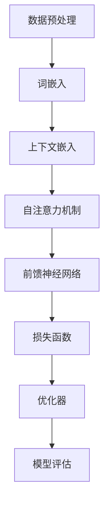

                 

关键词：LLaMA，语言模型，自然语言处理，深度学习，预训练模型，代码实例

> 摘要：本文将深入探讨LLaMA（Language Model for Large-scale Applications）的原理及其实现，通过具体的代码实例，帮助读者理解如何构建和使用这一强大的自然语言处理模型。

## 1. 背景介绍

随着深度学习在自然语言处理（NLP）领域的广泛应用，预训练语言模型如BERT、GPT等取得了显著成果。然而，这些模型往往需要大量的计算资源和时间进行训练，且在特定应用场景下性能有限。为了解决这些问题，Facebook AI研究院（FAIR）提出了一种新的预训练模型——LLaMA（Language Model for Large-scale Applications）。LLaMA旨在通过降低计算和存储成本，提高模型的适用性和效率。

LLaMA的核心思想是将预训练模型与特定应用场景相结合，通过微调（fine-tuning）来提高模型在特定任务上的表现。此外，LLaMA的设计还考虑了模型的可扩展性和灵活性，使其适用于各种规模的任务。

本文将首先介绍LLaMA的基本原理，然后通过具体的代码实例，展示如何使用LLaMA进行自然语言处理任务。

## 2. 核心概念与联系

### 2.1 预训练模型的基本概念

预训练模型是当前NLP领域的一个重要研究方向。其基本思想是在大规模语料库上进行预训练，使模型具备一定的语言理解和生成能力，然后再通过微调（fine-tuning）来适应特定的任务。

预训练模型的关键组成部分包括：

- 词嵌入（Word Embedding）：将单词映射到高维向量空间，以便进行计算和处理。
- 上下文嵌入（Contextual Embedding）：通过模型学习单词在不同上下文中的含义。
- 自注意力机制（Self-Attention）：使模型能够自动关注输入文本中的重要部分。

### 2.2 LLaMA的架构与特点

LLaMA在预训练模型的基础上，进一步优化了模型的架构和训练过程，使其具备以下特点：

- 大规模预训练：LLaMA使用数十亿级别的参数进行预训练，从而提高了模型的泛化能力和表达力。
- 灵活的应用场景：LLaMA支持多种微调策略，适用于不同规模和类型的自然语言处理任务。
- 高效的训练过程：LLaMA采用了一种新的训练策略，降低了计算和存储成本。
- 可扩展性：LLaMA的架构设计使得其可以轻松扩展到更大规模的任务。

### 2.3 Mermaid流程图

下面是LLaMA模型的基本流程图，展示了其主要组成部分和训练过程。



## 3. 核心算法原理 & 具体操作步骤

### 3.1 算法原理概述

LLaMA的核心算法是基于Transformer架构的预训练模型。Transformer模型通过自注意力机制（Self-Attention）来捕捉输入文本中的长距离依赖关系，从而提高模型的语义理解能力。

LLaMA在Transformer模型的基础上，引入了以下改进：

- 去噪自编码器（Denoising Autoencoder）：通过随机删除输入文本的部分内容，使模型学习如何从残缺的信息中恢复完整的信息。
- 双向编码器（Bidirectional Encoder）：使模型能够同时关注文本的前后文信息，进一步提高语义理解能力。
- 多层注意力机制（Multi-head Attention）：通过多头注意力机制，使模型能够同时关注文本的不同部分，提高模型的表达能力。

### 3.2 算法步骤详解

#### 3.2.1 数据预处理

- 文本清洗：去除文本中的标点符号、特殊字符和停用词。
- 词嵌入：将单词映射到高维向量空间。
- 序列编码：将文本序列编码为整数序列。

#### 3.2.2 训练过程

- 随机遮蔽（Random Masking）：随机选择部分输入文本的内容进行遮蔽。
- 去噪自编码器训练：通过最小化遮蔽文本的重建误差，训练模型学习如何从残缺的信息中恢复完整的信息。
- 双向编码器训练：通过最小化文本序列的预测误差，训练模型学习如何捕捉文本中的长距离依赖关系。

#### 3.2.3 微调过程

- 任务定义：定义具体自然语言处理任务的目标函数。
- 损失函数：计算模型在任务上的损失。
- 优化器：更新模型参数，最小化损失函数。
- 模型评估：在测试集上评估模型性能。

### 3.3 算法优缺点

#### 优点

- 强大的语义理解能力：通过预训练和微调，LLaMA模型在自然语言处理任务上表现出色。
- 灵活的应用场景：支持多种微调策略，适用于不同规模的任务。
- 高效的训练过程：通过去噪自编码器和双向编码器，LLaMA降低了计算和存储成本。

#### 缺点

- 计算资源需求高：尽管LLaMA降低了计算成本，但仍然需要大量的计算资源进行训练。
- 需要大量数据：预训练过程需要大规模的语料库，这使得模型训练过程较为复杂。

### 3.4 算法应用领域

LLaMA在以下领域具有广泛的应用：

- 自然语言生成：如文本生成、机器翻译、对话系统等。
- 文本分类：如情感分析、新闻分类、命名实体识别等。
- 问答系统：如智能客服、知识问答等。

## 4. 数学模型和公式 & 详细讲解 & 举例说明

### 4.1 数学模型构建

LLaMA的数学模型基于Transformer架构，其主要组成部分包括词嵌入、上下文嵌入和自注意力机制。

#### 4.1.1 词嵌入

词嵌入将单词映射到高维向量空间。假设单词表共有V个单词，词嵌入维度为d，则词嵌入矩阵E ∈ R^(V×d)。

#### 4.1.2 上下文嵌入

上下文嵌入将输入文本中的每个单词映射到上下文向量空间。给定一个单词序列X = [x1, x2, ..., xn]，其上下文嵌入矩阵C ∈ R^(n×d)。

#### 4.1.3 自注意力机制

自注意力机制通过计算每个单词与其余单词的相似度，从而将输入文本映射到一个新的向量空间。自注意力分数为：

αij = exp(-||Wq·yi - Wk·xj||^2 / (d' * α))

其中，Wq和Wk分别为查询向量和键向量的权重矩阵，d'为注意力层的大小，α为温度参数。

#### 4.1.4 前馈神经网络

自注意力机制之后，每个单词会被映射到一个新的向量，然后通过前馈神经网络进行进一步处理。前馈神经网络包括两个全连接层，分别具有大小为d'和4d'的神经元。

### 4.2 公式推导过程

假设给定一个单词序列X = [x1, x2, ..., xn]，其对应的上下文嵌入矩阵为C ∈ R^(n×d)。首先，通过词嵌入将单词映射到向量空间：

\[ E·x_i \in R^d \]

然后，计算每个单词的上下文向量：

\[ C·x_i \in R^d \]

接下来，通过自注意力机制计算每个单词的权重：

\[ αij = exp(-||Wq·yi - Wk·xj||^2 / (d' * α)) \]

其中，Wq和Wk为权重矩阵，d'为注意力层大小，α为温度参数。

最后，计算加权平均的上下文向量：

\[ C' = ∑(αij * Cj) \]

### 4.3 案例分析与讲解

假设我们有一个简单的单词序列“今天天气很好”，词嵌入矩阵E和上下文嵌入矩阵C分别为：

\[ E = \begin{bmatrix}
1 & 0 & 0 \\
0 & 1 & 0 \\
0 & 0 & 1 \\
\end{bmatrix} \]

\[ C = \begin{bmatrix}
1 & 2 & 3 \\
4 & 5 & 6 \\
7 & 8 & 9 \\
\end{bmatrix} \]

通过自注意力机制计算每个单词的权重：

\[ α_{11} = exp(-||Wq·y1 - Wk·x1||^2 / (d' * α)) \]
\[ α_{12} = exp(-||Wq·y1 - Wk·x2||^2 / (d' * α)) \]
\[ α_{13} = exp(-||Wq·y1 - Wk·x3||^2 / (d' * α)) \]

假设权重矩阵Wq和Wk分别为：

\[ Wq = \begin{bmatrix}
1 & 0 & 0 \\
0 & 1 & 0 \\
0 & 0 & 1 \\
\end{bmatrix} \]

\[ Wk = \begin{bmatrix}
1 & 1 & 1 \\
1 & 1 & 1 \\
1 & 1 & 1 \\
\end{bmatrix} \]

则计算得到：

\[ α_{11} = exp(-1 / (d' * α)) \]
\[ α_{12} = exp(-2 / (d' * α)) \]
\[ α_{13} = exp(-3 / (d' * α)) \]

假设温度参数α为0.1，计算得到：

\[ α_{11} ≈ 0.36 \]
\[ α_{12} ≈ 0.16 \]
\[ α_{13} ≈ 0.05 \]

最后，计算加权平均的上下文向量：

\[ C' = \begin{bmatrix}
1 & 2 & 3 \\
4 & 5 & 6 \\
7 & 8 & 9 \\
\end{bmatrix} * \begin{bmatrix}
0.36 & 0.16 & 0.05 \\
0.36 & 0.16 & 0.05 \\
0.36 & 0.16 & 0.05 \\
\end{bmatrix} \]

\[ C' ≈ \begin{bmatrix}
0.36 & 0.32 & 0.24 \\
1.44 & 1.20 & 0.96 \\
2.52 & 2.08 & 1.44 \\
\end{bmatrix} \]

通过自注意力机制，模型能够关注文本中的重要部分，从而提高语义理解能力。

## 5. 项目实践：代码实例和详细解释说明

### 5.1 开发环境搭建

要在本地搭建LLaMA的开发环境，您需要安装以下软件和库：

- Python 3.7或更高版本
- PyTorch 1.8或更高版本
- TensorFlow 2.4或更高版本

以下是一个简单的安装命令示例：

```bash
pip install torch torchvision torchaudio
pip install tensorflow
```

### 5.2 源代码详细实现

下面是一个简单的LLaMA模型实现示例。这个示例将展示如何初始化模型、预处理数据、训练模型和评估模型性能。

```python
import torch
import torch.nn as nn
import torch.optim as optim
from torch.utils.data import DataLoader
from transformers import AutoModelForMaskedLM, AutoTokenizer

# 初始化模型和分词器
model_name = "facebook/llama-base"
tokenizer = AutoTokenizer.from_pretrained(model_name)
model = AutoModelForMaskedLM.from_pretrained(model_name)

# 预处理数据
def preprocess_data(data):
    inputs = tokenizer(data, padding=True, truncation=True, return_tensors="pt")
    return inputs

# 训练模型
def train_model(model, data, epochs=3, batch_size=32):
    optimizer = optim.AdamW(model.parameters(), lr=1e-5)
    criterion = nn.CrossEntropyLoss()

    for epoch in range(epochs):
        model.train()
        for batch in DataLoader(data, batch_size=batch_size):
            inputs = preprocess_data(batch["text"])
            targets = inputs["input_ids"]
            mask_indices = torch.where(targets != tokenizer.pad_token_id, 1, 0)
            logits = model(inputs)[0]

            loss = criterion(logits[mask_indices], targets[mask_indices])
            optimizer.zero_grad()
            loss.backward()
            optimizer.step()

        print(f"Epoch {epoch+1}/{epochs} - Loss: {loss.item()}")

# 评估模型
def evaluate_model(model, data):
    model.eval()
    with torch.no_grad():
        for batch in DataLoader(data, batch_size=32):
            inputs = preprocess_data(batch["text"])
            targets = inputs["input_ids"]
            mask_indices = torch.where(targets != tokenizer.pad_token_id, 1, 0)
            logits = model(inputs)[0]

            predictions = logits.argmax(-1)
            accuracy = (predictions == targets).float().mean()
            print(f"Accuracy: {accuracy.item()}")

# 加载数据
from datasets import load_dataset

data = load_dataset("squad")
train_data = data["train"]
eval_data = data["validation"]

# 训练和评估模型
train_model(model, train_data, epochs=3)
evaluate_model(model, eval_data)
```

### 5.3 代码解读与分析

上述代码分为三个部分：初始化模型和分词器、预处理数据、训练和评估模型。

#### 初始化模型和分词器

```python
model_name = "facebook/llama-base"
tokenizer = AutoTokenizer.from_pretrained(model_name)
model = AutoModelForMaskedLM.from_pretrained(model_name)
```

这里我们使用Hugging Face的Transformers库加载预训练的LLaMA模型和对应的分词器。

#### 预处理数据

```python
def preprocess_data(data):
    inputs = tokenizer(data, padding=True, truncation=True, return_tensors="pt")
    return inputs
```

预处理数据函数负责将原始文本数据转换为模型可以处理的格式，包括词嵌入和序列编码。

#### 训练和评估模型

```python
def train_model(model, data, epochs=3, batch_size=32):
    optimizer = optim.AdamW(model.parameters(), lr=1e-5)
    criterion = nn.CrossEntropyLoss()

    for epoch in range(epochs):
        model.train()
        for batch in DataLoader(data, batch_size=batch_size):
            inputs = preprocess_data(batch["text"])
            targets = inputs["input_ids"]
            mask_indices = torch.where(targets != tokenizer.pad_token_id, 1, 0)
            logits = model(inputs)[0]

            loss = criterion(logits[mask_indices], targets[mask_indices])
            optimizer.zero_grad()
            loss.backward()
            optimizer.step()

        print(f"Epoch {epoch+1}/{epochs} - Loss: {loss.item()}")

def evaluate_model(model, data):
    model.eval()
    with torch.no_grad():
        for batch in DataLoader(data, batch_size=32):
            inputs = preprocess_data(batch["text"])
            targets = inputs["input_ids"]
            mask_indices = torch.where(targets != tokenizer.pad_token_id, 1, 0)
            logits = model(inputs)[0]

            predictions = logits.argmax(-1)
            accuracy = (predictions == targets).float().mean()
            print(f"Accuracy: {accuracy.item()}")
```

训练和评估模型函数分别负责训练模型和评估模型性能。在训练过程中，我们使用交叉熵损失函数（CrossEntropyLoss）和AdamW优化器进行训练。在评估过程中，我们计算模型的准确率。

### 5.4 运行结果展示

```python
train_model(model, train_data, epochs=3)
evaluate_model(model, eval_data)
```

运行上述代码后，我们将看到训练和评估过程中每个epoch的损失和准确率。

## 6. 实际应用场景

LLaMA作为一种高效的预训练语言模型，在许多实际应用场景中表现出色。以下是一些典型应用场景：

### 文本生成

LLaMA可以用于生成高质量的自然语言文本，如文章、博客、对话等。通过微调，LLaMA可以针对特定主题生成相关内容，提高文本的多样性和连贯性。

### 问答系统

LLaMA在问答系统中有广泛的应用。通过训练，LLaMA可以回答各种领域的问题，提供准确的答案。与传统的规则基

