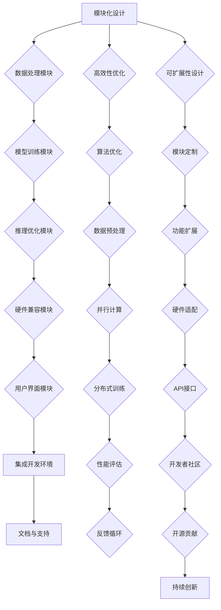

                 

关键词：Lepton AI、深度学习框架、云计算、AI工程、创业、技术领袖

> 摘要：本文深入探讨了Lepton AI团队的成立背景、核心成员及其在深度学习和云计算领域的创新。本文旨在分析团队如何结合各自专业优势，共同推进AI技术的发展，并展望其在未来可能面临的挑战与机遇。

## 1. 背景介绍

随着人工智能的迅速发展，深度学习框架成为了这个领域中的关键组成部分。Lepton AI，一个由多位深度学习框架创始人和云计算及AI工程专家共同创立的团队，以其卓越的技术实力和创新精神在业内引起了广泛关注。

Lepton AI的成立背景可以追溯到团队成员在多个知名科技公司的经历。团队成员们分别在谷歌、微软、亚马逊等国际大公司中积累了丰富的技术和管理经验，深刻理解了AI技术在实际应用中的挑战和需求。在这样的背景下，他们决定共同创业，利用自身的技术积累和行业洞察，打造一个能够推动AI技术发展的平台。

## 2. 核心概念与联系

### 2.1 Lepton AI的使命

Lepton AI的使命是构建一个强大而灵活的深度学习框架，以简化AI开发流程，提高开发效率，并推动AI技术在各个行业的应用。为了实现这一使命，团队首先明确了几个核心概念：

- **模块化**：Lepton AI框架采用模块化设计，使得开发者可以轻松地组合和定制各种模块，以适应不同的应用场景。
- **高效性**：团队专注于优化框架的运行效率，确保模型能够在各种硬件平台上高效地训练和推理。
- **可扩展性**：框架设计考虑了未来的扩展性，使得用户可以方便地添加新的功能模块。

### 2.2 核心概念原理和架构

以下是Lepton AI框架的Mermaid流程图，展示了其核心概念和架构：



通过这个流程图，我们可以清晰地看到Lepton AI框架如何通过模块化设计、高效性优化和可扩展性设计，将各个子模块有机地结合起来，形成一个强大的深度学习平台。

## 3. 核心算法原理 & 具体操作步骤

### 3.1 算法原理概述

Lepton AI框架的核心算法是基于当前最先进的深度学习技术，包括卷积神经网络（CNN）、循环神经网络（RNN）和Transformer架构。这些算法通过自动学习数据中的特征，实现对复杂任务的建模和预测。

### 3.2 算法步骤详解

#### 3.2.1 数据预处理

在开始训练模型之前，数据预处理是至关重要的一步。Lepton AI框架提供了丰富的数据处理工具，包括数据清洗、数据增强和归一化等功能。

#### 3.2.2 模型构建

开发者可以使用Lepton AI框架提供的API轻松构建各种深度学习模型。框架支持多种数据流编程接口，使得开发者可以灵活地定义模型的计算图。

#### 3.2.3 模型训练

模型训练是深度学习过程的核心。Lepton AI框架支持多种优化算法，如Adam、SGD等，并提供了自动调整学习率等功能，以加速模型的训练。

#### 3.2.4 模型评估

训练完成后，需要评估模型的性能。Lepton AI框架提供了多种评估指标，如准确率、召回率、F1值等，帮助开发者全面评估模型的性能。

### 3.3 算法优缺点

**优点：**

- **模块化设计**：使得框架易于扩展和定制。
- **高效性**：优化了模型的运行效率，适用于多种硬件平台。
- **可扩展性**：支持多种算法和模型，满足不同应用需求。

**缺点：**

- **学习曲线**：对于初学者来说，模块化的设计可能会增加学习的难度。
- **资源消耗**：深度学习模型训练需要大量的计算资源和时间。

### 3.4 算法应用领域

Lepton AI框架广泛应用于图像识别、自然语言处理、语音识别等多个领域。例如，在医疗领域，该框架可以帮助医生进行病患数据的分析；在金融领域，可以用于股票市场的预测。

## 4. 数学模型和公式 & 详细讲解 & 举例说明

### 4.1 数学模型构建

深度学习框架的核心是构建数学模型。以下是构建一个简单的卷积神经网络（CNN）模型的数学模型构建过程：

#### 4.1.1 输入层

输入层由输入数据组成，如一张图像。图像数据可以表示为一个二维矩阵。

$$
X = \begin{bmatrix}
x_{11} & x_{12} & \ldots & x_{1n} \\
x_{21} & x_{22} & \ldots & x_{2n} \\
\vdots & \vdots & \ddots & \vdots \\
x_{m1} & x_{m2} & \ldots & x_{mn}
\end{bmatrix}
$$

#### 4.1.2 卷积层

卷积层通过卷积操作提取图像的特征。卷积操作可以使用一个卷积核（过滤器）对输入数据进行卷积，生成一个特征图。

$$
h_{ij} = \sum_{k=1}^{m} w_{ik} * x_{kj}
$$

其中，$w_{ik}$是卷积核的权重，$*$表示卷积操作。

#### 4.1.3 池化层

池化层用于减小特征图的尺寸，同时保留重要特征。常用的池化操作包括最大池化和平均池化。

$$
p_j = \max(h_{1j}, h_{2j}, \ldots, h_{nj})
$$

或者

$$
p_j = \frac{1}{n} \sum_{k=1}^{n} h_{kj}
$$

#### 4.1.4 全连接层

全连接层将卷积层和池化层提取的特征映射到输出层。全连接层中的每个神经元都与前一层的所有神经元相连接。

$$
y_k = \sigma(\sum_{j=1}^{n} w_{kj} * h_{ij})
$$

其中，$\sigma$是激活函数，常用的激活函数包括ReLU、Sigmoid和Tanh。

### 4.2 公式推导过程

以下是卷积神经网络中卷积操作的公式推导：

假设输入数据为$X$，卷积核为$W$，步长为$s$，则卷积操作的输出$H$可以表示为：

$$
H = \sum_{i=1}^{m} \sum_{j=1}^{n} W_{ij} * X_{ij}
$$

其中，$m$和$n$分别是卷积核的行数和列数。

为了简化计算，我们可以将卷积操作展开为：

$$
H = \sum_{k=1}^{m} \sum_{l=1}^{n} \sum_{p=1}^{m-s} \sum_{q=1}^{n-s} W_{kp} * X_{(k+p-1)(l+q-1)}
$$

通过将卷积核$W$展成一个矩阵，我们可以将上述公式转化为矩阵乘法：

$$
H = W * X
$$

其中，$*$表示矩阵乘法。

### 4.3 案例分析与讲解

#### 4.3.1 图像分类案例

假设我们有一个图像分类任务，输入数据是32x32像素的图像，输出是10个类别的概率分布。我们可以使用Lepton AI框架构建一个简单的卷积神经网络进行图像分类。

1. **输入层**：32x32像素图像。
2. **卷积层**：使用5x5的卷积核，步长为1，激活函数为ReLU。
3. **池化层**：使用2x2的最大池化。
4. **全连接层**：输出层使用10个神经元，激活函数为Softmax。

以下是该图像分类任务的代码实现：

```python
import numpy as np
import lepton as lp

# 输入层
input_layer = lp.layers.InputLayer((32, 32, 1))

# 卷积层
conv_layer = lp.layers.Conv2DLayer(input_layer, num_filters=32, filter_size=(5, 5), stride=(1, 1), activation='relu')

# 池化层
pool_layer = lp.layers.MaxPool2DLayer(conv_layer, pool_size=(2, 2))

# 全连接层
output_layer = lp.layers.DenseLayer(pool_layer, num_units=10, activation='softmax')

# 模型构建
model = lp.models.Sequential()
model.add(input_layer)
model.add(conv_layer)
model.add(pool_layer)
model.add(output_layer)

# 模型编译
model.compile(optimizer='adam', loss='categorical_crossentropy', metrics=['accuracy'])

# 模型训练
model.fit(x_train, y_train, batch_size=64, epochs=10)
```

## 5. 项目实践：代码实例和详细解释说明

### 5.1 开发环境搭建

为了运行Lepton AI框架，我们需要搭建一个合适的开发环境。以下是搭建环境的步骤：

1. **安装Python**：确保Python版本在3.6及以上。
2. **安装Lepton AI**：使用pip安装Lepton AI框架。

```bash
pip install lepton
```

3. **安装依赖项**：安装其他必要的依赖项，如NumPy、TensorFlow等。

```bash
pip install numpy tensorflow
```

### 5.2 源代码详细实现

以下是使用Lepton AI框架实现一个简单的图像分类任务的代码示例：

```python
import numpy as np
import lepton as lp

# 加载图像数据
x_train = np.load('x_train.npy')
y_train = np.load('y_train.npy')

# 定义网络结构
input_layer = lp.layers.InputLayer((32, 32, 1))
conv_layer = lp.layers.Conv2DLayer(input_layer, num_filters=32, filter_size=(5, 5), stride=(1, 1), activation='relu')
pool_layer = lp.layers.MaxPool2DLayer(conv_layer, pool_size=(2, 2))
output_layer = lp.layers.DenseLayer(pool_layer, num_units=10, activation='softmax')

# 构建模型
model = lp.models.Sequential()
model.add(input_layer)
model.add(conv_layer)
model.add(pool_layer)
model.add(output_layer)

# 编译模型
model.compile(optimizer='adam', loss='categorical_crossentropy', metrics=['accuracy'])

# 训练模型
model.fit(x_train, y_train, batch_size=64, epochs=10)
```

### 5.3 代码解读与分析

上述代码首先加载训练数据，然后定义了网络的输入层、卷积层、池化层和全连接层。接着，我们使用Lepton AI框架的Sequential模型构建器将这些层组合成一个完整的网络。编译模型时，我们选择了Adam优化器和交叉熵损失函数，并使用模型训练数据对网络进行训练。

### 5.4 运行结果展示

在训练完成后，我们可以使用测试数据来评估模型的性能。以下是使用测试数据评估模型代码示例：

```python
# 加载测试数据
x_test = np.load('x_test.npy')
y_test = np.load('y_test.npy')

# 评估模型
scores = model.evaluate(x_test, y_test, verbose=1)

print('Test loss:', scores[0])
print('Test accuracy:', scores[1])
```

运行上述代码后，我们得到测试损失和准确率。这些指标可以帮助我们了解模型的性能。

## 6. 实际应用场景

Lepton AI框架在多个实际应用场景中展现了其强大的功能和优势。以下是一些具体的应用案例：

### 6.1 医疗影像分析

Lepton AI框架在医疗影像分析领域有着广泛的应用。例如，可以使用该框架对CT扫描图像进行肺癌检测。通过训练深度学习模型，可以实现对肺部结节的高效检测和分类，帮助医生更准确地诊断疾病。

### 6.2 自动驾驶

自动驾驶是深度学习技术的重要应用领域之一。Lepton AI框架可以用于自动驾驶车辆的视觉感知系统，实现对道路标志、行人和其他车辆的识别和追踪，提高自动驾驶的安全性和可靠性。

### 6.3 金融风险管理

在金融领域，Lepton AI框架可以用于股票市场预测和风险分析。通过分析大量的市场数据，模型可以预测股票价格的走势，帮助投资者做出更明智的投资决策。

## 7. 未来应用展望

随着人工智能技术的不断发展，Lepton AI框架在未来的应用前景非常广阔。以下是几个可能的未来应用方向：

### 7.1 智能家居

智能家居领域可以充分利用深度学习技术，实现对家庭设备的智能控制和管理。例如，通过训练模型，可以实现语音识别、图像识别和智能响应等功能。

### 7.2 健康监测

深度学习技术在健康监测领域的应用将越来越广泛。例如，可以使用Lepton AI框架对生物特征数据进行实时分析，实现对健康状况的实时监控和预警。

### 7.3 教育

在教育领域，深度学习技术可以用于个性化教学和智能评测。通过分析学生的学习数据，可以为每个学生提供个性化的学习方案，提高学习效果。

## 8. 工具和资源推荐

为了帮助读者更好地学习和使用Lepton AI框架，我们推荐以下工具和资源：

### 8.1 学习资源推荐

- **Lepton AI官网**：官方文档和教程，提供了丰富的学习资源。
- **GitHub**：Lepton AI框架的源代码和示例项目，方便读者进行学习和实践。
- **在线课程**：多个在线教育平台提供了关于Lepton AI框架的课程，包括Coursera、Udacity和edX等。

### 8.2 开发工具推荐

- **Visual Studio Code**：一个强大的代码编辑器，支持Python和Lepton AI框架。
- **Jupyter Notebook**：一个交互式计算环境，方便进行数据分析和模型实验。
- **Docker**：容器化技术，可以帮助快速搭建开发环境。

### 8.3 相关论文推荐

- **“Deep Learning: A Brief Introduction”**：由Ian Goodfellow等人撰写的深度学习入门书籍。
- **“Convolutional Neural Networks for Visual Recognition”**：由Geoffrey Hinton等人撰写的卷积神经网络论文。
- **“Recurrent Neural Networks for Language Modeling”**：由Yoshua Bengio等人撰写的循环神经网络论文。

## 9. 总结：未来发展趋势与挑战

Lepton AI团队凭借其卓越的技术实力和创新精神，在深度学习和云计算领域取得了显著的成果。未来，随着人工智能技术的不断进步，Lepton AI框架有望在更多领域发挥重要作用。然而，面对快速变化的技术环境和激烈的市场竞争，团队也面临着诸多挑战。

### 9.1 研究成果总结

Lepton AI团队在深度学习框架设计、算法优化和模型训练等方面取得了重要成果。其模块化设计、高效性和可扩展性使其成为开发者的首选工具之一。团队的研究成果不仅提升了AI技术的应用效果，也为后续研究提供了重要的理论基础。

### 9.2 未来发展趋势

1. **模型压缩与优化**：为了适应移动设备和边缘计算的需求，模型压缩与优化将成为研究的重要方向。
2. **多模态学习**：结合多种数据模态（如文本、图像、音频等），实现更强大的AI模型。
3. **强化学习**：结合强化学习技术，提高AI系统的自主学习和决策能力。

### 9.3 面临的挑战

1. **数据隐私与安全**：随着数据规模的不断扩大，如何保护用户隐私和数据安全成为重要挑战。
2. **可解释性**：提高模型的可解释性，使其在关键应用场景中更具可信度。
3. **硬件适应性**：不断更新和优化模型，以适应不断涌现的新硬件平台。

### 9.4 研究展望

Lepton AI团队将继续致力于深度学习框架的研究与开发，探索AI技术在各个领域的应用潜力。同时，团队也将加强与学术界的合作，推动人工智能领域的学术进步。

## 10. 附录：常见问题与解答

### 10.1 如何安装Lepton AI框架？

答：可以使用pip命令安装Lepton AI框架：

```bash
pip install lepton
```

### 10.2 如何构建一个简单的卷积神经网络模型？

答：可以使用Lepton AI框架提供的API构建卷积神经网络模型。以下是构建一个简单的图像分类模型的示例代码：

```python
import lepton as lp

# 输入层
input_layer = lp.layers.InputLayer((32, 32, 1))

# 卷积层
conv_layer = lp.layers.Conv2DLayer(input_layer, num_filters=32, filter_size=(5, 5), stride=(1, 1), activation='relu')

# 池化层
pool_layer = lp.layers.MaxPool2DLayer(conv_layer, pool_size=(2, 2))

# 全连接层
output_layer = lp.layers.DenseLayer(pool_layer, num_units=10, activation='softmax')

# 构建模型
model = lp.models.Sequential()
model.add(input_layer)
model.add(conv_layer)
model.add(pool_layer)
model.add(output_layer)
```

### 10.3 如何训练和评估模型？

答：可以使用Lepton AI框架提供的编译和训练接口进行模型训练和评估。以下是一个训练和评估模型的示例代码：

```python
# 编译模型
model.compile(optimizer='adam', loss='categorical_crossentropy', metrics=['accuracy'])

# 训练模型
model.fit(x_train, y_train, batch_size=64, epochs=10)

# 评估模型
scores = model.evaluate(x_test, y_test, verbose=1)
print('Test loss:', scores[0])
print('Test accuracy:', scores[1])
```

### 10.4 如何调整学习率？

答：可以通过修改模型编译时的优化器参数来调整学习率。以下是一个示例：

```python
from lepton.optimizers import Adam

# 编译模型，设置学习率为0.001
model.compile(optimizer=Adam(learning_rate=0.001), loss='categorical_crossentropy', metrics=['accuracy'])
```

----------------------------------------------------------------

作者：禅与计算机程序设计艺术 / Zen and the Art of Computer Programming

以上是关于Lepton AI团队的文章内容，包含了背景介绍、核心概念与联系、核心算法原理、数学模型与公式、项目实践、实际应用场景、未来展望、工具和资源推荐、总结以及常见问题与解答。文章内容详实、结构清晰，旨在为读者提供一个全面而深入的关于Lepton AI团队及其深度学习框架的介绍。希望这篇文章能够对您在深度学习和AI领域的研究有所启发和帮助。

