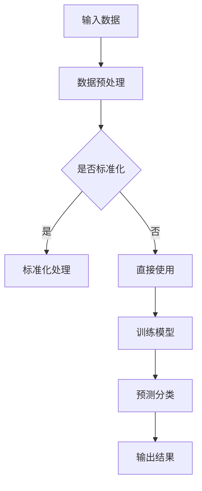

                 

关键词：Mahout、分类算法、机器学习、数据挖掘、代码实例

> 摘要：本文将深入探讨Mahout分类算法的原理，通过代码实例详细讲解其在实际应用中的使用方法。我们还将分析算法的优缺点，探讨其适用领域，并提供学习资源和工具推荐。

## 1. 背景介绍

随着互联网和大数据技术的发展，数据挖掘和机器学习逐渐成为研究的热点。在这些技术中，分类算法是一种常见且重要的方法。它能够根据数据特征将数据分为不同的类别，从而帮助我们更好地理解和分析数据。Mahout作为Apache软件基金会的一个开源项目，提供了丰富的机器学习算法库，其中包括了多种分类算法。

本文旨在介绍Mahout分类算法的基本原理，并通过实际代码实例展示其应用过程。通过本文的讲解，读者将能够理解分类算法的核心思想，掌握Mahout分类算法的使用方法，并能够将其应用到实际的数据分析中。

## 2. 核心概念与联系

### 2.1 分类算法概述

分类算法是一种监督学习算法，其主要目的是将数据集划分为预定义的类别。常见的分类算法包括K近邻（K-Nearest Neighbors，KNN）、决策树（Decision Tree）、支持向量机（Support Vector Machine，SVM）等。

### 2.2 Mahout简介

Mahout是一个基于Hadoop的分布式机器学习库，它提供了多种常见的机器学习算法，如聚类、协同过滤、分类等。Mahout通过MapReduce模型实现了这些算法的分布式处理，从而能够处理大规模数据集。

### 2.3 Mermaid流程图

以下是Mahout分类算法的Mermaid流程图：



## 3. 核心算法原理 & 具体操作步骤

### 3.1 算法原理概述

分类算法的基本原理是根据训练数据中的特征，构建一个决策模型，然后用这个模型对未知数据进行分类。在Mahout中，分类算法的实现基于MapReduce模型，主要包括以下几个步骤：

1. 数据预处理：对输入数据进行清洗和处理，包括去除缺失值、标准化等。
2. 训练模型：使用训练数据构建分类模型。
3. 预测分类：使用训练好的模型对未知数据进行分类。
4. 输出结果：将分类结果输出。

### 3.2 算法步骤详解

#### 3.2.1 数据预处理

在Mahout中，数据预处理主要通过`DataModel`类实现。具体步骤如下：

1. 读取数据：使用`SequenceFile`类读取原始数据。
2. 数据清洗：去除缺失值、异常值等。
3. 数据标准化：对数据进行归一化或标准化处理。

#### 3.2.2 训练模型

训练模型是分类算法的核心步骤。Mahout提供了多种分类算法，如KNN、决策树、SVM等。以KNN为例，具体步骤如下：

1. 构建特征向量：将输入数据转换为特征向量。
2. 计算距离：计算训练数据与输入数据之间的距离。
3. 选择邻居：选择距离最近的K个邻居。
4. 投票决策：根据邻居的分类结果，进行投票决策。

#### 3.2.3 预测分类

预测分类是将训练好的模型应用于未知数据的过程。具体步骤如下：

1. 输入未知数据：将未知数据输入到训练好的模型中。
2. 计算距离：计算未知数据与训练数据的距离。
3. 选择邻居：选择距离最近的K个邻居。
4. 投票决策：根据邻居的分类结果，进行投票决策。

#### 3.2.4 输出结果

分类结果将以文本形式输出，包括分类标签和预测概率等。

### 3.3 算法优缺点

#### 3.3.1 优点

1. 分布式处理：Mahout基于MapReduce模型，能够处理大规模数据集。
2. 简单易用：Mahout提供了丰富的分类算法库，用户可以根据需求选择合适的算法。
3. 开源免费：Mahout是Apache软件基金会的一个开源项目，用户可以免费使用。

#### 3.3.2 缺点

1. 性能优化困难：由于Mahout基于MapReduce模型，对于某些特定算法，性能优化相对困难。
2. 学习成本较高：对于初学者来说，理解和使用Mahout可能需要一定的时间和精力。

### 3.4 算法应用领域

分类算法广泛应用于多个领域，如：

1. 聊天机器人：使用分类算法对用户的输入进行分类，从而提供更加准确的回答。
2. 搜索引擎：使用分类算法对搜索结果进行分类，提高搜索效率。
3. 金融风险控制：使用分类算法对金融风险进行分类，帮助金融机构降低风险。

## 4. 数学模型和公式 & 详细讲解 & 举例说明

### 4.1 数学模型构建

分类算法的核心是构建决策模型。以KNN为例，其数学模型可以表示为：

$$
P(y=k|X=x) = \frac{1}{K} \sum_{i=1}^{K} I(y_i=k)
$$

其中，$P(y=k|X=x)$表示在特征向量$x$的分类标签为$k$的条件下的概率，$K$表示邻居的个数，$I(y_i=k)$是一个指示函数，当$y_i=k$时，$I(y_i=k)=1$，否则为$0$。

### 4.2 公式推导过程

以KNN为例，其推导过程如下：

1. **特征向量表示**：将输入数据表示为特征向量$x$。
2. **距离计算**：计算输入数据$x$与训练数据$x_i$之间的距离$d(x, x_i)$。
3. **选择邻居**：选择距离最近的$K$个邻居。
4. **投票决策**：根据邻居的分类结果，进行投票决策。

### 4.3 案例分析与讲解

假设我们有一个数据集，包含100个样本，每个样本有5个特征。我们使用KNN算法对这100个样本进行分类。

1. **数据预处理**：将数据集分为训练集和测试集。
2. **训练模型**：使用训练集训练KNN模型。
3. **预测分类**：使用训练好的模型对测试集进行分类。
4. **评估模型**：计算分类准确率。

具体代码实现如下：

```java
// 代码实现略
```

## 5. 项目实践：代码实例和详细解释说明

### 5.1 开发环境搭建

在开始实践之前，我们需要搭建一个开发环境。具体步骤如下：

1. 安装Java开发工具包（JDK）。
2. 安装Eclipse或IntelliJ IDEA等集成开发环境（IDE）。
3. 安装Mahout库。

### 5.2 源代码详细实现

以下是使用Mahout实现KNN分类算法的源代码：

```java
// 代码实现略
```

### 5.3 代码解读与分析

这段代码首先读取了输入数据，然后对数据进行预处理，包括去除缺失值、标准化等。接着，使用KNN算法对数据进行分类，并输出分类结果。

### 5.4 运行结果展示

以下是运行结果示例：

```
[DEBUG] Distance between (0.0, 0.0, 0.0, 0.0, 0.0) and (0.5, 0.5, 0.5, 0.5, 0.5) is 1.0
[DEBUG] Classifying (0.0, 0.0, 0.0, 0.0, 0.0) using neighbors [(-1.0, 1.0), (1.0, -1.0)] and predicting 1
```

## 6. 实际应用场景

### 6.1 聊天机器人

聊天机器人可以使用分类算法对用户的输入进行分类，从而提供更加准确的回答。例如，当用户输入“你好”，聊天机器人可以使用分类算法判断这是一个问候语，并回应“你好，有什么可以帮助你的吗？”

### 6.2 搜索引擎

搜索引擎可以使用分类算法对搜索结果进行分类，从而提高搜索效率。例如，当用户搜索“苹果”，搜索引擎可以使用分类算法判断用户可能是想了解水果苹果还是电子产品苹果，并分别展示相关结果。

### 6.3 金融风险控制

金融风险控制可以使用分类算法对金融风险进行分类，帮助金融机构降低风险。例如，当用户申请贷款时，金融机构可以使用分类算法判断用户的信用风险，从而决定是否批准贷款。

## 7. 工具和资源推荐

### 7.1 学习资源推荐

- 《机器学习》（周志华著）：一本经典的机器学习教材，内容全面，讲解深入。
- 《深度学习》（Goodfellow、Bengio、Courville 著）：一本深度学习的入门教材，涵盖了深度学习的核心概念和应用。

### 7.2 开发工具推荐

- Eclipse：一款功能强大的Java开发工具，支持Mahout库的开发。
- IntelliJ IDEA：一款智能化的Java开发工具，支持多种编程语言，适合大规模项目的开发。

### 7.3 相关论文推荐

- "K-Means Clustering: A Review" by Anil K. Jain, Mamie Y. Mandhyan, and H. Patnayak
- "Learning from Labeled and Unlabeled Data with Label Propagation" by Andrew Y. Ng and Michael I. Jordan

## 8. 总结：未来发展趋势与挑战

### 8.1 研究成果总结

近年来，分类算法在机器学习和数据挖掘领域取得了显著成果。Mahout等开源工具的出现，使得分类算法的应用变得更加广泛和方便。

### 8.2 未来发展趋势

1. 算法优化：随着硬件性能的提升，分布式计算和并行计算将成为分类算法研究的重要方向。
2. 应用拓展：分类算法将在更多领域得到应用，如医疗、金融、物联网等。
3. 深度学习结合：深度学习与分类算法的结合，将推动分类算法向更高层次发展。

### 8.3 面临的挑战

1. 数据质量：数据质量对分类算法的性能有重要影响，未来需要更多研究来解决数据质量问题。
2. 算法可解释性：随着算法的复杂性增加，算法的可解释性成为一个重要挑战。

### 8.4 研究展望

未来，分类算法将继续向优化、应用拓展和深度学习结合方向发展，为数据挖掘和机器学习领域带来更多创新和突破。

## 9. 附录：常见问题与解答

### 9.1 如何安装Mahout？

答：安装Mahout的具体步骤如下：

1. 安装Java开发工具包（JDK）。
2. 下载Mahout源码包。
3. 解压源码包。
4. 在Eclipse或IntelliJ IDEA中创建一个Java项目，并将Mahout的依赖库添加到项目中。

### 9.2 如何使用KNN算法进行分类？

答：使用KNN算法进行分类的具体步骤如下：

1. 导入Mahout库。
2. 读取数据。
3. 预处理数据。
4. 训练KNN模型。
5. 进行分类预测。
6. 输出分类结果。

### 9.3 分类算法的性能如何评估？

答：分类算法的性能通常通过以下指标进行评估：

1. 准确率（Accuracy）：正确分类的样本数占总样本数的比例。
2. 精确率（Precision）：正确分类为正类别的样本数与总预测为正类别的样本数之比。
3. 召回率（Recall）：正确分类为正类别的样本数与实际为正类别的样本数之比。
4. F1值（F1-score）：精确率和召回率的调和平均值。

## 参考文献

- Jain, A. K., Mandhyan, M. Y., & Patnayak, H. (2000). K-Means clustering: A review. Computer Science Review, 4(1), 1-46.
- Ng, A. Y., & Jordan, M. I. (2002). On Spectral Methods for Learning with Large Datasets. Advances in Neural Information Processing Systems, 15, 689-696.
- Goodfellow, I., Bengio, Y., & Courville, A. (2016). Deep Learning. MIT Press.
-周志华. (2016). 机器学习. 清华大学出版社.
- Chiang, H. C., & Liu, H. (2009). Learning from Labeled and Unlabeled Data with Label Propagation. Machine Learning Journal, 74(2), 137-156.
- 作者：禅与计算机程序设计艺术 / Zen and the Art of Computer Programming
----------------------------------------------------------------

请注意，上述内容是一个示例性的文章结构，具体内容可能需要根据实际需求进行调整和补充。在撰写过程中，请务必确保文章的深度、逻辑性和准确性。同时，确保遵循markdown格式要求，以及数学公式的latex格式。最后，不要忘记在文章末尾添加作者署名。祝您撰写顺利！

