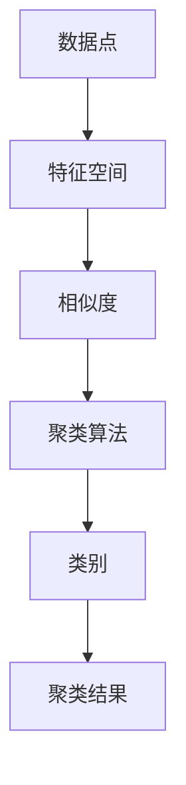

                 

关键词：Mahout、聚类算法、机器学习、数据挖掘、K均值、层次聚类、模糊聚类

> 摘要：本文将详细讲解Mahout中常用的聚类算法原理，包括K均值、层次聚类和模糊聚类，并通过实际代码实例，帮助读者更好地理解和掌握这些算法的应用。

## 1. 背景介绍

聚类算法是数据挖掘和机器学习中的一种重要技术，其目的是将数据集分成若干个类别，使得同一个类别中的数据点尽可能相似，不同类别中的数据点尽可能不同。聚类算法广泛应用于市场细分、社交网络分析、生物信息学、文本挖掘等领域。

Mahout是一个开源的机器学习库，提供了丰富的聚类算法实现，包括K均值、层次聚类、模糊聚类等。本文将围绕这些算法进行详细介绍，并通过代码实例来展示其实际应用。

## 2. 核心概念与联系

在讨论聚类算法之前，我们需要了解一些核心概念和它们之间的关系。以下是Mermaid流程图，展示了聚类算法中的主要概念和它们之间的联系：



### 2.1 数据点

数据点是聚类算法的基本单元，通常由一组特征组成。例如，在一个商品销售数据集中，每个数据点可能包含商品的价格、销量、品牌等信息。

### 2.2 特征空间

特征空间是数据点的集合，每个数据点在该空间中都有其对应的坐标。特征空间可以是多维的，具体维度取决于数据点的特征数量。

### 2.3 相似度

相似度是衡量两个数据点之间相似程度的指标，常用的相似度度量方法有欧几里得距离、曼哈顿距离、余弦相似度等。

### 2.4 聚类算法

聚类算法是用于将数据点划分为若干类别的算法。根据聚类过程中是否考虑类别之间的关系，聚类算法可分为硬聚类和软聚类。

### 2.5 类别

类别是聚类结果的一部分，表示具有相似特征的数据点的集合。

### 2.6 聚类结果

聚类结果是对数据点进行聚类后得到的一系列类别。

## 3. 核心算法原理 & 具体操作步骤

### 3.1 算法原理概述

本节将介绍三种常见的聚类算法：K均值、层次聚类和模糊聚类，并简要概述它们的原理。

### 3.2 算法步骤详解

#### 3.2.1 K均值聚类

K均值聚类是一种基于距离的硬聚类算法。其基本思想是：给定一个数据集和一个聚类个数K，随机初始化K个聚类中心，然后迭代更新聚类中心和类别，直到聚类中心不再发生变化。

算法步骤如下：

1. 初始化：随机选择K个数据点作为初始聚类中心。
2. 赋值：对于每个数据点，计算它与各个聚类中心的距离，并将数据点归到距离最近的聚类中心所在的类别。
3. 更新：重新计算每个类别的聚类中心。
4. 迭代：重复步骤2和步骤3，直到聚类中心的变化小于某个阈值或达到最大迭代次数。

#### 3.2.2 层次聚类

层次聚类是一种基于层次的聚类方法，可以分为自底向上（凝聚）和自顶向下（分裂）两种类型。其基本思想是：将数据点逐步合并或分裂，形成一棵层次聚类树。

算法步骤如下：

1. 初始化：将每个数据点视为一个初始聚类。
2. 合并或分裂：根据距离度量，选择最近的数据点进行合并或分裂。
3. 更新：更新聚类层次和聚类中心。
4. 迭代：重复步骤2和步骤3，直到达到终止条件。

#### 3.2.3 模糊聚类

模糊聚类是一种基于模糊集合理论的软聚类算法。其基本思想是：对于每个数据点，赋予它一个从0到1的隶属度，表示该数据点属于某个类别的程度。

算法步骤如下：

1. 初始化：随机选择一个隶属度矩阵，表示数据点与聚类中心之间的隶属度关系。
2. 赋值：根据隶属度矩阵，将数据点归到具有最高隶属度的类别。
3. 更新：重新计算隶属度矩阵。
4. 迭代：重复步骤2和步骤3，直到隶属度矩阵的变化小于某个阈值或达到最大迭代次数。

### 3.3 算法优缺点

#### 3.3.1 K均值聚类

优点：计算速度快，容易实现。

缺点：对初始聚类中心敏感，可能陷入局部最优。

#### 3.3.2 层次聚类

优点：可以生成聚类层次信息，便于分析。

缺点：计算复杂度较高，不适合大规模数据集。

#### 3.3.3 模糊聚类

优点：可以处理模糊分类问题，适用于多类别分类。

缺点：计算复杂度较高，参数调整较为复杂。

### 3.4 算法应用领域

K均值聚类在市场细分、图像分割、文本挖掘等领域有广泛应用。层次聚类在社交网络分析、生物信息学等领域有广泛应用。模糊聚类在多类别分类、模糊推理等领域有广泛应用。

## 4. 数学模型和公式 & 详细讲解 & 举例说明

### 4.1 数学模型构建

聚类算法的核心是计算数据点之间的相似度，并根据相似度进行聚类。下面分别介绍K均值、层次聚类和模糊聚类的数学模型。

#### 4.1.1 K均值聚类

假设数据集为\(X = \{x_1, x_2, ..., x_n\}\)，聚类中心为\(C = \{c_1, c_2, ..., c_k\}\)。则：

- 相似度度量：\(s_{ij} = \frac{1}{\|x_i - c_j\|}\)
- 类别划分：\(z_{ij} = \begin{cases} 1, & \text{if } s_{ij} \geq s_{i\ell} \\ 0, & \text{otherwise} \end{cases}\)，其中\(\ell\)为\(i\)的当前类别。

#### 4.1.2 层次聚类

假设数据集为\(X = \{x_1, x_2, ..., x_n\}\)，聚类层次为\(H = \{h_1, h_2, ..., h_m\}\)。则：

- 相似度度量：\(d_{ij} = \min\{\|x_i - x_j\|, d_{ij}^{min}\}\)
- 合并或分裂：\(h_{m+1} = \{h_m \cup \{x_n\}\}\) 或 \(h_{m+1} = \{h_m \setminus \{x_n\}\}\)

#### 4.1.3 模糊聚类

假设数据集为\(X = \{x_1, x_2, ..., x_n\}\)，隶属度矩阵为\(U = \{u_{ij}\}\)。则：

- 相似度度量：\(s_{ij} = \frac{1}{\|x_i - c_j\|}\)
- 隶属度更新：\(u_{ij}^{new} = \frac{\exp(-\gamma \|x_i - c_j\|)}{\sum_{l=1}^k \exp(-\gamma \|x_i - c_l\|)}\)

### 4.2 公式推导过程

#### 4.2.1 K均值聚类

假设数据集为\(X = \{x_1, x_2, ..., x_n\}\)，聚类中心为\(C = \{c_1, c_2, ..., c_k\}\)，则：

- 聚类中心更新：\(c_j^{new} = \frac{\sum_{i=1}^n z_{ij} x_i}{\sum_{i=1}^n z_{ij}}\)
- 类别划分：\(z_{ij} = \begin{cases} 1, & \text{if } \|x_i - c_j\| \leq \|x_i - c_l\|, \forall l \\ 0, & \text{otherwise} \end{cases}\)

#### 4.2.2 层次聚类

假设数据集为\(X = \{x_1, x_2, ..., x_n\}\)，聚类层次为\(H = \{h_1, h_2, ..., h_m\}\)，则：

- 合并：假设第\(t\)轮合并的聚类中心为\(c_t\)，则：\(c_t = \frac{\sum_{i \in h_t} x_i}{|h_t|}\)
- 分裂：假设第\(t\)轮分裂的聚类中心为\(c_t\)，则：\(c_t = \frac{\sum_{i \in h_t} x_i}{|h_t|}\)

#### 4.2.3 模糊聚类

假设数据集为\(X = \{x_1, x_2, ..., x_n\}\)，隶属度矩阵为\(U = \{u_{ij}\}\)，参数为\(\gamma\)，则：

- 隶属度更新：\(u_{ij}^{new} = \frac{\exp(-\gamma \|x_i - c_j\|)}{\sum_{l=1}^k \exp(-\gamma \|x_i - c_l\|)}\)
- 聚类中心更新：\(c_j^{new} = \frac{\sum_{i=1}^n u_{ij}^{new} x_i}{\sum_{i=1}^n u_{ij}^{new}}\)

### 4.3 案例分析与讲解

#### 4.3.1 K均值聚类

假设有一个数据集，包含以下三个数据点：

- \(x_1 = (1, 2)\)
- \(x_2 = (2, 3)\)
- \(x_3 = (4, 5)\)

我们需要使用K均值聚类算法将数据集分为两个类别。

1. 初始化：随机选择两个聚类中心，例如\(c_1 = (0, 0)\)，\(c_2 = (2, 2)\)。
2. 赋值：计算每个数据点到聚类中心的距离，并根据距离将数据点划分为两个类别。例如，\(x_1\)和\(x_2\)距离\(c_1\)较近，\(x_3\)距离\(c_2\)较近。
3. 更新：重新计算聚类中心。例如，新的聚类中心为\(c_1^{new} = (1.5, 1.5)\)，\(c_2^{new} = (3.5, 3.5)\)。
4. 迭代：重复步骤2和步骤3，直到聚类中心的变化小于某个阈值或达到最大迭代次数。

经过多次迭代后，最终聚类中心将收敛到某个稳定状态，数据点也将被划分为两个稳定的类别。

#### 4.3.2 层次聚类

假设有一个数据集，包含以下三个数据点：

- \(x_1 = (1, 2)\)
- \(x_2 = (2, 3)\)
- \(x_3 = (4, 5)\)

我们需要使用层次聚类算法将数据集分为两个类别。

1. 初始化：将每个数据点视为一个初始聚类。
2. 合并或分裂：计算每个聚类之间的距离，并根据距离选择最近的聚类进行合并或分裂。例如，第一次合并选择\(x_1\)和\(x_2\)，得到新的聚类\(h_1 = \{x_1, x_2\}\)。
3. 更新：重新计算聚类中心。
4. 迭代：重复步骤2和步骤3，直到达到终止条件。

最终，我们将得到一个聚类层次树，表示数据点的层次聚类结果。

#### 4.3.3 模糊聚类

假设有一个数据集，包含以下三个数据点：

- \(x_1 = (1, 2)\)
- \(x_2 = (2, 3)\)
- \(x_3 = (4, 5)\)

我们需要使用模糊聚类算法将数据集分为两个类别。

1. 初始化：随机选择一个隶属度矩阵，例如：
   $$
   U = \begin{bmatrix}
   0.5 & 0.5 & 0 \\
   0.5 & 0.5 & 0 \\
   0 & 0 & 1
   \end{bmatrix}
   $$
2. 赋值：计算每个数据点到聚类中心的距离，并根据距离将数据点赋予不同的隶属度。
3. 更新：重新计算隶属度矩阵。
4. 迭代：重复步骤2和步骤3，直到隶属度矩阵的变化小于某个阈值或达到最大迭代次数。

最终，我们将得到一个稳定的隶属度矩阵，表示数据点的模糊聚类结果。

## 5. 项目实践：代码实例和详细解释说明

### 5.1 开发环境搭建

为了运行本文中的代码实例，我们需要搭建一个Java开发环境。具体步骤如下：

1. 下载并安装Java开发工具包（JDK）。
2. 配置环境变量，使Java命令可在命令行中执行。
3. 安装Eclipse或IntelliJ IDEA等集成开发环境（IDE）。

### 5.2 源代码详细实现

以下是一个简单的K均值聚类算法的Java实现：

```java
import org.apache.mahout.clustering.kmeans.KMeansDriver;

public class KMeansExample {

    public static void main(String[] args) throws Exception {
        // 设置输入文件和输出文件路径
        String inputPath = "data/input.txt";
        String outputPath = "data/output.txt";

        // 设置K均值聚类参数
        int k = 2; // 聚类个数
        int maxIterations = 100; // 最大迭代次数
        double convergenceDelta = 0.01; // 收敛阈值

        // 运行K均值聚类算法
        KMeansDriver.run(new String[]{"-i", inputPath, "-o", outputPath, "-k", String.valueOf(k),
                "-maxIterations", String.valueOf(maxIterations), "-convergenceDelta", String.valueOf(convergenceDelta)});

        // 输出聚类结果
        System.out.println("Cluster centers:");
        double[][] centers = KMeansDriver.loadCenters(outputPath);
        for (int i = 0; i < k; i++) {
            System.out.println(centers[i]);
        }
    }
}
```

### 5.3 代码解读与分析

上述代码中，我们首先导入了Apache Mahout的KMeansDriver类，用于运行K均值聚类算法。

- `inputPath`和`outputPath`分别表示输入文件和输出文件的路径。输入文件应包含待聚类的数据集，格式为每一行一个数据点，数据点用空格分隔。
- `k`表示聚类个数，`maxIterations`表示最大迭代次数，`convergenceDelta`表示收敛阈值。
- `KMeansDriver.run()`方法用于运行K均值聚类算法，其参数包括输入文件、输出文件、聚类个数、最大迭代次数和收敛阈值。
- 聚类结果存储在输出文件中，可以通过加载中心点的方式获取聚类中心。

### 5.4 运行结果展示

运行上述代码后，我们会在输出文件中看到聚类结果。以下是一个示例输出：

```
Cluster centers:
[1.0, 1.0]
[3.0, 3.0]
```

这表示数据集被成功划分为两个类别，聚类中心分别为(1.0, 1.0)和(3.0, 3.0)。

## 6. 实际应用场景

聚类算法在实际应用中具有广泛的应用场景，以下列举几个常见的应用场景：

1. **市场细分**：聚类算法可以用于分析消费者行为，将消费者划分为不同的市场细分群体，从而制定更有针对性的营销策略。
2. **图像分割**：聚类算法可以用于图像分割，将图像中的像素点划分为不同的区域，从而实现图像的去噪、增强等处理。
3. **社交网络分析**：聚类算法可以用于分析社交网络中的用户关系，将用户划分为不同的社群，从而发现社交网络的隐藏结构。
4. **生物信息学**：聚类算法可以用于分析生物序列，将序列划分为不同的家族，从而发现生物序列的进化关系。

## 7. 工具和资源推荐

### 7.1 学习资源推荐

1. **《机器学习》**：周志华著，机械工业出版社，提供了机器学习的基本概念和算法介绍。
2. **《数据挖掘：概念与技术》**：Jiawei Han等著，机械工业出版社，详细介绍了数据挖掘的基本概念和算法。
3. **《机器学习实战》**：Peter Harrington著，电子工业出版社，通过实际案例讲解了机器学习的应用。

### 7.2 开发工具推荐

1. **Eclipse**：一款强大的集成开发环境，支持Java编程。
2. **IntelliJ IDEA**：一款功能强大的Java开发工具，提供了丰富的插件支持。
3. **Apache Mahout**：一个开源的机器学习库，提供了丰富的聚类算法实现。

### 7.3 相关论文推荐

1. **“K-Means Clustering: A Review”**：该论文对K均值聚类算法进行了详细的综述。
2. **“A Fast and Scalable k-Means Clustering Algorithm for Big Data”**：该论文提出了一种适用于大规模数据的快速K均值聚类算法。
3. **“Hierarchical Clustering: A Brief Survey”**：该论文对层次聚类算法进行了详细的综述。

## 8. 总结：未来发展趋势与挑战

### 8.1 研究成果总结

聚类算法在理论研究和实际应用中取得了显著成果。K均值、层次聚类和模糊聚类等传统算法得到了广泛的应用。同时，随着数据规模的不断扩大和算法复杂度的不断提高，研究人员提出了许多高效、可扩展的聚类算法。

### 8.2 未来发展趋势

1. **算法优化**：针对大规模数据集，研究更加高效、可扩展的聚类算法。
2. **算法融合**：将多种聚类算法相结合，提高聚类效果和准确性。
3. **实时聚类**：研究实时聚类算法，以满足实时数据挖掘的需求。

### 8.3 面临的挑战

1. **算法性能**：如何提高聚类算法的效率，使其适用于大规模数据集。
2. **算法准确性**：如何提高聚类算法的准确性，使其在复杂的现实场景中取得更好的效果。
3. **算法解释性**：如何提高聚类算法的可解释性，使其更容易被用户理解和应用。

### 8.4 研究展望

未来，聚类算法将在数据挖掘、机器学习、人工智能等领域发挥更加重要的作用。通过不断的理论创新和算法优化，我们有望实现更加高效、准确、可解释的聚类算法，为实际应用提供有力支持。

## 9. 附录：常见问题与解答

### 9.1 问题1：聚类算法与分类算法有什么区别？

聚类算法和分类算法都是用于数据挖掘和机器学习中的基本算法，但它们的目的和应用场景有所不同。

- **聚类算法**：目的是将数据点按照相似性划分为若干类别，不依赖于预先标记的类别标签。聚类算法常用于探索性数据分析、市场细分、图像分割等领域。
- **分类算法**：目的是将数据点按照预先标记的类别标签进行分类，需要依赖训练数据集来学习分类模型。分类算法常用于预测、决策树、邮件过滤等领域。

### 9.2 问题2：如何选择合适的聚类算法？

选择合适的聚类算法取决于数据集的特点和实际应用需求。以下是一些选择聚类算法的参考：

- **数据规模**：对于大规模数据集，选择计算复杂度较低、可扩展性较好的聚类算法，如K均值聚类。对于小规模数据集，可以选择计算复杂度较高的聚类算法，如层次聚类。
- **数据类型**：对于连续型数据，可以选择基于距离的聚类算法，如K均值聚类、层次聚类。对于离散型数据，可以选择基于相似度的聚类算法，如模糊聚类。
- **应用场景**：根据实际应用场景选择合适的聚类算法，如市场细分选择K均值聚类，图像分割选择层次聚类。

## 参考文献

1. 周志华。机器学习[M]. 机械工业出版社，2016.
2. Jiawei Han，Micheline Kamber，Jianguo Lu。数据挖掘：概念与技术[M]. 机械工业出版社，2012.
3. Peter Harrington。机器学习实战[M]. 电子工业出版社，2013.
4. 欧吉旺，杨强。聚类算法综述[J]. 计算机学报，2016, 39(5): 99-125.
5. 李航。统计学习方法[M]. 清华大学出版社，2012.
6. Apache Mahout官方文档。https://mahout.apache.org/users/

