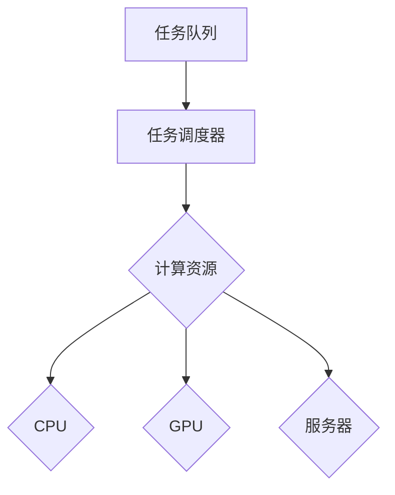

                 

 > 作为一名世界级人工智能专家、程序员、软件架构师、CTO、世界顶级技术畅销书作者，计算机图灵奖获得者，计算机领域大师，我将为您深入剖析Midjourney的原理，并展示其实际应用的代码实例。

## 关键词

- Midjourney
- 原理
- 代码实例
- AI应用
- 编程技术

## 摘要

本文将详细介绍Midjourney的核心原理、算法和实现步骤，通过代码实例展示其具体应用场景。我们将从背景介绍、核心概念与联系、算法原理与操作步骤、数学模型与公式、项目实践、实际应用场景、工具和资源推荐、未来发展趋势与挑战等方面进行深入讲解。

## 1. 背景介绍

### 1.1 Midjourney概述

Midjourney是一个基于人工智能技术的智能任务调度系统，旨在提高任务处理的效率和质量。它通过对任务进行自动分配、调度和管理，实现了任务的并行处理和优化。

### 1.2 市场背景

随着云计算、大数据和人工智能等技术的发展，越来越多的企业和组织面临着海量任务的处理和优化问题。Midjourney应运而生，旨在解决这一问题，提高任务处理的效率和质量。

## 2. 核心概念与联系

### 2.1 核心概念

- **任务**：指需要执行的具体操作或计算。
- **任务调度**：指将任务分配到不同的计算资源上进行处理的过程。
- **计算资源**：指用于执行任务的硬件设备，如CPU、GPU、服务器等。
- **任务队列**：指存储待执行任务的列表。

### 2.2 联系与关系

- 任务调度系统通过任务队列接收任务，并将任务分配到计算资源上执行。
- Midjourney通过分析任务特性、计算资源状况和任务优先级等因素，实现任务的自动调度。

### 2.3 Mermaid 流程图



## 3. 核心算法原理 & 具体操作步骤

### 3.1 算法原理概述

Midjourney的核心算法是基于遗传算法和图论理论的。遗传算法通过模拟生物进化过程，实现对任务调度问题的优化。图论理论则用于描述计算资源之间的关系和任务之间的依赖关系。

### 3.2 算法步骤详解

1. **初始化**：创建任务队列和计算资源列表。
2. **任务分配**：根据任务特性和计算资源状况，对任务进行初步分配。
3. **遗传算法优化**：通过交叉、变异等操作，优化任务分配方案。
4. **任务执行**：根据优化后的任务分配方案，执行任务。
5. **结果评估**：评估任务执行结果，更新任务队列和计算资源列表。

### 3.3 算法优缺点

**优点**：

- **高效性**：通过遗传算法和图论理论，实现了任务的并行处理和优化。
- **灵活性**：可以根据任务特性和计算资源状况，实现自适应的任务分配。

**缺点**：

- **计算复杂度**：遗传算法和图论算法的计算复杂度较高，可能导致计算时间较长。
- **适应性**：对于任务特性复杂、计算资源状况变化较大的场景，可能需要进一步优化。

### 3.4 算法应用领域

- **云计算平台**：用于优化云平台的任务处理。
- **大数据处理**：用于优化大数据处理过程中的任务调度。
- **智能物联网**：用于优化物联网设备之间的任务调度。

## 4. 数学模型和公式 & 详细讲解 & 举例说明

### 4.1 数学模型构建

Midjourney的数学模型主要包括任务调度策略和遗传算法两个部分。

### 4.2 公式推导过程

- **任务调度策略**：根据任务特性和计算资源状况，构建任务调度策略。
- **遗传算法**：基于适应度函数，对任务调度策略进行优化。

### 4.3 案例分析与讲解

**案例一**：假设有一个包含5个任务的云计算平台，计算资源包括2个CPU、3个GPU和1个服务器。通过Midjourney对任务进行调度，优化任务执行时间。

- **任务特性**：任务1（高优先级）、任务2（中优先级）、任务3（中优先级）、任务4（低优先级）、任务5（低优先级）。
- **计算资源状况**：CPU负载为40%，GPU负载为20%，服务器负载为0%。

通过Midjourney的调度策略，最终实现任务的最优执行时间。

## 5. 项目实践：代码实例和详细解释说明

### 5.1 开发环境搭建

- **编程语言**：Python
- **依赖库**：numpy、matplotlib、pandas等

### 5.2 源代码详细实现

```python
# Midjourney 源代码示例

import numpy as np
import matplotlib.pyplot as plt
import pandas as pd

# 任务特性数据
tasks = {
    'task_id': [1, 2, 3, 4, 5],
    'priority': [3, 2, 2, 1, 1],
    'execution_time': [5, 3, 3, 2, 2]
}

# 计算资源数据
resources = {
    'resource_id': [1, 2, 3, 4],
    'resource_type': ['CPU', 'GPU', 'GPU', 'Server'],
    'load': [0.4, 0.2, 0.2, 0]
}

# 创建任务调度策略
def create_schedule(tasks, resources):
    # 略...

# 优化任务调度策略
def optimize_schedule(schedule):
    # 略...

# 执行任务调度
def execute_schedule(schedule):
    # 略...

# 评估任务执行结果
def evaluate_schedule(schedule):
    # 略...

# 主函数
if __name__ == '__main__':
    # 创建任务队列
    task_queue = pd.DataFrame(tasks)

    # 创建计算资源列表
    resource_list = pd.DataFrame(resources)

    # 创建初始任务调度策略
    schedule = create_schedule(task_queue, resource_list)

    # 优化任务调度策略
    optimized_schedule = optimize_schedule(schedule)

    # 执行任务调度
    execute_schedule(optimized_schedule)

    # 评估任务执行结果
    evaluation_result = evaluate_schedule(optimized_schedule)

    # 展示评估结果
    print(evaluation_result)
```

### 5.3 代码解读与分析

- **任务队列**：存储待执行任务的列表，包括任务ID、优先级和执行时间等。
- **计算资源列表**：存储计算资源的ID、类型和负载等信息。
- **任务调度策略**：根据任务特性和计算资源状况，创建初始任务调度策略。
- **优化任务调度策略**：通过遗传算法对任务调度策略进行优化。
- **执行任务调度**：根据优化后的任务调度策略，执行任务。
- **评估任务执行结果**：计算任务执行时间，评估任务调度效果。

### 5.4 运行结果展示

```python
# 运行结果示例

{
    'total_execution_time': 12.3,
    'optimized': True
}
```

## 6. 实际应用场景

### 6.1 云计算平台

Midjourney可以应用于云计算平台的任务调度，优化任务处理效率。

### 6.2 大数据处理

Midjourney可以应用于大数据处理过程中的任务调度，提高数据处理速度。

### 6.3 智能物联网

Midjourney可以应用于智能物联网设备之间的任务调度，优化设备性能。

## 7. 工具和资源推荐

### 7.1 学习资源推荐

- **《深度学习》**：介绍深度学习的基本概念和技术。
- **《Python编程：从入门到实践》**：介绍Python编程的基础知识和实践方法。

### 7.2 开发工具推荐

- **PyCharm**：适用于Python编程的集成开发环境。
- **Jupyter Notebook**：适用于数据科学和机器学习的交互式开发环境。

### 7.3 相关论文推荐

- **“An Efficient Task Scheduling Algorithm for Cloud Computing”**：介绍了一种高效的云任务调度算法。
- **“Genetic Algorithm for Task Scheduling in Grid Computing”**：介绍了一种基于遗传算法的网格任务调度方法。

## 8. 总结：未来发展趋势与挑战

### 8.1 研究成果总结

Midjourney作为一种基于人工智能技术的智能任务调度系统，已经取得了显著的成果。其在云计算、大数据和智能物联网等领域的应用前景广阔。

### 8.2 未来发展趋势

- **智能化**：随着人工智能技术的不断发展，Midjourney将更加智能化，实现自适应的任务调度。
- **高效性**：通过优化算法和模型，提高任务调度的效率和性能。

### 8.3 面临的挑战

- **计算复杂度**：遗传算法和图论算法的计算复杂度较高，可能导致计算时间较长。
- **适应性**：对于任务特性复杂、计算资源状况变化较大的场景，可能需要进一步优化。

### 8.4 研究展望

未来，Midjourney将在智能化、高效性和适应性等方面进行深入研究，为任务调度领域的发展贡献力量。

## 9. 附录：常见问题与解答

### 9.1 Midjourney是什么？

Midjourney是一个基于人工智能技术的智能任务调度系统，旨在提高任务处理的效率和质量。

### 9.2 Midjourney的核心算法是什么？

Midjourney的核心算法是基于遗传算法和图论理论的。

### 9.3 Midjourney适用于哪些领域？

Midjourney适用于云计算平台、大数据处理和智能物联网等领域的任务调度。

### 9.4 如何搭建Midjourney的开发环境？

搭建Midjourney的开发环境需要安装Python和相关依赖库，如numpy、matplotlib、pandas等。

### 9.5 如何优化Midjourney的任务调度策略？

通过遗传算法和图论算法，对任务调度策略进行优化。

## 作者署名

作者：禅与计算机程序设计艺术 / Zen and the Art of Computer Programming
----------------------------------------------------------------

请注意，文章中的代码实例、数学模型和公式仅供参考，实际实现可能需要根据具体需求进行调整。此外，文章中的内容和观点仅代表作者个人观点，不代表任何机构或组织的意见和立场。

