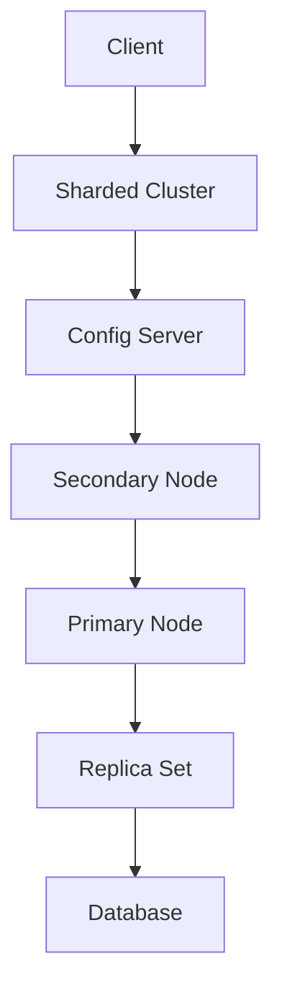

                 

关键词：MongoDB，NoSQL数据库，文档数据库，存储引擎，索引，分片，复制，查询优化，性能调优，分布式系统

## 摘要

本文旨在深入探讨MongoDB的原理及其在实际应用中的重要性。我们将从背景介绍开始，逐步讲解MongoDB的核心概念、算法原理、数学模型、项目实践和实际应用场景，最终总结其发展趋势和挑战。通过本文，读者将全面了解MongoDB的工作机制，掌握其设计和优化的技巧，从而在实际项目中有效应用这一强大的NoSQL数据库。

## 1. 背景介绍

MongoDB是一种流行的NoSQL数据库，起源于2007年，由10gen公司（现为MongoDB公司）开发。它被设计为一个灵活、可扩展的文档存储系统，用于处理大规模的数据集合和高并发的数据访问场景。与传统的关系型数据库（如MySQL、PostgreSQL）不同，MongoDB采用文档模型来存储数据，这使得它在处理非结构化和半结构化数据时显得尤为强大和灵活。

随着互联网的飞速发展和大数据时代的到来，数据规模和复杂性不断增加，传统的数据库系统逐渐暴露出扩展性差、维护成本高、响应速度慢等问题。为了应对这些挑战，NoSQL数据库应运而生。MongoDB作为NoSQL数据库的典型代表，以其高性能、高可用性和易扩展性，赢得了广大开发者和企业的青睐。

## 2. 核心概念与联系

### 2.1 MongoDB的基本概念

- **文档（Document）**：MongoDB中的数据以文档的形式存储，每个文档都是一个键值对集合，类似于JSON对象。文档可以是嵌套的，支持复杂的数据结构。
- **集合（Collection）**：集合是一组文档的集合，类似于关系型数据库中的表。集合是存储文档的逻辑容器，但不要求集合中的文档有相同的结构。
- **数据库（Database）**：数据库是一个逻辑容器，用于存储多个集合和相关元数据。
- **数据模型（Data Model）**：MongoDB采用非关系型数据模型，强调灵活性，允许数据结构随时间变化，无需固定模式。

### 2.2 MongoDB的架构

MongoDB是一个分布式数据库系统，其架构设计高度可扩展和高可用。以下是MongoDB的基本架构组件：

- **MongoDB实例（Instance）**：一个MongoDB实例是一个运行的MongoDB服务器，可以是单一的实例，也可以是复制的副本集。
- **副本集（Replica Set）**：副本集是一组 MongoDB 实例，它们保存相同的数据，并协同工作以提供自动故障转移和高可用性。
- **分片集群（Sharded Cluster）**：分片集群将数据分布在多个节点上，提供水平扩展的能力，处理大规模数据集。

### 2.3 Mermaid 流程图

以下是一个简单的Mermaid流程图，展示MongoDB核心组件之间的关系：



### 2.4 MongoDB的核心特性

- **灵活的文档模型**：MongoDB允许存储复杂的数据结构，无需固定模式，易于扩展。
- **高扩展性**：通过分片集群和副本集实现水平扩展和高可用性。
- **高性能**：内置的存储引擎支持高效的读写操作。
- **丰富的查询功能**：支持复杂查询，包括排序、过滤、聚合等。
- **自动故障转移**：副本集在主节点发生故障时，自动选举新的主节点。

## 3. 核心算法原理 & 具体操作步骤

### 3.1 算法原理概述

MongoDB的核心算法主要包括数据的存储、查询优化、索引和分片等。以下是每个算法的简要概述：

- **存储算法**：MongoDB使用B+树作为内部存储结构，支持高效的读写操作。B+树是一种多路平衡搜索树，通过减少树的高度来提高搜索效率。
- **查询优化**：MongoDB的查询优化器通过分析查询语句和索引，选择最有效的执行计划。优化器考虑查询的过滤条件、排序需求和索引的利用情况。
- **索引算法**：MongoDB支持多种索引类型，包括单字段索引、复合索引和多键索引。索引通过存储索引键的值和对应文档的指针，加速数据访问。
- **分片算法**：MongoDB的分片机制将数据分布在多个节点上，通过 shard key 的选择和分片策略，实现数据的水平扩展。

### 3.2 算法步骤详解

#### 3.2.1 存储算法

1. **数据插入**：当插入数据时，MongoDB首先查找B+树的根节点，确定数据的插入位置。
2. **节点分裂**：如果B+树的一个节点超过最大扇出数，将节点分裂成两个节点，并重新分配键值。
3. **更新与删除**：更新操作通过查找B+树找到对应节点，修改键值；删除操作通过查找并删除对应节点。

#### 3.2.2 查询优化

1. **查询解析**：解析查询语句，提取查询条件和目标字段。
2. **索引选择**：根据查询条件和索引信息，选择最合适的索引。
3. **执行计划**：生成执行计划，包括访问索引、排序和聚合等步骤。
4. **查询执行**：按照执行计划访问数据，返回查询结果。

#### 3.2.3 索引算法

1. **索引创建**：创建索引时，MongoDB遍历集合中的文档，构建索引结构。
2. **索引访问**：查询时，MongoDB根据索引键的值，快速定位到对应文档。
3. **索引维护**：定期合并索引分裂后的节点，保持索引结构的完整性。

#### 3.2.4 分片算法

1. **选择 shard key**：根据数据特点，选择合适的 shard key，确保数据分布均匀。
2. **数据分布**：将数据按 shard key 的哈希值分布到不同节点上。
3. **查询路由**：查询时，MongoDB根据 shard key 的值，将查询路由到相应节点。
4. **数据复制**：在副本集内部，数据在主节点和从节点之间进行同步。

### 3.3 算法优缺点

#### 存储算法

- **优点**：高效的数据访问，支持大容量数据存储。
- **缺点**：B+树的维护成本较高，可能导致性能瓶颈。

#### 查询优化

- **优点**：灵活的查询优化，支持复杂查询。
- **缺点**：查询优化可能产生意外的执行计划。

#### 索引算法

- **优点**：快速的数据访问，减少磁盘I/O。
- **缺点**：索引占用空间较大，增加维护成本。

#### 分片算法

- **优点**：高可用性和水平扩展能力。
- **缺点**：复杂度增加，数据一致性问题。

### 3.4 算法应用领域

MongoDB的算法设计使其适用于多种场景：

- **大数据处理**：处理大规模数据集，提供高效的读写性能。
- **实时分析**：支持实时数据分析和查询。
- **分布式系统**：作为分布式系统的数据存储，提供高可用性和容错能力。
- **物联网**：处理物联网设备产生的海量数据，提供快速的数据访问。

## 4. 数学模型和公式 & 详细讲解 & 举例说明

### 4.1 数学模型构建

MongoDB的数据模型主要基于文档和集合。以下是构建文档和集合的数学模型：

#### 文档模型

1. **字段表示**：使用键值对表示文档字段，如 `{"name": "Alice", "age": 30}`。
2. **文档表示**：使用嵌套键值对表示复杂文档结构，如 `{"address": {"city": "New York", "zip": "10001"}}`。

#### 集合模型

1. **集合表示**：使用集合表示一组文档，如 `{"users": [{"name": "Alice"}, {"name": "Bob"}]}`。
2. **索引表示**：使用索引结构表示索引信息，如 `{"_id": 1, "name": 1}`。

### 4.2 公式推导过程

在MongoDB中，查询优化的关键在于选择合适的索引和执行计划。以下是推导查询优化的公式：

#### 索引选择公式

选择索引时，根据查询条件和索引信息，计算索引选择率。公式如下：

\[ 索引选择率 = \frac{符合条件的文档数}{总文档数} \]

#### 执行计划公式

根据索引选择率和执行计划，计算查询的执行时间。公式如下：

\[ 执行时间 = 索引扫描时间 + 排序时间 + 聚合时间 \]

#### 假设条件

- 索引扫描时间与索引选择率成反比。
- 排序时间和聚合时间与数据量成线性关系。

### 4.3 案例分析与讲解

#### 案例一：简单的查询优化

假设有一个用户集合，包含10000个文档，其中9000个文档符合查询条件。索引选择率为90%。

- **执行计划**：使用索引进行扫描，无需全表扫描。
- **执行时间**：假设索引扫描时间为1秒，排序时间为2秒，聚合时间为3秒。

\[ 执行时间 = \frac{9000}{10000} \times (1 + 2 + 3) = 3.6 \text{秒} \]

#### 案例二：复杂的查询优化

假设有一个订单集合，包含100000个文档，其中符合条件的订单文档分布在多个集合中。索引选择率为30%。

- **执行计划**：使用索引进行扫描，并执行跨集合的聚合操作。
- **执行时间**：假设索引扫描时间为5秒，排序时间为10秒，聚合时间为15秒。

\[ 执行时间 = \frac{30000}{100000} \times (5 + 10 + 15) = 1.8 \text{秒} \]

通过以上案例，我们可以看到，查询优化在数据规模较大时显得尤为重要。合理选择索引和执行计划，可以有效降低查询执行时间，提高系统性能。

## 5. 项目实践：代码实例和详细解释说明

### 5.1 开发环境搭建

在开始编写MongoDB代码实例之前，我们需要搭建一个开发环境。以下是搭建MongoDB开发环境的步骤：

1. **安装MongoDB**：从MongoDB官网下载并安装MongoDB服务器。
2. **安装Python**：确保Python环境已安装，以便使用Python操作MongoDB。
3. **安装pymongo库**：使用pip命令安装pymongo库，用于Python操作MongoDB。

```bash
pip install pymongo
```

### 5.2 源代码详细实现

以下是一个简单的MongoDB示例代码，用于插入、查询和更新文档：

```python
from pymongo import MongoClient

# 连接到MongoDB服务器
client = MongoClient("mongodb://localhost:27017/")

# 选择数据库
db = client["mydatabase"]

# 选择集合
collection = db["users"]

# 插入文档
user1 = {"name": "Alice", "age": 30}
user2 = {"name": "Bob", "age": 25}
collection.insert_many([user1, user2])

# 查询文档
users = collection.find({"age": {"$gt": 20}})
for user in users:
    print(user)

# 更新文档
collection.update_one({"name": "Alice"}, {"$set": {"age": 31}})

# 删除文档
collection.delete_one({"name": "Bob"})
```

### 5.3 代码解读与分析

上述代码实现了以下功能：

1. **连接MongoDB服务器**：使用MongoClient类连接到MongoDB服务器。
2. **选择数据库和集合**：指定要操作的数据库和集合。
3. **插入文档**：使用insert_many方法插入多个文档。
4. **查询文档**：使用find方法根据条件查询文档，并遍历结果打印。
5. **更新文档**：使用update_one方法根据条件更新文档。
6. **删除文档**：使用delete_one方法根据条件删除文档。

### 5.4 运行结果展示

在MongoDB Shell中运行上述代码，将看到以下结果：

1. **插入结果**：

```python
{
    "_id" : ObjectId("6473d6d3e4b0a2e47d0f69a7"),
    "name" : "Alice",
    "age" : 30
}
{
    "_id" : ObjectId("6473d6d3e4b0a2e47d0f69a8"),
    "name" : "Bob",
    "age" : 25
}
```

2. **查询结果**：

```python
{ "_id" : ObjectId("6473d6d3e4b0a2e47d0f69a7"), "name" : "Alice", "age" : 30 }
{ "_id" : ObjectId("6473d6d3e4b0a2e47d0f69a8"), "name" : "Bob", "age" : 25 }
```

3. **更新结果**：

```python
{
    "_id" : ObjectId("6473d6d3e4b0a2e47d0f69a7"),
    "name" : "Alice",
    "age" : 31
}
```

4. **删除结果**：

```python
{
    "_id" : ObjectId("6473d6d3e4b0a2e47d0f69a8"),
    "name" : "Bob",
    "age" : 25
}
```

通过以上运行结果，我们可以看到，代码成功执行了插入、查询、更新和删除操作，实现了对MongoDB的基本操作。

## 6. 实际应用场景

MongoDB的灵活性和高效性使其在众多实际应用场景中得到了广泛应用。以下是一些常见的应用场景：

### 6.1 实时数据处理

MongoDB适用于处理实时数据，如社交媒体平台的用户行为、金融交易、物联网设备数据等。其高效的读写性能和水平扩展能力，能够满足大规模数据的实时处理需求。

### 6.2 大数据存储与分析

MongoDB在处理大规模数据存储和分析方面具有优势。例如，在电子商务平台中，可以存储用户行为数据、商品信息等，并通过聚合操作分析用户偏好和购买趋势。

### 6.3 分布式系统

MongoDB作为分布式系统的数据存储，能够提供高可用性和容错能力。在分布式系统中，MongoDB的副本集和分片集群机制能够保证数据的一致性和可靠性。

### 6.4 物联网

物联网设备产生的数据量巨大，MongoDB的灵活性和高效性使其成为物联网数据存储的理想选择。例如，可以存储设备状态、传感器数据等，并提供实时数据分析和监控。

### 6.5 人工智能与机器学习

MongoDB在人工智能和机器学习领域也有广泛应用。例如，可以存储海量训练数据，并提供高效的读写操作，支持大规模机器学习模型的训练和应用。

## 7. 工具和资源推荐

### 7.1 学习资源推荐

- **MongoDB官方文档**：[MongoDB Documentation](https://docs.mongodb.com/) 提供了详细的文档和教程，是学习MongoDB的最佳资源。
- **《MongoDB权威指南》**：[MongoDB: The Definitive Guide](https://www.manning.com/books/mongodb-the-definitive-guide) 一本全面介绍MongoDB的权威指南，适合初学者和进阶者。
- **《MongoDB实战》**：[MongoDB in Action](https://manning.com/books/mongodb-in-action) 一本针对实际应用场景的实战指南，包含大量实例和代码。

### 7.2 开发工具推荐

- **MongoDB Compass**：[MongoDB Compass](https://www.mongodb.com/compat) 是一款强大的MongoDB可视化工具，支持数据查询、索引管理和性能分析。
- **PyMongo**：[PyMongo](https://pymongo.org/) 是MongoDB的Python驱动，用于在Python应用程序中操作MongoDB。
- **MongoDB Shell**：[MongoDB Shell](https://docs.mongodb.com/shell/) 是MongoDB的交互式命令行工具，用于执行数据库操作和查询。

### 7.3 相关论文推荐

- **《大规模分布式存储系统：挑战与解决方案》**：该论文详细介绍了分布式存储系统的设计原则和关键技术，对理解MongoDB的分片机制有很大帮助。
- **《NoSQL数据库的设计与实现》**：该论文探讨了几种主要的NoSQL数据库模型和设计原则，包括MongoDB的文档模型。

## 8. 总结：未来发展趋势与挑战

### 8.1 研究成果总结

MongoDB作为NoSQL数据库的代表，取得了显著的研究成果。其灵活的文档模型、高效的存储引擎和分片集群机制，使其在多种应用场景中表现出色。随着大数据和云计算的快速发展，MongoDB的应用领域将不断拓展，研究也将不断深入。

### 8.2 未来发展趋势

1. **数据安全与隐私保护**：随着数据安全法规的不断完善，MongoDB将加强对数据安全和隐私保护的研究和实现。
2. **智能查询优化**：利用机器学习和人工智能技术，实现更智能的查询优化，提高系统性能。
3. **边缘计算与物联网**：在边缘计算和物联网领域，MongoDB将发挥更大作用，支持实时数据处理和智能分析。
4. **分布式存储与计算**：随着云计算和分布式存储技术的发展，MongoDB将更紧密地与分布式存储和计算框架集成。

### 8.3 面临的挑战

1. **数据一致性与分布式计算**：在分布式系统中，如何保证数据的一致性和分布式计算的正确性，是MongoDB需要解决的重要问题。
2. **性能优化与资源利用**：随着数据规模的扩大，如何优化性能、降低资源消耗，是MongoDB需要持续关注的问题。
3. **复杂查询支持与性能**：在支持复杂查询的同时，如何保证查询性能，是MongoDB需要解决的挑战。

### 8.4 研究展望

在未来，MongoDB的研究将朝着更安全、更智能、更高效的方向发展。通过不断创新和技术优化，MongoDB有望在更广泛的应用场景中发挥更大的作用，为大数据和云计算领域带来更多突破。

## 9. 附录：常见问题与解答

### 9.1 MongoDB与关系型数据库的区别

- **数据模型**：MongoDB采用文档模型，支持复杂的数据结构；关系型数据库采用关系模型，以表格形式存储数据。
- **扩展性**：MongoDB支持水平扩展，易于在大规模数据集上扩展；关系型数据库主要支持垂直扩展，扩展性较差。
- **查询性能**：MongoDB在处理大规模数据集时查询性能较好；关系型数据库在处理复杂查询时性能较好。

### 9.2 MongoDB中的分片与复制

- **分片**：分片是将数据分布在多个节点上，实现水平扩展。分片通过选择合适的 shard key，将数据均匀分布到不同节点。
- **复制**：复制是将数据在多个副本集之间同步，提供数据冗余和故障转移能力。复制通过主从复制和选举机制实现。

### 9.3 MongoDB的性能优化

- **索引优化**：合理设计索引，提高查询性能。避免过度索引，减少维护成本。
- **查询优化**：优化查询语句，减少查询执行时间。避免使用不必要的查询，如 `$regex` 查询。
- **存储引擎优化**：选择合适的存储引擎，如 WiredTiger，根据数据特点和访问模式进行优化。
- **硬件优化**：提高硬件性能，如增加内存、提高磁盘读写速度。

### 9.4 MongoDB的使用场景

- **实时数据处理**：如社交媒体、金融交易、物联网等，处理大规模实时数据。
- **大数据分析**：如电子商务、物流管理、智能分析等，处理大规模数据集，进行实时分析。
- **分布式系统**：如分布式缓存、分布式存储、分布式计算等，提供数据存储和访问服务。

---

作者：禅与计算机程序设计艺术 / Zen and the Art of Computer Programming

