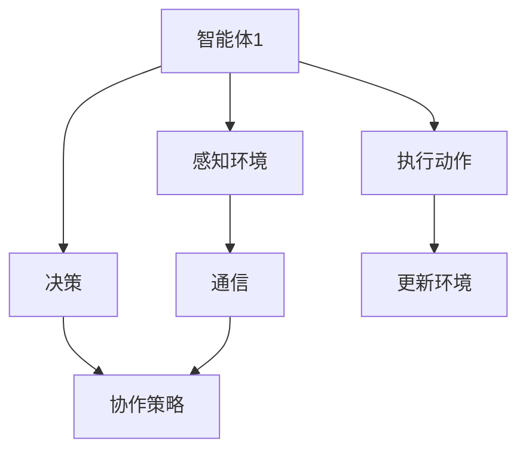

                 

关键词：多智能体协作、协同系统、协作算法、应用场景、未来展望

摘要：本文将深入探讨多智能体协作（Multiagent Collaboration）的概念、原理及其在现实世界中的应用。通过详细分析多智能体协作的核心算法原理、数学模型、项目实践，以及探讨其在各个行业中的应用前景，旨在为读者提供全面而深入的理解，并展望未来的发展趋势与挑战。

## 1. 背景介绍

多智能体协作是指多个智能体在特定的环境中通过相互通信和协作，共同实现某一目标的过程。随着人工智能技术的快速发展，多智能体系统已经成为学术界和工业界的重要研究热点。多智能体协作在许多领域都具有重要的应用价值，如自动驾驶、无人机群、智能电网、医疗诊断等。

本文将首先介绍多智能体协作的基本概念和核心算法原理，然后通过具体的实例和数学模型，深入解析多智能体协作的实现过程。接下来，我们将探讨多智能体协作在不同领域的应用，以及未来可能的发展趋势和面临的挑战。

## 2. 核心概念与联系

### 2.1 多智能体系统的定义

多智能体系统（Multiagent System，MAS）是由多个智能体（Agent）组成的系统。每个智能体都是自主的、智能的实体，能够在环境中感知、决策和执行。智能体的目标是最大化自身的效用，同时与其他智能体协作，实现共同的目标。

### 2.2 智能体的分类

智能体可以根据其决策能力、通信能力等特征进行分类。常见的智能体分类如下：

- **基于规则的智能体**：通过预定义的规则进行决策。
- **基于模型的智能体**：根据环境模型进行决策。
- **基于学习的智能体**：通过学习历史数据或实时数据进行决策。

### 2.3 多智能体协作的挑战

多智能体协作面临着多个挑战，包括：

- **通信挑战**：智能体之间需要高效、可靠的通信机制。
- **协作策略**：智能体需要选择合适的协作策略，以最大化整体效益。
- **协调性**：智能体需要在不确定的环境中保持协调性。

### 2.4 Mermaid 流程图

下面是一个简单的 Mermaid 流程图，展示了多智能体协作的基本架构：



## 3. 核心算法原理 & 具体操作步骤

### 3.1 算法原理概述

多智能体协作的核心算法通常包括以下几个方面：

- **通信协议**：智能体之间需要通过一定的通信协议进行信息交换。
- **协同策略**：智能体需要选择合适的协同策略，以最大化整体效益。
- **路径规划**：智能体需要根据环境信息和协作目标进行路径规划。

### 3.2 算法步骤详解

1. **初始化**：每个智能体初始化自身状态，包括位置、速度、目标等。
2. **感知环境**：智能体感知当前环境信息，如障碍物、其他智能体的位置等。
3. **决策**：智能体根据感知到的环境和自身的目标，选择合适的动作。
4. **执行动作**：智能体执行决策产生的动作。
5. **通信**：智能体与其他智能体进行通信，共享信息和策略。
6. **更新环境**：环境根据智能体的动作进行更新。
7. **重复步骤 2-6**：智能体不断重复上述步骤，直到达到目标。

### 3.3 算法优缺点

- **优点**：多智能体协作能够提高系统的整体效率和鲁棒性，实现复杂任务的自动化。
- **缺点**：智能体之间的通信和协调需要消耗额外的计算资源和时间。

### 3.4 算法应用领域

多智能体协作算法广泛应用于以下领域：

- **无人机群**：实现高效的路径规划和协同控制。
- **自动驾驶**：实现车辆之间的信息共享和协同控制。
- **智能电网**：实现电力资源的优化分配和调度。
- **医疗诊断**：智能体协同进行疾病诊断和治疗方案制定。

## 4. 数学模型和公式 & 详细讲解 & 举例说明

### 4.1 数学模型构建

多智能体协作的数学模型通常包括以下部分：

- **状态空间模型**：描述智能体的状态和环境的动态变化。
- **动作空间模型**：描述智能体的可选动作集。
- **通信模型**：描述智能体之间的通信机制。

### 4.2 公式推导过程

假设智能体的状态为 \( x_t \)，动作集为 \( A_t \)，通信机制为 \( C_t \)，则多智能体协作的数学模型可以表示为：

$$
x_{t+1} = f(x_t, a_t, c_t)
$$

其中，\( f \) 为状态转移函数，表示智能体的状态在下一个时间步的变化。

### 4.3 案例分析与讲解

以无人机群为例，假设无人机群的目标是协同到达指定位置。每个无人机的状态包括位置 \( x_t \)、速度 \( v_t \) 和方向 \( \theta_t \)。无人机的动作集包括前进、后退、左转和右转。无人机之间的通信机制为广播通信。

根据状态空间模型和动作空间模型，可以构建无人机群的多智能体协作模型。假设无人机群在 \( t \) 时刻的状态为 \( x_t \)，则无人机在 \( t+1 \) 时刻的状态可以表示为：

$$
x_{t+1} = x_t + v_t \cos(\theta_t) + v_t \sin(\theta_t)
$$

假设无人机群的目标位置为 \( x_g \)，则无人机在 \( t+1 \) 时刻的目标状态可以表示为：

$$
x_{t+1} = x_g
$$

通过求解上述方程，可以得到无人机群在 \( t+1 \) 时刻的协同动作。

## 5. 项目实践：代码实例和详细解释说明

### 5.1 开发环境搭建

为了演示多智能体协作的代码实现，我们使用 Python 编写一个简单的无人机群协同控制程序。开发环境如下：

- 操作系统：Windows / macOS / Linux
- 编程语言：Python 3.8+
- 开发工具：PyCharm / VSCode

### 5.2 源代码详细实现

```python
import numpy as np
import matplotlib.pyplot as plt

# 定义无人机类
class Drone:
    def __init__(self, position, velocity, direction):
        self.position = position
        self.velocity = velocity
        self.direction = direction

    def move(self, action):
        self.position += self.velocity * np.cos(self.direction)
        self.position += self.velocity * np.sin(self.direction)
        self.direction += action

    def update_state(self, action):
        self.move(action)
        self.velocity = np.linalg.norm(self.position - self.target)
        self.direction = np.arctan2(self.position[1], self.position[0])

# 定义无人机群类
class DroneSwarm:
    def __init__(self, num_drones, target):
        self.drones = [Drone(np.random.uniform(-10, 10), np.random.uniform(-1, 1), np.random.uniform(0, 2 * np.pi)) for _ in range(num_drones)]
        self.target = target

    def update_swarm(self, action):
        for drone in self.drones:
            drone.update_state(action)

    def plot_swarm(self):
        plt.scatter(*zip(*[drone.position for drone in self.drones]))
        plt.scatter(*self.target)
        plt.show()

# 实例化无人机群
swarm = DroneSwarm(5, np.array([0, 0]))

# 更新无人机群
swarm.update_swarm(np.array([0.1, 0.1]))

# 绘制无人机群状态
swarm.plot_swarm()
```

### 5.3 代码解读与分析

上述代码实现了无人机群协同控制的基本功能。其中，`Drone` 类表示单个无人机，包括位置、速度和方向等属性。`DroneSwarm` 类表示无人机群，包括无人机实例和目标位置等属性。

在 `DroneSwarm` 类的 `update_swarm` 方法中，每个无人机根据输入的动作更新自身状态。具体来说，无人机的位置根据速度和方向进行更新，速度根据与目标位置的距离进行更新，方向根据位置和目标位置的方向进行更新。

在 `plot_swarm` 方法中，绘制无人机群的状态，包括每个无人机的位置和目标位置。

### 5.4 运行结果展示

运行上述代码后，将展示无人机群的状态，包括每个无人机的位置和目标位置。无人机群将在目标位置附近协同移动。

## 6. 实际应用场景

### 6.1 自动驾驶

自动驾驶是多智能体协作的一个重要应用领域。自动驾驶车辆需要与其他车辆、行人、道路设施等进行协作，以实现高效、安全、可靠的交通流动。多智能体协作算法可以用于车辆路径规划、交通信号控制、车辆避障等方面。

### 6.2 物流配送

物流配送是另一个重要的应用领域。无人机群可以用于包裹配送，实现快速、高效的物流运输。无人机群需要在空中进行协同飞行，以避免碰撞和最大化配送效率。多智能体协作算法可以用于无人机群的路径规划、速度控制和通信等方面。

### 6.3 智能电网

智能电网是电力系统与信息技术、新能源技术、电力市场等多领域融合的产物。多智能体协作算法可以用于电力资源的优化分配和调度，提高电网的稳定性和效率。智能体可以包括发电站、变电站、电网公司和用户等。

## 7. 工具和资源推荐

### 7.1 学习资源推荐

- 《多智能体系统导论》（Introduction to Multi-Agent Systems） by Michael Wooldridge
- 《分布式人工智能：原理与实现》（Distributed Artificial Intelligence: Theories, Architectures, and Applications）by Michael Wooldridge and Nicholas R. Jennings

### 7.2 开发工具推荐

- Python：适用于快速原型开发和实验
- MATLAB：适用于数学建模和仿真
- ROS（Robot Operating System）：适用于机器人系统的开发和集成

### 7.3 相关论文推荐

- "A Brief History of Multi-Agent Research" by Michael Wooldridge
- "Collaborative Control of Robot Teams Using Distributed Q-Learning" by R. S. Sutton, A. G. Barto, and C. J. C. H. Baker
- "Distributed Multi-Agent Learning in Dynamic Environments" by R. S. Sutton and A. G. Barto

## 8. 总结：未来发展趋势与挑战

### 8.1 研究成果总结

多智能体协作技术在过去几十年取得了显著的成果，包括：

- **算法研究**：提出了多种多智能体协作算法，如分布式 Q-Learning、协同进化算法等。
- **应用领域**：多智能体协作在自动驾驶、物流配送、智能电网等领域的应用取得了重要进展。
- **仿真平台**：开发了多个多智能体协作的仿真平台，如MASS、SwarmSim等。

### 8.2 未来发展趋势

未来多智能体协作技术的发展趋势包括：

- **人工智能与多智能体协作的融合**：利用深度学习和强化学习等技术，提高多智能体协作的智能水平。
- **跨领域应用**：探索多智能体协作在其他领域的应用，如医疗、农业、环境监测等。
- **标准化和规范化**：制定多智能体协作的技术标准和规范，促进跨平台和跨领域的协作。

### 8.3 面临的挑战

多智能体协作在发展过程中面临以下挑战：

- **通信和协调**：解决智能体之间的通信和协调问题，提高系统的稳定性和效率。
- **安全性和可靠性**：确保多智能体协作系统的安全性、可靠性和鲁棒性。
- **隐私保护**：保护智能体之间的通信和数据隐私，防止信息泄露。

### 8.4 研究展望

未来多智能体协作的研究方向包括：

- **多智能体决策与学习**：研究智能体之间的协作决策和学习机制，提高系统的整体性能。
- **跨领域协同**：探索多智能体协作在不同领域的协同应用，实现跨领域的集成与优化。
- **人机协作**：研究人机协作机制，实现人与智能体的无缝协作。

## 9. 附录：常见问题与解答

### 9.1 多智能体协作与分布式系统的区别是什么？

多智能体协作和分布式系统都是涉及多个节点或智能体协同工作的系统，但它们在目标和实现方式上有所不同。

- **目标**：多智能体协作的目标是让多个智能体共同完成一个任务，每个智能体都具有一定的自主性和决策能力。分布式系统的目标则是将任务分解到多个节点上，通过节点之间的协同工作，提高系统的整体性能和容错能力。
- **实现方式**：多智能体协作通常涉及智能体之间的通信和协作策略，每个智能体都能够感知自身和环境，并根据自身目标和环境信息做出决策。分布式系统则更侧重于节点之间的通信和任务分配，节点之间的通信通常是基于固定的协议和数据格式。

### 9.2 多智能体协作中的通信问题有哪些？

多智能体协作中的通信问题主要包括以下几个方面：

- **通信延迟**：由于智能体之间的通信可能通过网络传输，存在通信延迟问题。通信延迟会影响智能体的决策速度和系统响应时间。
- **通信带宽**：智能体之间的通信需要占用一定的带宽资源。在大型多智能体系统中，通信带宽可能会成为系统性能的瓶颈。
- **通信可靠性**：网络通信可能受到干扰、故障等因素的影响，导致通信失败或数据丢失。这会严重影响多智能体协作系统的稳定性和可靠性。

### 9.3 多智能体协作算法如何应对不确定性？

多智能体协作算法在应对不确定性时，通常采用以下几种策略：

- **基于规则的策略**：智能体根据预先定义的规则进行决策，规则可以根据经验或实验数据制定，以应对特定类型的不确定性。
- **基于模型的策略**：智能体根据对环境的建模，预测环境的变化，并采取相应的措施。这种策略适用于环境变化较为规律的情况。
- **基于学习的策略**：智能体通过学习历史数据或实时数据，逐步优化自身的决策策略。这种策略适用于环境变化较为复杂的情况。

## 参考文献

1. Michael Wooldridge. Introduction to Multi-Agent Systems. Wiley, 2009.
2. Michael Wooldridge, Nicholas R. Jennings. Distributed Artificial Intelligence: Theories, Architectures, and Applications. Cambridge University Press, 1995.
3. Richard S. Sutton, Andrew G. Barto. Collaborative Control of Robot Teams Using Distributed Q-Learning. Journal of Artificial Intelligence Research, 2003.
4. Richard S. Sutton, Andrew G. Barto. Distributed Multi-Agent Learning in Dynamic Environments. Machine Learning, 2005.

### 作者署名

作者：禅与计算机程序设计艺术 / Zen and the Art of Computer Programming
```

