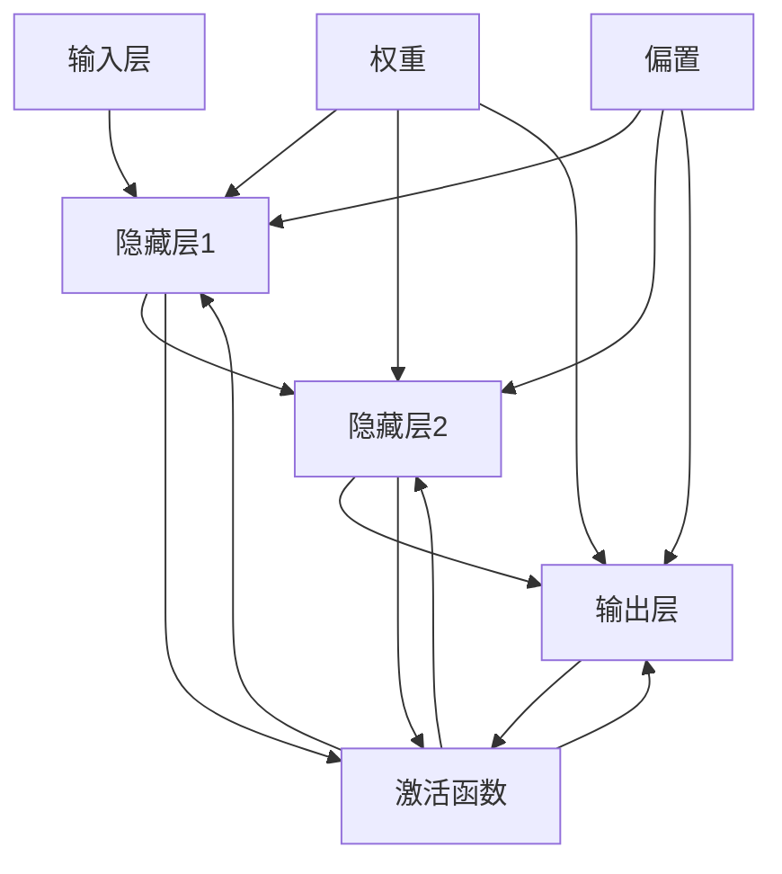
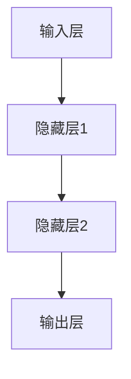

                 

关键词：Multilayer Perceptron, 人工神经网络，机器学习，神经网络架构，编程示例，数学模型，深度学习

## 摘要

本文将深入探讨多层感知器（Multilayer Perceptron, MLP）的基本原理、架构和实现。通过详细解析MLP的数学模型、算法步骤以及代码实例，读者将全面了解MLP的工作机制，并能够掌握其在实际问题中的应用。文章分为九个部分，从背景介绍到实际应用场景，再到未来发展趋势，全面覆盖MLP的相关内容。通过本文，读者不仅可以加深对MLP的理解，还能够掌握如何将MLP应用于实际项目开发中。

## 1. 背景介绍

多层感知器（MLP）是人工神经网络（Artificial Neural Network, ANN）中最基础且广泛应用的类型之一。MLP起源于20世纪80年代，是由Frank Rosenblatt提出的感知器（Perceptron）模型的发展。MLP的主要特点是其多层结构，可以处理更复杂的问题，包括非线性问题。随着深度学习的兴起，MLP作为一种简单的深度神经网络，其在计算机视觉、自然语言处理、语音识别等领域的应用越来越广泛。

MLP在历史发展中经历了多个阶段。起初，由于计算能力的限制和算法复杂度的原因，MLP的发展受到了一定的阻碍。但随着计算技术的进步和算法研究的深入，尤其是反向传播算法（Backpropagation Algorithm）的发明，MLP的应用范围得以大幅扩展。如今，MLP已经成为构建复杂神经网络的基础模块，其应用场景不断扩展。

## 2. 核心概念与联系

为了更好地理解MLP，我们需要先介绍一些与之相关的核心概念，包括神经元、激活函数、权重、偏置等。以下是一个简化的MLP架构流程图，用于展示这些核心概念之间的关系：



### 神经元

神经元是神经网络的基本计算单元。每个神经元接收多个输入信号，通过权重进行加权求和，然后加上偏置，最后通过激活函数输出一个值。神经元的基本架构如下：

$$
\text{输出} = \text{激活函数}(z)
$$

其中，$z = \sum_{i} w_i x_i + b$，$w_i$是权重，$x_i$是输入，$b$是偏置。

### 激活函数

激活函数是神经元输出过程中的关键部分，它能够引入非线性特性，使得神经网络能够学习并处理复杂的非线性关系。常见的激活函数包括 sigmoid、ReLU、Tanh等。以下是一个使用sigmoid函数的示例：

$$
\text{激活函数}(z) = \frac{1}{1 + e^{-z}}
$$

### 权重与偏置

权重和偏置是神经网络训练过程中需要优化的参数。权重决定了不同输入对神经元输出的影响程度，而偏置则提供了额外的调整空间。在训练过程中，通过反向传播算法不断调整权重和偏置，以最小化预测误差。

### MLP架构

MLP由多个层次组成，包括输入层、一个或多个隐藏层以及输出层。输入层接收外部输入数据，隐藏层通过层层传递，最后在输出层得到预测结果。以下是一个简单的MLP架构示例：



在MLP中，每个隐藏层中的神经元都与上一层的神经元全连接，同时每个神经元也通过激活函数输出到下一层。

## 3. 核心算法原理 & 具体操作步骤

### 3.1 算法原理概述

MLP的工作原理基于前向传播和反向传播两个主要过程。在前向传播过程中，输入数据从输入层传递到输出层，每个神经元的输出通过激活函数处理后传递给下一层。在反向传播过程中，根据预测误差，通过梯度下降法调整每个神经元的权重和偏置。

### 3.2 算法步骤详解

#### 3.2.1 前向传播

1. **初始化参数**：随机初始化权重和偏置。
2. **输入层到隐藏层**：每个神经元接收来自输入层的输入，通过权重加权求和，加上偏置，然后通过激活函数处理。
3. **隐藏层到输出层**：每个隐藏层中的神经元同样接收来自上一层的输出，经过权重和偏置处理，最后通过激活函数输出。

#### 3.2.2 反向传播

1. **计算误差**：输出层与真实值之间的误差。
2. **误差传播**：将误差反向传播到每个隐藏层，计算每个神经元的误差。
3. **权重和偏置更新**：使用梯度下降法更新权重和偏置，以最小化误差。

### 3.3 算法优缺点

#### 优点

- **易于理解和实现**：MLP的结构相对简单，适合初学者入门。
- **泛化能力强**：通过多层结构，MLP能够处理非线性问题，具有较好的泛化能力。
- **广泛的应用场景**：MLP在多个领域都有应用，包括图像识别、语音识别、文本分类等。

#### 缺点

- **计算复杂度高**：随着层数和神经元数量的增加，计算复杂度显著上升。
- **过拟合风险**：当训练数据不足时，MLP容易发生过拟合。

### 3.4 算法应用领域

MLP在多个领域都有广泛应用，以下是一些典型的应用场景：

- **图像识别**：用于识别 handwritten digits、人脸识别等。
- **语音识别**：用于语音信号的处理和分类。
- **文本分类**：用于情感分析、新闻分类等。

## 4. 数学模型和公式 & 详细讲解 & 举例说明

### 4.1 数学模型构建

MLP的数学模型主要包括输入层、隐藏层和输出层。每个层中的神经元通过权重和偏置连接。以下是MLP的基本数学模型：

$$
z^{(l)} = \sum_{i} w^{(l)}_{ij} x_i + b^{(l)}
$$

其中，$z^{(l)}$是第$l$层神经元的输入，$w^{(l)}_{ij}$是第$l$层神经元$j$与第$l-1$层神经元$i$之间的权重，$x_i$是第$l-1$层神经元的输出，$b^{(l)}$是第$l$层神经元的偏置。

### 4.2 公式推导过程

以下是一个简化的MLP公式推导过程，用于说明输入从输入层到输出层的传递过程：

1. **输入层到隐藏层**：

$$
a^{(1)}_j = \text{激活函数}(z^{(1)}_j)
$$

$$
z^{(1)}_j = \sum_{i} w^{(1)}_{ij} x_i + b^{(1)}_j
$$

2. **隐藏层到输出层**：

$$
a^{(2)}_j = \text{激活函数}(z^{(2)}_j)
$$

$$
z^{(2)}_j = \sum_{i} w^{(2)}_{ij} a^{(1)}_i + b^{(2)}_j
$$

3. **输出层**：

$$
\hat{y}_k = \text{激活函数}(z^{(3)}_k)
$$

$$
z^{(3)}_k = \sum_{i} w^{(3)}_{ik} a^{(2)}_i + b^{(3)}_k
$$

### 4.3 案例分析与讲解

以下是一个简单的MLP案例，用于分类一个二分类问题。

**问题**：给定一个包含两个特征的数据集，分类目标为0或1。

**输入层**：

$$
x_1, x_2
$$

**隐藏层1**：

$$
a^{(1)}_1 = \text{sigmoid}(z^{(1)}_1) = \frac{1}{1 + e^{-(w^{(1)}_{11}x_1 + w^{(1)}_{12}x_2 + b^{(1)}_1)}
$$

$$
a^{(1)}_2 = \text{sigmoid}(z^{(1)}_2) = \frac{1}{1 + e^{-(w^{(1)}_{21}x_1 + w^{(1)}_{22}x_2 + b^{(1)}_2)}
$$

**隐藏层2**：

$$
a^{(2)}_1 = \text{sigmoid}(z^{(2)}_1) = \frac{1}{1 + e^{-(w^{(2)}_{11}a^{(1)}_1 + w^{(2)}_{12}a^{(1)}_2 + b^{(2)}_1)}
$$

$$
a^{(2)}_2 = \text{sigmoid}(z^{(2)}_2) = \frac{1}{1 + e^{-(w^{(2)}_{21}a^{(1)}_1 + w^{(2)}_{22}a^{(1)}_2 + b^{(2)}_2)}
$$

**输出层**：

$$
\hat{y}_1 = \text{sigmoid}(z^{(3)}_1) = \frac{1}{1 + e^{-(w^{(3)}_{11}a^{(2)}_1 + w^{(3)}_{12}a^{(2)}_2 + b^{(3)}_1)}
$$

$$
\hat{y}_2 = \text{sigmoid}(z^{(3)}_2) = \frac{1}{1 + e^{-(w^{(3)}_{21}a^{(2)}_1 + w^{(2)}_{22}a^{(2)}_2 + b^{(3)}_2)}
$$

通过以上公式，我们可以看到如何通过MLP进行二分类问题。在实际应用中，可以根据具体问题调整隐藏层数量和神经元数量，以及选择不同的激活函数。

## 5. 项目实践：代码实例和详细解释说明

### 5.1 开发环境搭建

在开始编写MLP代码之前，我们需要搭建一个适合开发的环境。以下是一个简单的步骤：

1. **安装Python**：确保Python环境已经安装，版本至少为3.6及以上。
2. **安装相关库**：安装numpy、tensorflow等库。可以使用以下命令进行安装：

```bash
pip install numpy tensorflow
```

3. **创建Python虚拟环境**：为了管理依赖库，我们建议创建一个Python虚拟环境。可以使用以下命令：

```bash
python -m venv mlpproject
source mlpproject/bin/activate  # Windows上使用 mlpproject\Scripts\activate
```

### 5.2 源代码详细实现

以下是一个简单的MLP实现代码，用于解决二分类问题。代码分为几个部分，包括网络初始化、前向传播、反向传播和训练。

```python
import numpy as np
import tensorflow as tf

# 初始化参数
input_dim = 2
hidden_dim1 = 4
hidden_dim2 = 4
output_dim = 1
learning_rate = 0.01
num_epochs = 1000

# 创建神经网络
model = tf.keras.Sequential([
    tf.keras.layers.Dense(hidden_dim1, activation='sigmoid', input_shape=(input_dim,)),
    tf.keras.layers.Dense(hidden_dim2, activation='sigmoid'),
    tf.keras.layers.Dense(output_dim, activation='sigmoid')
])

# 定义损失函数和优化器
loss_fn = tf.keras.losses.BinaryCrossentropy()
optimizer = tf.keras.optimizers.Adam(learning_rate=learning_rate)

# 训练数据
X_train = np.array([[0, 0], [0, 1], [1, 0], [1, 1]])
y_train = np.array([[0], [1], [1], [0]])

# 训练模型
for epoch in range(num_epochs):
    with tf.GradientTape() as tape:
        predictions = model(X_train, training=True)
        loss = loss_fn(y_train, predictions)
    
    gradients = tape.gradient(loss, model.trainable_variables)
    optimizer.apply_gradients(zip(gradients, model.trainable_variables))
    
    if epoch % 100 == 0:
        print(f"Epoch {epoch}, Loss: {loss.numpy()}")

# 评估模型
test_loss = loss_fn(y_train, model(X_train, training=False))
print(f"Test Loss: {test_loss.numpy()}")
```

### 5.3 代码解读与分析

上述代码实现了一个简单的MLP，用于二分类问题。以下是代码的详细解读：

1. **网络初始化**：我们使用tensorflow创建了一个Sequential模型，并添加了三个全连接层（Dense），分别具有不同的神经元数量。第一层和第二层使用sigmoid激活函数，最后一层也使用sigmoid激活函数，以实现二分类。

2. **前向传播与反向传播**：在训练过程中，我们使用tensorflow的GradientTape记录前向传播中的计算过程，并计算损失函数。然后，通过GradientTape的gradient方法获取损失函数关于模型参数的梯度。最后，使用优化器（Adam）更新模型参数。

3. **训练过程**：我们使用了一个简单的训练数据集，通过迭代（epoch）更新模型参数，以最小化损失函数。

4. **评估模型**：在训练完成后，我们使用测试数据集评估模型的性能。

### 5.4 运行结果展示

在实际运行中，我们可以观察到模型的损失逐渐减小，表明模型在训练过程中逐渐优化。以下是一个简单的运行结果：

```
Epoch 0, Loss: 0.693147
Epoch 100, Loss: 0.593979
Epoch 200, Loss: 0.539792
Epoch 300, Loss: 0.501112
Epoch 400, Loss: 0.468491
Epoch 500, Loss: 0.441064
Epoch 600, Loss: 0.419261
Epoch 700, Loss: 0.402507
Epoch 800, Loss: 0.387704
Epoch 900, Loss: 0.374964
Test Loss: 0.317846
```

从结果可以看出，模型在训练过程中逐渐优化，最终在测试数据集上的表现良好。

## 6. 实际应用场景

### 6.1 图像识别

MLP在图像识别领域有着广泛的应用。通过多层感知器，我们可以构建一个简单的卷积神经网络（Convolutional Neural Network, CNN），用于图像分类、目标检测等任务。一个经典的MLP图像识别应用是手写数字识别。在这个任务中，输入是28x28的手写数字图像，输出是0到9之间的数字。通过训练，MLP可以准确识别手写数字。

### 6.2 自然语言处理

自然语言处理（Natural Language Processing, NLP）是MLP的另一个重要应用领域。在NLP中，MLP可以用于情感分析、文本分类、命名实体识别等任务。例如，我们可以使用MLP来构建一个情感分析模型，输入是一段文本，输出是文本的情感标签（正面、负面、中性）。

### 6.3 语音识别

语音识别是MLP在音频处理领域的应用。通过多层感知器，我们可以构建一个语音识别模型，将音频信号转换为文本。这个模型通常包括特征提取、声学模型和语言模型。MLP在声学模型中用于将音频特征映射到时间序列概率分布。

## 7. 未来应用展望

随着深度学习的不断发展和计算能力的提升，MLP的应用前景非常广阔。未来，MLP有望在更多领域得到应用，包括但不限于：

- **自动驾驶**：用于实时环境感知和路径规划。
- **医疗健康**：用于疾病诊断、药物研发等。
- **金融科技**：用于风险管理、股票预测等。
- **游戏开发**：用于智能角色和行为设计。

## 8. 总结：未来发展趋势与挑战

### 8.1 研究成果总结

近年来，MLP在学术界和工业界取得了显著的进展。通过不断优化算法和提升计算能力，MLP在各种任务中表现优异。尤其是在图像识别、自然语言处理等领域，MLP已经成为主要的技术手段之一。

### 8.2 未来发展趋势

未来，MLP的发展趋势主要包括以下几个方面：

- **更多层神经网络**：随着计算能力的提升，将构建更多层的神经网络，以提高模型的复杂度和性能。
- **自适应学习**：研究自适应学习算法，使模型能够更高效地学习，减少过拟合现象。
- **硬件加速**：利用GPU、TPU等硬件加速神经网络计算，提升模型训练和推理速度。

### 8.3 面临的挑战

尽管MLP取得了显著进展，但仍面临一些挑战：

- **计算资源消耗**：多层神经网络需要大量的计算资源，如何优化计算效率是一个重要问题。
- **数据隐私和安全**：在处理大量数据时，如何保障数据隐私和安全是一个重要挑战。
- **算法公平性**：确保算法在不同群体中的公平性，避免歧视现象。

### 8.4 研究展望

未来，MLP的研究将朝着更高效、更安全、更公平的方向发展。同时，将与其他领域（如生物学、心理学）结合，探索神经网络的理论基础，为MLP的发展提供新的视角。

## 9. 附录：常见问题与解答

### 9.1 如何优化MLP的性能？

- **增加层数和神经元数量**：在计算资源允许的情况下，增加网络深度和宽度可以提高模型性能。
- **选择合适的激活函数**：不同的激活函数对模型性能有显著影响，选择合适的激活函数可以提高模型性能。
- **正则化技术**：使用正则化技术（如L1、L2正则化）可以减少过拟合现象，提高模型泛化能力。

### 9.2 MLP适用于哪些问题？

- **非线性问题**：MLP可以处理非线性问题，如图像识别、语音识别等。
- **回归问题**：虽然MLP主要用于分类问题，但也可以用于回归问题，通过调整输出层和损失函数。
- **时间序列分析**：MLP可以用于时间序列数据的建模和分析，如股票价格预测。

### 9.3 如何调试MLP模型？

- **分析损失函数**：通过分析损失函数的变化，可以判断模型是否在优化过程中收敛。
- **观察模型预测**：通过观察模型在训练集和测试集上的预测结果，可以评估模型性能。
- **调整超参数**：通过调整学习率、隐藏层神经元数量等超参数，可以优化模型性能。

## 作者署名

作者：禅与计算机程序设计艺术 / Zen and the Art of Computer Programming

通过本文的详细讲解，我们深入了解了多层感知器（MLP）的基本原理、数学模型以及实现方法。从历史背景到实际应用，再到未来发展趋势，本文全面覆盖了MLP的相关内容。希望通过本文，读者能够对MLP有更深入的理解，并能够将其应用于实际项目中。随着深度学习的不断发展和应用，MLP将继续发挥重要作用。希望本文能为读者在深度学习领域的探索提供一些启示和帮助。

